# AtDevcat

## 22/08/31

처음으로 업무 일지 기록 시작합니다.

최근 서버 측 GameServer의 Channel Update가 aws ec2 인스턴스에서 실행 시 공회전 하는 현상이 있었다. 너무 상식 밖의 현상이거니와 팀장님이 체크해봤을 때 발생 원인도 구체화하지 못했다.

게임서버의 다수의 채널 업데이트는 병렬 처리된다. C# Task 에 할당되게 되는데, 어찌 된 일인지 실행되어야 할 태스크 중 일부가 놀고 있다. 게임 서버의 프레임 배리어는 모든 채널이 업데이트 되기 전에는 해당 프레임을 유지하고 다음 프레임으로 넘어가지 못하도록 막는다. 몇 개 태스크가 먹통이 되니 다른 정상적인 채널들이 배리어에 걸려 다음 프레임으로 넘어가지 못하고 있었다.

어느 때와 같은 환경이었을 텐데 갑자기 왜 이런 일이 벌어진 걸까... 결국 채널 업데이트 시에는 Task 대신 Thread를 직접 조작하는 방식으로 수정되었다. (C# ThreadPool의 Task 할당/처리 지원을 포기하고 Thread를 직접 조작하게 되면 어느 정도 성능상의 이점을 포기하는 셈이지만, 프로그래머가 직접 관리하는 수행흐름은 상태 추적이 쉽고 디버깅이 유리하다.)

## 22/09/01

프레임 배리어... 프레임 동작을 처리하는 수행 흐름이 중간에 오류가 발생해서 스택이 되감긴다. 예외를 catch한 쪽에서는 수행 흐름이 끊긴 시점이 어딘지, 프레임 배리어 안인지 밖인지 알 수 없다. 이 경우에는 어떻게 처리해야 할까??

당연히 프레임 배리어 안에서 발생할 수 있는 예외는 가능한 한 막아두었다. 그 외에 코드에서는 언뜻 보기에 예외가 발생할 수 있는 상황이 있을까 싶을 정도로 꼼꼼히 짜두었다. 정말 RAM이 꽉 차지 않는 이상 뭐가 터질 수 있나 싶을 정도로. 그렇지만 C# 을 사용하다 보면 절대 안심할 수 없다더라.

## 22/09/02

MM 서버 모니터링 도구로는 [Grafana](https://grafana.com/) 를 사용합니다.

에러 리포트 용 서버를 따로 올리고, 주기적으로 수집한 오류를 요약해서 팀즈로 보고합니다. 팀즈로 보고할 때는 [Incoming WebHook](https://docs.microsoft.com/en-us/microsoftteams/platform/webhooks-and-connectors/how-to/add-incoming-webhook)을 사용합니다.

- [MessageCard PlayGround](https://messagecardplayground.azurewebsites.net/)

## 22/09/14

게임 실행 전에 패치 데이터 다운로드 속도가 150Mbps 를 넘지 못해서 기술실에서 잠시 소동이 있었는데, 알고보니 사내 wifi 의 최대 속도가 150Mbps로 제한되어 있었다. 인터넷 기사 아저씨가 사기 친 것이었다....

서버 프로그래밍 상에서 두려운 일 몇 가지 중에 하나는 아마 서버 프로세스의 어딘가가 잘못 되어서 디바이스의 메모리나 cpu 자원을 쥐도 새도 모르게 잠식해버리는 것이다... 그래서 디바이스 모니터링이 필수고 만약에 사태에 대비해 서버 머신을 분리하는 것이 아닐까
(사실 오늘 무한 루프가 발생하자 서버가 머신 cpu를 다 먹어버리고 드러누워버리는 현상이 있었다)

간헐적으로 실패하는 테스트. 중요한 빌드 파이프라인에서 테스트가 실패하면 노티 메세지가 개발실로 전달된다. 간헐적으로 실패하는 테스트들 그 중에서도 당장 해결하기는 까다로운 것들이 여기서 문제가 됬는데, 이런 실패 메세지를 자꾸 보게 되는 사람들이 경각심을 잃어버린다는 것이다. 신뢰를 잃어버리는 것이 가장 큰 문제다.

- 이런 테스트들은 분류를 따로 해야 하는 걸까?? '가끔 고장나는 골칫덩이들' 묶음을 만들고선 실패 횟수를 카운트해서 주기적으로 노티하는 방식은 어떨까?

## 22/09/16

밤새고 난 다음날은 업무를 거의 못했다. 커피나 에너지 드링크 좀 마시면 기운 낼 수 있지 않을까 싶은데 역부족이었다. 정말 잠이 쏟아진다.

서버 내 몬스터 생성 시스템이 고장 나서 수만 마리가 서버에 스폰되었는데, 서버 프로세스가 머신 cpu 를 100% 먹어버려서 문제가 되었다. cpu가 잠식되버려서 원격에서 서버를 강제 종료 시키는 것도 까다롭다.

## 22/09/19

오늘은 깃랩GitLab 이 느려서 많은 사람들이 불편을 느낀 날. 음... 인프라 이슈일 수 있고, 트래픽 이슈일 수 있고 ( 그날 따라 신규 입사자가 많아서 프로젝트 전체 풀 받는다던가), 프로젝트 사이즈 이슈도 고려해봄 직 하다. 아니다. 프로젝트 사이즈가 문제라면 특정한 날에 갑자기 문제가 발견되는 게 아니라 점진적으로 증상이 관측되었어야 한다. 또 뭐가 있을까? 갑자기 프로젝트에 큰 파일이 올라온다?? 이것도 아닐테지.

## 22/09/20

큰 규모의 마일스톤 작업이 마감되는 날이다. 우리 프로젝트는 메인 트렁크에 모든 작업자의 작업물이 올라오는데, 트렁크를 동결시키고 작업자 여러분들의 메인 브랜치 머지를 막고 싶지만 그게 잘 안되고 있다. ㅎ하하하. 형상 관리 작업을 지원하는 서버(merge Cat)에서 따로 동결 시기에 머지 요청을 막는 기능은 없다. (사실 있어야 할 정도로 중요한 기능이 아니긴 하다.)

## 22/09/21

MySql 에 쌓인 게임 에러리포트 1억개를 지우자. 그냥 Delete 명령어를 사용하니 너무 느리더라. 문제의 1억개 데이터 중에는 stacktrace 컬럼이 있고 가변 문자열이다. 아마 파편화가 상당히 진행됬을터다.

MySql 에서는 대량의 데이터를 갱신할 때, 데이터 사본을 먼저 만든 뒤 사본에다가 쿼리를 수행하는 방식이라 한다. 그렇다면 원본 데이터에다가 사본을 덮어씌우도록 동작할 것이다. 그러니 delete 를 사용하기는 까다로운 조건이었다. 에러리포터 서버는 상시 리포트를 받아서 DB 에 추가하기 때문에 라이트 락 경합을 피할 수 없다.

테이블 통째로 truncate 하기로 했다. drop table 과 마찬가진데 mysql 내부에서는 테이블 포인터를 비어있는 테이블로 바꿔치기 하고는 실 데이터는 나중에 차근차근 지워가는지 명령이 즉각 수행되더라. (만약에 남겨야 할 데이터가 있다면, 해당 데이터만 복사 -> 기존 테이블 truncate -> 복사한 데이터를 다시 insert 하는 방식이라면 해결됬을 것이다.)

## 22/09/22

프로젝트 용량이 200GB 에 육박한다. 빌드 대역을 여러 개 관리한다면 1TB 는 금방이다. 오늘은 빌드 머신이 용량 부족으로 드러누웠다 ㅠㅠ 매번 대역 늘릴 때마다 겪게 될 일인데 이럴 때는 해결책이 뭐가 있을까??

1. 머신 용량을 추가 확보
2. git partial clone : 과거 깃 히스토리 중 필요한 것만 선택적으로 내려받는다. 이를 테면 과거의 큰 용량의 파일이 추가되었다가 과거에 제거되었다면 해당 파일의 정보까지 현재 작업환경에서 내려받을 필요는 없을 것이다.

## 22/09/23

매일 쓸 생각은 없었는데 이슈가 하루가 멀다하고 생겨나고 있다.

aws 관련 테라폼 설정을 잘못 만졌다가 AMI(Amazon Machine Image)가 변경되었고 테라폼 코드가 관리하고 있던 전체 인스턴스에 영향이 가버렸다.

일부 인스턴스는 AMI 변경 무시 설정이 있어서 다행히 별 이상이 없었지만은 다른 일부 인스턴스는 완전히 교체되어버렸다. 내부 보관하던 데이터가 전부 날아가버린 셈.

인프라는 변경 내역을 항상 꼼꼼히 살펴야 하는 게 맞다... 사람의 손을 떠나 자동화가 처음 시작되는 곳이니 이곳에서 발생하는 휴먼에러까지 막기는 어렵겠지??

## 22/09/27

프로젝트 형상 관리 툴로 Gitlab을 사용하는데 속도가 느리다. 데브캣만 사용하는게 아니라 넥슨 포함 다른 계열사에서도 사용하는 서비스이기 때문에,

참다 못해서 gitLab 서버를 독립하기로 결정. 프로젝트 저장소를 이주한다.

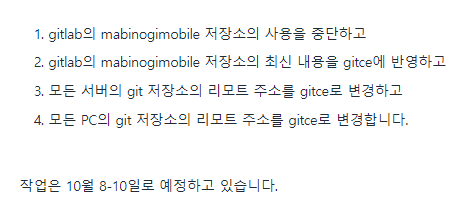

## 22/10/07

갤럭시의 GOS(Game Optimizing Service) 덕분에 기기들이 성능 제한 당하고 있다. 게임 플레이가 어려울 정도로 프레임이 나오지 않고 있다. 해상도/cpu 클럭/gpu 클럭/ 소리/ 밝기 까지 전부 제한된다고 하니 소비자 입장에서는 좋은 기기를 구매했어도 쾌적한 경험을 누릴 수가 없다.

[유니티에서 Samsung AdaptivePerformance를 적용하면 GOS를 해제할 수 있다는 말이 있다.](https://docs.unity3d.com/Packages/com.unity.adaptiveperformance@4.0/manual/user-guide.html)

[삼성 FAQs](https://developer.samsung.com/galaxy-gamedev/ap-userguide/faq_kor.html#:~:text=Adaptive%20Performance%20%EC%A7%80%EC%9B%90%20%EB%8B%A8%EB%A7%90%EC%9D%B4,%EB%8B%A8%EB%A7%90%EC%97%90%EC%84%9C%EB%8A%94%20%EB%8C%80%EB%B6%80%EB%B6%84%20%EC%A7%80%EC%9B%90%ED%95%A9%EB%8B%88%EB%8B%A4)

## 22/10/11

.NET이 제공하는 API로 만든 Windows Service 프로젝트에서 빌드된 프로젝트를 참조하여 진입점(main)을 직접 호출한다. 그런데 프로세스의 stdout, stderr 등이 그대로 유실되는데 이것이 문제

- 프로젝트를 WindowService 형태로 구동하면서 stdout/stderr를 유실하지 않게끔 하는 방법을 찾아야 하는데 [nssm](https://nssm.cc/) 이라는 도구가 있다. 프로세스 우아한 종료, 표준출력 로그 및 로그 파일 로테이션, 자동 재시작 등 다양한 기능을 제공한다.

## 22/10/12

유니티의 IL2CPP(Intermediate Launguage to C++)

IL은 코드를 컴파일해서 기계어에 가깝지만 특정 CPU에 의존적이지 않은 중간단계의 언어를 생성합니다만은, 이 IL은 IOS 애플리케이션에서 막혀있는 상태다. (JIT를 지원하지 않는다)

C#으로 만든 프로그램을 IOS에서 돌리려면 인터프리팅 해야해서 느리니까 유니티는 모바일 빌드를 뽑을 때 IL을 C++ 로 번역한답니다.

문제는 IL2CPP는 C# 동작을 과도하게 기계적으로 해석했다는 것이고요. 예를 들어 static 필드 초기화가 있는 클래스의 static 메서드에는 첫머리마다 '이 클래스가 초기화되어있지 않으면 초기화하자' 라는 코드가 적혀있다고 합니다.
- 쓸데없는 명령을 거치기 때문에 인스트럭션 캐시 손해를 보고
- 전역변수 포인터, 그리고 그것이 가리키는 객체의 has_ctor와 is_ctor_finished를 건드려서 캐시 미스가 납니다.

프로그램을 시작할 때 static 필드 초기화를 미리 진행한다면, 그런 코드는 필요가 없겠죠.

+ `Dictionary<int, *>` 보다 `Dictionary<string, *>` 가 20배 느리다고 하더라. 클라이언트 최적화 과정에서 지적되는 병목점
+ IL2CPP 환경을 매번 체크해야 해서 골치가 아프다.

## 22/10/13

에러리포터에는 하루 수십만 건의 리포트가 제보된다. 과거 프로젝트에서 비슷하게 센트리를 활용하던 시절에는, 들어오는 데이터 양이 많아지면 그대로 서버 유지 비용에 반영된다는데... 과거에는 이를 대비한 구현이 따로 있었던 듯 하다.

## 22/10/14

네트워크 레이턴시 대응.

크게 볼 때 두 가지 대응 방향이 있다.

1. 동기화 값 보간 (Interpolation) : 패킷은 네트워크 상황에 따라 뚝뚝 끊어져 날아올 수 있다. 비연속적인 상태를 보간해서 클라아언트 상에서는 연속적인 값 변화 상태를 보여준다.
2. 예측 (Extrapolation) : 어떤 물체가 한 방향으로 움직이고 있을 때, 클라이언트는 앞으로 짧은 시간동안 그 물체가 가던 방향 그대로 이동하고 있을 것이라고 예상할 수 있다. 클라이언트는 통계에 근거해 서버의 다음 업데이트 틱에 예상치를 사용한다.

## 22/10/17

주말에 판교 sk 데이터 센터에서 불이 나서 카카오 계열 서비스가 완전히 먹통이 되버리는 대사건이 있었다. 같은 데이터 센터를 사용하고 있다는 네이버는 화재 이후 얼마 지나지 않아 서비스가 복구 됐지만 카카오는 장장 8시간이 지나서야 일부 서비스를 겨우 복구 시켰을 뿐이고 완전 복구까지는 하루가 넘게 걸렸다.

그리고 오늘, 카카오는 지옥같은 월요일을 맛보고 있다. 개장과 함께 카카오 주식은 10% 가까이 추락했고, 몸값 비싼 개발자들을 데려다가 서비스 안전성 관리는 어떻게 하고 있냐는 비아냥에, 카카오 그룹 전 의장인 김범수가 국정감사에 출석요구를 받게되질 않나 경쟁사들은 이때다 싶어 자사 메신저를 광고하고 있다.

우리 프로젝트에서도 메신저 서버 안전성 관련 토론장이 열렸다.

## 22/10/19

- [액체괴물 ASMR #38 - 편안한 슬라임 영상 모음](https://youtu.be/wYZBKu1C6yI)

대표님이 게임 사운드 이펙트 디렉션 하시는 중 참고자료로 링크 걸어둔 영상이다.

게임 디렉션 하는 것을 보다 보면 조금 무섭기도 하다. 백엔드 로직, 보상 심리, 비쥬얼 적인 텍스쳐, 사운드의 질감 어디까지 봐야 되는 걸까. 너무 방대해서 자기 생활을 잃어버리는 건 아닐지 걱정이 들 정도다.


## 22/10/21

레이턴시 테스트 중 발생한 문제들. 네트워크 환경은 서버에서 중요하게 다뤄야 할 변수다. 최근에서야 레이턴스 테스트를 해보면서 클라이언트 측에 부작용이 발생하는 것을 파악했는데, 레이턴시 테스트는 좀 더 이르게 확인했어야 했나 싶다.

그렇지만 테스트를 한다고 할 때 자동화는 어렵다. 런칭 전 개발 시기에는 게임 플레이 시퀀스가 자꾸 변해서 테스트 범위을 정의하기가 어렵고 서버 프로토콜이나 클라 측 인터페이스가 언제 어떻게 변할지 예측할 수 없다. 음... 이제서야 레이턴시 취약점이 발견된 것을 너무 문제 삼는 것은 너무 과한 지적일까?

개발 과정에서 중간중간 주기적으로 레이턴시 안정성 체크해 줬어도 좋았을 것이다. 어려울 것 없다. 이번 네트워크 레이턴시 테스트에서는 요 툴을 사용했다. [Clumsy](https://jagt.github.io/clumsy/)

## 22/10/26

메이플 스토리 같은 경우는 이벤트 기간에 DB 응답 시간이 1시간 까지 지연되는 케이스가 있다고 한다. 인프라 조직에서 DB 응답성은 굉장히 예민한 주제라서 우리 서버 팀에게도 이런 저런 요구사항이 밀려오는 모양이다. 트래픽이 몰리는 상황에서도 최대한 빨리 대응할 수 있어야 한다. 캐시 효율을 최대한 높여야 할 것이다.

- 카카오에서는 모든 DB 마다 캐시를 달아놓는다고 한다. 적어도 우리 서버에서는 계정 접속 관련한 DB 요청에는 이런 처리가 들어가야 하지 않을까... 아니다. 첫 로그인 시점에서는 계정 정보를 캐싱한다는 게 어려울 수 있겠구나.

- 지스타에 작품 출품할 때에는 별의 별 상황이 다 있다고 한다. 보안문제가 대표적이다. 시연 기기에서는 와이파이를 차단해버리고서는 시연 기기들은 폐쇄망에 배포된 서버에 접속하게 하거나, 심지어는 기기마다 자체적으로 로컬 서버를 돌리고서는 룩백 ip로 서버 접속했다고 한다...

## 22/10/27

가끔 이름을 고민할 땐 대상의 성질이 아니라, 대상을 대하는 주체의 태도를 고려하는 것이 좋을 수 있다.

## 22/10/31

중간 상태를 주의하자. 클래스 타입 네이밍을 결정할 때, 약점이 있다면 숨기지 말고 드러내자. 만약 자기 완결성을 보장하지 못하는 객체가 거짓 네이밍으로 작업자를 속인 때, 여러 사람을 고생시킬 가장 쓰라린 버그가 나타난다.

## 22/11/01

서버-클라 이동 동기화 전략 Interpolation / Extrapolation 기법 중, Interpolation 전략이 프로젝트에서 사용되기로 채택되었다. (액터 간 충돌처리를 연산하기 위해서)

이런 내삽 동기화(Interpolation 동기화를 프로젝트 내부 용어로) 기법의 문제점은 서버와 클라의 위치 동기화 과정 중 차이가 발생할 수 있는 것이고, 이것을 극복하고자 점진적으로 동기화 위치로 슬슬 맞춰가는 지연 처리 과정이 있다. 

더 큰 문제점은 내삽 동기화의 기술적 맥락을 컨텐츠 기획자/개발자가 사전에 인지하고 있어야 한다는 것이다. 작업 중인 컨텐츠가 이동 기능을 베이스로 깔고 있다면!! 물론 스킬이나 자동 이동 부터 시작해서 이동 시스템은 모든 컨텐츠에서 한 부분을 차지하고 있다. 물론 작업자들이 이런 깊은 부분까지 인지하고 있을 리 없다!! 당연히 버그는 하루가 지나기 무섭게 터져나온다. 

아이러니하게도 이런 약점을 지적하면서 내삽 동기화를 반대했던 개발자에게 이동 버그 일감이 쏟아지는 중이다 ㅠㅠ

## 22/11/04

- 멀티스레딩 코드를 짤 때는 스레드를 잘 재울 줄도 알아야 한다. 너무 열심히 일 시키면 CPU를 잠식해버릴 수 있다. 그렇게 된다면 다른 스레드가 자기 할 일을 못하고 컴퓨터가 열을 낸다.
- 사내테스트 중... 클라이언트 메모리 이슈가 있어서 모바일 기기는 아이폰 프로 말고는 사용하지 말라는 지침이 있다....
- 클라이언트 UI 이벤트에서 타이밍 문제가 발생했다. 로그인 버튼을 누른 뒤에 서버로 로그인 요청을 보내게 되는데, 로그인 요청을 동시에 여러 개를 보낼 이유는 없으니 한번 누른 버튼을 또 누르지 않게끔 락을 걸어야 한다.
  - ui 이벤트는 큐를 거쳐서 지연 처리되고 있는데 락 거는 시점이 이벤트 지연 처리될 때이다. 그러니 로그인 버튼을 동시에 따닥 연타했을 때 운이 나쁘다면 서버로 로그인 요청을 두 번 보내서 말썽을 일으키게 된다.
- 과거 클라이언트 프로파일링을 진행하면서 화면에 다수의 캐릭터가 있을 때 메모리 점유정도를 측정했는데, 시연기기 기준 화면에 캐릭터 10명이 넘어가면 메모리 크래시가 발생하는 모양이다. 그래서 서버팀에게 미션이 내려왔는데, 채널에 캐릭터를 분배할 때 가급적이면 미리 결정된 정원 수 (10명)을 넘기지 않게끔 조치하는 것

## 22/11/07

- .NET 의 시스템 타이머는 15.6msec 마다 운영체제로 부터 인터럽트를 받는다. 즉... 1msec 단위의 해상도가 필요하다면 큰 곤란을 겪게 될 것이라는 것...

- [AutoResetEvent.WaitOne Intervals](https://social.msdn.microsoft.com/Forums/vstudio/en-US/2befa8c3-7be6-48ca-b999-46697c78d55b/autoreseteventwaitone-intervals?forum=vbgeneral)
- 윈도우 환경이라면 일단 대안이 있다. [how to set timer resolution from C# to 1 ms?](https://stackoverflow.com/questions/15071359/how-to-set-timer-resolution-from-c-sharp-to-1-ms)
- 리눅스라면 커널 옵션을 수정할 수 있다고 한다.

## 22/11/08

- [Change assembly name](https://answers.unity.com/questions/1200398/change-assembly-name.html)
- 유니티의 어셈블리 이름 (Assembly-CSharp)을 수정하는 방법. 참 보면서 어떻게 바꾸는 건가 싶었다.

## 22/11/11

- 서버가 cpu를 많이 잡아먹는다. 전사테스트 당시 200 여 명의 플레이어가 입장했는데, 8코어 cpu 20%를 사용하고 있었다고 한다. 16코어 cpu에서는 지금에 반 정도해서 10% 정도를 사용하게 될 것이고 평균 cpu 사용량을 50~60% 로 유지한다고하면 게임서버 1대 당 1000명의 플레이어를 감당할 수 있다.
- 자, 우리 게임의 동접 목표치는 30만 명이다. 단순 계산해서 게임 서버는 300대가 필요한 것.
- 초당 프레임 레이트를 줄여야 할 지도 모르겠다. 캐릭터 충돌 처리를 위해 cpu 부하를 감수하고 있지만 언제 타협이 시작될 지 모른다...

## 22/11/14

- 서버에서 클라가 보낸 패킷을 처리하는데 패킷 핸들링 동작을 수행하는 스레드는 중간에 다른 스레드로 교체되지 말아야 하는 대전제가 깨졌다. DB 정보를 기록하는 패킷은 금전적 가치를 가진다. 절대 안전이 철칙인데, 이런 현상이 발생하자 DB 데이터 갱신 순서가 꼬여버렸다.
- 라이브에서 발생했다면 얼마나 끔찍했을지 상상이 안가는 수준이다. 가챠 패킷에서 터진다면 회사로 소송이 들어올 수도 있다...

## 22/11/15

- 클라이언트 쪽에 메모리 풀 관련 이야기가 나왔다.
  - 풀에서 꺼낸 자원을 돌려보내야 하는데 그냥 버렸다. -> GC가 처리하므로 크게 문제가 아님
  - 풀로 돌려보낸 뒤에 건드렸다. -> 고약한 버그가 터질 수 있음.

대략 보니 풀로 돌아간 객체 참조가 남아서 문제가 생겼던 모양이다. 레퍼런스 버전을 관리하는 래퍼 타입이 해결책으로 제시됐다.

```cs
struct UniquePtr<T>
    where T: class
{
    public T Ref =>
    {
        get
        {
        #if UNITY_EDITOR
            if (vholder.Version != this.version) { throw new NullException(); }
        #endif
            return this.ptr;
        }
    }

    private T ptr;
    
    #if UNITY_EDITOR
        private VersionHolder vholder;
        int version;
    #endif
}
```

## 22/11/17

유니티 플레이 장면을 녹화하기가 까다롭다. 고해상도 녹화가 필요한 상황에서 해상도가 너무 높다면 프레임 스킵이 발생해서 실시간 촬영이 안되고, 유니티에서는 게이뷰를 가로 4000 픽셀까지 밖에 쓰지 못하는 제약이 있다.

지스타 때 시연 영상이 퀄리티가 낮아서 다시 촬영해야 했다. 지스타 2022 현장용 영상 해상도가 무려 (17056 * 1248) 이다.

https://github.com/paraself/HiResRecorder-for-unity

여기서 도움이 되는 자료를 볼 수 있다.


++ 지스타 마비노기 모바일 시연장에는 시연 기기가 200대 씩이나 준비됐댄다. 이태원 참사 이후 안전 규정이 빡빡해져서 여기 저기 대기하고 사람 몰리지 않게끔 통제 받다보니 한 번에 150명 정도씩 자리를 잡고 플레이한 것 같다고 한다. 서버 동접이 그 정도 나왔다. 그리고 기어이 시연 중에 서버가 터지는 사고가 있었다. 서버 로직에서 무한루프 로직이 있어서 스택 오버플로우로 서버가 터져버린 것

## 22/11/18

마비노기 모바일은 가로 / 세로 모드 둘 다 지원한다. 마비노기는 만남을 중요한 요소로 다룬다. 세로 모드로 게임을 즐긴다면 다른 유저와 만났을 때 채팅하기가 편하다. 게임의 코어 요소를 중요하게 여긴다면 가로 모드로 즐기면 된다.

- [지스타 마비노기 모바일 인터뷰](https://bbs.ruliweb.com/news/read/174701)

## 22/11/25

- MM 게임 서버는 수평 확장 방식이다. 다수의 서버 프로세스가 존재하고 상호 의존적이지 않다.
  - 그러니까 돈을 들이부어서 다수의 서버 기기만 준비한다면 동접자가 아무리 많아도 대처할 수 있는 셈.
  - 개인 거래 컨텐츠의 경우 상호 유저의 DB 데이터 수정이 필요하고, 당연히 거래는 굉장히 중요한 로직이니 원자성을 보장해야 하는데 만약 두 유저의 데이터를 서비스하는 DB 샤드가 다르면 골치아픈 상황이 된다. 수평 확장의 제일 큰 약점. 하지만 MM에서는 이런 시스템이 없을 예정이랬다.

- 어딘가의 유니티 최적화 노하우
  - UI 는 UGUI를 사용한다. 그런데 일부 UI는 레이아웃 재계산이 느려서 (데미지 표기) 자체 구현을 도입했다고 한다. 저수준 그래픽스 api를 가져다가 직접 그린다. 속도가 50%가 빨라졌다고...
  - 텍스터는 안드로이드: ETC2(호환성 때문), IOS: ASTC. 텍스처 크기는 power of two.
  - 로직 영역에서 코루틴을 사용할 일이 굉장히 많았고 유니티 내장 코루틴은 가비지 범벅으로 끔찍하기 때문에 자체 코루틴을 도입했다.
  - 던전 진입할 때 GC를 한번 돌리고, 할당을 왕창 한 후 다시 GC를 돌리고 게임에 진입하고 있다. 유니티는 managed heap을 다 쓰면 일단 GC를 먼저 시도해보고 그 다음에 힙을 더 할당받는데 이렇게 하면 GC가 덜 돌게 할 수 있다.
  - 유니티 코리아의 답변은 믿지 않는다.

## 22/11/28

MM에 또 신규 피처가 추가되는데 이거 굉장히 기대된다. 모바일 게임인데도 보면 설레네.

여기는 공유 리포지토리니까 자세히 작성하지는 않는다.


온라인 게임은 어디까지의 재난에 대비해야 할까??
- 아마존 / 구글이 죽는다. -> 이 정도면 온라인 게임은 죽어도 된다.
  - 하지만 카카오톡 같은 범국가적 서비스는 그러면 안된다.
- 회사에 불이 난다 -> 그래도 게임은 죽지 말아야 한다.

판교 데이터센터 화재 이후 카카오 서비스 복구가 느렸던 이유에 대해 설명이 돌아다니는데,

- 인프라 자체는 이중화되어 있다. -> 인프라에 서비스가 배포되지 않은 상태지만 올리면 바로 돌아가게 할 수 있는 상태
- 사고가 난 곳에 깃 저장소가 있었다. -> 배포 가능한 서비스의 최신 상태와 빌드 & 배포 스크립트가 깃에 있었어서 그날 전부 유실해버린 것
- 각각의 서비스들에 대한 자동 빌드 및 디플로이가 불가능하고 배포 가능한 최신본들을 파악하기도 어려운 상태에서, 인력으로 순서를 맞춰서 수동 빌드 후 배포

## 22/12/02

애플리케이션의 컴포넌트를 다루는 시스템 코드가 있다고 하자.

상위 로직 영역에게 인터페이스를 제공해주는데, 동일한 컴포넌트 타입의 객체가 다수 존재할 수 있다면, (Multiple Component) 이쪽에는 또 다른 Multiple Component 컬렉션을 그대로 제공해주지 않는다. MultipleComponent 를 순회하면서 각 객체에게 MultipleComponent를 제공하는 흐름에서는 가장 큰 문제가 상위 로직 레이어에서 어느 순간 N^2 복잡도 코드를 작성할 수 있기 때문이다.

- 그렇다고 너무 고지식하게 제약을 두면 로직 프로그래머가 불편해지는데, 순회를 금지하고 핀포인트 룩업만 제공할 수 있겠다.

## 22/12/05

- 게임을 플레이하지 않는 사람에게 게임은 어떤 것일까?
  - [유튜브](https://www.youtube.com/watch?v=ax7f3JZJHSw)
  - 게임플레이에는 고유의 언어가 있습니다. 분명 영화나 소설과는 다른 형태의 문법입니다. 이런 언어는 분명 게임에 익숙하지 않은 사람들에게는 굉장히 생소한 것이라서 게이머 입장에서는 이것을 낯설어 하는 사람들의 반응에 의아함을 느낄지도 모르겠습니다.
    - 왜 붉은색 게이지는 체력을 의미하는 걸까요? 이동 매커니즘에는 걷기 / 달리기 / 슬라이딩 / 점프 .... 너무 많은 종류가 있고 하나하나 단숨에 파악할 수는 없습니다. 게임 컨트롤러의 다양한 형태의 버튼은 각각 무엇을 의미하는지도 잘 모르겠고요. FPS 게임에서는 마우스를 사용해야 하는 지 조차 몰랐을 수도 있습니다.


- 날카로운 게임과 넓은 게임
  - 날카로운 게임은 창작자 보인이 가장 잘 아는 욕망 & 취향으로부터 게임을 만들면 비슷한 욕망 & 취향을 가진 고객깅 그 게임을 사랑할 가능성이 높겠지요. 인디 게임들은 잠재 고객이 얼마나 있을지는 알지 못하더라도 개발 비용을 적게 들여서 비즈니스 리스크를 낮게 유지할 수 있습니다.
  - 모든 날카로운 게임이 저자본으로 만들어지는 것은 아닌데, 대표적으로는 리니지가 있습니다. 플레이어 집단으로부터 소속감과 우월감을 이끌어내는 데 탁월한 노하우가 있고 이런 게임 플레이에 호응하는 유저 시장을 파악하고 있기 때문에 대규모 자본으로 날카로운 게임을 만든다는 전략을 택할 수 있었지요.
  - 넓은 게임은 많드는 데 대단히 큰 비용을 들지만, 한번 기본이 완성되고 나면 그 안에서 비교적 적은 비용으로 무궁무진한 파생 플레이를 만들어낼 수 있습니다. 그렇다면 일단 대자본을 투입해서 만들기로 했다면 가능한 한 많은 고객을 만족시키려 하는 것이 합리적이 비즈니스 선택입니다. 단 평균적인 존재하지 않는 점을 염두에 두어야 합니다.
  - 날카로운 게임에서 넓은 게임으로 개발 중간에 노선을 변경한 사례가 있을 수 있습니다. 이 과정을 위해 긴 시간을 들여야 할 테지요. (MM)
  - 
**애플 프로파일링 세미나**

- Instrument App 에 여러가지 기능이 있다. 문화 충격이었던 것은 프로세스 코어 별로 처리되는 스레드 상태와 컨텍스트 스위칭 시점을 전부 추적할 수 있다는 것. 시스템 콜도 기록되고 있다.
- gpu 아키텍처에 대한 설명 세션이 있다. 다수 gpu 코어의 역할이 각자 달랐다. (Alu 전용, 텍스처 프로세싱 전용, 메모리 버퍼 전용 등등) 캐시도 두 종류가 있어서 텍스쳐 캐시와 메모리 버퍼 캐시가 있다. 이 두 종류를 효율적으로 활용해서 캐시 히트 비중을 늘려야하겠다. 
 - 발열 상태 모니터링 기능도 포함한다. 삼성 갤럭시에서도 발열 상태를 우려해서 기기 성능을 의도적으로 낮추고 그랬는데(gos game optimization service??) 애플에서도 비슷하게 발열상태가 우려 수준이 되면 자동적으로 기기 성능을 낮추는 옵션을 제공하는 모양이다.
 - 유니티에 xcode 까지 붙일 시 유니티 네이티브 레벨의 코드까지 퍼포먼스 측정이 가능하다. 자체 프로파일러를 팀에서 제작했었는데, 네이티브 코드는 확인 할 수 없는 한계가 있었다. 

## 22/12/06

뉴비와 고인물의 격차를 줄이는 매커니즘

- 와우: 새 시즌이 시작되면 이전 시즌의 졸업템에 준하는 성능의 아이템을 아주 쉽게 (퀘스트 보상으로) 얻을 수 있습니다.
- 리니지: 계속 새로운 성장축을 추가하며, 이전 성장축을 따라잡는 비용을 크게 줄입니다.
- 확산성 밀리언 아서: 새로운 카드는 요정(몬스터)에게 훨씬 높은 대미지를 주는데, 일정 기간이 지나면 원래 대미지로 돌아갑니다.
- 피파온라인: 몇 년 지나면 새 게임을 출시하고 이전 게임을 서비스 종료합니다.
- 매직 더 개더링: 스탠다드 게임 포맷에서는 최근 2년간 출시된 카드만을 사용할 수 있습니다.
- 유희왕: 3개월마다 금지 카드의 목록을 발표합니다. OP 카드는 보통 금지되는데, 다시 풀리는 경우도 있기 때문에 그런 카드를 가진 플레이어들은 희망고문 당한다고 하네요.
- 글로벌향 게임들 중 일부는 서버(라고 쓰고 사실상 일종의 랭킹 그룹)을 계속 늘리고 가입 시 신규 서버가 자동 선택이 되도록 해서 뉴비를 기존 유저들과 격리해둡니다. (ex. afk아레나, 라이즈 오브 킹덤즈, 니케 등) 이런 게임들은 보통 크로스 서버로 길드 같은 소셜 기능을 쓸 수 있고, 장기적으로 서버 간 경쟁을 늘려서 기존 유저를 케어합니다. 이 게임들 중 일부는 기존 유저 대상으로 서버 선택 후 다시 시작 기능을 제공하면서, 시작 서버에서 낙오된 플레이어가 신규 서버에서 다시 시작하기 좋게 부가 편의 기능을 더 제공합니다.
- SLG 장르에서는 시즌에 따라서 진행도와 보유 재화를 거의 대부분 리셋시켜 버리는 경우가 있습니다. (ex. 삼국지 전략판, 최근에 나온 넥슨 게임인 문명: 레인 오브 파워 등) 유지되는 것은 유료 재화와 유료 재화를 써서 얻은 결과물들이고, 지난 시즌의 결과에 따라 기존 유저가 약간의 버프를 받고 새 시즌을 시작합니다. 이런 게임들에서는 신규 유저들이 시즌 리셋에 맞춰서 격차가 크지 않은 상태로 시작할 수 있습니다. 시즌 리셋에 맞춰서 새로운 피쳐들이 도입되거나 규칙이 바뀌기 때문에 기존 유저들은 지난 시즌과는 다른 경험을 기대하고 게임에 잔존하게 됩니다.

## 22/12/12

와... 유니티 과거 버전에서는 string.operator == 가 GC 를 발생시켰다. 정말 끔찍하다. 고성능 게임 개발자들은 울며 겨자먹기로 string.Equals 를 사용해야 했다.

- 별개로 Dictionary에서 string 해시 찾을 때는 인자로 StringComparison.Ordinal 을 주면 성능이 조금 개선된다고 한다.

## 22/12/20

- UIStateRule
- UIInstance
- 애플리케이션 실행 후 런타임을 각 구간별로 구분하고, (실행 중, 메인 씬 진입 등) 각 구간별로 적용할 대전제들을 IUIStateRule이 작성합니다.
- ui 상태 관리와 ui 오브젝트 로드/ 언로드를 구분된 동작으로 구현합니다. ui 개체는 복합적으로 엮어있을 수 있다. 하나의 이벤트에 대응해서 다수의 ui 개체를 올려야 된다던가 하는데 이런 구현에 대응해서 load/unload를 분리한 것.


회로애략은~~~

```
희노애락이라고 4가지라고 하기도 하고

행복, 슬픔, 분노, 놀람, 두려움, 혐오 등 6가지로 나누기도 합니다.

더 나가서 27개로 나눈 것도 있습니다. (감탄, 동경, 심미적 감상, 즐거움, 분노, 불안, 경외, 어색함, 지루함, 평온함, 혼란, 갈망, 혐오, 공감성 고통, 몰입, 흥분, 두려움, 공포, 흥미, 기쁨, 향수, 안도, 로맨스, 슬픔, 만족, 성적 욕망, 놀람)

 

그런데 최근의 연구에 따르면

이 많은 여러가지 감정이 사실은 사랑과 두려움에서 출발한다고 합니다.


과격한 연구자들은 사랑도 두려움에서 출발한다고 주장하기도 합니다.
(더 좋은 유전자를 남기지 못할 것에 대한 두려움)

삶을 위협하는 여러 두려움을 처리하는 과정이 바로 감정이라는 주장입니다.

두려움을 잘 처리하고 대응할 수록 생명체는 더 잘 살아남을 것이므로 이 주장은 꽤 설득력이 있어보입니다.

1. 생존에 대한 위협의 경험이 몸에 쌓이면
2. 몸이 위협에 대해 반응을 하고 
3. 그 반응을 뇌(생각)가 해석하면서 다양한 감정으로 인식되는 것
이라고 합니다.
```

## 22/12/22

수요 주도 경매장 시스템 vs 공급 주도 경매장 시스템

- 자신이 필요로 하는 물품과 지불하겠다는 값을 경매장에 올리고 공급자가 선택하는 것이 수요 주도
- 공급자가 제공하는 물품과 판매가를 올리고 구매자가 선택하는 것이 공급 주도
  - 수요 주도는 뉴비 친화적으로 작용할 수 있다. 공급 주도의 시스템에서 공급자들은 보통 어느 정도 스펙을 갖춘 이후에 물품을 제공하기 때문에, 경매장 주도권이 기득권 위주로 흘러가는 셈.
  - 그렇지만 수요자들이 줄어든다면??? 게임이 인기가 없을 시기에 경매장에 가뭄이 온다면??? (보통 시들어가는 게임에 고인물은 남아있지만 뉴비가 없다)
  - 작업장은 어떻게 반응할까?? 저레벨 캐릭터를 대량 양산한다 해도 수요 주도 경매장에서는 뭔가를 살 수만 있다. 이제까지와는 다른 어뷰징 패턴이 나올 것이다.

이거 기대된다. 초심자 친화적인 시스템이라 서비스 초기에는 아주 흥하겠지만 시간이 지나면 어떤 양상이 나타날까?? 새로 등장할 어뷰징 패턴이 제일 기대된다.

## 22/12/26

넥슨의 게임 서버 구현이란... 클라 요청을 받으면 비동기 처리하고 공유 자원 접근할 때 동시성 문제 주의하고 시간을 대기해야 하면 요청 처리자가 자체 타이머를 세팅하고 등등... 이런 패턴이 왕도였던 모양이다. MM 서버에서 각 채널 업데이트 틱을 도입해서 병렬 스레드들이 채널을 하나씩 맡아서 update 를 돌리는 이런 구현은 낯설었는지, 넥슨 코리아 인프라팀에서 질문을 무지하게 많이 했다고 하더라. 맥락을 이해 못한 질문도 끼어 있어서 질문 하는 쪽도 답하는 쪽도 둘다 황당해 했다더라.

이렇게 채널 업데이트 틱을 도입하는 형태는 FPS 게임 서버 말고는 별로 없다. 생각해보면 굳이 뭣하러 부하 큰 업데이트 시퀀스를 서버에 적용해야 할까.

우리 프로젝트가 별난 이유는 아무래도 유저간 끈끈한 상호작용을 욕심내는 대표님 고집이 아니었을까. (캐릭터간 세밀한 충돌 처리 등....) 멀티스레딩 코드를 짜는 것은 굉장히 위험성이 높다는 말이 있지만, 시스템 코드를 잘 짠다면 넘지 못할 허들은 아니다.

## 23/01/03

문제의 유니티가 c# Dictionary 구현을 써먹을 때 또 골치를 썩히는지 프로젝트 차원에서 해시맵 자체 구현을 고민중이신가 보다

- Code Bloat : 제네릭 타입 인자가 struct 이면 코드를 찍어낸다. 문제는 내부적으로 타입 의존적이지 않은 코드가 많다는 것. 코드가 너무 비대해진다. 프로젝트 코드의 30%를 차지할 정도로
- 긴 배열 하나를 사용함 : 최대 50%의 용량 오버헤드가 있다. 그리고 유니티의 경우 재할당이 발생하면 끔찍한 메모리 단편화가 생깁니다. 메모리에 크레바스가 하나 생기는 겁니다.
- Dictionary 자체 구현의 오버헤드가 크다. : Tkey 값을 보관하는 등. bucketIndex 같이 고정 오버헤드가 붙는 등.
- 가비지를 만드는 실수를 하기 쉽다. : IReadOnly시리즈에 foreach를 쓰는 등

해시 처리 구현을 이것저것 찾아보고 괜찮은 거 있으면 도입하라는 미션이 떨어진 듯... 주로 고려하는 부분은 역시 메모리. 메모리. 메모리

성능을 희생하더라도 메모리를 챙기는 해시 구현을 찾아 도입한다.

**닷넷**

해시 충돌 해결기법으로는 open Address, Seperate Chaining, 이차 조사 등등 이 대표적이다.

.NET dictionary의 방식은 SeperateChaining 이다. 컨테이너 안에서는 해쉬 키 값을 모듈러 해서 보관하는 bucket 이 있고, 실제 데이터가 들어가는 Entry가 있다. 해시 충돌이 나면 bucket을 링크드 리스트 방식으로 연결해준다.

- 삽입, 삭제가 빈번할 시 메모리 단편화를 대비한 전략이 준비되어 있다. free Count / free List를 활용하는데, 놀고 있는 bucket 이 없도록 한다.
- 해시 알고리즘은 메모리 <-> 성능을 트레이드 한다. 닷넷 딕셔너리는 메모리를 희생하고 성능을 챙기는 쪽에 속한다.
- 해시 컨테이너 전체에서 사용량이 50 ~ 60% 를 넘어가게 되면 슬슬 해시 충돌이 많아져서 오버헤드가 발생하고 키 탐색 비용이 O(1) 을 보장하지 못하게 된다. Resize 정책도 중요한 부분.
- [참고: dotnetos.org/blog](https://dotnetos.org/blog/2022-03-28-dictionary-implementation/)

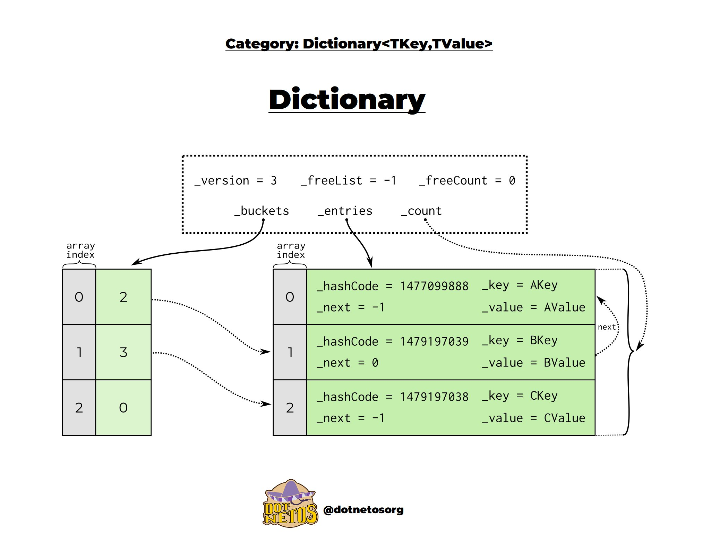


**해시 알고리즘 탐색 중**

- [patchmap 해시 알고리즘 벤치마크](https://1ykos.github.io/patchmap/#The%20algorithm)
- Facebook 의 F14
- 구글의 Sparsehash
- c++ stl


## 23/01/04

테스트 데이터 관리

- 테스트 데이터는 어디에 위치시키는 것이 좋은가
- 실제 라이브 데이터와 정합을 자연스럽게 맞출 수 있는가. (데이터 형태가 달라질 때 쉽게 대응가능한가)
- 잘못 수정할 가능성을 방지할 수 있는가 (예를 들어 테스트 데이터와 라이브 데이터가 한 파일에 같이 작성되고 있다고 하자. 어느 날 작업자가 모든 '라이브' 데이터의 값 하나를 일괄 수정하려는데 실수로 테스트 데이터까지 건드리고 말았다.)
- 라이브 로직이 자라날 때 테스트 데이터가 반드시 같이 추가되어야 한다면, 이게 너무 번거롭지는 않은가. 그 로직에 대해서 반드시 테스트를 작성할 필요는 없을 수 있다.
- 테스트 데이터는 코드로 자동생성할 수는 없는 걸까?

## 23/01/09

관리 힙과 GC 라는 강력한 도구를 활용하는 C#은 시스템 도구를 구현할 때 내부적으로 자잘한 메모리를 자주 할당하는 구현을 채택했고, 닷넷 프레임워크에서는 납득할 만한 내용이지만 유니티에서는 아니다. 유니티의 GC는 메모리 컴팩트 절차가 없어서 메모리 단편화에 끔찍하게 취약하다.

- 그러니 순진하게 작성된 c# 코드들은 유니티 환경에서 메모리를 무자비하게 잡아먹기 쉽상이다. 베스트 프랙티스에 맞게 작성된 C# 코드가 난데없이 유니티에서 사고를 칠 것을 IDE들이 어떻게 알겠는가. 불필요한 메모리 할당 동작이 섞여 있어도 IDE 들이 문제를 지적하지는 않는다.
- 이래서 Rider를 같이 쓰라는 것인데 Rider는 유니티를 위한 C# 에디터이다. 닷넷 환경에서는 문제없지만 유니티에서는 문제가 되는 코드들을 잘 찝어서 작성자에게 경고를 준다.... 왜 이런 일이 있어야 한단 말인가...

## 23/01/10

리소스 패키징

- READ: 파일을 읽을 때 스토리지에 다녀오는 핑퐁 빈번도를 최소화시켜야 한다.
  - 이를 테면 패치 다운로드 도중에 특정 파일이 있나없나 들여다볼 때마다 시스템 콜 부른다면 비용이 클 수 있겠다.
  - fopen 시스템콜이 굉장히 비용이 크다. 그래서 파일을 한번 열면 되도록 닫지 않도록 한다.
  - blob 파일과 인덱스 파일들로 구성할 수 있겠다.
  - 프로젝트 개별적으로 파일시스템을 구현하고 os 파일시스템을 대신하도록 하는 방법론이 많은 것 같다. 
- WRITE: 개발 / 라이브 단계에서 배포 프로세스와 잘 맞물려 돌아가야 하겠다. 예를 들어 증분 빌드 프로세스에서도 패키지 재구성이 가능해야 한다.
  - 만약 개발 단계에서 매번 변경점이 저장소에 올라올 때마다 패키징을 다시 해줘야 하는 번거로움이 있다면 곤란할 것.

## 23/01/16

유니티 코리아

- 넥슨은 유니티의 기술 지원 클라이언트이다.
  - 유니티로 개발된 게임 (하스스톤 / 원신) 중 일부는 대규모 프로젝트로, 프로젝트 과정에서 마주친 문제와 모법적인 해결법이 있었겠지만, 유니티에서는 이때 활용한 기능을 문서화하지 않음. 애초에 코드 공개를 하지 않았고 알려지지 않은 기능들이 많은 것 같다.
  - 접근성이 굉장히 떨어진다.
- 프로젝트 초반에는 발견되지 못한 문제들이 프로젝트 중 / 후반에 나타난다. 이전에 유니티 코리아로 문의를 넣은 적이 여러 번 있었지만, 유니티 코리아 측 답변 중 일부는 개발자에게 오히려 혼동을 주었고 품질도 실망적임
- 넥슨 측은 광범위한 퍼포먼스 이슈 외에도 유니티 코리아의 알맹이 없는 답변에 분통을 터뜨릴 수 밖에 없는 상황...

## 23/01/31

- [DevTech 게시물: 쿠키런 킹덤 출시 후 DB 날려먹을 뻔한 사건](https://tech.devsisters.com/posts/bit-level-database-hacking/)
- [NDC 발표](https://youtu.be/FUEZibcZEkg)

CockroachDB 를 사용했다. (consensus Algorithm 기반, 메인 노드의 데이터로 일관성을 확보한다.) 출시 후 주말, 사용자가 폭증한 상황에서 데이터베이스 설정 미스로 DB 노드가 다운되었다. 메인 노드에 들어간 데이터는 일관성을 보장하지 못하는 것이 CockroachDB 의 철학이기 때문에 DB 노드 다운 이후 발생한 모든 트랜잭션은 DB에 정상 반영되지 못했다. 장애가 발생하지 않았던 노드 어딘가에 Raw 형태로 남겨져 있는 상태였다고 한다. 공식적으로 지원하는 기능 중에 메인 노드에 들어가지 못한 이 데이터를 확인하는 기능은 없다. 단지 덜렁 있는 원시 데이터 파일만 확인할 수 있는 상황

이 원시데이터를 끄집어내서 bit 레벨에서 파싱하는 코드를 짜냈다는 일화.

- [DevTech 게시물](https://tech.devsisters.com/posts/crk-launch-storage-postmortem/)

그 DB 설정 미스가 뭔가 찾아보니까, out of disk 상황에 대비해 ballast 파일(사전에 미리 공간을 점유해두는 더미 파일을 만들어 두는데, 디스크가 가득차면 이 더미 파일을 지우면서 공간을 확보하고 스토리지 증설에 필요한 명령 등을 실행한다. 이후 다시 클러스터에 join 한다.) 경로가 잘못되었다고 한다. 리눅스 환경에서는 디스크 가득 찬 상황에서는 운영체제의 정상 동작을 보장 못하기 때문에 이런 형태의 보험이 있다. ballst 파일의 경로가 잘못되었으니, 더미 파일로 착각하고 제거한 곳에는 실제 DB 작동을 위해 필요한 파일이 있었던 것. DB 노드는 마비되기 시작한다.

## 23/02/03

나타났던 버그들

- 항상 필드에 있어야 할 npc 가 플레이어의 공격을 받고 사망한다. 그 플레이어는 힐러였는데, 특수 스킬 중 일부가 '우호적인' 대상에게도 영향을 미치는 특징이 있다.
- 메쉬와 본 : 삼각형이 이리 저리 튀는 현상과, 상 / 하체 본 조합이 따로 놀아서 괴상한 춤을 추는 것처럼 보인다던가
- 리소스 잔류. 스킬 이펙트가 타이틀 화면에 나타난다.
- 무한 루프 / 스택 오버플로우 : 코드 논리 상의 문제. 가장 대응하기가 골치아픈 문제인데, 무한루프에 빠지면 해당 프로세스를 강제로 셧다운 시키는 수 밖에 없다.
- 리소스 누락 : 종종 이것 때문에 게임의 룩이 심각하게 망가지는 일이 있다.

## 23/02/15

**[Unity의 Fast Script Reload](https://assetstore.unity.com/packages/tools/utilities/fast-script-reload-239351)**

Fast Reload 그러니까 유니티 런타임 동작 중에 코드를 수정해도 플레이 세션을 중단할 필요가 없다. 수정된 코드는 즉각 반영된다. 개발자의 소개 문구대로 동작한다면 팀에서는 커다란 생산성 개선을 기대할 수 있겠다.

그렇지만 팀의 사용 소감은 네거티브하다.

- Obsolete 메서드 사용. 그리고 대체 메서드를 알려주지 않는다. 유니티 업데이트가 더 진행되면 이 문제는 심해질 것이다.
- 동작 원리를 살펴보니, 도메인 리로드 시점을 빠르게 해주는 것이 아니라 현재 플레이 중인 상태에서 단순히 도메인을 핫리로드 해주는 도구이다. (c# 모딩 라이브러리인 하모니를 사용하는 것 같다) 따라서 플레이 버튼을 눌러 게임을 실행하고 코드를 변경하고 결과를 봐야 한다. 코드 변경점만 확인할 수 있는 것과 같다. 만약 프리팹 변경이 포함되었으면 혜택을 받기 어려울 수 있겠다.
- 유니티 컴포넌트 수정을 잘 갱신된다.
- 코드 제약 사항이 많은데 제네릭 / this 객체 전달 등이 안된다.
- 에디터 로딩 시 Fast Script Reload 기동 시간이 추가된다.
- 디버거가 매끈하게 붙는다고 보기 어렵다. Fast Script Reload 로 생성된 컴파일 코드에만 디버거를 붙일 수 있다고 한다. 수정된 파일 원본에는 디버거를 붙일 수 없다. 핫리로드 된 파일을 잘 찾아봐서 디버거를 붙여야 한다. (로그를 뒤적거려야 하는 수고가 든다.)

**센트리Sentry**

- Sentry는 서버와 클라이언트에 붙여서 사용하고 있는 에러 리포팅 시스템이다. 리포팅 된 에러를 부가 정보들과 같이 표기해서 파악할 수 있게 해주며, 이슈처럼 관리할 수 있게 해준다.

팀 내에서 사용해보고난 후 인하우스 에러리포터를 구현하기로 방향을 선회했다.

- 에러가 나면 협업툴(팀즈)로 알림이 가야 한다. -> 센트리는 돈 좀 내야 한다.(안내면 quota가 누락된다고 한다.)
- 콜스택의 라인을 클릭하면 바로 소스코드를 보여줄 수 있으면 좋겠다. -> 센트리는 안된다.
- 각각의 오류에 대해 대응 여부를 알 수 있어야 한다. -> 센트리에서도 가능
- 돈이 많이 들면 안된다. -> 센트리는 많이 드는 것 같다. 인하우스 툴을 고려해야 할 정도로
  - 에러리포터에 온갖 보고가 올라가기 때문에, 이건 마치 로그 시스템처럼 사용되는 경향이 있다. 왜냐하면 리포트를 발송하는 순간에 현재 상황이 문제 상황인지 아닌지 분간하기 어려울 때는 생각보다 많기 때문이다. (이럴 때는 안보내는 것보다는 일단 보내는 것이 좋다. 만약 사고가 생기면 원인을 추적하는데 도움을 주는 것은 사실 -> 블랙박스)

## 23/02/16

- [NDC : 모바일 디바이스에서 게임 플레이 테스트 자동화](https://youtu.be/ckqUzRyIPoA)

**Android 애플리케이션 테스트를 위한 monkeyRunner**

- [android Developer: monkey Runner](https://developer.android.com/studio/test/monkeyrunner?hl=ko)
- 안드로이드 기기를 제어하는 api 를 제공함.
- 파이썬을 쓰고
- 원래는 단위 테스트 실행을 위해 설계되었는데 좀더 광범위하게 쓰이는 듯
- 현재 프로젝트 환경에서 당장 적용할 수 있었다고 함. 초기 비용이 굉장히 저렴하다.
  - 안드로이드 애플리케이션 테스트 자동화를 할 수 있다. 모바일 디바이스 에서 앱 설치 -> 실행 -> 러프한 ui 조작까지 자동화한다.
  - OpenCV 까지 사용하면 스크린샷 캡쳐 후 이미지 비교도 가능하다고 한다.

**Appium**

- [Appium](https://appium.io/docs/en/about-appium/intro/?lang=ko)
- 오픈소스
- 언어를 가리지 않고, appium 의 api 가 애플리케이션 코드 내부로 스며들어가는게 아니라서 자동화 코드를 수정 후 애플리케이션을 재컴파일 하지 않아도 된다. 
- Appium 서버가 존재하는 클라이언트/서버 디자인이고, REST API를 지원해서 정보를 수신받는다.
- 장기적으로 모바일 디바이스 자동화를 고려할 때 monkey runner 보다 appium을 선호한다고 한다.


## 23/02/22

float 타입과 관련된 사소하지만 중요한 실수

- [floating-point-gui.de](https://floating-point-gui.de/basic/)

Why don’t my numbers, like 0.1 + 0.2 add up to a nice round 0.3, and instead I get a weird result like 0.30000000000000004?

- 부동소수점 표현식은 0.2 혹은 0.3 같은 수치값을 우리가 의도한대로 정밀하게 표현할 수는 없기 때문이다. (0.5는 가능)
- single / float 타입의 경우 지수 비트가 8개이기 때문에 2의 -126 ~ +127 승 범위를 표현할 수 있지만 이때의 최소 정밀도는 2의 -126 승이다. 그러니 아주 살짝 값이 틀려질 수도 있는 것이다.
- float 타입에 대해 a == b 와 같이 비교하는 것은 굉장히 주의해야 한다.
- IEEE 754 를 참고하자 [IEEE 754](https://en.wikipedia.org/wiki/IEEE_754)

## 23/02/27

- [DailyWTF:Batch-of-Trouble](https://thedailywtf.com/articles/Batch-of-Trouble)

대학교 수강신청 사이트에서 새로 온 개발자가 기존 시스템을 전부 바꾸고 이직한 일화. 새로운 시스템은 잘 모듈화되 있고 새로운 기법들로 잘 빠졌지만, 기존의 못생긴 시스템과 다르게 내용에 대해 설명하는 문서가 부족했고, 선형적 진행 절차 중간 단계에서 실패하면 fallback 기능이 없어서 DB 데이터가 오염될 수 있고, 문제 원인에 대해 제대로 전파하지 않고 있었다. 새로운 시스템을 잘 아는 그 개발자는 스타트업으로 이직했기 때문에, 남아있는 관리자는 모든 걸 롤백하고 과거 시스템을 복구시켰다는 이야기.

- [expert-beginner](https://daedtech.com/how-software-groups-rot-legacy-of-the-expert-beginner/)
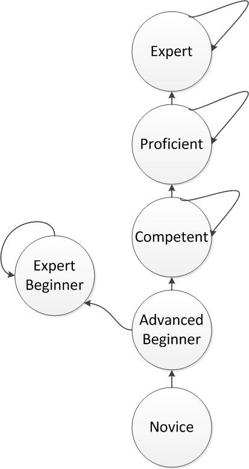


## 23/03/02

ChatGPT 관련 보안 공고가 올라왔다. 주요 내용은

- 회사 중요 정보를 chatGPT 에게 알려주지 말 것 : chatGPT 에게 입력한 정보는 chatGPT가 임의로 사용할 수 있기 때문. 사내 소스코드를 절대 여기 올리면 안된다.
- ChatGPT 결과를 100% 신뢰하지 말 것 : ChatGPT의 AI 모델이 단어의 의미를 이해하고 답변하는 것이 아니라, 확률적으로 다음 단어가 무엇일지 예측하는 모델이기 때문이다.
- ChatGPT로 위장한 악성코드가 많다. : ChatGPT 관련 프로그램 중에 이런 사례가 많은 모양이다.

## 23/03/03

챗봇들은 과거를 기억하고 지나간 대화들의 맥락을 이해하는 것처럼 보이지만 챗봇은 기억을 못합니다.

그런 것처럼 보이는 이유는 매번 대화를 한줄 생성시킬 때마다 과거 대화를 다 집어넣고 다음 줄을 써넣게 하기 때문입니다.

지금 이 AI의 가장 큰 도전은 바로 기억입니다.

openAI의 최신 AI API의 경우 대략 4000정도까지만 가능합니다.

그런데 이 4000자를 온전히 기억하는게 아니라 출력과 입력을 합쳐서라서 실제로는 2000자 조금 넘게 기억할 수 있습니다.

ChatGPT 는 그래도 굉장히 똑똑하게 느껴지는데 이유는 api로 들어가는 4000자를 최적화를 거쳐 효율적으로 관리하기 때문입니다.

- 대화의 히스토리를 “요약”시킨 다음 넣습니다.
- 출력을 잘 정제해서 따로 보관했다가 필요할 때 씁니다

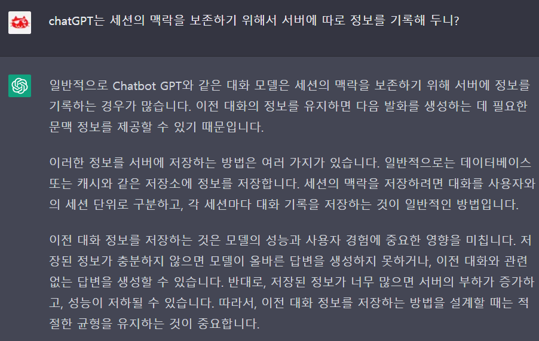

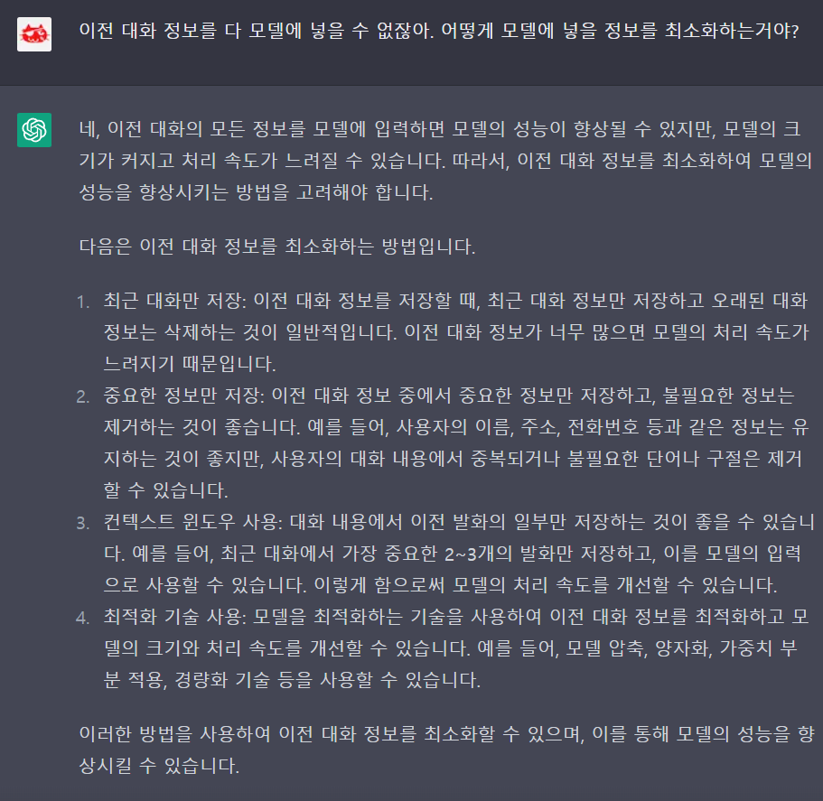

그래서 Character.AI나 ChatGPT도 오래 대화하면 맥락을 까먹고 허튼 소리를 하곤 합니다.

그렇지만 이건 금방 해결될 문제입니다.

openAI의 API는 GPT라는 모델을 사용하지만 LLM이라는 모델을 사용하면 제대로 ‘기억’을 할 수 있게 됩니다.

**Character.AI**

- [character.AI](https://beta.character.ai/)
- 가상 캐릭터와 대화할 수 있는 챗봇 사이트.

## 23/03/06

넥슨 X 삼성전자 게임 성능 최적화 미팅

삼성전자와의 협업 과정에서 그래픽/게임 성능 최적화 부분 지원 프로젝트로 마비노기 모바일이 선정됨

## 23/03/07

  대형 프로젝트에서는 요구사항을 처음부터 다 알 수 없다. 발주자 스스로도 확신할 수 없기 때문에 명세가 추상적이다. 시간이 지나면서 정제되어진다. 그렇기 때문에 요구사항을 히스토리를 지키는 것이 중요하다. 프로젝트에 새로 합류한 인원이 과거의 명세를 오해해서 방향이 틀어지는 것을 막아야 하기 때문이다.
  - 점점 코드가 곧 '요구사항'이라는 접근법이 두드러지는 것 같다. 동작의 명세를 논리적으로 작성해둔 결과물이기 때문에

- 사건 발생 시 명령을 전달하는 방식 (event) : 말 그대로 명령의 출처가 한 곳이면 문제가 없지만, 두 군데 이상이면 추적하기가 어렵다. 특정 명령으로 외부세계를 수정하는 동작이 있다고 하자. 그리고 또 다른 명령으로 외부 수정사항을 원상 복구 시킨다고 하자. 변경 or 복구 명령을 번갈아서 보내는 출처가 두 군데 이상이면 버그가 발생하기 쉽다.
- 지속적으로 상태를 추적하는 방식 (poll) : 게임으로 치면 매 프레임마다 상태를 체크하는 방식이다. 모든 순간 상태를 확인하다면 버그가 자라날 틈을 줄일 수 있겠다. 하지만 빈번한 트리거링 비용을 지불해야한다. 이 비용은 꽤 비쌀 수 있다.

## 23/03/13

**[ngrok](https://ngrok.com/)**

ngrok is the fastest way to host and secure your applications and services on the internet. Learn how by following our getting started guide, or dive straight into our products and offerings.

## 23/03/22

**Felienne Hermans 프로그래머의 뇌(The Programmer's Brain)**

- [역서 소개 글](https://jpub.tistory.com/1232)

첫 세 챕터만 정리

**CHAPTER 1 코딩 중 겪는 혼란에 대한 이해**

- 코드를 위윤 때 혼란이 생기는 이유는 지식 부족. 쉽게 찾을 수 있는 정보의 부족, 두뇌의 처리 능력의 부족. 이렇게 세 가지다.
코드를 읽거나 작성할 때 세 가지 인지 과정이 일어난다.
- 첫 번째 과정은 LTM(long-term memory, 7·8·40·108·145·175쪽)에서 정보를 인출하는 것으로, 키워드의 의미 같은 것들이 여기에 해당된다.
- 두 번째 과정은 메서드나 변수의 이름과 같이 코드를 읽는 과정에서 발생하는 정보를 STM(short-term memory, 7·8·16·53·144쪽)에 일시적으로 저장한다.
- 마지막 과정은 작업 기억 공간에서 일어난다. 코드를 읽고 처리하는 일이 여기서 이루어지는데 예를 들면 '인덱스 값이 하나 작다'라고 판단하는 것이다.
- 코드를 읽는 동안 이 세 가지 인지 과정은 다 같이 일어나며 서로 보완적으로 작용한다. 예를 들어 STM이 n과 같은 변수명을 보게 되면 과거에 읽었던 그와 관련된 프로그램을 LTM으로부터 찾는다. 모호한 단어를 보면 작업 기억 공간이 활성화되어 문맥 속에서 적합한 의미를 찾으려고 한다.

**CHAPTER 2 신속한 코드 분석 (14쪽)**

- STM은 두 개에서 여섯 개 사이의 항목을 저장할 수 있는 용량을 갖는다.
- 정보를 기역할 패 STM은 크기에 대한 제약을 극복하기 위헤 LTM과 협업한다.
- 새로운 정보를 읽을 때 우리 두뇌는 그 정보를 청크라는 몇 개의 볶음으로 나눈다.
- LTM에 지식이 부족하면 코드를 읽을 빼 하위 수준의 정보들 이를테면 문자나 키워드 같은 것에 의존해야 한다. 이럴 때 STM의 공간이 빠르게 소진된다.
- LTM이 코드와 관련 있는 지식을 충분히 가지고 있다면 코드의 하위 수준의 요소들을 STM에 저장하는 대신 '자바에서의 for 루프' 혹은 '파이썬으로 된 선택 정렬 알고리즘' 같은 식으로 추상 개념을 기억하기 때문에 STM의 공간을 절약한다.
- 코드를 읽을 때 그 내용은 우선 영상 기억 공간에 저장된다. 그 후 코드 충 아주 적은 일부만이 STM으로 보내진다.
- 코드를 기억해내는 일은 프로그래밍에 대한 지식이 어느 정도인지 가능해볼 수 있는 자가 진단 도구로 사용될 수 있다. 이미 알고 있는 것을 기억하는 것은 쉽기 때문에 기억해낸 코드는 자기가 이미 잘 알고 있는 디자인 패턴, 프로그래밍 구성 요소, 도메인 지식 등을 드러내준다.
코드는 우리 두뇌에서 처리하기 쉽게 만드는 특징들 가령 디자인 패턴, 주석문, 명확한 표식 같은 것들을 가질 수 있다.

**CHAPTER 3 프로그래밍 문법 빠르게 배우기 (36쪽)**

- 문법에 대한 지식이더 많을 수록 청킹을 쉽게할수 있기 때문에 문법을 외우는 것이 중요하다.
- 앞면에는 프롬프트를, 됬면에는 코드를 적어놓은 플래시카드를 사용해서 새로운 문법을 연습하고 기억할 수 있다.
- 기억이 없어지는 것을 방지하기 위해, 세로운 정보를 기억하는 연습을 정기적으로 하는 것이 중요하다.
- 최상의 연습은 기역한 것을 두뇌로부터 인출하는 언습이다. 다른 곳에서 해당 정보를 찾기 전에 기억해내려고 노력해야 한다.
- 기억하는 지식의 양을 최대로 하기 위해서는 연습을 긴 시간에 걸쳐 고르게 해야 한다.
- LTM 속 정보는 관련된 사실들이 서로 연결되어 있는 네트워크의 형태로 저장된다.
- 새로운 정보를 능동적으로 정교화하면 그 새로운 기억이 연결함 기억의 네트워크를 강화하고 이는 인출을 쉽게 하는 데 도움이 된다.


**성인 ADHD의 대처기술 안내서: 실생활적응능력 향상을 위한 인지행동치료 기법 활용**

- 원서: [The Adult ADHD Tool Kit: Using CBT to Facilitate Coping Inside and Out](https://www.routledge.com/The-Adult-ADHD-Tool-Kit-Using-CBT-to-Facilitate-Coping-Inside-and-Out/Ramsay-Rostain/p/book/9780415815895)
- 역서: [성인 ADHD의 대처기술 안내서: 실생활적응능력 향상을 위한 인지행동치료 기법 활용](https://hanampc.co.kr/product/detail.html?product_no=1136)

**1.1. 성인 ADHD의 대처기술 안내서 이용하기**

1. 이 책을 펼치십시오.
2. 이 책을 치우기 전에 유용한 정보를 찾기 위해 취할 수있는 현실적인 단계를 정의하십시오(예: 목차를 조사하여 나와 관련된 주제를 찾기).
3. 한 장을 훑어보기 위해
   > 시간을 기반으로 할 것인지(예: `"나는 적어도 2분 동안 그것을 꼼꼼히 읽을거야"`) 또는
   > 과제에 기반할 것인지(예: `"나는 최소한 단원 제목과 책갈피 지침을 읽을거야"`)

   를 정하시오.
4. 목차로 돌아가서 주제를 찾으십시오. 일단 여러분이 페이지를 넘겼다면, 여러분은 미루기를 했다고는 할 수 없을 것입니다.
5. 축하합니다. 여러분은 지금 시작하였습니다!

**2.1. 계획을 위한 시간 계획**

1. 계획세우기에 10분 (600초)을 할애하십시오.
2. 주의가 산만해지지 않는 장소를 찾으십시오.
3. 여러분의 하루 중 정확하게 10분(600초)을 계획세우기에 쓰십시오.
4. 일일 계획표에 계획들을 적으십시오.
5. 해야 할 일을 구체적인 행동용어로 규정하세요.

**2.2. 포괄 실행 목록**

1. 포괄 실행 목록을 작성하기 위하여 컴퓨터파일을 열거나 노트를 펼치십시오.
2. 방해받지 않는 장소를 찾으십시오.
3. 여러분의 모든 책무들, 계획들, 심부름, 약속, 레크리에이션 등에 관하여 적으십시오.
4. 노트나 컴퓨터파일을 나중에 검색하고 참조하기 쉬운 장소에 보관하십시오.
5. 포괄 실행 목록은 기억에 의존하지 않고도 일이나 책무를 상기시켜줍니다. 할 수 있는 일들을 상기할 수 있게 이것을 주기적으로 펼쳐보십시오. 그러나 이것은 일일 실행 목록은 아닙니다.


**2.3. 일일 실행 목록**

1. 색인카드, 편지봉투 뒷면, 또는 일회용 종이조각을 찾오십시오.
2. 일일 실행 목록을 정하는데 10분(600초)를 할애하십시오.
3. 일일 실행 목록은, 일상적인 일정에 들어 있지는 않지만 여러분이 하고 싶어하는 일들로 구성되며, 완수하기 위해서는 시간과 노력의 투자가 필요합니다.
4. 목록을 2~5개 항목으로 제한하십시오. 확실하지 않을 때에는, 더 많은 쪽보다는 지나치다 싶을 정도로 더 적은 쪽을 선택하십시오. 원한다면 이것들을 완료한 후에 몇가지 더 추가할 수 있습니다.
5. 과제를 구체적이고 행동적인 용어로 즉, 여러분이 `"할"` 수 있는 행동으로 규정하십시오.
6. 각각의 과제를 수행할 수 있는 현실적인 시간대를 정하십시오.
7. 하루 중에 각각의 과제들을 실행할 수 있는 시간들을 찾아내기 위해 일일 계획표를 활용하십시오.
8. 각각의 관제를 계획된 시간에 실행한 후, 목록에서 삭제하십시오.


**2.4. "계획을 가지고 방에 들어가라"**

1. 방(또는 사무실, 책상 등)으로 들어가는 이유를 구체화하십시오.
   > 의도는 무엇이며,
   > 이 의도는 왜 중요합니까7
2. 과제를 시작하고 의도대로 행동을 지속하기 위해서 방안에서 취할 행동을 분명히 정하십시오.
3. > `"업무 외"` 일들은 어떻게 하겠습니까?
   > 의도를 방해하는 것은 무엇입니까?

   작업을 하는 동안 맞닥뜨릴 수 있는 방해물이나 주약를 분산시키는 것을 예상하십시오.
4. 방해물을 어떻게 다루겠습니까? `"만약 그렇다면"` 계획을 사용하여 방해물/주의 분산물을 처리할 전략을 고안하십시오(`"X를 마주치게 된다면, 그러면 나는 Y를 함으로써 단계별 계획에 따라 그것을 처리해야지"`).
5. 의도한 행동을 실행하기 위해서 `"계획을 가지고 행동하기"`를 계속하십시오.

**3.1. 일일 계획표 고르기와 일반적인 지침**

1. 종이 계획표를 쓸 것인지 전자 계획표를 쓸 것인지 정하십시오. 만약 못 정하겠거든 우선 종이 계획표로 시작하십시오.
2. 여러분의 생활 여건에 맞추어 계획표의 크기 및 양식을 정하십시오.
3. 일일 계획표를 충분히 사용하도록 계획하십시오. 일일 계획표는
   * 계획된 약속,
   * 직장 및 학교에서의 할 일,
   * 개인 여가 활동 및
   * 자기 관리 작업

   을 위한 공간입니다.
4. 가급적 일정을 적게 잡으십시오. 과제들과 모임들 간에 충분한 여유 시간을 두도록 하십시오.
5. 가능한 한 과제를 구체적이고 행동적 용어로 정하십시오.
6. `"기준을 낮추기"`&ndash;가급적이면 언제나 과제들과 활동들의 시작 시간 및 종료 시간을 정하십시오
7. 여러분의 일일 계획표는 열쇠, 지갑, 휴대폰 등과 같은 `"일상생활의 도구"`라는 사실을 명심하십시오.

**4.1. 일일 계획표를 검토하기**

1. 하루를 시작하는 시간에(또는 전날) 일일 계획표를 한번 살펴보십시오.
2. 하루에도 수시로 일일 계획표를 살펴보고, 검토하고, `"수정"`해서 다가오는 일정과 계획을 상기하도록 하십시오.
3. 만약 여러분이 계획을 자주 변경해야 할 형편이라면, 상황에 맞춰 일일 계획표를 조절할 시간을 정해 놓을 필요가 있습니다.
4. 미래에 해야 할 새로운 일이 생길 때마다 모두 일일기록표에 기록하십시오.
5. 완수한 일들이 무엇인지 파악하는 것뿐만 아니라 일일 작업 목록에서 없애야 할 일들이 무엇인지 파악할 때도 일일기록표를 사용할 수 있습니다.
6. 앞의 과정을 반복하십시오.


**4.2. 일일 계획표를 활용하기**

1. 일일 계획표를 가지고, 조용한 장소로 가십시오.
2. 하루의 계획에 최소 10분(600초)을 투자하십시오.
3. 계획표에 이미 기록해 놓은 일들을 검토하십시오.
4. 그날 해야 하는 것으로 알고 있는 약속이나 해야 할 일들을 기록하십시오. 예)
   * 직장에서의 회의,
   * 수업,
   * 자녀 등하교 돕기 등
5. 수면, 식사, 운동 같은 자기 관리를 위한 시간을 남겨두십시오.
6. 계획된 일정과 일정 사이에 휴식이나 이동시간 등에 쓸 완충시간을 충분하게 두십시오
7. 일일 실행 목록에 있는 과제들에 대해 각각 일정을 잡으십시오.
8. 7번의 과제들은 이해하기 쉬운 행동용어로 규정되어야 합니다.
9. `"한가한 시간"` 및 기타 여가 활동 또는 사교 활동 등의 일정도 잡도록 하십시오.
10. 하루 동안의 일정의 순서를 검토하고, 현실성이 있는지 확인하십시오.
11. 계획을 믿으십시오.&ndash;그 날의 첫 번째 일부터 시작하여, 차근차근 시도해보십시오.
12. 하루에도 수시로 일일 계획표를 참고하도록 하십시오.


**4.3. 과제를 행동용어로 정의하기**

1. 일일 실행 목록에 있는 과제들을 살펴보십시오.
2. 너무 광범위하게 표현된 과제가 있는 지 확인하십시오. 예) `'서류 작업'` 또는 `'집 청소'`
3. 합리적이고 실행 가능하며 더 작고 구체적인 것이 되도록로 과제를 다시 표현하십시오. 예)
   * `"서류의 마지막 단락 다시 읽기"` 또는
   * `"식기 세척기 비우기"`
4. 실행할 자신이 있을 정도의 행동으로 과제가 정의될 때까지 3번째 단계를 반복하십시오.
5. 이렇게 새로 정의된 과제를 일일 실행 목록에 활용하세요. 그러면 쉽게 시작할 수 있게 될 것입니다.

**5.1. 과제를 나누고 가장 작은 단계를 먼저 실행하기**

1. 완수하고 싶은 과제를 파악하십시오.
2. 과제 마감일이나 다른 시간제한이 있나요?
3. 과제를 그 구성 단계에 따라 나눠 보세요. 할당된 시간에 과제를 수행할 수 있게 `"행동 지침"` 혹은 수행 규칙을 만들어 보십시오.
4. 시작부터 작업을 마치는 시점까지 거쳐야 할 단계들은 무엇인가요? 이런 작업을 마치는 시점에서 시작점으로 거꾸로 작업할 수도 있습니다.
5. 각 단계를 구체적인 행동으로 옮길 수 있게 만드십시오.
6. 일일 계획표를 사용하여 마감 시간까지 단계별로 시간 계획을 짜십시오. 매 단계를 수행할 약정 시간을 정하십시오.
7. 일을 시작하거나 적어도 오늘 `"건드릴 수 있게"` 할 수 있는 가장 작은 단계를 규정하십시오.
8. 그래도 여전히 미룬다면, 그 첫 단계를 더욱 작고 구체적인 단계로 나누어 수행할 수 있는 첫번째 단계를 찾으십시오.
9. 그 가장 작은 행동 개입 단계를 수행해 보세요. 이제는 더 이상 미루지 않을 겁니다.


**5.2. 실행계획**

1. 과제를 시작하게 할 가장 작은 첫 번째 행동 단계를 정하십시오.
2. 과제에 소요되는 시간을 정하십시오. 과제에 많은 시간을 배정하는 것보다는 적은 시간을 배정하는 것이 낫습니다.
3. 작업을 일정에 따라 수행하도록 자신과 약속하세요. 2번 항과 일치하는 시작 시간과 종료 시간이 있어야 합니다.
4. `"어떤 일이 일어나면, 이렇게 할 거야"`란 체계를 사용하여 시작계획을 만드십시오.
5. 과제를 중단시킬 수 있는 가장 산만한 자극이나 장애를 예상해 보십시오.
6. `"어떤 일이 멀어지면, 이렇게 할 거야"`란 체계를 사용하여 `'미루기'`의 위험을 다를 수 있는 계획을 만드십시오.
7. 과제의 첫 번째, 작은 단계를 실천하십시오.


**5.3. 10분 원칙**

1. 과제를 수행할 수 있는 `"가장 작은 행동 시작단계"`를 정하십시오.
2. 예상했던 `"최악의 시나리오"`로 끝날지라도, 과제의 첫 번째 단계를 견뎌 낼 수 있는 가장 짧은 시간을 정하세요. 적어도 10분 정확히 600초를 추천합니다.
3. 가장 작은 첫 번째 단계를 수행하기 시작할 때 시간을 재기 시작하십시오.
4. 10분(600초) 동안 과제에 최선의 노력을 기울인 다음 재평가해 보십시오.
5. 축하합니다, 미루지 않았어요.
6. 더 지속할지 아니면 지금 중단할지 결정하십시오.


**5.4. 미루기를 다루는 법**

1. 미루고 있는 과제를 구체적으로 파악하십시오.
2. 과제 수행과 관련된 생각을 정확하게 찾아내십시오. 무슨 방법으로 과제의 부정적인 측면을 과장하고 있나요?
3. 지루한 감각 또는 단지 `"웩"`하는 느낌(나는 이 일을 하기 싫어)과 같은, 과제와 관련된 느낌을 라벨링 하십시오.
4. 이제, 이 과제가 여러분에게
   * 왜 가치가 있으며,
   * 완수하고 난 후 어떤 느낌이 들지

   생각하고 강조하십시오.
5. 과제가 쉬워 보이도록 여러분 능력의 긍정적인 측면을 정확하게 찾아내십시오.
6. 과제를 완수했을 때의 긍정적 느낌에 대해 생각하십시오.
7. 느낌과 상관없이 시작할 수 있도록 과제를 작은 단계들로 쪼개십시오.
8. 위의 7번 단계를 수행하는 동안 잠시 동안의 불편함과 불안함을 견디십시오.
9. 이제 더 이상 미루지 않게 되었습니다.

**6.1. 의욕(필요한 만큼) 만들기**

1. 과제를 구체적이고 쉽게 할 수 있는 행동으로 정의하십시오.
2. 행동시작하기의 첫걸음인 과제의 가장 작은 첫 단계를 정하십시오.
3. 일이나 과제의 시작을 방해하는 부정적 감정들을 알아내십시오.
4. 자신이
   * 어떤 식으로 일에 대한 부정적 감정을 확대하고,
   * 어떤 식으로 일을 처리하고,
   * 불편함을 참아내고,
   * 좋은 결과를 만들 수 있는 자신의 능력들을 축소 해석하는지

   알아내십시오.
5. 과제에 대한 자신의 감정들에 주목하고, 분류하고, 받아들이십시오. 우리는 이런 감정들을 느끼고 과제를 시작할 수 있습니다.
6. 과제를 시작하기 위해
   * 자신이 할 수 있는 가장 작은 행동 단계와
   * 일할 기분이 아니어도 실행할 수 있는 가장 간단한 행동 단계만

   기억하십시오.
7. 일단 일을 시작하면 더 이상 미루는 것이 아니게 되고 기분이 더 좋아질 것입니다.


**6.2. 과거의 행동 대본**

1. 우리가 실행하고자 하는 새로운 행동 대본은 무엇입니까?
2. 하루 중에 실행하기 위해 좋은 시간대가 언제입니까?
3. 현재의 새로운 행동 대본을 방해하는 과거의 특징적인 행동 습관은 무엇입니까?
4. 과거 행동 습관의 행동들을 나열하여 정확히 어느 행동이 새로운 행동 대본을 방해하는지 알아보십시오.
5. > 과거의 행동 습관에서 얻는 것은 무엇입니까?
   > 자신의 목표를 이루지 못함에도 불구하고 과거의 행동 습관의 어떤 점이 즐겁고 보람이 있습니까?


**6.3. 새로운 행동 대본**

1. `"과거 행동 대본"`의 뼈대를 활용하여 새로운 행동계획의 적용을 촉진시키는 대체 교본을 만드십시오.
2. 과거 행동 대본의 각 단계에 대응하여 대체가능하고 현실적인 단계들을 개발하십시오.
3. 새로운 계획을 마무리할 수 있는 행동 단계들로 구성된 새로운 행동 대본을 개발하십시오.
4. 새로운 계획을 실행하기 위한 보상 수단들을 찾아보십시오.
5. 실행단계의 문제들을 다루기 위해 다른 책갈피 지참을 활용하십시오. 예)
   * 하나의 계획을 여러 단계로 나누거나,
   * 첫 번째 작은 행동 단계를 정의하기
6. `"새로운 행동 대본"`을 사용하고 한 단계씩 추진하십시오.

**6.4. 에너지 다루기의 법칙**

1. > 배터리를 충전하고 하루의 에너지를 관리 할 수 있는 중요한 방법은 어떤 것이 있을까요?
   > 하루 일의 순서와 몸을 움직이는 방법이 에너지에 어떤 영향을 미칠까요?
2. > 휴식이 필요함니까?
   > 합리적인 휴식의 기간은 얼마인가요?
   > 휴식 동안 무엇을 할 수 있나요?
   > 휴식시간에 하지 말아야 할 일들은 무엇인가요?
3. > 언제 밥을 먹나요?
   > 식사 사이에 간식이 필요한가요?
   > 여러분에게 어떤 간식이 좋을까요?
   > 어떤 음식을 피해야 하나요?
4. > 물리적인 활동이나 움직임이 도움이 되나요?
   > 운동에 어떤 선택사항이 있나요?(간단한 산책이나 의자에서 일어나기)
5. > 얼마나 잘 휴식을 취했나요?
   > 밤에 충분히 주무셨나요?
   > 낮에 휴식 전략이 도움이 되나요?
6. > 낮에 남는 시간이 있나요?
   > 내가 중요하게 생각하는 여가 활동은 무엇인가요?
   > 에너지에 해가 되는 활동은 무엇이 있나요?


**6.5. 보상체계**

1. > 과제를 완수하면 자신한테 줄 보상은 무엇이 있을까요?
   > 오늘 일을 끝낸 후에 즉각적으로 받을 수 있는 보상은 무엇이 있을까요?
   > 좀 더 크고 장기적인 보상은 무엇이 있을까요?
2. 일을 완수할 확률을 높이기 위해 일과 연결시킬 수 있는 즐겁게 할 수 있는 활동은 무엇이 있을까요?
   > 집안 일이나 운동을 할 때 음악을 들으면 도움이 되나요?
   > 서류작업을 할 때 차나 커피를 마시는 것을 즐깁니까?
3. 일이나 계획을 완수할 때 느끼는 긍정적인 감정들은 무엇이 있을까요?
4. 반대로
   > 일을 미루는 것에 `"보상"`을 주는 활동들은 무엇이 있나요?
   > 이런 활동들을 일을 완수할 때 받는 보상을 긍정적인 것으로 변형시키는 방법이 있을까요?


**6.6. 감정을 다루고 불편함을 인내하는 법**

1. 즉각적인 과제들을 미루게 만드는 우리의 감정 반응을 규명하십시오.
2. - 지루함,
   - 약간의 예촉되는 스트레스,
   - `"웩~"`(이것을 지금 하고 싶지 않아) 등

   이 포함된 자신의 감정을 인식하십시오.
3. 연속 선상에서 자신의 "불편함'의 척도를 써 보십시오.
   - 얼마나 강력한지?
   - 정말 그런지?
   - 0~100(0=편안함에서 100=이제까지 경험한 것 중 가장 고통스럽다) 척도를 사용해 자신이 느끼고 있는 불편함의 지수를 표현해보십시오.
4. 자신이 느끼고 있는 감정을 주목하고 어떤 느낌인지 알아내십시오. 감정들을 제거 하려 하지 말고 불편함을 참을 수 있는지 보십시오.
5. 자신의 감정을 통해서 천천히 그리고 안정적인 속도로 숨쉬기에 초점을 맞춰 보십시오.
6. 자신의 감정이 행동을 지시하지 않아도 된다는 것을 인지하십시오.
7. 과제를 완수하는 데 있어 어느 정도는 불편 할 수 있다는 것을 고려하십시오.
8. 과제의 제일 작은 행동적인 스텝에 집중하고 시작하십시오.
9. 일을 시작하면 자신의 감정이 어떻게 변하는지 관찰해보십시오.
10. 지금까지 말한 기술들을 매일 다른 상황과 과제에 접목시켜 연습해 보십시오.

**7.1. 자동사고 알아내기**

1. > 해야 할 일에 대한 불편함을 포함한 감정의 변화를 이용하거나, 또는
   > 부정적 자동사고를 가지고 있다는 징후로서 일을 회피하고 있다는 사실을 이용합니다.
2. 감정 반응을 일으킨 상황, 일, 사건에 대해 한발 물러나 생각하고 알아냅니다.
3. 생각하거나 해석한 것은 무엇이었습니까?
   > `"내 마음에 어떤 생각이 스쳐 지나갔을까?"`
   > `"이것이 나에게 의미하는 것은 무엇일까?"`
4. 이 생각이 감정과 행동에 어떻게 영향을 주었습니까?
5. > 생각의 오류를 가지고 있습니까?
   > 상황을 어떻게 다르게 볼 수 있습니까?

   (표 7.1. 생각의 오류<sub>(150쪽)</sub> 목록 참조)

## 23/03/28

- [Render Doc](https://renderdoc.org/)

오픈 소스로 사용할 수 있는 프레임 디버거.

클라이언트 디바이스에 렌더독 호스트를 두면, 이제 pc 에서 명령을 내릴 때마다 디바이스의 프레임 디버깅 정보를 pc 로 보내준다.

- [C# Await Anything](https://devblogs.microsoft.com/pfxteam/await-anything/)
  - await는 동작 방식상 어떤 식으로든 GetAwaiter()함수만 있으면 await할 수 있음.
  - 즉, GetAwaiter가 내부 함수여도 되고 확장 함수꼴이도 됨.


## 23/04/03

- [MSDN : accessviolationexception](https://learn.microsoft.com/en-us/dotnet/api/system.accessviolationexception?view=net-7.0)

사내테스트애서 unhandled exception 발생.
원인을 살펴보니  'Access Violation reading location' / 'AccessViolationException' 같은 메모리 접근 오류는 unhandled Exception 으로 취급되는 것.

예외 핸들링이 정상 동작한다는 보장을 할 수 없기 때문에, 사내 테스트 도중 예외 처리가 되지 못하고 상태가 오염되버리는 상황이 있었다.

## 23/04/04

어제 발생한 오류는, 프로젝트 내 unsafe 코드를 활용하는 인하우스 라이브러리에서 발생했다.

이런 라이브러리가 왜 있냐면... 유니티가 메모리 관리를 더럽게 하기 때문에... 눈물을 머금고 자체 구현을 도입한 것. 

그러니 AccessViolationException 을 명시적으로 catch 하는 방법으로 대응

**Kagi 컨텐츠 요약기**

- [Kagi](https://labs.kagi.com/ai/sum)

**OpenAI Cookbook**

= [github: OpenAI Cookbook](https://github.com/openai/openai-cookbook)

**TalkToSql**

- [github: TalkToSql](https://github.com/woniesong92/talktosql)

모습이 특이한데 코드가 이렇다.

```bash
$ talktosql learn
Successfully saved the DB Schema Info to /Users/woniesong92/.talktosql_schema_info

$ talktosql ask --q "Find the total sales per author for books published after the year 1800"
SELECT a.name, SUM(b.price * o.quantity) as total_sales
FROM authors a
JOIN books b ON a.id = b.author_id
JOIN orders o ON b.id = o.book_id
WHERE b.publication_date > '1800-12-31'
GROUP BY a.name;
+--------------------+-------------+
|        name        | total_sales |
+--------------------+-------------+
|    J.K. Rowling    |    10.99    |
| George R.R. Martin |    12.99    |
|   J.R.R. Tolkien   |    23.98    |
|  Haruki Murakami   |    14.99    |
|    Jane Austen     |    29.97    |
+--------------------+-------------+

$ talktosql ask --q "1800년 이후로 출간된 책들의 매출을 작가별로 알려줘"
SELECT a.name, SUM(b.price * o.quantity) as total_sales
FROM authors a
JOIN books b ON a.id = b.author_id
JOIN orders o ON b.id = o.book_id
WHERE b.publication_date > '1800-12-31'
GROUP BY a.name;
+--------------------+-------------+
|        name        | total_sales |
+--------------------+-------------+
|    J.K. Rowling    |    10.99    |
| George R.R. Martin |    12.99    |
|   J.R.R. Tolkien   |    23.98    |
|  Haruki Murakami   |    14.99    |
|    Jane Austen     |    29.97    |
+--------------------+-------------+
```

## 23.04.07

- [grpc](https://grpc.io/)

made by Google

gRPC는 모든 환경에서 실행할 수 있는 최신 오픈 소스 고성능 RPC(원격 프로시저 호출) 프레임워크입니다. 로드 밸런싱, 추적, 상태 확인 및 인증을 위한 플러그형 지원을 통해 데이터 센터 안팎에서 서비스를 효율적으로 연결할 수 있습니다. 또한 디바이스, 모바일 애플리케이션 및 브라우저를 백엔드 서비스에 연결하기 위해 라스트 마일 분산 컴퓨팅에 적용할 수 있습니다.

운영툴 만들때 사용한다. 많은 도구가 있어서 시간을 크게 절약해줄 수 있다고 추천받았다.

## 23.04.11

- [hybrid CLR](https://github.com/focus-creative-games/hybridclr)

HybridCLR은 Focus-Creative-Games(코드 철학) 회사의 대표 작품으로, 우리의 독창성을 통해 전체 산업을 근본적으로 변화시키고 게임 팀이 더 나은 게임을 만드는 데 도움이 되기를 희망합니다. HybridCLR은 Unity 전체 플랫폼을 위한 거의 완벽한 기본 C# 핫 업데이트 솔루션으로 완전한 기능, 무료, 고성능 및 낮은 메모리를 제공합니다. HybridCLR은 il2cpp의 코드를 확장하여 순수한 AOT 런타임에서 'AOT Interpreter' 하이브리드 런타임으로 변경한 다음 기본적으로 어셈블리의 동적 로딩을 지원하므로 il2cpp 백엔드를 기반으로 패키징된 게임이 Android 플랫폼뿐만 아니라 IOS, 콘솔 등에서도 마찬가지입니다. JIT 플랫폼의 AOT 인터프리터 하이브리드 모드에서 효율적으로 실행하고 최하위 계층에서 핫 업데이트를 완벽하게 지원합니다. HybridCLR은 기존의 완전히 해석된 실행 모드를 지원할 뿐만 아니라 DHE(차등 하이브리드 실행) 차등 하이브리드 실행 기술을 창의적으로 구현합니다. 즉, AOT dll을 마음대로 추가, 삭제 또는 수정할 수 있으며, 변경되거나 새로 추가된 클래스 및 기능은 인터프리터 모드에서 실행되도록 지능적으로 만들지만 변경되지 않은 클래스 및 기능은 AOT 모드에서 실행되므로 최신 업데이트된 게임 로직은 기본적으로 원래 AOT 수준에 도달합니다. 최신 네이티브 C# 핫 업데이트 기술을 채택한 것을 환영합니다! ! !


끄응...

## 23.04.24

유니티 Untracked Memory

- Untracked memory 값은 OS로 부터 가져온 process가 차지하는 memory 사용량에서 Unity가 추적하고 있는 memory 사용량을 뺀 값입니다.

이 차이인 untracked memory는 외부 plugin과 같이 Unity의 memory allocator를 사용하지 않는 메모리 할당이 포함되며,  
공식 문서에서는 untracked memory에 포함되는 요소를 다음 처럼 정리하고 있습니다.  

> -   Native Plugin allocations
> -   The size of Executable and DLLs on some platforms
> -   Virtual Machine memory used by [IL2CPP](https://docs.unity3d.com/Manual/IL2CPP.html)
> -   Application Stack memory
> -   Memory allocated using [Marshal.AllocHGlobal](https://docs.microsoft.com/en-us/dotnet/api/system.runtime.interopservices.marshal.allochglobal)
> 
> [https://docs.unity3d.com/Packages/com.unity.memoryprofiler@0.7/manual/index.html](https://docs.unity3d.com/Packages/com.unity.memoryprofiler@0.7/manual/index.html)

여기서 `Virtual Machine memory used by IL2CPP` 가 무엇인고 하니

- il2cpp가 차지하는 메모리 영역은 reflection과 generic 사용 규모에 영향을 많이 받습니다.
- 때문에 Reflection의 사용빈도를 낮추고 Generic의 경우 value type에 의한 타입별 함수와 구조체가 증가하는 것을 주의해야 합니다.
- Native profiler에서 확인할 수 있는 ::il2cpp label에 붙는 다음 할당 크기들로 영역의 크기를 어느정도 확인 가능합니다.

너무 황당하다... 아니 무슨... 제네릭을 쓰거나 리플렉션을 사용하면 그 메모리는 추적을 못한다고...??

## 23.05.04

- Slack 정보 유출 루트가 발견되었다고 한다. 업무용으로 절대 쓰지 말라고 공지가 올라왔다.

**패키징**

- 개발팀 로컬 환경에서는 프로젝트 리소스를 FileSystem으로 읽으면 된다. 하지만 리소스 파일이 커지기 시작하면 슬슬 애플리케이션을 배포할 때 시간이 무지막지하게 걸릴테고... 클라이언트가 패치를 업데이트 받을 때도 마찬가지다.
- 전처리를 거쳐서 프로젝트 리소스를 패키징한다. 빌드 이후 실행 앱들은 전처리를 패키지를 통해 리소스를 읽는다.
- 맹점은 파일 시스템을 바라보는 작업 환경과 패키지를 보는 빌드 환경 둘 다 문제가 없게끔 스무스한 api를 제공해주기. 코드는 한 벌을 유지하자. 여러 벌이 있으면 온갖 트러블이 일어날 것이다.

## 23.05.10

**[책] 도파민네이션**

쾌락과 고통의 저울

> 쾌락과 고통은 저울 양 끝에 놓인 추와 같다. 초콜릿을 한 조각 먹으면 다음 조각이 또 먹고 싶어지고, 괜찮은 책, 영화, 또는 비디오 게임이 영원히 계속되길 바라는 순간을 경험한 적이 있을 것이다. 그런 순간에 지속적으로 노출되면 우리 뇌의 균형은 일반적인 상식과 달리 쾌락이 아니라 고통 쪽으로 기울어진다.
> 
> ...
> 
> 과학은 모든 쾌락에는 대가가 따르고, 거기에 따르는 고통은 그 원인이 된 쾌락보다 더 오래 가며 강하다는 사실을 알려준다.

지루함

> “지루함이란 지루하기만 한 게 아니에요. 끔찍할 수도 있죠. 뭔가의 의미와 목적이라는 더 큰 문제 앞에 우리를 떠밀 수도 있어요. 하지만 지루함은 발견과 발명의 기회가 되기도 해요. 새로운 생각을 형성하는 데 필요한 공간을 만들죠. 그게 없으면 우리는 주변 자극에만 끊임없이 반응하게 될 거예요.”

쾌락에 수반되는 고통

> 쾌락 쪽으로 기울었던 저울이 반작용으로 수평이 되고 나면 거기서 멈추지 않고 쾌락으로 얻은 만큼의 무게가 반대쪽으로 실려 저울이 고통 쪽으로 기울어지게 된다

> 나는 대략 2년간 로맨스 소설을 강박적으로 소비하다가 결국 더 이상 즐길 책을 찾을 수 없는 지경에 이르렀다. 내가 내 소설 읽기의 쾌락 중추를 불태워버려서 아무 책도 이를 되살릴 수 없게 되버린 것이다. 아이러니하게도 쾌락 자체를 좇는 쾌락주의가 그 어떤 쾌락도 느끼지 못하는 쾌락불감증anhedonia에 걸린 셈이었다.

항상성

> 우리가 오랫동안 충분히 기다리면, 우리의 뇌는 중독 대상이 없는 상황에 다시 적응하고 항상성의 기준치를 정상 수준으로 되돌린다. 저울이 수평을 이루는 셈이다. 뇌의 저울이 수평을 이루면, 우리는 산책하기, 해돋이 구경하기, 친구들과 식사 즐기기 등 일상의 단순한 보상에서 다시 쾌락을 맛볼 수 있다.

읽는 중인데, 결국 금욕하며 살라는 것인지 아니면 뭔가 권장하는 삶의 태도가 있는 건지, 아니면 심하지 않으면 괜찮다는 건지 등등 어떤 이야기할지 궁금해 하며 보는 중.

예측 불가능성에 의한 쾌감

> 신경과학자들은 보상 자체가 주어지기 전에라도 조건 단서(보상을 얻을 수 있다는 정황)에 반응하면 도파민이 분비된다는 사실을 쥐의 뇌에 탐침기를 넣는 방법으로 밝혀냈다. 조건 단서가 나타난 직후, 도파민은 기준선 이하로 감소한다. 이렇게 도파민이 부족한 상태가 되면 보상을 찾아내라는 자극이 주어진다. 이러한 갈구는 중독 대상을 얻기 위한 의도적인 활동으로 이어진다.
> 
> 도박을 유도하는 것은 금전적 이득보다는 보상 발생의 예측 불가능성에 더 크게 영향을 받는다. ... 돈을 잃었을 때는 도박에 심하게 빠진 쪽이 통제집단에 비해 도파민 수치가 훨씬 낮아졌다.

> 도박 중독을 앓은 내 환자들은 도박 중일 때 한편으로는 지고 싶은 생각이 든다고 말했다. 그들은 지면 질수록 도박을 계속하고 싶은 충동은 더 강해지고, 계속 지다가 이기면 쾌감이 더 강해진다고 얘기했다. 이것이 손실 추구 loss chasing라고 표현되는 현상이다.

4주

> 뇌의 보상 경로를 재구성하는데 걸리는 최소한의 시간이 보통 한 달이에요. (중독 치료에서 4주 동안 금단하라고 하면서)  
> ...   
> 셔킷의 연구에서 우울증을 앟은 이들은 4주 동안 병원에 입원했는데, 이 기간에 금주를 제외하고는 우울증에 대한 아무런 조치도 받지 않았다. 금주 1달 뒤 80퍼센트가 임상 우울증의 기준에서 벗어났다.

고통의 저울이 평형을 찾을 때까지는 참아내는 수밖에 없다

> "기분이 안 좋아진 후에야 기분이 좋아질 거에요. 대마를 끊으면 처음에는 불안감이 더 심해질 거에요. 하지만 이게 대마초가 없을 때 안고 살아야 하는 불안감이 아니라는 점을 기억하세요. 대마에 기대지 않는 시간이 길어질수록 더 빨리 기분이 좋아질 거에요. 보통 2주 정도 있다가 변화가 있었다고 얘기해요."
> 
> "그동안 저는 뭘 해야 하나요? 저한테 주실 약이라도 있나요?"
> 
> "고통을 없애라고 주는 건 모두 중독성이 있어요 (교차 중독 위험) 당신이 고통을 참기만을 바랄 뿐이에요."

마음챙김

> "하지만 이건 기회이기도 해요. 생각, 감정 고통을 비롯한 감각을 떠나서 자신을 살펴볼 기회죠. 이렇게 하는 걸 마음챙김 mindfulness 라고 부르기도 해요."
> 
> 이 때 고통스러운 감정에서 벗어나려 하지 말고 이를 인내하고 받아들이라는 것이 마음챙김의 가르침이다. 이렇게 할 때 우리의 경험은 새롭고 예기치 못한 다채로운 조화를 만들어낸다. 고통은 계속 그 자리에 있지만 다양하게 변화하고, 결국 자기만의 고통으로 남는 게 아니라 모두의 고통을 대승적으로 아우르게 한다.

## 23.05.11

go

- [Go!](https://kristoff.it/blog/why-go-and-not-rust/)

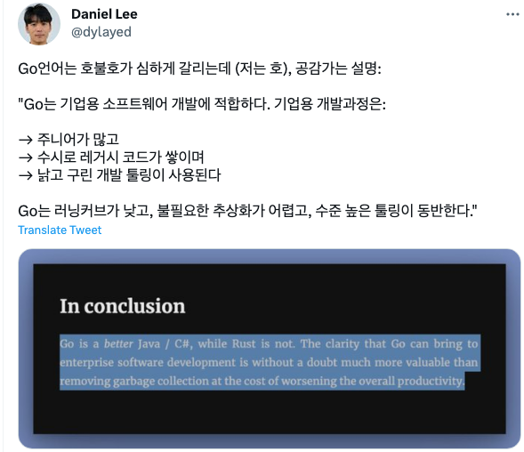

"장인정신"보다는 "공학적인 접근"에 더 가까운 언어같습니다. 

Google 개발팀이 소프트웨어를 대하는 태도랑 비슷한 것 같아요

## 23.05.12

[Why Go and not Rust  Loris Cro's Blog](https://kristoff.it/blog/why-go-and-not-rust/)

개발자로서, 우리는 종종 어떤 언어를 선택해야 할지에 대한 질문에 직면하게 됩니다. 이에 대해 Go와 Rust라는 두 언어를 가지고 비교를 해보았습니다. Go는 Google에서 개발하였고, Rust는 Mozilla에서 개발하였습니다. 두 언어 모두 시스템 수준의 프로그래밍에 적합하며, 메모리 관리와 동시성에 중점을 두고 있습니다. 그러나 각 언어는 서로 다른 철학을 가지고 있습니다.

|  | Go | Rust |
| --- | --- | --- |
| **속도** | 빠름 | 더 빠름 |
| **메모리 관리** | 효율적인 가비지 컬렉터 | 정적 메모리 관리 |
| **동시성** | 좋음 | 증명 가능한 동시성 |
| **추상화** | 인터페이스 | 트레이트와 기타 제로 비용 추상화 |
| **학습 난이도** | 낮음 | 높음 |
| **복잡성** | 낮음 | 높음 |
| **사용 사례** | 서비스 작성, 엔터프라이즈 소프트웨어 | 시스템 수준의 프로그래밍 |

먼저, Go는 서비스를 작성하는 데에 매우 유용합니다. Go는 구글에서 구글의 문제를 해결하기 위해 만들어졌습니다. 이는 주로 네트워크 서비스를 다루는 것을 의미하며, Go의 동시성 모델은 주로 여러 독립적인 요청을 처리해야 하는 서버 측 응용 프로그램에 적합합니다. Go는 HTTP와 관련 프로토콜에 대한 훌륭한 지원을 제공하며, 만족스러운 웹 서비스를 빠르게 작성할 수 있습니다.

|  | Go |
| --- | --- |
| **서비스 작성** | Go는 네트워크 서비스를 처리하는 데에 적합한 동시성 모델을 제공하며, HTTP 및 관련 프로토콜에 대한 훌륭한 지원을 제공합니다. |

또한, Go는 복잡성을 줄이는 데 초점을 맞춘 언어입니다. Go는 내장된 기능의 제한된 세트를 제공함으로써 쉽게 배울 수 있습니다. 더 중요한 것은, Go 프로젝트가 크기가 커져도 이해할 수 있도록 보장한다는 것입니다. Go의 창시자들은 Go를 "지루한" 언어라고 부르는데, 이는 Go가 "더 적은 것으로 더 많이 하도록 강요"하는 아이디어가 매우 성공적이었음을 보여줍니다.

|  | Go |
| --- | --- |
| **단순성** | Go는 제한된 언어 기능을 제공하여 배우기 쉽고, 프로젝트가 커져도 이해하기 쉽습니다. |

마지막으로, Go는 엔터프라이즈 소프트웨어 개발에 매우 유용합니다. 엔터프라이즈 소프트웨어 개발은 다른 종류의 개발과는 매우 다른 특성을 가지고 있습니다. 이는 큰 범위의 도메인을 다루고, 복잡한 프로세스를 관리해야 하는 것을 의미합니다. Go는 이러한 복잡성을 관리하는 데 매우 효과적입니다.

### Go is great for enterprise software

**As I already mentioned, Go was created to solve Google problems, and Google problems are definitely enterprise-scale problems.** Whether this was the direct aim of the creators or just the natural result of using it at a Big Corp, Go is indubitably an amazing breath of fresh air in enterprise software development.

#### Enterprise software development is about scale

Not in terms of total number of users, or amount of data. Often that’s the case too, but the defining characteristics are scale of **scope** and **process**.

**Enterprise software always has a big scope.** The domain can be big and wide, or narrow but stupidly complex. Sometimes it’s both. When creating software to model such domains, normal programming wisdom falls incredibly short because non-technological concerns out-weight most technological ones.

Because of the environment resulting from this general premise, a few well-known enterprise development “quirks” have emerged over time. I’ll name three relevant to my point.

1.  **There are a lot of junior developers** who learn on the job how to program and most are not lucky enough to find a job that will truly teach them anything. In some places, after you’re hired, you are stationed for one week in front of PluralSight and then you’re considered ready to go.
2.  **Software projects quickly become huge and complex for all the wrong reasons.** Big projects take time to build and people (or whole teams) will come and go in the meantime. Constant refactoring is never an option so each will leave behind a lot of code written with very varying levels of quality. Multiple teams working in parallel will produce redundant code. The domain shifts over time, inevitably invalidating older assumptions and consequently causing abstractions to leak. The more sophisticated an abstraction is, the higher the risk that it will become a problem when business comes back with a serious change request.
3.  **The toolchain is very often lousy and/or dated.** This is pretty much the inevitable result of all that I described so far. Huge amounts of old code tie you down to a specific toolset, junior developers will learn the status-quo at best, and the people on top (managers and stakeholders) are extremely often not prepared for making technological decisions based on first-hand experience, the general nature of the endeavor makes them risk-averse, causing them to mainly mimic what other successful players in their space do or, more precisely, what analysts _claim_ other successful players do.

#### Go is about suppressing complexity at scale

Go makes teams more successful, partially by giving them more than what they would get with other ecosystems, and partially by taking tools away from them, to prevent common pitfalls.

**Go is much easier to learn than Java or C#.** A faster ramp-up is generally good, but it becomes fundamental when the project is lagging behind, the deadline is approaching, and management inevitably resorts to hiring more people, hoping (in vain) to speed things up.

**The Go community regards as anti-patterns many abstractions regularly employed by Java / C#**, like IoC containers, or OOP inheritance, for example. There are only two levels of visibility for variables, and the only concurrency model is CSP. It’s way harder to fall into incomprehensible pitfalls when writing in Go than it is in Java / C#.

**The Go compiler is fast.** Which means that running tests is going to be faster in general, that deployments will take less time, increasing the overall productivity.

**With Go, it’s easier as a junior developer to be more productive, and harder as a mid-level developer to introduce brittle abstractions that will cause problems down the line.**

## 23.05.19

**쉽게 설명한 유니티 엔진 관점에서의 메모리 최적화**

- [출처](https://zhuanlan.zhihu.com/p/603847226)

# 내용(기계번역)

귀하의 게임이 PC에서 출시된 후 인기를 얻었고 리더가 게임이 휴대폰, 콘솔 등과 같은 더 많은 플랫폼과 모델에 도달할 수 있도록 게임 시장을 확장하기로 결정한 시나리오를 상상해 보십시오. 이때 귀하의 팀은 그러한 임무를 받았는데 한쪽은 매우 높은 기준과 높은 시각적 효과를 가진 게임을 제작하는 것이고 다른 한쪽은 성능을 위한 새로운 대상 플랫폼입니다.원래 게임의 모든 콘텐츠를 유지해야 합니다. 기존 플랫폼의 운영에 지장을 주지 않는 선에서 게임 콘텐츠의 업데이트를 지속적으로 이어가는 것도 필요하다. 이것은 매우 어려운 작업처럼 보입니다.

팀이 예비 교차 플랫폼 포팅 작업을 완료했고 게임이 이미 새 플랫폼에서 실행될 수 있다고 가정할 때 이 때 자주 발생하는 첫 번째 문제는 메모리 부족입니다. 현재 별도의 그래픽카드를 탑재한 PC 플랫폼의 가용 메모리는 기본적으로 시스템 메모리 8GB 이상 + 비디오 메모리 3GB 이상이며, 부족할 경우 디스크로 스왑이 가능하므로 일반 PC 게임은 메모리가 부족한 상황을 특별히 고려하지 않습니다.

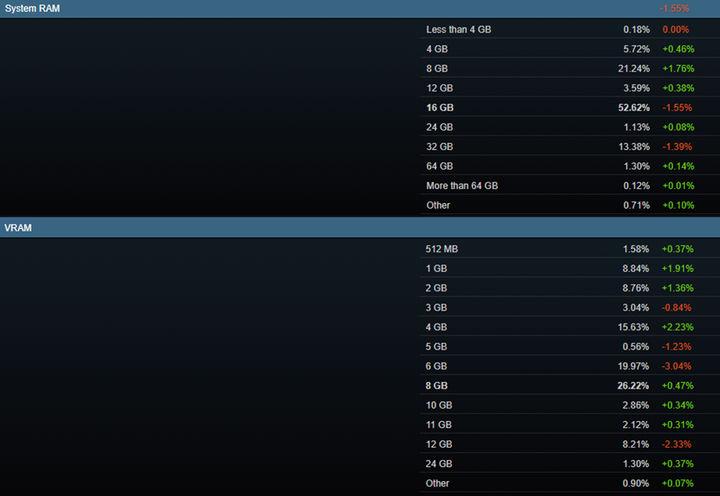

> 현재 PC 플랫폼의 주류 메모리/비디오 메모리 구성 비율

모바일 단말기와 호스트 단말기와 같은 플랫폼에서는 사용 가능한 메모리가 늘어나는 경우가 많으며 CPU와 GPU의 사용을 모두 고려해야 합니다. 엔진 개발 엔지니어로서 엔진 측에서 메모리를 최적화하는 방법은 무엇입니까? 저자는 다음과 같은 측면에서 생각해 볼 수 있다고 생각한다.

### 1\. 방만하게 쓰이는 부분들 예의주시하기

이 방법은 최적화 초기 단계에 더 적합하며 비교적 일반적인 최적화 방법이기도 합니다. 이 단계에서 메모리 프로파일의 데이터를 잘 분석해보면 '낭비'하는 곳이 많은 경우가 많은데, 몇 가지 변경만으로도 수백 메가바이트의 메모리를 절약할 수 있을지도 모른다. 저자는 특별히 주목해야 할 몇 가지 부분을 생각합니다.

-   텍스처, RT

구성이 낮은 플랫폼에 이식할 때 텍스처에 많은 공간이 압축될 수 있습니다. 렌더링 해상도가 낮아지면 텍스처도 적절하게 해상도가 낮아질 수 있습니다. 특히 일부 개체와 특수 효과는 화면 공간의 작은 부분을 차지합니다. 1080P 해상도에서 복잡한 디테일이 있는 패션의 경우 512x512의 해상도로 디테일을 유지하기에 충분하며, 큰 색상 블록이 있는 패션과 같이 디테일이 적은 패션의 경우 256x256 또는 128x128로도 충분합니다. 720P 해상도에서는 1080P에 비해 한 단계 낮출 수 있습니다. 메모리 요구 사항을 충족할 수 없는 경우 기본 텍스처(확산)의 해상도를 변경하지 않고 유지하면서 다른 텍스처의 해상도를 압축할 수 있습니다.

RT도 메모리를 많이 짜낼 수 있는 곳인데 각 RT의 크기에 더 신경을 써서 시간상 무리한 부분을 찾아보면 됩니다 예를 들어 아래 사진에서 R8 포맷의 RT는 실제로 동일한 해상도의 ARGB32 크기 조심스럽게 조사한 후 R8 형식의 RT에 깊이가 있음을 알 수 있으며 이 MaterialId RT에는 분명히 깊이 버퍼가 필요하지 않습니다.

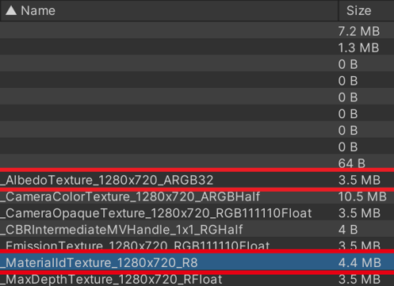

동일한 해상도의 여러 RT도 최대한 재사용 가능 예를 들어 후처리 단계에서 화면 크기의 여러 RT가 필요한 경우가 많으며 후처리 효과는 이전에 포스트에 사용했던 RT를 재사용할 수 있습니다. - 가공 효과. 이러한 임시 RT를 관리하기 위해 글로벌 RT 풀을 구현할 수 있으며 RT 해상도, 형식, 밉맵 및 깊이 비트에 따라 해시를 계산하여 프레임 내 다중화 효과를 얻을 수 있습니다. 동시에 풀의 RT 사용량에 대한 통계를 생성하여 오랫동안 사용하지 않은 RT를 자동으로 정리할 수 있습니다.

-   압축 옵션

Unity3D에서 일부 압축 옵션도 메모리에 상대적으로 큰 영향을 미칩니다. 예를 들어 Unity3D는 메쉬에 대한 정점 압축 및 메쉬 압축을 제공합니다. 그 중 꼭지점 압축을 켜면 메모리 사용에 일정한 최적화 효과가 있습니다.비용은 꼭지점의 정확도를 잃어 측정 정확도에 거의 영향을 미치지 않습니다.메시 압축을 켠 후 파일 크기는 에서 차지하는 메모리 공간이 증가하고 측정된 메모리 사용량이 거의 두 배가 될 수 있으므로 메쉬 압축을 해제할 수 있습니다.

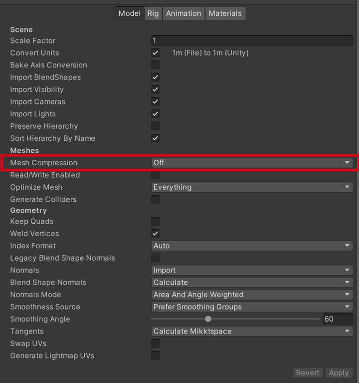

-   일부 데이터 구조의 오버헤드

해시 테이블과 같은 일부 컨테이너는 원래 문자열을 키로 사용할 수 있음 저장해야 할 것이 많은 경우 문자열을 저장하는 것은 큰 오버헤드, 일부 구조는 불필요한 문자열을 포함하거나 대용량 기타 속성을 직접 제거하여 저장 공간을 줄일 수 있음 많은 수로 할당될 일부 구조체의 경우 구조체의 패딩을 제거하여 일정량의 메모리 사용량을 줄일 수도 있습니다.

### 2\. 메모리 할당자의 공간 이용률 높이기

메모리 할당자는 엔진에서 가장 많이 사용되는 모듈 중 하나로 실제 프로젝트에서 메모리 할당자는 할당 성능과 공간 활용 사이의 균형을 추구하는 경우가 많으므로 메모리가 부족한 플랫폼의 경우 메모리 할당에 각별한 주의가 필요합니다. 서버의 오버헤드. 메모리 프로파일러 분석에서 게임의 메모리 할당자 공간 활용도가 매우 낮은 것으로 나타나면 메모리 할당자 최적화를 고려할 수 있습니다.

[Unity3D의 경우 영구 네이티브 메모리를 할당하는 데 사용되는 할당자는 주로 동적 힙 할당자와 버킷 할당자입니다(자세한 내용은 메모리 할당자 사용자 지정](https://link.zhihu.com/?target=https%3A//docs.unity3d.com/2021.2/Documentation/Manual/memory-allocator-customization.html) 참조 ). 그 중 버킷 할당자는 바이트 수준에서 작은 메모리를 할당하고 동적 힙 할당자는 더 큰 메모리를 할당합니다. Unity3D의 동적 힙 할당자는 TLSF 알고리즘을 사용하여 메모리를 할당합니다. TLSF 알고리즘의 구체적인 세부 사항은 여기에서 설명하지 않습니다. 관련 소스 코드는 이 저장소를 확인하십시오 [:](https://link.zhihu.com/?target=https%3A//github.com/mattconte/tlsf) [https://github.com/mattconte/tl sf](https://link.zhihu.com/?target=https%3A//github.com/mattconte/tlsf).

간단히 말해서 TLSF는 블록 형태로 메모리를 관리합니다. 즉, 먼저 시스템에서 큰 메모리 공간을 신청한 다음 이 공간을 분할하여 다양한 크기의 메모리 할당 요청을 충족시킵니다. 일반적으로 할당 성능을 고려하기 위해 블록의 크기는 수 메가바이트(Unity3D는 기본적으로 16MB)이며 TLSF 내부 메모리 할당의 세분성은 상대적으로 크므로 할당자 내부에 사용할 수 없는 일부 공간이 생성됩니다.

실제 프로젝트에서 각 크기 범위의 메모리 할당 수를 세어 보면 Unity3D 네이티브 메모리를 할당할 때 1k 바이트 미만의 메모리 할당이 대부분을 차지하는 것을 관찰할 수도 있습니다. 각 블록의 할당에 대한 통계를 만들면 수십 또는 수백 바이트의 개체가 많은 블록을 점유하고 해제할 수 없는 것을 관찰할 수 있습니다. 이는 아마도 다음과 같은 상황일 것입니다.

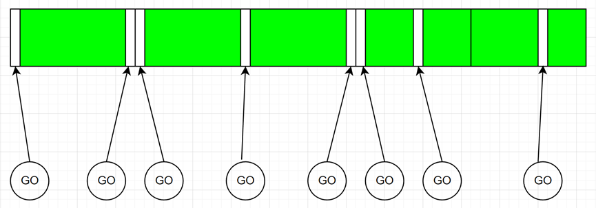

TLSF의 각 블록의 크기는 이 부분의 메모리 사용량을 줄이기 위해 적절하게 줄일 수 있습니다. 그러나 실제 테스트에서는 개선의 이 부분이 명확하지 않습니다. 이때 Unity3D에서 제공하는 다른 할당자인 버킷 할당자를 사용할 수 있습니다. Bucket allocator는 작은 메모리 할당에 특별히 사용되는 lock-free 할당자로서 메모리 할당의 세분성을 더 세밀하게 설정할 수 있기 때문에 내부 단편화 비율은 TLSF 할당자보다 낮습니다.

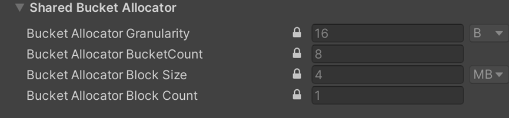

Unity3D는 할당 세분성, 버킷 수, 블록 크기 및 수의 네 가지 구성 옵션이 있는 버킷 할당자를 제공합니다. 블록의 개념은 TLSF 블록과 유사합니다. 버킷 할당자는 시스템에서 한 번에 대용량 메모리를 신청한 다음 블록을 나눕니다. 서로 다른 크기의 하나의 버킷에 넣고 실제 메모리 할당 시 가장 가까운 크기의 버킷 주소를 반환합니다.

버킷의 크기는 할당 세분성 및 버킷 수에 의해 결정됩니다. 기본 16B 및 8 버킷을 예로 들면 8 버킷의 크기는 16B, 32B, 48B, 64B, 80B, 96B, 112B 및 128B. 이 두 매개변수는 또한 버킷 할당자가 할당할 수 있는 메모리 크기의 상한(128B)을 결정합니다. 블록의 수와 블록의 크기는 버킷 할당자가 총 할당할 수 있는 메모리 양을 결정하며, 기본 4MB와 1을 예로 들면 총 4MB의 메모리를 할당할 수 있습니다. 초과분은 TLSF를 사용하여 할당됩니다.

일부 소규모 프로젝트에서는 기본 매개변수가 충분할 수 있지만 이 설정은 우리 프로젝트에서 너무 보수적입니다.실제 테스트 후 1k바이트 미만의 메모리 할당 크기는 400~500MB에 이를 수 있습니다. -효과적인. 버킷 수를 64개로 설정하고 버킷이 할당할 수 있는 총 크기를 512MB로 설정하면 해당 요구 사항이 충족되고 기본 메모리의 예약률도 감소합니다.

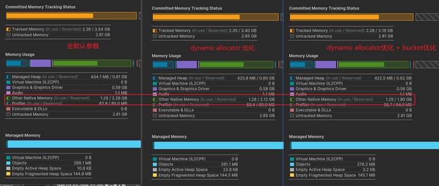

### 3\. 게임 오브젝트 제거링크 복사

먼저 일반적으로 Unity 장면이 어떻게 구성되는지 생각해 보세요. 아티스트가 생성된 장면 개체의 FBX를 Unity3D 프로젝트로 가져온 후 LOD, 재료, 일부 매개변수를 조정하면 런타임 시 프로그램에서 작성한 관련 로직이 프리팹을 로드하고 이를 장면의 게임 오브젝트로 인스턴스화합니다.

대규모 장면의 경우 동시에 관리되는 GamaObject의 수는 수만 개가 될 수 있으며 일반적으로 이러한 GameObject를 관리하기 위해 장면 스트리밍을 사용합니다. 즉, 전체 장면을 mxm 블록으로 나누고 주변 nxn 블록 캐릭터를 중심으로 로드되며, 그 외 지역은 HLOD를 사용합니다. 블록의 로딩 창은 일반적으로 5 x 5, 3 x 3, 1 x 1 등입니다. 로드 및 언로드에 대한 더 복잡한 판단 메커니즘이 있을 수 있으므로 여기에서 확장하지 않습니다.

메모리를 분석해본 결과, Mesh만 해도 10,000개 이상으로 많으며, 800MB 이상의 메모리를 점유하고 있으며, GameObjects, Transforms, MeshRenderer가 수만 개가 넘는다는 것을 알 수 있습니다. 이는 메모리를 점유할 뿐만 아니라 내부 메모리 조각화를 심화시키고 성능에 영향을 미칩니다. 따라서 이 부분을 최적화하는 것이 중요합니다.

|   | 수량 | 사용된 내부 메모리 |
| --- | --- | --- |
| 망사 | 10169 | 0.82GB |
| 게임오브젝트 | 85071 | 18.8MB |
| 변환 | 74641 | 20.9MB |
| 메쉬렌더러 | 34892 | 20.9MB |
| 총 메모리(목록에 없는 항목 포함) | / | 5.4GB |

최적화 방향은 불필요한 GameObjects의 로딩을 줄이는 것뿐만 아니라 이러한 GameObjects의 상당 부분이 정적 개체라는 점에 유의하는 것입니다. 이러한 정적 개체의 경우 런타임에만 필요합니다.메시, 재료 및 변환 데이터 GameObject 자체의 메모리 오버헤드와 엔진에 연결된 구성 요소 외에도 instanceID 및 종속 번들의 증가로 인해 일부 내부 컨테이너가 확장되고 숨겨진 비용 등이 있습니다.

따라서 우리는 두 가지 각도에서 최적화할 수 있습니다: 자체 파이프라인을 사용하여 정적 객체를 렌더링하고 Unity GameObject의 오버헤드를 피하고 장면에서 불필요한 객체를 언로드합니다.

첫 번째 사항을 수행하려면 먼저 GameObject에서 관리하는 데이터 구조로 장면 구성 데이터를 내보내야 합니다. 원본 GameObject(프리팹 형태)의 구성 구조는 아래 그림과 같습니다. LOD의 각 수준은 여러 렌더러에 해당하며 각 렌더러에는 고유한 변환, 메시 및 재질이 있습니다.


`RendererData`세 가지 구조를 개별적으로 정의하고 원본 GameObject의 각 LOD 레벨 렌더러의 해당 메시 및 재료 데이터를 두 개의 목록으로 전달하고 해당 데이터를 기록 `ScenePrefab`하고 데이터를 변환할 수 있습니다. GameObject LOD의 각 레벨에 포함된 렌더러는 타일링되어 다른 배열 에 저장되며 각 LOD의 해당 합계는 에 기록 됩니다 . 마지막으로 원본 GameObject를 교체하여 런타임에 개체를 설명하면 장면 스트리밍 동적 처리에 편리합니다.`SceneObject``meshIndex``materialIndex``RendererData``RendererData``allRenderers``allRenderers``lodXRendererStart``lodXRendererLength``ScenePrefab``SceneObject`

```
public struct RendererData
{
    public int prefabIndex;
    public int meshIndex;
    public int materialIndex;

    public ShadowCastingMode shadowCastMode;

    public Unity.Mathematics.float4x4 localToObject;
    public short enableTransparent;
}

struct ScenePrefab
{
    public int prefabValidFlag;

    public int lod0RendererStart;
    public int lod0RendererLength;
    public int lod1RendererStart;
    public int lod1RendererLength;
    public int lod2RendererStart;
    public int lod2RendererLength;

    public float lod0Distance;
    public float lod1Distance;
    public float lod2Distance;
}

public struct SceneObject
{
    public float loadPriority;
    public float3 worldPosition;
    public quaternion worldQuaternion;
    public float3 worldScale;

    public float3 aabbCenter;
    public float3 aabbExtents;

    public int prefabIndex;
    public int idInScene;
}

```

원본 데이터가 처리된 후 다음과 같은 형태로 재구성됩니다. 이와 같이 GameObject(prefab)로 정리된 원본 씬 데이터를 자체 씬 데이터로 교체하여 GameObject를 사용하여 발생하는 추가 오버헤드를 버리고 필요에 따라 해당 리소스를 로드/언로드하는 것도 편리합니다.

예를 들어 LOD의 다른 레벨은 현재 표시된 LOD 레벨에 필요한 리소스만 로드하면 됩니다.실제 테스트에서 장면의 오브젝트 중 60% 이상이 LOD2입니다.LOD1 및 LOD0과 비교할 때 LOD2의 볼륨은 의심 할 여지없이 매우 작습니다. 기본 LOD 그룹은 LOD 레벨에서 참조하는 모든 메시를 로드해야 하며 요청 시 LOD를 로드하면 메모리의 절반 이상을 절약할 수 있습니다. `AssetDatabase`단, FBX를 Unity3D로 임포트한 후 FBX 자체가 Unity3D에서 메인 에셋이고 메시, 애니메이션 클립 등은 모두 서브 에셋이라는 점에 유의해야 합니다 .

현재 GameObject가 없기 때문에 사용자 정의 데이터 구조를 통해 메시를 직접 인덱싱해야 하며 Unity3D는 `AssetBundle.LoadAsync<Mesh>("xxxxxx.fbx")`. 그러나 Unity3D의 로딩 메커니즘은 전체 FBX의 모든 서브 에셋을 로드하게 되므로 온 디맨드 로딩의 목적을 달성할 수 없기 때문에 서브 에셋을 정확하게 로드하거나 전처리를 위한 새로운 인터페이스를 구현해야 합니다. FBX 메시를 생성하고 새 자산으로 저장합니다.


런타임에 장면 스트리밍은 여전히 원래 논리로 장면을 관리하지만 로드 요청이 시작되면 로드할 프리팹이 사전 처리된 리소스 목록에 없으면 원래 로드 및 렌더링 프로세스가 계속 사용됩니다. 기존 프로세스는 건너뛰고, 일부 프로세스는 새로운 프로세스가 관리되기를 기다리고 있으며, 해당 의사 코드는 다음과 같습니다. `foreach`의사 코드의 /는 `for`데모용일 뿐이며 실제 사용 시 잡 시스템에서 병렬화해야 합니다 .

```
void MainTick()
{
    ...
    // Scene streaming更新, 更新相机位置，要加载的区块等
    SceneStreamingUpdate();

    // loading流程
    while (loadTasks.Count > 0)
    {
        var loadTask = loadTasks.Dequeue();
         var prefabIndex = GetLoadingPrefabIndex(loadTask);
         // allSceneObjectPrefabIndex预处理时生成, 记录了所有SceneObject的prefabIndex
         if (allSceneObjectPrefabIndex.Contains(prefabIndex))
             continue;
         // 原先的加载逻辑
         LoadPrefab(prefabIndex);
         ...
    }

    // 新的加载流程
    // 从SceneStreaming中获得当前加载的Section，将原先的GameObject信息转为SceneObject格式
    foreach (var sectionIndex in loadingSectionIndices)
    {
        // sectionStaticObjects预处理时生成，记录了每个区块中的静态物体
        foreach(SceneObject staticObj in sectionStaticObjects[sectionIndex])
        {
            staticObjectInSections.Add(staticObj);
        }
    }
    // 对要加载的区块内的物体进行裁剪
    foreach (SceneObject sceneObj in staticObjectInSections)
    {
        if(IsVisible())
            visibleObjects.Add(sceneObj);
    }
    // 计算每个可见物体的LOD
    for (int i = 0; i < visibleObjects.Count; ++i)
    {
        int lod = CalculateLOD(visibleObjects[i], currentCamera);
        visibleObjectLODs[i] = lod;
    }
    // 根据LOD，索引得到正确的ScenePrefab和RendererData数据
    for (int objIndex = 0; objIndex < visibleObjects.Count; ++objIndex)
    {
        SceneObject sceneObj = visibleObjects[objIndex];
        // allPrefabs预处理时生成
        ScenePrefab prefab = allPrefabs[sceneObj.prefabIndex]
        int lod = visibleObjectLODs[objIndex];
        // 从ScenePrefab获取对应LOD的lodXRendererStart和lodXRendererLength
        LODToRendererInfo(lod, ref prefab, out int rendererStart, out int rendererLength);
        for (int i = rendererStart; i < rendererLength; ++i)
        {
            int rendererIndex = rendererStart + i;
            // allRenderers即上文的allRenderers
            RendererData renderer = allRenderers[rendererIndex];
            // 判断一下当前LOD的sceneObj是否需要加载
            if (NeedLoadRenderer(lod, sceneObj))
                needLoadRenderers.Add(renderer);
            // 将renderer添加到待渲染列表
            validRenderers.Add(renderer);
        }
    }

    // 加载renderers
    LoadRenderers(needLoadRenderers);

    // 渲染renderers
    DrawRenderers(vaildRenderers);
}

```

장면에서 개체를 자를 때 SSD가 있는 일부 장치의 경우 IO를 메모리로 교환할 수 있습니다. 따라서 로드할 블록의 오브젝트에 대해 사전에 프러스텀 컬링을 수행할 수 있습니다. PVS에 의해 컬링된 개체도 언로딩 대기열에 직접 들어갈 수 있습니다. 이것은 시야에 넓은 차단 영역이 있을 때 매우 잘 작동합니다. 절두체 컬링 외에도 빛의 방향으로 그림자 컬링을 수행하여 화면 밖에 있지만 그림자가 여전히 화면에 있는 객체를 유지합니다.

SSD가 없는 장치의 경우 HDD의 IO 속도에 의해 제한되며 보기 원뿔 외부의 모든 개체를 언로드하는 전략으로 인해 보기 각도가 회전할 때 새 메시가 너무 늦게 로드됩니다. 따라서 가까운 오브젝트는 정상적으로 렌더링되고 멀리 있는 오브젝트는 비동기 IO를 통해 점진적으로 로드되도록 카메라 근처의 특정 범위 내 오브젝트를 유지하도록 컬링 전략도 수정해야 합니다.

최적화가 완료되고 메모리를 카운트한 후 메시가 차지하는 메모리는 적정량에 관계없이 크게 줄었고 GameObjects, Transforms, MeshRenderer의 수는 절반 이상 줄었고 총 메모리 사용량은 881MB로 줄었습니다 최적화 효과는 매우 분명합니다.

|   | 최적화 전 수량 | 최적화된 수량 | 줄이다 | 최적화 전 메모리 | 최적화된 메모리 | 줄이다 |
| --- | --- | --- | --- | --- | --- | --- |
| 망사 | 10169 | 3097 | 7072 | 0.82GB | 281.5MB | 558.18MB |
| 게임오브젝트 | 85071 | 38352 | 46719 | 18.8MB | 10.1MB | 8.7MB |
| 변환 | 74641 | 28017 | 46624 | 20.9MB | 10.0MB | 10.9MB |
| 메쉬렌더러 | 34892 | 4885 | 30007 | 20.9MB | 2.9MB | 18MB |
| 총 메모리(목록에 없는 항목 포함) | / | / | / | 5.29GB | 4.43GB | 881MB |


## 23.05.23

# 변별력을 200% 더 높인 개발자 채용 방법: 코드 리뷰 테스트

강남언니의 요즘 개발자 채용 방법

- [강남언니 블로그](https://blog.gangnamunni.com/post/code-review-test/)

# 문제

다른 많은 회사와 비슷하게 강남언니 개발자 채용 과정은 `서류 → 코딩 테스트 → 인터뷰` 이렇게 3단계로 이루어져 있었습니다. 코딩 테스트로 기본적인 문제 해결력과 코딩 능력을 알아보고 자세한 역량은 인터뷰로 파악했습니다. 오랫동안 안정적으로 운영되던 합리적인 방법이었습니다.

그런데 지원자 수가 계속 늘어나면서 문제가 발생했습니다. 인터뷰에 필요한 시간이 크게 늘었습니다. 인터뷰어의 수와 시간이 부족했던 저희는 대안이 필요했습니다.

## 일반적인 사전 테스트

많은 회사에서 인터뷰 이전에 코딩 테스트 또는 사전 과제 단계를 채택하고 있습니다. 각각의 장점과 한계는 다음과 같습니다.

1.  코딩 테스트
    
    -   장점: 문제 해결력, 코딩 능력, 자료 구조 활용 능력 검증 가능
        
    -   한계
        
        -   **확인 필요한 역량 중 일부만 검증 가능**
        -   AI를 이용한 치팅, 어뷰징이 쉬움 (ex. ChatGPT)
2.  사전 과제
    
    -   장점: 직접적으로 실무 능력 파악 가능
        
    -   한계
        
        -   지원자의 시간적 부담이 큼 (3일 - 2주)
            
        -   낮은 과제 제출률 (과제마다 다르겠지만, 모 회사의 경우 제출률이 50% 이하라고 합니다.)
            

저희는 코딩 테스트에서 볼 수 있는 역량 외에도 확인하고 싶은 것이 많았기 때문에 인터뷰 비용이 많이 들었습니다. 코딩 테스트를 더 어렵게 바꾸는 것도 좋은 방법이 아니었습니다. 일부 역량의 기준을 높이는 것보다 더 많은 역량을 효율적으로 파악하는 방법이 필요했기 때문입니다. 더 많은 인재를 만나기 어려운 사전 과제도 선택할 수 없었습니다.  
**지원자의 부담을 키우지 않으면서, 코딩 테스트보다 다양한 역량을 파악할 수 있는 인터뷰 전 테스트**를 찾고 싶었습니다.

  

# 코드 리뷰 테스트

코드 리뷰는 개발자가 매일 수행하는 실무 중 하나입니다. 코드 리뷰를 통해 설계와 구현의 문제를 찾아내고 더 나은 코드를 만들 수 있게 합니다. 적절한 코드가 주어진다면 그에 대한 코드 리뷰로 개발자의 실무 능력을 파악할 수 있습니다. 저희는 지원자가 **코드 리뷰를 제출하는 테스트**를 만들어보기로 했습니다.

게다가 과제 전형에 비해 지원자가 느끼는 심리적, 시간적 부담도 크지 않습니다. 집을 짓는 것보다 지어진 집에 대해 피드백하기가 더 쉬운 법이니까요. 잘 만든다면 시험으로 느껴지는 코딩 테스트보다도 덜 부담스러울 수 있습니다.

### 코드 리뷰 테스트의 장점과 한계

#### 장점

-   직접적으로 실무 능력 파악 가능
    
-   문제를 인식하는 능력 파악 가능
    
-   검증 항목을 유연하게 설정 가능
    
-   협업 및 커뮤니케이션 능력 확인 가능
    
-   지원자가 느끼는 심리적, 시간적 부담이 적음
    

#### 한계

-   코드 리뷰가 익숙하지 않은 신입 대상으로 사용할 수 없음
    
    → 신입의 경우는 코딩테스트나 사전 과제 등 다른 방법 사용 가능
    
-   특정 언어와 프레임워크에 연관되어 개발 직군별로 테스트를 각각 만들어야 함
    
    → 실무 능력을 확인할 수 있는 장점의 트레이드 오프로써 감수함
    
    → 일반적인 주제도 많이 포함시켜 다양한 사람들이 충분한 역량을 보여줄 수 있도록 함
    

## 적절한 코드 리뷰 테스트 만들기

모든 코드 리뷰 테스트가 좋은 것은 아닙니다. 효과적이고 부담 없는 테스트를 만들기 위해서는 의도적인 노력을 기울여야 합니다.

### 효과적인 코드 리뷰 테스트

오타에 대한 리뷰만 받을 수 있는 PR은 의미가 없습니다. 먼저 저희가 중요하게 생각하는 기술 주제들을 신중하게 골랐습니다. 시스템 디자인, 클래스 설계, 웹 서비스 고려사항, 엔터프라이즈 레벨 제품 고려사항, 테스트, Java와 Spring, DB 등이 있었습니다. 이에 대해 풍부하게 이야기할 수 있도록 프로젝트와 PR을 설계했습니다.

### 부담 없는 코드 리뷰 테스트

처음 보는 누구나 이해하기 쉽게 하는데 많이 신경썼습니다. 프로젝트의 전체 라인 수가 800여 줄에 불과하며 PR 크기도 작게 만들었습니다. PR에서 추가하는 전체 코드가 240줄이고 그 중 테스트 코드가 115줄입니다. 물론 README도 상세하게 적었습니다.

그 결과 사내 모의 테스트에서 1시간이면 충분히 풀 수 있다는 피드백을 받았습니다.

## 런칭


이렇게 준비를 마치고 2023년 3월 드디어 코드 리뷰 테스트 운영을 시작했습니다. 4월까지 40명의 지원자가 코드 리뷰 테스트를 경험했습니다. 지원자는 개인별로 만들어진 리포지토리에서 3일 동안 자유롭게 코드 리뷰를 작성할 수 있습니다.

# 코드 리뷰 테스트의 효과

코드 리뷰 테스트의 도입으로 **인터뷰 전 테스트의 변별력이 2배 이상 올라가서 인터뷰 시간이 50% 이상, 한 달에 30시간가량 감소했습니다.** 합격자 수와 수준을 그대로 유지하면서요. 지원자의 코드 리뷰를 보고 같이 일하고 싶은 사람인지 아닌지에 대해 높은 확신을 가지고 판단할 수 있었습니다.

## 23.07.04

- The file 'none' is corrupted! Remove it and launch unity again!

희안한 일인데 애셋 번들을 언로드 했다가 다시 로드하는 경우, 
그 번들의 주소를 갱신하지 못한 프로그램의 어딘가에서 '번들' 내부의 '애셋'에 접근 시도하는 순간 예외가 터진다.......

[loaded Asset bundle reporting 'file none is corrupted' - Unity Forum](https://forum.unity.com/)

## 23.07.08

찾아보면서 알게 된 컷씬과 관련된 제약들

- 나이를 강제 고정하는 구간이 있다. 신체 사이즈가 다르면 카메라 프레이밍을 벗어날 수 있거나 모션이 부자연스러울 수 있는 등의(ex: 악수) 이유들 때문에. 
- 플레이어가 무기를 던지거나 다른 손으로 바꿔 쥐어선 안된다. 체형/ 나이 /키에 따라서 무기 위치를 리포지션 하는 것이 어렵다.

## 23.07.10

**끼임 탈출**

온갖 게임에서 발생하는 캐릭터가 지형지물에 끼어서 이러지도 저러지도 못하는 현상, 제안된 해결 방법 중에 타 게임에서 사용하는 방법을 적용하기로.

ui 버튼을 추가하는 것이 궁색해 보일 수 있지만, 게임 흐름을 회복시키는 최후의 수단이기도 하다.

- 끼임 탈출을 명령어나 UI로 사용할 수 있다.
- 끼임 탈출은 재사용 시간이 있다.
- 끼임 탈출을 사용하면 프로젝트에서 정의하는 “적당히 널직한 공간”으로 워프를 시켜 준다.

## 23.07.13

**HLOD**

[Hierarchical Level of Detail Overview  Unreal Engine 4.27 Documentation](chrome-extension://pcmpcfapbekmbjjkdalcgopdkipoggdi/4.27/en-US/BuildingWorlds/HLOD/Overview/)

Hierarchical Level of Detail (or HLOD), in its simplest form, is a way to combine pre-existing Static Mesh Actors into a single HLOD Proxy Mesh and Material (with atlased Textures). Using HLOD may lead to increased performance as they reduce draw calls down to one call per Proxy Mesh as opposed to a draw call for each individual Static Mesh Actor. When generating HLOD Proxy Meshes, there several parameters you can adjust which help define how Static Mesh Actors are grouped together as clusters that will ultimately be built into Proxy Meshes. 

- 계층형 LOD. 그러니까 카메라가 멀어지면 로우 디테일 메쉬로 스왑하는 것은 일반 LOD 와 동일한데 HLOD 의 경우는 다수의 메쉬를 하나의 통합된 로우 디테일 메쉬로 통합해 버리는 형태다.
- 오브젝트가 많을 때 로우 디테일 메쉬라도 하나하나 일일이 그리는게 부담이 된다. 그래서 전부 컬링해 버리고 하나의 거대한 로우 폴리로 대체하는 것

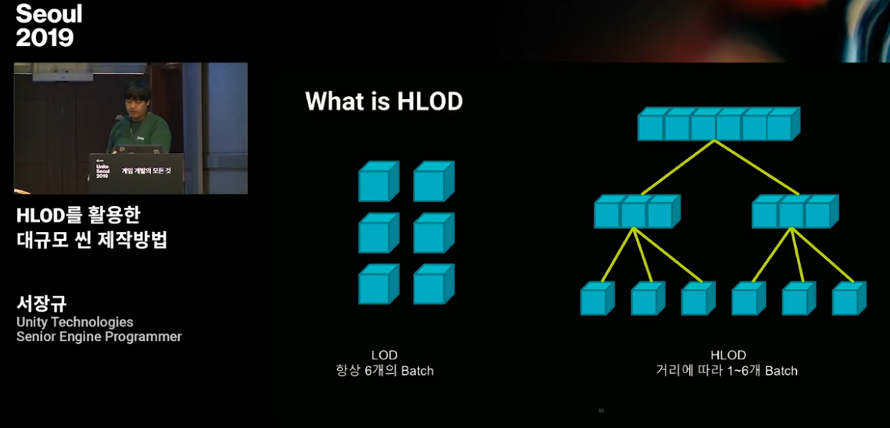

## 23.07.17

**유니티 에셋 번들 수동 빌드**

- 유니티는 내부에서 무슨 일을 하는지 모르기 때문에 에셋 증분 번들 빌드가 느리면 개발자만 속 터진다.
- 번들 의존성을 미리 알 수 있다면(AssetBundleBuild[]) 수동으로 빌드를 걸 수 있다고 한다. (BuildPipeline.BuildAssetBundles)

[Unity - Scripting API BuildPipeline.BuildAssetBundles](https://docs.unity3d.com/ScriptReference/BuildPipeline.BuildAssetBundles.html)

**서버성능 부하테스트**

서버 부하테스트를 진행하는데, 멀티스레딩 작업에 일감을 투입하면 부하가 선형적(linear)으로 늘어나는게 아니라 급격하게 뛰어오른다.

논의되는 내용으로는...

- IOCP 리시브 스레드에서 락 컨텐션 줄이기
  - 오늘날의 머신은 CPU 속도가 빨라지고 코어 개수가 많아지고 상대적으로 캐시 미스 비용은 늘어났기 떄문에 CPU 사이클을 좀 낭비해도 캐시미스를 피하는게 최선일 것. 락 컨텐션도 줄여야 한다.
  - C# BlockingCollection이 추천됨
- dynamic_cast 는 피한다
- 패킷 send는 한꺼번에 몰아서 하자
- GC는 피한다. 모든 스레드를 브레이크하는 것은 역시 부담이 크기 때문에
  - 서버 코드도 가능하면 메모리 낭비없이 풀링하는 것으로

## 23.07.19

**KPI(Key Performance Indicator)**

[1. KPI 그거 뭐야](http://expertchoice.co.kr/KPI_%EB%8F%84%EC%B6%9C/KPI_%EA%B7%B8%EA%B1%B0_%EB%AD%90%EC%95%BC.html)

- 핵심 성과 지표.

관련해서 생각해보아야 하는 것이 ‘성과’와 ‘핵심’이라는 단어의 실제적 의미이다. 자주 사용하다 보니 성과와 핵심이라는 개념에 대하여 누구나 나름의 인식을 가지고 있을 것이다. 그런데 그것이 추상적이고 구체적이지 못하다는데 문제가 있다.
 

실용적 관점에서 볼 때 ‘성과’라는 것을 어떻게 해석하는 것이 올바른 것일까? 경쟁자보다 시장점유율이 더 높으면 성과가 있는 것인가? 경쟁자보다 이익이 더 많으면 성과가 있는 것인가? 경쟁자보다 명성(브랜드 파워)이 더 높으면 성과가 있는 것인가? 아니면 회사가 스스로 정한 매출 목표를 달성하면 성과가 있는 것인가? 회사가 스스로 정한 이익 목표를 달성하면 성과가 있는 것인가? 회사가 스스로 정한 수준의 명성(브랜드 파워)을 얻으면 성과가 있는 것인가? 두가지를 강조해야 할 것 같다.

첫째, ‘성과’란 남에 대한 비교우위가 아니라 내가 정한 목표가 기준이 되어야 한다는 점이다. 물론 내 목표를 정하기 위해 남의 목표를 참고할 수 있으나 궁극적으로는 내가 정한 목표가 기준이 되어야 한다. 다시 말해 A가 큰 규모의 이익 실현을 목표로 정하였더라도, 나는 높은 매출액을 목표로 정할 수 있는 것이며, C는 높은 수준의 명성(브랜드 파워) 획득을 목표로 정할 수 있는 것이다. 또한 나의 매출 목표를 달성한 후에는 향후 매출 목표를 과거 수준으로 동결하고 이익 규모의 향상을 목표로 정할 수 있다. 그렇게 하는 것이 필요하다. 즉 각자의 전략과 상황에 맞추어 정한 각자의 목표를 달성하면 성과가 있는 것이다. 그런데 우리는 ‘내가 정한 목표의 달성’이 아니라 ‘남보다 더 잘해야’ 또는 ‘과거보다 더 잘해야’ 성과가 있다고 생각하는 경우가 많다.

둘째, ‘성과’는 개별 부문들 성과의 단순 집계가 아니라 관련 부문들의 유기적 통합의 관점에서 보아야 한다는 점이다. 예를 들어, 매출, 이익, 명성(브랜드 파워)이 균형 잡힌 상태에 있을 때 성과가 있는 것이다. 매출, 이익, 명성(브랜드 파워)이 모두 경쟁자보다 더 높으면 높은 성과를 달성한 것이라고 생각할 수 있다. 그러나 이 경우에도 균형을 잃었다면 성과가 높다고 보기 어렵다. 비록 현재의 매출, 이익, 명성(브랜드 파워) 모두 경쟁자보다 높더라도 매출과 이익을 무리하게 높였다면 곧 명성을 해칠 소지를 만들었을 가능성이 매우 높기 때문이다. 그런데 우리는 모든 부문에서 무조건 과거보다 또는 남보다 더 많이 달성하면 성과가 있다고 착각하고 있다. 조직의 건강 증진에 기여할 때 성과가 있는 것이며, 이는 관련 부문 간 조화, 즉 균형(balance)이 잡힌 경우이다.

- Nexon 계열의 프로젝트에서는 동접 / 결제, 광고 / 앱 다운로드 경로 / 사용자 정보 (국가, 연령, 디바이스 .. ) 등등을 kpi 지표로 분류한다.

**사전 정의된 컨텐츠 데이터 중 일부는 게임 플레이 내내 한 번도 읽지 않는다**

- 그런데 이런 데이터를 메모리에 올리면 클라이언트 디바이스 메모리 낭비이기 때문에... 조치를 취하고 있다.
- 엑셀의 데이터 중 일부분을 로드하도록

## 23.07.20

**유저 채널링 / DB 그룹핑**

- RDB 하나가 맡을 수 있는 유저 수는 한정되어 있다. DB 갱신이 잦은 mmorpg 환경에서는 대략 만명??
- 그래서 유저 그룹별로 맡는 DB 가 나눠져 있다.
  - 게임 상에서 '서버 이동' 같은 것을 할 때, 리니지처럼, 같은 DB 안에서 이동하는 경우는 처리가 쉽다고 한다.
  - DB 그룹이 다른 유저들이 게임 상에서 서로 관측할 수 없다는 것은 아니다.
- 유저들이 서로 관측 / 상호작용 가능한 논리적 공간을 나누는 경우가 있다. 보통 채널링(channeling)이라고 표현된다.
  - 게임 컨텐츠에서는 각 채널마다 똑같이 컨텐츠를 스트리밍 해주지만은 몇 가지 채널 경계를 넘어서 광역적으로 표현되는 컨텐츠가 존재한다.
  - 유저가 운영하는 상점 / 부동산 컨텐츠 등...
- '끈끈한 관계' => '느슨한 관계'
  - 유저 채널링이 도입된 mmo 중에서 옛날 옛적 마비노기 / 메이플 스토리는 유저가 자신이 어느 채널에 있는지 확인할 수 있고 스스로 선택해서 채널을 이동할 수 있다.
  - 최근 mmo들, 디아블로4가 대표적인데 요새는 유저가 채널 개념을 직접 노출시키지 않는다. 게임을 입장하면 아무채널에 배정되고 만나는 사람들은 전부 다르다. 친구 유저와 파티를 맺는 경우에 친구와 동일한 채널에 배치시키는 처리 정도가 있다.
    - 채널 배정 권한이 유저에게서 업계쪽으로 넘어왔기 때문에, 업계는 여기에 사업 전략을 끼워넣는다. 뉴비는 사람이 많은 채널로 보내고, 비슷한 공감대에 있을 법한 유저는 자주 마주치도록 배정한다.
  - 사람들의 관계가 느슨해지고 있다. 예전의 끈끈한 관계보다 잠깐 만나고 헤어지는 관계가 추세다.

## 23.07.27

대규모 테스트 실행

- 중에 프레임 스파이크가 눈에 띈다(1초). 하지만 하루 10건 정도 발생하는 편이라서 굉장히 양호한 편.
- 2세대 메모리 가비지가 대규모로 수거되는 것이 원인으로 추정 중

## 23.08.14

- 개발 중에 프로젝트의 DB 스키마가 변경되거나(테이블의 행이 제거되는 경우), DB에 기록되는 프로젝트 데이터가 변경(데이터 추가는 해당 안되는데 변경/제거되는 경우) 시 DB 리셋이 필요하다.
  - DB 리셋 이후에는 기존 캐릭터 정부가 전부 유실된다. 정책상 어쩔 수 없는데, DB와 관련있는 데이터 변경되었다면 아전에 기록된 DB 내용은 더 이상 유효하지 않아서.
  - QA 기간 중에 DB 리셋이 자주 발생해서 QA 작업자 분들이 플레이하던 캐릭터가 삭제되 곤란하다는 애로사항이 제보되었다. 빌드마다 새 캐릭터를 만들어서 첫 구간부터 다시 플레이하는 것이 문제. 개발용 목적의 DB 캐릭터 정보 마이그레이션 기능이 있으면 좋겠다고... 

- 서버 OutOfMemory를 항상 걱정하기
  - 서버는 클라와 다르게 OutOfMemory 문제에서 비교적 자유롭다. 왜냐하면 클라처럼 아트 리소스(Mesh, Texture)를 다루지 않고 로직 관련 정보를 쥐고 있기 때문에 메모리를 많이 먹지 않는다.
  - 예외적으로 DB 관련 작업을 하는 서버들, 예를 들어 DB 캐시 데이터를 메모리에 쥐고 있는 거래소 등은 이런 우려를 피해갈 수가 없다고 함... 
  - 만에 하나 DB 관련 서비스는 중간에 터지면 게임이 성립하지 못하기 때문에 대형 사고로 이어진다.
  - 한밤중에 서버 문제로 전화를 받거나 장애 보고서를 쓰기 싫다면 미리미리 잘해두자.

## 23.08.17

[개발팀과 개발팀장이 사라져야 하는 이유](https://seokjun.kim/no-reason-for-dev-team/)

1. 팀의 역할과 책임, 회사의 방향 그리고 프로덕트 자체의 니즈는 종종 충돌한다.

프로덕트 니즈라는 것은 그럼 무엇인가? 프로덕트는 어떻게 보면 유저와 회사만이 가지고 있는 니즈라고 볼 수 있다. 눈에 드러나지 않고, 대충 감은 오지만 감각적으로 느껴야 하는 부분이다. 유저가 우리 서비스에 더 머무르게 할 수 있는 기능 이라고 정의할 수 있을 것 같은데, 예를 들어서 “휴대폰을 구매를 완료하고, 케이스 구매로 연결하는 기능” 이다. 잘 만들면 유저의 편의를 해치지 않으면서 매출에 기여할 수 있는 킬러 피쳐가 될 수도 있을 것이다.

어떻게 보면 큰 틀에서 프로덕트와 회사의 니즈는 거리가 무척 가깝다. 우리 서비스에 더 오래 머무르게 하는 것이, 결국 회사의 매출을 증대시킬 테니까.

그런데 개발팀의 입장은 약간 다르다. 웹사이트가 브라우저에서 잘 동작하게 하는 것은 사실 프론트엔드 개발”자” 에게 당연한 것이다. 당연한 것을 계속하는 것에 대해서 평가하는 것은 매우 어렵다. 서비스가 뭐 일주일을 멈춘다면 당연히 문제가 있겠지만, 보통은 충분히 납득가는 선에서 장애가 일어나고 이러한 부분에 대해서 평가를 박하게 하는 것인 개발자를 무척 소극적으로 만들 것이다.

2. 다른 기능 조직의 역할에 공감을 하기 어렵다.

기능 조직의 가장 큰 단점이 바로 이 공감부족에서 나타난다.

회사의 규모가 어느정도 커지면 이제 개발팀장의 역할은 일을 막는 사람으로 변질된다. 그도 그럴것이 팀 사이의 수많은 회의에 참가해야 하고, 다양한 의견을 디펜스 하면서, 때로는 방향 제시도 필요하다. 한편으로 회의 결과를 팀과 공유하고 필요한 리소스를 분배해야 하며, 종종 직접 개발을 해야할때도 있다. 5~6명만 넘어서도 개별 업무 진행 상황을 파악하기도 어렵고, 이럴때 할 수 있는 최선은 수비적으로 대응하는 것이다. 즉, “확인하고 말씀드리겠습니다.” 기껏 한시간의 회의를 했는데 결론은 “다음에 말씀드릴게요.” 다른 바쁜일 때문에 깜빡 하기라도 하면, 요청한 팀의 입장에서는 “더럽게 안도와주네” 가 된다.

또한 리소스를 분배하다보니 이전 코드를 작성하지 않았던 사람이 해당 코드를 수정하게 되면서 여러가지 버그나 의도하지 않았던 문제들이 발생하는 경우도 종종 있다. 문서화 잘~~ 하면 되지 않냐고? 문서화가 잘된 개발 프로젝트라는 것은 강물과 비슷하다. 잘 해두더라도, 곧 흘러가버린다. 자기가 쓴 코드라도 3개월만 지나면, 처음 보는 코드와 다를 것이 별로 없다.

3. 팀의 전문성이 없다.

회사 입장에서 팀의 전문성은 아마 매출과 연결할 수 밖에 없을 것이다. 팀의 전문성이 올라가면 비용이 줄어든다거나 아니 좀 더 본질적으로 매출이 올라가는 것을 기대할 것이다.  개발팀의 전문성은 상관관계는 있으나 인과관계는 없다고 봐야 한다. 개발을 잘한다고 회사가 돈을 더 버는 것은 아니니까.

또한 개발팀 입장에서 매출은 뭐랄까 나와는 별로 상관 없는 어떤 것 일 경우가 많다. 이것 또한 개발팀을 욕할 수 없는 것이 매출 말고도 개발자가 신경 써야 할 것은 매우 많다. 역으로 개발을 잘한다고 매출이 올라가는 것이 아니기 때문에 개발팀의 목적은 개발 그 자체로 향하는 것이 어찌보면 당연한 것이다. 개발팀의 목적은 개발을 잘하기 위함이 아니던가? 그래서 기능 조직으로 구성된 회사의 개발팀은 대체로 이질적인 존재가 된다. 가뜩이나 커뮤니케이션 스킬이 부족한 개발자를 더더욱 회사의 목적과 다르게 유도하게 된다. 이런 개발팀에서 오랫동안 경력이 쌓이면, 당연히 폐쇄적이고 아집에 빠지기 쉬운 사람이 될 수 밖에 없다.

전문성이 없으니 당연히 자율성도 떨어진다. 뭘 해야할지 모르니까.

누구도 의도하지 않았지만 개발자와 개발팀은 회사에서 고립되고 소통하기 어려운 사람(들)이 된다. 다른 팀들도 개발팀은 다루기 어렵고 불편한 존재가 되어 회의 때마다 어떻게 해야 하나 고민이다. 또한 대체할 수 없는 경우가 많기 때문에 오히려 CEO 조차도 개발자의 눈치를 봐야 하는 경우가 생기기도 한다. 다행히도 우리에겐 “목적 조직” 이라는 대안이 존재한다.

우선 이 목적 조직에 대해서 정의를 하고 넘어가자.

목적 조직 이란 해당 목적을 달성할 책임과 권한을 모두 가지고 있어야 한다.
즉, 어떤 목적을 달성하기 위해 시작부터 끝까지의 전 과정을 가급적이면 팀 내에서 해결해야 한다는 것이다. 기획에서 디자인, 개발 그리고 배포 까지 전부 한 팀에서 결정하고 실행할 수 있어야 한다. 마케팅이나 영업까지도 할 수 있으면 더더욱 좋다. 기획자의 자리가 점점 더 좁아지고 있는 것은 이러한 목적 조직의 등장 과도 결을 같이한다. 디자이너가 한 팀에 존재하면서 UI 에서 UX 디자인으로의 전환이 이루어졌고, 개발자가 하나의 분야를 담당하면서 백엔드, 프론트엔드가 아니라 풀스택 개발이라는 개념도 나타났다.

엔지니어 출신 CEO 가 많아지는 이유도 바로 여기에서 기인한다. 목적 조직의 리더는 가장 피드백하기 어려운 직군 출신이 되야 하는데, (평가와 지시를 제대로 내리기 위해서) 개발 분야가 바로 그렇기 때문이다. 목적 조직의 리더들 중 많은 사람이 개발자라면, 최고 책임자가 개발자 출신이 되는 것은 필연적일 것이다.

[GitHub - CysharpMagicOnion Unified RealtimeAPI framework for .NET platform and Unity.](https://github.com/Cysharp/MagicOnion)

- 시프트업의 니케(Nikke)에서 멀티 레이드를 구현할 때 사용한 라이브러리이다.
- 니케 멀티 레이드 스펙은
  - 레이드 참가 인원 수 제한이 있고 (5명)
  - 상시 오픈되는 컨텐츠는 아닌 모양이다.(이벤트 기간에만 사용하는)
- 그러니 실시간 통신을 빠르게 구현할 방법이 관건인데 이런 배경에서 MagicOnion 을 선택한 듯 하다. 

## 23.08.18

c# 인터페이스에서 선언한 메서드를 구현하면 반드시 virtual 메서드가 된다. vtable을 본다는 건데

- vtable을 읽느라 캐시 미스가 증가하게 되고
- 메모리에서 읽은 주소를 가지고 다시 코드를 읽어와야 해서 CPU 안에서 파이프라인 스톨을 일으키고
- 인라인도 불가능하다. 그러니까 느리다.

빡센 최적화가 필요하다면 눈여겨봐야 한다.

[Stop Using React - DEV Community](https://dev.to/ender_minyard/why-you-should-stop-using-react-g7c)

- 쓰지 말라고 한다.
- 느려서
- 인터넷이란 원래 HTML 등의 컨텐츠를 '스트리밍'하지만 리액트는 그러지 않는댄다. 시대를 역행하는 녀석이라고...

[이제 React.js 를 버릴 때가 왔다](https://www.seokjun.kim/time-to-stop-react/)

React 가 SPA 로 인기가 있었던 이유는 내가 볼때는 SSR 이 가장 컸다. 당시 angular로 만든 프로젝트는 SSR 이 불가능했기 때문에 javascript 가 로드되는 시간동안 로딩화면을 보여줄 수 밖에 없었고, 당시 google 로봇 또한 SPA 를 이해하지 못했다. React 는 javascript 로 dom tree 를 만들고 이를 브라우저에 렌더링 하는 형식이라 SSR 에 유리했고, 초기 React 의 인기는 여기에서 유래했다고 해도 과언이 아니다. “SEO 가 가능한 SPA 라고?”

2. hooks 는 좋지 않은 선택이었다.
나는 솔직히 class Button extends React.Component 가 그립다. hook 과 functional component 가 간결하다는 것은 분명히 인정한다. 간결하다는 것이 항상 구조적으로 단단하다는 의미는 아니고, functional 에 너무 집착해서 오히려 functional programming 에서 멀어진 것이 현재 React 의 hook 컨셉이라고 본다.

어떤 data 가 하나 변경될때마다 해당 dom 을 찾아서 그 값을 바꾸는 방식은 매우 귀찮고 고된 일이었고, 이에 대한 부담을 거의 없애버린 React 는 당연히 매력적인 컴포넌트를 만드는 방식이었다. 어떤 복잡한 일련의 프로세스를 컴포넌트에서 처리해야 하는 경우일수록 React 는 매력적이었다. 그런데 지금은? hooks 의 장점을 살리려면 side effect 에 의존한 state sync 방식으로 코딩을 해야 하는데, 이는 솔직히 매우 가독성이 떨어지고 버그를 양산할 수 밖에 없다. 반면 Component 의 Lifecycle 메소드들은 이해하기 쉬웠고, 절차적으로 처리해야 하는 경우 코드의 흐름을 파악하기 적당히 용이했다. (솔직히 이전에도 편하진 않았다.) 

웹을 구성하는 렌더링 요소의 대부분은 Component 로 만들어야 할 필요가 없다. 아니 Component 의 장점은 분명히 존재하는데, 그게 꼭 라이프 싸이클을 가진 Reactive 컴포넌트일 필요는 없다는 말이다. 대부분의 경우 class 네임으로 처리가 가능하고, React 가 필요할만한 복잡한 컴포넌트는 프로젝트에서 비중이 높지 않다. 아니 오히려 React 화 되면서 괜히 더 복잡해지고 어려워진 면이 없지 않다. Component 기반의 개발이 유용한 것은 하나의 페이지에 복잡한 일을 하는 UI 요소들이 존재할 때, 이 상태를 트래킹하며 UI 를 렌더링 하는 동작을 구현하기 어렵기 때문이다. 이를 vanilla javascript 로 하면 더더욱 그렇다. 한 page 를 여러개의 component 로 분리하고 개별 component 안에서 변경되는 데이터를 단순화하면 테스트 하기도 편하고 각 요소당 써야하는 코드의 양이 줄어들기 때문에 훨씬 구조적인 어플리케이션을 개발하기 좋다.

React 는 초기 컨셉이었던 뷰 라이브러리로서도 많은 문제를 가지고 있다. setState 의 변태성으로 인한 피곤함, functional 이라면서 side effect 를 장려하는 기묘한 컨셉, lifecycle method 들이 기피대상이 되고 hook 이 새로 등장하며 난해해진 컴포넌트 가독성 등 설계부터 잘못된 부분이 있다고 본다. React 만이 가지고 있던 장점은 이미 후발주자들이 훨씬 진보된(?) 형태로 보여주고 있고, 웹 개발 씬에서 SPA 자체에 대한 회의가 점점 커지고 있다는 것도 무시할 수 없다. GraphQL 은 React 와 별개로 존재하는 것이 어렵지 않고, redux 는 GraphQL 과 궁합이 매우 안좋다보니 벌써 사라져간다.

[GitHub - tc39proposal-pipeline-operator A proposal for adding a useful pipe operator to JavaScript.](https://github.com/tc39/proposal-pipeline-operator)

### Deep nesting is hard to read

- 왼쪽을 보다가.. 오른쪽을 보다가...
  
Consider this [real-world code from React](https://github.com/facebook/react/blob/17.0.2/scripts/jest/jest-cli.js#L295).

```js
console.log(
  chalk.dim(
    `$ ${Object.keys(envars)
      .map(envar =>
        `${envar}=${envars[envar]}`)
      .join(' ')
    }`,
    'node',
    args.join(' ')));
```

This real-world code is made of **deeply nested expressions**. In order to read its flow of data, a human’s eyes must first:

1.  Find the **initial data** (the innermost expression, `envars`).
    
2.  And then scan **back and forth** repeatedly from **inside out** for each data transformation, each one either an easily missed prefix operator on the left or a suffix operators on the right:
    1.  `Object.keys()` (left side),
    2.  `.map()` (right side),
    3.  `.join()` (right side),
    4.  A template literal (both sides),
    5.  `chalk.dim()` (left side), then
    6.  `console.log()` (left side).

…we can **untangle** it as such using a pipe operator and a placeholder token (`%`) standing in for the previous operation’s value:

```js
Object.keys(envars)
  .map(envar => `${envar}=${envars[envar]}`)
  .join(' ')
  |> `$ ${%}`
  |> chalk.dim(%, 'node', args.join(' '))
  |> console.log(%);
```

Now, the human reader can **rapidly find** the **initial data** (what had been the most innermost expression, `envars`), then **linearly** read, from **left to right**, each transformation on the data.


### Temporary variables are often tedious

- 많은 프로그래들은 괴로운 네이밍 고민을 피해갈 수 없는데, 메서드 체이닝으로 명명에 대한 부담을 줄일 수 있다. 이름을 짓지 않게끔 코드를 짜는 것이다.

One could argue that using **temporary variables** should be the only way to untangle deeply nested code. Explicitly naming every step’s variable causes something similar to method chaining to happen, with similar benefits to reading and writing code.

For example, using our previous modified [real-world example from React](https://github.com/facebook/react/blob/17.0.2/scripts/jest/jest-cli.js):

```js
Object.keys(envars)
  .map(envar => `${envar}=${envars[envar]}`)
  .join(' ')
  |> `$ ${%}`
  |> chalk.dim(%, 'node', args.join(' '))
  |> console.log(%);
```

…a version using temporary variables would look like this:

```js
const envarString = Object.keys(envars)
  .map(envar => `${envar}=${envars[envar]}`)
  .join(' ');
const consoleText = `$ ${envarString}`;
const coloredConsoleText = chalk.dim(consoleText, 'node', args.join(' '));
console.log(coloredConsoleText);
```

But there are reasons why we encounter deeply nested expressions in each other’s code **all the time in the real world**, **rather than** lines of temporary variables. And there are reasons why the **method-chain-based [fluent interfaces](https://en.wikipedia.org/wiki/Fluent_interface)** of jQuery, Mocha, and so on are still **popular**.

It is often simply too **tedious and wordy** to **write** code with a long sequence of temporary, single-use variables. It is arguably even tedious and visually noisy for a human to **read**, too.

If [**naming** is one of the **most difficult tasks** in programming](https://martinfowler.com/bliki/TwoHardThings.html), then programmers will **inevitably avoid naming** variables when they perceive their benefit to be relatively small.

## 23.08.21

게임 프로젝트 DB 사용 패턴에서 데이터 '삭제'를 수행하는 경우, 실제 데이터를 DELETE 하지 않고 해당 데이터의 삭제 시간 컬럼을 수정하는 식으로 우회함. 혹시라도 오동작이 있는 경우 데이터 복구를 편하게 하기 위함인데, 대부분의 테이블은 보존 가치가 적고 UPDATE 보다 DELETE가 퍼포먼스가 더 좋다고 한다.

## 23.08.22

**데이터 관리**

엑셀 포맷으로 관리하는 데이터의 경우, 프로젝트 버전별로 포함 / 미포함 여부가 관리될 수 있어야 하는 수요가 생겼다.

- 이번 마일스톤에는 포함되지만 이후 버전에서는 버려지는 사례.
- 다음 마일스톤부터 포함되는 사례

데이터에 버전을 명시하는 헤더 정보로 관리할 수 있겠다.

## 23.08.25

**서버 측 CPU 성능**

시간이 지날 수록 cpu 단일 코어의 성능이 크게 향상됨. 1초에 처리할 수 있는 명령어 갯수가 많아지고 명령어 / 데이터 캐시도 커졌다. 하지만 cpu 코어 갯수는 4코어 ~ 8코어 수준을 유지하고 있다.

cpu 성능을 극대화 하기 위해서는 코어를 전부 사용해야 하는 것이 맞다. 하지만 주의할 것은 한 스레드가 다른 스레드 작업을 막아버린다면 코어 갯수가 몇개가 되던간에 제자리 cpu 사용률은 제자리 걸음이라는 것.

- 그러니 멀티 스레드에서 공유 lock 을 거는 구간은 cpu 병목을 유발할 수 있다.
- 멀티 스레드 환경에서 컨텍스트 스위칭이 발생하면 cpu cache flush가 일어나 캐시가 전부 휘발될 수 있다.
- 코어 갯수보다 단일 코어의 성능이 크게 향상되는 방향으로 하드웨어 발전이 되어온 만큼. 싱글 스레드 코드가 성능이 더 좋을 수 있다.

## 23.08.29

IOS 앱 패치를 하려면 애플 검수를 받아야 하는데 이 과정이 되게 골치아프다.

돈이 드는 것은 아니지만,

- 검수를 미리 보내야 하고
- 검수 기간 동안 전용 서버를 열어놔야 하고
- 응답이 제 때 안오면 업데이트 일정이 밀림

게임 에서 UI 하나 고치거나 하는 마이너 이슈로 매번 검수를 받아야 한다면... 대책을 새로 세워야 한다.

## 23.09.08

**서킷 브레이커**

- [네이버 메인 페이지의 트래픽 처리](https://d2.naver.com/helloworld/6070967)

서킷 브레이커는 외부 서비스의 장애로 인한 연쇄적 장애 전파를 막기 위해 자동으로 외부 서비스와 연결을 차단 및 복구하는 역할을 한다. 서킷 브레이커를 사용하는 목적은 애플리케이션의 안정성과 장애 저항력을 높이는 데 있다. 분산 환경에서는 네트워크 일시 단절 또는 트래픽 폭증으로 인한 간헐적 시간 초과 등의 상황이 종종 발생한다. 이로 인해 다음과 같은 연쇄 장애가 발생할 가능성이 있다.

1.  트래픽 폭증으로 인해 API 서버 등 외부 서비스의 응답이 느려진다.
2.  외부 서비스의 응답이 타임아웃 시간을 초과하면 데이터를 받아오기 위해 외부 서비스를 다시 호출한다.
3.  이전에 들어온 트래픽을 다 처리하지 못한 상태에서 재시도 트래픽이 추가로 적체되어 외부 서비스에 장애가 발생한다.
4.  외부 서비스의 장애로 인하여 데이터를 수신하지 못해 네이버 메인 서비스에도 장애가 발생한다.

일시적인 경우라면 2, 3회 재시도로 정상 데이터를 수신할 수 있다. 하지만 장애 상황이라면 계속 재시도하는 것이 의미도 없을 뿐 아니라 외부 서비스의 장애 복구에 악영향을 미칠 수 있다. 이럴 때는 외부 서비스에서 데이터를 받아오는 것을 포기하고 미리 준비된 응답을 사용자에게 전달하는 것이 시스템 안정성 및 사용 편의성 측면에서 옳다고 할 수 있다.

## 23.09.19

프로젝트에서 사용한 gui 프레임워크 몇 가지

- [picoeEto Cross platform GUI framework for desktop and mobile applications in .NET](https://github.com/picoe/Eto)
- [tryphotinophotino.NET](https://github.com/tryphotino/photino.NET)

이래저래 고민한 지점들을 나열하면

- 유니티가 너무 느리다. 독립적으로 실행할 수 있는 애플리케이션이 필요하다.
- 프로젝트에서 C# 언어를 사용한다. 게임 쪽 공용 코드를 gui 에 붙일 수 있는가
- IMGUI 컨셉으로 가자. 코드레벨에서 뷰 로직을 다 해결 볼 수 있으면 좋겠다.
  - Retained Mode API(MFC, WinForms, 웹 브라우저 DOM 등)
    - 애플리케이션 코드가 화면에 그려질 요소들을 객체 트리로 만들어 놓으면 렌더러가 가져가서 그린다.
    - 애플리케이션 데이터가 변경될 때, 그에 맞춰 화면에 그릴 요소들을 변경하는 코드를 짜야한다.
  - Immediate Mode API(DirectX, OpenGL, Dear ImGui)
    - 애플리케이션 코드가 화면에 그려질 요소들을 매 프레임마다 그리기 명령을 만들어서 넘겨주면 렌더러가 명령을 받아서 그린다.
    - 애플리케이션 최신 데이터를 읽어서 화면에 그려지기 위한 명령어로 번역하는 코드만 짜면 된다.
- 프로젝트 작업자 분들 중에서는 맥 사용자도 있다. 멀티플랫폼 대응이 가능한가
- 너무 무겁지는 않은가
- c# 으로 처음부터 끝까지 완성할 수 있는가. 다른 애플리케이션 프레임워크처럼 javaScript / typeScript를 붙이는지

## 23.09.20

[How Discord Stores Trillions of Messages](https://discord.com/blog/how-discord-stores-trillions-of-messages)

Discord 에서 메세지 보관 DB 를 Cassandra -> ScyllaDB 로 변경한 사례

- Cassandra 는 자바로 작성되었기 때문에 GC 가 레이턴시를 유발할 수 있음
- ScyllaDB는 C / C++ 로 작성되어져 그렇지 않다. 
  - ScyllaDB 역시 단점은 있지만은 GC에 의해 성능 이슈를 유발하지 않는 게 큰 장점
- 엄청난 트래픽을 감당해내기 위해, DB Cluster와 API monolith 중간에 data service 레이어를 추가했다. 이 레이어는 Rust로 작성했다.
  - C/C++ 은 type safety 를 보장하지 않는데 Rust 를 사용했더니 컴파일 단계에서 경고를 받을 수 있어 좋았다고 한다. Rust 가 c/c++ 이랑 비슷한 퍼포먼스 보여주는 것도 장점
  - Rust 로 병렬 처리 동작을 작성할 때 유리했다. 예컨대 비슷한 시간대에 DB 의 같은 위치의 데이터를 읽는 요청이 중복해서 날아온다면, 이 요청을 데이터 서비스 레이어에서 묶어서(request coalescing) DB 측에는 한번의 요청만 가도록
  - 데이터 서비스 레이어에는 비즈니스 로직이 없고, 각 쿼리마다 대응하는 gRPC 로 구성되었다.

## 23.09.25

[Discord가 Go에서 Rust로 전환하는 이유](https://discord.com/blog/why-discord-is-switching-from-go-to-rust)

- Go 언어가 가진 특성 중 메모리 모델과 가비지 컬렉터가 cpu 성능 스파이크를 유발합니다.
- Go의 [Garbage collector 구현](https://github.com/golang/go/blob/895b7c85addfffe19b66d8ca71c31799d6e55990/src/runtime/proc.go#L4481-L4486)을 보면 반드시 2분 간격으로 gc 를 구동하도록 작성되었기 때문에, 실제 2분마다 스파이크가 발생했다.
- Rust 는 메모리를 엄격하게 관리하는 메모리 모델이기 때문에 (GC 가 따로 없고) Rust를 사용한다면 이 문제를 해결할 수 있었다.
  - 하지만 Rust 도입 당시 언어 내적으로 비동기 기능이 약했다고 한다. (네트워크 서비스에서 비동기 루틴은 필수) 커뮤니티 라이브러리가 있지만 에러메세지가 비직관적인다던가 등 팀에서 채택하기에는 위험성이 있었다.
  - Rust 언어팀에서 아직 개발중인 비동기 기능을 채택함. 디스코드는 Rust 의 잠재력을 일찌감치 알아봤다구

We kept digging and learned the spikes were huge not because of a massive amount of ready-to-free memory, but because the garbage collector needed to scan the entire LRU cache in order to determine if the memory was truly free from references. Thus, we figured a smaller LRU cache would be faster because the garbage collector would have less to scan. So we added another setting to the service to change the size of the LRU cache and changed the architecture to have many partitioned LRU caches per server.

We were right. With the LRU cache smaller, garbage collection resulted in smaller spikes.

Unfortunately, the trade off of making the LRU cache smaller resulted in higher 99th latency times. This is because if the cache is smaller it’s less likely for a user’s Read State to be in the cache. If it’s not in the cache then we have to do a database load.

우리는 계속해서 조사를 했고, 즉시 해제 가능한 메모리의 양이 많아서가 아니라 메모리에 참조가 없는지 확인하기 위해 가비지 수집기가 전체 LRU 캐시를 스캔해야 했기 때문에 급증이 엄청났다는 것을 알게 되었습니다.

- 그래서 LRU Cache를 줄였더니 GC 시간이 줄어들었다. 하지만 당연하게도 캐시가 작으면 각 유저 서비스가 읽어들어야 할 정보가 캐시에 포함되기 어려워진다.