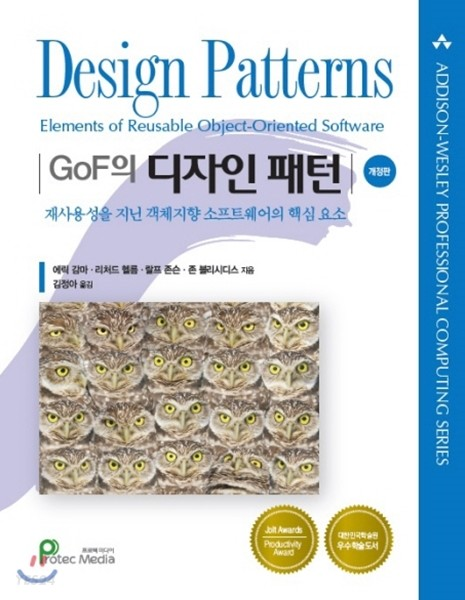

# GoF의 디자인 패턴

## 요약

**생성 패턴(Creational Patterns)**

- 추상 팩토리(Abstract Factory) : 구체적인 클래스를 지정하지 않고 관련성을 갖는 객체들의 집합을 생성하거나 서로 독립적인 객체들의 집합을 생성할 수 있는 인터페이스를 제공하는 패턴입니다.
- 빌더(Builder) : 복합 객체의 생성 과정과 표현 방법을 분리하여 동일한 생성 절차에서 서로 다른 표현 결과를 만들 수 있게 하는 패턴입니다.
- 팩토리 메서드(Factory Method) : 객체를 생성하는 인터페이스는 미리 정의하되, 인스턴스를 만들 클래스의 결정은 서브클래스 쪽에서 내리는 패턴입니다. 팩토리 메서드 패턴에서는 클래스의 인스턴스를 만드는 시점을 서브클래스로 미룹니다.
- 원형(Prototype) : 생성할 객체의 종류를 명세하는 데에 원형이 되는 예시물을 이용하고, 그 원형을 복사함으로써 새로운 객체를 생성하는 패턴입니다.
- 단일체(Singleton) : 어떤 클래스의 인스턴스는 오직 하나임을 보장하며, 이 인스턴스에 접근할 수 있는 전역적인 접촉점을 제공하는 패턴입니다.

**구조 패턴(Structural Patterns)**

- 적응자(Adapter) : 클래스의 인터페이스를 사용자가 기대하는 다른 인터페이스로 변환하는 패턴으로, 호환성이 없는 인터페이스 때문에 함께 동작할 수 없는 클래스들이 함께 작동하도록 해 줍니다.
- 가교(Bridge) : 구현부에서 추상층을 분리하여 각자 독립적으로 변형할 수 있게 하는 패턴입니다.
- 복합체(Composite) : 객체들의 관계를 트리 구조로 구성하여 부분-전체 계층을 표현하는 패턴으로, 사용자가 단일 객체와 복합 객체 모두 동일하게 다루도록 합니다.
- 장식자(Decorator) : 주어진 상황 및 용도에 따라 어떤 객체에 책임을 덧붙이는 패턴으로, 기능 확장이 필요할 때 서브클래싱 대신 쓸 수 있는 유연한 대안이 될 수 있습니다.
- 파사드(Facade) : 서브시스템에 있는 인터페이스 집합에 대해서 하나의 통합된 인터페이스를 제공하는 패턴으로, 서브시스템을 좀더 사용하기 편하게 만드는 상위 수준의 인터페이스를 정의합니다.
- 플라이급(Flyweight) : 크기가 작은 객체가 여러 개 있을 때, 공유를 통해 이들을 효율적으로 지원하는 패턴입니다.
- 프록시(Proxy) : 어떤 다른 객체로 접근하는 것을 통제하기 위해서 그 객체의 대리자(surrogate) 또는 자리 채움자(placeholder)를 제공하는 패턴입니다.

**행동 패턴(Behavioral Patterns)**

- 책임 연쇄(Chain of Responsibility) : 요청을 처리할 수 있는 기회를 하나 이상의 객체에게 부여하여 요청을 보내는 객체와 그 요청을 받는 객체 사이의 결합을 피하는 패턴입니다. 요청을 받을 수 있는 객체를 연쇄적으로 묶고, 실제 요청을 처리할 객체를 만날 때까지 객체 고리를 따라서 요청을 전달합니다.
- 명령(Command) : 요청을 객체의 형태로 캡슐화하여 서로 요청이 다른 사용자의 매개변수화, 요청 저장 또는 로깅, 그리고 연산의 취소를 지원하게 만드는 패터입니다.
- 해석자(Interpreter) : 주어진 언어에 대해, 그 언어의 문법을 위한 표현 수단을 정의하고, 이와 아울러 그 표현 수단을 사용하여 해당 언어로 작성된 문장을 해석하는 해석기를 정의하는 패턴입니다.
- 반복자(Iterator) : 내부 표현부를 노출하지 않고 어떤 객체 집합에 속한 원소들을 순차적으로 접근할 수 있는 방법을 제공하는 패턴입니다.
- 중재자(Mediator) : 한 집합에 속해있는 객체들의 상호작용을 캡슐화하는 객체를 정하는 패턴입니다. 객체들이 직접 서로를 참조하지 않도록 함으로써 객체들 사이의 소결합(loose coupling)을 촉진시키며, 개발자가 객체들의 상호작용을 독립적으로 다양화시킬 수 있게 만듭니다.
- 메멘토(Memento) : 캡슐화를 위배하지 않은 채로 어떤 객체의 내부 상태를 잡아내고 실체화시켜, 이후에 해당 객체가 그 상태로 되돌아올 수 있도록 하는 패턴입니다.
- 감시자(Observer) : 객체들 사이에 일 대 다의 의존관계를 정의해 두어, 어떤 객체의 상태가 변할 때 그  객체에 의존성을 가진 다른 객체들이 그 변화를 통지받고 자동으로 갱신될 수 있게 만드는 패턴입니다.
- 상태(State) : 객체의 내부 상태에 따라 스스로 행동을 변경할 수 있게끔 허가하는 패턴으로, 이렇게 하면 객체는 마치 자신의 클래스를 바꾸는 것처럼 보입니다.
- 전략(Strategy) : 동일 계열의 알고리즘군을 정의하고, 각각의 알고리즘을 캡슐화하며, 이들을 상호 교환이 가능하도록 만드는 패턴입니다. 알고리즘을 사용하는 사용자와 상관없이 독립적으로 알고리즘을 다양하게 변경할 수 있게 합니다.
- 템플릿 메서드(Template Method) : 객체의 연산에는 알고리즘의 뼈대만을 정의하고 각 단계에서 수행할 구체적 처리는 서브클래스 쪽으로 미루는 패턴입니다. 알고리즘의 구조 자체는 그대로 놔둔 채 알고리즘 각 단게의 처리를 서브클래스에서 재정의할 수 있게 합니다.
- 방문자(Visitor) : 객체 구조를 이루는 원소에 대해 수행할 연산을 표현하는 패턴으로, 연산을 적용할 원소의 클래스를 변경하지 않고도 새로운 연산을 정의할 수 있게 합니다.

## Chapter 1 서론

- 이 책에서 이야기하는 디자인 패턴은 "**특정한 전후 관계에서 일반적 설계 문제를 해결하기 위해 상호교류하는 수정 가능한 객체와 클래스들에 대한 설명**" 입니다.
  - 하나의 디자인 패턴은 재사용 가능한 객체지향 설계를 만들기 위해 유용한 공통의 설계 구조에서 주요 요소들을 식별하여 이들에게 적당한 이름을 주고 추상화합니다. 그리고 패턴에 참여하는 클래스와 그들의 인스턴스를 식별하여 역할과 그들 간의 협력 관계를 정의하고 책임을 할당합니다. 각 디자인 패턴은 각자 맡은 객체지향 설계 문제에 집중합니다. 언제 패턴을 적용할지, 다른 설계 제약을 고려하여 패턴을 적용할 수 있는지, 패턴을 사용하면 어떤 결과가 발생하는지도 친절히 설명합니다.

 

- 초보자들은 너무 많은 개념과 이를 실행할 수 있는 다양한 방법론에 당황해서, 자신들이 전에 사용했던 객체지향 기술이 아닌 쪽으로 다시 되돌아갈 수 있습니다. 초보자들은 "좋은 객체지향 설계란 무엇일까요?"를 이해하는 데만도 꽤 오랜 시간이 걸립니다.
- 전문가들은 초보자들처럼 모든 문제를 처음 기초 단계에서부터 해결하려고 하지 않습니다. 대신, 전에 사용했던 해결책을 다시 사용해 봅니다. 그리고 좋은 방법을 찾아냈다면 그 방법을 반복해서 계속 사용하게 됩니다. 이런 경험을 통해 전문가가 만들어지고, 결국에는 많은 객체지향 시슽메에서 클래스 패턴이나 객체들 간의 상호작용 방식이 반복됨을 알게 됩니다. 이런 반복된 패턴들은 특정 설계의 문제점들을 해결해 주고, 좀더 근사하며, 재사용 가능한 객체지향 소프트웨어를 만들어 줍니다.
- 디자인 패턴을 이용하면 좋은 설계나 아키텍처를 재사용하기 쉬워집니다. 입증된 기술을 디자인 패턴으로 표현해 두면 새로운 시스템 개발자들은 디자인 패턴을 더 자주 유용하게 사용할 수 있습니다. 디자인 패턴은 설계자로 하여금 재사용이 가능한 설계는 선택하고, 재사용을 방해하는 설계는 배제하도록 도와줍니다. 또한 패턴을 쓰면 이미 만든 시스템의 유지보수나 문서화도 개선할 수 있고, 클래스의 명세도 정확하게 할 수 있으며, 객체 간의 상호작용 또는 설계의 의도 등까지 명확하게 정의할 수 있습니다. 간단하게 말해서, 디자인 패턴은 설계자들이 "올바른" 설계를 빨리 만들 수 있도록 도와줍니다.

- 일반적으로 하나의 패턴에는 다음의 네 가지 요소가 반드시 들어 있습니다.
  - 패턴 이름(pattern name)
  - 문제(problem)
  - 해법(solution)
  - 결과(consequence)

**런타임 및 컵파일 타임의 구조를 관계짓기**

- 객체 관계 중에는 집합(aggregation)과 인지(acquaintance)라는 것이 있습니다. 집합은 한 객체가 다른 객체를 소유하거나 그것에 책임을 진다는 뜻입니다. 보통 우리는 한 객체가 다른 객체를 포함(having)한다거나 다른 객체의 부분(part of)이라고 말합니다. 객체 통합에는 통합된 객체 및 그 객체를 소유한 객체의 생존주기가 똑같다는 의미도 들어 있습니다.
- 객체 인지는 한 객체가 다른 객체에 대해 알고 있음(knows of)을 의미합니다. 이를 "연관(association)" 관계 또는 "사용(using)" 관계라고도 합니다. 인지를 받는 객체는 서로의 연산을 요청할 수도 있지만 서로에 대해 책임은 지지 않습니다. 인지 통합 관계보다 관련성이 약해서 객체들 사이의 결합도가 약합니다.
  - 인지 관계와 집합 관계는 언어의 처리 방식이 아닌 사용 목적에 따라 결정해야 합니다. 이러한 차이를 컴파일 시점에 발견하기는 함들지만 중요한 의미를 갖습니다. 집합 관계는 인지 관계보다 강력한 영속성의 개념을 갖습니다. 즉, 자전거에 바퀴가 있어야 한다는 것은 불변의 영속적 사실입니다. 이에 반해, 인지 관계는 자주 바뀌게 됩니다. 즉, 사람과 회사 관계는 근무한다는 관련성이 있을 수도 있고 없어질 수도 있습니다. 인지 관계가 더 동적이라는 의미입니다. 소스 코드에서 그것을 쉽게 식별하기 어려운 것도 이 때문입니다.

**변화에 대비한 설계**

- 재사용을 최대화하기 위해서는 새로운 요구 사항과 기존 요구 사항에 발생한 변경을 예측하여 앞으로의 시스템 설계가 진화할 수 있도록 해야 합니다. 변화를 수용하지 못하는 설계는 앞으로 재설계가 필요하게 됩니다. 이런 변경들은 클래스의 재설계와 재구현, 사용자의 수정, 새로운 테스팅을 유발하는데, 재설계의 영향은 소프트웨어의 여러 부분에서 나타날 수 있으며 예측하지 못한 변경에 대해서는 엄청나게 비싼 대가를 지불할 수밖에 없습니다.

디자인 패턴은 어떤 구체적인 원인으로 앞으로 시스템을 변경해야 한다는 것을 미리 보여줌으로써 이런 위험을 줄여줍니다. 디자인 패턴은 다른 부분에 독립적으로 시스템 구조를 변경할 수 있게 해주어, 시스템이 어떤 특정 변화에 순응할 수 있도록 합니다.

1. 특정 클래스에서 객체 생성 : 객체를 생성할 때 클래스 이름을 명시하면 어떤 특정 인터페이스가 아닌 어떤 특정 구현에 종속됩니다. 이런 종속은 앞으로의 변화를 수용하지 못합니다. 이를 방지하려면 객체를 직접 생성해서는 안 됩니다.(디자인 패턴 : 추상 팩토리, 팩토리 메서드, 원형)
2. 특정 연산에 대한 의존성 : 특정한 연산을 사용하면, 요청을 만족하는 한 가지 방법에만 매이게 됩니다. 요청의 처리 방법을 직접 코딩하는 방식을 피하면, 컴파일 시점가 런타임 모두를 만족하면서 요청 처리 방법을 쉽게 변경할 수 있습니다.(디자인 패턴 : 책임 연쇄, 명령)
3. 하드웨어와 소프트웨어 플랫폼에 대한 의존성 : 기존에 존재하는 시스템 인터페이스와 응용프로그램 프로그래밍 인터페이스는 소프트웨어 및 하드웨어 플랫폼마다 모두 다릅니다. 특정 플랫폼에 종속된 소프트웨어는 다른 플랫폼에 이식하기도 어렵고요. 또한 플랫폼에서도 버전의 변경을 따라가기 어려울 수도 있습니다. 이런 플랫폼 종속성을 제거하는 것은 시스템 설계에 있어 매우 중요합니다. (디자인 패턴 : 추상 팩토리, 가교)
4. 객체의 표현이나 구현에 대한 의존성 : 사용자가 객체의 표현 방법, 저장 방법, 구현 방법, 존재의 위치에 대한 모든 방법을 알고 있다면 객체를 변경할 때 사용자도 함께 변경해야 합니다. 이런 정보를 사용자에게 감춤으로써 변화의 파급을 막을 수 있습니다. (디장니 패턴 : 추상 팩토리, 가교, 메멘토, 프록시)
5. 알고리즘 의존성 : 알고리즘 자체를 확장할 수도, 최적화할 수도, 다른 것으로 대체할 수도 있는데, 알고리즘에 종속된 객체라면 알고리즘이 변할 대마다 객체도 변경해야 합니다. 그러므로 변경이 가능한 알고리즘은 분리해 내는 것이 바람직합니다. (디장니 패턴 : 빌더, 반복자, 전략, 템플릿 메서드, 방문자)
6. 높은 결합도 : 높은 결합도를 갖는 클래스들은 독립적으로 재사용하기 어렵습니다. 높은 결합도를 갖게 되면 하나의 커다란 시스템이 되어 버립니다. 이렇게 되면 클래스 하나를 수정하기 위해선 전체를 이해해야 하고 다른 많은 클래스도 변경해야 합니다. 또한 시스템은 배우기도 힘들고, 이식은 커녕 유지보수하기조차도 어려운 공룡이 되어 버립니다. 약한 결합도는 클래스 자체의 재사용을 가능하게 하고 시스템의 이해와 수정, 확장이 용이해서 이식성을 증대시킵니다. 추상 클래스 수준에서 결합도를 정의한다거나 계층화시키는 방법으로 디자인 패턴은 낮은 결합도의 시스템을 만들도록 합니다. (디자인 패턴 : 추상 팩토리, 가교, 책임 연쇄, 명령, 파사드, 중재자, 감시자)
7. 서브클래싱을 통한 기능 확장 : 서브클래싱으로 객체를 재정의하는 것은 쉬운 일이 아닙니다. 새로운 클래스마다 매번 반드시 해야 하는 초기화, 소멸 등에 대한 구현 오버헤드를 늘 지게 됩니다. 서브클래스를 정의하려면, 최상위 클래스부터 자신의 직속 부모 클래스까지 모든 것을 이해하고 있어야 합니다. 예를 들어, 하나의 연산을 재정의하려면 상속받은 연산을 호출해야 할 때가 있기 때문에, 모든 부모 클래스를 다 이해하고 어떤 클래스에 정의된 연산을 호출할지 결정할 수 있어야 합니다. 또한, 단순히 확장만을 이유로 새로운 서브클래스를 만든다면 서브클래싱은 클래스의 수를 엄청나게 증가시킬 수도 있습니다. 일반적으로 객체 합성과 위임은 행동 조합을 위한 상속보다 훨씬 유연한 방법입니다. 기존 객체들을 새로운 방식으로 조합함으로써 새로운 서브클래스를 정의하지 않고도 응용프로그램에 새롱누 기능성을 추가할 수 있습니다. 한편, 객체 합성을 많이 사용한 시스템은 이해하기가 어려워집니다. 많은 디자인 패턴에서는 그냥 서브클래스를 정의하고 다른 인스턴스와 새로 정의한 클래스의 인스턴스를 합성해서 기능을 재정의한는 방법을 도입합니다. (디자인 패턴 : 가교, 책임 연쇄, 장식자, 감시자, 전략)
8. 클래스 변경이 편하지 못한 점 : 가끔 클래스를 변경하는 작업이 그렇게 단순하지 않을 때가 많습니다. 소스 코드가 필요한데 없다고 가정해 봅시다. 또한 어떤 변경을 하면 기존 서브클래스의 다수를 수정해야 한다고 가정합시다. 디자인 패턴은 이런 환경에서 클래스를 수정하는 방법을 제시합니다. (디자인 패턴 : 적응자, 장식자, 방문자)

## Chapter2 : 사례 연구 : 문서 편집기 설계

- 패스

## Chapter3 : 생성 패턴

- 생성 패턴(Creational pattern)은 인스턴스를 만드는 절차를 추상화하는 패턴입니다. 이 범주에 해당하는 패턴은 객체를 생성/ 합성하는 방법이나 객체의 표현 방법과 (소프트웨어) 시스템을 분리해 줍니다. 클래스 생성 패턴이 인스턴스로 만들 클래스를 다양하게 만들기 위한 용도로 상속을 사용하는 반면, 객체 생성 패턴은 인스턴스화 작업을 다른 객체에게 떠넘길 수도 있습니다.
- 생성 패턴이 나오면 항상 따라다니는 이야기가 두 개 있습니다. 첫째, 생성 패턴은 시스템이 어떤 구체 클래스를 사용하는지에 대한 정보를 캡슐화합니다. 둘째, 생성 패턴은 이들 클래스의 인스턴스들이 어떻게 만들고 어떻게 서로 맞붙는지에 대한 부분을 완전히 가려줍니다. 결론적으로, 생성 패턴을 이용하여 무엇이 생성되고, 누가 이것을 생성하며, 이것이 어떻게 생성되는지, 언제 생성할 것인지 결정하는 데 유연성을 확보할 수 있게 됩니다.

**추상 팩토리 패턴**

- 상세화된 서브클래스를 정의하지 않고도 서로 관련성이 있거나 독립적인 여러 객체의 군을 생성하기 위한 인터페이스를 제공합니다.

추상 팩토리 패턴을 쓰면서 얻는 이익과 부담은 다음과 같습니다.

1. 구체적인 클래스를 분리합니다. : 추상 팩토리 패턴을 쓰면 응용프로그램이 생성할 객체의 클래스를 제어할 수 있습니다. 팩토리는 제품 객체를 생성하는 과정과 책임을 캡슐화한 것이기 때문에, 구체적인 구현 클래스가 사용자에게서 분리됩니다. 일반 프로그램은 추상 인터페이스를 통해서만 인스턴스를 조작합니다. 제품 클래스 이름이 구체 팩토리의 구현에서 분리되므로, 사용자 코드에는 나타나지 않는 것입니다.
2. 제품군을 쉽게 대체할 수 있도록 합니다. : 구체 팩토리의 클래스는 응용프로그램에서 한 번만 나타나기 때문에 응용프로그램이 사용할 구체 팩토리를 변경하기는 쉽습니다. 또한, 구체 팩토리를 변경함으로써 응용프로그램은 서로 다른 제품을 사용할 수 있게 변경됩니다. 추상 팩토리는 필요한 모든 것을 생성하기 때문에 전체 제품군은 한번에 변경이 가능합니다.
3. 제품 사이의 일관성을 증진시킵니다. : 하나의 군 안에 속한 제품 객체들이 함께 동작하도록 설계되어 있을 때, 응용프로그램은 한 번에 오직 한 군에서 만든 객체를 사용하도록 함으로써 프로그램의 일관성을 갖도록 해야 합니다. 추상 팩토리를 쓰면 이 점을 아주 쉽게 부장할 수 있습니다.
4. 새로운 종류의 제품을 제공하기 어렵습니다. : 새로운 종류의 제품을 만들기 위해 기존 추상 팩토리를 확장하기가 쉽지 않습니다. 생성되는 제품은 추상 팩토리가 생성할 수 있는 제품 집합에만 고정되어 있기 때문입니다. 만약 새로운 종류의 제품이 등장하면 팩토리의 구현을 변경해야 합니다. 이는 추상 팩토리와 모든 서브클래스의 변경을 가져옵니다. 즉, 인터페이스가 변경되는 새로운 제품을 생성하는 연산이 추가되거나, 기존 연산의 반환 객체 타입이 변경되었으므로, 이를 상속받는 서브클래스 모두 변경되어야 합니다.

**빌더 패턴**

- 복잡한 객체를 생성하는 방법과 표현하는 방법을 정의하는 클래스를 별도로 분리하여, 서로 다른 표현이라도 이를 생성할 수 있는 동일한 절차를 제공할 수 있도록 합니다.
- 빌더 패턴은 다음의 경우에 사용합니다.
  - 복합 객체의 생성 알고리즘이 이를 합성하는 요소 객체들이 무엇인지 이들의 조립 방법에 독립적일 때
  - 합성할 객체들의 표현이 서로 다르더라도 생성 절차에서 이를 지원해야 할 때
  
빌더 패턴을 쓰면서 얻는 이익과 부담은 다음과 같습니다.

1. 제품에 대한 내부 표현을 다양하게 변화할 수 있습니다. : Builder 객체는 디렉터를 제공하는 제품을 복합하기 위해 필요한 추상 인터페이스를 정의합니다. 빌더를 사용하면 제품이 어떤 요소에서 복합되는지, 그리고 각 요소들의 표현 방법이 무엇인지 가릴 수 있게 됩니다. 즉, 요소로 전체 제품을 복합하고 그 요소들이 어떤 타입들로 구현되는지 알고 있는 쪽은 빌더뿐입니다. 제품을 복합할 때는 빌더에 정의된 추상 인터페이스를 통해 사용자가 동작하기 때문에, 새로운 제품의 표현 방법이나 제품의 복합 방법이 바뀔 때 추상 인터페이스를 정의한 Builder 클래스에서 상속을 통해 새로운 서브클래스를 정의하면 됩니다.
2. 생성과 표현에 필요한 코드를 분리합니다. : 빌더 패턴을 사용하면, 복합 객체를 생성하고 복합 객체의 내부 표현 방법을 별도의 모듈로 정의할 수 있게 됩니다. 사용자는 제품의 내부 구조를 정의한 클래스는 전혀 모른 채, 빌더와 상호작용을 통해서 필요한 복합 객체를 생성하게 됩니다. 왜냐하면, 이러한 제품 구조에 대한 상세한 정의를 담은 클래스는 클래스에 정의된 어떤 연산의 매개변수로도 정의되지 않기 때문입니다. 각 ConcreteBuilder는 특정 종류의 제품을 생성하고 조립하는 데 필요한 모든 코드를 포함합니다. 코드는 한 번만 작성됩니다. 이후에 Director 객체들이 이것을 재사용해서 똑같은 부품에서 여러 가지 Product를 구축할 수 있는 것입니다.
3. 복합 객체를 생성하는 절차를 좀더 세밀하게 나눌 수 있습니다. : 한번에 복합 객체를 생성하는 것처럼, 빌더 패턴은 디렉터의 통제 아래 하나씩 내부 구성요소들을 만들어 나갑니다. 디렉터가 빌더에서 만든 전체 복합 객체를 되돌려받을 때까지 제품 복합의 과정은 계속됩니다. 그렇기 때문에 Builder 클래스의 인터페이스에는 이 제품을 생성하는 과정 자체가 반영되어 있습니다.

- 복잡한 객체를 생성해야 할 때 추상 팩토리 패턴은 빌더 패턴과 비슷한 모습을 보입니다. 근본적인 차이가 있다면 빌더 패턴은 복잡한 객체의 단계별 생성에 중점을 둔 반면, 추상 팩토리 패턴은 제품의 유사군들이 존재할 때 유연한 설계에 중점을 둔다는 것입니다. 빌더 패턴은 생성의 마지막 단계에서 생성한 제품을 반환하는 반면, 추상 팩토리 패턴에서는 만드는 즉시 제품을 반환합니다. 추상 팩토리 패턴에서 만드는 제품은 꼭 모여야만 의미 있는 것이 아니라 하나만으로도 의미가 있기 때문입니다.

**팩토리 메서드**

- 객체를 생성하기 위해 인터페이스를 정의하지만, 어떤 클래스의 인스턴스를 생성할지에 대한 결정은 서브클래스가 내리도록 합니다.
- 팩토리 메서드는 다음과 같은 상황에 사용합니다.
  - 어떤 클래스가 자신이 생성해야 하는 객체의 클래스를 예측할 수 없을 때
  - 생성할 객체를 기술하는 책임을 자신의 서브클래스가 지정했으면 할 때
  - 객체 생성의 책임을 몇 개의 보조 서브클래스 가운데 하나에게 위임하고, 어떹 서브클래스가 위임자인지에 대한 정보를 국소화시키고 싶을 때
- 팩토리 메서드 패턴은 응용프로그램에 국한된 클래스가 여러분의 코드에 종속되지 않도록 해 줍니다. 응용프로그램은 Product 클래스에 정의된 인터페이스와만 동작하도록 코드가 만들어지기 때문에, 사용자가 정의한 어떤 ConcreteProduct 클래스와도 동작할 수 있게 됩니다.
- 팩토리 메서드의 잠재적인 단점은 사용자가 ConcreteProduct 객체 하나만 만들려 할 때도 Creator 클래스를 서브클래싱해야 할지 모른다는 점입니다. 서브클래싱 기법은 사용자 Creator 클래스를 상속해서 서브클래스를 만드러야 할 때는 거럭저럭 훌륭한 방법이지만, 그렇지 않은 때라면 다른 방식으로 클래스의 진화 과정을 처리해야 합니다.

팩토리 메서드 패턴을 쓰면서 얻는 결과는 다음과 같이 두 가지가 더 있습니다.

1. 서브클래스에 대한 훅(hook) 메서드를 제공합니다. : 팩토리 메서드로 클래스 내부에서 객체를 생성하는 것이 객체를 직접 생성하는 것보다 훨씬 응용성이 높아집니다. 팩토리 메서드 패턴에서는 객체별로 서로 다른 버전을 제공하는 훅 기능을 서브클래스에 정의합니다. 
2. 병렬적인 클래스 게통을 연결하는 역할을 담당합니다. : 팩토리 메서드는 병렬적인 클래스 계통이 만들어질 때 더욱 쓸모가 있습니다. 병렬적 클래스 계통은 클래스가 자신의 책임을 분리된 다른 클래스에 위임할 때 발생합니다. 사용자와 대화식으로 처리되는 그래픽 객체를 생각해봅시다. 그래픽 객체는 마우스를 통해 크기를 조정하고, 뒤집고, 이동시킬 수 있습니다. 이러한 상호작용을 구현하는 것은 항상 쉬운 일만은 아닙니다. 이런 구현의 어떤 시점에서는 조작의 상태를 저장하고, 조작에 필요한 정보를 저장/수정하는 구현이 필요하게 됩니다. 이 상태는 조작 과정 중에서만 필요한 정보입니다만, 그림 객체 자체에 저장될 필요는 없습니다. 서로 다른 그림은 서로 다르게 동작해야 합니다. 즉, 선의 길이를 늘이는 것과 글자의 크기를 크게 하는 것은 다른 방식으로 구현해야 한다는 말입니다. 이들 제약 사항을 고려하면, 사용자와의 상호작용을 구현하고 특정한 조작에 관련된 상태를 추적/저장하는 별도의 Manipulator 객체를 사용하는 것이 더 바람직합니다.

- 추상 팩토리 패턴은 이 팩토리 메서드를 이용해서 구현할 때가 많습니다. 추상 팩토리 패턴의 '동기' 절에서도 팩토리 메서드의 모습을 볼 수 있습니다.
- 팩토리 메서드는 템플릿 메서드 패턴에서도 사용될 때가 많습니다.
- 원형 패턴은 Creator클래스의 상속이 필요하지는 않습니다. 그러나 Product 클래스의 정의된 초기화 연산은 필요합니다. Creator 클래스는 객체의 초기화를 위해 초기화 연산을 사용하지만, 팩토리 메서드는 이런 연산이 필요하지 않습니다.

**원형(Prototype)**

- 원형이 되는(prototypical) 인스턴스를 사용하여 생성할 객체의 종류를 명시하고, 이렇게 만든 견본을 복사해서 새로운 객체를 생성합니다.
- 원형 패턴은 제품의 생성, 복합, 표현 방법에 독립적인 제품을 만들고자 할 때 씁니다. 그리고
  - 인스턴스화할 클래스를 런타임에 지정할 때(이를테면, 동적 로딩), 또는
  - 제품 클래스 계통과 병렬적으로 만든느 팩토리 클래스를 피하고 싶을 대, 또는
  - 클래스의 인스턴스들이 서로 다른 상태 조합 중에 어느 하나일 때 원형 패턴을 씁니다. 이들을 미리 원형으로 초기화해 두고, 나중이 이를 복제해서 사용하는 것이 매번 필요한 상태 조합의 값들을 수동적으로 초기화하는 것보다 더 편리할 수도 있습니다.

- 원형 패턴은 추상 팩토리 및 빌더와 비슷한 결과를 낳습니다. 사용자 쪽에는 어떤 구체적인 제품이 있는지 알리지 않아도 되기 때문에 사용자 쪽에서 상대해야 하는 클래스의 수가 적습니다. 게다가, 수정하지 않고도 응용프로그램에 따라 필요한 클래스들과 동작할 수 있게 됩니다.

- 원형 패턴의 추가적 특성은 다음과 같습니다.
  1. 런타임에 새로운 제품을 추가하고 삭제할 수 있습니다. : 원형 패턴을 이용하면 사용자에게 원형으로 생성되는 인스턴스를 등록하는 것만으로도 시스템에 새로운 제품 클래스를 추가할 수 있게 됩니다. 런타임에 새로운 원형을 넣고 빼기가 쉽다는 점에서 다른 생성 패턴에 비해 유연성을 지니고 있습니다.
  2. 값들을 다양화함으로써 새로운 객체를 명세합니다. : 고도로 동적화된 시스템에서는 새로운 클래스를 생성할 필요 없이 객체 합성 - 이를 테면, 객체에 변수의 값을 지정한다든지 해서-으로 새로운 행동을 정의할 수 있습니다. 이 의미는 객체의 변수가 다른 클래스에 대한 참조자를 정의하고 있다면, 이 참조자가 합성한 새로운 클래스만 정의하고, 그 클래스의 인스턴스에 대한 참조자만을 넘겨주면, 새로운 행동이 정의되는 것처럼 보인다는 것입니다. 마찬가지로 원형 패턴에서도 사용자와 동작할 원형에 해당하는 기존 클래스의 인스턴스를 만들어서 그 인스턴스를 등록하면, 사용자는 이 원형에 정의된 행동이 수행되어 마치 새로운 행동이 정의된 듯한 결과를 얻게 됩니다. 이런 식으로 설계된다면 추가 프로그램 없이도 새로운 "클래스"를 정의할 수 있습니다. 사실 원형을 복제하는 것은 클래스의 인스턴스를 만드는 것과 동일합니다. 원형 패턴은 시스템에 필요한 객체를 생성하기 위해 정의할 클래스의 수를 대폭 줄여주는 효과가 있습니다.
  3. 구조를 다양화함으로써 새로운 객체를 명세할 수 있습니다. : 많은 응용프로그램은 구성요소와 부분 구성요소의 복합을 통해 객체를 구축합니다. 예를 들어, 회로 설계를 위한 편집기는 세부 회로를 모아서 큰 회로를 만듭니다. 이런 응용프로그램에서는 편의를 위해 복잡한 사용자 정의 구조를 사용자가 인스턴스화 하여 그 상황에 맞는 세부 회로를 계속 이용할 수 있도록 배려해 줄 때가 많습니다. 이때도 원형 패턴은 매우 좋은 해결책이 될 수 있습니다. 그냥 이 세부 회로를 원형으로 만들어, 이것을 현재 사용 가능한 회로 요소 관리 팔레트에 등록하기만 하면 됩니다. 그러고 나면 이 복합 회로 객체가 Clone() 연산을 구현함으로써 다른 구조를 갖는 회로의 기본 골격을 만듭니다.
  4. 서브클래스의 수를 줄입니다. : 팩토리 메서드를 보면 Creator 클래스의 계통이 처리할 제품 관련 클래스의 계통과 병렬로 복합되는 것을 알 수 있습니다. 원형 패턴에서는 팩토리 메서드에 새로운 객체를 만들어 달라고 요청하는 것이 아니라 원형을 복제하는 것이므로, Creator 클래스에 따른 새로운 상속 계층은 필요 없습니다. 이 장점의 혜택을 우선적으로 받는 언어는 C++와 같은 1급 객체(first-class object)를 처리하지 않는 언어입니다.
  5. 동적으로 클래스에 따라 응용프로그램을 설정할 수 있습니다. : 몇몇 런타임 환경에서는 동적으로 클래스들을 응용프로그램으로 등록할 수 있도록 해 줍니다. 원형 패턴은 c++ 같은 언어의 특징을 잘 살릴 수 있습니다. 동적으로 로드된 클래스의 인스턴스를 생성하고 싶은 응용프로그램은 정적으로 그 클래스의 생성자를 참조할 수 없습니다. 그 대신 런타임 환경이 그 클래스의 인스턴스를 자동으로 생성하고 원형 관리자에게 등록합니다. 그러면 응용프로그램은 이 원형 관리자에게서 필요한 클래스의 인스턴스를 얻게 됩니다. 원래 이 클래슨느 프로그램과 연결되어 있지 않았던 것들이죠.
- 원형 패턴을 쓸 때 여러분이 신경 써야 하는 가장 큰 걸림돌은 원형의 서브클래스가 Clone() 연산을 구현해야 한다는 것입니다. 매운 어려울 수도 있는 일이죠. 예를 들어, 점찍어 놓은 클래스가 이미 만들어졌거나 한 상태에서는 Clone() 연산을 추가하기가 어렵습니다. 또한 복사를 지원하지 않거나 환형 참조(circular reference)가 없는 객체를 포함한다면 Clone() 연산의 구현을 어려울 수 있습니다. 이런 때는 원형 패턴의 적용이 힘듭니다.

**단일체(Singleton)**

- 오직 한 개의 클래스 인스턴스만을 갖도록 보장하고, 이에 대한 전역적인 접근점을 제공합니다.

- 단일체 패턴은 다음 상황에서 사용합니다.
  - 클래스의 인스턴스가 오직 하나여야 함을 보장하고, 잘 정의된 접근점(access point)으로 모든 사용자가 접근할 수 있도록 해야 할 때
  - 유일한 인스턴스가 서브클래싱으로 확장되어야 하며, 사용자는 코드의 수정 없이 확장된 섭클래스의 인스턴스를 사용할 수 있어야 할 때

단일체 패턴이 갖는 장점들을 보면 다음과 같습니다.

1. 유일하게 존재하는 인스턴스로의 접근을 통제합니다. : Singleton 클래스 자체가 인스턴스를 캡슐화하기 때문에, 이 클래스에서 사용자가 언제, 어떻게 이 인스턴스에 접근할 수 있는지 제어할 수 있습니다.
2. 이름 공간(name space)을 좁힙니다. : 단일체 패턴은 전역 변수보다 더 좋습니다. 전역 변수를 사용해서 이름 공간을 망치는 일을 없애주기 때문입니다. 즉, 전역 변수를 정의하여 발생하는 디버깅의 어려움 등 문제를 없앱니다.
3. 연산 및 표현의 정제를 허용합니다. : Singleton 클래스는 상속될 수 있기 때문에, 이 상속된 서브클래스를 통해서 새로운 인스턴스를 만들 수 있습니다. 또한 이 패턴을 사용하면, 런타임에 필요한 클래스의 인스턴스를 써서 응용프로그램을 구성할 수도 있습니다.
4. 인스턴스의 개수를 변경하기가 자유롭습니다. : 마음이 바뀌어서 Singleton 클래스의 인스턴스가 하나 이상 존재할 수 있도록 변경해야 할 때도 있는데, 이 작업도 어렵지 않습니다. 게다가, 응용프로그램이 사용하는 인스턴스가 다수여야 할 때도 똑같은 방법을 쓸 수 있습니다. 즉, Singleton 클래스의 인스턴스에 접근할 수 있는 허용 범위를 결정하는 연산만 변경하면 됩니다. 왜냐하면 기존에는 하나의 인스턴스로만 접근을 허용했다면, 이제는 여러 개의 인스턴스를 생성해서 그 각각의 인스턴스로 접근할 수 있도록 연산의 구현을 바꾸면 되기 때문입니다.
5. 클래스 연산을 사용하는 것보다 훨씬 유연한 방법입니다. : 단일체 패턴과 동일한 기능을 발휘하는 방법이 클래스 연산을 사용하는 것입니다. 그러나 이 두 언어에서 클래스의 인스턴스가 하나 이상 존재할 수 있도록 설계를 변경하는 것은 어렵습니다. 게다가, C++의 정적 멤버 함수는 가상 함수가 아니므로, 서블클래스들이 이 연산을 오버라이딩 할 수 없습니다.

## Chapter4 구조 패턴

구조 패턴(structural pattern)은 더 큰 구조를 형성하기 위해 어떻게 클래스와 객체를 합성하는가와 관련된 패턴입니다. 구조 클래스 패턴은 상속 기법을 이용하여 인터페이스나 구현을 복합합니다.

구조 객체 패턴은 인터페이스나 구현을 복합하는 것이 아니라 새로운 기능을 실현하기 위해 객체를 합성하는 방법을 제공합니다. 객체 합성이 갖는 추가된 유연성은 런타임에 복합 벙법이나 대상을 변경할 수 있다는 점에서 나옵니다. 이는 정적인 클래스 복합을 사용해서는 불가능한 일입니다.

**적응자(Adapter)**

클래스의 인터페이스를 사용자가 기대하는 인터페이스 형태로 적응(변환)시킵니다. 서로 일치하지 않는 인터페이스를 갖는 클래스들을 함께 동작시킵니다.

적응자 패턴은 다음 상황에서 사용합니다.

- 기존 클래스를 사용하고 싶은데 인터페이스가 맞지 않을 때
- 아직 예측하지 못한 클래스나 실제 관련되지 않는 클래스들이 기존 클래스를 재사용하고자 하지만, 이미 정의된 재사용 가능한 클래스가 지금 요청하는 인터페이스를 꼭 정의하고 있지 않을 때. 다시 말해, 이미 만든 것을 재사용하고자 하나 이 재사용 가능한 라이브러리를 수정할 수 없을 때
- [객체 적응자(object adapter)만 해당됨] 이미 존재하는 여러 개의 서브클래스를 사용해야 하는데, 이 서브클래스들의 상속을 통해서 이들의 인터페이스를 다 개조한다는 것이 현실성이 없을 때. 객체 적응자를 써서 부모 클래스의 인터페이스를 변형하는 것이 더 바람직함.

클래스 적응자와 객체 적응자는 각각 장단점이 있습니다. 먼저 클래스 적응자를 살펴봅시다.

- Adapter 클래스는 Adaptee 클래스를 Target 클래스로 변형하는데, 이를 위해서 Adaptee 클래스를 상속받아야 하기 때문에, 하나의 클래스와 이 클래스의 모든 서브클래스들을 개조할 때라면 클래스 적응자 방식을 사용할 수 없습니다. 즉, Adapter는 명시적으로 Adaptee 를 상속받고 있을 뿐 Adaptee의 서브클래스들을 상속받는 것은 아니므로, Adaptee의 서브클래스에 정의된 기능들을 사용할 수 없습니다.
- Adapter 클래스는 Adaptee 클래스를 상속하기 때문에 Adaptee 에 정의된 행동을 재정의할 수도 있습니다.
- 한 개의 객체(Adapter) 만 사용하며, Adaptee로 가기 위한 추가적인 포인터 간접화는 필요하지 않습니다.

객체 적응자를 사용하면 다음과 같은 특징을 경험할 수 있습니다.

- Adapter클래스는 하나만 존재해도 수많은 Adaptee 클래스들과 동작할 수 있습니다. 왜냐하면 Adapter 객체가 포함하는 Adaptee에 대한 참조자는 Adaptee의 인스턴스를 관리할 수도 있고, Adaptee 클래스를 상속받는 다른 서브클래스들의 인스턴스도 관리할 수 있기 때문입니다. 그러므로 하나의 Adapter 클래스로 모든 Adaptee 클래스와 이를 상속받는 서브클래스 모두를 이용할 수 있게 됩니다.
- Adaptee 클래스의 행동을 재정의하기가 매우 어렵습니다. 이것을 위해서는 Adaptee 클래스를 상속받아서 새로운 서브클래스를 만들고, Adapter 클래스는 Adaptee 클래스가 아닌 Adaptee 클래스의 해당 서브클래스를 참조하도록 해야 합니다.

Adapter 패턴을 사용하면서 고려해야 할 추가적인 사항들을 알아봅시다.

1. Adapter 클래스가 실제 적응 작업을 위해 들어가는 품이 얼마나 되나?
2. 대체 가는(Pluggable) 적응자
3. 양방향 적응자를 통한 투명성 제공

관련패턴 : 가교 패턴은 객체 적응자와 클래스 구조가 유사하나 그 사용 목적이 다릅니다. 가교 패턴은 구현과 이 구현이 만족할 추상 개념을 분리하여 서로에게 영향을 주지 않고 각각 확장할 수 있도록 하려는 것이고, 적응자 패턴은 존재하는 객체의 인터페이스를 변경하려는 것입니다.

장식자 패턴은 다른 인터페이스의 변경 없이도 객체에 새로운 행동을 추가할 수 있도록 합니다. 이것은 적응자보다는 응용프로그램을 위해 훨씬 좋은 방법이고, 순수한 적응자로는 불가능한 재귀적 합성을 가능하게 합니다.

프록시 패턴은 다른 객체에 대한 대표자 또는 대리인의 역할을 수행하지만 인터페이스를 변경하는 책임은 없습니다.

**가교(Bridge)**

구현에서 추상을 분리하여, 이들이 독립적으로 다양성을 가질 수 있도록 합니다.

가교 패턴은 다음과 같은 경우에 사용합니다.

- 추상적 개념과 이에 대한 구현 사이의 지속적인 종속 관계를 피하고 싶을 때. 이를테면, 런타임에 구현 방법을 선택하거나 구현 내용을 변경하고 싶을 때가 여기 해당합니다.
- 추상적 개념과 구현 모두가 독립적으로 서브클래싱을 통해 확장되어야 할 때. 이때, 가교 패턴은 개발자가 구현을 또 다른 추상적 개념과 연결할 수 있게 할 뿐 아니라, 각각을 독립적으로 확장 가능하게 합니다.
- 추상적 개념에 대한 구현 내용을 변경하는 것이 다른 관련 프로그램에 아무런 영향을 주지 않아야 할 때. 즉, 추상적 개념에 해당하는 클래스를 사용하는 코드들은 구현 클래스가 변경되었다고 해서 다시 컴파일되지 않아야 합니다.
- (C++) 사용자들은 사용자에게 구현을 완벽하게 은닉하길 원할 때. C++에서는 클래스를 구현하는 방식이 인터페이스에 모두 노출됩니다. 이 의미는 컴파일러 입장에서는 클래스에 정의된 속성이 private로 정의되어 있을 때 다른 부분에서는 클래스의 private 영역으로의 접근이 불가능합니다. 그러나 코드를 살펴보면 어떤 속성이 정의되어 있고, 어떤 구현 방식에 의해 연산을 구현하였는지를 다 파악할 수 있습니다. 그러나 이러한 가교 패턴을 사용하면 이런 속성의 정의나 구현 메서드가 별도의 클래스에 정의되고 사용자와 개발자가 보게 되는 클래스 소스 코드에는 구현 클래스에 대한 참조자만이 정의되어 있으므로, 클래스의 구현과 속성에 대한 모든 표현 방식이 완전하게 은닉됩니다.
- 클래스 계통에서 클래스 수가 급증하는 것을 방지하고자 할 때, 이러한 클래스는 클래스 상속 계통에서 하나의 이유로 여러 개 클래스가 갑자기 정의되어야 하는 상황이라면 객체를 두 부분으로 분리할 필요가 있음을 보여줍니다. 럼버(Rumbaugh)는 이를 "중첩된 일반화(nested generalization)"로 정의하였습니다.
- 여러 객체들에 걸쳐 구현을 공유하고자 하며(아마도 참조 카운팅 등의 방법을 써서), 또 이런 사실을 사용자 쪽에 공개하고 싶지 않을 때. 간단한 예는 코플리엔(Coplien)의 String 클래스인데, 이 클래스를 써서 인스턴스화된 객체들은 하나의 동일한 문자열 표현부를 공유할 수 있습니다.

가교 패턴을 쓰면 다음 결과가 나타납니다.

1. 인터페이스와 구현 분리 : 구현이 인터페이스에 얽매이지 않게 됩니다. 추상적 개념에 대한 어떤 방식의 구현을 택할지가 런타임에 결정될 수 있습니다. 이는 런타임에 어떤 객체가 자신의 구현을 수시로 변경할 수 있음을 의미합니다. Abstraction과 Implementor의 분리는 컴파일 타임 의존성을 제거할 수 있습니다. 구현을 변경하더라도 추상적 개념에 대한 클래스를 다시 컴파일할 필요가 없고, 추상적 개념 클래스와 관련된 다른 코드 역시도 다시 컴파일할 필요가 없습니다. 그뿐만 아니라, 더 잘 구조화된 시스템을 이끄는 계층화(layering) 도 가능해집니다. 이런 시스템의 상위 수준 영역에서는 Abstraction과 Implementor 만 알면 됩니다.
2. 확장성 제고 : Abstraction과 Implementor를 독립적으로 확장할 수 있습니다.
3. 구현 세부 사항을 사용자에게서 숨기기 : 상세한 구현 내용을 사용자에게서 은닉할 수 있습니다.

관련 패턴

- 추상 팩토리 패턴을 이용해서 특정 가교를 생성하고 복합할 수 있도록 합니다.
- 적응자 패턴은 서로 관련이 없는 클래스들이 함께 동작하게 만드는 쪽에 특화시켜 만든 패턴입니다. 이 패턴은 대개 각 클래스의 설계가 끝난 후에 적용됩니다. 한편, 가교 패턴은 설계 단계 초기에 투입되어 추상화 및 구현이 독립적으로 다양화되도록 만드는 데 쓰입니다.