# Refactoring

마틴 파울러 지음

## 서문

이 책은 전문 프로그래머를 대상으로 쓴 리팩터링 지침서다. 절제되고 효율적인 방식으로 리팩터링하는 법을 알려주는 것이 목표다. 코드에 버그가 생기지 않게 하면서 구조를 더 체계적으로 바꾸는 식으로 리팩터링하는 방법을 설명한다.

## 1장 리팩터링 : 첫번째 예시

**Before**

아래의 과정을 거쳐서

- statement() 함수 쪼개기
  - 적립 포인트 계산 코드 추출하기
  - format 변수 제거하기
- 계산 단계와 포맷팅 단계 분리하기

**중간점검**

처음보다 코드량이 부쩍 늘었다. 원래 44줄짜리 코드가 지금은 htmlStatement() 를 빼고도 70줄이나 된다. 늘어난 주된 원인은 함수로 추출하면서 함수 본문을 열고 닫는 괄호가 덧붙었기 때문이다. 그 외에 달라진 점이 없다면 안 좋은 징조지만, 다행히 그렇지는 않다. 추가된 코드 덕분에 전체 로직을 구성하는 요소 각각이 더 뚜렷이 부각되고, 계산하는 부분과 출력 형식을 다루는 부분이 분리됐다. 이렇게 무듈화하면 각 부분이 하는 일과 그 부분들이 맞물려 돌아가는 과정을 파악하기 쉬워진다. 모듈화된 덕분에 계산 코드를 중복하지 않고도 HTML 버전을 만들 수 있었다.

다시 아래의 과정을 거쳐서

- 다형성을 활용해 계산 코드 재구성하기
  - 조건부 로직을 다형성으로 바꾸기
  - 공연료 계산기 만들기
  - 함수들을 계산기로 옮기기
  - 공연료 계산기를 다형성 버전으로 만들기

앞에서 함수를 추출했을 때처럼, 이번에도 구조를 보강하면서 코드가 늘어났다. 이번 수정으로 나아진 점은 연극 장르별 계산 코드들을 함께 묶어뒀다는 것이다. 앞으로의 수정 대부분이 이 코드에서 이뤄질 것 같다면 이렇게 명확하게 분리해두면 좋다. 이제 새로운 장르를 추가하려면 해당 장르의 서브클래스를 작성하고 생성 함수인 createPerformanceCalculator()에 추가하기만 하면 된다.

이번 예를 보면 서브클래스를 언제 사용하면 좋은지 감이 잡힐 것이다. 여기서는 두 개의 함수 amountFor()와 volumeCreditsFor()의 조건부 로직을 생성 함수 하나로 옮겼다. 같은 타입의 다형성을 기반으로 실행되는 함수가 많을수록 이렇게 구성하는 쪽이 유리히다.

계산기가 중간 데이터 구조를 채우게 한 지금의 코드와 달리 createStatementData()가 계산기 자체를 변환하게 구현해도 된다. 이때 자바스크립트 클래스 시스템의 멋진 점 하나가 효과를 발휘하는데, 바로 게터getter 메서드를 호출하는 코드와 일반적인 데이터 접근 코드의 모양이 똑같다는 것이다.(앞의 예제에 calculator.amount 코드는 계산기 클래스의 게텅니 amount()를 호출한 것이다). 한편 계산기 인스턴스를 반환하는 방식과 각각의 출력 값으로 직접 계산하는 방식 중 하나를 선택할 때 나는 결과로 나온 데이터 구조를 누가 사용하는가를 기준으로 결정한다. 이번 예에서는 다형성 계산시를 사용한다는 사실을 숨기기보다는 중간 데이터 구조를 이용하는 방법을 보여주는 편이 낫다고 생각해서 이렇게 작성했다.

**1장 끝**

- 이번 장에서는 리팩터링을 크게 세 단계로 진행했다. 먼저 원본 함수를 중첩 함수 여러 개로 나눴다. 다음으로 단계 쪼개기를 적용해서 계산 코드와 출력 코드를 분리했다. 마지막으로 계산로직을 다형성으로 표현했다. 각 단계에서 코드 구조를 보강했고, 그럴 때마다 코드가 수행하는 일이 더욱 분명하게 드러났다.
- 리팩터링을 대부분 코드가 하는 일을 파악하는 데서 시작한다. 그래서 코드를 읽고, 개선점을 찾고, 리팩터링 작업을 통해 개선점을 코드에 반영하는 식으로 진행한다. 그 결과 코드가 명확해지고 이해하기 더 쉬워진다. 그러면 또 다른 개선점이 떠오르며 선순환이 형성된다. 지금까지 수정한 코드에도 개선할 게 몇 가지 더 있지만, 이 정도면 원본 코드를 크게 개선한다는 목표는 충분히 달성했다고 생각한다.
- **좋은 코드를 가늠하는 확실한 방법은 '얼마나 수정하기 쉬운가'다.**

## 2장 : 리팩터링 원칙

수많은 다른 소프트웨어 개발 용어와 마찬가지로 '리팩터링refactoring'도 엔지니어들 사이에서 다소 두리뭉실한 의미로 통용된다. 하지만 나는 이 용어를 더 구체적인 의미로 사용하며, 그렇게 엄격하게 정의해야 더 유용하다고 생각한다.(참고로 이 책 초판에서의 정의 그대로다). '리팩터링'이란 용어는 명사로도 쓸 수 있고, 동사로도 쓸 수 있다. 먼저 명사로 쓸 때는 다음과 같이 정의한다.

- 리팩터링 : '[명사]' 소프트웨어의 겉보기 동작은 그대로 유지한 채, 코드를 이해하고 수정하기 쉽도록 내부 구조를 변경하는 기법

앞 장에서 본 '함수 추출하기'와 '조건부 로직을 다형성으로 바꾸기'처럼 이름 붙은 리팩터링 기법들이 이 정의에 해당한다.

동사 버전의 정의는 다음과 같다

- 리팩터링(하다) : '[동사]' 소프트웨어의 겉보기 동작은 그대로 유지한 채, 여러 가지 리팩터링 기법을 적용해서 소프트웨어를 재구성하다.

예를 들어 두 버전의 용어를 한 문장에 담으면 '앞으로 몇 시간은 리팩터링할 것 같은데 그 사이 적용하는 리팩터링은 수십 가지나 될 것 같다'처럼 표현할 수 있다.

지금껏 수많은 사람이 코드를 정리하는 작업을 모조리 '리팩터링'이라고 표현하고 있는데, 앞에서 제시한 정의를 따르면 특정한 방식에 따라 코드를 정리하는 것만이 리팩터링이다. 리팩터링은 결국 동작을 보존하는 작은 단계들을 거쳐 코드를 수정하고, 아리한 단계들을 순차적으로 연결하여 큰 변화를 만들어내는 일이다. 개별 리팩터링은 그 자체로 아주 작을 수도 있고, 작은 단계 여러 개가 합쳐진 모습일 수도 있다. 따라서 리팩터링하는 동안에는 코드가 항상 정상 작동하기 때문에 전체 작업이 끝나지 않았더라도 언제든 멈출 수 있다.

- 누군가 '리팩터링하다가 코드가 깨져서 며칠이나 고생했다'라고 한다면, 십중팔구 리팩터링한 것이 아니다.

나는 코드베이스를 정리하거나 구조를 바꾸는 모든 작업을 '재구성restructuring'이라는 포괄적인 용어로 표현하고, 리팩터링은 재구성 중 특수한 한 형태로 본다. 한 번에 바꿀 수 있는 작업을 수많은 단계로 잘게 나눠서 작업하는 모습을 처음 접하면 리팩터링하는 것이 오히려 비효율적이라고 생각하기 쉽다. 하지만 이렇게 잘게 나눔으로써 오히려 작업을 더 빨리 처리할 수 있다. 단계들이 체계적으로 구성되어 있기도 하고, 무엇보다 디버깅하는 데 시간을 뺏기지 않기 때문이다.

### 두 개의 모자

나는 소프트웨어를 개발할 때 목적이 '기능 추가'냐, 아니면 '리팩터링'이냐를 명확히 구분해 작업한다. 켄트 백은 이를 두 개의 모자two hats에 비유했다. 기능을 추가할 때는 '기능 추가' 모자를 쓴 다음 기존 코드는 절대 건드리지 않고 새 기능을 추가하기만 한다. 반면 '리팩터링' 모자를 쓴 다음 기능 추가는 절대 하지 않기로 다짐한 뒤 오로지 코드 재구성에만 전념한다. (앞 과정에서 놓친 테스트 케이스를 발견하지 않는 한) 테스트도 새로 만들지 않는다. 부득이 인터페이스를 변경해야 할 때만 기존 테스트를 수정한다.

### 리팩터링하는 이유

**리팩터링하면 소프트웨어 설계가 좋아진다.**

- 리팩터링하지 않으면 소프트웨어 내부 설계(아키텍처)가 썩기 쉽다. 아키텍처를 충분히 이해하지 못한 채 단기 목표만을 위해 코드를 수정하다 보면 기반 구조가 무너지기 쉽다. 그러면 코드만 봐서는 설계를 파악하기 어려워진다. 코드 구조가 무너지기 시작하면 악효과가 누적된다. 코드만으로 설계를 파악하기 어려워질수록 설계를 유지하기 어려워지고, 설계가 부패되는 속도는 더욱 빨라진다. 반면 규칙적인 리팩터링은 코드의 구조를 지탱해줄 것이다.

**리팩터링하면 버그를 쉽게 찾을 수 있다.**

**리팩터링하면 프로그래밍 속도를 높일 수 있다.**

### 언제 리팩터링해야 할까?

3의 법칙

- 이건 돈 로버츠Don Roberts가 내게 제시한 가이드다.

1. 처음에는 그냥 한다.
2. 비슷한 일을 두 번째로 하게 되면(중복이 생겼다는 사실에 당황스럽지만), 일단 계속 진행한다.
3. 비슷한 일을 세 번째 하게 되면 리팩터링한다.

야구를 좋아하는 사람은 '스트라이크 세 번이면 리팩터링하라(삼진 리팩터링)'로 기억하자.

**준비를 위한 리팩터링 : 기능을 쉽게 추가하게 만들기**

- 리팩터링하기 가장 좋은 시점은 코드베이스에 기능을 새로 추가하기 직전이다. 이 시점에 현재 코드를 살펴보면서, 구조를 살짝 바꾸면 다른 작업을 하기가 훨씬 쉬워질 만한 부분을 찾는다.

**이해를 위한 리팩터링: 코드를 이해하기 쉽게 만들기**

- 코드를 수정하려면 먼저 그 코드가 하는 일을 파악해야 한다. 그 코드를 작성한 사람은 자신일 수도 있고 다른 사람일 수도 있다. 나는 코드를 파악할 때마다 그 코드의 의도가 더 명확하게 드러나도록 리팩터링할 여지는 없는지 찾아본다. 조건부 로직의 구조가 이상하지 않은지 살펴보기도 하고, 함수 이름을 잘못 정해서 하는 일을 파악하는 데 시간이 오래 걸리지는 않는지도 살펴본다.

**쓰레기 줍기 리팩터링**

- 코드를 파악하던 중에 일을 비효율적으로 처리하는 모습을 발견할 때가 있다. 로직이 쓸데없이 복잡하거나, 매개변수화한 함수 하나면 될 일을 거의 똑같은 함수 여러 개로 작성해놨을 수 있다. 이때 약간 절충을 해야 한다. 원래 하려던 작업과 관련 없는 일에 너무 많은 시간을 빼앗기긴 싫을 것이다. 그렇다고 쓰레기가 나뒹굴게 방치해서 나중에 일을 방해하도록 내버려두는 것도 좋지 않다. 나라면 간단히 수정할 수 있는 것은 즉시 고치고, 시간이 좀 걸리는 일은 짧은 메모만 남긴 다음, 하던 일을 끝내고 나서 처리한다. 이것이 이해를 위한 리팩터링의 변형인 쓰레기 줍기 리팩터링litter-pickup refactoring 이다.

**계획된 리팩터링과 수시로 하는 리팩터링**

- ...
- 버전 관리 시스템에서 리팩터링 커밋과 기능 추가 커밋을 분리해야 한다는 조언을 들은 적이 있다. 이렇게 할 때의 큰 장점은 두 가지 활동을 구분해서 별개로 검토하고 승인할 수 있다는 것이다. 하지만 나는 이 견해에 완전히 동의하지는 않는다. 리팩터링은 기능 추가와 밀접하게 엮인 경우가 너무나 많기 때문에 굳이 나누는 것은 시간 낭비일 수 있다. 또한 해당 리팩터링을 하게 된 맥락 정보가 사라져서 왜 그렇게 수정했는지 이해하기 어려워진다. 리팩터링 커밋을 분리한다고 해서 무조건 좋은 게 아님을 명시하고, 여러분의 팀에 적합한 방식을 실험을 통해 찾아내야 한다.

**오래 걸리는 리팩터링**

- 리팩터링은 대부분 몇 분 안에 끝난다. 길어야 몇 시간 정도다. 하지만 팀 전체가 달려들어도 몇 주가 걸리는 대규모 리팩터링도 있다. 라이브러리를 새 것으로 교체하는 작업일 수도 있고, 일부 코드를 다른 팀과 공유하기 위해 컴포넌트로 빼내는 작업일 수도 있다. 또는 그동안 작업 하면서 쌓여온 골치 아픈 의존성을 정리하는 작업일 수도 있다.
- 나는 이런 상황에 처하더라도 팀 전체가 리팩터링에 매달리는 데는 회의적이다. 그보다는 주어진 문제를 몇 주에 걸쳐 조금씩 해결해가는 편이 효과적일 때가 많다. 누구든지 리팩터링해야 할 코드와 관련한 작업을 하게 될 때마다 원하는 방향으로 조금씩 개선하는 식이다. 리팩터링이 코드를 깨뜨리지 않는다는 장점을 활용하는 것이다. 일부를 변경해도 모든 기능이 항상 올바르게 동작한다. 예컨대 라이브러리를 교체할 때는 기존 것과 새 것 모두 포용하는 추상 인터페이스부터 마련한다. 기존 코드가 이 추상 인터페이스를 호출하도록 만들고 나면 라이브러리를 훨씬 쉽게 교체할 수 있다.(이 전략을 추상화로 갈아타기Branch By Abstraction라 한다.)

**코드 리뷰에 리팩터링 활용하기**

**관리자에게는 뭐라고 말해야 할까**

- 관리자가 기술에 정토아고 설계 지구력 가설도 잘 이해하고 있다면 리팩터링의 필요성을 쉽게 설득할 수 있다. 이런 관리자는 오히려 정기적인 리팩터링을 권장할 뿐만 아니라 팀이 리팩터링을 충분히 하고 있는지 살펴보기도 한다. 그러면 팀이 수행하는 리팩터링이 과도할 수는 있어도, 부족할 가능성은 거의 없다.
- 물론 기술을 모르는 상당수의 관리자와 고객은 코드베이스의 건강 상태가 생산성에 미치는 영향을 모른다. 이런 상황에 있어 이들에게는 "리팩터링한다고 말하지 말라"고 조언하겠다.
- 하극상일까? 그렇진 않다. 소프트웨어 개발자는 프로다. 프로 개발자의 역할은 효과적인 소프트웨어를 최대한 빨리 만드는 것이다. 내 경험상 리팩터링하면 소프트웨어를 빠르게 만드는 데 아주 효과적이다. 새 함수를 추가하려는데 현재 설계가 적합하지 않다면 먼저 리팩터링하고 나서 함수를 추가하는 편이 빠른다. 버그를 수정하려면 현재 소프트웨어의 작동 방식을 이해해야 한다. 이때도 리팩터링부터 하는 편이 빠르다. 일정을 최우선으로 여기는 관리자는 최대한 빨리 끝내는 방향으로 진행하기를 원한다. 그리고 구체적인 방법은 개발자가 판단해야 한다. 프로 개발자에게 주어진 임무는 새로운 기능을 빠르게 구현하는 것이고, 가장 빠른 방법은 리팩터링이다. 그래서 리팩터링부터 한다.

**리팩터링 하지 말아야 할 때**

- 나는 지저분한 코드를 발견해도 굳이 수정할 필요가 없다면 리팩터링하지 않는다. 외부 API 다루듯 호출해서 쓰는 코드라면 지저분해도 그냥 둔다. 내부 동작을 히해해야 할 시점에 리팩터링해야 효과를 제대로 볼 수 있다.
- 리팩터링하는 것보다 처음부터 새로 작성하는 게 쉬울 때도 리팩터링하지 않는다. 사실 이런 결정을 내리기는 쉽지 않다. 직접 리팩터링해보기 전에는 어느 쪽이 쉬운지 확실히 알 수 없을 때도 많기 때문이다. 리팩터링할지 새로 작성할지를 잘 결정하려면 뛰어난 판단력과 경험이 뒷받침돼야 한다. 그래서 이 판단에 대해서는 한 마디 조언으로 표현하기는 어렵다.

### 리팩토링 시 고려할 문제

**새 기능 개발 속도 저하**

- 많은 사람이 리팩터링 때문에 새 기능을 개발하는 속도가 느려진다고 여기지만, 리팩터링의 궁극적인 목적은 개발 속도를 높이는 데 있다. 하지만 리팩터링으로 인해 진행이 느려진다고 생각하는 사람이 여전히 많다. 아마도 이 점이 실전에서 리팩터링을 제대로 적용하는 데 가장 큰 걸림돌인 것 같다.
- 그렇더라도 상황에 맞게 조율해야 한다. 예컨대 (대대적인) 리팩터링이 필요해 보이지만, 추가하려는 새 기능이 아주 작아서 기능 추가부터 하고 싶은 상황에 마주칠 수 있다. 이럴 때는 프로 개발자로서 가진 경험을 잘 발휘해서 결정한다.
- 나는 준비를 위한 리팩터링을 하면 변경을 훨씬 쉽게 할 수 있다고 확신한다. 그래서 새 기능을 구현해넣기 편해지겠다 싶은 리팩터링이라면 주저하지 않고 리팩터링부터 한다. 한번 본 문제일 때도 리팩터링부터 하는 편이다. (물론 비슷한 패턴의 지저분한 코드를  여러 차례 마주친 뒤에야 리팩터링하여 제거하기로 결정할 때도 있다.) 반면 내가 직접 건드릴 일이 거의 없건, 불편한 정도가 그리 심하지 않다고 판단되면 리팩터링하지 않는 편이다. 때로는 이렇게 개선해야 할지 확실히 떠오르지 않아서 리팩터링을 미루기도 한다. 물론 개선점이 떠오르면 시험 삼아 고쳐보고 더 나아지는지 살펴본다.

**코드 소유권**

- 리팩터링하다 보면 모듈의 내부뿐 아니라 시스템의 다른 부분과 연동하는 방식에도 영향을 주는 경우가 많다. 간단히 함수 선언 바꾸기로 선언 자체와 호출하는 곳을 모두를 한 번에 바꿀 수 있다. 하지만 이렇게 간단하지 않을 때도 있다. 함수를 호출하는 코드의 소유자가 다른 팀이라서 나에게 쓰기 권한이 없을 수 있다. 또는 바꾸려는 함수가 고객에게 API로 제공된 것이라면 누가 얼마나 쓰고 있는지는 고사하고, 실제로 쓰이기나 하는지조차 모를 수 있다.
- 이처럼 복잡해지기 때문에 나는 코드 소유권을 작은 단위로 나눠 엄격히 관리하는 데 반대하는 입장이다. 어떤 조직은 모든 코드의 소유권을 한 사람에게 맡기고 그 사람만 코드를 수정할 수 있게 하기도 한다. 또 세 명의 팀원 각자가 상대방에게 공개 인터페이스를 제공하는 사례도 봤다. 이렇게 하면 코드베이스에서 곧바로 수정하면 훨씬 간단한 일을 계속해서 인터페이스를 관리하느라 시달리는 결과를 초래한다. 내가 선호하는 방식은 코드의 소유권을 팀에 두는 것이다. 그래서 팀원이라면 누구나 팀이 소유한 코드를 수정할 수 있게 한다. 설사 다른 사람이 작성했더라도 말이다. 프로그래머마다 각자가 책임지는 영역이 있을 수는 있다. 이 말은 자신이 맡은 영역의 변경 사항을 관리하라는 뜻이지, 다른 사람이 수정하지 못하게 막으라는 뜻이 아니다.

**브랜치**

- 현재 흔히 볼 수 있는 팀 단위 작업 방식은 버전 관리 시스템을 사용하여 팀원마다 코드베이스의 브랜치branch를 하나씩 맡아서 작업하다가, 결과물이 어느 정도 쌓이면 마스터master 브랜치(트렁크trunk)에 통합해서 다른 팀원과 공유하는 것이다. 그런데 이렇게 하면 어떤 기능 전체를 한 브랜치에만 구현해놓고, 프로덕션 버전으로 리리스할 때가 돼서야 마스터에 통합하는 경우가 많다. 이 방식을 선호하는 이들은 작업이 끝나지 않은 코드가 마스터에 섞이지 않고, 기능이 추가될 때마다 버전을 명확히 나눌 수 있고, 기능에 문제가 생기면 이전 상태로 쉽게 되돌릴 수 있어서 좋다고 한다.
- 하지만 이런 기능 브랜치 방식에는 단점이 있다. 독립 브랜치로 작업하는 기간이 길어질수록 작업 결과를 마스터로 통합하기가 어려워진다. 이 고통을 줄이고자 많은 이들이 마스터를 개인 브랜치로 수시로 리베이스rebase하거나 머지merge 한다. 하지만 여러 기능 브랜치에서 동시에 개발이 진행될 때는 이런 식으로 해결할 수 없다. 나는 머지와 통합을 명확히 구분한다. 마스터를 브랜치로 '머지'하는 작업은 단방향이다. 브랜치만 바뀌고 마스터는 그대로다. 반면, '통합'은 마스터를 개인 브랜치로 가져와서 (풀pull 해서) 작업한 결과를 다시 마스터에 올리는(푸시 push 하는) 양방향 처리를 뜻한다. 그래서 마스터와 브랜치가 모두 변경된다. 누군가 개인 브랜치에서 작업한 내용을 마스터에 통합하기 전까지는 다른 사람이 그 내용을 볼 수 없다. 통합한 뒤에는 마스터에서 달라진 내용을 내 브랜치에 머지해야 하는데, 그러려면 상당한 노력이 들 수 있다. 특히 의미가 변한 부분을 처리하기가 만만치 않다. 최신 버전 관리 시스템은 복잡한 변경 사항을 텍스트 수준에서 머지하는 데는 매우 뛰어나지만, 코드의 의미는 전혀 이해하지 못한다. 가령 함수 이름이 바뀌는 정도는 가볍게 통합해준다. 하지만 다른 브랜치에서 함수를 호출하는 코드를 추가했는데, 내 브랜치에서는 그 함수의 이름을 변경했다면 프로그램이 동작하지 않게 된다.
- 이처럼 머지가 복잡해지는 문제는 기능별 브랜치들이 독립적으로 개발되는 기간이 길어질수록 기하급수적으로 늘어난다. 4주간 작업한 브랜치들을 통합하는 노력은 2주간 작업한 브랜치들을 통합할 때보다 두 배 이상 든다. 이 때문에 기능별 브랜치의 통합 주기를 2~3일 단위로 짧게 관리해야 한다고 주장하는 사람이 많다. 한편 나와 같은 사람들은 더 짧아야 한다고 주장한다. 이 방식을 지속적 통합continuous integration(CI), 또는 트렁크 기반 개발 Trunk-Based Development(TBD)이라 한다. CI에 따르면 모든 팀원이 하루에 최소 한 번은 마스터와 통합한다. 이렇게 하면 다른 브랜치들과의 차이가 크게 벌어지는 브랜치가 없어져서 머지의 복잡도를 상당히 낮출 수 있다. 하지만 CI를 적용하기 위해서는 치러야 할 대가가 있다. 마스터를 건강하게 유지하고, 거대한 기능을 잘게 쪼개는 법을 배우고, 각 기능을 끌 수 있는 기능 토글feature Toggle(기능 플래그feature flag)을 적용하여 완료하지 않은 기능이 시스템 전체를 망치지 않도록 해야 한다.
- 머지의 복잡도를 줄일 수 있어서 CI를 선호하기도 하지만, 가장 큰 이유는 리팩터링과의 궁합이 아주 좋기 때문이다. 리팩터링을 하다 보면 코드베이스 전반에 걸쳐 자잘하게 수정하는 부분이 많을 때가 있다. 프로그램 전체에서 자주 사용한느 함수의 이름을 바꾸는 경우가 이러한 예다. 이렇게 되면 머지 과정에서 의미 충돌이 생기기 쉽다. 특히 기능별 브랜치 방식에서는 리팩터링을 도저히 진행할 수 없을 정도로 심각한 머지 문제가 발생하기 쉽다. 켄트 벡이 CI와 리팩터링을 합쳐서 익스트림 프로그래밍eXtreme Programing(XP)을 만든 이유도 바로 두 기법의 궁합이 잘 맞기 때문이다.

**테스팅**

- ...

**레거시 코드**

- 레거시 시스템을 파악할 때 리팩터링이 굉장히 도움된다. 제 기능과 맞지 않은 함수 이름을 바로 잡고 어설픈 프로그램 구문을 매끄럽게 다듬어서 거친 원석 같던 프로그램을 반짝이는 보석으로 만들 수 있다. 하지만 이러한 희망찬 스토리에 테스트가 없다는 사실이 찬물을 끼얹는 때가 많다. 대규모 레거시 시스템을 테스트 코드 없이 명료하게 리팩터링하기는 어렵다.
- 이 문제의 정답은 당연히 테스트 보강이다. 단순 노동에 가까울 수 있다는 점을 제외하면 간단히 할 수 있어 보이지만, 막상 해보면 생각보다 까다롭다. 보통은 테스트를 염두에 두고 설계한 시스템만 쉽게 테스트할 수 있다. 물론 그런 시스템이라면 테스트를 갖추고 있을 것이라서 애초에 이런 걱정을 할 일이 없다.
- 쉽게 해결할 방법은 없다. 그나마 해줄 수 있는 조언은 '레거시 코드 활용 전략'(에이콘, 2018)에 나온 지침을 충실히 따르는 것이다. 주요 내용을 한 마디로 표현하면 '프로그램에서 테스트를 추가할 틈새를 찾아서 시스템을 테스트해야 한다'는 것이다. 이러한 틈새를 만들 때 리팩터링이 활용된다.

**데이터베이스**

- 데이터베이스 리팩터링은 프로덕션 환경에 여러 단계로 나눠서 릴리스하는 것이 대체로 좋다는 점에서 다른 리팩터링과 다르다. 이렇게 하면 프로덕션 환경에서 문제가 생겼을 때 변경을 되돌리기 쉽다. 이를테면 필드 이름을 바꿀 때 첫 번째 커밋에서는 새로운 데이터베이스 필드를 추가하만 하고 사용하지는 않는다. 그런 다음 기존 필드와 새 필드를 동시에 업데이트하도록 설정한다. 그다음에는 데이터베이스를 읽는 클라이언트들을 새 필드를 사용하는 버전으로 조금씩 교체한다. 이 과정에서 발생하는 버그도 해결하면서 클라이언트 교체 작업을 모두 끝냈다면, 더는 필요가 없어진 예전 필드를 삭제한다. 이렇게 데이터베이스를 변경하는 방식은 병렬 수정parallel change (또는 팽창-수축 expand-contract)의 일반적인 예다.

### 리팩터링, 아키텍처, 애그니(YAGNI)

- 리팩터링은 소프트웨어 아키텍처를 바라보는 관점을 완전히 바꿔놓았다. 내가 프로그래밍을 시작한 지 얼마 되지 않은 시절에는 코딩을 시작하기 전에 소프트웨어 설계와 아키텍처를 어느 정도, 심지어 거의 완료해야 한다고 배웠다. 일단 코드로 작성한 뒤로는 아키텍처를 바꿀 수 없고 부주의로 인해 부패할 일만 남았다고 여기곤 했다. 리팩터링은 이런 관점을 크게 바꿔놓았다. 그래서 나는 수년 동안 운영되던 소프트웨어라도 아키텍처를 대폭 변경할 수 있었다. 이 책의 부제처럼 리팩터링으로 기존 코드의 설계를 개선할 수 있다. 하지만 앞에서 말했듯이 레거시 코드는 변경하기 어려울 때가 많다. 특히 탄탄한 테스트가 뒷받침해주지 못하면 더더욱 어렵다.
- 리팩터링을 활용하면 다르게 접근할 수 있다. 앞으로 어느 부분에 유연성이 필요하고 어떻게 해야 그 변화에 가장 잘 대응할 수 있을지 추측하지 않고, 그저 현재까지 파악한 요구사항만을 해결하는 소프트웨어를 구축한다. 진행하면서 사용자의 요구사항을 더 잘 이해하게 되면 아키텍처도 그에 맞게 리팩터링해서 바꾼다. 그 과정에서 (작고 멋진 이름의 함수처럼) 소프트웨어의 복잡도에 지장을 주지 않는 메커니즘은 마음껏 추가하지만, 복잡도를 높일 수 있는 유연성 메커니즘은 반드시 검증을 거친 후에 추가한다. 이런 식으로 설계하는 방식을 간결한 설계simple design, 점진적 설계incremental design, YAGNI애그니("you aren't going to need it" 필요 없을 거다의 줄임말) 등으로 부른다.

### 리팩터링과 소프트웨어 개발 프로세스

...

### 리팩터링과 성능

- 리팩터링하면 소프트웨어가 느려질 수도 있는 건 사실이다. 하지만 그와 동시에 성능을 튜닝하기는 더 쉬워진다. 하드 리얼타임hard real-time 시스템을 제외한 소프트웨어를 빠르게 만드는 비결은, 먼저 튜닝하기 쉽게 만들고 나서 원하는 속도가 나게끔 튜닝하는 것이다.
- 나는 빠른 소프트웨어를 작성하는 방법 세 가지를 경험했다. 그중 가장 엄격한 방법은 시간 예산 분배time budgeting 방식으로, 하드 리얼타임 시스템에서 많이 사용한다. 이 방식에 따르면 설계를 여러 컴포넌트로 나눠서 컴포넌트마다 자원(시간과 공간) 예산을 할당한다. 컴포넌트는 할당된 자원 예산을 초과할 수 없다. 단, 주어진 자원을 서로 주고받는 메커니즘을 제공할 수는 있다. 시간 예산 분배 방식은 특히 엄격한 시간 엄수를 강조한다. 심장 박동 조율기처럼 데이터가 늦게 도착하면 안 되는 시스템에서는 이러한 점이 굉장히 중요하다. 반면, 사내 정보 시스템과 같은 부류에는 맞지 않는 기법이다.
- 두 번째 방법은 끊임없이 관심을 기울이는 것이다. 프로그래머라면 누구나 높은 성능을 유지하기 위해 무슨 일이든 한다. 직관적이어서 흔히 사용하는 방식이지만 실제 효과는 변변치 않다. 성능을 개선하기 위해 코드를 수정하다 보면 프로그램은 다루기 어려운 형태로 변하기 쉽고, 결국 개발이 더뎌진다. 결과적으로 소프트웨어가 더 빨라지면 충분한 보상을 얻겠지만 실제로 그런 경우는 별로 없다. 이 방식에서는 성능을 개선하기 위한 최적화가 프로그램 전반에 퍼지게 되는데, 각각의 개선은 프로그램 특정 동작에만 관련될 뿐, 정작 컴파일러와 런타임과 하드웨어의 동작을 제대로 이해하지 못한 채 작성할 때도 많다.
- 성능에 대한 흥미로운 사실은, 대부분 프로그램은 전체 코드 중 극히 일부에서 대부분의 시간을 소비한다는 것이다. 그래서 코드 전체를 고르게 최적화한다면 그중 90%는 효과가 거의 없기 때문에 시간 낭비인 셈이다. 속도를 높이기 위해 투자한 시간(다른 관점에서 보자면 코드를 덜 명료하게 바꾸느라 투자한 시간)을 모두 날리는 행위다.
- 성능 개선을 위한 세 번째 방법은 이 '90%의 시간은 낭비'라는 통계에서 착안한 것이다. 즉, 의도적으로 성능 최적화에 돌입하기 전까지는 성능에 신경쓰지 않고 코드를 다루기 쉽게 만드는 데 집중한다. 그러다 성능 최적화 단계가 되면 다음의 구체적인 절차를 따라 프로그램을 튜닝한다.
  - 먼저 프로파일러로 프로그램을 분석하여 시간과 공간을 많이 잡아먹는 지점을 알아낸다. 그러면 성능에 큰 영향을 주는 작ㅇ느 부분들을 찾을 수 있다. 그런 다음 전체를 고르게 최적화할 때 와 마찬가지 방법으로 그 부분들을 개선한다. 이렇게 하면 성능에 큰 영향을 주는 부분만 집중해서 최적화하기 때문에 적은 노력으로 훨씬 큰 효과를 볼 수 있다.

### 리팩터링의 유래

- '리팩터링'이란 용어의 정확한 유래는 찾을 수 없었다.
- 리팩터링이 중요함을 깨달은 선구자들인 워드 커닝햄과 켄트 벡은 1980년대부터 스몰토크를 활용해 개발해왔다. 스몰토크는 기능이 풍부한 소프트웨어를 빠르게 작성할 수 있는 굉장히 역동적인 환경인데, 당시 개발 환경 중에서 리팩터링을 활용해보기에 특히 좋았다. 스몰토크는 컴파일-링크-실행 주기가 상당히 짧아서 마지막으로 컴파일한 시점을 안다면 수정 작업을 빠르게 진행할 수 있었다. 게다가 객체 지향 언어이기 때문에 인터페이스만 잘 정의해두면 내부 수정이 외부에 미치는 영향을 최소로 줄일 수 있었다. 워드와 켄트는 이런 환경에 특화된 소프트웨어 개발 방법을 고민했고, 그 결과로 XP가 탄생한 것이다. 워드와 켄트는 생산성을 높이는 데 리팩터링의 역할이 크다는 사실을 깨닫고, 그 후로 리팩터링을 실전 프로젝트에 활용하면서 개선해나갔다.
  - 두 사람의 아이디어가 스몰토크 커뮤니티에 큰 반향을 일으키면서 리팩터링이란 개념이 스몰토크 개발 문화에 중요한 요소로 자리 잡았다. 당시 스몰토크 커뮤니티를 주도하던 인물 중에 UIUC 대학교 교수인 랄프 존슨Ralph Johnson이 있었다. 디자인 패턴 책의 공저자들을 일컫는 '4인의 갱Gang of Four'(GoF)에 속한 인물로도 유명하다. 랄프의 최대 관심사 중 하나는 소프트웨어 프레임워크를 개발하는 것이었고, 그 일환으로 효율적이고 유연한 프레임워크를 개발하는데 리팩터링이 어떻게 기여하는지를 연구했다.
  - 랄프의 박사 과정 학생인 빌 옵다이크Bill Opdyke는 특히 프레임워크에 관심이 많았다. 그는 리팩터링의 잠재 가치를 간파하고 스몰토크를 넘어 다른 언어들에게도 적용할 수 있으리라 생각했다. 빌의 박사 학위 논문은 리팩터링에 대한 최초의 연구 업적이다.
  - 존 브랜트John Brant와 돈 로버츠Don Roberts는 빌이 제기한 리팩터링 도구 아이디어를 훨씬 발전시켜서 스몰토크 환경을 위한 최초의 리팩터링 도구인 <리팩터링 브라우저Refactoring Browser>를 개발했다.

### 리팩터링 자동화

...

## 3장 : 코드에서 나는 악취

### 기이한 이름

### 중복 코드

### 긴 함수

- ??? (개인적으로 읽다가 이해가 안되는 내용, 짧은 이름도 좋지만 프로그래밍을 하다보면 항상 생각대로 작명이 되질 않는다. 의도를 잘 드러내는 긴 이름 vs 의도를 드러내지 못하는 짧은 이름 . 둘 중에 고르라면 무조건 전자)

### 긴 매개변수 목록

### 전역 데이터

### 가변 데이터

### 뒤엉킨 변경

- 뒤엉킨 변경은 단일 책임 원칙(SRP)이 제대로 지켜지지 않을 때 나타난다. 즉, 하나의 모듈이 서로 다른 이유들로 인해 여러 가지 방식으로 변경되는 일이 많을 때 발생한다.

### 산탄총 수술

- 산탄총 수술은 뒤엉킨 변경과 비슷하면서도 정반대다. 이 냄새는 코드를 변경할 때마다 자잘하게 수정해야 하는 클래스가 많을 때 풍긴다. 변경할 부분이 코드 전반에 퍼져 있다면 찾기도 어렵고 꼭 수정해야 할 곳은 지나치기 쉽다.

### 기능 편애

- 기능 편애는 흔히 어떤 함수가 자기가 속한 모듈의 함수나 데이터베이스보다 다른 모듈의 함수나 데이터와 상호작용할 일이 더 많을 때 풍기는 냄새다.

### 데이터 뭉치

- 데이터 뭉치인지 판별하려면 값 하나를 삭제해보자. 그랬을 때 나머지 데이터만으로는 의미가 없다면 객체로 환생하길 갈망하는 데이터 뭉치라는 뜻이다.

### 기본형 집착

### 반복되는 switch 문

### 반복문

### 성의 없는 요소

### 추측성 일반화

- 이 냄새는 '나중에 필요할 거야'라는 생각으로 당장은 필요 없는 모든 종류의 후킹hooking 포인트와 특이 케이스 처리 로직을 작성해둔 코드에서 풍긴다. 그 결과는 물론 이해하거나 관리하기 어려워진 코드다.

### 임시 필드

- 간혹 특정 상황에서만 값이 설정되는 필드를 가진 클래스도 있다. 하지만 객체를 가져올 때는 당연히 모든 필드가 채워져 있으리라 기대하는 게 보통이라, 이렇게 임시 필드를 갖도록 작성하면 코드를 이해하기 어렵다.

### 메시지 체인

- 메시지 체인은 클라이언트가 한 객체를 통해 다른 객체를 얻은 뒤 방금 얻은 객체에 또 다른 객체를 요청하는 식으로, 다른 객체를 요청하는 작업이 연쇄적으로 이어지는 코드를 말한다. 가령 getSomething() 같은 게터가 꼬리에 꼬리를 물고 이어지거나 임시 변수들이 줄줄이 나열되는 코드가 있다. 이는 클라이언트가 객체 내비게이션 구조에 종속됐음을 의미한다. 그래서 내비게이션 중간 단계를 수정하면 클라이언트 코드도 수정해야 한다.

### 중개자

- 객체의 대표적인 기능 하나로, 외부로부터 세부사항을 숨겨주는 캡슐화 encapsulation가 있다. 캡슐화하는 과정에서는 위임deletgation이 자주 활용된다. 지나치면 문제가 된다. 클래스가 제공하는 메서드 중 절반이 다른 클래스에 구현을 위임하고 있다면 어떤가?

### 내부자 거래

### 거대한 클래스

- 한 클래스가 너무 많은 일을 하려다 보면 필드 수가 상당히 늘어난다. 그리고 클래스에 필드가 너무 많으면 중복 코드가 생기기 쉽다.

### 서로 다른 인터페이스의 대안 클래스들

### 데이터 클래스

- 데이터 클래스란 데이터 필드와 게터/세터 메서드만으로 구성된 클래스를 말한다. 그저 데이터 저장 용도로만 쓰이다 보니 다른 클래스가 너무 깊이까지 함부로 다룰 때가 많다.

### 상속 포기

### 주석

## 4장 : 테스트 구축하기

### 자가 테스트 코드의 가치

- 모든 테스트를 완전히 자동화하고 그 결과까지 스스로 검사하게 만들자
- 테스트를 작성하기 가장 좋은 시점은 프로그래밍을 시작하기 전이다. 나는 기능을 추가해야 할때 테스트부터 작성한다. 얼핏 순서가 뒤바뀐 듯 들리지만, 전혀 그렇지 않다. 테스트를 작성하다보면 원하는 기능을 추가하기 위해 무엇이 필요한지 고민하게 된다. 구현보다 인터페이스에 집중하게 된다는 장점도 있다.(무조건 좋은 일이다.) 게다가 코딩이 완료되는 시점을 정확하게 판단할 수 있다. 테스트를 모두 통과한 시점이 바로 코드를 완성한 시점이다.
- 켄트 벡은 이처럼 테스트부터 작성하는 습관을 바탕으로 테스트 주도 개발Test-Driven Development(TDD) 이란 기법을 창시했다. TDD에서는 (처음에는 통과하지 못할) 테스트를 작성하고, 이 테스트를 통과하게끔 코드를 작성하고, 결과 코드를 최대한 깔끔하게 리팩터링하는 과정을 짧은 주기로 반복한다. 이러한 테스트-코딩-리팩터링 과정을 한 시간에도 여러 차례 진행하기 때문에 코드를 대단히 생산적이면서도 차분하게 작성할 수 있다. TDD에 대해서는 여기서 자세히 설명하지 않지만, 내가 프로그래밍하는 방식이자 추천하는 방식이다.

## 5장 : 리팩터링 카탈로그 보는 법

### 리팩터링 설명 형식

카탈로그의 리팩터링 기법들은 일정한 형식을 갖춰 정리했다. 각 기법에 대한 설명은 다음의 다섯 항목으로 구성된다.

- 가장 먼저 **이름**이 나온다. 이름은 리팩터링 용어를 구축하는 데 중요하다. 책 전반에서 해당 리팩터링을 이 이름으로 지칭한다. 같은 기법을 다르게 부르는 경우도 있기 때문에 그중 흔한 이름도 함께 소개한다.
- 다음으로 리팩터링의 핵심 개념을 간략히 표현한 **개요**(개념도 + 코드 예시)가 나온다. 원하는 리팩터링을 찾을 때 도움될 것이다.
- 그 다음에 나오는 **배경**은 해당 리팩터링 기법이 왜 필요한지와 그 기법을 적용하면 안 되는 상황을 설명한다.
- 이어서 나오는 **절차**는 리팩터링하는 과정을 단계별로 제시한다.
- 마지막의 **예시**는 해당 리팩터링 기법을 실제로 적용하는 간단한 예와 그 효과를 보여준다.

## 6장 기본적인 리팩터링

### 함수 추출하기

- (개인 의견)함수를 잘개잘개 쪼개는 방식이 리팩터링에 좋긴 하지만, 특정 경우 네이밍이 까다롭거나 후속 작업자 입장에서 코드를 세세히 들여다봐야 할 필요가 적다면 엄격하게 지켜야할 이유는 없는 것 같다. 생산성을 고려할 때 큰 이점은 없어 보인다.

### 함수 인라인하기

### 변수 추출하기

### 변수 인라인하기

### 함수 선언 바꾸기

### 변수 캡슐화 하기

- 리팩터링은 결국 프로그램의 요소를 조작하는 일이다. 함수는 데이터보다 다루기가 수월하다. 함수를 사용한다는 건 대체로 호출한다는 뜻이고, 함수의 이름을 바꾸거나 다른 모듈로 옮기기는 어렵지 않다. 여차하면 기존 함수를 그대로 둔 채 전달forward 함수로 활용할 수도 있기 때문이다.(즉, 예전 코드들은 변함없이 기존 함수를 호출하고, 이 기존 함수가 새로 만든 함수를 호출하는 식이다.) 이런 전달 함수를 오래 남겨둘 일은 별로 없지만 리팩터링 작업을 간소화하는데 큰 역할을 한다.
- 데이터는 함수보다 다루기가 까다로운데 그 이유는 이런 식으로 처리할 수 없기 때문이다. 데이터는 참조하는 모든 부분을 한 번에 바꿔야 코드가 제대로 작동한다. 짧은 함수 안의 임시 변수처럼 유효범위가 아주 좁은 데이터는 어려울 게 없지만 유효범위가 넓어질수록 다루기 어려워진다. 전역 데이터가 골칫거리인 이유도 바로 여기에 있다.
- 그래서 접근할 수 있는 범위가 넓은 데이터를 옮길 때는 먼저 그 데이터로의 접근을 독점하는 함수를 만드는 식으로 캡슐화하는 것이 가장 좋은 방법일 때가 많다. 데이터 재구성이라는 어려운 작업을 함수 재구성이라는 더 단순한 작업으로 변환되는 것이다.
- 데이터 캡슐화는 다른 경우에도 도움을 준다. 데이터를 변경하고 사용하는 코드를 감시할 수 있는 확실한 통로가 되어주기 때문에 데이터 변경 전 검증이나 변경 후 추가 로직을 쉽게 끼워 넣을 수 있다. 나는 유효범위가 함수 하나보다 넓은 가변 데이터는 모두 이런 식으로 캡슐화해서 그 함수를 통해서만 접근하게 만드는 습관이 있다. 데이터의 유효범위가 넓을수록 캡슐화해야 한다.

### 변수 이름 바꾸기

### 매개변수 객체 만들기

### 여러 함수를 클래스로 묶기

### 여러 함수를 변환 함수로 묶기

### 단계 쪼개기

## 7장 : 캡슐화

모듈을 분리하는 가장 중요한 기준은 아마도 시스템에서 각 모듈이 자신을 제외한 다른 부분에 드러내지 않아야 할 비밀을 얼마나 잘 숨기느냐에 있을 것이다. 이러한 비밀 중 대표적인 형태인 데이터 구조는 **레코드 캡슐화하기**와 **컬렉션 캡슐화하기**로 캡슐화해서 숨길 수 있다. 심지어 기본형 데이터도 기본형을 객체로 바꾸기로 캡슐화해서 숨길 수 있다. 심지어 기본형 데이터도 **기본형을 객체로 바꾸기**로 캡슐화할 수 있다. 리팩터링할 때 임시 변수가 자주 걸리적거리는데, 정확한 순서로 계산해야 하고 리팩터링 후에도 그 값을 사용하는 코드에서 접근할 수 있어야 하기 때문이다. 이럴 때는 임시 변수를 질의 함수로 바꾸기가 상당히 도움된다. 특히 길이가 너무 긴 함수를 쪼개는 데 유용하다.

- 클래스는 본래 정보를 숨기는 용도로 설계되었다. 앞 장에서는 **여러 함수를 클래스로 묶기**로 클래스를 만드는 방법을 소개했다. 이 외에도 흔히 사용하는 추출하기/인라인하기 리팩터링의 클래스 버전인 **클래스 추출하기**와 **클래스 인라인하기**도 활용할 수 있다.
- 클래스 내부 정보뿐 아니라 클래스 사이의 연결 관계를 숨기는 데도 유용하다. 이 용도로는 **위임 숨기기**가 있다. 하지만 너무 많이 숨기려다 보면 인터페이스가 비대해질 수 있으니 반대 기법인 **중개자 제거하기**도 필요하다.
- 가장 큰 캡슐화 단위는 클래스와 모듈이지만 함수도 구현을 캡슐화한다. 때로는 알고리즘을 통째로 바꿔야 할 때가 있는데, **함수 추출하기**로 알고리즘 전체를 함수 하나에 담은 뒤 **알고리즘 교체하기**를 적용하면 된다.

### 레코드 캡슐화하기

### 컬렉션 캡슐화하기

- 나는 가변 데이터를 모두 캡슐화하는 편이다. 그러면 데이터 구조가 언제 어떻게 수정되는지 파악하기 쉬워서 필요한 시점에 데이터 구조를 변경하기도 쉬워지기 때문이다. 특히 객체 지향 개발자들은 캡슐화를 적극 권장하는데 컬렉션을 다룰 때는 곧잘 실수를 저지르곤 한다. 예컨대 컬렉션 변수로의 접근을 캡슐화하면서 게터가 컬렉션 자체를 반환하도록 한다면, 그 컬렉션을 감싼 클래스가 눈치채지 못하는 상태에서 컬렉션의 원소들이 바뀌어버릴 수 있다.
- 모든 팀원이 원본 모듈 밖에서는 컬렉션을 수정하지 않는 습관을 갖고 있다면 이런 메서드를 제공하는 것만으로도 충분할 수 있다. 하지만 실수 한 번이 굉장히 찾기 어려운 버그로 이어질 수 있으니 습관에 의존하는 방식은 바람직하지 않다. 이보다는 컬렉션 게터가 원본 컬렉션을 반환하지 않게 만들어서 클라이언트가 실수로 컬렉션을 바꿀 가능성을 차단하는 게 낫다.

### 기본형을 객체로 바꾸기

### 임시 변수를 질의 변수로 바꾸기

- 함수 안에서 어떤 코드의 결괏값을 뒤에서 다시 참조할 목적으로 임시 변수를 쓰기도 한다. 임시 변수를 사용하면 값을 계산하는 코드가 반복되는 걸 줄이고 (변수 이름을 통해) 값의 의미를 설명할 수도 있어서 유용하다. 그런데 한 걸음 더 나아가 아예 함수로 만들어 사용하는 편이 나을 때도 있다.

### 클래스 추출하기

- 메서드와 데이터가 너무 많은 클래스는 이해하기가 쉽지 않으니 잘 살펴보고 적절히 분리하는 것이 좋다. 특히 일부 데이터와 메서드를 따로 묶을 수 있다면 어서 분리하라는 신호다. 함께 변경되는 일이 많거나 서로 의존하는 데이터들도 분리한다. 특정 데이터나 메서드 일부를 제거하면 어떤 일이 일어나는지 자문해보면 판단에 도움이 된다. 제거해도 다른 필드나 메서드들이 논리적으로 문제가 없다면 분리할 수 있다는 뜻이다.

### 클래스 인라인하기

- 클래스 인라인하기는 클래스 추출하기를 거꾸로 돌리는 리팩터링이다. 나는 더 이상 제 역할을 못 해서 그대로 두면 안 되는 클래스는 인라인해버린다.

### 위임 숨기기

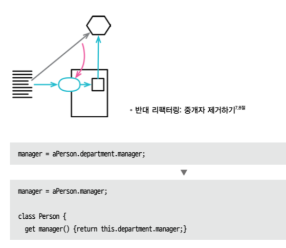

- 예를 들어 서버 객체의 필드가 가리키는 객체(위임 객체delegate)의 메서드를 호출하려면 클라이언트는 이 위임 객체를 알아야 한다. 위임 객체의 인터페이스가 바뀌면 이 인터페이스를 사용하는 모든 클라이언트가 코드를 수정해야 한다. 이러한 의존성을 없애려면 서버 자체에 위임 메서드를 만들어서 위임 객체의 존재를 숨기면 된다. 그러면 위임 객체가 수정되더라도 서버 코드만 고치면 되며, 클라이언트는 아무 영향도 받지 않는다.

### 중개자 제거하기

- 위임 숨기기의 '배경' 절에서 위임 객체를 캡슐화하려는 이점을 설명했다. 하지만 그 이점이 거저 주어지는 것은 아니다. 클라이언트가 위임 객체의 또 다른 기능을 사용하고 싶을 때마다 서버에 위임 메서드를 추가해야 하는데, 이렇게 기능을 추가하다 보면 단순히 전달만 하는 위임 메서드들이 점점 성가셔진다. 그러면 서버 클래스는 그저 중개자middle man 역할로 전락하여, 차라리 클라이언트가 위임 객체를 직접 호출하는 게 나을 수 있다.

### 알고리즘 교체하기

## 8장 : 기능 이동

지금까지는 프로그램 요소를 생성 혹은 제거하거나 이름을 변경하는 리팩터링을 다뤘다. 여기에 더해 요소를 다른 컨텍스트 (클래스나 모듈 등)로 옮기는 일 역시 리팩터링의 중요한 축이다.

- 다른 클래스나 모듈로 함수를 옮길 때는 **함수 옮기기** 를 사용한다. 필드 역시 **필드 옮기기**로 옮길 수 있다.
- 옮기기는 문장 단위에서도 이뤄진다. 문장을 함수 안이나 바깥으로 옮길 때는 **문장을 함수로 옮기기**나 **문장을 호출한 곳으로 옮기기**를 사용한다. 같은 함수에서 옮길 대는 **문장 슬라이드하기**를 사용한다. 때로는 한 덩어리의 문장들이 기존 함수와 같은 일을 할 때가 있다. 이럴 때는 **인라인 코드를 함수 호출로 바꾸기**를 적용해 중복을 제거한다.
- 반복문과 관련하여 자주 사용하는 리팩터링은 두 가지다. 첫 번째는 각각의 반복문이 단 하나의 일만 수행하도록 보장하는 **반복문 쪼개기**고, 두 번째는 반복문을 완전히 없애버리는 **반복문을 파이프라인으로 바꾸기**다.
- 마지막으로 많은 훌륭한 프록래머가 즐겨 사용하는 리팩터링인 **죽은 코드 제거하기**가 있다. 필요 없는 문장들은 디지털 화염방사기로 태워버리는 것만큼 짜릿한 일도 없다.

### 함수 옮기기

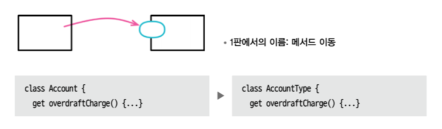

- 좋은 소프트웨어 설계의 핵심은 모듈화가 얼마나 잘 되어 있느냐를 뜻하는 모듈성modularity이다. 모듈성이란 프로그램의 어딘가를 수정하려 할 때 해당 기능과 깊이 관련된 작은 일부만 이해해도 가능하게 해주는 기능이다. 모듈성을 높이려면 서로 연관된 요소들을 함께 묶고, 요소 사이의 연결 관계를 쉽게 찾고 이해할 수 있도록 해야 한다.

### 필드 옮기기

- 프로그램의 상당 부분이 동작을 구현하는 코드로 이뤄지지만 프로그램의 진짜 힘은 데이터 구조에서 나온다. 주어진 문제에 적합한 데이터 구조를 활용하면 동작 코드는 자연스럽게 단순하고 직관적으로 짜여진다. 반면 데이터 구조를 잘못 선택하면 아귀가 맞지 않는 데이터를 다루기 위한 코드로 범벅이 된다. 이해하기 어려운 코드가 만들어지는 데서 끝나지 않고, 데이터 구조 자체도 그 프로그램이 어떤 일을 하는지 파악하기 어렵게 한다.

### 문장을 함수로 옮기기

### 문장을 호출한 곳으로 옮기기

### 인라인 코드를 함수 호출로 바꾸기

### 문장 슬라이드하기

### 반복문 쪼개기

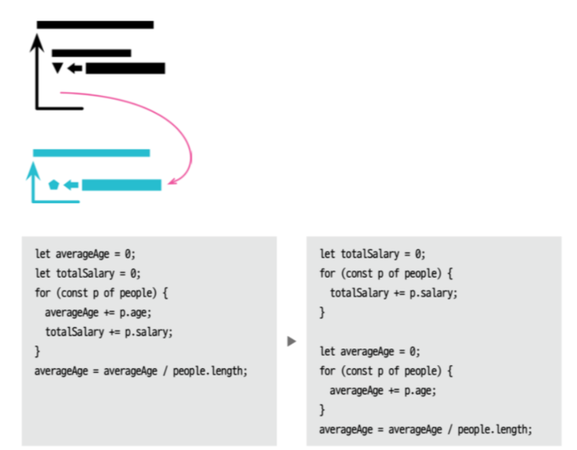

- 종종 반복문 하나에서 두 가지 일을 수행하는 경우를 보게 된다. 그저 두 일을 한꺼번에 처리할 수 있다는 이유에서 말이다. 하지만 이렇게 하면 반복문을 수정해야 할 때마다 두 가지 일 모두를 잘 이해하고 진행해야 한다. 반대로 각각의 반복문으로 분리해두면 수정할 동작 하나만 이해하면 된다.
- 반복문을 분리하면 사용하기도 쉬워진다. 한 가지 값만 계산하는 반복문이라면 그 값만 곧바로 반환할 수 있다. 반면 여러 일을 수행하는 반복문이라면 구조체를 반환하거나 지역 변수를 활용해야 한다. 참고로 반복문 쪼개기는 서로 다른 일들이 한 함수에서 이뤄지고 있다는 신호일 수 있고, 그래서 반복문 쪼개기와 함수 추출하기는 연이어 수행하는 일이 잦다.

### 반복문을 파이프라인으로 바꾸기

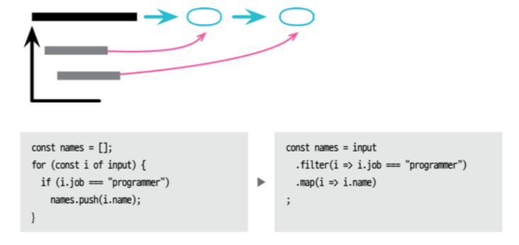

- 프로그래머 대부분이 그렇듯 나도 객체 컬렉션을 순회할 때 반복문을 사용하라고 배웠다. 하지만 언어는 계속해서 더 나은 구조를 제공하는 쪽으로 발전해왔다. 예컨대 이번 이야기의 주인공인 컬렉션 파이프라인collection pipeline 을 이용하면 처리 과정을 일련의 연산으로 표현할 수 있다. 이때 각 연산은 컬렉션을 입력받아 다른 컬렉션을 내뱉는다. 대표적인 연산은 map과 filter다. map은 함수를 사용해 입력 컬렉션의 각 원소를 반환하고, filter는 또 다른 함수를 사용해 입력 컬렉션을 필터링해 부분집합을 만든다. 이 부분집합은 파이프라인의 다음 단계를 위한 컬렉션으로 쓰인다. 논리를 파이프라인으로 표현하면 이해하기 훨씬 더 쉬워진다. 객체가 파이프라인을 따라 흐르며 어떻게 처리되는지 읽을 수 있기 때문이다.

### 죽은 코드 제거하기

- 소프트웨어를 납품할 때, 심지어 모바일 기기용 소프트웨어라도 코드의 양에는 따로 비용을 매기지 않는다. 쓰이지 않는 코드가 몇 줄 있다고 해서 시스템이 느려지는 것도 아니고 메모리를 많이 잡아먹지도 않는다. 사실 최신 컴파일러들은 이런 코드를 알아서 제거해준다. 그렇더라도 사용되지 않는 코드가 있다면 그 소프트웨어의 동작을 이해하는 데는 커다란 걸림돌이 될 수 있다. 이 코드들 스스로는 '절대 호출되지 않으니 무시해도 되는 함수다'라는 신호를 주지 않기 때문이다. 그래서 운 나쁜 프로그래머는 이 코드의 동작을 이해하기 위해, 그리고 코드를 수정했는데도 기대한 결과가 나오지 않는 이유를 파악하기 위해 시간을 허비하게 된다.
- 코드가 더 이상 사용되지 않게 됐다면 지워야 한다. 혹시 다시 필요해질 날이 오지 않을까 걱정할 필요 없다. 우리에겐 버전 관리 시스템이 있다! 그러니 그런 날이 진짜로 온다면 그저 다시 살려내면 된다. 그런 날이 반드시 올 거라 생각된다면 어느 리비전에서 삭제했는지를 커밋 메시지로 남겨놓자. 하지만 솔직히, 내가 마지막으로 이렇게 했던 게 언제인지 기억도 나지 않으며, 이렇게 하지 않아서 후회한 기억도 없다.
- 한때는 죽은 코드를 주석 처리하는 방법이 널리 쓰였다. 버전 관리 시스템이 보편화되지 않았거나 아직은 쓰기 불편했던 시절에 유용한 방법이었다. 지금은 코드가 몇 줄 안 되는 초기 단계부터 버전 관리 시스템을 사용하므로, 더 이상은 필요치 않다.

## 9장 : 데이터 조직화

데이터 구조는 프로그램에서 중요한 역할을 수행하니 데이터 구조에 집중한 리팩터링만 한 묶음 따로 준비했다. 하나의 값이 여러 목적으로 사용된다면 혼란과 버그를 낳는다. 그러니 이런 코드를 발견하면 **변수 쪼개기**를 적용해 용도별로 분리하자. 다른 프로그램 요소와 마찬가지로 변수 이름을 제대로 짓는 일은 까다로우면서도 중요하다. 그래서 **변수 이름 바꾸기**와는 반드시 친해져야 한다. 한편, **파생 변수를 질의 함수로 바꾸기**를 활용하여 변수 자체를 완전히 없애는 게 가장 좋은 해법일 때도 있다.

참조reference인지 값value인지가 헷갈려 문제가 되는 코드도 자주 볼 수 있는데, 둘 사이를 전환할 때는 **참조를 값으로 바꾸기**와 **값을 참조로 바꾸기**를 사용하다.

### 변수 쪼개기

변수는 다양한 용도로 쓰인다. 그중 변수에 값을 여러 번 대입할 수밖에 없는 경우도 있다. 예컨대 (반복문 `for (let i = 0; i < 10; i++)`에서 변수 `i` 같은) 루프 변수loop variable는 반복문을 한 번 돌 때마다 값이 바뀐다. 수집 변수 collecting variable 는 메서드가 동작하는 중간중간 값을 저장한다.

그 외에도 변수는 긴 코드의 결과를 저장했다가 나중에 쉽게 참조하려는 목적으로 흔히 쓰인다. 이런 변수에는 값을 단 한번만 대입해야 한다. 대입이 두 번 이상 이뤄진다면 여러 가지 역할을 수행한다는 신호다. 역할이 둘 이상인 변수가 있다면 쪼개야 한다. 예외는 없다. 역할 하나당 변수 하나다. 여러 용도로 쓰인 변수는 코드를 읽는 이에게 커다란 혼란을 주기 때문이다.

### 필드 이름 바꾸기

### 파생 변수를 질의 함수로 바꾸기

가변 데이터는 소프트웨어 문제를 일으키는 가장 큰 골칫거리에 속한다. 가변 데이터는 서로 다른 두 코드를 이상한 방식으로 결합하기도 하는데, 예컨대 한 쪽 코드에서 수정한 값이 연쇄 효과를 일으켜 다른 쪽 코드에 원인을 찾기 어려운 문제를 야기하기도 한다. 그렇다고 가변 데이터를 완전히 배제하기란 현실적으로 불가능할 때가 많지만, 가변 데이터의 유효 범위를 가능한 한 좁혀야 한다고 힘주어 주장해본다.

효과가 좋은 방법으로, 값을 쉽게 계산해낼 수 있는 변수들을 모두 제거할 수 있다. 계산 과정을 보여주는 코드 자체가 데이터의 의미를 더 분명히 드러내는 경우도 자주 있으며 변경된 값을 깜빡하고 결과 변수에 반영하지 않는 실수를 막아준다.

여기에는 합당한 예외가 있다. 피연산자 데이터가 불변이라면 계산 결과도 일정하므로 역시 불변으로 만들 수 있다. 그래서 새로운 데이터 구조를 생성하는 변형 연산transformation operation 이라면 비록 계산 코드로 대체할 수 있더라도 그대로 두는 것도 좋다. 변형 연산에는 두 가지가 있다. 첫째, 데이터 구조를 감싸며 그 데이터에 기초하여 계산한 결과를 속성으로 제공하는 객체다.

둘째, 데이터 구조를 받아 다른 데이터 구조로 변환해 반환하는 함수다. 소스 데이터가 가변이고 파생 데이터 구조의 수명을 관리해야 하는 상황에서는 객체를 사용하는 편이 확실히 유리하다. 반면 소스 데이터가 불변이거나 파생 데이터를 잠시 쓰고 버릴 거라면 어느 방식을 써도 상관없다.

### 참조를 값으로 바꾸기

### 값을 참조로 바꾸기

### 매직 리터럴 바꾸기

## 10장 : 조건부 로직 간소화

조건부 로직은 프로그램의 힘을 강화하는 데 크게 기여하지만, 안타깝게도 프로그램을 복잡하게 만드는 주요 원흉이기도 하다. 그래서 나는 조건부 로직을 이해하기 쉽게 바꾸는 리팩터링을 자주 한다. 복잡한 조건문에는 **조건문 분해하기**를, 논리적 조합을 명확하게 다듬는 데는 **중복 조건식 통합하기**를 적용한다. 함수의 핵심 로직에 본격적으로 들어가기 앞서 무언가를 검사해야 할 때는 **중첩 조건문을 보호 구문으로 바꾸기**를, 똑같은 분기 로직(주로 switch문)이 여러 곳에 등장한다면 **조건부 로직을 다형성으로 바꾸기**를 적용한다.

널null 같은 특이 케이스를 처리하는 데도 조건부 로직이 흔히 쓰인다. 이 처리 로직이 거의 똑같다면 **특이 케이스 추가하기** (**널 객체 추가하기**Introduce Null Object)를 적용해 코드 중복을 상당히 줄일 수 있다. 한편, (내가 조건절 없애기를 매우 좋아하는 건 사실이지만) 프로그램의 상태를 확인하고 그 결과에 따라 다르게 동작해야 하는 상황이면 **어서션 추가하기**가 도움이 된다.

제어 플래그를 이용해 코드 동작 흐름을 변경하는 코드는 대부분 **제어 플래그를 탈출문으로 바꾸기**를 적용해 더 간소화할 수 있다.

### 조건문 분해하기

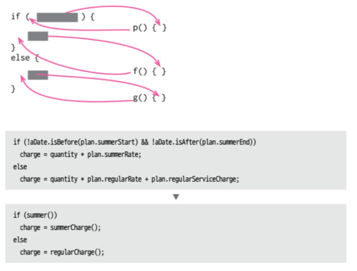

복잡한 조건부 로직은 프로그램을 복잡하게 만드는 가장 흔한 원흉에 속한다. 다양한 조건, 그에 따라 동작도 다양한 코드를 작성하면 순식간에 꽤 긴 함수가 탄생한다. 긴 함수는 그 자체로 읽기가 어렵지만, 조건문은 그 어려움을 한층 가중시킨다. 조건을 검사하고 그 결과에 따라 동작을 표현한 코드는 무슨 일이 일어나는지는 이야기해주지만 '왜' 일어나는지는 제대로 말해주지 않을 때가 많은 것이 문제다.

거대한 코드 블록이 주어지면 코드를 부위별로 분해한 다음 해체된 코드 덩어리들을 각 덩어리의 의도를 살린 이름의 함수 호출로 바꿔주자. 그러면 전체적인 의도가 더 확실히 드러난다. 조건문이 보이면 나는 조건식과 각 조건절에 이 작업을 해주길 좋아한다. 이렇게 하면 해당 조건이 무엇인지 강조하고, 그래서 무엇을 분기했는지가 명백해진다. 분기한 이유 역시 더 명확해진다.

### 조건식 통합하기

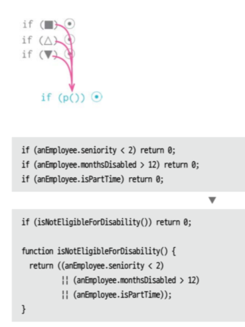

비교하는 조건은 다르지만 그 결과로 수행하는 동작은 똑같은 코드들이 더러 있는데, 어차피 같은 일을 할 거라면 조건 검사도 하나로 통합하는 게 낫다. 이럴 때 'and' 연산자와 'or' 연산자를 사용하면 여러 개의 비교 로직을 하나로 합칠 수 있다.

조건부 코드를 통합하는 게 중요한 이유는 두 가지다. 첫째, 여러 조각으로 나뉜 조건들을 하나로 통합함으로써 내가 하려는 일이 더 명확해진다. 나눠서 순서대로 비교해도 결과는 같지만, 읽는 사람은 독립된 검사들이 우연히 함께 나열된 것으로 오해할 수 있다. 두 번째 이유는 이 작업이 함수 추출하기까지 이어질 가능성이 높기 때문이다. 복잡한 조건식을 함수로 추출하면 코드의 의도가 훨씬 분명하게 드러나는 경우가 많다. 함수 추출하기는 '무엇'을 하는지를 기술하던 코드를 '왜' 하는지를 말해주는 코드로 바꿔주는 효과적인 도구임을 기억하자.

조건식을 통합해야 하는 이유는 이 리팩터링을 하지 말아야 하는 이유도 설명해준다. 하나의 검사라고 생각할 수 없는, 다시 말해 진짜로 독립된 검사들이라고 판단되면 이 리팩터링을 해서는 안 된다.

### 중첩 조건문을 보호 구문으로 바꾸기

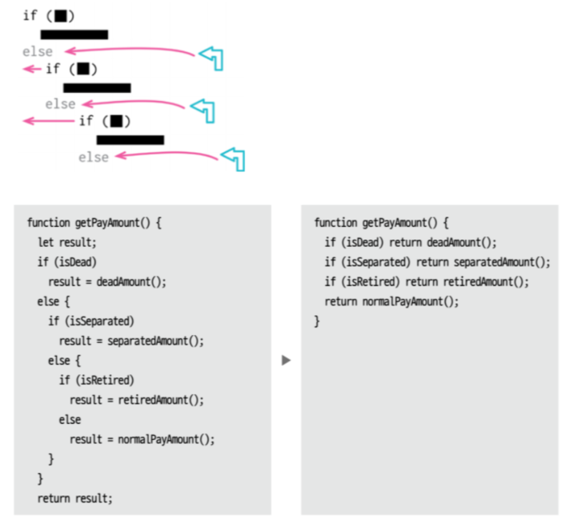

중첩 조건문을 보호 구문으로 바꾸기 리팩터링의 핵심은 의도를 부각하는 데 있다. 나는 if-then-else 구조를 사용할 때 if절과 else 절에 똑같은 무게를 두어, 코드를 읽는 이에게 양 갈래가 똑같이 중요하다는 뜻을 전달한다. 이와 달리, 보호 구문은 "이건 이 함수의 핵심이 아니다. 이 일이 일어나면 무언가 조치를 취한 후 함수에서 빠져나온다"라고 이야기한다.

### 조건부 로직을 다형성으로 바꾸기

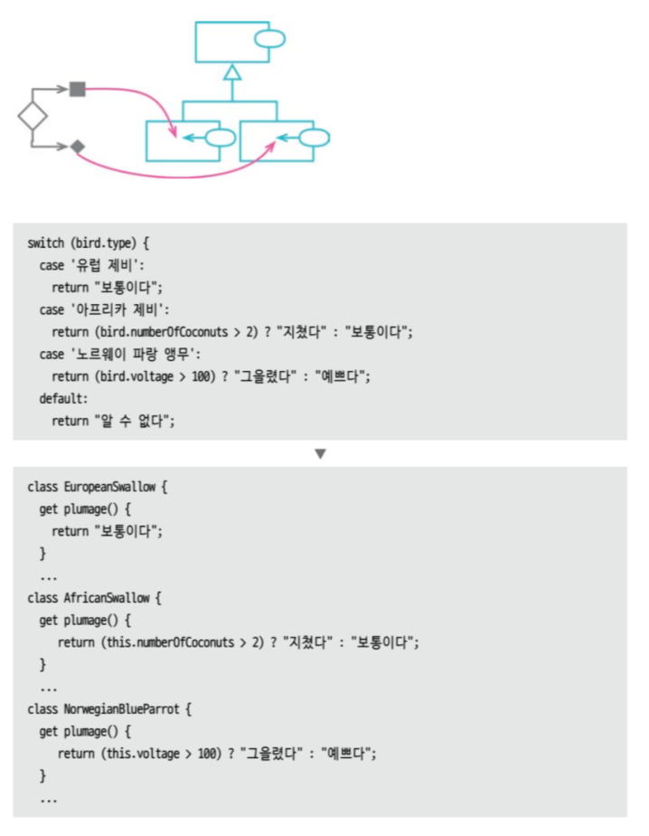

다형성은 객체 지향 프로그래밍의 핵심이다. 하지만 (유용한 기능들이 늘 그렇듯) 남용하기 쉽다. 실제로 모든 조건부 로직을 다형성으로 대체해야 한다고 주장하는 사람도 만난 적이 있다. 나는 그 견해에는 동의하지 않는다. 조건부 로직 대부분은 기본 조건문인 if/else와 switch/case로 이뤄지기 때문이다. 하지만 앞서 이야기한 방법들로 개선할 수 있는 복잡한 조건부 로직을 발견하면 다형성이 막강한 도구임을 깨닫게 된다.

### 특이 케이스 추가하기

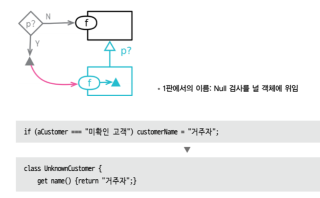

데이터 구조의 특정 값을 확인한 후 똑같은 동작을 수행하는 코드가 곳곳에 등장하는 경우가 더러 있는데, 흔히 볼 수 있는 중복 코드 중 하나이다. 이처럼 코드베이스에서 특정 값에 대해 똑같이 반응하는 코드가 여러 곳이라면 그 반응들을 한 데로 모으는 게 효율적이다.

특수한 경우의 공통 동작을 요소 하나에 모아서 사용하는 특이 케이스 패턴Special Case Pattern이라는 것이 있는데, 바로 이럴 때 적용하면 좋은 매커니즘이다. 이 패턴을 활용하면 특이 케이스를 확인하는 코드 대부분을 단순한 함수 호출로 바꿀 수 있다.

널null은 특이 케이스로 처리해야 할 때가 많다. 그래서 이 패턴을 널 객체 패턴null object pattern이라고도 한다. 하지만 널 외의 다른 특이 케이스에도 같은 패턴을 적용할 수 있으니, 널 객체가 특이 케이스의 특수한 예라고 보는 게 맞을 것이다.

### 어서션 추가하기

어서션은 항상 참이라고 가정하는 조건부 문장으로, 어서션이 실패했다는 것은 프로그래머가 잘못했다는 뜻이다. 어서션 실패는 시스템의 다른 부분에서는 절대 검사하지 않아야 하며, 어서션이 있고 없고가 프로그램 기능의 정상 동작에 아무런 영향을 주지 않도록 작성돼야 한다. 그래서 어서션을 컴파일 타임에 켜고 끌 수 있는 스위치를 제공하는 프로그래밍 언어도 있다.

어서션을 오류 찾기에 활용하라고 추천하는 사람도 왕왕 본다. 물론 좋은 일이긴 하지만 어서션의 쓰임은 여기서 끝나지 않는다. 어서션은 프로그램이 어떤 상태임을 가정한 채 실행되는지를 다른 개발자에게 알려주는 훌륭한 소통 도구인 것이다. 디버깅하기 편하고 이런 소통 수단으로서의 가치도 있어서, 나는 추적하던 버그를 잡은 뒤에도 어서션을 코드에 남겨두곤 한다. 한편, 테스트 코드가 있다면 어서션의 디버깅 용도로서의 효용은 줄어든다. 단위 테스트를 꾸준히 추가하여 사각을 좁히면 어서션보다 나을 때가 많다. 하지만 소통 측면에서는 어서션이 여전히 매력적이다.

### 제어 플래그를 탈출문으로 바꾸기

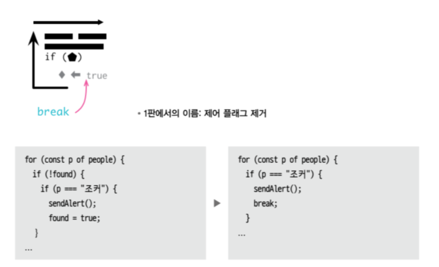

제어 플래그란 코드의 동작을 변경하는 데 사용되는 변수를 말하며, 어딘가에서 값을 계산해 제어 플래그에 설정한 후 다른 어딘가의 조건문에서 검사하는 형태로 쓰인다. 나는 이런 코드를 항상 악취로 본다. 리팩터링으로 충분히 간소화할 수 있음에도 복잡하게 작성된 코드에서 흔히 나타나기 때문이다.

제어 플래그의 주 서식지는 반복문 안이다. break문이나 continue 문 활용에 익숙하지 않은 사람이 심어놓기도 하고, 함수의 return 문을 하나로 유지하고자 노력하는 사람이 심기도 한다. 모든 함수의 return 문은 하나여야 한다고 주장하는 사람도 있지만, 나는 동의하지 않는다. 함수에서 할 일을 다 마쳤다면 그 사실을 return 문으로 명확히 알리는 편이 낫지 않을까?

## 11장 : API 리팩터링

모듈과 함수는 소프트웨어를 구성하는 빌딩 블록이며, API는 이 블록들을 끼워 맞추는 연결부다. 이런 API를 이해하기 쉽고 사용하기 쉽게 만드는 일은 중요한 동시에 어렵기도 하다. 그래서 API를 개선하는 방법을 새로 깨달을 때마다 그에 맞게 리팩터링해야 한다. 

좋은 API는 데이터를 갱신하는 함수와 그저 조회만 하는 함수를 명확히 구분한다. 두 기능이 섞여 있다면 **질의 함수와 변경 함수 분리하기**를 적용해 갈라놔야 한다. 값 하나 때문에 여러 개로 나뉜 함수들을 **함수 매개변수화하기**를 적용해 하나로 합칠 수 있다. 한편, 어떤 매개변수는 그저 함수의 동작 모드를 전환하는 용도로만 쓰이는데, 이럴 때는 **플래그 인수 제거하기**를 적용하면 좋다.

데이터 구조가 함수 사이를 건너 다니면서 필요 이상으로 분해될 때는 **객체 통째로 넘기기**를 적용해 하나로 유지하면 깔끔해진다. 무언가를 매개변수로 건네 피호출 함수가 판단할지 아니면 호출 함수가 직접 정할지에 관해서는 만고불변의 진리는 없으니, 상황이 바뀌면 **매개변수를 질의 함수로 바꾸기**와 **질의 함수를 매개변수로 바꾸기**로 균형점을 옮길 수 있다.

클래스는 대표적인 모듈이다. 나는 내가 만든 객체가 되도록 불변이길 원하므로 기회가 될 때마다 **세터 제거하기**를 적용한다. 한편 호출자에 새로운 객체를 만들어 반환하려 할 때 일반적인 생성자의 능력만으로는 부족할 때가 있다. 이럴 땐 **생성자를 팩터리 함수로 바꾸기**가 좋은 해법일 수 있다.

마지막 두 리팩터링은 수많은 데이터를 받는 복잡한 함수를 잘개 쪼개는 문제를 다룬다. **함수를 명령으로 바꾸기**를 적용하면 이런 함수를 객체로 변환할 수 있는데, 그러면 해당 함수의 본문에서 함수를 추출하기가 수월해진다. 나중에 이 함수를 단순화하여 명령 객체가 더는 필요 없어진다면 **명령을 함수로 바꾸기**를 적용해 함수로 되돌릴 수 있다.

### 질의 함수와 변경 함수 분리하기

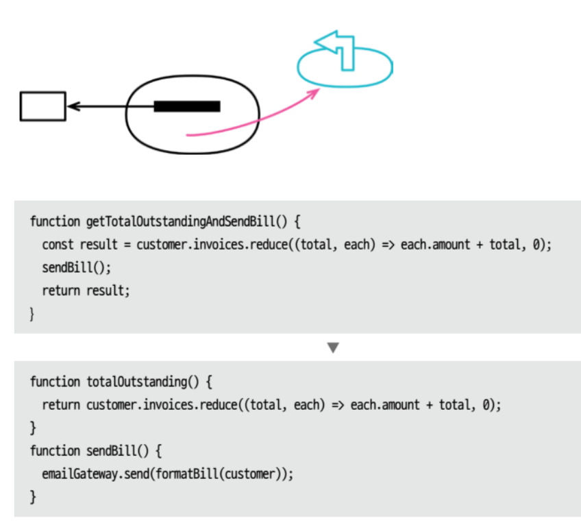

우리는 외부에서 관찰할 수 있는 겉보기 부수효과observable side effect 가 전혀 없이 값을 반환해주는 함수를 추구해야 한다. 이런 함수는 어느 때건 원하는 만큼 호출해도 아무 문제가 없다. 호출하는 문장의 위치를 호출하는 함수 안 어디로든 옮겨도 되며 테스트하기도 쉽다. 한마디로, 이용할 때 신경 쓸 거리가 매우 적다.

### 함수 매개변수화하기

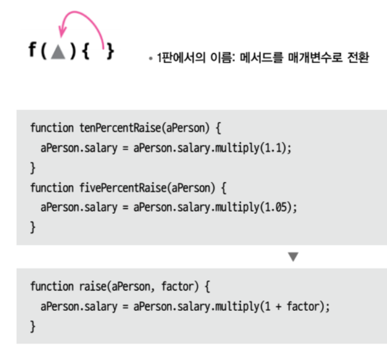

두 함수의 로직이 아주 비슷하고 단지 리터럴 값만 다르다면, 그 다른 값만 매개변수로 처리하는 함수 하나로 합쳐서 중복을 없앨 수 있다. 이렇게 하면 매개변수 값만 바꿔서 여러 곳에서 쓸 수 있으니 함수의 유용성이 커진다.

### 플래그 인수 제거하기

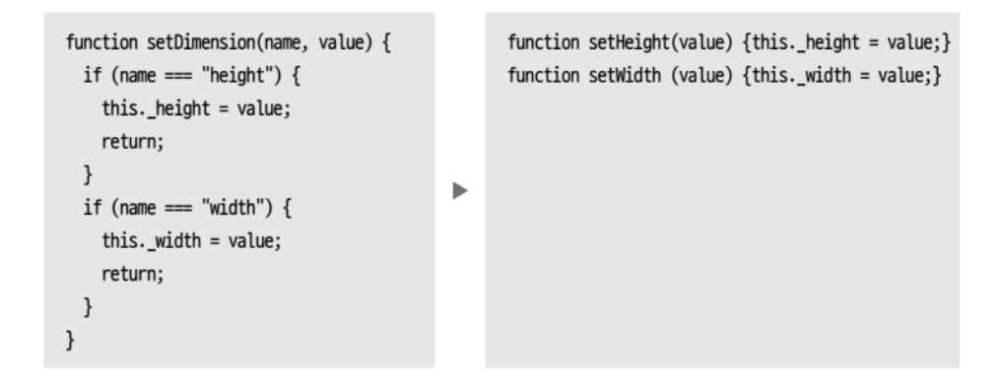

플래그 인수flag argument란 호출되는 함수가 실행할 로직을 호출하는 쪽에서 선택하기 위해 전달하는 인수다.

내가 프로그래밍 인수를 싫어하는 이유가 있다. 호출할 수 있는 함수들이 무엇이고 어떻게 호출해야 하는지를 이해하기가 어려워지기 때문이다. 나는 API를 익힐 때 주로 함수 목록부터 살펴보는데, 플래그 인수가 있으면 함수들의 기능 차이가 잘 드러나지 않는다. 사용할 함수를 선택한 후에도 플래그 인수로 어떤 값을 넘겨야 하는지를 또 알아내야 한다. boolean 플래그는 코드를 읽는 이에게 뜻을 온전히 전달하지 못하기 때문에 더욱 좋지 못하다.

### 객체 통째로 넘기기

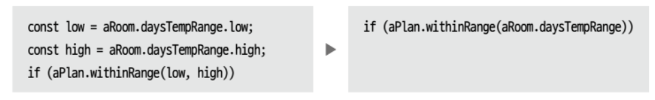

레코드를 통째로 넘기면 변화에 대응하기가 쉽다. 예컨대 그 함수가 더 다양한 데이터를 사용하도록 바뀌어도 매개변수 목록은 수정할 필요가 없다. 그리고 매개변수 목록이 짧아져서 일반적으로는 함수 사용법을 이해하기 쉬워진다. 한편, 레코드에 담긴 데이터 중 일부를 받는 함수가 여러 개라면 그 함수들끼리는 같은 데이터를 사용하는 부분이 있을 것이고, 그 부분의 로직이 중복될 가능성이 커진다. 레코드를 통째로 넘긴다면 이런 로직 중복도 없앨 수 있다.

하지만 함수가 레코드 자체에 의존하기를 원치 않을 때는 이 리팩터링을 수행하지 않는데, 레코드와 함수가 서로 다른 모듈에 속한 상황이면 특히 더 그렇다.

### 매개변수를 질의 함수로 바꾸기

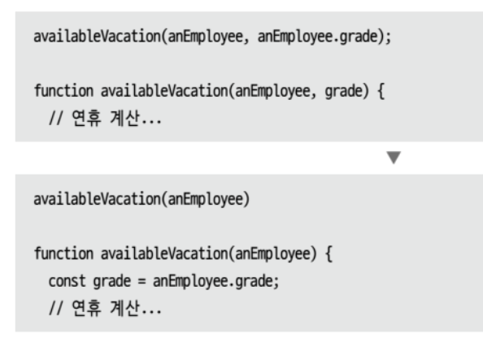

매개변수 목록은 함수의 변동 요인을 모아놓은 곳이다. 즉, 함수의 동작에 변화를 줄 수 있는 일차적인 수단이다. 다른 코드와 마찬가지로 이 목록에서도 중복은 피하는게 좋으며 짧을수록 이해하기 쉽다.

피호출 함수가 스스로 '쉽게' 결정할 수 있는 값을 매개변수로 건네는 것도 일종의 중복이다. 이런 함수를 호출할 때 매개변수의 값은 호출자가 정하게 되는데, 이 결정은 사실 하지 않아도 되었을 일이니 의미 없이 코드만 복잡해질 뿐이다.

### 질의 함수를 매개변수로 바꾸기

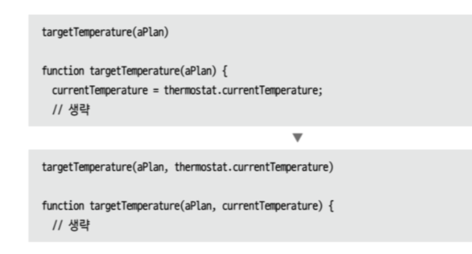

코드를 읽다 보면 함수 안에 두기엔 거북한 참조를 발견할 때가 있다. 전역 변수를 참조한다거나(같은 모듈 안에서라도) 제거하길 원하는 원소를 참조하는 경우가 여기 속한다. 이 문제는 해당 참조를 매개변수로 바꿔 해결할 수 있다. 참조를 풀어내는 책임을 호출자로 옮기는 것이다.

이런 상황 대부분은 코드의 의존 관계를 바꾸려 할 때 벌어진다. 예컨대 대상 함수가 더 이상 (매개변수화하려는) 특정 원소에 의존하길 원치 않을 때 일어난다. 이때 두 극단 사이에서 적절한 균형을 찾아야 한다. 한쪽 끝은 모든 것을 매개변수로 바꿔 아주 길고 반복적인 매개변수 목록을 만드는 것이고, 다른 쪽 끝은 함수들끼리 많은 것을 공유하여 수많은 결합을 만들어내는 것이다. 대다수 까다로운 결정이 그렇듯, 이 역시 한 시점에 내린 결정이 영원히 옳다고 할 수는 없는 문제다. 따라서 프로그램을 더 잘 이해하게 됐을 때 더 나은 쪽으로 개선하기 쉽게 설계해두는 게 중요하다.

### 세터 제거하기

세터 메서드가 있다고 함은 필드가 수정될 수 있다는 뜻이다. 객체 생성 후에는 수정되지 않길 원하는 필드라면 세터를 제공하지 않았을 것이다. (그래서 그 필드를 불변으로 만들었을 것이다) 그러면 해당 필드는 오직 생성자에서만 설정되며, 수정하지 않겠다는 의도가 명명백백해지고, 변경될 가능성이 봉쇄된다.

세터 제거하기 리팩터링이 필요한 상황은 주로 두 가지다. 첫째, 사람들이 무조건 접근자 메서드를 통해서만 필드를 다루려 할 때다. 심지어 생성자 안에서도 말이다. 이러면 오직 생성자에서만 호출하는 세터가 생겨나곤 한다. 하지만 나라면 세터를 제거해서 객체가 생성된 후에는 값이 바뀌면 안 된다는 뜻을 분명히 할 것이다.

두 번째 상황은 클라이언트에서 생성 스크립트creation script를 사용해 객체를 생성할 때다. 생성 스크립트란 생성자를 호출한 후 일련의 세터를 호출하여 객체를 완성하는 형태의 코드를 말한다.(별도의 스크립트 파일이 아니다). 그러면서 설계자는 스크립트가 완료된 뒤로는 그 객체의 필드 일부(혹은 전체)는 변경되지 않으리라 기대한다. 즉, 해당 세터들은 처음 생성할 때만 호출되리라 가정한다. 이런 경우에도 세터들을 제거하여 의도를 더 정확하게 전달하는 게 좋다.

### 생성자를 팩터리 함수로 바꾸기

많은 객체 지향 언어에서는 제공하는 생성자는 객체를 초기화하는 특별한 용도의 함수다. 실제로 새로운 객체를 생성할 때면 주로 생성자를 호출한다. 하지만 생성자에는 일반 함수에는 없는 이상한 제약이 따라붙기도 한다. 가령 자바 생성자는 반드시 그 생성자를 정의한 클래스의 인스턴스를 반환해야 한다. 서브클래스의 인스턴스나 프락시를 반환할 수는 없다. 생성자의 이름도 고정되어, 기본 이름보다 더 적절한 이름이 있어도 사용할 수 없다. 생성자를 호출하려면 특별한 연산자(많은 언어에서 new를 쓴다)를 사용해야 해서 일반 함수가 오길 기대하는 자리에는 쓰기 어렵다.

팩터리 함수에는 이런 제약이 없다. 팩터리 함수를 구현하는 과정에서 생성자를 호출할 수는 있지만, 원한다면 다른 무언가로 대체할 수 있다.

### 함수를 명령으로 바꾸기

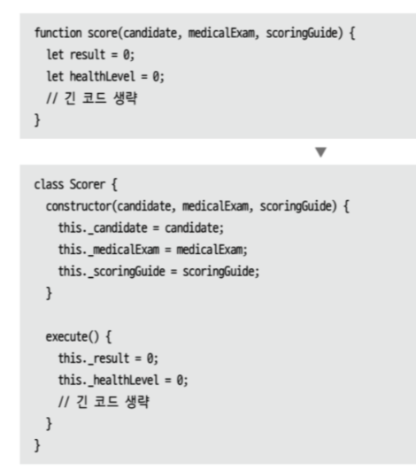

함수(독립된 함수든 객체에 소속된 메서드든)는 프로그래밍의 기본적인 빌딩 블록 중 하나다. 그런데 함수를 그 함수만을 위한 객체 안으로 캡슐화하면 더 유용해지는 상황이 있다. 이런 객체를 가리켜 '명령 객체' 혹은 단순히 '명령command'이라 한다. 명령 객체 대부분은 메서드 하나로 구성되며, 이 메서드를 요청해 실행하는 것이 이 객체의 목적이다.

명령은 평범한 함수 메커니즘보다 훨씬 유연하게 함수를 제어하고 표현할 수 있다. 명령은 되돌리기undo 같은 보조 연산을 제공할 수 있으며, 수명주기를 더 정밀하게 제어하는 데 필요한 매개변수를 만들어주는 메서드도 제공할 수 있다. 상속과 훅hook을 이용해 사용자 맞춤형으로 만들 수도 있다. 객체는 지원하지만 일급 함수first-class function를 지원하지 않는 프로그래밍 언어를 사용할 때는 명령을 이용해 일급 함수의 기능 대부분을 흉내 낼 수 있다. 비슷하게, 중첩 함수를 지원하지 않는 언어에서도 메서드와 필드를 이용해 복잡한 함수를 잘게 쪼갤 수 있고, 이렇게 쪼갠 메서드들을 테스트와 디버깅에 직접 이용할 수 있다.

이처럼 명령을 사용해 얻는 이점이 많으므로 함수를 명령으로 리팩터링할 채비를 갖춰야 할 것이다. 하지만 유연성은 (언제나 그렇듯) 복잡성을 키우고 얻는 대가임을 잊지 말아야 한다. 그래서 일급 함수와 명령 중 선택해야 한다면, 나라면 95%는 일급 함수의 손을 들어준다. 내가 명령을 선택할 때는 명령보다 더 간단한 방식으로는 얻을 수 없는 기능이 필요할 때뿐이다.

### 명령을 함수로 바꾸기

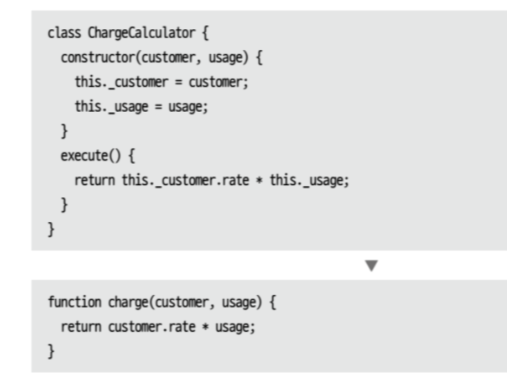

명령 객체는 복잡한 연산을 다룰 수 있는 강력한 매커니즘을 제공한다. 구체적으로는, 큰 연산 하나를 여러 개의 작은 메서드로 쪼개고 필드를 이용해 쪼개진 메서드들끼리 정보를 공유할 수 있다. 또한 어떤 메서드를 호출하냐에 따라 다른 효과를 줄 수 있고 각 단계를 거치며 데이터를 조금씩 완성해갈 수도 있다.

명령의 이런 능력은 공짜가 아니다. 명령은 그저 함수를 하나 호출해 정해진 일을 수행하는 요도로 주로 쓰인다. 이런 상황이고 로직이 크게 복잡하지 않다면 며령 객체는 장점보다 단점이 크니 평범한 함수로 바꿔주는 게 낫다.

### 수정된 값 반환하기

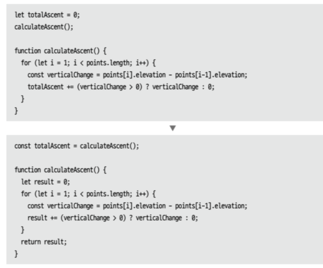

데이터가 어떻게 수정되었는지를 추적하는 일은 코드에서 이해하기 가장 어려운 부분 중 하나다. 특히 같은 데이터 블록을 읽고 수정하는 코드가 여러 곳이라면 데이터가 수정되는 흐름과 코드의 흐름을 일치시키기가 상당히 어렵다. 그래서 데이터가 수정된다면 그 사실을 명확히 알려주어서, 어느 함수가 무슨 일을 하는지 쉽게 알 수 있게 하는 일이 대단히 중요하다.

데이터가 수정됨을 알려주는 좋은 방법이 있다. 변수를 갱신하는 함수라면 수정된 값을 반환하여 호출자가 그 값을 변수에 담아두도록 하는 것이다. 이 방식으로 코딩하면 호출자 코드를 읽을 때 변수가 갱신될 것임을 분명히 인지하게 된다. 해당 변수의 값을 단 한 번만 정하면 될 때 특히 유용하다.

### 오류 코드를 예외로 바꾸기

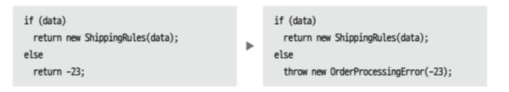

예외는 프로그래밍 언어에서 제공하는 독립적인 오류 처리 매커니즘이다. 오류가 발견되면 예외를 던진다. 그러면 적절한 예외 핸들러를 찾을 때까지 콜스택을 타고 위로 전파된다.(핸들러를 찾지 못하면 보통은 단순할 정도로 극단적인 기본 동작이 수행된다.) 예외를 사용하면 오류 코드를 일일이 검사하거나 오류를 식별해 콜스택 위로 던지는 일을 신경 쓰지 않아도 된다. 예외에는 독자적인 흐름이 있어서 프로그램의 나머지에서는 오류 발생에 따른 복잡한 상황에 대처하는 코드를 작성하거나 읽을 일이 없게 해준다.

예외는 정교한 매커니즘이지만 대다수의 다른 정교한 매커니즘과 같이 정확하게 사용할 때만 최고의 효과를 낸다. 예외는 정확히 예상 밖의 동작일 때만 쓰여야 한다. 달리 말하면 프로그램의 정상 동작 범주에 들지 않는 오류를 나타낼 때만 쓰여야 한다. 괜찮은 경험 법칙이 하나 있다. 예외를 던지는 코드를 프로그램 종료 코드로 바꿔도 프로그램이 여전히 정상 동작할지를 따져보는 것이다. 정상 동작하지 않을 것 같다면 예외를 사용하지 말라는 신호다. 예외 대신 오류를 검출하여 프로그램을 정상 흐름으로 되돌리게끔 처리해야 한다.

### 예외를 사전확인으로 바꾸기

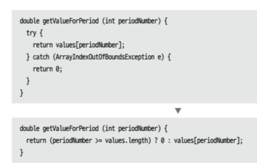

예외라는 개념은 프로그래밍 언어의 발전에 의미 있는 한걸음이었다. 오류 코드를 연쇄적으로 전파하던 긴 코드를 예외로 바꿔 깔끔히 제거할 수 있게 되었으니 말이다. 하지만 좋은 것들이 늘 그렇듯, 예외도 (더 이상 좋지 않을 정도까지) 과용되곤 한다. 예외는 '뜻밖의 오류'라는, 말 그래도 예외적으로 동작할 때만 쓰여야 한다. 함수 수행 시 문제가 될 수 있는 조건을 함수 호출 전에 검사할 수 있다면, 예외를 던지는 대신 호출하는 곳에서 조건을 검사하도록 해야 한다.