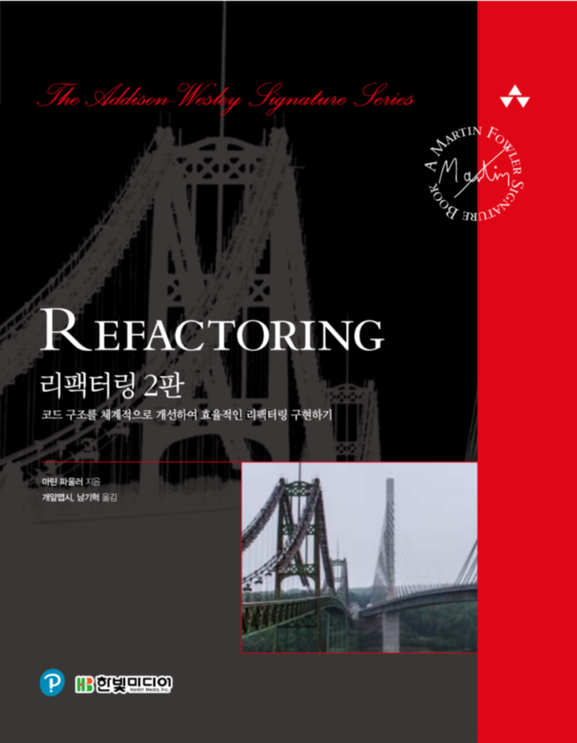
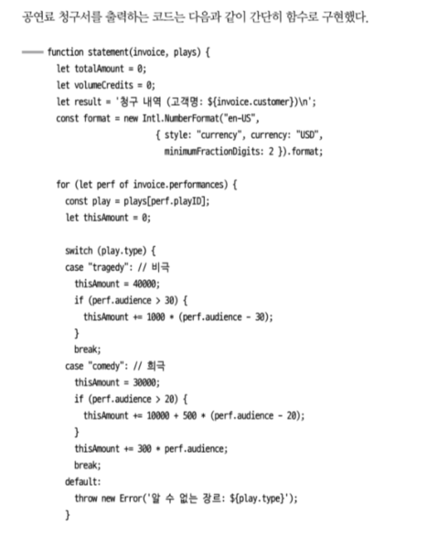
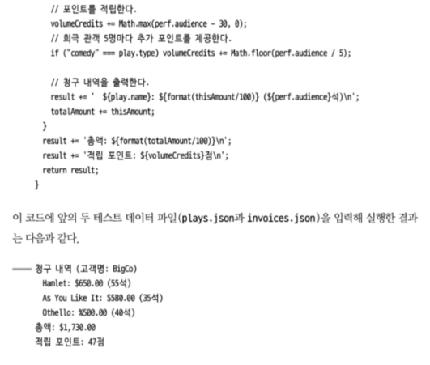
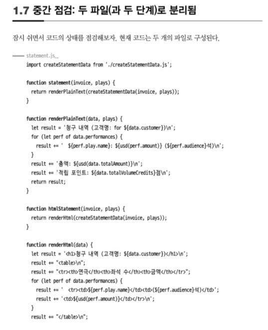
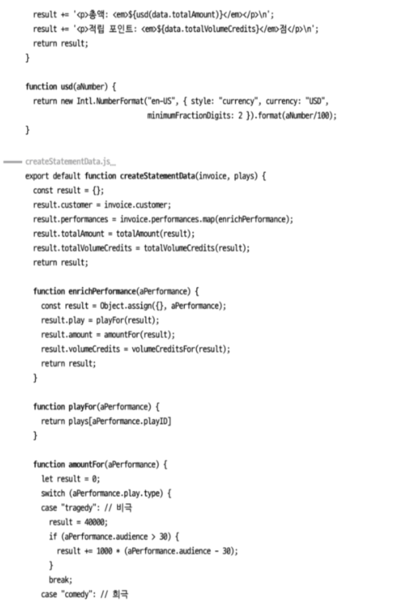
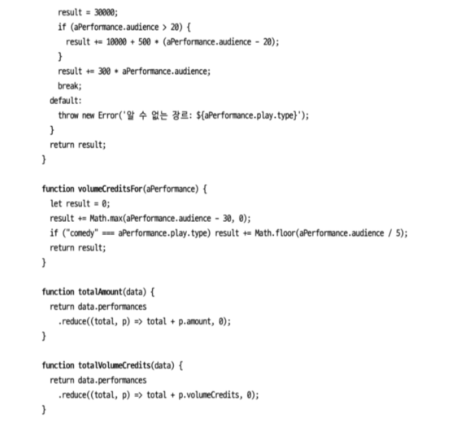
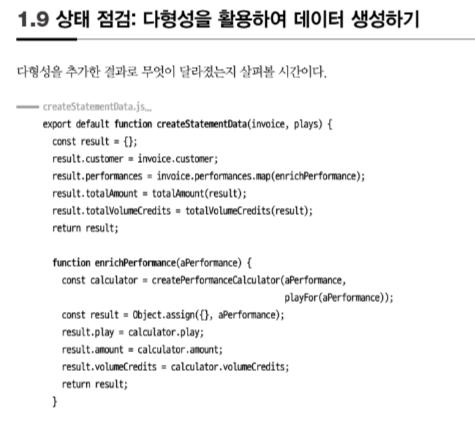
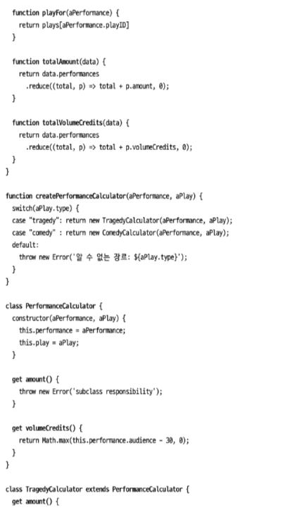
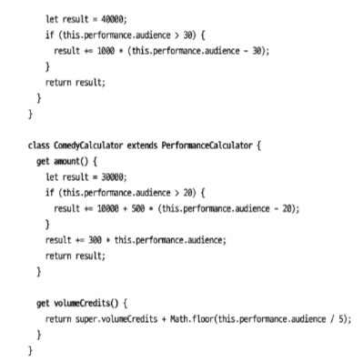

# Refactoring

마틴 파울러 지음

## 서문

이 책은 전문 프로그래머를 대상으로 쓴 리팩터링 지침서다. 절제되고 효율적인 방식으로 리팩터링하는 법을 알려주는 것이 목표다. 코드에 버그가 생기지 않게 하면서 구조를 더 체계적으로 바꾸는 식으로 리팩터링하는 방법을 설명한다.

## 1장 리팩터링 : 첫번째 예시

**Before**

아래의 과정을 거쳐서

- statement() 함수 쪼개기
  - 적립 포인트 계산 코드 추출하기
  - format 변수 제거하기
- 계산 단계와 포맷팅 단계 분리하기

**중간점검**

처음보다 코드량이 부쩍 늘었다. 원래 44줄짜리 코드가 지금은 htmlStatement() 를 빼고도 70줄이나 된다. 늘어난 주된 원인은 함수로 추출하면서 함수 본문을 열고 닫는 괄호가 덧붙었기 때문이다. 그 외에 달라진 점이 없다면 안 좋은 징조지만, 다행히 그렇지는 않다. 추가된 코드 덕분에 전체 로직을 구성하는 요소 각각이 더 뚜렷이 부각되고, 계산하는 부분과 출력 형식을 다루는 부분이 분리됐다. 이렇게 무듈화하면 각 부분이 하는 일과 그 부분들이 맞물려 돌아가는 과정을 파악하기 쉬워진다. 모듈화된 덕분에 계산 코드를 중복하지 않고도 HTML 버전을 만들 수 있었다.

다시 아래의 과정을 거쳐서

- 다형성을 활용해 계산 코드 재구성하기
  - 조건부 로직을 다형성으로 바꾸기
  - 공연료 계산기 만들기
  - 함수들을 계산기로 옮기기
  - 공연료 계산기를 다형성 버전으로 만들기

앞에서 함수를 추출했을 때처럼, 이번에도 구조를 보강하면서 코드가 늘어났다. 이번 수정으로 나아진 점은 연극 장르별 계산 코드들을 함께 묶어뒀다는 것이다. 앞으로의 수정 대부분이 이 코드에서 이뤄질 것 같다면 이렇게 명확하게 분리해두면 좋다. 이제 새로운 장르를 추가하려면 해당 장르의 서브클래스를 작성하고 생성 함수인 createPerformanceCalculator()에 추가하기만 하면 된다.

이번 예를 보면 서브클래스를 언제 사용하면 좋은지 감이 잡힐 것이다. 여기서는 두 개의 함수 amountFor()와 volumeCreditsFor()의 조건부 로직을 생성 함수 하나로 옮겼다. 같은 타입의 다형성을 기반으로 실행되는 함수가 많을수록 이렇게 구성하는 쪽이 유리히다.

계산기가 중간 데이터 구조를 채우게 한 지금의 코드와 달리 createStatementData()가 계산기 자체를 변환하게 구현해도 된다. 이때 자바스크립트 클래스 시스템의 멋진 점 하나가 효과를 발휘하는데, 바로 게터getter 메서드를 호출하는 코드와 일반적인 데이터 접근 코드의 모양이 똑같다는 것이다.(앞의 예제에 calculator.amount 코드는 계산기 클래스의 게텅니 amount()를 호출한 것이다). 한편 계산기 인스턴스를 반환하는 방식과 각각의 출력 값으로 직접 계산하는 방식 중 하나를 선택할 때 나는 결과로 나온 데이터 구조를 누가 사용하는가를 기준으로 결정한다. 이번 예에서는 다형성 계산시를 사용한다는 사실을 숨기기보다는 중간 데이터 구조를 이용하는 방법을 보여주는 편이 낫다고 생각해서 이렇게 작성했다.

**1장 끝**

- 이번 장에서는 리팩터링을 크게 세 단계로 진행했다. 먼저 원본 함수를 중첩 함수 여러 개로 나눴다. 다음으로 단계 쪼개기를 적용해서 계산 코드와 출력 코드를 분리했다. 마지막으로 계산로직을 다형성으로 표현했다. 각 단계에서 코드 구조를 보강했고, 그럴 때마다 코드가 수행하는 일이 더욱 분명하게 드러났다.
- 리팩터링을 대부분 코드가 하는 일을 파악하는 데서 시작한다. 그래서 코드를 읽고, 개선점을 찾고, 리팩터링 작업을 통해 개선점을 코드에 반영하는 식으로 진행한다. 그 결과 코드가 명확해지고 이해하기 더 쉬워진다. 그러면 또 다른 개선점이 떠오르며 선순환이 형성된다. 지금까지 수정한 코드에도 개선할 게 몇 가지 더 있지만, 이 정도면 원본 코드를 크게 개선한다는 목표는 충분히 달성했다고 생각한다.
- **좋은 코드를 가늠하는 확실한 방법은 '얼마나 수정하기 쉬운가'다.**

## 2장 : 리팩터링 원칙

수많은 다른 소프트웨어 개발 용어와 마찬가지로 '리팩터링refactoring'도 엔지니어들 사이에서 다소 두리뭉실한 의미로 통용된다. 하지만 나는 이 용어를 더 구체적인 의미로 사용하며, 그렇게 엄격하게 정의해야 더 유용하다고 생각한다.(참고로 이 책 초판에서의 정의 그대로다). '리팩터링'이란 용어는 명사로도 쓸 수 있고, 동사로도 쓸 수 있다. 먼저 명사로 쓸 때는 다음과 같이 정의한다.

- 리팩터링 : '[명사]' 소프트웨어의 겉보기 동작은 그대로 유지한 채, 코드를 이해하고 수정하기 쉽도록 내부 구조를 변경하는 기법

앞 장에서 본 '함수 추출하기'와 '조건부 로직을 다형성으로 바꾸기'처럼 이름 붙은 리팩터링 기법들이 이 정의에 해당한다.

동사 버전의 정의는 다음과 같다

- 리팩터링(하다) : '[동사]' 소프트웨어의 겉보기 동작은 그대로 유지한 채, 여러 가지 리팩터링 기법을 적용해서 소프트웨어를 재구성하다.

예를 들어 두 버전의 용어를 한 문장에 담으면 '앞으로 몇 시간은 리팩터링할 것 같은데 그 사이 적용하는 리팩터링은 수십 가지나 될 것 같다'처럼 표현할 수 있다.

지금껏 수많은 사람이 코드를 정리하는 작업을 모조리 '리팩터링'이라고 표현하고 있는데, 앞에서 제시한 정의를 따르면 특정한 방식에 따라 코드를 정리하는 것만이 리팩터링이다. 리팩터링은 결국 동작을 보존하는 작은 단계들을 거쳐 코드를 수정하고, 아리한 단계들을 순차적으로 연결하여 큰 변화를 만들어내는 일이다. 개별 리팩터링은 그 자체로 아주 작을 수도 있고, 작은 단계 여러 개가 합쳐진 모습일 수도 있다. 따라서 리팩터링하는 동안에는 코드가 항상 정상 작동하기 때문에 전체 작업이 끝나지 않았더라도 언제든 멈출 수 있다.

- 누군가 '리팩터링하다가 코드가 깨져서 며칠이나 고생했다'라고 한다면, 십중팔구 리팩터링한 것이 아니다.

나는 코드베이스를 정리하거나 구조를 바꾸는 모든 작업을 '재구성restructuring'이라는 포괄적인 용어로 표현하고, 리팩터링은 재구성 중 특수한 한 형태로 본다. 한 번에 바꿀 수 있는 작업을 수많은 단계로 잘게 나눠서 작업하는 모습을 처음 접하면 리팩터링하는 것이 오히려 비효율적이라고 생각하기 쉽다. 하지만 이렇게 잘게 나눔으로써 오히려 작업을 더 빨리 처리할 수 있다. 단계들이 체계적으로 구성되어 있기도 하고, 무엇보다 디버깅하는 데 시간을 뺏기지 않기 때문이다.

### 두 개의 모자

나는 소프트웨어를 개발할 때 목적이 '기능 추가'냐, 아니면 '리팩터링'이냐를 명확히 구분해 작업한다. 켄트 백은 이를 두 개의 모자two hats에 비유했다. 기능을 추가할 때는 '기능 추가' 모자를 쓴 다음 기존 코드는 절대 건드리지 않고 새 기능을 추가하기만 한다. 반면 '리팩터링' 모자를 쓴 다음 기능 추가는 절대 하지 않기로 다짐한 뒤 오로지 코드 재구성에만 전념한다. (앞 과정에서 놓친 테스트 케이스를 발견하지 않는 한) 테스트도 새로 만들지 않는다. 부득이 인터페이스를 변경해야 할 때만 기존 테스트를 수정한다.

### 리팩터링하는 이유

**리팩터링하면 소프트웨어 설계가 좋아진다.**

- 리팩터링하지 않으면 소프트웨어 내부 설계(아키텍처)가 썩기 쉽다. 아키텍처를 충분히 이해하지 못한 채 단기 목표만을 위해 코드를 수정하다 보면 기반 구조가 무너지기 쉽다. 그러면 코드만 봐서는 설계를 파악하기 어려워진다. 코드 구조가 무너지기 시작하면 악효과가 누적된다. 코드만으로 설계를 파악하기 어려워질수록 설계를 유지하기 어려워지고, 설계가 부패되는 속도는 더욱 빨라진다. 반면 규칙적인 리팩터링은 코드의 구조를 지탱해줄 것이다.

**리팩터링하면 버그를 쉽게 찾을 수 있다.**

**리팩터링하면 프로그래밍 속도를 높일 수 있다.**

### 언제 리팩터링해야 할까?

3의 법칙

- 이건 돈 로버츠Don Roberts가 내게 제시한 가이드다.

1. 처음에는 그냥 한다.
2. 비슷한 일을 두 번째로 하게 되면(중복이 생겼다는 사실에 당황스럽지만), 일단 계속 진행한다.
3. 비슷한 일을 세 번째 하게 되면 리팩터링한다.

야구를 좋아하는 사람은 '스트라이크 세 번이면 리팩터링하라(삼진 리팩터링)'로 기억하자.

**준비를 위한 리팩터링 : 기능을 쉽게 추가하게 만들기**

- 리팩터링하기 가장 좋은 시점은 코드베이스에 기능을 새로 추가하기 직전이다. 이 시점에 현재 코드를 살펴보면서, 구조를 살짝 바꾸면 다른 작업을 하기가 훨씬 쉬워질 만한 부분을 찾는다.

**이해를 위한 리팩터링: 코드를 이해하기 쉽게 만들기**

- 코드를 수정하려면 먼저 그 코드가 하는 일을 파악해야 한다. 그 코드를 작성한 사람은 자신일 수도 있고 다른 사람일 수도 있다. 나는 코드를 파악할 때마다 그 코드의 의도가 더 명확하게 드러나도록 리팩터링할 여지는 없는지 찾아본다. 조건부 로직의 구조가 이상하지 않은지 살펴보기도 하고, 함수 이름을 잘못 정해서 하는 일을 파악하는 데 시간이 오래 걸리지는 않는지도 살펴본다.

**쓰레기 줍기 리팩터링**

- 코드를 파악하던 중에 일을 비효율적으로 처리하는 모습을 발견할 때가 있다. 로직이 쓸데없이 복잡하거나, 매개변수화한 함수 하나면 될 일을 거의 똑같은 함수 여러 개로 작성해놨을 수 있다. 이때 약간 절충을 해야 한다. 원래 하려던 작업과 관련 없는 일에 너무 많은 시간을 빼앗기긴 싫을 것이다. 그렇다고 쓰레기가 나뒹굴게 방치해서 나중에 일을 방해하도록 내버려두는 것도 좋지 않다. 나라면 간단히 수정할 수 있는 것은 즉시 고치고, 시간이 좀 걸리는 일은 짧은 메모만 남긴 다음, 하던 일을 끝내고 나서 처리한다. 이것이 이해를 위한 리팩터링의 변형인 쓰레기 줍기 리팩터링litter-pickup refactoring 이다.

**계획된 리팩터링과 수시로 하는 리팩터링**

- ...
- 버전 관리 시스템에서 리팩터링 커밋과 기능 추가 커밋을 분리해야 한다는 조언을 들은 적이 있다. 이렇게 할 때의 큰 장점은 두 가지 활동을 구분해서 별개로 검토하고 승인할 수 있다는 것이다. 하지만 나는 이 견해에 완전히 동의하지는 않는다. 리팩터링은 기능 추가와 밀접하게 엮인 경우가 너무나 많기 때문에 굳이 나누는 것은 시간 낭비일 수 있다. 또한 해당 리팩터링을 하게 된 맥락 정보가 사라져서 왜 그렇게 수정했는지 이해하기 어려워진다. 리팩터링 커밋을 분리한다고 해서 무조건 좋은 게 아님을 명시하고, 여러분의 팀에 적합한 방식을 실험을 통해 찾아내야 한다.

**오래 걸리는 리팩터링**

- 리팩터링은 대부분 몇 분 안에 끝난다. 길어야 몇 시간 정도다. 하지만 팀 전체가 달려들어도 몇 주가 걸리는 대규모 리팩터링도 있다. 라이브러리를 새 것으로 교체하는 작업일 수도 있고, 일부 코드를 다른 팀과 공유하기 위해 컴포넌트로 빼내는 작업일 수도 있다. 또는 그동안 작업 하면서 쌓여온 골치 아픈 의존성을 정리하는 작업일 수도 있다.
- 나는 이런 상황에 처하더라도 팀 전체가 리팩터링에 매달리는 데는 회의적이다. 그보다는 주어진 문제를 몇 주에 걸쳐 조금씩 해결해가는 편이 효과적일 때가 많다. 누구든지 리팩터링해야 할 코드와 관련한 작업을 하게 될 때마다 원하는 방향으로 조금씩 개선하는 식이다. 리팩터링이 코드를 깨뜨리지 않는다는 장점을 활용하는 것이다. 일부를 변경해도 모든 기능이 항상 올바르게 동작한다. 예컨대 라이브러리를 교체할 때는 기존 것과 새 것 모두 포용하는 추상 인터페이스부터 마련한다. 기존 코드가 이 추상 인터페이스를 호출하도록 만들고 나면 라이브러리를 훨씬 쉽게 교체할 수 있다.(이 전략을 추상화로 갈아타기Branch By Abstraction라 한다.)

**코드 리뷰에 리팩터링 활용하기**

**관리자에게는 뭐라고 말해야 할까**

- 관리자가 기술에 정토아고 설계 지구력 가설도 잘 이해하고 있다면 리팩터링의 필요성을 쉽게 설득할 수 있다. 이런 관리자는 오히려 정기적인 리팩터링을 권장할 뿐만 아니라 팀이 리팩터링을 충분히 하고 있는지 살펴보기도 한다. 그러면 팀이 수행하는 리팩터링이 과도할 수는 있어도, 부족할 가능성은 거의 없다.
- 물론 기술을 모르는 상당수의 관리자와 고객은 코드베이스의 건강 상태가 생산성에 미치는 영향을 모른다. 이런 상황에 있어 이들에게는 "리팩터링한다고 말하지 말라"고 조언하겠다.
- 하극상일까? 그렇진 않다. 소프트웨어 개발자는 프로다. 프로 개발자의 역할은 효과적인 소프트웨어를 최대한 빨리 만드는 것이다. 내 경험상 리팩터링하면 소프트웨어를 빠르게 만드는 데 아주 효과적이다. 새 함수를 추가하려는데 현재 설계가 적합하지 않다면 먼저 리팩터링하고 나서 함수를 추가하는 편이 빠른다. 버그를 수정하려면 현재 소프트웨어의 작동 방식을 이해해야 한다. 이때도 리팩터링부터 하는 편이 빠르다. 일정을 최우선으로 여기는 관리자는 최대한 빨리 끝내는 방향으로 진행하기를 원한다. 그리고 구체적인 방법은 개발자가 판단해야 한다. 프로 개발자에게 주어진 임무는 새로운 기능을 빠르게 구현하는 것이고, 가장 빠른 방법은 리팩터링이다. 그래서 리팩터링부터 한다.

**리팩터링 하지 말아야 할 때**

- 나는 지저분한 코드를 발견해도 굳이 수정할 필요가 없다면 리팩터링하지 않는다. 외부 API 다루듯 호출해서 쓰는 코드라면 지저분해도 그냥 둔다. 내부 동작을 히해해야 할 시점에 리팩터링해야 효과를 제대로 볼 수 있다.
- 리팩터링하는 것보다 처음부터 새로 작성하는 게 쉬울 때도 리팩터링하지 않는다. 사실 이런 결정을 내리기는 쉽지 않다. 직접 리팩터링해보기 전에는 어느 쪽이 쉬운지 확실히 알 수 없을 때도 많기 때문이다. 리팩터링할지 새로 작성할지를 잘 결정하려면 뛰어난 판단력과 경험이 뒷받침돼야 한다. 그래서 이 판단에 대해서는 한 마디 조언으로 표현하기는 어렵다.

### 리팩토링 시 고려할 문제

**새 기능 개발 속도 저하**

- 많은 사람이 리팩터링 때문에 새 기능을 개발하는 속도가 느려진다고 여기지만, 리팩터링의 궁극적인 목적은 개발 속도를 높이는 데 있다. 하지만 리팩터링으로 인해 진행이 느려진다고 생각하는 사람이 여전히 많다. 아마도 이 점이 실전에서 리팩터링을 제대로 적용하는 데 가장 큰 걸림돌인 것 같다.
- 그렇더라도 상황에 맞게 조율해야 한다. 예컨대 (대대적인) 리팩터링이 필요해 보이지만, 추가하려는 새 기능이 아주 작아서 기능 추가부터 하고 싶은 상황에 마주칠 수 있다. 이럴 때는 프로 개발자로서 가진 경험을 잘 발휘해서 결정한다.
- 나는 준비를 위한 리팩터링을 하면 변경을 훨씬 쉽게 할 수 있다고 확신한다. 그래서 새 기능을 구현해넣기 편해지겠다 싶은 리팩터링이라면 주저하지 않고 리팩터링부터 한다. 한번 본 문제일 때도 리팩터링부터 하는 편이다. (물론 비슷한 패턴의 지저분한 코드를  여러 차례 마주친 뒤에야 리팩터링하여 제거하기로 결정할 때도 있다.) 반면 내가 직접 건드릴 일이 거의 없건, 불편한 정도가 그리 심하지 않다고 판단되면 리팩터링하지 않는 편이다. 때로는 이렇게 개선해야 할지 확실히 떠오르지 않아서 리팩터링을 미루기도 한다. 물론 개선점이 떠오르면 시험 삼아 고쳐보고 더 나아지는지 살펴본다.

**코드 소유권**

- 리팩터링하다 보면 모듈의 내부뿐 아니라 시스템의 다른 부분과 연동하는 방식에도 영향을 주는 경우가 많다. 간단히 함수 선언 바꾸기로 선언 자체와 호출하는 곳을 모두를 한 번에 바꿀 수 있다. 하지만 이렇게 간단하지 않을 때도 있다. 함수를 호출하는 코드의 소유자가 다른 팀이라서 나에게 쓰기 권한이 없을 수 있다. 또는 바꾸려는 함수가 고객에게 API로 제공된 것이라면 누가 얼마나 쓰고 있는지는 고사하고, 실제로 쓰이기나 하는지조차 모를 수 있다.
- 이처럼 복잡해지기 때문에 나는 코드 소유권을 작은 단위로 나눠 엄격히 관리하는 데 반대하는 입장이다. 어떤 조직은 모든 코드의 소유권을 한 사람에게 맡기고 그 사람만 코드를 수정할 수 있게 하기도 한다. 또 세 명의 팀원 각자가 상대방에게 공개 인터페이스를 제공하는 사례도 봤다. 이렇게 하면 코드베이스에서 곧바로 수정하면 훨씬 간단한 일을 계속해서 인터페이스를 관리하느라 시달리는 결과를 초래한다. 내가 선호하는 방식은 코드의 소유권을 팀에 두는 것이다. 그래서 팀원이라면 누구나 팀이 소유한 코드를 수정할 수 있게 한다. 설사 다른 사람이 작성했더라도 말이다. 프로그래머마다 각자가 책임지는 영역이 있을 수는 있다. 이 말은 자신이 맡은 영역의 변경 사항을 관리하라는 뜻이지, 다른 사람이 수정하지 못하게 막으라는 뜻이 아니다.

**브랜치**

- 현재 흔히 볼 수 있는 팀 단위 작업 방식은 버전 관리 시스템을 사용하여 팀원마다 코드베이스의 브랜치branch를 하나씩 맡아서 작업하다가, 결과물이 어느 정도 쌓이면 마스터master 브랜치(트렁크trunk)에 통합해서 다른 팀원과 공유하는 것이다. 그런데 이렇게 하면 어떤 기능 전체를 한 브랜치에만 구현해놓고, 프로덕션 버전으로 리리스할 때가 돼서야 마스터에 통합하는 경우가 많다. 이 방식을 선호하는 이들은 작업이 끝나지 않은 코드가 마스터에 섞이지 않고, 기능이 추가될 때마다 버전을 명확히 나눌 수 있고, 기능에 문제가 생기면 이전 상태로 쉽게 되돌릴 수 있어서 좋다고 한다.
- 하지만 이런 기능 브랜치 방식에는 단점이 있다. 독립 브랜치로 작업하는 기간이 길어질수록 작업 결과를 마스터로 통합하기가 어려워진다. 이 고통을 줄이고자 많은 이들이 마스터를 개인 브랜치로 수시로 리베이스rebase하거나 머지merge 한다. 하지만 여러 기능 브랜치에서 동시에 개발이 진행될 때는 이런 식으로 해결할 수 없다. 나는 머지와 통합을 명확히 구분한다. 마스터를 브랜치로 '머지'하는 작업은 단방향이다. 브랜치만 바뀌고 마스터는 그대로다. 반면, '통합'은 마스터를 개인 브랜치로 가져와서 (풀pull 해서) 작업한 결과를 다시 마스터에 올리는(푸시 push 하는) 양방향 처리를 뜻한다. 그래서 마스터와 브랜치가 모두 변경된다. 누군가 개인 브랜치에서 작업한 내용을 마스터에 통합하기 전까지는 다른 사람이 그 내용을 볼 수 없다. 통합한 뒤에는 마스터에서 달라진 내용을 내 브랜치에 머지해야 하는데, 그러려면 상당한 노력이 들 수 있다. 특히 의미가 변한 부분을 처리하기가 만만치 않다. 최신 버전 관리 시스템은 복잡한 변경 사항을 텍스트 수준에서 머지하는 데는 매우 뛰어나지만, 코드의 의미는 전혀 이해하지 못한다. 가령 함수 이름이 바뀌는 정도는 가볍게 통합해준다. 하지만 다른 브랜치에서 함수를 호출하는 코드를 추가했는데, 내 브랜치에서는 그 함수의 이름을 변경했다면 프로그램이 동작하지 않게 된다.
- 이처럼 머지가 복잡해지는 문제는 기능별 브랜치들이 독립적으로 개발되는 기간이 길어질수록 기하급수적으로 늘어난다. 4주간 작업한 브랜치들을 통합하는 노력은 2주간 작업한 브랜치들을 통합할 때보다 두 배 이상 든다. 이 때문에 기능별 브랜치의 통합 주기를 2~3일 단위로 짧게 관리해야 한다고 주장하는 사람이 많다. 한편 나와 같은 사람들은 더 짧아야 한다고 주장한다. 이 방식을 지속적 통합continuous integration(CI), 또는 트렁크 기반 개발 Trunk-Based Development(TBD)이라 한다. CI에 따르면 모든 팀원이 하루에 최소 한 번은 마스터와 통합한다. 이렇게 하면 다른 브랜치들과의 차이가 크게 벌어지는 브랜치가 없어져서 머지의 복잡도를 상당히 낮출 수 있다. 하지만 CI를 적용하기 위해서는 치러야 할 대가가 있다. 마스터를 건강하게 유지하고, 거대한 기능을 잘게 쪼개는 법을 배우고, 각 기능을 끌 수 있는 기능 토글feature Toggle(기능 플래그feature flag)을 적용하여 완료하지 않은 기능이 시스템 전체를 망치지 않도록 해야 한다.
- 머지의 복잡도를 줄일 수 있어서 CI를 선호하기도 하지만, 가장 큰 이유는 리팩터링과의 궁합이 아주 좋기 때문이다. 리팩터링을 하다 보면 코드베이스 전반에 걸쳐 자잘하게 수정하는 부분이 많을 때가 있다. 프로그램 전체에서 자주 사용한느 함수의 이름을 바꾸는 경우가 이러한 예다. 이렇게 되면 머지 과정에서 의미 충돌이 생기기 쉽다. 특히 기능별 브랜치 방식에서는 리팩터링을 도저히 진행할 수 없을 정도로 심각한 머지 문제가 발생하기 쉽다. 켄트 벡이 CI와 리팩터링을 합쳐서 익스트림 프로그래밍eXtreme Programing(XP)을 만든 이유도 바로 두 기법의 궁합이 잘 맞기 때문이다.

**테스팅**

- ...

**레거시 코드**

- 레거시 시스템을 파악할 때 리팩터링이 굉장히 도움된다. 제 기능과 맞지 않은 함수 이름을 바로 잡고 어설픈 프로그램 구문을 매끄럽게 다듬어서 거친 원석 같던 프로그램을 반짝이는 보석으로 만들 수 있다. 하지만 이러한 희망찬 스토리에 테스트가 없다는 사실이 찬물을 끼얹는 때가 많다. 대규모 레거시 시스템을 테스트 코드 없이 명료하게 리팩터링하기는 어렵다.
- 이 문제의 정답은 당연히 테스트 보강이다. 단순 노동에 가까울 수 있다는 점을 제외하면 간단히 할 수 있어 보이지만, 막상 해보면 생각보다 까다롭다. 보통은 테스트를 염두에 두고 설계한 시스템만 쉽게 테스트할 수 있다. 물론 그런 시스템이라면 테스트를 갖추고 있을 것이라서 애초에 이런 걱정을 할 일이 없다.
- 쉽게 해결할 방법은 없다. 그나마 해줄 수 있는 조언은 '레거시 코드 활용 전략'(에이콘, 2018)에 나온 지침을 충실히 따르는 것이다. 주요 내용을 한 마디로 표현하면 '프로그램에서 테스트를 추가할 틈새를 찾아서 시스템을 테스트해야 한다'는 것이다. 이러한 틈새를 만들 때 리팩터링이 활용된다.

**데이터베이스**

- 데이터베이스 리팩터링은 프로덕션 환경에 여러 단계로 나눠서 릴리스하는 것이 대체로 좋다는 점에서 다른 리팩터링과 다르다. 이렇게 하면 프로덕션 환경에서 문제가 생겼을 때 변경을 되돌리기 쉽다. 이를테면 필드 이름을 바꿀 때 첫 번째 커밋에서는 새로운 데이터베이스 필드를 추가하만 하고 사용하지는 않는다. 그런 다음 기존 필드와 새 필드를 동시에 업데이트하도록 설정한다. 그다음에는 데이터베이스를 읽는 클라이언트들을 새 필드를 사용하는 버전으로 조금씩 교체한다. 이 과정에서 발생하는 버그도 해결하면서 클라이언트 교체 작업을 모두 끝냈다면, 더는 필요가 없어진 예전 필드를 삭제한다. 이렇게 데이터베이스를 변경하는 방식은 병렬 수정parallel change (또는 팽창-수축 expand-contract)의 일반적인 예다.

### 리팩터링, 아키텍처, 애그니(YAGNI)

- 리팩터링은 소프트웨어 아키텍처를 바라보는 관점을 완전히 바꿔놓았다. 내가 프로그래밍을 시작한 지 얼마 되지 않은 시절에는 코딩을 시작하기 전에 소프트웨어 설계와 아키텍처를 어느 정도, 심지어 거의 완료해야 한다고 배웠다. 일단 코드로 작성한 뒤로는 아키텍처를 바꿀 수 없고 부주의로 인해 부패할 일만 남았다고 여기곤 했다. 리팩터링은 이런 관점을 크게 바꿔놓았다. 그래서 나는 수년 동안 운영되던 소프트웨어라도 아키텍처를 대폭 변경할 수 있었다. 이 책의 부제처럼 리팩터링으로 기존 코드의 설계를 개선할 수 있다. 하지만 앞에서 말했듯이 레거시 코드는 변경하기 어려울 때가 많다. 특히 탄탄한 테스트가 뒷받침해주지 못하면 더더욱 어렵다.
- 리팩터링을 활용하면 다르게 접근할 수 있다. 앞으로 어느 부분에 유연성이 필요하고 어떻게 해야 그 변화에 가장 잘 대응할 수 있을지 추측하지 않고, 그저 현재까지 파악한 요구사항만을 해결하는 소프트웨어를 구축한다. 진행하면서 사용자의 요구사항을 더 잘 이해하게 되면 아키텍처도 그에 맞게 리팩터링해서 바꾼다. 그 과정에서 (작고 멋진 이름의 함수처럼) 소프트웨어의 복잡도에 지장을 주지 않는 메커니즘은 마음껏 추가하지만, 복잡도를 높일 수 있는 유연성 메커니즘은 반드시 검증을 거친 후에 추가한다. 이런 식으로 설계하는 방식을 간결한 설계simple design, 점진적 설계incremental design, YAGNI애그니("you aren't going to need it" 필요 없을 거다의 줄임말) 등으로 부른다.

### 리팩터링과 소프트웨어 개발 프로세스

...

### 리팩터링과 성능

- 리팩터링하면 소프트웨어가 느려질 수도 있는 건 사실이다. 하지만 그와 동시에 성능을 튜닝하기는 더 쉬워진다. 하드 리얼타임hard real-time 시스템을 제외한 소프트웨어를 빠르게 만드는 비결은, 먼저 튜닝하기 쉽게 만들고 나서 원하는 속도가 나게끔 튜닝하는 것이다.
- 나는 빠른 소프트웨어를 작성하는 방법 세 가지를 경험했다. 그중 가장 엄격한 방법은 시간 예산 분배time budgeting 방식으로, 하드 리얼타임 시스템에서 많이 사용한다. 이 방식에 따르면 설계를 여러 컴포넌트로 나눠서 컴포넌트마다 자원(시간과 공간) 예산을 할당한다. 컴포넌트는 할당된 자원 예산을 초과할 수 없다. 단, 주어진 자원을 서로 주고받는 메커니즘을 제공할 수는 있다. 시간 예산 분배 방식은 특히 엄격한 시간 엄수를 강조한다. 심장 박동 조율기처럼 데이터가 늦게 도착하면 안 되는 시스템에서는 이러한 점이 굉장히 중요하다. 반면, 사내 정보 시스템과 같은 부류에는 맞지 않는 기법이다.
- 두 번째 방법은 끊임없이 관심을 기울이는 것이다. 프로그래머라면 누구나 높은 성능을 유지하기 위해 무슨 일이든 한다. 직관적이어서 흔히 사용하는 방식이지만 실제 효과는 변변치 않다. 성능을 개선하기 위해 코드를 수정하다 보면 프로그램은 다루기 어려운 형태로 변하기 쉽고, 결국 개발이 더뎌진다. 결과적으로 소프트웨어가 더 빨라지면 충분한 보상을 얻겠지만 실제로 그런 경우는 별로 없다. 이 방식에서는 성능을 개선하기 위한 최적화가 프로그램 전반에 퍼지게 되는데, 각각의 개선은 프로그램 특정 동작에만 관련될 뿐, 정작 컴파일러와 런타임과 하드웨어의 동작을 제대로 이해하지 못한 채 작성할 때도 많다.
- 성능에 대한 흥미로운 사실은, 대부분 프로그램은 전체 코드 중 극히 일부에서 대부분의 시간을 소비한다는 것이다. 그래서 코드 전체를 고르게 최적화한다면 그중 90%는 효과가 거의 없기 때문에 시간 낭비인 셈이다. 속도를 높이기 위해 투자한 시간(다른 관점에서 보자면 코드를 덜 명료하게 바꾸느라 투자한 시간)을 모두 날리는 행위다.
- 성능 개선을 위한 세 번째 방법은 이 '90%의 시간은 낭비'라는 통계에서 착안한 것이다. 즉, 의도적으로 성능 최적화에 돌입하기 전까지는 성능에 신경쓰지 않고 코드를 다루기 쉽게 만드는 데 집중한다. 그러다 성능 최적화 단계가 되면 다음의 구체적인 절차를 따라 프로그램을 튜닝한다.
  - 먼저 프로파일러로 프로그램을 분석하여 시간과 공간을 많이 잡아먹는 지점을 알아낸다. 그러면 성능에 큰 영향을 주는 작ㅇ느 부분들을 찾을 수 있다. 그런 다음 전체를 고르게 최적화할 때 와 마찬가지 방법으로 그 부분들을 개선한다. 이렇게 하면 성능에 큰 영향을 주는 부분만 집중해서 최적화하기 때문에 적은 노력으로 훨씬 큰 효과를 볼 수 있다.

### 리팩터링의 유래

- '리팩터링'이란 용어의 정확한 유래는 찾을 수 없었다.
- 리팩터링이 중요함을 깨달은 선구자들인 워드 커닝햄과 켄트 벡은 1980년대부터 스몰토크를 활용해 개발해왔다. 스몰토크는 기능이 풍부한 소프트웨어를 빠르게 작성할 수 있는 굉장히 역동적인 환경인데, 당시 개발 환경 중에서 리팩터링을 활용해보기에 특히 좋았다. 스몰토크는 컴파일-링크-실행 주기가 상당히 짧아서 마지막으로 컴파일한 시점을 안다면 수정 작업을 빠르게 진행할 수 있었다. 게다가 객체 지향 언어이기 때문에 인터페이스만 잘 정의해두면 내부 수정이 외부에 미치는 영향을 최소로 줄일 수 있었다. 워드와 켄트는 이런 환경에 특화된 소프트웨어 개발 방법을 고민했고, 그 결과로 XP가 탄생한 것이다. 워드와 켄트는 생산성을 높이는 데 리팩터링의 역할이 크다는 사실을 깨닫고, 그 후로 리팩터링을 실전 프로젝트에 활용하면서 개선해나갔다.
  - 두 사람의 아이디어가 스몰토크 커뮤니티에 큰 반향을 일으키면서 리팩터링이란 개념이 스몰토크 개발 문화에 중요한 요소로 자리 잡았다. 당시 스몰토크 커뮤니티를 주도하던 인물 중에 UIUC 대학교 교수인 랄프 존슨Ralph Johnson이 있었다. 디자인 패턴 책의 공저자들을 일컫는 '4인의 갱Gang of Four'(GoF)에 속한 인물로도 유명하다. 랄프의 최대 관심사 중 하나는 소프트웨어 프레임워크를 개발하는 것이었고, 그 일환으로 효율적이고 유연한 프레임워크를 개발하는데 리팩터링이 어떻게 기여하는지를 연구했다.
  - 랄프의 박사 과정 학생인 빌 옵다이크Bill Opdyke는 특히 프레임워크에 관심이 많았다. 그는 리팩터링의 잠재 가치를 간파하고 스몰토크를 넘어 다른 언어들에게도 적용할 수 있으리라 생각했다. 빌의 박사 학위 논문은 리팩터링에 대한 최초의 연구 업적이다.
  - 존 브랜트John Brant와 돈 로버츠Don Roberts는 빌이 제기한 리팩터링 도구 아이디어를 훨씬 발전시켜서 스몰토크 환경을 위한 최초의 리팩터링 도구인 <리팩터링 브라우저Refactoring Browser>를 개발했다.

### 리팩터링 자동화

...

## 3장 : 코드에서 나는 악취

### 기이한 이름

### 중복 코드

### 긴 함수

- ??? (개인적으로 읽다가 이해가 안되는 내용, 짧은 이름도 좋지만 프로그래밍을 하다보면 항상 생각대로 작명이 되질 않는다. 의도를 잘 드러내는 긴 이름 vs 의도를 드러내지 못하는 짧은 이름 . 둘 중에 고르라면 무조건 전자)

### 긴 매개변수 목록

### 전역 데이터

### 가변 데이터

### 뒤엉킨 변경

- 뒤엉킨 변경은 단일 책임 원칙(SRP)이 제대로 지켜지지 않을 때 나타난다. 즉, 하나의 모듈이 서로 다른 이유들로 인해 여러 가지 방식으로 변경되는 일이 많을 때 발생한다.

### 산탄총 수술

- 산탄총 수술은 뒤엉킨 변경과 비슷하면서도 정반대다. 이 냄새는 코드를 변경할 때마다 자잘하게 수정해야 하는 클래스가 많을 때 풍긴다. 변경할 부분이 코드 전반에 퍼져 있다면 찾기도 어렵고 꼭 수정해야 할 곳은 지나치기 쉽다.

### 기능 편애

- 기능 편애는 흔히 어떤 함수가 자기가 속한 모듈의 함수나 데이터베이스보다 다른 모듈의 함수나 데이터와 상호작용할 일이 더 많을 때 풍기는 냄새다.

### 데이터 뭉치

- 데이터 뭉치인지 판별하려면 값 하나를 삭제해보자. 그랬을 때 나머지 데이터만으로는 의미가 없다면 객체로 환생하길 갈망하는 데이터 뭉치라는 뜻이다.

### 기본형 집착

### 반복되는 switch 문

### 반복문

### 성의 없는 요소

### 추측성 일반화

- 이 냄새는 '나중에 필요할 거야'라는 생각으로 당장은 필요 없는 모든 종류의 후킹hooking 포인트와 특이 케이스 처리 로직을 작성해둔 코드에서 풍긴다. 그 결과는 물론 이해하거나 관리하기 어려워진 코드다.

### 임시 필드

- 간혹 특정 상황에서만 값이 설정되는 필드를 가진 클래스도 있다. 하지만 객체를 가져올 때는 당연히 모든 필드가 채워져 있으리라 기대하는 게 보통이라, 이렇게 임시 필드를 갖도록 작성하면 코드를 이해하기 어렵다.

### 메시지 체인

- 메시지 체인은 클라이언트가 한 객체를 통해 다른 객체를 얻은 뒤 방금 얻은 객체에 또 다른 객체를 요청하는 식으로, 다른 객체를 요청하는 작업이 연쇄적으로 이어지는 코드를 말한다. 가령 getSomething() 같은 게터가 꼬리에 꼬리를 물고 이어지거나 임시 변수들이 줄줄이 나열되는 코드가 있다. 이는 클라이언트가 객체 내비게이션 구조에 종속됐음을 의미한다. 그래서 내비게이션 중간 단계를 수정하면 클라이언트 코드도 수정해야 한다.

### 중개자

- 객체의 대표적인 기능 하나로, 외부로부터 세부사항을 숨겨주는 캡슐화 encapsulation가 있다. 캡슐화하는 과정에서는 위임deletgation이 자주 활용된다. 지나치면 문제가 된다. 클래스가 제공하는 메서드 중 절반이 다른 클래스에 구현을 위임하고 있다면 어떤가?

### 내부자 거래

### 거대한 클래스

- 한 클래스가 너무 많은 일을 하려다 보면 필드 수가 상당히 늘어난다. 그리고 클래스에 필드가 너무 많으면 중복 코드가 생기기 쉽다.

### 서로 다른 인터페이스의 대안 클래스들

### 데이터 클래스

- 데이터 클래스란 데이터 필드와 게터/세터 메서드만으로 구성된 클래스를 말한다. 그저 데이터 저장 용도로만 쓰이다 보니 다른 클래스가 너무 깊이까지 함부로 다룰 때가 많다.

### 상속 포기

### 주석

## 4장 : 테스트 구축하기

### 자가 테스트 코드의 가치

- 모든 테스트를 완전히 자동화하고 그 결과까지 스스로 검사하게 만들자
- 테스트를 작성하기 가장 좋은 시점은 프로그래밍을 시작하기 전이다. 나는 기능을 추가해야 할때 테스트부터 작성한다. 얼핏 순서가 뒤바뀐 듯 들리지만, 전혀 그렇지 않다. 테스트를 작성하다보면 원하는 기능을 추가하기 위해 무엇이 필요한지 고민하게 된다. 구현보다 인터페이스에 집중하게 된다는 장점도 있다.(무조건 좋은 일이다.) 게다가 코딩이 완료되는 시점을 정확하게 판단할 수 있다. 테스트를 모두 통과한 시점이 바로 코드를 완성한 시점이다.
- 켄트 벡은 이처럼 테스트부터 작성하는 습관을 바탕으로 테스트 주도 개발Test-Driven Development(TDD) 이란 기법을 창시했다. TDD에서는 (처음에는 통과하지 못할) 테스트를 작성하고, 이 테스트를 통과하게끔 코드를 작성하고, 결과 코드를 최대한 깔끔하게 리팩터링하는 과정을 짧은 주기로 반복한다. 이러한 테스트-코딩-리팩터링 과정을 한 시간에도 여러 차례 진행하기 때문에 코드를 대단히 생산적이면서도 차분하게 작성할 수 있다. TDD에 대해서는 여기서 자세히 설명하지 않지만, 내가 프로그래밍하는 방식이자 추천하는 방식이다.

## 5장 : 리팩터링 카탈로그 보는 법

### 리팩터링 설명 형식

카탈로그의 리팩터링 기법들은 일정한 형식을 갖춰 정리했다. 각 기법에 대한 설명은 다음의 다섯 항목으로 구성된다.

- 가장 먼저 **이름**이 나온다. 이름은 리팩터링 용어를 구축하는 데 중요하다. 책 전반에서 해당 리팩터링을 이 이름으로 지칭한다. 같은 기법을 다르게 부르는 경우도 있기 때문에 그중 흔한 이름도 함께 소개한다.
- 다음으로 리팩터링의 핵심 개념을 간략히 표현한 **개요**(개념도 + 코드 예시)가 나온다. 원하는 리팩터링을 찾을 때 도움될 것이다.
- 그 다음에 나오는 **배경**은 해당 리팩터링 기법이 왜 필요한지와 그 기법을 적용하면 안 되는 상황을 설명한다.
- 이어서 나오는 **절차**는 리팩터링하는 과정을 단계별로 제시한다.
- 마지막의 **예시**는 해당 리팩터링 기법을 실제로 적용하는 간단한 예와 그 효과를 보여준다.

## 6장 기본적인 리팩터링

### 함수 추출하기

### 함수 인라인하기

### 변수 추출하기

### 변수 인라인하기

### 함수 선언 바꾸기

### 변수 캡슐화 하기

### 변수 이름 바꾸기

### 매개변수 객체 만들기

### 여러 함수를 클래스로 묶기

### 여러 함수를 변환 함수로 묶기

### 단계 쪼개기