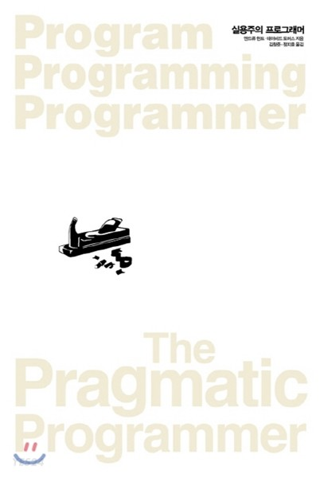

# 실용주의 프로그래머

## 1장 : 실용주의 철학

### topic 3 : 소프트웨어 엔트로피

- 깨진 창문을 내버려 두지 말라
  - ‘깨진 창문’을 고치지 않은 채로 내버려 두지 말라. 나쁜 설계, 잘못된 결정, 혹은 형편없는 코드 등이 모두 깨진 창문이다. 발견하자마자 바로 고쳐라. 적절히 고칠 시간이 없다면 일단 판자로 덮는 것만이라도 하라. 불쾌한 코드를 주석 처리 하거나, ‘아직 구현되지 않았음’이라고 메세지를 표시하거나, 가짜dummy 데이터로 대치해 놓거나 하라. 더 이상의 손상을 예방하기 위해 어떤 조치든 취하고 여러분의 상황을 잘 관리하고 있음을 보여 줘라.
  - 어쩌면 주변을 돌아다니며 프로젝트의 깨진 창문을 전부 치울 만한 시간이 있는 사람이 없으리라고 생각할지도 모르겠다. 만약 그렇다면 큰 쓰레기통을 구하거나 아니면 다른 곳으로 이사 갈 계획을 세우는 편이 나을 것이다. 엔트로피가 우리를 지배하도록 내버려 두지 말라.

### Topic 6 : 지식 포트폴리오

- 지식에 대한 투자가 언제나 최고의 이윤을 낸다. 
  - 벤저민 프랭클린(Benjamin Franklin)

우리 프로그래머들이 컴퓨터, 애플리케이션 도메인 등에 대해 알고 있는 모든 사실과 경험을 그들의 ‘지식 포트폴리오’로 생각해보길 좋아한다. 지식 포트폴리오 관리는 투자 포트폴리오 관리와 매우 유사하다.

1. 진지한 투자자는 주기적으로 투자하는 습관이 있다.
2. 장기적인 성공의 열쇠는 다각화다.
3. 똑똑한 투자자는 보수적인 투자와 위험이 크지만 보상이 높은 투자 사이에서 포트폴리오의 균형을 잘 맞춘다.
4. 투자자는 최대 수익을 위해 싸게 사서 비싸게 팔려고 한다.
5. 포트폴리오는 주기적으로 재검토하고 재조정해야 한다.

목표 : 포트폴리오의 종잣돈이 될 지식 자산을 공급하는 최선의 길

- 매년 새로운 언어를 최소 하나는 배워라 : 다른 언어는 동일한 문제를 다르게 푼다.
- 기술 서적을 한 달에 한 권씩 읽어라 : 웹에는 짧은 글과 진위가 의심스러운 답이 넘쳐난다. 하지만 깊이 있는 지식을 원한다면 긴 글 형식의 책을 읽어야 한다.
- 기술 서적이 아닌 책도 읽어라 : 컴퓨터도 사람이 사용한다는 걸, 그리고 우리는 바로 이 사람들을 만족시키려고 노력하고 있다는 걸 꼭 기억해야 한다. 사람을 대할 때는 완전히 다른 종류의 기술이 필요하다. (얄궃게도 이런 기술을 ‘소프트soft’ 스킬이라고 부르지만, 실제로는 익히기 굉장히 어렵다hard)
- 수업을 들어라
- 지역 사용자 단체나 모임에 참여하라 : 고립은 경력에 치명적일 수 있다.
- 다른 환경에서 실험해 보라 : 윈도우에서만 일을 해. 왔다면 리눅스를 얼마간 사용해 보라
- 요즘 흐름을 놓치지 말라 : 현재 프로젝트에서 사용 중인 것과는 다른 기술을 다루는 뉴스와 온라인 게시물을 읽어라

비판적 사고

- 왜냐고 다섯 번 묻기Five whys : 인기 있는 컨설팅 비법인데, “왜?”라고 다섯 번 이상 묻는 것이다. 질문하고 답을 구하라. “왜?”라고 물어서 더 깊이 파고들라. 철없는 다섯 살 꼬마 처럼 (하지만 예의 바르게) 반복해라. 아마 근본 원인에 더 가까이 다가갈 수 있을 것이다.
- 누구에게 이익이 되나? : 냉소적으로 들릴 수도 있지만 돈의 흐름을 살피면 분석이 한결 쉬워지기도 한다.
- 어떤 맥락인가? : 모든 일에는 각각의 맥락이 있기에 ‘만병통치약’인 해결책은 대개 통하지 않는다.
- 언제 혹은 어디서 효과가 있을까?
- 왜 이것이 문제인가?

## 2장 : 실용주의 접근법

### Topic 9 DRY: 중복의 해악

DRY 법칙은 다음과 같다. ‘모든 지식은 시스템 내에서 단 한 번만, 애매하지 않고, 권위 있게 표현되어야 한다.’

### Topic 11 가역성

 이 책의 많은 주제는 유연하고 적용 가능한 소프트웨어를 만드는 방법에 초점을 맞추고 있다. 여기서 추천하는 방법들, 특히 DRY 원칙, 결합도 줄이기(직교성), 외부 설정 사용하기를 따른다면 중요하면서도 되돌릴 수 없는 결정의 수를 가능한 한 줄일 수 있을 것이다. 되돌릴 수 없는 결정을 줄여야 하는 까닭은 우리가 프로젝트 초기에 늘 최선의 결정을 내릴 수는 없기 때문이다.특정 기술을 도입하고 보니 정작 필요한 능력을 갖춘 사람을 충분히 채용할 수 없을지도 모른다. 또한 어떤 외부 회사의 제품을 대안도 없이 도입하고 나니 그 회사가 경쟁사에게 인수 합병당해 버리기도 한다. 우리가 소프트웨어를 개발하는 속도는 요구 사항, 사용자, 하드웨어의 변화를 앞지를 수 없다.
 
**유연한 아키텍처**

우리는 이 책을 2019년에 쓰고 있다. 21세기가 밝은 이후로만 따져도 서버측 아키텍처의 ‘모범 사례’는 다음과 같이 변해 왔다.

- 거대한 쇳덩이iron
- 큰 쇳덩이를 많이 연결한 것
- 일반 상용 하드웨어로 만든 클러스터들로 부하를 분산시키는 것
- 애플리케이션을 구동하는 클라우드 기반 가상 머신
- 서비스를 구동하는 클라우드 기반 가상 머신
- 위의 것을 컨테이너화한 것
- 클라우드 기반 서버리스serverless 애플리케이션
- 아니나 다를까 일부 작업에 대해서는 다시 거대한 쇳덩이로 돌아가는 듯함

이렇게 아키텍처가 변덕스러운 환경에서 어떻게 계획을 세울 수 있겠는가? 못한다. 여러분이 할 수 있는 것은 바꾸기 쉽게 만드는 것이다. 외부의 API를 여러분이 만든 추상화 계층 뒤로 숨겨라. 여러분의 코드를 여러 컴포넌트로 쪼개라. 결국에는 하나의 거대한 서버에 배포하게 되더라도, 이 방식이 거대한 단일 모듈 애플리케이션을 가져다 쪼개는 것보다 훨씬 더 쉽다.

 유행을 쫓지 마라. 누구도 어떤 미래가 펼쳐질지 알 수 없으며, 우리 분야는 특히 더 그렇다. 여러분의 코드가 로큰롤rock-n-roll을 할 수 있게 하라. 락을 할 수도 있고 필요한 경우 롤을 할 수도 있게 하는 것이다. 
 
### Topic 12 예광탄trace bullet

- 예광탄은 일반 탄환들 사이에 일정한 간격으로 끼어 있다. 예관탄이 발사되면 그 안에 든 인 성분이 발화하여 총과 총알의 탄착지점 사이에 빛의 궤적을 남긴다. 만약 예광탄이 목표물을 맞힌다면 일반 탄환도 마찬가지로 맞힐 것이다. 군인들은 발사된 예광탄을 사용하여 조준을 재조정한다. 실제 상황에서의 실시간 피드백이기 때문에 매우 실용적이다.

예광탄이 효과적인 까닭은 일반 탄환과 동일한 환경 및 제약 조건에서 발사되기 때문이다. 탄환이 순식간에 목표물에 도달하기 때문에 기관총 사수는 즉각적인 피드백을 얻을 수 있다. 실용주의 관점에서 봐도 예광탄은 상대적으로 비용이 적게 드는 방법이다. 코딩에서 동일한 효과를 얻으려면 우리를 요구 사항으로부터 최종 시스템의 일부 측면까지 빨리, 눈에 보이게, 반복적으로 도달하게 해 줄 무언가를 찾아야 한다.

시스템은 정의하는 중요한 요구 사항을 찾아라. 의문이 드는 부분이나 가장 위험이 커 보이는 곳을 찾아라. 이런 부분의 코드를 가장 먼저 작성하도록 개발 우선순위를 정하라.

- 목표물을 찾기 위해 예광탄을 써라.

사실 무수한 외부 라이브러리와 도구에 의존하는 요즘의 프로젝트 초기 설정은 매우 복잡해졌다. 그래서 예광탄은 더욱 중요하다. 우리에게 가장 첫 예광탄은 바로 ‘프로젝트를 만들고, “hello world!”를 추가한 다음, 컴파일 및 실행시키는 것’이다. 그 후에는 전체 애플리케이션에서 불확실한 곳이 어디인지 찾아보고 해당 부분을 작동시키는데 필요한 뼈대를 추가한다. 

- 예광탄 코드는 한 번 쓰고 버리려고 만드는 것이 아니다. 앞으로도 계속 사용할 코드다. 예광탄 코드도 다른 제품 코드와 마찬가지로 오류 검사, 올바른 구조, 문서화, 자체 검사self-checking를 갖추어야 한다. 예광탄 코드에는 아직 모든 기능이 들어 있지 않을 뿐이다. 하지만 시스템을 구성하는 모든 요소를 모두 연결해 놓은 후라면 목표물에 얼마나 근접했는지 확인할 수 있으며, 필요하다면 조정도 할 수 있다. 일단 정확하게 조준하고 나면 기능을 추가하는 일은 쉽다. 예광탄 개발 방법은 ‘프로젝트는 결코 끝나지 않는다.’는 견해와도 일맥상통한다. 변경 요청과 기능 추가 요청은 언제나 계속 들어오기 마련이다. 예광탄 개발 방법은 점진적인 접근 방법이다.
- 예광탄이 언제나 목표물을 맞히는 것은 아니다. : 예광탄은 지금 맞히고 있는 것이 무엇인지 보여준다. 그러나 그것이 꼭 목표물이라는 보장은 없다. 그럴 경우 목표물에 맞을 때까지 조준을 옮겨야 한다. 이것이 핵심이다.
- 예광탄 코드 vs 프로토타이핑 : 프로토타입prototype과 다르지 않다고 생각할 수 있지만 차이점이 있다. 프로토타입은 최종 시스템의 어떤 특정한 측면을 탐사해 보는 것이 목표다. 진짜 프로토타입 방식을 따른다면 프로토타입은 어떤 개념을 실험해 보느라 대충 끼워 맞추어 구현한 것이므로 모두 버려야 한다. 그리고 실험 과정에서 얻능 교훈을 바탕으로 코드를 새로 작성한다. 예광탄 코드 접근은 다른 종류의 문제를 푼다. 애플리케이션이 전체적으로 어떻게 연결되는지를 알고 싶다. 사용자에게 실제로 애플리케이션의 요소들이 어떻게 상호 작용하는지 보여주고 싶고, 개발자에게는 코드를 붙일 아키텍쳐 골격을 제시하고 싶다. 이 경우 대강 구현한 적재 알고리즘과 단순하지만 동작은 하는 사용자 인터페이스로 구성된 예광탄을 만들 것이다. 애플리케이션의 요소를 이어붙여 사용자와 개발자에게 제시할 프레임워크를 만드는 것인데,이 프레임워크에 자리만 만들어 두었던 루틴을 나중에 채워 나가면서 새로운 기능을 추가한다. 프레임워크 자체는 손대지 않고 그대로 남아 있고 최종 결과물의 일부가 된다.
  - 프로토타입은 나중에 버리는 코드를 만든다. 예광탄 코드는 기능은 별로 없지만 완결된 코드이며, 최종 시스템 골격 중 일부가 된다. 프로토타입은 예광탄을 발사하기 전에 먼저 수행하는 정찰이나 정보 수집과 같은 것이다.  

### Topic 13 프로토타입과 포스트잇

소프트웨어 프로토타입은 위험 요소를 분석하고 노출시킨 후 이를 매우 저렴한 비용으로 바로잡을 기회를 얻기 위해 활용한다. 각 프로토타입을 만들 때마다 프로젝트의 특정 측면에 중점을 둘 수 있다.

- 프로토타입은 제한된 몇 가지 질문에 답하기 위한 것이므로 실제 제품보다 훨씬 적은 비용으로 빠르게 개발할 수 있다. 여러분에게 당장 중요하지 않은 세부 사항이라면 추후에 사용자에게 매우 중요해질지도 모르지만 일단 무시하면서 코딩할 수 있다.
  - 세부 사항을 포기할 수 없는 환경에 처해 있다면 진짜로 프로토타입을 만들고 있는 게 맞는지 자문해 보라. 아마도 이런 경우에는 예광탄 방식의 개발이 더 적절할 것이다. 

## 3장 : 기본 도구

**자신만의 셸**

- 색깔 조합 설정
- 프롬프트 설정
- 별칭alias과 셸 함수
- 명령어 자동 완성

### Topic 18 파워 에디팅

- 텍스트를 편집할 때 문자, 단어, 줄, 문단 단위로 커서를 이동하거나 내용을 선택하라
- 코드를 편집할 때 반대쪽 괄호로 이동하거나, 함수, 모듈 등 다양한 문법 단위로 커서를 이동하라
- 변경한 코드의 들여쓰기 indent를 자동으로 맞춰라
- 여러 줄의 코드를 명령 하나로 주석 처리했다가 주석을 해제하라.
- 실행 취소를 여러 번 했다가 취소한 명령을 재실행 기능으로 다시 수행하라.
- 에디터 창을 여러 구역으로 쪼개라. 그리고 각 구역 사이를 이동하라
- 특정 줄 번호로 이동하라
- 여러 줄을 선택한 후 가나다 순으로 정렬하라.
- 문자열로, 또 정규 표현식으로 검색하라. 이전에 검색했던 것을 다시 검색하라
- 선택 영역이나 패턴 검색을 이용하여 일시적으로 여러 개의 커서를 만든 다음, 동시에 여러 곳의 텍스트를 편집하라.
- 현재 프로젝트의 컴파일 오류를 표시하라.
- 현재 프로젝트의 테스트를 실행하라.

이 과제들을 마우스나 트랙패드 없이 모두 수행할 수 있는가? 여러분이 현재 사용하는 에디터로는 수행 불가능한 것이 몇 가지 있다고 할지도 모르겠다. 그렇다면 에디터를 바꿀 때인 것은 아닐까?  

### Topic 20 디버깅

고무 오리

- 문제의 원인을 찾는 매우 단순하지만 꽤 유용한 기법으로 그냥 누군가에게 문제를 설명하는 방법이 있다. 상대방은 여러분의 어깨 너머로 화면을 바라보면서 자기 머리를 계속 끄덕인다. 마치 고무 오리가 욕조 안에서 아래위로 까닥이듯이 말이다. 듣는 사람은 입도 뻥긋할 필요가 없다. 코드가 무엇을 해야 하는지 차근차근 설명해 나가는 단순한 행위 그 자체로 충분할 때가 많다. 그것만으로도 여러분이 찾고 있던 문제가 화면 밖으로 뛰쳐나와 모습을 드러낸다. 간단해 보인다. 하지만 누군가에게 문제를 설명하게 되면 혼자 코드를 살펴볼 때는 당연히 여기고 지나갈 것을 명시적으로 이야기해야 한다. 이런 가정 몇 가지를 입 밖에 내면, 문제에 대한 새로운 통찰을 불현듯이 얻을 수도 있다. 만약 들어 줄 사람이 없다면 고무 오리나 곰 인형, 화분도 괜찮다.

## 4장 : 실용주의 편집증

여러분은 완벽한 소프트웨어를 만들 수 없고, 실용주의 프로그래머는 자기 자신을 믿지 않는다.

### Topic 23 계약에 의한 설계

‘상식과 정직만큼 사람을 놀라게 하는 건 없다. - 렐프 월도 에머슨(Ralph Waldo Emerson), <Essays>’

정직한 거래를 보장하는 최선의 해법 중 하나는 ‘계약contract’이다. 계약은 자신과 상대편의 권리 및 책임을 정의한다. 그뿐만 아니라 한쪽이 계약을 어겼을 경우의 대응도 계약 사항에 포함된다. 소프트웨어 모듈이 서로 소통하는 것을 돕기 위해 동일한 개념을 사용할 수 있을까? 대답은 “그렇다” 이다.

**DBC**

버트런드 마이어Bertrand Mayer는 에펠Effel이라는 언어를 만들면서 ‘계약에 의한 설계Design By Contract, DBC’ 개념을 개발했다. DBC는 단순하지만 강력한 기법으로, 프로그램의 정확성을 보장하기 위해 소프트웨어 모듈의 권리와 책임을 문서화하고 합의하는 데에 초점을 맞춘다. 정확한 프로그램이란 무엇인가? 자신이 하는 일이라고 주장하는 것보다 많지도 적지도 않게 딱 그만큼만 하는 프로그램이다. 이 주장을 문서화하고 검증하는 것이 ‘계약에 의한 설계’의 핵심이다.

소프트웨어 시스템의 모든 함수와 메서드는 **뭔가를 한다.** 그 뭔가를 시작하기 전에 해당 함수는 세상의 상태에 대해 어떤 전제 조건을 갖고 있을 테고, 루틴이 끝난 후에는 세상의 상태가 어떠할 것이라고 선언할 수 있을 것이다. 마이어는 이런 전제와 선언을 다음과 같이 설명한다.

- 선행 조건 precondition : 루틴이 호출되기 전에 참이어야 하는 것. 루틴의 요구 사항이다. 루틴의 선행 조건이 위반된 경우에는 루틴이 호출되어서는 안 된다. 제대로 된 데이터를 전달하는 것은 호출하는 쪽의 책임이다.
-  후행 조건 postcondition : 루틴이 자기가 할 것이라고 보장하는 것. 즉, 루틴이 완료되었을 때 세상의 상태다. 루틴에 후행 조건이 있다는 것은 곧 루틴이 종국에는 종료될 것이라는 것을 의미한다. 무한 반복은 허용하지 않는다.
-  클래스 불변식class invariant : 호출자의 입장에서 볼 때는 이 조건이 언제나 참인 것을 클래스가 보장한다. 루틴의 내부 처리 도중에는 불변식이 참이 아닐 수도 있지만, 루틴이 끝나고 호출자로 제어권이 반환되는 시점에는 불변식이 참이 되어야 한다. (따라서 클래스는 불변식에 관여하는 데이터 멤버의 제한 없는 쓰기를 허용할 수 없다.)

루틴과 그 루틴을 호출하려는 코드 간의 계약은 다음과 같다.

>> 만약 호출자가 루틴의 모든 선행 조건을 충족한다면 해당 루틴은 종료 시 모든 후행 조건과 불변식이 참이 되는 것을 보장한다. 

만약 계약 당사자 중 어느 한쪽이라도 이 계약 내용을 지키지 못하면 (이전에 양측이 동의한 내용에 따라) 해결 방안이 실행된다. 예외가 발생할 수도 있고 아니면 프로그램을 종료시킬 수도 있다. 무슨 일이 벌어지든지 확실한 점은 계약에 부응하지 못하는 것은 버그라는 것이다. 이것은 결코 발생해서는 안 되는 일이며, 그렇기 때문에 선행 조건을 이용해서 사용자 입력값을 검증한다거나 해서는 안 된다.

### Topic 27 헤드라이트를 앞서가지 말라

헤드라이트는 ‘투사 거리throw distance’라고 부르는 범위까지만 밝힐 수 있다. 이 범위 바깥은 빛이 너무 분산되어 효과가 떨어진다. 또한 헤드라이트는 일직선 모양의 영역을 비추므로 커브나, 언덕, 웅덩이처럼 정면을 벗어난 것은 밝히지 못할 수도 있다. 미국 도로교통안전국에 따르면 하향등으로 밝힐 수 있는 거리는 평균 약 50m인데, 안타깝게도 시속 60km로 달릴 때의 정지 거리는 약 52m이고, 시속 100Km라면 무려 116m다. 따라서 헤드라이트를 앞서가기는 꽤 쉽다.

마찬가지로 소프트웨어 개발에서도 우리의 ‘’헤드라이트’는 제한되어 있다. 우리는 너무 먼 미래는 내다볼 수 없고, 정면에서 벗어난 곳일수록 더 어둡다. 그래서 실용주의 프로그래머에게는 확고한 규칙이 있다.

- 작은 단계들을 밟아라. 언제나 :언제나 신중하게 작은 단계들을 밟아라. 더 진행하기 전에 피드백을 확인하고 조정하라. 피드백의 빈도를 여러분의 제한 속도라고 생각하라. ‘너무 큰’ 단계나 작업은 하지 않게 될 것이다. 너무 큰 작업은 무엇일까? ‘예언’을 해야 하는 모든 작업이다. 자동차 헤드라이트로 비출 수 있는 거리에 한계가 있는 것처럼 우리도 한두 단계 앞의 미래만 내다볼 수 있다. 끽해야 몇 시간이나 며칠 정도일 것이다. 그 너머는 경험에 기반한 추측을 벗어난 무모한 억측의 영역이다.

## 5장 : 구부러지거나 부러지거나  

### Topic 28 결합도 줄이기

**열차 사고**

데메테르 법칙 : 사람들이 결합도에 대한 이야기를 할 때 ‘데메테르 법칙Law of Demeter. LoD’이라는 것을 언급하는 경우가 많다. LoD는 80년대 말 이안 홀랜드Ian Holland가 만든 일련의 지침이다. 데메테르라는 프로젝트를 수행하는 도중 개발자들에게 보다 깨끗하고 결합도가 낮은 함수를 작성하는 방법을 알려주기 위해 만들었다.

- LoD는 어떤 클래스 C에 정의된 메서드가 다음 목록에 속하는 것만 사용할 수 있다고 제한한다.
  - C의 다른 인스턴스 메서드
 - 메서드의 매개 변수
 - 스택이나 힙에 자신이 생성하는 객체의 메서드
 - 전역 변수

책 1판에서는 데메테르 법칙에 대해 공들여 설명했지만 20년이 지난 후 LoD의 가치는 빛이 바래고 말았다. 전역 변수 부분이 싫다. 그리고 이 법칙을 실제로 사용하기가 꽤 어렵다는 것도 깨달았다. 메서드를 호출하는 코드를 쓸 때마다 법률 문서를 해독해야 하는 느낌이다.

하지만 기반이 되는 원칙 자체는 유효한데, ‘메서드 호출을 엮지 말라’ 정도로 바꿔 표현할 수 있다.

**글로벌화의 해악**

어디서나 접근할 수 있는 데이터는 교묘하게 애플리케이션 컴포넌트 간의 결합을 만들어 낸다. 전역 global 데이터 하나하나는 애플리케이션의 모든 메서드에 갑자기 매개변수가 추가된 것과 같은 효과를 낸다. 전역 데이터는 모든 메서드 안에서 사용할 수 있으니까 말이다.

전역 데이터는 여러 가지 방법으로 코드의 결합도를 높인다. 전역 데이터의 구현을 변경할 때 시스템 코드 전체에 영향을 줄 수 있음은 분명하다. 물론 실제 상황에서 그 파급 효과는 제한적인다. 하지만 문제는 바꿔야 하는 곳을 모두 바꿨는지 확인하기 힘들다는 데 있다. 전역 데이터는 코드를 떼어 내는 경우에도 문제를 만든다.

전역 데이터를 쓰는 코드에 단위 테스트를 만들다 보면 이런 문제를 발견하게 된다. 그저 테스트를 실행하려는 것뿐인데 전역 환경을 생성하는 코드를 한참이나 써야 한다.

**상속은 결합을 늘린다**

상속으로 다른 클래스의 상태와 행동을 그대로 가져올 수 있다.  