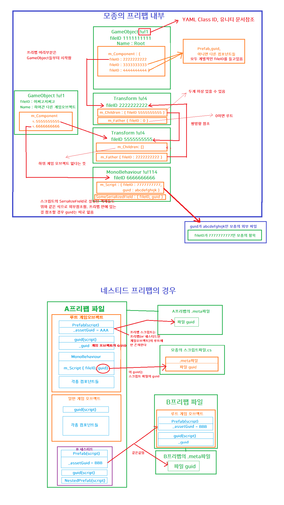
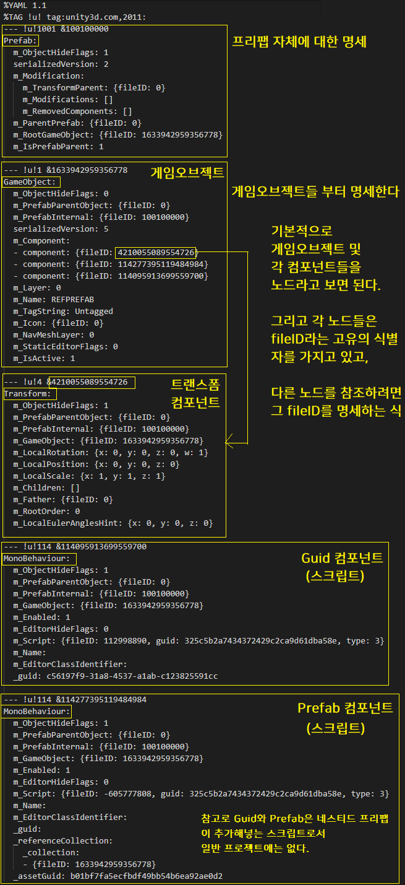
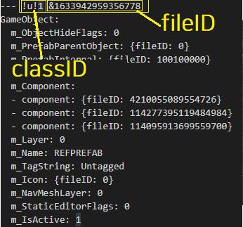
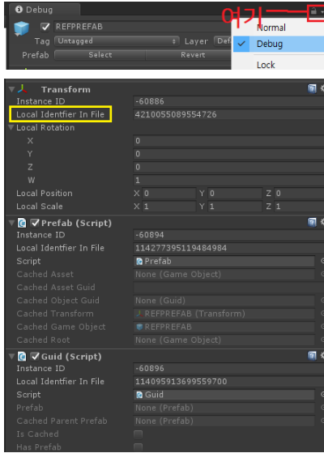
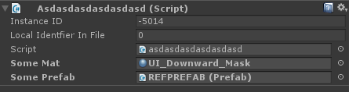
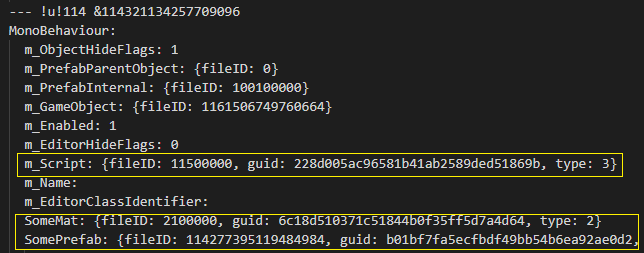

# 1\. Unity Prefab

(펌)

  회사 프로젝트에서는 자꾸 프리팹 관련해서 예전부터 빈번히 문제가 발생해왔는데, 다른 객체 참조가 끊겨서 None으로 표시된다던가, guid가 달라져서 missing된다던가 등이 대표적이다.

  뭐가 문제인지 모르는 채 있는 것보다는 프리팹 내부가 어떻게 생겨먹었는지 알고 있어야 대처 방안을 고려하는데 도움이 될것 같아 직접 .prefab을 까보고 이것 저것 알아보았다.

# 2\. 전반적인 구조

네스티드 프리팹의 경우 2017 기준인데, 2018에서는 네스티드프리팹이 유니티로 편입되면서 다른 방식이 되었을 수도 있다. 

이 태스크에서는 일단 2017을 기준으로 이야기한다.

이 그림을 토대로 하나하나 짚어보도록 하자.

# 3\. .prefab의 게임 오브젝트 명세방법

[https://docs.unity3d.com/Manual/FormatDescription.html](https://docs.unity3d.com/Manual/FormatDescription.html)

.prefab 내부는 결론적으로 일종의 마크업언어다.

**YAML**이라는 언어로 명세하는데 YAML 자체에 관해서는 위 문서 안에 링크가 있음.

아무것도 없이 Prefab, Guid와 Transform 하나만 박힌 프리팹 내부를 보자.

게임 오브젝트 안에 컴포넌트 명세가 스택을 쌓으며 들어가는게 아니고,

각 게임오브젝트와 컴포넌트가 독립적인 노드로 존재하고, 다른 노드의 fileID를 참조하여 트리를 생성하는것으로 추측된다.

# 4\. fileID? guid?

일단 다른건 둘째치고 가장 핵심적인 개념인 fileID와 guid를 짚고 넘어가보자.

## I. fileID

각 노드의 최상단에는 !u!로 시작하여 classID와 fileID를 명세한다.

**!u! 뒤에 오는 숫자가 classID, & 뒤에 오는 숫자가 fileID이다.** 

위 그림에서는

**classID는 1**

**fileID는 1633942959356778**

이다.

classID는 노드 타입마다 별개의 값을 가지고 있는데,

1은 게임오브젝트, 4는 Transform, 114는 MonoBehaviour 같은 식이다.

[https://docs.unity3d.com/Manual/ClassIDReference.html](https://docs.unity3d.com/Manual/ClassIDReference.html)

classID는 위 문서를 참고

**fileID의 prefix로 classID가 붙는다. MonoBehaviour일 경우 fileID 앞에 무조건 114가 오는식**

그런데 혼란을 조장하는게 뭐냐면,

**fileID는 파일을 가르키는게 아니다.**

언뜻 보면 fileID이라는 이름 때문에 “아~ 어떤 다른 파일을 참조하나 보다” 하고 착각하게 되는데

파일 그 자체를 가르키는게 아니고 파일 안에 명세되어 있는 특정 id를 가르키는것이다.

그건 노드의 fileID일수도 있고, 리소스파일의 localID일수도 있다.

**무슨 이야기인지는 III절에서 설명한다.**

이 fileID는 여러곳에서 다른 용어로 표현하고 있는데, 유니티 문서에는 이렇게 써있다.

The number following the ampersand is an <strong>object ID number</strong> which is unique within the file, although the number is assigned to each object arbitrarily. Each of the object’s serializable properties is denoted by a line like the following:-

또한 인스펙터 옵션을 Debug로 바꾸게 되면 이 fileID를 볼 수 있는데,

여기서는 fileID를 **Local Identifier In File** 이라고 써놓았다.

일관성좀…

## II. guid

**파일의 고유 식별자**를 뜻하는게 바로 guid다.

이 guid는 .meta에 명세되어있다.

참고로 게임 오브젝트에 붙어있는 Guid 컴포넌트도 \_guid 라는 변수가 있는데,

이건 **네스티드 프리팹이 뭔가 할려고 할때 쓰는 변수인듯 하다. 무슨 용도인지는 불명**(헷갈리게 만듬...)

## III. fileID와 guid가 동시에 써있는 경우

fileID와 guid가 동시에 명세되어 있는 경우가 있다.

이 경우는 **“현재 프리팹 내부가 아니라 guid가 XXXX인 파일안의 fileID를 참조한다”** 라는 뜻이다.

fileID는 **노드의 fileID**를 가르키거나, 리소스파일의 **로컬ID**를 가르킨다고 했다

임의로 아무 프리팹 내부 게임오브젝트에 **Material을 SerializeField**로 받는 스크립트를 붙여놨다고 가정하자.

(Local Identifier In File이 0인것은 씬에 넣은 인스턴스라서 그렇다)

해당 노드의 명세는 이렇게 생겼는데,

**m\_Script**는 **asdasdasdasdasdasd.cs**의 로컬ID **11500000**을 참조하고,

**SomeMat**은 **UI\_Downward\_Mask.mat**의 로컬ID **2100000**을,

**SomePrefab**은 **REFPREFAB.prefab**의 노드ID **114277395119484984**를 참조한다는 뜻이다.

여기서 알 수 있는 사실은, 외부 파일을 guid를 통해 참조하는 노드(혹은 프로퍼티)의 경우

**그 외부파일 내부의 localID나 노드의 fileID가 바뀌거나, guid가 바뀌면** **연결이 끊길 수 밖에 없다는 것이다.**

사실 이것 fileID와 guid만 잘 구별하면 나머지 프로퍼티들이 무슨 역할인지는 크게 중요치 않은 듯 싶다.