# 구글 엔지니어는 이렇게 일한다

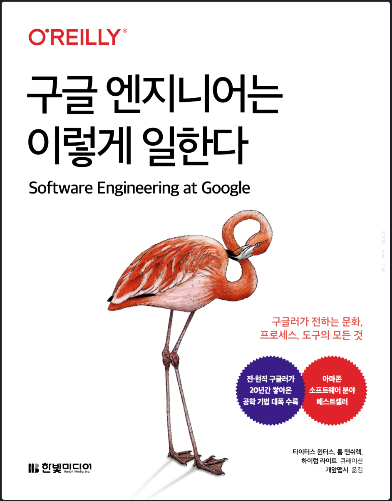

# Part 1 전제

## 소프트웨어 엔지니어링이란?

프로그래밍과 소프트웨어 엔지니어링의 가장 큰 차이는 시간time, (규모) 확장scale, 실전에서의 트레이드 오프trade-offs at play 이렇게 세 가지라고 생각합니다. 소프트웨어 엔지니어링 프로젝트에서 엔지니어는 시간의 흐름과 언제가 변경change될 가능성에 더 신경 써야 합니다. 소프트웨어 엔지니어링 조직은 만들어낼 소프트웨어 자체뿐 아니라 제작하는 조직까지 양 측면 모두에서의 확장과 효율에 더 집중해야 합니다. 마지막으로 소프트웨어 엔지니어는 대체로 수명과 성장 속도를 정밀하게 예측하기 어려운 상황에서, 결과에 더 큰 영향을 주는 보다 복잡한 결정을 내려야 합니다.

구글에서는 이따금 '소프트웨어 엔지니어링은 흐르는 시간 위에서 순간순간의 프로그래밍을 모두 합산한 것이다software engineering is programming integrated over time' 라고 말하곤 합니다. 소프트웨어 엔지니어링에서 프로그래밍이 큰 비중을 차지하는 건 틀림없지만 프로그래밍은 결국 새로운 소프트웨어를 제작하는 수단입니다. 이 차이를 받아들인다면 자연스럽게 프로그래밍 작업 (개발development)과 소프트웨어 엔지니얼이 작업(개발development + 수정modification + 유지보수maintenance)의 차이도 궁금할 것입니다. 시간이라는 요소가 더해지면서 프로그래밍에는 중요한 차원이 하나 늘어서 더 입체적으로 바뀝니다. 정육면체는 정사각형이 아니고 거리는 속도가 아니듯, 소프트웨어 엔지니어링은 프로그래밍이 아닌 것이죠

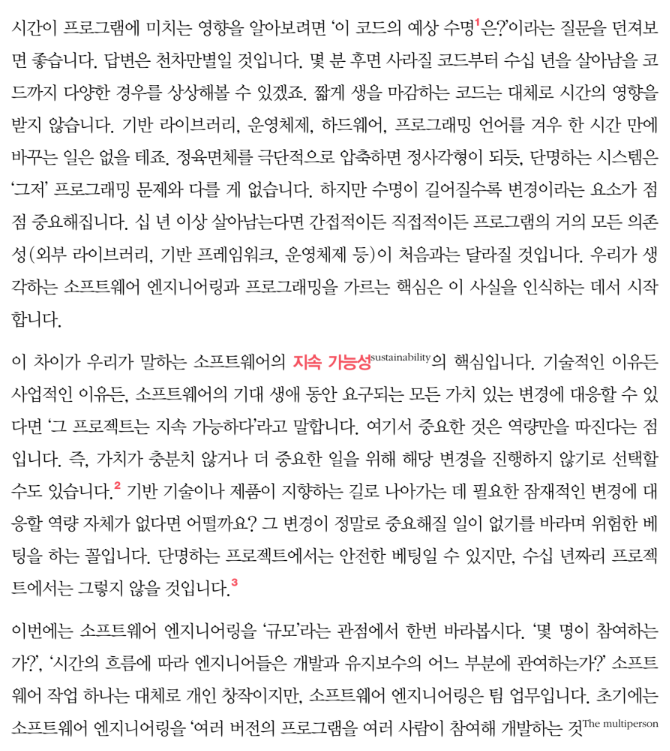
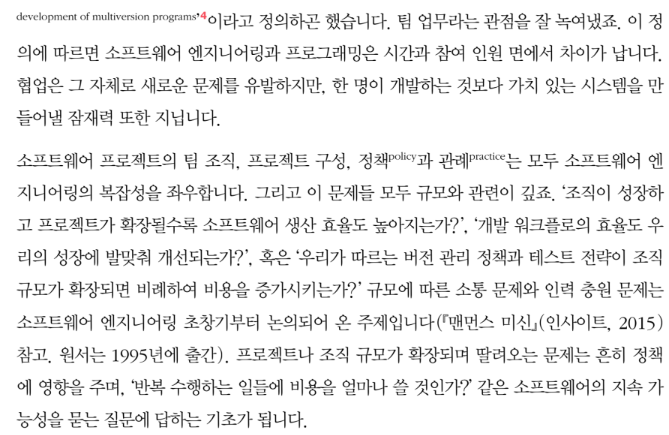

**하이럼의 법칙Hyrum's Law**

다른 엔지니어들이 사용 중인 프로젝트를 유지보수하고 있다면 '동작한다'와 '유지보수 가능하다'를 구분 짓는 가장 중요한 요인은 바로 하이럼의 법칙일 것입니다.

- `API 사용자가 충분히 많다면 API 명세에 적힌 내용은 중요하지 않습니다. 시스템에서 눈에 보이는 모든 행위(동작)를 누군가는 이용하게 될 것이기 때문입니다.`

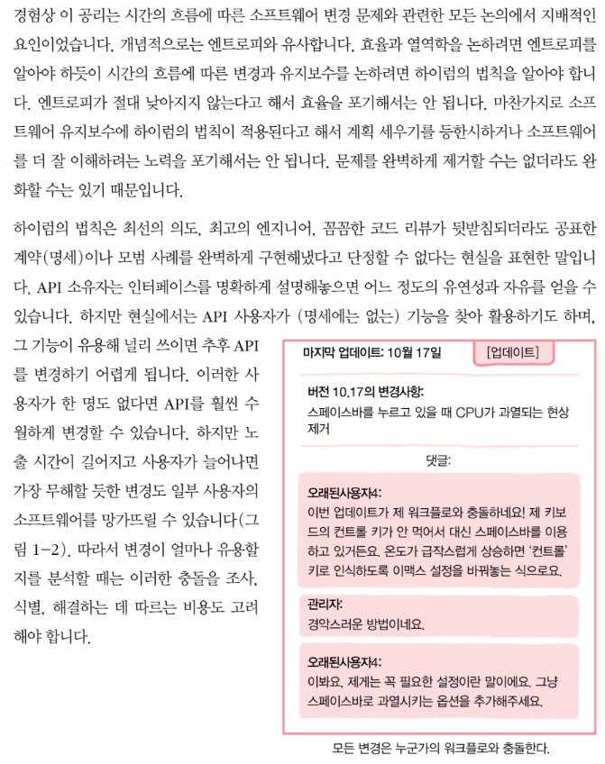

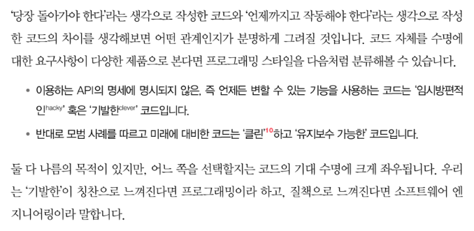

**원점 회귀(왼쪽으로 옮기기)**

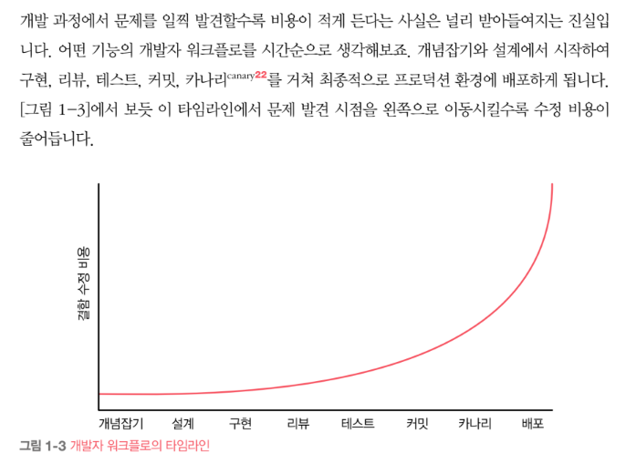

왼쪽으로 옮기는 행위를 원점 회귀shift left 라 하는데, 보안성 점검을 개발 프로세스의 마지막으로 연기하면 안 된다고 호소하며 '보안을 고려하는 시점을 왼쪽으로 이동시켜라shift left on security'라고 한 말에서 유래한 듯 합니다. 제품을 고객에게 배포한 후에야 취약점이 발견되면 해결하는 데 막대한 비용이 들 것입니다. 다행히 프로덕션 배포 직전에 발견하면 문제를 식별하고 조치하는 데 여전히 큰 비용이 들겠지만 더 저렴할 게 분명합니다.

**트레이드 오프와 비용**

비용cost은 금액만을 지칭하는 게 아닙니다. 투입된 노력과 다음의 요소들까지 모두 포괄합니다.

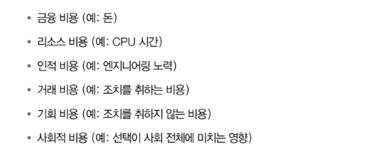

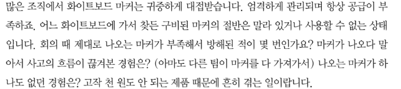

결국 엔지니어링 조직의 선택을 결정짓는 요인은 다음의 몇 가지로 압축됩니다.

- 반드시 해야 하는 일(법적 요구사항, 고객 요구사항)
- 근거에 기반하여 당시 내릴 수 있는 최선의 선택(적절한 결정권자가 확정)

의사결정이 '내가 시켰으니까'가 되어서는 안 됩니다.

 

로컬 빌드 사례

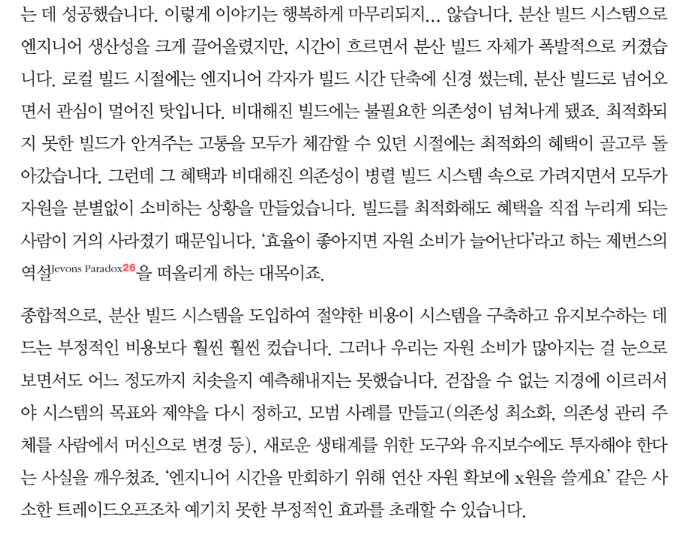

# Part 2 문화

## 팀워크 이끌어내기

피드백 루프

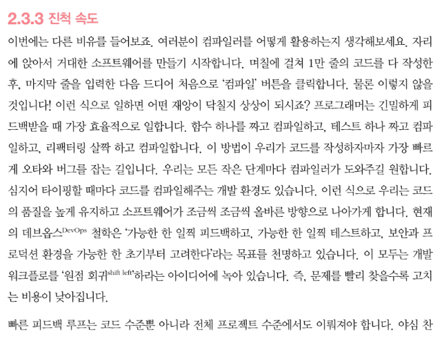

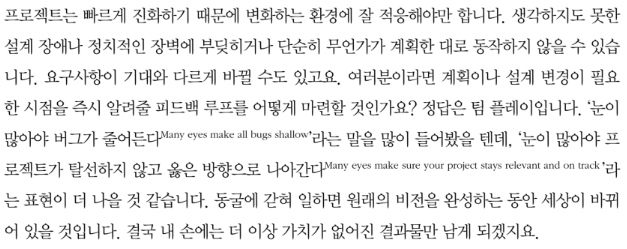

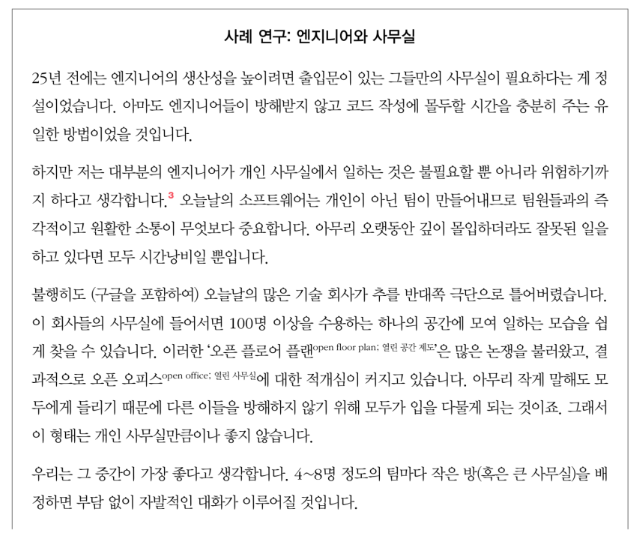

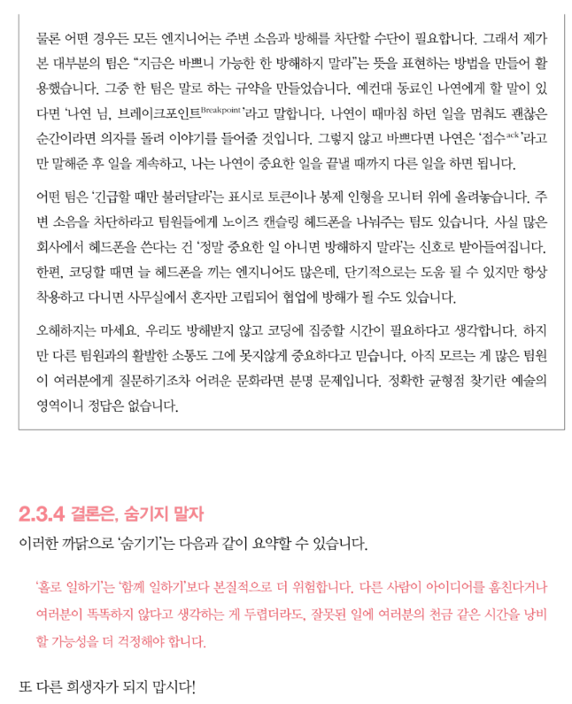

**비난 없는 포스트모템 문화**

실패한 근본 원인을 분석하여 문서로 남기는 것이 실수로부터 배우는 핵심입니다. 이를 구글은 (그리고 다른 많은 회사에서도) 포스트모템postmortem 이라고 합니다. 포스트모템 문서가 쓸모 없는 사죄, 변명, 지적으로 채워지지 않도록 각별히 주의하세요. 제대로 된 포스트모템에는 무엇을 배웠는지와 배운 것을 토대로 앞으로 무엇을 바꿀지가 담겨야 합니다. 그런 다음 포스트모템을 쉽게 열람할 수 있고 포스트모템에서 제안한 변화를 팀이 실천하는지 확인해야 합니다.

훌륭한 포스트모템에는 다음 내용이 담겨야 합니다.

- 사건의 개요
- 사건을 인지하고 해결에 이르기까지의 타임라인
- 사건의 근본 원인
- 영향과 피해 평가
- 문제를 즉시 해결하기 위한 조치 항목(소유자 명시)
- 재발 방지를 위한 조치 항목
- 해당 경험에서 얻은 교훈

## 지식 공유

### 배움을 가로막는 장애물

- 정보 섬(Information islands) : 조직의 각 부서가 서로 소통하거나 자원을 공유하지 않아서 지식이 피편화됩니다.
- 단일 장애점(single point of failure, SPOF) : 중요한 정보를 한 사람이 독점하면 병목이 생깁니다.
- 전부 아니면 전무 전분성(all-or-nothing expertise) : 조직 구성원이 '모든 것을 아는' 사람과 '아무것도 모르는' 초심자로 나뉩니다. 중간층은 거의 사라지죠. 한번 이렇게 되면 전분가들은 항상 모든 일을 자신들이 처리하게 됩니다. 새로운 전문가를 키우기 위한 멘토링이나 문서화에 신경 쓸 여력이 줄어들어 문제가 눈덩이처럼 커집니다.
- 앵무새처럼 흉내내기(parroting) : 이해하지 못한 상태로 흉내만 내는 것을 말합니다.
- 유령의 묘지(haunted graveyard) : 무언가 잘못될 게 두려워서 아무도 손대지 않는 영역(주로 코드)을 말합니다. 유령의 묘지는 두려움과 비합리적인 의심 때문에 사람들이 손대기를 기피하는 영역입니다.

### 철학

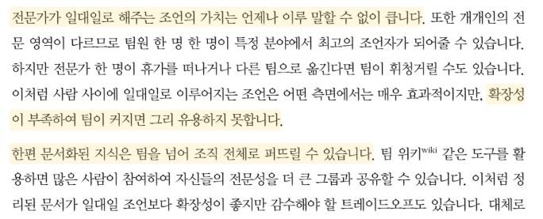

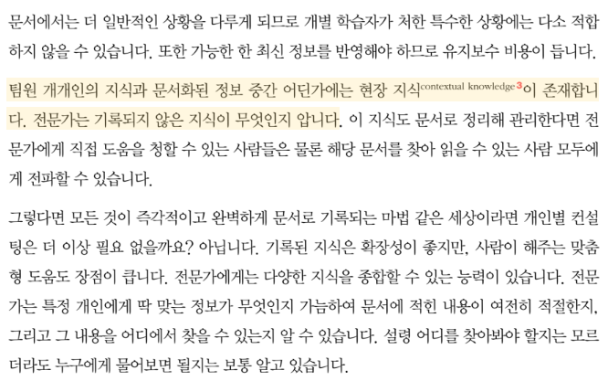

### 판 깔아주기 : 심리적 안전

- 심리적 안전은 학습 환경을 조성하는 데 매우 중요합니다.
- 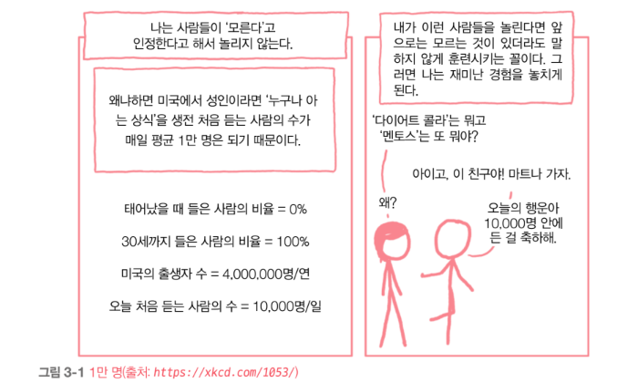

### 멘토 제도

- 구글에서는 '누글러Noogler : 구글에 새로 입사한 직원'가 합류하자마자 분위기를 만들어주려 노력합니다. 멘토 정해주기는 누글러에게 심리적 안전을 심어주는 효과적인 방법입니다. 멘토의 공식 역할은 궁금한 점에 답해주고 누글러의 성장을 돕는 것입니다.
- 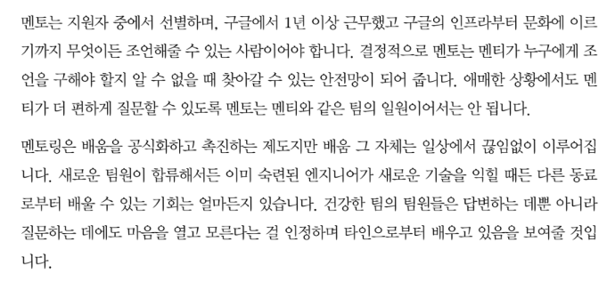
- 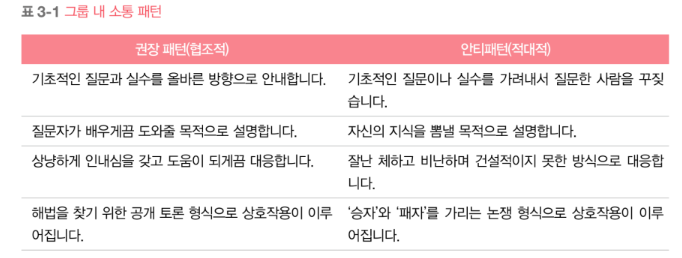

### 공정 사회를 위한 엔지니어링

**단일한 접근 방식 거부하기**

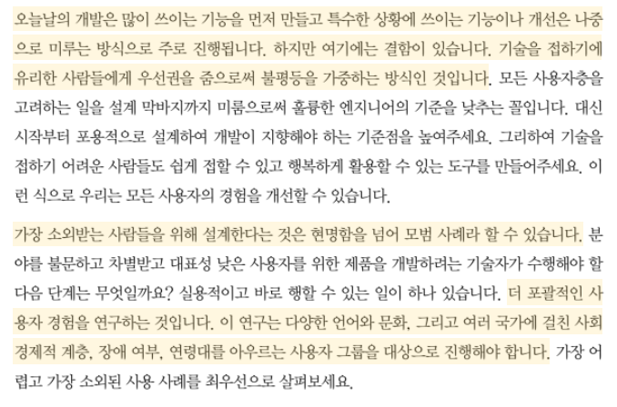

### 팀 이끌기

### 안티패턴

- 만만한 사람 고용하기
- 저성과자 방치하기
- 사람 문제 무시하기
- 만인의 친구되기
- 채용 기준 타협하기
- 팀을 어린이처럼 대하기

### 올바른 패턴

- 자존심 버리기
- 마음 다스리기
- 촉매자 되기
- 장애물 치우기
- 선생이자 멘토되기
- 명확한 목표 세우기
- 정직하기
- 행복한지 확인하기

### 그 외 조언과 요령

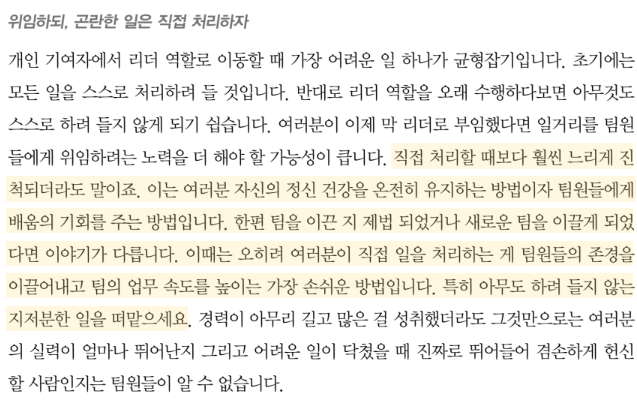

### 사람은 식물과 같다

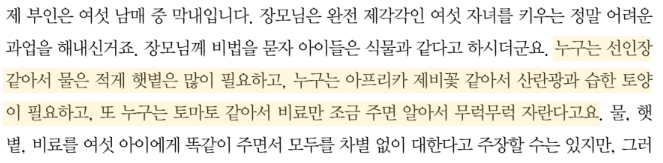

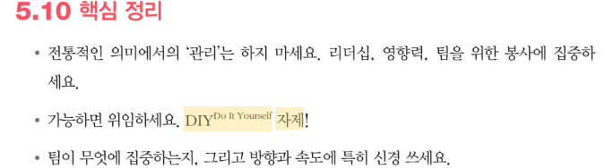

## 성장하는 조직 이끌기

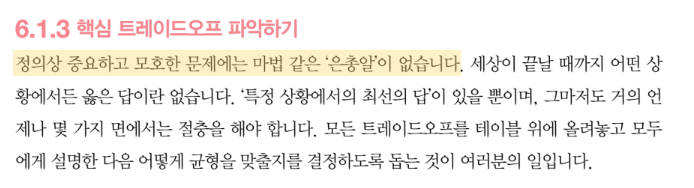

### 엔지니어링 생산성 측정하기

**엔지니어링 생산성을 측정하는 이유**

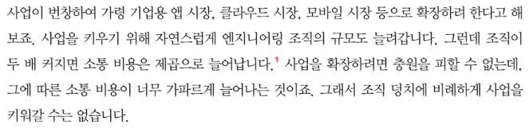

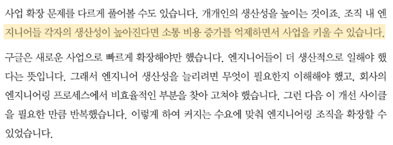

**선별: 측정할 가치가 있는가?**

구글은 각 팀이 생산성 측정을 해도 될지를 결정하는 데 도움되는 질문 목록을 마련했습니다. 먼저 구체적인 질문을 던져서 그들이 측정하고 싶은 것을 설명하도록 요청합니다. 우리는 사람들이 이 질문에 더 구체적으로 답할수록 측정 과정에서 얻는 것도 많아짐을 알게 되었습니다. 우리를 찾은 가독성팀의 질문은 '엔지니어들이 가독성 프로세스를 밟는 데 들이는 비용 이상의 가치를 회사가 얻고 있을까요?' 와 같이 단순했습니다.

다음의 측면을 고려해 볼 수 있겠습니다.

- 어떤 결과를 기대하고 왜 그런가?
- 데이터를 기대한 결과를 뒷받침한다면 어떤 조치를 취하겠는가?
- 부정적인 결과가 나온다면 적절한 조치를 취할 것인가?
- 결과에 따른 조치는 누가 결정하고, 언제 수행하는가?

이상의 질문들을 던져보면 측정해볼 가치가 없는 경우가 꽤나 많다는 사실을 알게 됩니다. 괜찮습니다. 어떤 도구나 프로세스가 생산성에 미치는 영향을 측정하지 말아야 할 합당한 이유는 많습니다. 예를 들어보죠.

- 당장 프로세스/도구를 변경할 여유가 없다.
- 어떤 결과가 나오든 곧 다른 요인에 의해 의미가 없어질 것이다.
- 측정 결과를 이미 확정된 계획을 뒷받침하는 용도로만 쓴다.
- 측정할 수 있는 지표들이 문제를 평가하기에 충분히 정확하지 않으며, 다른 요인들 때문에 혼탁해질 우려가 크다.

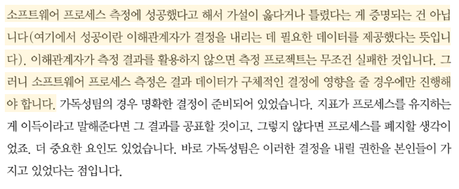

**신호**

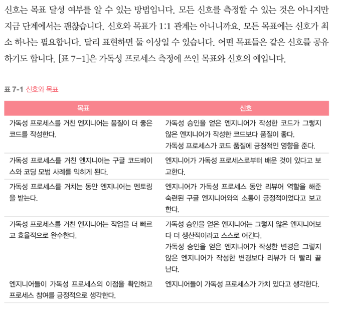

# Part 3 프로세스

## 스타일 가이드와 규칙

**규칙이 필요한 이유**

규칙을 관리하는 목표는 '좋은' 행동을 장려하고 '나쁜' 행동을 억제하기 위함입니다. '좋은'과 '나쁜'의 해석은 조직마다 차이가 있습니다. 관심사가 다르기 때문이죠.

확립된 규칙과 지침은 커지더라도 일관되게 통용되는 공통의 코딩 어휘가 되어줍니다. 어휘가 통일되면 엔지니어들은 코드를 표현하는 '형식'보다 코드에 담을 '내용'에 집중할 수 있습니다. 공통 어휘를 형성하면 엔지니어들은 무의식적으로 '좋은' 코드를 작성하는 경향이 생깁니다. 이처럼 규칙은 일상의 개발 패턴을 조직이 원하는 방향으로 슬쩍 밀어주는 역할로 푝넓게 활용됩니다.

**규칙 만들기**

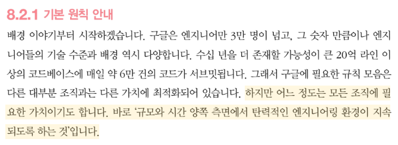

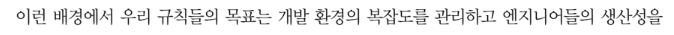

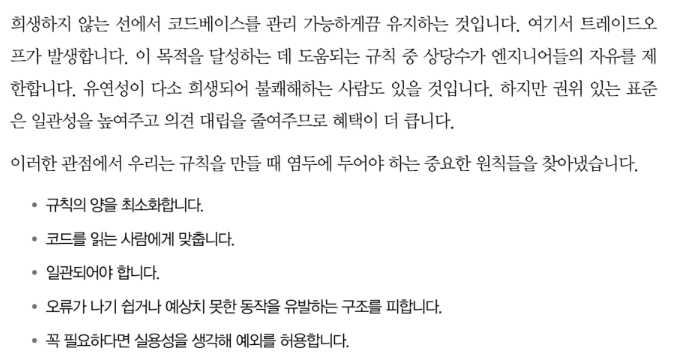

규칙의 양을 최소화한다

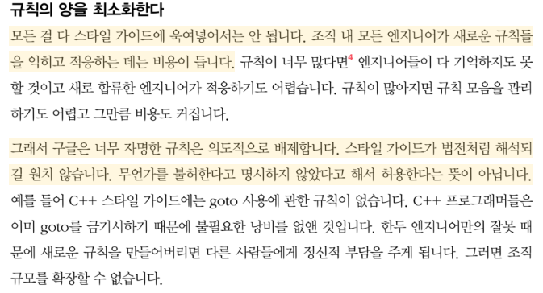

읽는 사람에게 맞춘다

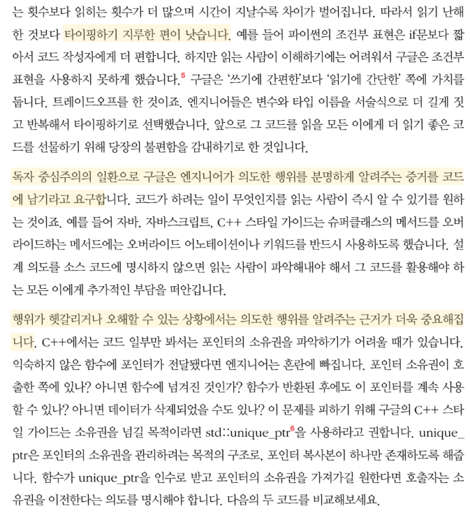

일관되어야 한다

일관성이 안겨주는 이점

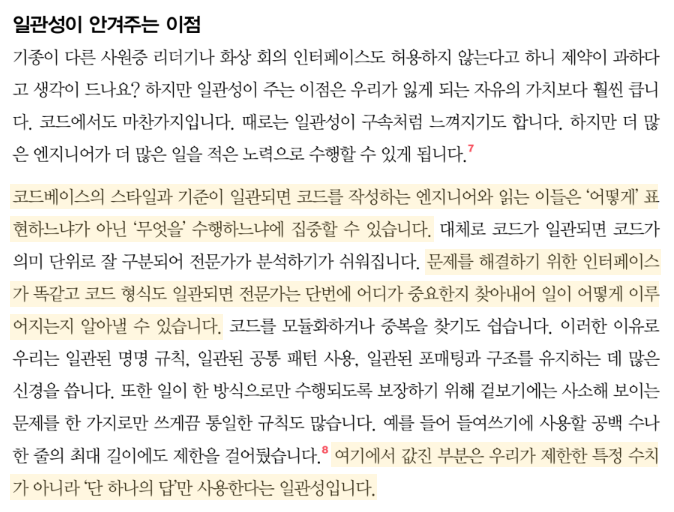

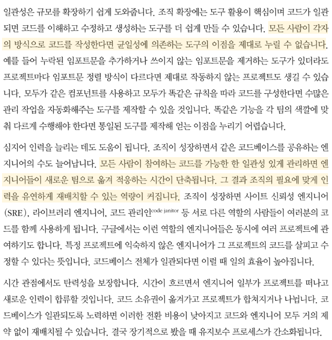

실용적 측면을 인정하자

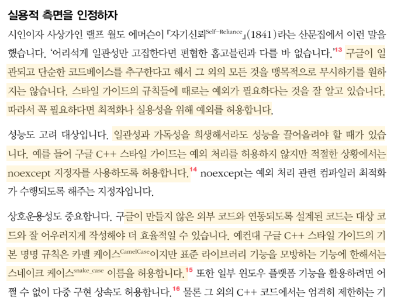

**규칙 변경하기**

코딩 컨벤션을 변경한 사례

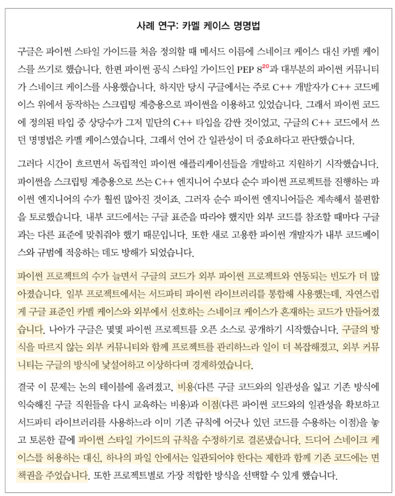

**규칙 적용하기**

- 엔지니어들이 규칙을 배우고 규칙에 맞는 코드를 작성하게 하려면 어느 정도의 훈련을 피할 수 없지만, 규칙이 실제로 지켜지는지를 확인하는 데는 사람보다는 되도록 자동화 도구를 활용합니다.
- 도구를 활용하여 규칙이 자동으로 반영되게 하면 시간이 흐르거나 조직이 커져도 몇몇 규칙이 실수로 누락되거나 잊혀지는 일을 방지할 수 있습니다.
- 오류 검사기 : 정적 분석 도구
- 코드 포맷터 : 코드의 형식을 일관되게 관리

### 코드 리뷰

**코드 리뷰 @구글**

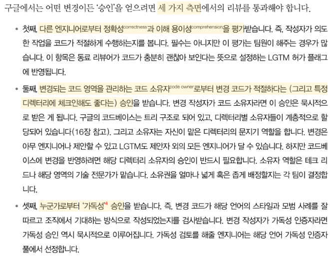

### 문서 자료

문서자료documentation란 엔지니어가 작업을 끝마치기 위해 작성해야 하는 모든 부수적인 텍스트를 의미합니다. 별도로 작성한 문서뿐 아니라 코드 주석까지 포함된다는 뜻입니다. (사실 구글에서 엔지니어가 작성하는 문서자료 대부분은 코드 주석입니다.)

**문서 자료가 필요한 이유**

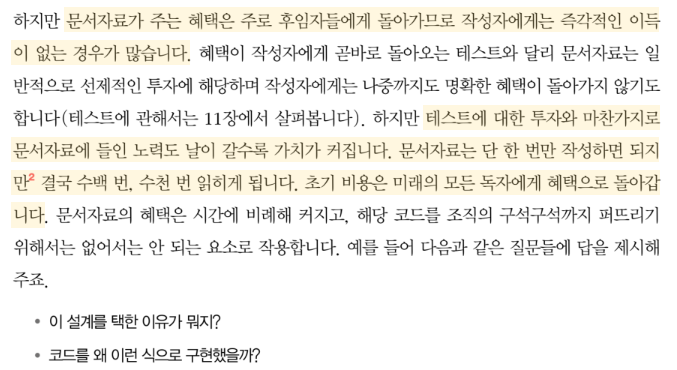

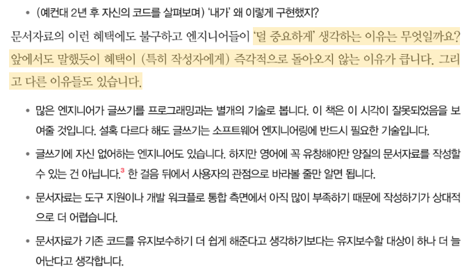

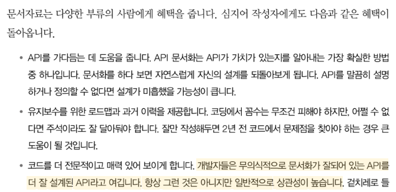

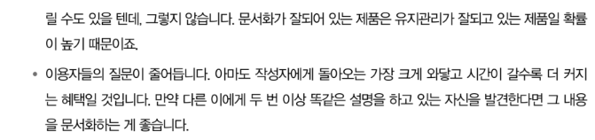

**문서자료는 코드와 같다**

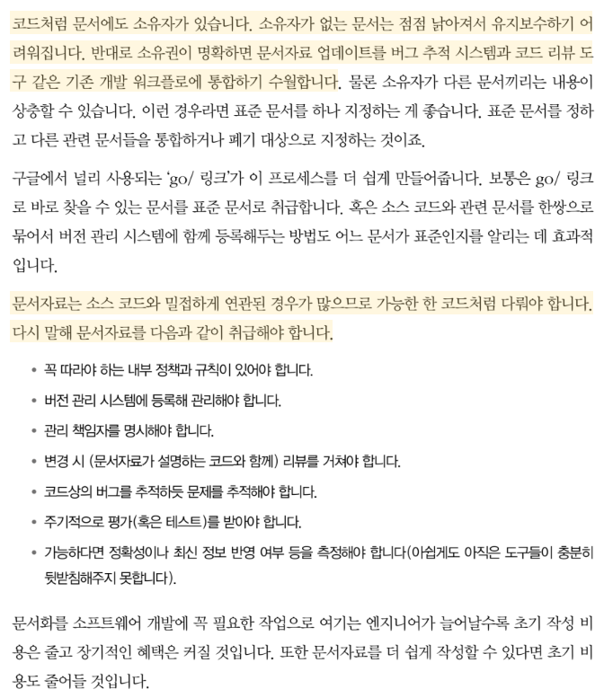

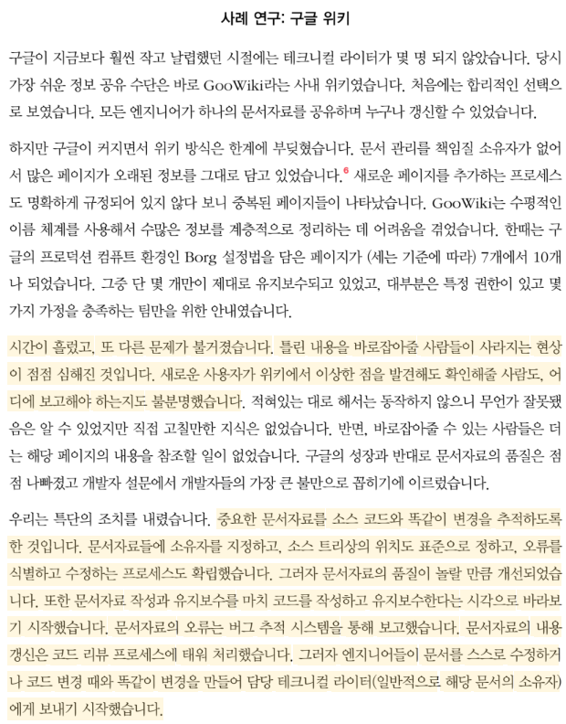

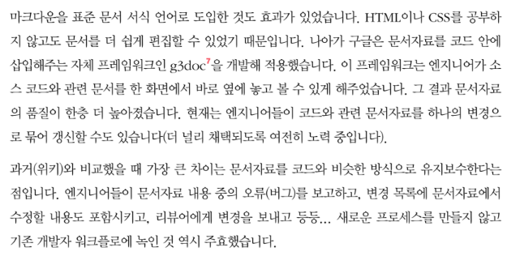

**독자 유형**

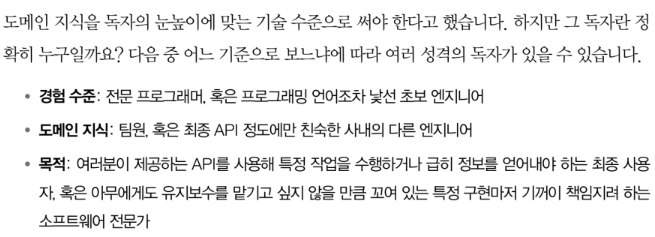

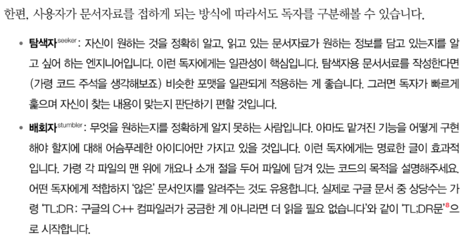

### 테스트 개요

**테스트를 작성하는 이유**

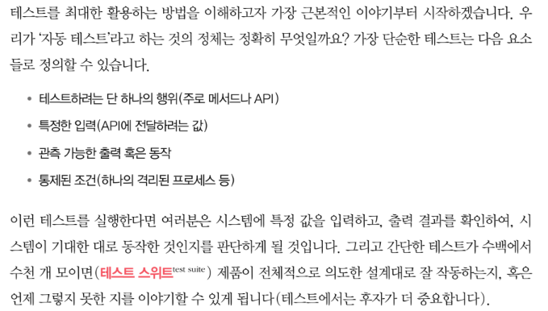

**구글의 테스트 역사**

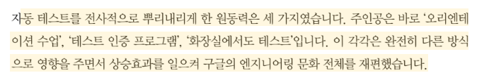

- 오리엔테이션 수업
- 
- 테스트 인증
- 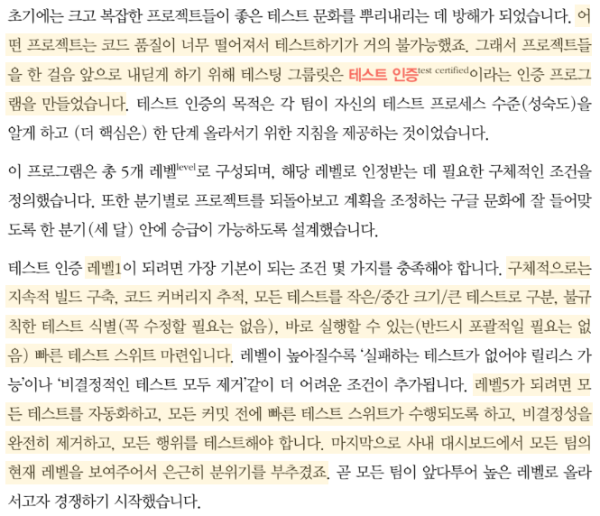
- 화장실에서도 테스트
- 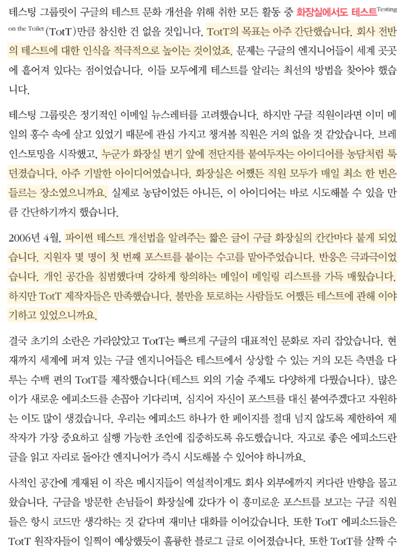

### 단위 테스트

테스트를 분류하는 두 가지 주요 축에서 '크기size'는 테스트가 소비하는 자원과 수행할 수 있는 작업을 뜻하며, '범위scope'는 테스트가 검증하고자 하는 코드의 양을 의미합니다. 테스트 크기의 정의는 명확하지만 범위는 다소 모호한 면이 잇습니다. 구글에서 말하는 단위 테스트unit test는 단일 클래스나 메서드처럼 범위가 상대적으로 좁은 테스트를 뜻합니다. 단위 테스트는 일반적으로 크긱가 작지만 반드시 그런 것은 아닙니다.

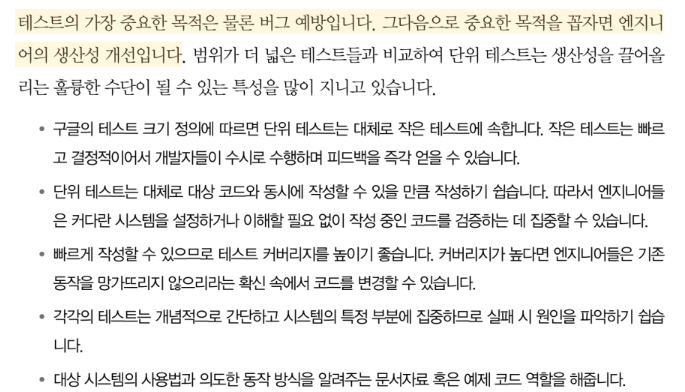

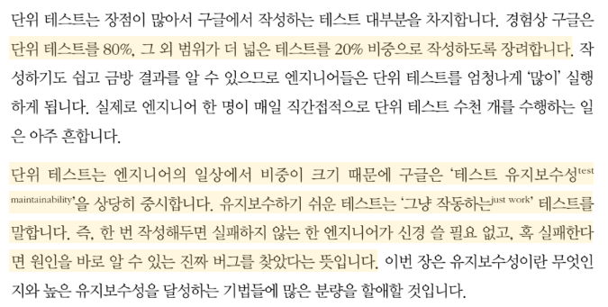

**유지보수가 쉬워야 한다**

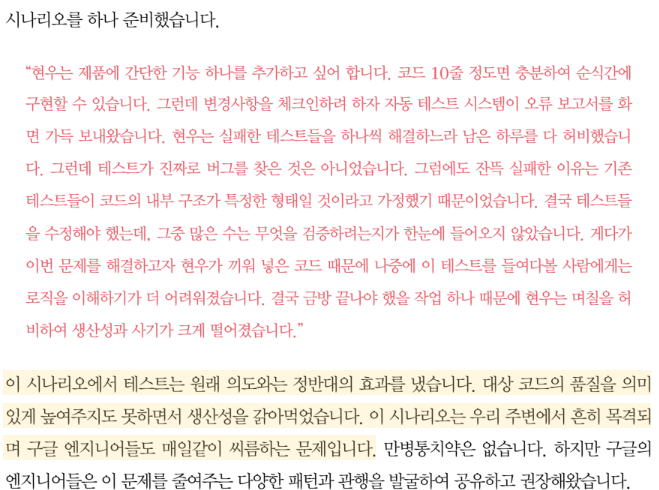

위에 시나리오에서 현우가 겪은 문제는 두 가지로 간추릴 수 있습니다. 첫째, 버그도 없고 자신의 검증 대상과 관련 없는 변경 때문에 실패하는 '깨지기 쉬운brittle' 테스트들이 도사리고 있었습니다. 둘째, 무엇이 잘못되어 실패했는지, 어떻게 고쳐야 하는지를 파악하기 어려운 '불명확한 unclear' 테스트들이었습니다. 애초에 무슨 기능을 어떻게 검사하려고 했는지조차 이해하기 쉽지 않았습니다.

**깨지기 쉬운 테스트 예방하기**

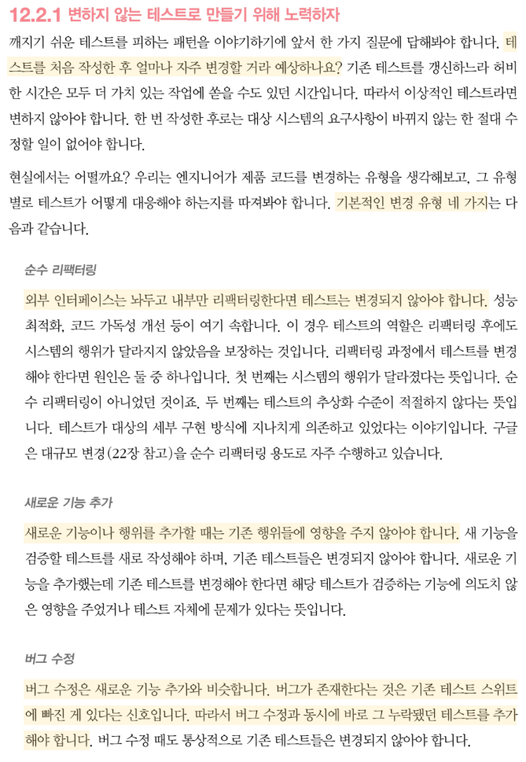

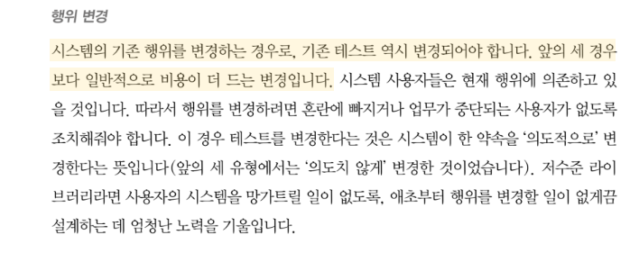

**상호작용이 아니라 상태를 테스트하자**

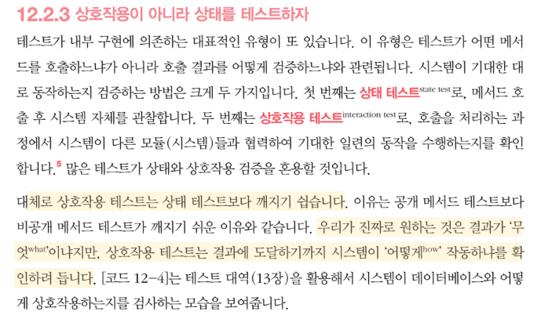

**메서드가 아니라 행위를 테스트하자**

메서드 하나의 전반을 검사하다 보면 자연스럽게 불명확한 테스트로 이어진다는 게 문제입니다. 메서드 하나가 몇 가지 일을 하는 경우도 종종 있으며 까다롭고 예외적인 상황도 포함할 수 있기 때문이죠. 다행히 더 나은 방법이 있습니다. 테스트를 메서드별로 작성하지 말고 행위별로 작성하는 방법입니다. 여기서 행위behavior란 특정 상태에서 특정한 일련의 입력을 받았을 때 시스템이 보장하는 '반응'을 뜻합니다.

- 테스트의 구조는 행위가 부각되도록 구성하자
- 테스트 이름은 검사하는 행위에 어울리게 짓자

**테스트와 코드 공유 DRY가 아니라 DAMP**

- DRY : 반복하지 말라 Don'y Repeat Yourself
- DAMP : 서술적이고 의미 있는 문구 Descriptive And Meaningful Phrase

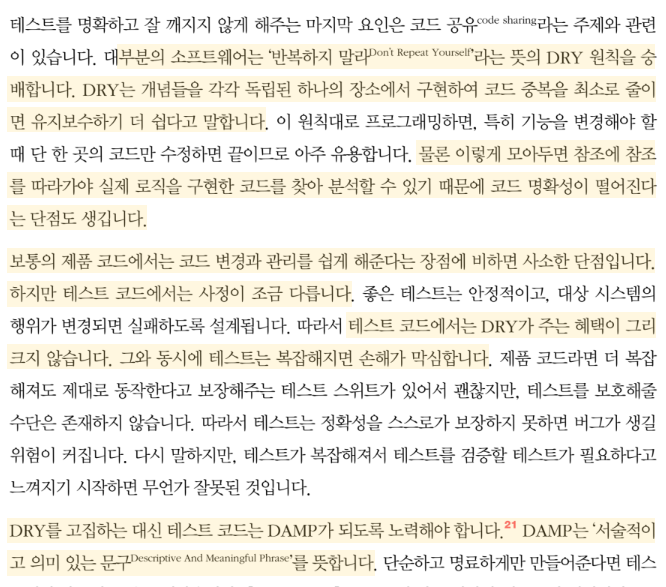

**테스트 인프라 정의하기**

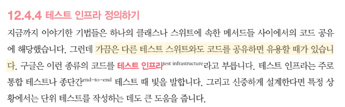

### 테스트 대역

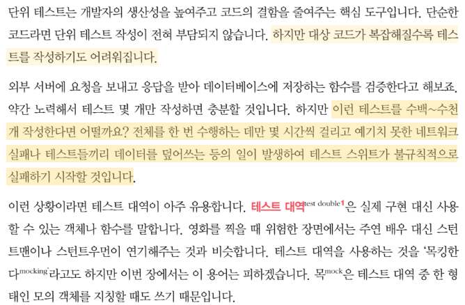

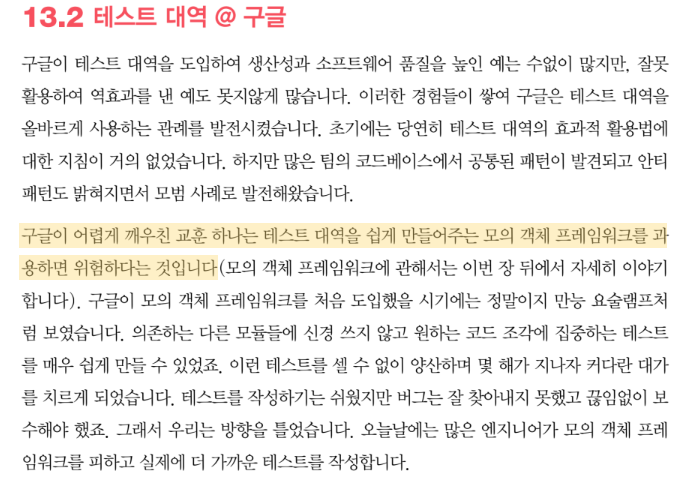

### 더 큰 테스트

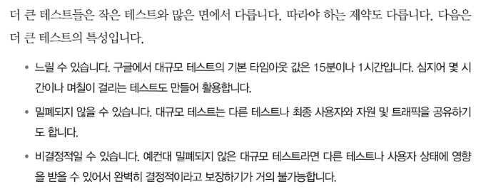

**충실성fidelity**

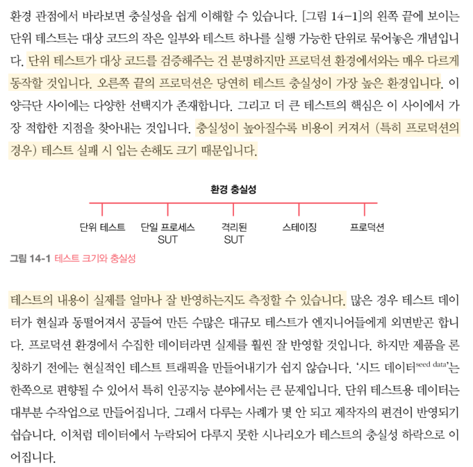

**단위 테스트가 손 대기 어려운 영역**

- 부정확한 테스트 대역
- 설정 문제
- 과부하 시 나타나는 문제
- 예기치 못한 동작, 입력, 부작용
- 창발적 행위와 '진공 효과'
  - 창발적 행위 : 전혀 예기치 않은 행동 양식이 갑자기 나타나는 것

### 폐기

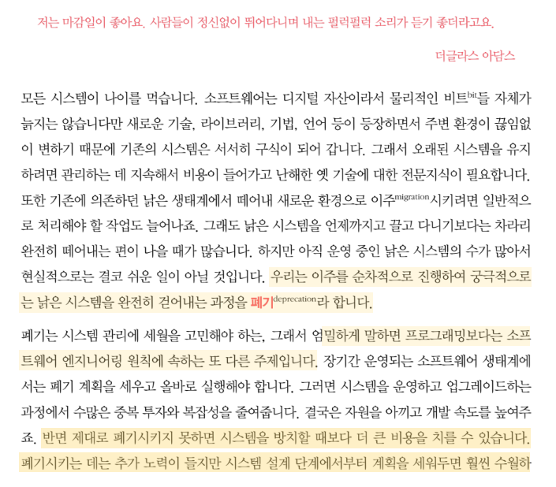

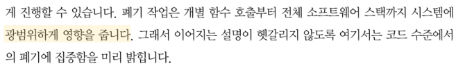

**폐기시키는 이유**

이번 논의는 '코드는 자산이 아니라 부채다'라는 기본 전제에서 시작합니다. 코드가 자산이라면 낡은 시스템의 비중을 줄이고 제거할 이유가 어디 있겠습니까? 코드에는 비용이 따라옵니다. 비용 일부는 시스템을 구축하는 과정에서 발생하지만, 사실 대부분은 구축 후 생이 끝날 때까지 유지보수하는 데서 발생합니다. 시스템을 운용하는 데 드는 운영 자원, 그리고 주변 생태계의 진화에 발맞춰 코드베이스를 업데이트하는 노력 등 비용이 계속 투입된다는 사실은 낡아가는 시스템을 계속 운영할지 아니면 슬슬 폐기시킬지를 놓고 손익을 저울질해봐야 함을 뜻합니다.

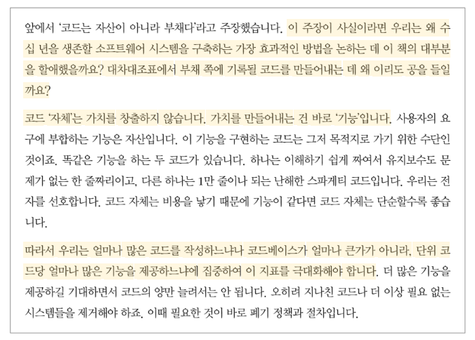