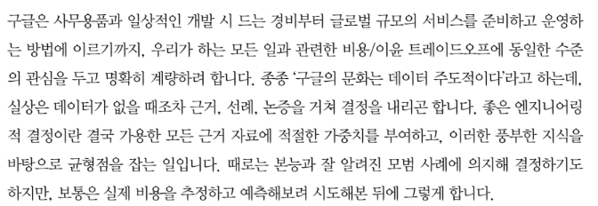
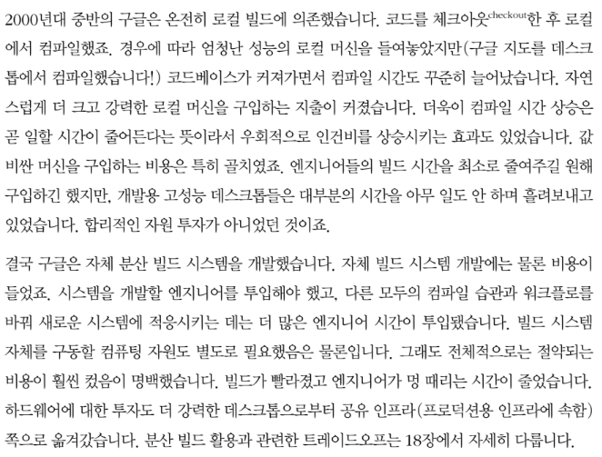

# 구글 엔지니어는 이렇게 일한다

# Part 1 전제

## 소프트웨어 엔지니어링이란?

프로그래밍과 소프트웨어 엔지니어링의 가장 큰 차이는 시간time, (규모) 확장scale, 실전에서의 트레이드 오프trade-offs at play 이렇게 세 가지라고 생각합니다. 소프트웨어 엔지니어링 프로젝트에서 엔지니어는 시간의 흐름과 언제가 변경change될 가능성에 더 신경 써야 합니다. 소프트웨어 엔지니어링 조직은 만들어낼 소프트웨어 자체뿐 아니라 제작하는 조직까지 양 측면 모두에서의 확장과 효율에 더 집중해야 합니다. 마지막으로 소프트웨어 엔지니어는 대체로 수명과 성장 속도를 정밀하게 예측하기 어려운 상황에서, 결과에 더 큰 영향을 주는 보다 복잡한 결정을 내려야 합니다.

구글에서는 이따금 '소프트웨어 엔지니어링은 흐르는 시간 위에서 순간순간의 프로그래밍을 모두 합산한 것이다software engineering is programming integrated over time' 라고 말하곤 합니다. 소프트웨어 엔지니어링에서 프로그래밍이 큰 비중을 차지하는 건 틀림없지만 프로그래밍은 결국 새로운 소프트웨어를 제작하는 수단입니다. 이 차이를 받아들인다면 자연스럽게 프로그래밍 작업 (개발development)과 소프트웨어 엔지니얼이 작업(개발development + 수정modification + 유지보수maintenance)의 차이도 궁금할 것입니다. 시간이라는 요소가 더해지면서 프로그래밍에는 중요한 차원이 하나 늘어서 더 입체적으로 바뀝니다. 정육면체는 정사각형이 아니고 거리는 속도가 아니듯, 소프트웨어 엔지니어링은 프로그래밍이 아닌 것이죠

**하이럼의 법칙Hyrum's Law**

다른 엔지니어들이 사용 중인 프로젝트를 유지보수하고 있다면 '동작한다'와 '유지보수 가능하다'를 구분 짓는 가장 중요한 요인은 바로 하이럼의 법칙일 것입니다.

- `API 사용자가 충분히 많다면 API 명세에 적힌 내용은 중요하지 않습니다. 시스템에서 눈에 보이는 모든 행위(동작)를 누군가는 이용하게 될 것이기 때문입니다.`

**원점 회귀(왼쪽으로 옮기기)**

왼쪽으로 옮기는 행위를 원점 회귀shift left 라 하는데, 보안성 점검을 개발 프로세스의 마지막으로 연기하면 안 된다고 호소하며 '보안을 고려하는 시점을 왼쪽으로 이동시켜라shift left on security'라고 한 말에서 유래한 듯 합니다. 제품을 고객에게 배포한 후에야 취약점이 발견되면 해결하는 데 막대한 비용이 들 것입니다. 다행히 프로덕션 배포 직전에 발견하면 문제를 식별하고 조치하는 데 여전히 큰 비용이 들겠지만 더 저렴할 게 분명합니다.

**트레이드 오프와 비용**

비용cost은 금액만을 지칭하는 게 아닙니다. 투입된 노력과 다음의 요소들까지 모두 포괄합니다.

결국 엔지니어링 조직의 선택을 결정짓는 요인은 다음의 몇 가지로 압축됩니다.

- 반드시 해야 하는 일(법적 요구사항, 고객 요구사항)
- 근거에 기반하여 당시 내릴 수 있는 최선의 선택(적절한 결정권자가 확정)

의사결정이 '내가 시켰으니까'가 되어서는 안 됩니다.

 

로컬 빌드 사례

# Part 2 문화

## 팀워크 이끌어내기

피드백 루프

**비난 없는 포스트모템 문화**

실패한 근본 원인을 분석하여 문서로 남기는 것이 실수로부터 배우는 핵심입니다. 이를 구글은 (그리고 다른 많은 회사에서도) 포스트모템postmortem 이라고 합니다. 포스트모템 문서가 쓸모 없는 사죄, 변명, 지적으로 채워지지 않도록 각별히 주의하세요. 제대로 된 포스트모템에는 무엇을 배웠는지와 배운 것을 토대로 앞으로 무엇을 바꿀지가 담겨야 합니다. 그런 다음 포스트모템을 쉽게 열람할 수 있고 포스트모템에서 제안한 변화를 팀이 실천하는지 확인해야 합니다.

훌륭한 포스트모템에는 다음 내용이 담겨야 합니다.

- 사건의 개요
- 사건을 인지하고 해결에 이르기까지의 타임라인
- 사건의 근본 원인
- 영향과 피해 평가
- 문제를 즉시 해결하기 위한 조치 항목(소유자 명시)
- 재발 방지를 위한 조치 항목
- 해당 경험에서 얻은 교훈

## 지식 공유

### 배움을 가로막는 장애물

- 정보 섬(Information islands) : 조직의 각 부서가 서로 소통하거나 자원을 공유하지 않아서 지식이 피편화됩니다.
- 단일 장애점(single point of failure, SPOF) : 중요한 정보를 한 사람이 독점하면 병목이 생깁니다.
- 전부 아니면 전무 전분성(all-or-nothing expertise) : 조직 구성원이 '모든 것을 아는' 사람과 '아무것도 모르는' 초심자로 나뉩니다. 중간층은 거의 사라지죠. 한번 이렇게 되면 전분가들은 항상 모든 일을 자신들이 처리하게 됩니다. 새로운 전문가를 키우기 위한 멘토링이나 문서화에 신경 쓸 여력이 줄어들어 문제가 눈덩이처럼 커집니다.
- 앵무새처럼 흉내내기(parroting) : 이해하지 못한 상태로 흉내만 내는 것을 말합니다.
- 유령의 묘지(haunted graveyard) : 무언가 잘못될 게 두려워서 아무도 손대지 않는 영역(주로 코드)을 말합니다. 유령의 묘지는 두려움과 비합리적인 의심 때문에 사람들이 손대기를 기피하는 영역입니다.