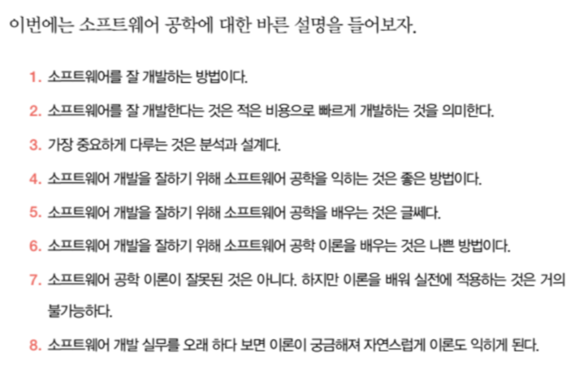
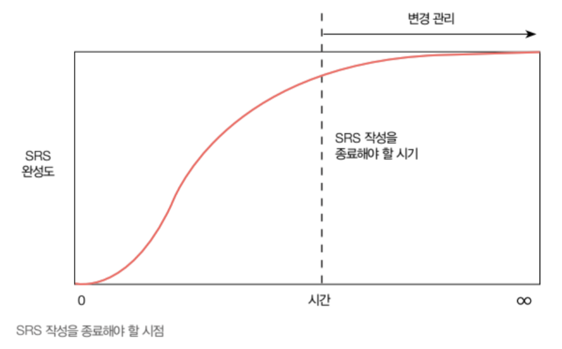
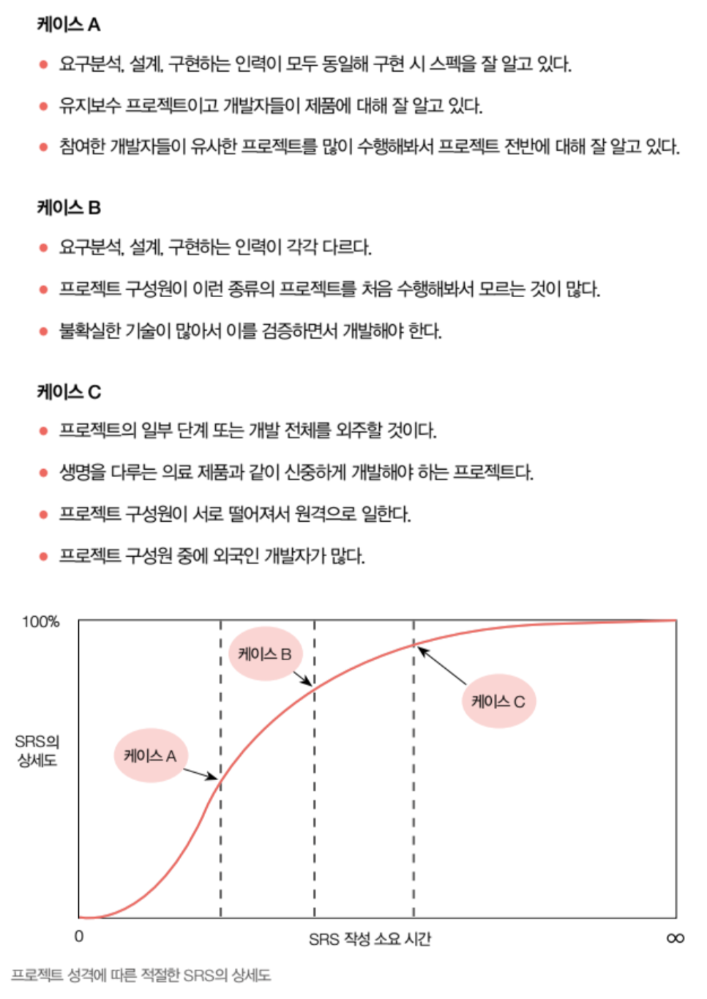

# 소프트웨어 설계의 모든 것

- 김익환, 전규현 지음

**책을 읽기 전에**

책에서 사용하는 용어 정리

문서

- **MRD(Marget Requirements Document), MRS(Market Requirements Specification)** 제품 기획서. 마케팅팀에서 작성하며 SRS 작성에 필요한 내용이 담긴 문서다.
- **PRD(Product Requirements Documents)** 회사에 따라 MRD 와 같은 의미로 사용되기도 하지만 market보다는 product 를 우선시하는 문서다. MRD와 마찬가지로 마케팅팀에서 작성하며 개발팀에서는 MRD와 구별할 필요가 없다.
- **SOW(Statement Of Work)** 개발이 아닌 프로젝트 매니지먼트의 입장에서 본 프로젝트 작업 요구사항을 설명한다. SOW의 작성 목적상 SRS 상위 제목에서 일부 겹칠 수 있으나 완전히 다른 용도로 작성하는 문서다.
- **SRS(Software Requirements Specification)** 소프트웨어 스펙 문서다. 'specification'또는 '스펙'이라고 짧게 부르기도 한다. 기능 명세서, feature list, 시방서 등과는 의미가 다르다. SRS 또는 스펙이라는 용어는 글로벌 소프트웨어 업계에서 널리 통용되는 표준 용어다.
- **SDS(Software Design Specification)** 소프트웨어 설계 문서다. 표준 문서가 있는 것은 아니라서 회사마다 문서 형식과 이름이 다르다. 자유도가 상당히 높은 문서다.
- **IRS(Interface Requirement Specification)** SRS의 일부이기도 하며 인터페이스만 별도로 작성한 문서를 말한다. 여러 시스템에 걸친 인터페이스를 별도로 작성해 여러 프로젝트에서 참조하기도 한다.

사람 또는 팀

- **제품 기획자, 기획자, 마케터** 소프트웨어를 기획하는 사람을 이른다. 기획 산출물인 '제품 기획서', 'MRD', 'MRS' 와 같은 문서를 만들어낸다. 종종 제품을 흥보하는 사람을 마케터라고 하지만 여기서는 마케터를 제품 기획자와 동일한 의미로 사용한다.
- **아키텍트** 여러 종류의 아키텍트를 총칭하는 말이다. 한 사람이 여러 아키텍트 역할을 겸하는 경우가 많다.
- **분석 아키텍트** 소프트웨어 스펙을 작성하는 사람을 말한다.
- **기술 아키텍트** 특정 소프트웨어 전문가를 말한다.
- **설계 아키텍트** 소프트웨어 아키텍처를 설계하는 사람을 말하다.
- **개발자, 소프트웨어 엔지니어** 소프트웨어를 개발하는 사람을 일컫는 광범위한 개념으로 사용된다. QA 엔지니어, 아키텍트를 포함한 말이기도 하다.
- **프로그래머** 주어진 스펙대로 소프트웨어를 구현하는 사람을 말하는, 약간 좁은 의미의 개발자다.
- **QA팀** 소프트웨어 개발 전반에 걸쳐 소프트웨어 품질을 보증하는 일을 하는 팀을 말한다. 
- **테스터** 소프트웨어가 스펙대로 개발됐는지 검증하는 일을 하는 사람을 말한다.
- **테스트 리더** 소프트웨어 테스트 계획을 세우고 테스트 설계를 하는 사람을 말한다. 또한 테스트 진행을 주도하고 관리한다.

행위

- **분석** SRS. 즉 소프트웨어 스펙을 작성하는 행위를 말한다.
- **설계** 소프트웨어 아키텍처를 설계하는 행위를 말한다. SDS 문서를 만들기도 하지만 산출물은 프로젝트에 따라 다르다.
- **상위 설계** 기본 설계를 말한다. 전체 시스템 구조를 규명하고 상위 컴포넌트를 식별하며 인터페이스를 정의한다.
- **하위 설계** 상세 설계를 말한다. 프로젝트마다 상세화 정도가 다르며 시스템을 점차 상세화해 추상화 수준을 낮춘다.

## 1부 : 소프트웨어 스펙이란?

### 소프트웨어 스펙의 개요

프로젝트 실패의 판단 기준은 제각각 다르지만 다음의 경우 프로젝트가 실패했다고 할 수 있다.

- 약속된 일정 내 제품 또는 서비스를 출시하지 못했다.
- 소프트웨어가 요구하는 품질(기능 요구사항, 성능, 안정성, 사용성, 확장성 등)을 충족하지 못했다.
- 프로젝트에 꼭 필요한 기술 개발에 실패했다.
- 아키텍처가 뒤죽박죽이 되어서 유지보수가 어려워졌다.
- 애초 예산보다 훨씬 더 많은 비용이 지출됐다.
- 연이은 야근으로 조직 사기가 떨어지고 많은 사람이 그만뒀다.

프로젝트가 실패하는 다양한 원인을 살펴보자.

- 고객의 요구사항을 충분히 파악하지 못했다.
- 초기에 제품의 방향을 빨리 정하지 못하고 우왕좌왕하며 보낸 시간이 많아서 정작 개발 시간이 부족했다.
- 스펙과 설계를 꼼꼼하게 작성하지 않고 코딩을 시작해서 엉뚱한 방향으로 개발했다.
- 작성된 스펙을 프로젝트 이해관계자들이 철저히 검토하지 않아서 잘못된 스펙으로 개발했다.
- 진행할수록 새로운 요구사항이 계속 생겨서 프로젝트가 한없이 늘어졌다.
- 변경된 요구사항을 일관되게 관리하지 못해서 프로젝트 팀원들이 서로 다른 기준으로 개발 했다.
- 상명하달된 출시 일정에 맞추기 위해 급하게 코딩부터 시작했다. 나중에 잘못된 코드를 재작성하느라 시간이 더 많이 소비됐다.
- 훈련이 덜 된 개발자들을 투입해서 초반에 갈팡질팡하느라 시간이 지체했다.
- 느슨한 일정 관리로 프로젝트가 지연되고 있다는 징후를 알아차리지 못했다.
- 리스크 관리를 하지 않아서 프로젝트에 큰 문제가 발생해 실패했다.
- 프로젝트 막판에 경영진이나 주요 고객이 프로젝트 방향을 완전히 틀어서 처음부터 다시 개발해야 했다.
- 지속적인 팀워크 불화로 프로젝트가 산으로 갔다.
- 외부에서 도입한 필수 기술이 기대처럼 동작하지 않는다는 사실을 막바지에 알게 됐다.
- 테스트팀에 스펙을 제대로 전달하지 못해서 테스트 준비를 충분히 하지 못했다.
- 회사의 표준 프로세스를 강요해 문서를 많이 만들다 보니 정작 개발에는 소홀해졌다.

실패 원인은 끝도 없이 많은데 이를 크게 나누면 스펙, 팀, 관리, 고객, 기술 등으로 분류할 수 있다. 글쓴이가 이중에서 가장 중요하게 생각하는 것은 '스펙'이다. 프로젝트의 가장 많은 실패 원인이 스펙과 관계되며 소프트웨어 버그의 절반 이상이 부실하거나 잘못 작성된 스펙 때문에 발생한다고 알려졌다.

프로젝트 규모가 작을 경우, 스펙을 제대로 적지 않고 요구사항 몇 줄로 개발해도 무난히 완성하곤 한다. 경험이 많은 몇몇 개발자가 주도하는 경우, 요구사항을 대충 알려줘도 잘 알아듣고 개발을 잘하기도 한다. 하지만 수십 명의 개발자가 투입되는 대규모 프로젝트에서는 체계적으로 정리된 스펙 문서가 반드시 필요하다. 외국에 외주를 줄 경우, 상세하게 적힌 스펙 문서와 인수 테스트 계획은 필수다.

요구사항이 누락되거나 어설프게 분석된 스펙도 문제지만 너무 상세하게 적거나 스펙 문서가 방대해지는 것도 문제다. 대규모 방법론을 따르는 회사에서는 종종 이런 함정에 빠진다. 소규모 프로젝트의 성공 경험을 대규모 프로젝트에 적용해서 실패하기도 하고, 반대로 중소규모 프로젝트에 대규모 방법론을 적용하는 것이 프로젝트 실패의 원인이 되기도 한다. 개발은 문서대로 진행되지 않을 뿐만 아니라, 문서가 너무 많아서 수시로 바뀌는 요구사항을 전부 문서에 반영하지도 못한다. 따라서 엄격한 프로세스로 규제하는 것도 어렵다. 자율에 맡겨도 쉽지 않다.

글쓴이가 생각하는 최선의 방법은 '원칙만 지킬 수 있는 최소한의 프로세스 환경에서 좋은 문화를 공유'하는 것이다. 빨리빨리 문화를 지양하고 적절한 분석과 설계를 거쳐 프로젝트를 진행하는 것이 지름길이라는 인식을 공유해야 한다.

**스펙에 대한 오해들**

- 폭포수 모델과 달리 우리는 애자일이라 잘 적을 필요가 없다. : 스펙 작성은 폭포수 모델에서나 하는 것이라는 생각은 오해다. 스펙 작성이 어렵다는 소문을 듣고 애자일agile을 선택하는 회사도 있다. 이 또한 애자일을 적용하면 어렵게 스펙을 작성하지 않아도 된다는 잘못된 생각에서 비롯된 것이다. 실무에서 폭포수 모델을 사용하는 소프트웨어 회사는 거의 없다. 방법론과 상관없이 소프트웨어 스펙은 중요하다. 애자일이라 하더라도 스펙 내용은 바뀌지 않는다. 적는 방법이 달라질 뿐이다.

**스펙의 역할**

**스펙을 제대로 작성하지 않으면**

스펙을 작성할 때 요구사항을 바꾸면 '1'이라는 비용이 들지만, 고객에게 전달된 다음에 바꾸면 수백 배의 비용이 들어간다. 요구사항이든 설계든 한 단계 뒤에서 고칠 경우 2~5배의 비용이 들어가서 단계를 거치고 시간이 흐를수록 수정 비용은 기하급수적으로 증가한다. 따라서 개발의 사전 단계인 기획과 분석, 설계가 적절하게 잘돼야 한다. 만의 하나 한창 개발하는 중에 기획이나 요구사항이 바뀌면 치러야 할 대가가 막대하다는 사실을 명심해야 한다.

### SRS

**SRS란 무엇인가**

소프트웨어 요구사항을 분석하고 이를 정리해 작성하는 스펙 문서는 셀 수 없을 만큼 다양하다. 개발 방법론에 따라 제시하는 문서 종류가 다르고 그 개수도 천차만별이다. 그중에서 이 책에서 주로 다룰 문서는 SRS (Software Requirements Specification)다. SRS는 specification혹은 spec(스펙)이라고도 한다. IEEE830에 SRS 문서를 작성하는 가이드가 정의되어 있고 DoD(미국 국방부) 표준 문서다.

**어떻게 소프트웨어를 빠르게 개발할 것인가**

소프트웨어를 빠르게 개발하기 위해 고려해야 할 것은 많지만, 여기서는 스펙을 중심으로 살펴본다.

이렇게 소프트웨어를 동시에 개발해 프로젝트 기간을 단축하려면 사전 단계인 분석, 설계가 정교하게 되어야 한다. 특히 컴포넌트를 잘 나누고 인터페이스를 견고하게 정의해야 한다. 인터페이스는 간결하게 정의해서 모듈 간의 연동을 쉽게 하고 확고하게 정해서 함부로 바꾸지 않도록 한다. 물론 한번 정의한 인터페이스가 프로젝트 종료 시까지 변경되지 않는다면 가장 바람직하겠지만, 쉽지 않다. 개발 도중에 인터페이스를 변경하면 처음에 잘 정의한 경우보다 수십 배의 비용이 더 들어간다. 따라서 분석, 설계 시 최대한 세심한 노력을 기울여 인터페이스가 변경되지 않도록 정의해야 한다.

프로젝트 규모가 크고 참여 인원이 많을 수록 순차적 개발보다 병렬 개발이 더 효과적이다. 수십 명의 개발자가 참여하는 프로젝트라면 순차적 개발은 거의 불가능하다. 이들 개발자가 처음부터 잘 통합된 소스코드를 기반으로 병렬로 개발해야 프로젝트를 빨리 끝낼 수 있다.

인터페이스는 상호간의 약속이다. 클라이언트와 서버 모듈을 병렬 개발할 때 인터페이스는 클라이언트 개발팀과 서버 개발팀 간의 약속이다. 인터페이스를 확정하면 서로 약속한 것이니, 헤어져서 따로 개발해도 문제가 없을 정도로 신뢰도가 높아야 한다.

프로젝트 기간 내내 인터페이스를 잘 유지하기 위해서는 지속적인 통합이 필요하며 이를 위해서는 유닛 테스트, 테스트 자동화가 유용하다. 개발자는 자신이 작성한 모듈을 완성한 후에 소스코드 관리 시스템에 등록하는 것이 아니라 좀 더 잦은 주기로 등록해서 프로젝트 주기 내내 소스코드가 정상적으로 빌드되도록 유지해야 한다. 너무 늦게 통합할 경우 많은 문제를 일으키는 '통합의 지옥'을 맛보게 된다.

지속적인 통합을 위해 반드시 필요한 것은 주기적인 빌드다. 빌드 온 커밋build on commit을 하기도 하고 데일리 빌드daily build를 하기도 한다. 프로젝트 기간 내내 데일리 빌드는 실패가 없어야 한다. 데일리 빌드가 실패했다면 인터페이스가 깨졌거나 어떤 개발자가 깨진 소스코드를 올렸을 수 있다. 빌드가 깨지면 여러 개발자들이 개발에 차질을 빚게 된다. 

**스펙 문서의 유형**

- 이슈 관리시스템의 한 줄 또는 몇 줄의 설명
- 엔지니어링 one-pager
- 수십 페이지의 SRS
- 수백, 수천 페이지의 거대 방법론 스펙 문서
  - 거대 방법론에서는 문서를 수십 개 이상 작성하기도 한다. 이런 방법론에서는 스펙을 문서 하나로 정리하는 것이 아니라 여러 개 문서에 분산해 작성한다.

**요구사항과 스펙의 차이**

스펙에 대해 얘기할 때 종종 혼동하는 것이 요구사항이다. 영어로는 각각 specification과 requirement(s)다. 

- '요구사항'이란 말은 소프트웨어 업계 안팎에서 일반적 의미, 즉 고객이나 이해관계자가 요구하는 것으로 통용된다. 하지만 소프트웨어 '스펙'은 쓰는 사람에 따라 의미가 조금씩 다르다. 그래서 수많은 회사에서 또 여러 개발자들이 생각하는 의미에 미묘한 차이가 있을 수밖에 없다.
- 하지만 소프트웨어 '스펙'이라고 하면 머릿속에 그려지는 모습이 있다. 그리고 그 모습은 전 세계 개발자들이 공통으로 생각하는 것이다. 적어도 이런 내용이 포함됐고 이런 절차를 통해 만들었으리라는 생각이 자동으로 떠오르는 것이다.
- 그래서 요구사항은 한 줄이나 몇 줄에 불과하지만 그 요구사항을 잘 분석해서 스펙을 작성하면 몇 페이지 또는 수십, 수백 페이지 문서가 될 수도 있다. 그러니 스펙을 제대로 작성하지 않고 요구사항만 가지고 프로젝트를 시작하면 큰 재앙이 닥칠 수 있다. 특히 외주 프로젝트라면 그 재앙은 회사의 존속을 위태롭게 한다.

**스펙인 것과 스펙이 아닌 것**

**스펙과 프로젝트 일정의 관계**

위 그림을 보면 초기에는 50 ~ 200% 범위로 부정확한 일정을 얘기할 수밖에 없고 이를 듣는 사람도 부정확한 일정이라는 것을 염두에 둬야 한다. 그렇지 않으면 초기에 제시한 부정확한 일정에 발목이 잡혀 무리하게 프로젝트를 진행하다가 일을 망치고 사기도 저하된다. 그 후에는 일정 제시에 소극적이고 방어적이게 되어 유기적 협업 체제가 깨지고 만다.

다음 그림은 상향식으로 WBS를 통해 일정을 예측하고 프로젝트 기간 내내 일정 변동을 나타낸 그래프다. X 축은 날짜, Y축은 MD Man X Day(개발자의 하루치 일)이다.

리스크를 고려하지 않고 낙관적으로 예측한 일정으로 프로젝트를 진행하면 일정을 지키기가 어렵다. 리스크를 고려한 좀 더 정확한 프로젝트 일정을 예측하기 위해서는 꾸준히 리스크를 재평가하고 철저히 관리해야 한다. 리스크는 프로젝트 진행에 따라 계속 바뀌며 발생 확률도 변한다. 이런 요소들을 지속적으로 검토하고 일정에 반영해야 정확한 일정을 수시로 업데이트하고, 문제를 조기 발견해 대처하며 결국 프로젝트 일정을 준수할 확률이 높아진다.

**스펙과 설계의 구분**

스펙은 무엇을 만드느냐. 즉 'What'에 대한 것이고, 설계는 어떻게 만드느냐, 즉 'How'에 대한 것이라고 한다. 얼핏 들으면 반은 맞는 말이지만, 실효가 없는 말이다. 스펙과 설계의 경계는 생각보다 뚜렷하지 않다.

### 3장 : 스펙 작성의 현주소, 현실과 관행

**소프트웨어 공학, 약인가? 독인가?**

소프트웨어 공학은 소프트웨어를 최소의 비용으로 최단 기간에 개발하는 방법을 모아놓은 것이다.

### 5장 : 기업 문화

**사수/부사수 시스템 탈피 방법**

우리나라 회사에서 신참을 교육하는 가장 흔한 방법은 '사수/부사수 시스템'이다. '사수'란 본래 군에서 쓰는 말이다. M60 기관총 따위의 중화기는 보통 두 명 이상이 작동해야 해서 사수와 부사수가 같이 장비를 다룬다. 영화 속 람보는 M60 기관총을 혼자서 양손에 하나씩 들고 쐈지만, 보통은 두 명이 협조해 사격하는 무기다. 이런 사수/부사수 시스템에서 사수는 주 업무를 맡고 부사수가 업무를 보조하며 익힌다. 1, 2년 후에는 부사수가 사수가 되어 또다시 부사수를 교육한다.

소프트웨어 회사에서 사수/부사수 시스템은 장점에 비해 단점이 많아서 여러 문제를 일으킨다.

- 사수, 즉 고참이 신참 교육에 너무 많은 시간을 소비한다. 신참 교육은 회사 입장에서 투자이기도 하지만 큰 비용이다. 따라서 고참이 오랜 기간 지속적으로 빼앗기는 시간만큼 회사는 비용을 치르게 된다.
- 오랜 교육으로 부사수의 현장 투입이 늦어진다. 회사마다 개인마다 다르지만 부사수의 현장 투입에는 짧게는 몇 주부터 길게는 몇 달이 걸린다. 부사수는 교육과 훈련을 일정량 받기 전까지는 한 사람 몫의 30 ~ 50%를 감당할 뿐이다. 게다가 사수가 일하는 시간을 많이 빼앗아 근로 인력이 오히려 마이너스가 되기도 한다. 즉, 부사수가 없을 때보다 개발 기간이 더 지연되기도 한다.
- 신참이 들어올 때마다 매번 반복해서 가르쳐야 한다. 부사수가 다시 사수가 되어 신참을 가르치려면 상당한 시간이 걸리기 때문에 여전히 고참이 교육을 맡아야 한다. 설상가상으로 시간차를 두고 5명의 개발자가 입사하면 교육 시간이 5배 들어간다.
- 사수도 많은 정보를 잊어버려 제대로 교육하기가 쉽지 않다. 사수는 핵심 개발과 교육을 병행하느라 바빠서 개발 문서를 작성할 시간도 없다. 그래서 악순환이 반복된다. 아무리 신참을 가르쳐도 결국 문제 해결 요청이 몰려서 고참은 여전히 바쁘다.
- 부사수는 사수의 시간을 빼앗는 것이 미안해서 자주 묻지 않게 된다. 뻔뻔한 부사수라도 사수가 눈코 뜰 새 없이 바쁘게 일하는 모습을 매일같이 보면 사수에게 묻지 않고 혼자 알아서 해보려 한다. 그러다 일을 그르쳐 문제를 키우고 나중에는 사수의 시간을 더 많이 빼앗게 된다.
- 경영자는 그동안 문서가 없었던 탓이라 생각하고 기존 소프트웨어의 문서를 뒤늦게 만들라고 지시한다. 그런데 이미 개발이 완료된 시스템의 문서를 나중에 만드는 것은 헛수고다. 개발 후 만드는 문서에 필요한 정보의 10%나 제대로 적을 수 있을지 의문이다. 또한 제대로 분석, 설계를 거치지 않고 이미 만들어진 소프트웨어는 시간이 아무리 많아도 문서로 정리하기 어려운 구조로 되어 있는 경우가 많다. 그래서 악순환이 계속되고 사수/부사수 시스템에서 영영 벗어나지 못하게 된다.

사수/부사수 시스템을 운용하는 회사에서 신참에게 정보를 전달하는 방식이 아래에 기준으로 2:8, 1:9 가 되는데 이는 굉장히 위험하다.

> 문서/시스템 : 직접 교육 / 코칭

즉, 문서나 시스템을 통해서는 10 ~ 20 % 정도의 정보밖에 전달하지 못하고 나머지는 사수가 직접 가르쳐야 한다. 이상적인 비율은 반대가 되어야 한다. 즉, 8:2가 바람직하다. 대부분의 정보는 문서나 시스템을 통해 얻어야 하고, 문서를 봐도 잘 모르는 정보는 멘토나 고참에게 물어보는 것이 좋다. 이것을 10:0 또는 9:1로 만드는 것은 거의 불가능하고 오히려 더 비효율적이다. 8:2 정도만 되면 앞에서 언급한 문제점이 거의 해결된다. 고참 개발자의 시간을 과하게 빼앗지 않게 되고, 신참이 아무리 못해도 마이너스 인력이 되지는 않는다. 스스로 공부할 수 있으니 노력 여하에 따라 얼마든 빨리 배울 수 있다. 또한 입사 후 실전 개발에 투입되는 시기도 훨씬 앞당긴다.

### 6장 : 프로세스

**스펙은 얼마나 자세히 적어야 하는가**

스펙을 완벽하게 적는 것은 불가능하다. 그럼 스펙은 언제 끝내야 할까? 사용자가 요구사항을 더 생각해내지 못하거나 이전 리뷰 시간에 했던 얘기를 반복하면 끝낼 때가 된 것이다. 또 프로젝트 목표나 범위에서 벗어난 새로운 기능을 요구하거나 우선순위가 낮은 기능을 자꾸 제안할 때도 SRS 작성을 종료할 때가 된 것이다. 그때부터 제안하는 기능은 가능하면 다음 버전으로 연기하고 SRS를 마무리하는 것이 좋다.

- 물론 프로젝트 성격에 따라 상세히 작성해야 하기도 하고 대강 작성해야 하는 것이 더 효율적일 때가 있다.

**스펙 리뷰**

스펙은 리뷰로 완성된다. 스펙을 작성하는 도중에도 여러 이해관계자와 논의하고 스펙의 일부 내용을 검토하지만 무엇보다 최종본에 대한 리뷰는 스펙의 완성도에 있어서 필수다. 최종본에서는 중간에서 검토한 내용이 바뀌어 있을 수 있다. 최종본에 대한 모든 이해관계자의 최종 리뷰가 끝나야만 스펙은 확정 가능하다.

웬만한 프로젝트 스펙 문서는 수백 페이지에 이른다. 그래서 철저히 리뷰하는 것이 쉽지는 않다. 그렇다고 리뷰를 대충 진행하면 안 된다. 그럼 스펙 리뷰는 어떻게 해야 할까?

- 누구와 해야 하는가 : 리뷰는 프로젝트 이해관계자 모두와 한다. 경영자 또는 고객도 리뷰를 해야 하는 경우가 있다.
- 몇 번이 적당한가 : 점진적으로 개발하는 프로젝트는 예외지만 리뷰는 한 번 하는 것이 원칙이다. 분석 아키텍트는 완벽하다고 생각하는 스펙 문서를 작성해서 한 번의 리뷰를 통해 최종본으로 확정하는 것이 가장 좋다. 스펙을 대충 작성해 리뷰하고 다시 추가로 작성해 리뷰를 반복하면 많은 시간이 소모될 뿐만 아니라 리뷰를 거듭할수록 집중도가 떨어진다. 수백 페이지나 되는 스펙 문서를 완벽하게 집중해 리뷰하려면 딱 한 번의 기회뿐임을 명심하는 것이 좋다.
- 리뷰를 원활하게 하는 방법은 무엇인가 : 요구사항에 대해 개인의 관점이나 선호를 주장하는 사람들이 종종 있다. 이러한 사람이 자기 주장을 완강하게 고집하면 리뷰가 원활하게 진행되지 않는다. 리뷰하는 사람은 개인적인 선호가 아니라 전문가적 입장에서 요구사항에 오류가 없는지, 누락된 것이 없는지 찾아야 한다.

**코드 리뷰보다는 설계 리뷰, 설계 리뷰보다는 스펙 리뷰**

소프트웨어를 제대로 개발하려는 회사들이 선택하는 방법 중 하나가 코드 리뷰다. 코드 리뷰를 진행하면 소프트웨어의 버그도 줄고 개발 문화도 향상되리라 믿기 때문이다. 하지만 코드 리뷰가 정착됐다는 얘기는 들어본 적이 별로 없다. 코드 리뷰가 중요한 것은 맞다. 코드 리뷰를 통해 문제점을 발견하고 더 효츌적인 방법을 찾기도 한다. 또 서로의 코드를 보면서 서로 배우는 것도 많다.

하지만 이런 모든 얘기는 스펙, 설계가 잘 됐을 경우로 국한된다. 스펙도 설계도 없이 주먹구구식으로 개발하다가 문제가 있다고 코드 리뷰를 도입하면 오히려 방해가 되고 프로젝트만 지연된다. 코드를 리뷰하는 사람도 달랑 코드만 보면 별로 할 것이 없다. 회사의 코딩 규칙을 준수했는지 점검하고 몇 마디 조언과 설명을 해주는 것이 전부다. 로직이 제대로 동작하는지, 잠재된 문제가 없는지, 구조적으로 좋은지 등은 보기가 어렵다. 단지 코드 리뷰를 했다는 뿌듯함만 남을 뿐이다.

스펙과 설계를 제대로 진행하는 것이 먼저다. 이것이 선행되지 않았다면 코드 리뷰는 안 하는 것이 낫다. 스펙을 제대로 작성해 리뷰하고 설계를 잘 의논해 리뷰하는 것이 훨씬 더 유용하고 프로젝트가 더 빨리 끝나는 가장 좋은 방법이다. 스펙과 설계가 잘 됐다면 코드 리뷰 때 볼 것이 많다. 그리고 상당히 잘 정리된 코드가 작성됐을 것이다. 좋은 설계를 보고 작서하는 코드는 뒤죽박죽되기 어렵기 때문이다. 다시 강조하지만 코드 리뷰보다는 설계 리뷰, 설계 리뷰보다는 스펙 리뷰가 더 중요하다.

**스펙 변경 프로세스**

스펙은 아무리 완벽하게 작성해도 개발 중에 변경된다. 또한 대부분의 프로젝트는 요구사항이 늘면 늘었지 줄지는 않는다. 변경 관리를 하는 목적은 스펙을 변경하지 않기 위해서가 아니다. 스펙 변경을 제대로 관리하려면 변경의 기준점을 정해야 한다.

스펙 변경을 관리하고 통제하는 목적 중 하나는 마음 약한 프로젝트 관리자나 개발자가 개발 도중 누군가가 요구한 새로운 기능 추가, 기능 개선을 받아 들여 프로젝트를 수렁에 빠뜨리게 되는 사태를 방지하는 것이다. 티끌 모아 태산인데, 프로젝트 관점으로 전체를 보지 못하는 관리자나 개발자는 프로젝트가 망가지는 것도 모르고 야금야금 기능을 추가하곤 한다.

소프트웨어가 모습을 드러내기 시작하면 사용자나 프로젝트 이해관계자들은 그때서야 변경 요구를 하기 시작한다. 애초에 자신이 원하던 기능과 구현된 기능이 다를 수 있고, 제품의 실물을 보면서 더 좋은 생각이 떠올랐을 수도 있다. 또는 경쟁사가 신제품을 출시해 그에 대응해야 할 수도 있다. 그러나 무조건 변경을 수용한다고 해서 더 경쟁력 있는 소프트웨어를 개발하는 것도 아니다. 무절제한 요구사항 변경은 프로젝트 일정을 지연시키고 프로젝트 성공 확률을 낮춘다.

따라서 요구사항 변경은 통제하에 이루어져야 한다. CEO가 요구사항 변경을 요청해도 지켜야 하는 강력한 통제가 필요하다. 그리고 요구사항 변경 통제 프로세스를 사용하려면 변경관리위원회Change Control Board(CCB)가 존재해야 한다. 이 위원회는 프로젝트 초기부터 결성되어 프로젝트 전반의 변경 요구에 관여해야 한다.

**종결된 프로젝트의 스펙 일부 삭제**

방대한 문서는 개발 과정에서 소소한 논의를 거쳐 변경됐고, 컴포넌트와 인터페이스 특히 내부 인터페이스는 수정됐을 공산이 매우 크다. 이때 앞에서 얘기한 것과 같이 문서를 일방적으로 수정해 제품과 일치시키는 것이 최선의 방법은 아니다. 소프트웨어 개발 과정에서 생기는 변경은 스펙에 반영해서 프로젝트 팀원 간의 혼동을 방지해야 한다. 하지만 이미 개발 완료한 경우라면 얘기가 달라진다.

완성된 소프트웨어라면 스펙 문서의 내용을 상당 부분 삭제해도 된다. 오히려 내용 일부를 잘 삭제하면 추후 유지보수나 업그레이드가 더 쉬워진다. 스펙 문서는 최종적으로 소프트웨어가 어떤 모습인지 정의하기도 하지만 소프트웨어를 어떻게 개발해야 하는지 안내하기도 한다. 그래서 소프트웨어를 완성한 후에는 더 이상 존재 가치가 없게 된다. 미래에 참조해야 할 가치가 별로 없는 내용은 과감히 삭제하는 것이 좋다.

### 7장 : Who?

**문제해결 능력**

### 8장 : What?

흔히들 스펙 문서는 What, 즉 무엇을 만들어야 하는지를 적는 것이라고 한다. 이 말은 맞는 말이면서 틀린 말이다. 스펙 문서의 최종 목표는 what을 적는 것이지만 what만 적어서는 what을 온전히 정의할 수 없기 때문이다. 스펙을 작성하면서 흔히 하는 실수는 기능 요구사항만 상세하게 적는 것이다. 설령 그것이 다 맞는 내용이라 하더라도 기능만 잔뜩 적힌 스펙 문서를 보고서는 기획자가 의도한 소프트웨어를 설계하고 만들어내지 못한다.

그래서 기획 문서는 why, 스펙 문서는 what, 설계 문서는 how를 적는 것이라는 말은 적절하지 않다. 세 문서 모두에 why, what, how를 적되 차지하는 분량의 비율이 다르다. 이유는 여러 가지지만 문서의 독자가 각각 다르다는 것도 큰 이유 중 하나다.

스펙을 작성하면 설계는 자연스럽게 따라온다. 설계 내용의 일부분 또는 상당 부분은 스펙 문서에 포함되기도 하고 별도의 문서에 작성되기도 한다. 스펙에 무엇을 만드는지에 대해, 즉 what만 적는다면 좋은 설계, 좋은 아키텍처를 만들 수 없다. 따라서 스펙에는 상당히 많은 'why'가 적힌다. why에 해당하는 내용을 따라 해서는 스펙이 목적을 달성하기 힘들다. 즉, 좋은 아키텍처를 설계하지 못하거나 프로젝트 도중 문제에 봉착하거나 출시 후 문제가 발생할 확률이 높다.

**목표와 범위 정의하기**

**요구사항에 우선순위 부여하기**

**외주 시 외주 업체에 전달할 문서는?**

**스펙 체크리스트의 효용성**

체크리스트는 산업 분야 여러 곳에서 활용도가 높다. 하지만 뜻밖에도 소프트웨어 스펙을 점검하는 데는 무용지물이다. 우선 체크리스트를 만드는 것 자체가 불가능하고 설령 체크리스트를 만들었다 하더라도 엉터리일 것이다. 체크리스트를 가지고 스펙을 점검하기 시작하면 무언가 도움되는 것이 있더라도 스펙이 범위를 체크리스트 항목으로 제한하게 되어 득보다 실이 훨씬 더 크다.

예를 들어보자. 피아노 연주 체크리스트 300개, 골프 스윙 체크리스트 200개, 이런 식으로 체크리스트를 만드는 것은 무의미하다. 체크리스트로 점검한다고 해서 피아노를 잘 치는지 확인하고 실력이 좋아지는 것이 아니기 때문이다. 프로 골퍼는 아마추어 골퍼가 스윙하는 모습을 몇 초만 지켜보면 문제를 바로 안다. 하지만 아마추어는 체크리스트를 아무리 뚫어져라 쳐다봐도 문제를 포착하지 못한다. 스펙 역시 고려할 것이 너무 많아서 빠짐없이 나열하는 것이 불가능하다.

게다가 프로젝트마다 성격이 달라서 점검해야 할 것이 다르다. 소프트웨어 스펙을 작성하는 일은 피아노, 골프와 같이 오랜 경험과 훈련으로 축적된 것이 자연적으로 발현되는 것이다. 단순히 프로젝트를 오래했다고 저절로 생기는 것이 아니다. 분석과 설계를 제대로 하면서 프로젝트를 수십 차례 해보면 착실하게 단련한 운동 선수처럼 요구사항이 빠르게 결합되고 분석되면서 머릿속으로 설계를 거쳐 코딩까지 생각하기에 이른다. 그렇지 않은 경우 아키텍트는 더 깊이 고민하고 실마리를 찾기 위해 조사를 하거나 다른 사람에게 도움을 구한다. 또는 직접 프로토타입을 만들어보기도 한다. 이런 과정을 거쳐 프로젝트를 반복해 진행하다 보면 스펙을 작성할 때 무엇을 고려해야 할지 저절로 익히게 된다.

그래서 소프트웨어 스펙을 작성할 때는 체크리스트가 아니라 원칙을 강조한 가이드라인이 길잡이가 된다. 가이드라인은 조목조목 구체적이지는 않지만 원리를 이해하기 좋게 작성됐다. 장기적 관점에서는 체크리스트보다는 추상적이지만 가이드라인을 보면서 그 원리를 깨우치기 위해 노력하는 것이 현명하다.

### 9장 : How?

**스펙의 재료**

**스펙 가독성 높이기**

**문장 바르게 쓰기**

- 스펙의 기본 문장 형태 : '이 소프트웨어는 OOO를 해야 한다'가 스펙 문장이 기본형이다. 영어로는 shall, must, have to, should, would 등 여러 가지 표현이 있지만 한국어로는 '해야 한다'가 가장 적당한 표현이다. 문장을 강조해서 요구사항의 중요도를 나타낼 수도 있지만 별도로 우선순위를 표시해서 중요도를 명확하게 나타내는 것이 좋다.
- 수동태보다는 능동태
  - 
- 이유도 적기
  - 
- 서술식으로 적는 것이 좋다.
  - 
- 주어를 생략하지 않는다.
  - 
- 정량적으로 적는다.
  - 
- 애매한 표현은 삼간다.
  - 
- 문장 표현의 한계 : 문장만 너무 많이 작성하면 장황하고 길어져서 읽기가 힘들어진다. 그림, 다이어그램, 그래프 등을 적절하게 활용하면 좋다. 표현법을 표준화하는 것은 상호 의미를 효과적으로 전달하는 데 도움이 된다. 그렇다고 꼭 UML을 써야 하는 것은 아니다. UML을 써서 효과를 보기도 하지만 오히려 부담이 되는 경우도 많다.

**스펙 작성 팁**

- TBD : to-be-determined 추후 결정하거나 작성하겠다는 의미다.
- N/A와 none : N/A는 not applicable. '해당 사항이 없다'는 뜻이다. None은 '해당 사항은 있지만 하지 않는다'는 뜻이다.
- 비목표사항will not do의 작성 : 흔히 SRS에는 해야 할 일만 적는다. 하지만 하지 말아야 할 일도 적어야 한다. 이는 해야 할 일 못지 않게 중요한 정보다. 하지 말아야 할 일을 적어놓지 않으면 추후에 사람들이 자꾸 그 이슈를 의논하게 될 테고, 나중에는 과거의 이슈도 모르고 해야 할 일로 탈바꿈할 수 있다. 비목표사항을 적을 때 이슈가 있는 항목의 경우 왜 지원하지 않아도 되는지, 왜 지원하지 않기로 결정했는지에 대한 설명도 곁들이면 금상첨화다. 때에 따라서는 비목표사항이 목표사항보다 더 중요하므로 신경 써서 작성해야 한다.
  - 
- 논의 과정도 기록 : 하나의 이슈를 가지고 한 시간 동안 치열한 논쟁을 하고 결론에 이르렀는데 간단하게 결론만 한줄 적고 마는 것이다. 그러면 나중에 그 결론을 보고 누군가가 동일한 이슈로 또 논쟁을 할 수도 있다. 이럴 때는 그 결론에 이르게 된 과정을 적어주는 것이 좋다. 과정도 결과만큼 중요하기 때문이다. 적는 데 들인 몇 분의 수고는 수많은 사람들의 궁금증을 해소하고 시간을 절약하면 혼선을 방지해줄 것이다.

**스펙 재사용하기**

**소스코드로 스펙 작성하기**

- 소프트웨어 스펙에서 빠질 수 없는 것이 바로 인터페이스다. 스펙에서 컴포넌트를 나누고 인터페이스를 정의하고 나면 상당 부분 소스코드로 옮겨 적는 과정을 거친다. 물론 소스코드로 바로 정의할 수 없는 인터페이스도 있지만 함수 호출형 인터페이스는 거의 그대로 소스코드로 옮겨간다. 이때 쉽게 옮겨갈 수 있도록 스펙 문서에 소스코드 형태와 최대한 유사하게 인터페이스를 정의하는 것이 좋다.

**유닛 테스트로 스펙 작성하기**

- 스펙의 일부를 적는 방법 중에 유닛 테스트를 적는 방법이 있다. 이렇게 유닛 테스트로 스펙을 적고 소프트웨어를 개발하는 방법을 TDD라고 부른다.
- 스펙 및 설계의 한 방법인 TDD는 최종 목적인 소스코드를 작성하기 전에 소스코드를 테스트할 수 있는 코드를 먼저 작성하여 소스코드가 테스트 코드를 통과해 나가도록 진행하는 방법이다.

- TDD 의 장점 : 가장 큰 장점은 소프트웨어의 품질을 향상시킨다는 점이다. 코딩 시 지속적으로 자동 테스트되므로 코드 품질을 안정적으로 유지하며 추가 요구 사항이나 변경이 있어도 쉽게 적용할 수 있다. 원래 개발자가 아닌 유지보수 개발자가 개발을 하더라도 차후 변경으로 그동안 잘 동작하던 기능이 망가지는 것을 즉시 찾아낼 확률이 높다. 그래서 개발 시 효율성뿐만 아니라 유지보수 효율성도 증대된다. TDD를 수행하다 보면 컴포넌트 설계에 자연히 신경을 쓰게 된다. 테스트 코드는 컴포넌트가 해야 할 기능을 거의 포함하기 때문에 컴포넌트를 어떻게 설계하는 것이 좋을지도 동시에 생각하게 된다. 따라서 컴포넌트를 객체지향적으로 설계하게 되고 여러 예외 상황 처리에도 신경을 쓰게 된다. 또 TDD는 개발 시간을 단축해주는 효과도 있다. 처음에는 테스트 코드를 작성하느라 시간이 더 걸리는 것 같지만 디버깅 시간을 크게 줄여주고 수동 테스트에서 발견될 여러 버그를 사전에 찾아내서 고치기 때문에 전체 개발 시간이 짧아지는 효과가 있다.
- TDD의 단점 : 테스트 코드를 먼저 작성해야 하는 것은 큰 부담이 아닐 수 없다. 거의 모든 프로젝트 일정이 빡빡해서 스펙도 대강 쓰거나 생략하는 일이 부지기수인데 익숙하지도 않은 테스트코드를 먼저 작성하는 것은 어렵다. 또 무작정 TDD를 적용한다고 될 일도 아니다. 객체지향 사고 방식과 설계 능력이 기본적으로 뒷받침되야 TDD 효과가 크다. 시간도 없고 설계 능력도 미흡한데 TDD 를 적용하자고 하면 한두 번 흉내 내다가 흐지부지될 것이다.

**중복 최소화하기**

**품질 특징 명시하기**

**프로토타입 만들기**

**스펙을 적기 위해서는 Why를 알아야 한다.**

**인터페이스 개선하기/정의하기**