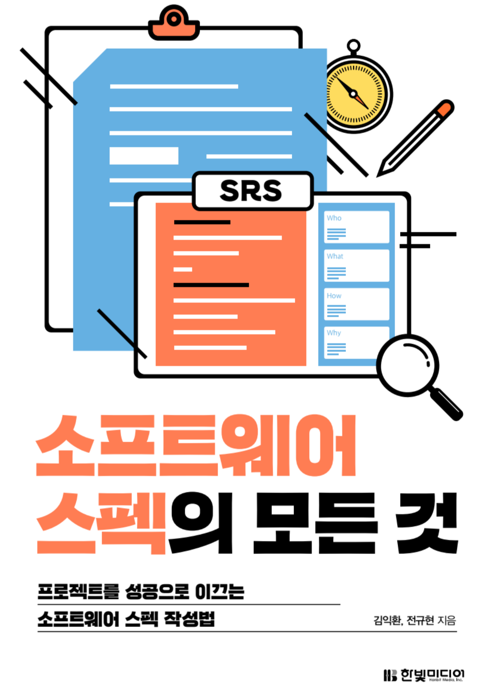

# 소프트웨어 설계의 모든 것

- 김익환, 전규현 지음

**책을 읽기 전에**

책에서 사용하는 용어 정리

문서

- **MRD(Marget Requirements Document), MRS(Market Requirements Specification)** 제품 기획서. 마케팅팀에서 작성하며 SRS 작성에 필요한 내용이 담긴 문서다.
- **PRD(Product Requirements Documents)** 회사에 따라 MRD 와 같은 의미로 사용되기도 하지만 market보다는 product 를 우선시하는 문서다. MRD와 마찬가지로 마케팅팀에서 작성하며 개발팀에서는 MRD와 구별할 필요가 없다.
- **SOW(Statement Of Work)** 개발이 아닌 프로젝트 매니지먼트의 입장에서 본 프로젝트 작업 요구사항을 설명한다. SOW의 작성 목적상 SRS 상위 제목에서 일부 겹칠 수 있으나 완전히 다른 용도로 작성하는 문서다.
- **SRS(Software Requirements Specification)** 소프트웨어 스펙 문서다. 'specification'또는 '스펙'이라고 짧게 부르기도 한다. 기능 명세서, feature list, 시방서 등과는 의미가 다르다. SRS 또는 스펙이라는 용어는 글로벌 소프트웨어 업계에서 널리 통용되는 표준 용어다.
- **SDS(Software Design Specification)** 소프트웨어 설계 문서다. 표준 문서가 있는 것은 아니라서 회사마다 문서 형식과 이름이 다르다. 자유도가 상당히 높은 문서다.
- **IRS(Interface Requirement Specification)** SRS의 일부이기도 하며 인터페이스만 별도로 작성한 문서를 말한다. 여러 시스템에 걸친 인터페이스를 별도로 작성해 여러 프로젝트에서 참조하기도 한다.

사람 또는 팀

- **제품 기획자, 기획자, 마케터** 소프트웨어를 기획하는 사람을 이른다. 기획 산출물인 '제품 기획서', 'MRD', 'MRS' 와 같은 문서를 만들어낸다. 종종 제품을 흥보하는 사람을 마케터라고 하지만 여기서는 마케터를 제품 기획자와 동일한 의미로 사용한다.
- **아키텍트** 여러 종류의 아키텍트를 총칭하는 말이다. 한 사람이 여러 아키텍트 역할을 겸하는 경우가 많다.
- **분석 아키텍트** 소프트웨어 스펙을 작성하는 사람을 말한다.
- **기술 아키텍트** 특정 소프트웨어 전문가를 말한다.
- **설계 아키텍트** 소프트웨어 아키텍처를 설계하는 사람을 말하다.
- **개발자, 소프트웨어 엔지니어** 소프트웨어를 개발하는 사람을 일컫는 광범위한 개념으로 사용된다. QA 엔지니어, 아키텍트를 포함한 말이기도 하다.
- **프로그래머** 주어진 스펙대로 소프트웨어를 구현하는 사람을 말하는, 약간 좁은 의미의 개발자다.
- **QA팀** 소프트웨어 개발 전반에 걸쳐 소프트웨어 품질을 보증하는 일을 하는 팀을 말한다. 
- **테스터** 소프트웨어가 스펙대로 개발됐는지 검증하는 일을 하는 사람을 말한다.
- **테스트 리더** 소프트웨어 테스트 계획을 세우고 테스트 설계를 하는 사람을 말한다. 또한 테스트 진행을 주도하고 관리한다.

행위

- **분석** SRS. 즉 소프트웨어 스펙을 작성하는 행위를 말한다.
- **설계** 소프트웨어 아키텍처를 설계하는 행위를 말한다. SDS 문서를 만들기도 하지만 산출물은 프로젝트에 따라 다르다.
- **상위 설계** 기본 설계를 말한다. 전체 시스템 구조를 규명하고 상위 컴포넌트를 식별하며 인터페이스를 정의한다.
- **하위 설계** 상세 설계를 말한다. 프로젝트마다 상세화 정도가 다르며 시스템을 점차 상세화해 추상화 수준을 낮춘다.