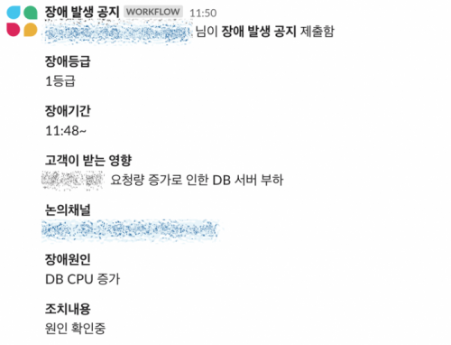

# 우테코 장애 대응

우아~한 장애대응

출처 : [우아한 형제들 기술 블로그](https://techblog.woowahan.com/4886/?utm_source=pocket_mylist)

## 우아한형제들에게 장애란?

많은 서비스회사가 장애에 민감하게 반응하고 있습니다.
장애로 인해 금전적 손해가 발생하기 때문이기도 하지만, 그보다 더 큰 이유는 장애로 인한 고객 불편이 장기적으로 서비스의 신뢰를 하락시킬 수 있기 때문입니다. 장애는 서비스의 성장, 서비스의 변화 등 다양한 과정 중에서 발생하는 성장통 중의 하나이기 때문에 장애가 발생하는 것을 원천적으로 차단할 방법은 없습니다. 하지만, 장애에 대응하는 과정을 통해서 서비스의 신뢰는 지킬 수 있습니다. 장애가 발생하더라도 영향 범위를 최소화하고, 빠르게 복구하며, 고객에게 적절한 정보를 제공하고, 같은 불편을 겪지 않도록 조처를 하는 모든 과정이 고객의 신뢰를 지키는 방법입니다.

**우아한형제들이 장애 상황에서 고객의 신뢰를 지키기 위해서 어떤 활동을 하는지 지금부터 자세히 살펴보겠습니다.**

## 장애 탐지

> 장애는 시스템 알람으로 탐지할 수도 있고, 고객 센터로 인입되는 문의를 통해서도 인지할 수 있습니다.

**시스템 알람을 통한 탐지**

모든 시스템에는 이상 현상을 감지할 수 있는 모니터링 시스템이 구축되어 있으며, 이 모니터링 시스템에서 탐지한 이상 현상을 즉각적으로 인지하기 위해서 Slack(슬랙)으로 알람을 발송하고 있습니다. 그 중에서도 특히 주의를 기울여야 하는 알람의 경우 담당자에게 즉시 연락이 갈 수 있도록 온콜도 운영하고 있습니다.
성격에 맞는 알람 채널을 다양하게 구성해서 운영하고 있는데, 각 시스템 단위의 알람뿐 아니라, 비즈니스 지표를 기준으로 한 알람과 외부 연동 시스템의 이상을 확인할 수 있는 알람 등 다양한 지표를 참고로 서비스 이상 징후를 탐지하고 있습니다.

- 시스템 지표: CPU, Memory, latency, 5xx error count 등
- 비즈니스 지표: 가게 상세 진입률, 주문 추이 등
- 외부 연동 시스템 지표: 연동시스템 주문 전달 실패, 프랜차이즈 시스템 오류 등

**고객 센터로 인입되는 문의**

대부분 이슈를 시스템 알람을 통해서 인지하고 있지만, 사용 빈도가 극도로 낮은 메뉴에 오류가 발생하거나 사용자 기기 기종 혹은 OS 버전에 따른 제한적인 오류가 발생하는 케이스와 같이 특수한 경우에는 시스템으로 탐지하기 어렵습니다. 이런 오류들은 주로 고객 센터를 통해서 인지하게 됩니다. 고객 센터로 인입되는 이슈 중, 시스템 이상으로 판단되거나 고객 센터에서 자체적으로 처리하지 못하는 문제는 서비스 담당자들이 함께 커뮤니케이션하고 있는 채널로 전달됩니다. 각 팀에서는 고객센터에서 전달된 이슈를 확인하고, 장애로 확인되는 경우 장애 대응을 시작하게 됩니다. (장애가 아닌 경우도 종종 있습니다.)
몇 년 전까지는 monolithic 구조로 인해서 모든 엔지니어가 이 채널의 알람에도 민감하게 반응했지만, 현재는 MSA 구조에 맞게 문제가 있는 도메인을 호출하면 (ex, 주문, 리뷰, 결제 등) 각 담당자에게 온콜이 가도록 분리 운영하고 있습니다.

## 장애 공지

## 장애 복구

> 장애 공지 후에 장애 전파와 장애 복구가 동시에 진행됩니다.

장비증설: 트래픽이 과도하게 몰리거나 변경된 코드가 시스템에 부하를 주는 경우 가장 먼저 장비를 증설합니다. 클라우드 환경의 가장 큰 장점이 손쉽고 빠르게 장비 증설이 가능하다는 점이기 때문에 이를 십분 활용하여 장비 증설을 통해 서비스를 안정화합니다.배달의민족 서비스의 경우 피크 시간의 트래픽이 다른 시간과 비교해서 극단적으로 높은 편입니다. 사전에 이를 충분히 고려해서 장비를 운영하고 있지만, 피크 시간에 예상하지 못한 트래픽이 급격하게 증가하게 되면 시스템이 매우 취약해질 수 있습니다. 이때 장비를 증설하면 빠르게 서비스를 안정화할 수 있고, 실제 병목을 일으키는 지점을 찾아서 근본적인 조처를 할 수 있는 시간을 벌 수 있습니다.

그 외 롤백, 핫픽스, 장비교체

## 장애 후속 조치

> 장애 복구가 완료되고, 서비스가 정상화되면 원인 파악과 재발 방지 대책 수립을 위해ㅔ