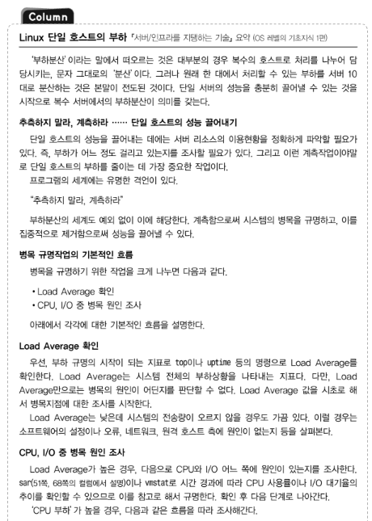
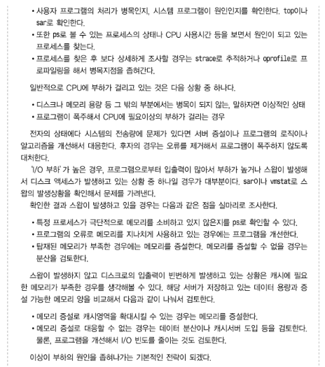
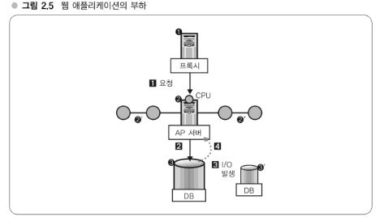

# 웹 개발자를 위한 대규모 서비스를 지탱하는 기술

**하테나 소개**

하테나(hatena)는 '지식 커뮤니티' 인력검색 서비스와 다이어리(블로그) 호스팅 
서비스, 소셜 북마크 서비스 등을 개발해 운영하고 있는 일본의 인터넷 기업으로, 
인터넷 서비스의 가장 매력적인 두 가지 요소인 'Fun'과 'Creativity'를 함께 
추구하는 서비스, 생활 파트너로서 존재하는 서비스를 제공하고 있다.

## 1. 대규모 웹 서비스 개발 오리엔테이션

전체 그림 파악하기

### 대규모 서비스와 소규모 서비스

**하테나의 서비스 규모**

2009년 8월 기준 

- 등록 사용자는 100만 명 이상, 1500만 UU(Unique User)/월
- 수십 억 액세스/월(이미지 등으로의 액세스 제외)
- 피크(peak) 시 회선 트래픽 양은 430Mbps
- 하드웨어(서버)는 500대 이상

100만 명 이상의 사용자들이 블로그를 쓰거나 북마크를 등록하고 있고, 우러간 1,500만 명 이상이 방문하고 있다. 이 방문자 수에 의해 월간 수십 억 액세스가 발생한다. 이 정도가 되면 일일 액세스 로그는 기본적으로 기가바이트(gigabyte) 크기가 되며, DB 서버가 저장하는 데이터 규모도 대략 기가바이트 수준, 많을 때는 테라바이트(terabyte) 정도가 된다.

**소규모 서비스와 대규모 서비스의 차이**

- 확장성 확보, 부하분산 필요 : 서버 1대로 처리할 수 없는 대량의 액세스
- 다중성 확보 : 시스템은 다중성을 지닌 구성, 즉 특정 서버가 고장 나거나 성능이 저하되더라도 서비스를 계속할 수 있는 구성으로 할 필요가 있다.
- 효율적 운용 필요 : 서버 대수가 100대를 넘어섰을 때, 각 서버의 역할과 상태를 어떻게 관리할 것인가
- 개발자 수, 개발방법의 변화

**대규모 데이터량에 대한 대처**

### 계속 성장하는 서비스와 대규모화의 벽

**웹 서비스의 어려움**

**하테나가 성장하기 까지**

### 서비스 개발의 현장

**하테나의 기술팀 체제**

**하테나에서의 커뮤니케이션 방법**

- 책에서 말하는 시기에 하테나는 임직원 40명 정도의 작은 기업

**실제 서비스 개발**

**개발에 사용하는 툴**

- 프로그래밍 언어 : Perl, C/C++, JavaScript 등
  - 서버-사이드(Server-side)인 웹 애플리케이션은 창업 때부터 Perl로 개발하고 있기 때문에, Perl을 사용한다. 검색 엔진 등 메모리 욕너이 엄격하거나 속도가 요구되는 곳에는 일부 C/C++등도 사용한다. 웹 애플리케이션의 사용자 인터페이스 개발은 별다른 선택의 여지없이 JavaScript를 사용한다.
  - 프로그래밍 언어 선택 정책4은 '동일 레이어인 언어는 하나로 한정한다.'는 것이다. 예를 들면 근래의 웹 애플리케이션 개발에는 PHP, Python, Ruby 등의 스크립트 언어가 자주 사용된다. 개발자에 따라서는 이러한 언어가 기호에 맞는 사람도 있겠지만 기본은 Perl을 사용하도록 부탁하고 있다. 이는 앞서 언급한 표준화의 관점에서 중요하다. 같은 언어를 사용하면 자사 내에서 노하우가 널리 통용되고 팀 간 이동도 원활하다. 다른 사람이 만든 시스템의 유지보수도 용이하다.
- 주요 미들웨어 : 마찬가지로 표준화 관점에서 이용할 미들웨어와 프레임워크도 모든 팀에서 통일, 주요 미들웨어는 Linux, Apache, MySQL, memcached 처럼 웹 개발의 기본에 해당되는 것들이다.
- 웹 애플리케이션 프레임워크 : 자체 개발한 Ridge, 심플하고 직관적으로 사용할 수 있는 MVC 프레임워크다.
- 주위 머신의 OS 및 에디터 : 기본적으로는 자유. 프레임워크나 미들웨어와 달리 그 외의 영역에서는 자유다.
- 버전관리는 git, BTS(Bug Tracking System)는 독자 개발한 '아사카'

## 2. 대규모 데이터 처리 입문

메모리와 디스크, 웹 애플리케이션과 부하

**대규모 데이터 특유의 환경 알기**

### 하테나 북마크의 데이터 규모

**하테나 북마크를 예로 본 대규모 데이터**

**하테나 북마크의 데이터 규모**

- 
- 대규모라고 하지만 Google이나 Yahoo!가 사용하고 있는 규모가 되면 여기서 더 나아가 테라바이트, 페타바이트가 되므로 이는 초대규모이며, 이와 비교하자면 하테나는 대규모~중규모 정도이다.

**대규모 데이터로의 쿼리**

### 대규모 데이터 처리의 어려운 점

**대규모 데이터는 어떤 점이 어려운가?**

- '메모리 내에서 계산할 수 없다' : 메모리에 올리지 못하면 계속 디스크를 읽어가면서 검색하게 되어 검색 시간이 늘어난다.

**메모리와 디스크의 속도차**

- 메모리는 디스크보다 10만~100만배 정도 차이가 난다.

**디스크는 왜 늦을까?**

- 디스크는 동축 상에 '원반'(disk)이 쌓여 있다. 이 원반이 회전하고 있고 여기서 데이터를 읽어낸다. 즉 메모리에서는 특정 지점에서 다른 지점으로 포인터를 이동할 때 단순 전기작용으로 동작한다면 디스크에서는 헤드 회전 등의 물리적인 동작을 수반하고 있다.

**OS 레벨에서의 연구**

- 디스크는 느리지만 OS는 이것을 어느 정도 커버하는 작용을 한다. OS는 연속된 데이터를 같은 위치에 쌓는다. 그리고 나서 데이터를 읽을 때 1바이트씩 읽는 것이 아니라 4KB(killobytes) 정도를 한꺼번에 읽도록 되어 있다.
- 이렇게 해서 비슷한 데이터를 서로 가까운 곳에 두어 1번이 디스크 회전으로 읽는 데이터 수를 많게 한다. 그 결과로 디스크의 회전횟수를 최소화할 수 있게 된다. 이러한 작용을 해서 디스크를 가능한 한 회전시키지 않아도 되도록 하고 있다. 하지만 결국 회전 1회당 밀리초 단위이므로 역시 메모리와의 속도차를 피할 수 있는 것은 아니다.

**전송속도, 버스의 속도차**

- 메모리나 디스크 모두 CPU와 버스로 연결되어 있다. 이 버스의 속도에서도 상당한 차이가 있다. 먼저 '탐색'과 '전송'의 차이에 유의하기 바란다. 앞서 본 것은 메모리 혹은 디스크상에 있는 임의의 데이터를 탐색할 때의 속도차, 여기서 살펴보고자 하는 것은 전송속도다. 찾은 데이터를 디스크에서 메모리로 보내거나 메모리에서 CPU로 보내는 등 컴퓨터 내부에서 전송하기 위한 속도다.
- 메모리와 CPU는 상당히 빠른 버스로 연결되어 있으므로, 7.5GB/초 정도 나오지만, 디스크는 58M/초 정도밖에 나오지 않는다. 따라서 전송해오는 중에도 시간이 걸린다. 데이터가 많아지면 많아질수록 디스크와 메모리의 차이도 나타나게 되므로 전송속도에서도 디스크는 늦어진다.
- 최근 SSD(Solid State Drive)가 나오고 있다. SSD는 물리적인 회전이 아니므로 Seek(탐색)은 빠르지만 버스 속도가 병목이 되거나 그 밖에 구조에 기인하는 면이 있어서 메모리만큼이 속도는 나오지 않는다.

**Linux 단일 호스트의 부하**

### 규모조정의 요소

**규모조정, 확장성**

- 웹 서비스에서는 고가의 빠른 하드웨어를 사서 성능을 높이는 '스케일업(scale-up)' 전략보다는 저가이면서 일반적인 성능이 하드웨어를 많이 나열해서 시스템 전체 성능을 올리는 '스케일아웃(scale-out)' 전략이 주류이다. 개별적인 이유는 다양하겠지만, 스케일아웃 전략이 더 나은 이유는 웹 서비스에 적합한 형태이고 비용이 저렴하다는 점과 시스템 구성에 유연성이 있다는 점이 포인트다.
- 가격이 10배인 제품이 속도나 신뢰성 면에서 10배만큼 발휘하는 것은 아니다.

**규모조정의 요소**

- 스케일아웃은 하드웨어를 나열해서 성능을 높이는, 즉 하드웨어를 횡으로 전개해서 확장성을 확보해가게 된다. 이때 cpu 부하의 확장성을 확보하기는 쉽다.
- 예를 들면 웹 애플리케이션에서 계산을 수행하고 있을 때, 즉 HTTP 요청을 받아 DB에 질의하고 DB로부터 응답받은 데이터를 가공해서 HTML로 클라이언트에 반환할 때는 기본적으로 CPU부하만 소요되는 부분이다. 이것은 서버 구성 중에 프록시나 AP 서버(application Server)가 담당할 일이다.
- 한편 DB 서버 측면에서는 I/O 부하가 걸린다.

**웹 애플리케이션과 부하의 관계**

- 웹 애플리케이션의 3단 구조에는 프록시, AP 서버, DB 서버가 있다.
- 요청이 프록시->AP서버->DB 순서로 전달되고 DB에서는 I/O가 발생하며, 이 I/O가 발생해서 되돌아온 콘텐츠를 변경한 후 클라이언트로 응답한다. AP 서버에는 I/O 부하가 걸리지 않고 DB 측에 I/O 부하가 걸린다.
- AP 서버는 CPU 부하만 걸리므로 분산이 간단하다. 그 이유는 기본적으로 데이터를 분산해서 갖고 있는 것이 아니므로 동일한 호스트가 동일하게 작업을 처리하기만 하면 분산할 수 있다. 결국 새로운 서버를 추가하고자 한다면 원래 있던 서버와 완전히 동일한 구성을 갖는 서버, 심하게 말하면 복사본을 마련해서 추가하면 된다. 요청을 균등하게 분산하는 것은 로드밸런서(load balancer)라는 장치가 해준다.
- I/O 부하에는 문제가 있다. DB를 늘린다고 하면 데이터 동기화를 어떻게 해야할 지 문제가 생긴다.

## 3. OS 캐시와 분산

대규모 데이터를 효율적으로 처리하는 원리

## 4. 분산을 고려한 MySQL 운용

## 5. 대규모 데이터 처리 실전 입문

애플리케이션 개발의 급소

## 6. [과제] 압축 프로그래밍

데이터 크기, I/O 고속화와의 관계 인식하기

## 7. 알고리즘 실용화

가까운 예로 보는 이론/연구의 실전 투입

## 8. [과제] 하테나 키워드 링크 구현

응용으로 가는 길 깨닫기

## 9. 전문 검색기술 도전

대규모 데이터 처리의 노하우

## 10. [과제] 전문 검색엔진 작성

기초, 상세부분 작성, 속도와 정확성 추구

## 11. 대규모 데이터 처리를 지탱하는 서버/ 인프라 입문

웹 서비스의 백엔드

## 12. 확장성 확보에 필요한 사고방식

규모 중대와 시스템 확장

## 13. 다중성 확보, 시스템 안정화

100%에 근접한 가동률을 실현하는 원리

## 14. 효율향상전략

하드웨어의 리소스 사용률 높이기

## 15. 웹 서비스와 네트워크

서비스의 성장

## Appendix A. 현대 웹 서비스 구축에 필요한 실전 기술

대규모 서비스에 대응하기 위해서