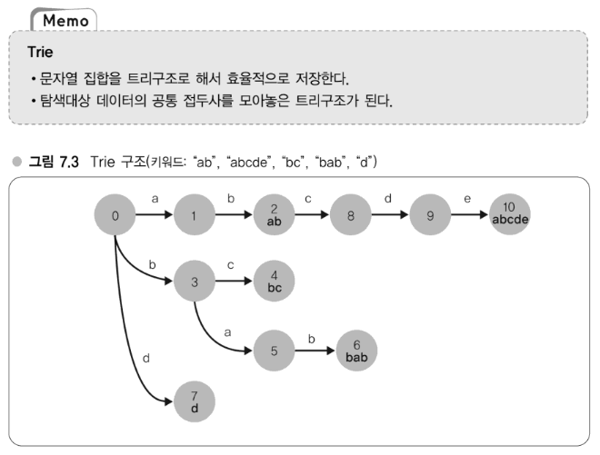

# 웹 개발자를 위한 대규모 서비스를 지탱하는 기술

**하테나 소개**

하테나(hatena)는 '지식 커뮤니티' 인력검색 서비스와 다이어리(블로그) 호스팅 서비스, 소셜 북마크 서비스 등을 개발해 운영하고 있는 일본의 인터넷 기업으로, 인터넷 서비스의 가장 매력적인 두 가지 요소인 'Fun'과 'Creativity'를 함께 추구하는 서비스, 생활 파트너로서 존재하는 서비스를 제공하고 있다.

## 1. 대규모 웹 서비스 개발 오리엔테이션

전체 그림 파악하기

### 대규모 서비스와 소규모 서비스

**하테나의 서비스 규모**

2009년 8월 기준 

- 등록 사용자는 100만 명 이상, 1500만 UU(Unique User)/월
- 수십 억 액세스/월(이미지 등으로의 액세스 제외)
- 피크(peak) 시 회선 트래픽 양은 430Mbps
- 하드웨어(서버)는 500대 이상

100만 명 이상의 사용자들이 블로그를 쓰거나 북마크를 등록하고 있고, 우러간 1,500만 명 이상이 방문하고 있다. 이 방문자 수에 의해 월간 수십 억 액세스가 발생한다. 이 정도가 되면 일일 액세스 로그는 기본적으로 기가바이트(gigabyte) 크기가 되며, DB 서버가 저장하는 데이터 규모도 대략 기가바이트 수준, 많을 때는 테라바이트(terabyte) 정도가 된다.

**소규모 서비스와 대규모 서비스의 차이**

- 확장성 확보, 부하분산 필요 : 서버 1대로 처리할 수 없는 대량의 액세스
- 다중성 확보 : 시스템은 다중성을 지닌 구성, 즉 특정 서버가 고장 나거나 성능이 저하되더라도 서비스를 계속할 수 있는 구성으로 할 필요가 있다.
- 효율적 운용 필요 : 서버 대수가 100대를 넘어섰을 때, 각 서버의 역할과 상태를 어떻게 관리할 것인가
- 개발자 수, 개발방법의 변화

**대규모 데이터량에 대한 대처**

### 계속 성장하는 서비스와 대규모화의 벽

**웹 서비스의 어려움**

**하테나가 성장하기 까지**

### 서비스 개발의 현장

**하테나의 기술팀 체제**

**하테나에서의 커뮤니케이션 방법**

- 책에서 말하는 시기에 하테나는 임직원 40명 정도의 작은 기업

**실제 서비스 개발**

**개발에 사용하는 툴**

- 프로그래밍 언어 : Perl, C/C++, JavaScript 등
  - 서버-사이드(Server-side)인 웹 애플리케이션은 창업 때부터 Perl로 개발하고 있기 때문에, Perl을 사용한다. 검색 엔진 등 메모리 욕너이 엄격하거나 속도가 요구되는 곳에는 일부 C/C++등도 사용한다. 웹 애플리케이션의 사용자 인터페이스 개발은 별다른 선택의 여지없이 JavaScript를 사용한다.
  - 프로그래밍 언어 선택 정책4은 '동일 레이어인 언어는 하나로 한정한다.'는 것이다. 예를 들면 근래의 웹 애플리케이션 개발에는 PHP, Python, Ruby 등의 스크립트 언어가 자주 사용된다. 개발자에 따라서는 이러한 언어가 기호에 맞는 사람도 있겠지만 기본은 Perl을 사용하도록 부탁하고 있다. 이는 앞서 언급한 표준화의 관점에서 중요하다. 같은 언어를 사용하면 자사 내에서 노하우가 널리 통용되고 팀 간 이동도 원활하다. 다른 사람이 만든 시스템의 유지보수도 용이하다.
- 주요 미들웨어 : 마찬가지로 표준화 관점에서 이용할 미들웨어와 프레임워크도 모든 팀에서 통일, 주요 미들웨어는 Linux, Apache, MySQL, memcached 처럼 웹 개발의 기본에 해당되는 것들이다.
- 웹 애플리케이션 프레임워크 : 자체 개발한 Ridge, 심플하고 직관적으로 사용할 수 있는 MVC 프레임워크다.
- 주위 머신의 OS 및 에디터 : 기본적으로는 자유. 프레임워크나 미들웨어와 달리 그 외의 영역에서는 자유다.
- 버전관리는 git, BTS(Bug Tracking System)는 독자 개발한 '아사카'

## 2. 대규모 데이터 처리 입문

메모리와 디스크, 웹 애플리케이션과 부하

**대규모 데이터 특유의 환경 알기**

### 하테나 북마크의 데이터 규모

**하테나 북마크를 예로 본 대규모 데이터**

**하테나 북마크의 데이터 규모**

- 
- 대규모라고 하지만 Google이나 Yahoo!가 사용하고 있는 규모가 되면 여기서 더 나아가 테라바이트, 페타바이트가 되므로 이는 초대규모이며, 이와 비교하자면 하테나는 대규모~중규모 정도이다.

**대규모 데이터로의 쿼리**

### 대규모 데이터 처리의 어려운 점

**대규모 데이터는 어떤 점이 어려운가?**

- '메모리 내에서 계산할 수 없다' : 메모리에 올리지 못하면 계속 디스크를 읽어가면서 검색하게 되어 검색 시간이 늘어난다.

**메모리와 디스크의 속도차**

- 메모리는 디스크보다 10만~100만배 정도 차이가 난다.

**디스크는 왜 늦을까?**

- 디스크는 동축 상에 '원반'(disk)이 쌓여 있다. 이 원반이 회전하고 있고 여기서 데이터를 읽어낸다. 즉 메모리에서는 특정 지점에서 다른 지점으로 포인터를 이동할 때 단순 전기작용으로 동작한다면 디스크에서는 헤드 회전 등의 물리적인 동작을 수반하고 있다.

**OS 레벨에서의 연구**

- 디스크는 느리지만 OS는 이것을 어느 정도 커버하는 작용을 한다. OS는 연속된 데이터를 같은 위치에 쌓는다. 그리고 나서 데이터를 읽을 때 1바이트씩 읽는 것이 아니라 4KB(killobytes) 정도를 한꺼번에 읽도록 되어 있다.
- 이렇게 해서 비슷한 데이터를 서로 가까운 곳에 두어 1번이 디스크 회전으로 읽는 데이터 수를 많게 한다. 그 결과로 디스크의 회전횟수를 최소화할 수 있게 된다. 이러한 작용을 해서 디스크를 가능한 한 회전시키지 않아도 되도록 하고 있다. 하지만 결국 회전 1회당 밀리초 단위이므로 역시 메모리와의 속도차를 피할 수 있는 것은 아니다.

**전송속도, 버스의 속도차**

- 메모리나 디스크 모두 CPU와 버스로 연결되어 있다. 이 버스의 속도에서도 상당한 차이가 있다. 먼저 '탐색'과 '전송'의 차이에 유의하기 바란다. 앞서 본 것은 메모리 혹은 디스크상에 있는 임의의 데이터를 탐색할 때의 속도차, 여기서 살펴보고자 하는 것은 전송속도다. 찾은 데이터를 디스크에서 메모리로 보내거나 메모리에서 CPU로 보내는 등 컴퓨터 내부에서 전송하기 위한 속도다.
- 메모리와 CPU는 상당히 빠른 버스로 연결되어 있으므로, 7.5GB/초 정도 나오지만, 디스크는 58M/초 정도밖에 나오지 않는다. 따라서 전송해오는 중에도 시간이 걸린다. 데이터가 많아지면 많아질수록 디스크와 메모리의 차이도 나타나게 되므로 전송속도에서도 디스크는 늦어진다.
- 최근 SSD(Solid State Drive)가 나오고 있다. SSD는 물리적인 회전이 아니므로 Seek(탐색)은 빠르지만 버스 속도가 병목이 되거나 그 밖에 구조에 기인하는 면이 있어서 메모리만큼이 속도는 나오지 않는다.

**Linux 단일 호스트의 부하**

### 규모조정의 요소

**규모조정, 확장성**

- 웹 서비스에서는 고가의 빠른 하드웨어를 사서 성능을 높이는 '스케일업(scale-up)' 전략보다는 저가이면서 일반적인 성능이 하드웨어를 많이 나열해서 시스템 전체 성능을 올리는 '스케일아웃(scale-out)' 전략이 주류이다. 개별적인 이유는 다양하겠지만, 스케일아웃 전략이 더 나은 이유는 웹 서비스에 적합한 형태이고 비용이 저렴하다는 점과 시스템 구성에 유연성이 있다는 점이 포인트다.
- 가격이 10배인 제품이 속도나 신뢰성 면에서 10배만큼 발휘하는 것은 아니다.

**규모조정의 요소**

- 스케일아웃은 하드웨어를 나열해서 성능을 높이는, 즉 하드웨어를 횡으로 전개해서 확장성을 확보해가게 된다. 이때 cpu 부하의 확장성을 확보하기는 쉽다.
- 예를 들면 웹 애플리케이션에서 계산을 수행하고 있을 때, 즉 HTTP 요청을 받아 DB에 질의하고 DB로부터 응답받은 데이터를 가공해서 HTML로 클라이언트에 반환할 때는 기본적으로 CPU부하만 소요되는 부분이다. 이것은 서버 구성 중에 프록시나 AP 서버(application Server)가 담당할 일이다.
- 한편 DB 서버 측면에서는 I/O 부하가 걸린다.

**웹 애플리케이션과 부하의 관계**

- 웹 애플리케이션의 3단 구조에는 프록시, AP 서버, DB 서버가 있다.
- 요청이 프록시->AP서버->DB 순서로 전달되고 DB에서는 I/O가 발생하며, 이 I/O가 발생해서 되돌아온 콘텐츠를 변경한 후 클라이언트로 응답한다. AP 서버에는 I/O 부하가 걸리지 않고 DB 측에 I/O 부하가 걸린다.
- AP 서버는 CPU 부하만 걸리므로 분산이 간단하다. 그 이유는 기본적으로 데이터를 분산해서 갖고 있는 것이 아니므로 동일한 호스트가 동일하게 작업을 처리하기만 하면 분산할 수 있다. 결국 새로운 서버를 추가하고자 한다면 원래 있던 서버와 완전히 동일한 구성을 갖는 서버, 심하게 말하면 복사본을 마련해서 추가하면 된다. 요청을 균등하게 분산하는 것은 로드밸런서(load balancer)라는 장치가 해준다.
- I/O 부하에는 문제가 있다. DB를 늘린다고 하면 데이터 동기화를 어떻게 해야할 지 문제가 생긴다.

### 대규모 데이터를 다루기 위한 기초지식

**대규모 데이터를 다루는 세 가지 급소**

- 첫번째는 어떻게 하면 디스크 작업을 최소화하고 메모리에처 처리하도록 해서 성능을 끌어올릴 수 있을까?? 이다.
- 두번째는 데이터량 증가에 강한 알고리즘을 사용하는 것이다.
- 세번째는 데이터 압축이나 검색기술과 같은 테크닉 활용

## 3. OS 캐시와 분산

대규모 데이터를 효율적으로 처리하는 원리

### OS의 캐시 구조

- 원래 OS에는 디스크 내의 데이터에 빠르게 액세스할 수 있도록 구조가 갖춰져 있다. OS는 메모리를 이용해서 디스크 액세스를 줄인다. 원리를 알고 이를 전제로 애플리케이션을 작성하면 OS에 상당부분을 맡길 수 있다.
- Linux의 경우 페이지 캐시(page cache)나 파일 캐시(file cache), 버퍼 캐시(buffer cache)라고 하는 캐시 구조를 갖추고 있다.

### I/O부하를 줄이는 방법

**캐시를 전제로 한 I/O를 줄이는 방법**

- 데이터 규모에 비해 물리 메모리가 크면 전부 캐싱할 수 있으므로 이 점을 생각할 것. 다루고자 하는 데이터의 크기에 주목하는 것이다.
- 대규모 데이터 처리에는 데이터 압축률이 중요한데, 압축해서 저장해두면 디스크 내용을 전부 그대로 캐싱해둘 수 있는 경우가 많다. 2GB의 메모리를 가진 머신에 4GB 텍스트 파일을 올릴 수는 없지만, 만약 파일을 2GB로 압축할 수 있다면 메모리에 올릴 수 있다.
- 경제적인 비용과 밸런스를 고려해야 한다.

### 국소성을 살리는 분산

- 아래 그림에서는 데이터를 그대로 복제했다. 그와 달리 데이터에 대한 액세스 패턴을 고려해서 분산시키는 것을 국소성을 고려한 분산이라고 한다.
- 액세스 패턴 A일 때는 1로, 액세스 패턴 B일 때는 2로 -> 데이터로 액세스하는 경향에 대한 처리방식에 따라 특정한 방향으로 치우치는 경우가 자주 있다.
- 

**파티셔닝**

- 파티셔닝(partitioning)은 한 대였던 DB 서버를 여러 대의 서버로 분할하는 방법. 분할 방법 중 간단한 것은 '테이블 단위 분할'이다.
- 활용 예시로 검색 봇은 그 특성상 아주 오래된 웹 페이지에도 액세스하러 온다. 사람의 경우라면 좀처럼 액세스하지 않을 페이지에도 액세스하고, 또한 광범위하게 액세스한다. 그렇게 되면 캐시가 적용하기 어렵지만, 사람과 다르게 봇에 대해서는 빠르게 응답을 해야 할 필요가 없으므로 섬으로 나눠놓는다. 한편 봇 이외에 액세스, 즉 사용자로부터의 액세스는 최상위 페이지나 인기 엔트리 페이지 등 최신, 인기 페이지에 거의 액세스가 집중되므로 빈번하게 참조되는 부분은 캐싱하기 쉽다.
- 

**요청 패턴을 '섬'으로 분할**

- '용도별로 시스템을 섬으로 나누는 방법'

**페이지 캐시를 고려한 운용의 기본 규칙**

- OS 기동 직후에 서버를 투입하지 않는다. 캐시가 없으므로 오직 디스크 액세스만 발생하기 때문이다.
- 성능평가는 캐시가 최적화되었을 때 수행한다.

## 4. 분산을 고려한 MySQL 운용

### 인덱스를 올바르게 운영하기

**분산을 고려한 MySQL 운용, 세 가지 포인트**

**OS 캐시 활용**

**인덱스의 중요성**

- 알고리즘 / 데이터 구조에서 탐색을 할 때는 기본적으로 트리(탐색트리)가 널리 사용된다. 인덱스는 주로 탐색을 빠르게 하기 위한 것으로, 그 내부 데이터 구조로는 트리가 사용된다. (MySQL 은 기본적으로 B+ 트리)
  - 
  - 
  - 여기서 B트리는 블록 단위의 데이터를 디스크의 한 블록에 할당할 수 있다. 그래서 디스크 seek 발생횟수를 노드를 찾아갈 때만으로 최소화할 수 있는 것. 동일한 노드의 데이터는 동일한 블록에 있으니 같은 노드 내의 데이터는 seek 없이 탐색할 수 있다.(이진트리의 경우 노드를 모아서 디스크 블록의 저장하는 식의 처리가 어렵다.)

### MySQL의 분산

**MySQL의 레플리케이션 기능**

- MySQL의 레플리케이션Replication 기능
  - 마스터(master)를 정하고 마스터를 팔로우하는 서버Slave를 정하면 마스터에 쓴 내용을 슬레이브가 폴링(poling)해서 동일한 내용으로 자신을 갱신하는 기능이다. 슬레이브는 마스터의 레플리카Replica가 되는 것이다. 이렇게 해서 동일한 내용의 서버를 여러 대 마련할 수가 있다.
- 
- 레플리케이션 기반 서버를 여러 대 준비하게 되면 AP 서버에서는 로드밸런서를 경유해서 슬레이브로 질의한다. 이렇게 해서 쿼리를 여러 대 분산할 수 있다.
- 이때 애플리케이션 구현에서 select 등 참조 쿼리만 로드밸런스로 흘러가도록 한다. 갱신 쿼리는 마스터로 직접 던진다.

**마스터/슬레이브의 특징**

- 참조 쿼리는 확장하고 갱신 쿼리는 확장하지 않는다.
- 웹 애플리케이션에서 대략 90% 이상이 참조계열 쿼리다. 웹에서 참조계열에 비하면 마스터가 병목이 되어 곤란한 상황이 발생하는 경우는 그렇게 많지 않다.

### MySQL의 스케일아웃과 파티셔닝

**MySQL의 스케일아웃 전략**

**파티셔닝의 상반관계**

- 파티셔닝의 좋은 점은 부하가 내려가고 국소성이 늘어나서 캐시 효과가 높아진다는 것이다.
- 운용이 복잡해진다. 서버가 다수로 나누어지면 서로 용도 또한 나뉘어진다.
- 고장률이 높아진다.

## 5. 대규모 데이터 처리 실전 입문

**애플리케이션 개발의 급소**

- 배치 처리로 RDBMS에서 데이터를 추출해서 별도의 인덱스 서버와 같은 것을 만들고, 이 인덱스 서버에 웹 애플리케이션에서 RPC(Remote Procedure Call)등으로 액세스하는 방법을 사용한다.
- RPC, 웹 API : 예전에는 웹 API라는 것이 일반적이지 않았으므로 대체적으로 원격에 놓인 데이터 구조나 파일을 검색하고자 할 때는 RPC라고 하는, 네트워크를 경유해서 프로토콜이 독자적으로 정해져 있는 것을 사용하는 경우가 많았다.그러나 최근에는 이 프로토콜을 JSON + HTTP, 즉 웹 API로 처리하는 일이 더 많은 것 같다.

**용도특화형 인덱싱**

- 데이터를 정기적으로 뽑아낸다. 
- 뽑아낸 데이터에서 데이터 구조를 구축(튜닝)
  - 검색용 역 인덱스
  - 키워드 링크용 Trie 등
  - 범용적인 목적으로 구성된 데이터 구조보다 특정 목적을 위해 튜닝된 데이터 구조가 다루기에 훨씬 효율적이다.
- 구조화 데이터를 저장한 서버를 C++ 로 개발, RPC로 액세스

- 하테나 검색엔진에서는 미리 키워드를 추출 후 Trie 기반의 정규 분포 구조로 튜닝한 뒤에 사용한다고 한다.

### 이론과 실전 양쪽과의 싸움

## 6. [과제] 압축 프로그래밍

데이터 크기, I/O 고속화와의 관계 인식하기

- 정수 데이터를 VB Code(Variable Byte Code) 알고리즘으로 압축하기
- 아래 그림에서 고정길이 바이너리 부호에서 정수는 32비트, 그러니까 4바이트 크기이지만 5와 130은 모두 하위 1바이트 외에는 사용하지 않는다. 여기 앞부분의 바이트를 제거하고 최소한의 바이트로 정보를 표현하는 것이 VB Code 이다.
- 

## 7. 알고리즘 실용화

가까운 예로 보는 이론/연구의 실전 투입

### 하테나 다이어리의 키워드 링크

- 어휘수가 많아지면서 정규표현 컴파일/ 정규표현 패턴매칭 부하가 무시하지 못할 수준으로 증가함
- Trie 알고리즘 활용. 탐색 대상 문자열 집합을 트리 구조로 표현합니다.
- 
- 예를 들어 hogefoo 라는 단어를 생각해보자. 이 단어를 입력으로 foo, bar, baz의 Trie 구조를 순회하도록 한다면 h라는 문자열이 포함되어 있지 않으므로 매칭되지 않음을 알 수 있다. 다음으로 oge로 순회할때도 마찬가지, ge도, e도 마찬가지다. 그리고 나서 f부터 Trie를 순회하고 oo로 이어지면서 foo가 매칭됨을 알 수 있다. 결국 hogefoo라는 단어의 길이만큼만 계산하면 끝이다.

**AC법**

- AC(Aho-Corasick)법은 Trie에서의 패턴매칭을 매칭이 진행되다가 도중에 실패했을 경우, 되돌아오는 길의 엣지에 다시 Trie에 추가한 데이터 구조를 사용하는 방법이다.
- 사전 내에서 패턴매칭을 수행하는 오토마톤을 구축하고 입력 텍스트에 대해 선형 계산시간을 실현한다. 이는 계산량이 사전 크기에 의존하지 않는 빠른 방법이다.
- 
- 예를 들어 Trie에 "babcdes"를 입력한 경우 bab가 발견된 다음은 ab가 발견될 거라는 것은 알고 있다. 그러므로 bab 까지 탐색했다면 다시 선두 노드인 0으로 돌아가는게 아니라 바로 노드 2로 갈 수 있다는 걸 알 수 있다면 ab를 바로 찾을 수 있을 것이다. 여기서 '6 다음은 바로 2' 라고 길을 내는 전처리를 Trie에 대해 수행하는 것이 AC 법의 핵심이다.

### 하테나 북마크의 기사 분류

- 베이지안 필터 : 텍스트 문서 등을 입력으로 받아들이고 거기에 나이브 베이즈(Naive Bayes)라고 하는 알고리즘을 적용해서 확률적으로 해당 문서가 어느 카테고리에 속하는지를 판정하는 프로그램
  - 특징적인 것은 미지의 문서의 카테고리 판정을 수행함에 있어서 과거에 분류가 끝난 데이터의 통계정보로부터 판정을 수행한다는 점이다.

## 8. [과제] 하테나 키워드 링크 구현

- Pass

## 9. 전문 검색기술 도전

대규모 데이터 처리의 노하우

### 전문 검색기술의 응용범위

### 검색 시스템의 아키텍처

**검색 시스템이 완성되기까지**

- 검색이 가능하기까지
  - 크롤링
  - 저장
  - 인덱싱
  - 검색
  - 스코어링
  - 결과표시

- 우선 처음에 검색할 문서를 가져와야 한다. (크롤링) 
- 가져온 문서를 어떻게 저장할 것인가라는 문제가 있다. 예를 들면, 하나의 데이터베이스에 넣는다면 해당 데이터베이스가 깨졌을 때 복원할 수 없으므로 분산 데이터베이스에 저장해야 하는 문제가 있다.
- 가져온 문서로부터 인덱스를 구축한다. (인덱싱)
- 검색에서는 검색 쿼리를 포함하는 문서가 검색결과로서 반환되는데, 그 순서가 평범하다면 전혀 기쁘지 않을 것이다. 검색결과를 어떤 순서로 표시해줄 것인가라는 것은 굉장히 중요한 문제다. (스코어링 혹은 랭킹)
- 스코어링 후에 결과를 표시

### 검색 엔진의 내부구조

## 10. [과제] 전문 검색엔진 작성

- pass

## 11. 대규모 데이터 처리를 지탱하는 서버/ 인프라 입문

웹 서비스의 백엔드

### 엔터프라이즈 vs. 웹 서비스

### 클라우드 vs. 자체구축 인프라

## 12. 확장성 확보에 필요한 사고방식

규모 중대와 시스템 확장

### 계층과 확장성

- 성능이 아주 좋은 고성능 장비라도 1대로는 서버 트래픽을 전부 감당하지 못할 수 있다.
- 차라리 저가형 기기 여러 대를 연결해 확장하는 것이 좋다.

**계층별 확장성**

- AP 서버는 기본적으로 그다지 깊은 부분까지 생각하지 않아도 비교적 간단하게 확장할 수 있다. 그 이유는 AP 서버는 상태를 갖고 있지 않으므로 요청별로 다른 AP 서버로 날려보내도 처리상 문제가 발생하지 않고 로드밸런서에 새로운 서버를 추가해가면 점점 확장되어 간다.
- 반면에 DB나 파일 서버의 경우에는 분산/ 확장성 확보가 매우 어렵다.

**부하 파악, 튜닝**

- 어떻게 확장해갈 것인지를 검토하기 위해서는 먼저 서버 부하를 파악할 수 있어야 한다.

**부하를 측정하기 위한 항목**

- Load Average : 프로세스가 언제든지 동작할 수 있는 상태이지만, 아직 실제 CPU가 할당되지 않아서 대기상태에 있는 프로세스 수의 평균치다. 예를 들어 5분간 Load Average가 1이라고 하면, 5분 동안에 평균 1개의 프로세스가 대기상태로 되어 있다는 것을 의미한다.

## 13. 다중성 확보, 시스템 안정화

100%에 근접한 가동률을 실현하는 원리

### 다중성 확보 - AP 서버

- 다중화에 대한 실제적인 얘기를 하자면 AP 서버에서는 확장성을 생각하는 방식과 마찬가지로 서버 여러 대를 늘어놓는 게 기본이 된다. 서버를 늘어놓을 때 중요한 것은 1대나 2대 정도 정지하더라도 충분히 처리할 수 있도록 처리 능력을 확보해두는 것이다.
- 이에 대한 대응으로 로드밸런서로 페일오버(failover, 장애 극복), 페일백(failback, 정상복귀)하여 고장 난 서버를 자동적으로 분리하고, 서버가 복구되면 원 상태로 복귀시키는 작업을 수행하고 있다. 페일오버는 자동으로 분리하는 것, 페일백은 정상이 되면 복귀시키는 처리를 말한다. 로드밸런서는 서버에 대해 주기적으로 헬스체크를 하고 있으며, AP 서버나 DB 서버가 살아있는지 여부를 판정하고 있다. 이는 다중화에서 가장 기본적인 부분이다.
- 

**다중성 확보 - DB 서버**

- DB 서버도 마찬가지로 서버를 여러 대 나열해서 1, 2대 정지하더라도 충분한 처리능력이 있도록 해두는 것이 중요하다. 또한 마스터의 다중화를 수행하고 있다.
- 하테나에서는 멀티 마스터라는 방법을 사용하고 있다. 구체적으로 말하면 쌍방향 레플리케이션, 즉 서로가 서로의 슬레이브가 되는 상태로 해두고 한쪽에 쓰기 작업을 하면 다른 한쪽으로 전달하고 반대쪽에 쓰더라도 다른 쪽으로 전달하는, 양방향 레플리케이션 방법이다.
- 

**다중성 확보 - 스토리지 서버**

- 하테나에서는 이미지 파일과 같은 미디어 파일을 저장하기 위한 분산 스토리지 서버로 MogileFS를 사용하고 있다. 분산 파일 시스템을 사용함으로써 대량의 파일을 보존할 수 있는 확장성과 일부 서버가 다운 되더라도 전체 장애가 되지 않도록 다중성을 확보할 수 있다.

### 시스템 안정화

- 빠듯할 정도로 메모리를 튜닝해서 8GB 중에 7.5GB 정도까지 메모리를 사용하도록 설정해두고 있다고 하자. 이 상태로 다른 일이 발생하지 않으면 좋겠지만, 처리해야 할 데이터량이 늘어나거나 애플리케이션에 버그가 있거나 메모리 누수가 발생해서 소비 메모리량이 갑자기 수백 MB 늘어나는 것은 그렇게 드문 일이 아니다. 이처럼 메모리를 빠듯하게 튜닝하게 되면 메모리가 늘어낫을 때 곧바로 스왑을 사용하기 시작해서 성능이 저하되면서 서비스 장애로 이어지게 된다.
- 또 하나는 CPU를 거의 한계에 다다를 정도로 사용하는 것이다. 이렇게 되면 서버 대수를 줄일 수 있어서 비용면에서는 유리하지만, 한계에 다다른 상태에서 1대에 장대가 발생하면 전체적으로 처리능력이 부족해져서 요청을 다 처리하지 못하고 막혀서 장애가 되는 이런 경우도 종종 발생한다.
- 이렇게 되지 않기 위해 실제로 취해야 하는 대책으로, 메모리는 7할 정도까지만 사용한다거나 CPU를 7할 정도까지만 사용하는 등 어느 정도 여유를 가질 수 있게 설계하는 것이 중요하다. 앞에서 1, 2대가 다운되더라도 문제가 없도록 한다는 얘기를 했는데, 한계에 다다를 정도로 사용하지 않고 어는 정도 버퍼를 유지하고 버퍼가 부족해지면 새로운 서버를 추가하거나 구성을 약간 변경해서 전체적인 사용량을 줄이는 대책을 계속해감으로써 안정성을 확보할 수 있다.

**시스템의 불안정요인**

### 시스템 안정화 대책

## 14. 효율향상전략

하드웨어의 리소스 사용률 높이기

## 15. 웹 서비스와 네트워크

서비스의 성장

### 가상화 기술

**가상화 기술의 도입**

먼저 가상화 기술의 목적을 정리해보자면 아래와 같은 점을 들 수 있을 것이다.

- 확장성
  - 오브헤드의 최소화
- 비용대비 성능
  - 리소스 사용률 향상
  - 운용의 유연함(환경의 단순화)
- 고가용성
  - 환경의 격리

**가상화 기술의 효용**

하테나에서는 가상화 기술을 사용함으로써 실제로 다음과 같은 효용을 얻고 있다.

- IPMI(Intelligent Platform Management Interface)를 대체하는 하이퍼바이저
- 하드웨어 간 차이 흡수(-> 환경 추상화)
- 준 가상화(ParaVirtualization) 사용
- 리소스 소비 제어
  - 과부하 경고
  - 부하 조정

벤더 서버에는 IPMI라는 리모트 관리 기능이 있는데, 이를 대체해서 하이퍼바이저를 사용할 수 있게 되어 있다. 하이퍼바이저는 이른바 호스트 OS를 말한다. 서버 상에 최초리 기동하는 OS를 '하이퍼바이저' (Xen 용어로는 Dom0), 호스트 OS 상에서 기동하는 OS를 '게스트 OS'(Xen 용어로는 DomU)라고 하는데, 호스트OS를 다른 이름인 '하이퍼바이저'라고 한다. IPMI는 벤더에서 만든 서버 제품으로 구현되어 있는 경우가 많은 리모트 관리환경으로, 예를 들어 전원 On, Off를 원격에서 수행할 수도 있다. 하테나에서는 IPMI의 대체품으로서 하이퍼바이저라는 계층을 하나 늘림으로써 게스트 OS를 리모트에서 제어하고 있다. 이에 따라 IPMI가 탑재되어 있지 않은 저가의 하드웨어를 사용할 수가 있다.

다음으로 하드웨어 차이를 흡수해서 환경을 추상화할 수 있다. 이에 따라 새로운 하드웨어나 오래된 하드웨어로도 차분에 신경 쓰지 말고 사용할 수 있다. Xen에 특화된 얘기지만, 가상화로 인한 오버헤드를 줄이기 위해 하드웨어를 완전히 에뮬레이팅 하지 않은 준 가상화(ParaVirtualization)라는 방식이 있으며, 하테나에서는 이 방식을 사용하고 있다.

리소스 소비를 소프트웨어 레벨에서 강력하게 제어할 수 있게 되어 있다. 리소스 소비를 제어함으로써 '과부하 경고', '부하 조정'을 수행한다. 과부하일 때 프로세스를 재시작하는 것뿐만 아니라 게스트 OS의 자동 재시작도 수행한다. 게스트 OS를 자동적으로 재시작할 때는 리소스 관리용 툴(monit)을 사용해서 Load Average가 얼마인지, 메모리 소비는 어느 정도인지, 네트워크 커넥션을 확립할 수 있을지 등을 감시한다. 감시하고 있는 값이 설정한 임계치를 넘어서면 Apache 재시작이나 게스트 OS 를 재기동하게 되는 것이다.

**가상화 서버 구축정책**

가상화 기술을 도입하는 가장 기본적인 목적은 하드웨어의 이용효율 향상이다. 하드웨어의 이용효율 향상을 위해 남아있는 리소스를 사용하는 게스트 OS를 투입한다. 예를 들어 CPU 리소스가 남아있으면 웹 서버, I/O 리소스가 남아있으면 DB 서버, 메모리 용량이 남아있으면 캐시 서버를 투입한다.

**가상화로 얻은 장점 정리**

구체적인 장점으로는

- 물리적인 리소스 제약에서 해방됨으로써 동적으로 변경할 수 있게 되고, 게스트 OS의 마이그레이션이나 복제가 용이해졌다. 이에 따라 서버 증설이 용이해지고 확장성을 확보할 수 있게 되었다.
- 다음으로 소프트웨어 레벨에서 호스트 리소스를 강력하게 제어할 수 있고, 비정상 동작 시 문제를 국소화시키고 호스트를 쉽게 제어할 수 있게 되었다. 효율이 향상되고 시스템을 전체적으로 안정화할 수 있게 되었다.

## Appendix A. 현대 웹 서비스 구축에 필요한 실전 기술

대규모 서비스에 대응하기 위해서