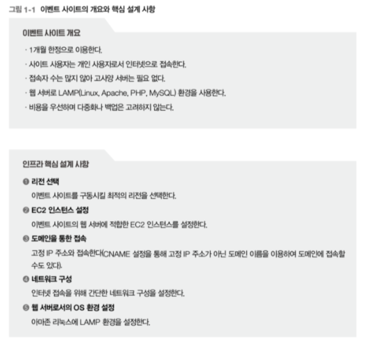
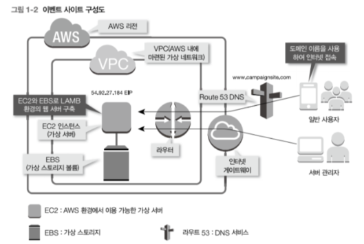
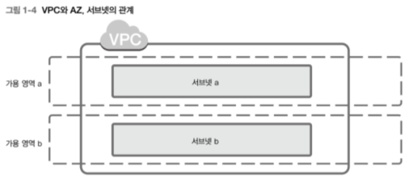
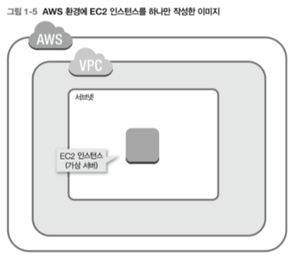
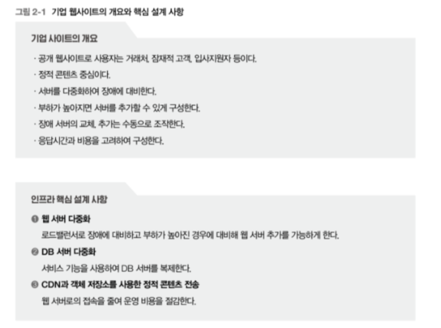
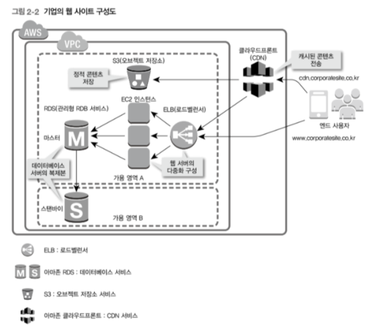
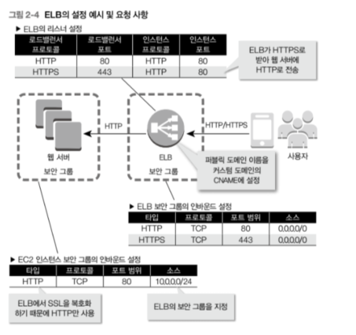
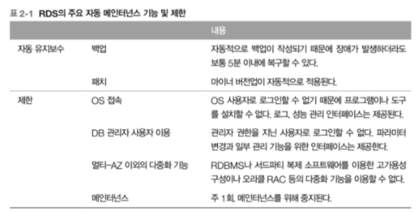
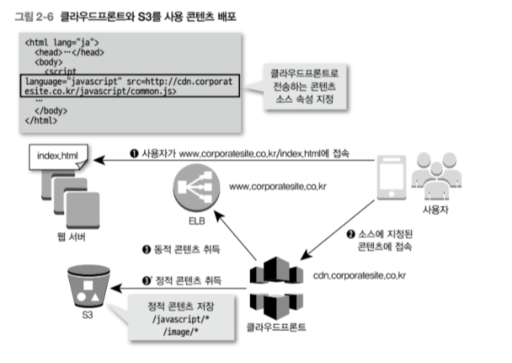

# 배워서 바로 쓰는 14가지 AWS 구축 패턴

## 1부 웹 시스템

fold/unfold

### 최소 구성은 단일 서버 실수하기 쉬운 설정 문제 주의

- 서버를 구성하는 가장 기본적인 서비스는 가상 서버인 EC2(Amazon Elastic Compute Cloud) 와 가상 스토리지 볼륨인 EBS(Amazon Elastic Block Store)입니다. 이 둘로 웹 서버를 구축합니다.
- 네트워크에 필요한 기본적인 서비스는 표준 서비스에 포함되어 있습니다. 예를 들어 VPC의 내부에 가상 라우터를 설치할 수 있습니다. 인터넷과 접속하는 데 '인터넷 게이트웨이'도 이용할 수 있습니다. 이번 케이스에는 이벤트 사이트의 호스트명을 정의하는 데 DNS 기능을 제공하는 서비스 아마존 라우트 53(Amazon Route 53)를 사용합니다.

**리전에 따른 응답 속도와 비용 차이**

- 구축 시 가장 먼저 리전을 선택해야 합니다. 응답 속도는 AWS 데이터 센터와 이벤트 사이트에 접속하는 사용자가 지리적으로 가까울수록 빠르며 멀수록 느립니다. 국내에 거주하는 사용자를 대상으로 하는 이벤트 사이트의 응답 속도를 빠르게 하고 싶다면 서울 리전을 선택합니다.
- 리전을 정했으면 VPC(Virtual Private Cloud)와 서브넷으로 구성하는 가상 네트워크를 작성합니다. **VPC는 논리적으로 격리된 사용자 전용 네트워크 구역입니다.**
  - 복수의 가용 영역(Availability Zones)에 걸친 형태로 VPC 하나를 작성할 수 있습니다. 단 복수의 리전에 걸쳐서 작성할 수는 없습니다. 서브넷은 VPC를 논리적으로 분리한 서브네트워크로 AWS 환경 내의 네트워크 최소 단위입니다. 서브넷은 단일 가용 영역 안에 작성합니다. 가상 서버를 비롯한 각종 AWS 서비스는 서브넷에 배치됩니다.

서브넷을 나누는 방법은 온프레미스 환경과 비슷합니다. 논리적인 네트워크를 설계해서 AWS의 서브넷 구성에 대입시킵니다. 예를 들어 인터넷으로 HTTP 수신이 가능한 웹 서버와, 웹 서버로부터 데이터베이스 접속만 허가하는 데이터베이스 서버는 필터링 정책이 다르기 때문에 서브넷을 분리해야 합니다.

**EC2 인스턴스 작성하기**

- VPC와 서브넷을 작성했으니 이벤트 사이트의 웹 서버가 되는 EC2의 인스턴스를 작성합니다. 인스턴스는 AWS상의 가상 서버입니다. 다른 서비스에서도 인스턴스라는 용어를 사용하기 때문에 EC2의 인스턴스를 EC2 인스턴스라고 부릅니다.

- EC2 인스턴스는 웹 설정 화면에서 미리 정의된 옵션을 선택하여 설정할 수 있습니다. 우선 AMI(Amazon Machine Image)를 선택합니다. AMI는 즉시 사용이 가능한 상태의 OS 및 패키지의 조합입니다. 이용 목적에 가까운 AMI를 선택하여 필요에 따라 최적화합니다.
- AMI의 가상화 타입으로 완전가상화인 HVM과 반가상화인 PV가 있습니다. 일반적으로는 HVM을 선택합니다. AWS는 PV의 지원을 축소하면서 HVM으로 전환을 진행하고 있어 HVM 성능이 더 좋습니다.
- 이어서 AMI 인스턴스 유형을 선택합니다. 인스턴스는 서버 규모에 해당하며, CPU, 메모리, 스토리지, 네트워크 성능의 조합을 할 수 있습니다.

**네트워크 및 셧다운 동작 설정 주의 사항**

인스턴스 유형을 정했다면 다음은 EC2 인스턴스를 설정할 차례입니다. 

- 네트워크는 VPC를 선택합니다. 2013년 이전에 계정을 개설한 사용자는 EC2-Classic도 선택할 수 있지만 이것은 VPC가 등장하기 이전의 낡은 네트워크 구성입니다. 앞으로는 VPC 사용이 필수이기 때문에, 특별한 이유가 없으면 VPC를 선택해야 합니다.
- AWS는 수시로 서비스가 업데이트되기 때문에 기존 서비스와 새로운 서비스가 혼재하는 경우가 있습니다. 따라서 서비스 내용을 충분히 파악하고 선택하는 것이 중요합니다.
- 퍼블릭 IP 주소를 자동 할당하는 퍼블릭 IP 자동 할당(Auto-assign Public IP) 기능을 비활성화(Disable) 합니다. 활성화하면 동적 퍼블릭 IP 주소가 부여되어 인터넷에서 접속이 가능해집니다. 단, 이 설정으로 부여된 퍼블릭 IP 주소나 퍼블릭 DNS는 EC2 인스턴스가 다시 시작할 때마다 자동으로 변겨오딥니다. 따라서 재시작할 때마다 IP 주소 또는 DNS를 다시 지정해주어야 합니다. 이번에는 이 설정에서 퍼블릭 IP 주소를 할당하고 나중에 고정 퍼블릭 IP 주소를 할당하는 별도의 서비스를 이용합니다.

**보안 그룹 설정으로 통신 필터링하기**

EC2 인스턴스 서정의 마지막 단계는 보안 그룹 설정입니다. 보안 그룹은 OS 레벨에서 네트워크 통신 필터링 룰을 정하는 것으로 허가할 프로토콜을 설정합니다.

- 보안 그룹 Source의 초기 설정값이 Anywhere로 되어 있는데, 이는 모든 IP 주소로부터의 SSH 접속을 하가한다는 의미입니다. 이대로라면 어떤 IP 든 SSH 접속을 허용하기 때문에 Source 값으로 My IP 를 설정합니다. 그렇게 하면 현재 접속한 기기의 퍼블릭 IP 주소에서의 접속만을 받아들이게 됩니다. 퍼블릭 IP 주소가 여럿인 경우는 'Custom IP'를 선택하고 주소 범위를 CIDR 표기법 (클래스 없는 도메인 간 라우팅 기법)으로 적습니다.

**고정 IP와 호스트명으로 접속하게 하기**

아직 인터넷으로 시작된 EC2 인스턴스에 접속할 수 없습니다. 인터넷으로 접속하려면 고정 퍼블릭 IP 주소와 FQDN(호스트명) 을 부여해야 합니다. 고정 퍼블릭 IP 주소를 AWS에서는 EIP(Elastic IP)라고 부릅니다.

EIP를 포함한 서비스 설정 변경과 추가는 매니지먼트 콘솔(AWS Management Console) 에서 합니다. EIP 설정은 매니지먼트 콘솔을 통해 EC2 서비스로 들어간 후 탐색창의 'Elastic IPs' 페이지에서 'Allocate New Address'를 선택합니다. 이것으로 고정 퍼블릭 IP 주소를 얻었습니다. 다음에는 이 주소를 EC2 인스턴스에 연결시킵니다. 취득한 EIP를 마우스로 오른쪽 클릭하여 콘텍스트 메ㅇ뉴에서 'Associate Address'를 선택합니다. "instance' 항목을 클릭하여 조금 전 작성한 이벤트 사이트의 EC2 인스턴스 이름을 선택합니다.

이상으로 웹 서버에 고정 퍼블릭 IP 주소가 할당되어 인터넷으로부터의 접속이 가능해졌습니다.

**VPC 설정으로 인터넷 접속 설정하기**

인터넷에서 접속하려면 한 가지 설정이 더 필요합니다. AWS 에서는 VPC 이용이 필수입니다. VPC는 AWS 데이터 센터 내부에 마련된 가상의 폐쇄 네트워크이며, 외부와 통신할 수 있도록 설정해야 합니다. 이벤트 사이트는 기본 설정에서 두 군데만 수정하면 됩니다.

첫 번째는 VPC의 DNS 관련 설정입니다. 매니지먼트 콘솔의 VPC 설정 화면에서 'DNS resolution'과 'DNS hostnames'를 확인합니다. 'no'로 되어 있다면 'yes'로 변경합니다. 'DNS resolution'은 VPC 내에서 DNS 확인을 활성화할지 여부를, 'DNS hostname'은 DNS 이름을 부여할지 여부를 관리하는 설정으로 인터넷에서 FQDN에 접속하는 데 필요합니다.

두 번째는 라우팅 설정입니다. 라우팅 테이블에 인터넷 게이트웨이가 설정되어 있지 않으면 인터넷 접속이 불가능합니다. VPC 설정 화면 탐색창의 'Route Tables'에서 라우팅 테이블을 선택하고 하단 창의 'Routes' 탭을 확인합니다.

**OS 환경을 웹 서버로 설정하기**

이어서 EC2 인스턴스의 Os 환경을 설정합니다. 아마존 리눅스의 초기 상태는 최소한의 서비스와 AWS 도구가 설치되어 있을 뿐, LAMP 환경은 설치되어 있지 않습니다. 따라서 LAMP 를 인스톨해야 웹 서버로 사용할 수 있습니다.

**운영 중에 리소스를 유연하게 별경하기**

운영 중인 서버의 CPU, 메모리, 디스크가 부족하게 되는 경우를 생각해봅시다. 온프레미스 환경에서는 미리 넉넉하게 구축하거나 부족할 때마다 증설 작업을 하지만, AWS 에서는 간단한 조작만으로도 자원을 추가할 수 있습니다.

CPU와 메모리는 EC2 인스턴스를 작성할 대 확인한 인스턴스 유형을 다시 고르는 것으로 변경할 수 있습니다. 변경하려면 EC2 인스턴스를 정지(Stop)하고, 설정을 변경합니다.

디스크 추가는 EBS 용량 변경으로 실시합니다. 디스크는 가상 저장소인 EBS로서 EC2 인스턴스와는 독립적으로 만듭니다. EBS 용량은 관리 콘솔에서 1GB 단위로 설정할 수 있습니다. EBS를 EC2에 연결(Attach) 하면, 서버의 디스크 볼륨으로 인식됩니다.

**이벤트 사이트를 종료하면서 할 일**

이벤트가 종료되었다면 이벤트 사이트를 닫습니다. 서비스를 그대로 두면 계속해서 비용이 발생합니다. 그러므로 비용이 발생하는 서비스를 중지합시다.

EC2 인스턴스는 중지해도 유지하는 용량만큼 청구됩니다. 재사용 계획이 없다면 데이터를 백업해놓은 후에 매니지먼트 콘솔의 EC2 인스턴스 설정 화면에서 Terminate를 클릭하여 삭제합니다. Enable termination protection(종료 보호 활성화)를 무효화시킨 후에 삭제합니다. EBS 역시 EC2 인스턴스에서 분리하여 유지하더라도 비용이 청구됩니다. 필요 없으면 삭제해야 합니다.

EIP는 조금 달라서, EC2 인스턴스에 연결되어 있을 때는 과금되지 않지만, 연결되어 있지 않다면 과금됩니다.

라우트 53은 DNS 존 단위로 월정액 과금됩니다. 이벤트 사이트가 속하는 영역을 사용하지 않는다면 삭제해야 하지만 영역을 계속 이용하는 경우는 삭제할 필요가 없습니다.

VPC 는 연결 및 데이터 전송에 비용이 발생하지만, VPC 유지 자체 비용은 청구되지 않습니다. 따라서 제거할 필요는 없습니다.

#### 관리형 서비스

AWS 를 EC2로 대표되는 IaaS(Infrastructure as a Service)를 제공하는 클라우드 사업자로 인식하는 분이 많을 겁니다. 하지만 실제로는 OS와 미들웨어까지 관리하는 PaaS(Platform as a Service)와 소프트웨어까지 관리하는 SaaS(Software as a Service) 도 제공하여 그 숫자가 점점 늘고 있습니다.

이러한 서비스를 관리형 서비스라고 부릅니다. 주요 관리형 서비스로는 스토리지 서비스 아마존 S3, 데이터베이스 서비스 아마존 RDS, DNS 서비스 아마존 라우트 53, 서버리스(Serverless) 코드 실행 서비스 아마존 람다(AWS Lambda) 등이 있습니다.

관리형 서비스에서는 사용자가 OS 에 접속할 수 없습니다. AWS가 인스턴스를 관리하기 대문입니다. 장점은 버전업이나 다중화, 백업 등의 작업을 사용자가 직접 할 피룡가 없다는 점입니다. 단점은 성능 문제가 발생해도 개선 방안이 많지 않다는 것입니다. 사용자가 변경 가능한 범위가 적어지기 대문에 바꿀 수 있는 범위도 적기 때문입니다.

### 다중화로 가용성을 확보하기, 서비스 활용으로 비용 절감하기

다소 복잡한 웹사이트 예로 AWS를 사용한 기업 웹사이트 구축 패턴을 소개합니다. 웹 서버와 DB 서버의 이중화 방법, 저비용으로 정적 콘텐츠를 배포하는 방법 등을 다룹니다.

기업 웹사이트는 마케팅과 커뮤니케이션 도구로 중요하게 쓰입니다. 그러므로 기반 업무 시스템 정도는 아니지만 안정저긍로 가동되어야 합니다. 주요 사용자는 거래처, 잠재적 고객, 입사지원자입니다.

설계의 핵심 사항은 웹 서버 다중화, DB 서버 다중화, CDN(Content Delivery Network, 콘텐츠 전송 네트워크) 과 객체 저장소를 사용한 정적 콘텐츠 배포입니다. 다중화는 웹 서버와 DB 서버에서 각각 적합한 다른 방식을 채용하였습니다.

- 웹 서버는 가상 서버인 EC2 와 가상 저장소인 EBS를 사용하여 구축하였습니다. 웹 서버는 로드 밸런서를 사용하여 다중으로 구성합니다. 로드밸런서 기능을 제공하는 서비스는 ELB(Elastic Load Balancing)입니다.
- DB 서버는 RDB 의 관리형 서비스인 RDS(Amazon Relational Database Service)로 구성합니다. RDS는 셋업이 완료된 RDBMS 환경을 제공하는 서비스로 간단한 설정만으로도 다중화가 가능합니다. 이렇게 관리형 서비스들을 이용해 적은 노력으로 시스템의 구성이 가능한 것이 AWS의 장점입니다.
- 정적 콘텐츠 전송에 이용하는 CDN 서비스가 아마존 클라우드프론트(Amazon CloudFront) 이고, 객체 저장소 서비스가 S3(Amazon Simple Storage Service)입니다. CDN은 전 세계에 배치된 서버를 통해 웹 접속을 캐시하거나 분배하는 서비스입니다. CDN을 사용하면 응답 속도를 높이거나 웹 서버로의 접속을 줄일 수 있습니다. 객체 저장소는 객체 단위로 데이터를 다루는 스토리지로서 REST API를 사용하여 데이터의 입출력을 수행합니다.

**ELB를 이용하여 웹 서버 다중화하기**

- EC2 인스턴스를 작성한 뒤 웹 서버 환경 구성
  - OS 환경 셋업
  - 회사 홈페이지로서 필요한 CMS(Content Management System) 설치
- 웹 서버 여러 대 구축. 수작업으로 설정하면 시간이 걸리니 가상 서버 템플릿인 AMI를 이용하여 가상 서버 여러 대를 한꺼번에 셋업
- 필요한 수의 웹 서버를 만든 후에는 ELB와 연계한 다중화 구성을 설정
- ELB와 웹 서버의 EC2 인스턴스를 연결

**ELB 설정 시 유의사항**

1. ELB 용과 웹 서버용으로 각각 다른 보안 그룹을 마련해놓기. ELB는 인터넷 어디에서라도 HTTP와 HTTPS 접속을 허용하도록 설정되어 있스빈다. 한편 웹 서버는 ELB로부터의 HTTP 요청만을 받아들이도록 트래픽 소스를 ELB가 속한 보안 그룹으로 한정합니다. 서브넷으로 설정하는 것은 ELB의 IP 주소가 바뀔 가능성이 있기 때문입니다. 인터넷에서 직접적으로 웹 서버에 접속하는 것은 허용하지 않습니다. 개별 웹 서버에 직접 접속하면 ELB의 제어가 제대로 작동하지 않게 됩니다.
2. 세션 유지 기능의 유무입니다. 최근 웹사이트는 세션 유지 기능을 이용해 복잡한 기능을 지닌 애플리케이션을제공하는 경우가 있습니다. 그때 세션 정보를 웹 서버 간에 공유하는 구조를 마련하지 않으면 동일한 클라이언트 접속을 항상 같은 웹 서버에 유지시켜야만 합니다.
3. HTTPS 처리입니다. HTTPS 통신은 클라이언트와 서버 간의 통신을 암호화합니다. ELB는 SSL 터미네이션(SSL Termination)이라고 하는 SSL 인증서 확인 및 암호화/복호화 처리 기능을 제공합니다. ELB 리스너 설정에서 로드밸런서 프로토콜을 HTTPS로, 인스턴스의 프로토콜을 HTTP로 하면 자동적으로 적용됩니다.
4. 웹 서버가 정상적으로 동작하는지를 감시하는 헬스 체크 설정입니다. 기본 설정에서는 간격(Interval)이 30초, 타임아웃(Time out)이 5초, 비정상 상한치(Unhealthy threshold)가 2회입니다. 웹 서버에 장애가 발생하면 40초에서 70초 만에 감지하여 해당 서버를 분리합니다. 너무 짧으면 웹 서버의 부하가 높아져 응답이 저하되는 상태를 고장으로 오판하여 서버를 분리하고 맙니다. 반대로 너무 길면 오류가 발생하는 웹 서버에 오청 배분으 계속합니다.
5. 응답시간에 따른 타임아웃 설정입니다.

**RDS를 이용하여 DB 서버 다중화하기**

AWS 에서 RDB를 구성하는 방법은 크게 두 가지입니다. EC2 인스턴스에 RDBMS를 설치하는 방법과, 관리형 서비스인 아마존 RDS를 이용하는 방법입니다. 전자는 OS와 RDBMS를 자유롭게 선택하고 설정할 수 있는 반면, OS와 DB 환경을 사용자가 직접 관리하지 않으면 안 됩니다. 후자는 패치 적용과 백업이 자동화되어 있기 때문에 운영의 번거로움이 줄어듭니다. 가능한 한 아마존 RDS를 사용하는 편이 설정과 운영에 들어가는 수고를 줄일 수 있지만, DB 운영에는 제약이 있습니다.

**RDS 사용 시 유의사항**

1. 적절한 스냅샷을 생성해야 합니다. 예를 들어 일단 초기 설정이 완료된 시점에서 스냅샷을 작성해둡니다. RDS는 자동 백업과 수동 스냅샷 백업 방법을 지원합니다. 자동 백업은 간편하지만 데이터 보존 기간에 제한이 있습니다. 시스템에 대한 백업을 영구적으로 저장하려면 스냅샷이 더 적합합니다. 대규모 시스템의 유지보수 작업을 수행하는 경우에도 복구용 스냅샷을 만들어둡시다.
2. AWS에 의한 maintenance 입니다. RDS는 몇 달에 한 번꼴로 마이너 버전업이 자동 실행되어, 약 30분간 정지됩니다. 옵션인 마이너 버전 자동 업그레이드를 NO로 설정하면 마이너 버전업이 수행되지 않습니다. 하지만 취약점 대응 등에 의한 강제 업그레이드가 이루어지는 경우가 있습니다. 이때 멀티-AZ를 이용하는 경우, 스탠바이가 먼저 메인터넌스된 후, 장애 복구(Failover) 기능에 의해 새로운 마스터가 되고, 원래 마스터는 메인터넌스된 후에 새로운 스탠바이가 됩니다. 매니지먼트 콘솔에서 RDS 인스턴스의 메인터넌스 윈도우로 메인터넌스를 실시하는 시간대를 제한할 수 있습니다.
3. 멀티-AZ를 이용하면 데이터 갱신 처리에 드는 시간이 길어진다는 점입니다. 마스터에 업데이트한 데이터를 스탠바이에 동기화시키는 처리가 끝날 때까지 마스터는 다음의 처리를 실시할 수 없습니다. 이용 환경이나 처리 내용에 따라 다르긴 하지만, 필자의 경험으로는 대체로 20~50% 정도 업데이트 처리 시간이 길어집니다. 영향받는 것은 업데이트 처리뿐이므로, 기업 웹사이트처럼 참조 비율이 많은 경우는 그다지 문제가 되지 않습니다.

**정적 콘텐츠를 낮은 비용으로 배포하기**

방문자가 많은 시스템에서는 이미지와 동영상, 자바스크립트, HTML, CSS 등의 정적 콘텐츠 제공에 많은 비용이 들게 됩니다. 대량의 트래픽을 처리하려면 고성능 웹 서버가 여러 대 필요합니다. 그리고 EC2는 다운로드 통신량에 따라 종량 과금이 부과합니다. 이때 정적 콘텐츠 전달 비용을 줄이려면 클라우드프론트와 S3를 사용하면 됩니다.

클라우드 프로트는 CDN의 일종으로 세계 각지에 배치된 서버에서 콘텐츠를 개시하고 전달합니다. 캐시에 히트한 경우에는 웹 서버와 DB 서버에 접속하지 않으므로 서버의 부하를 낮춰 운영 비용을 줄일 수 있습니다.

최종 사용자는 소유 도메인의 URL(예 : www.corporatesite.co.kr)에서 기업의 웹사이트를 볼 수 있습니다. 예를 들어 index.html을 참조했다고 합시다. 개발자는 클라우드프론트에서 배포할 콘텐츠에 대해서는 index.html의 URL 설정에서 클라우드프론트 도메인(예 : http://cdn.corporatesite.co.kr/)을 지정합니다. 이렇게 설정해두면 브라우저는 클라우드 프론트에서 콘텐츠를 가져옵니다.

클라우드프론트에 캐시되지 않은 콘텐츠는 오리지널인 ELB로 가지러 갑니다. 일단 사용자가 액세스한 콘텐츠는 클라우드프론트에 캐시됩니다. 이후 같은 콘텐츠에 대한 액세스는 클라우드프론트가 캐시된 큰텐츠를 그대로 배포합니다.

클라우드프론트뿐만 아니라 정적 콘텐츠를 S3에 두는 방법을 함께 사용하면 더욱 웹 서버의 부하를 줄여, 낮은 비용으로 배포할 수 있습니다. S3에 파일을 저장하면 파일 단위로 접속용 URL 이 생성됩니다. 이것을 이용해 정적 콘텐츠 저장소로 사용합니다. S3 요금 체계는 EC2보다 낮게 설정되어 있기 때문에 정적 콘텐츠는 S3에 배치하는 것이 비용상 유리합니다.

클라우드 프론트는 정적 콘텐츠 뿐만 아니라 동적 콘텐츠도 배포할 수 있습니다. 클라우드프론트의 참조 분리 기능을 이용하면 동적 콘텐츠는 ELB에서, 정적 콘텐츠는 S3에서 가져올 수 있습니다. 다만 URL 와일드카드를 지정하여 정적 및 동적 콘텐츠를 구별할 수 있다는 것을 전제로 합니다.

**기업 웹사이트에 적합한 인스턴스 설계하기**

...

**스케일링**

시스템으로의 접속 수가 증가하면 처리 능력을 키울 방법이 필요합니다. 이렇게 시스템의 처리 능력을 키우는 것을 스케일링이라고 합니다. AWS는 스케일링하는 구체적인 방법으로 스케일 업(scale-up)과 스케일 아웃(scale-out)을 제공합니다.

스케일 업은 두 가지 커다란 제약이 있습니다. 하나는 단일 노드의 스펙 상한이 시스템의 처리 성능 한계가 되어버린다는 점입니다. 다른 하나는 인스턴스 용량을 변경할 때 일시적으로 중단이 필요하다는 점입니다.

이에 비해 스케일 아웃은 노드 수를 늘리는 것으로 스케일링을 하기 때문에 상한선 제약 없이 동적으로 적용할 수 있습니다. 게다가 AWS에서는 동적으로 스케일 아웃을 하는 기능을 제공합니다.

스케일 아웃을 전제로 하면 처리 능력을 확장시키는 작업을 자동화할 수 있는 장점도 있습니다. 하지만 스케일링하는 방식으로서 스케일 아웃을 선택할 수 있는지 여부는 애플리케이션이 어떻게 만들어졌는지와도 관계가 있습니다. 여러 노드에서 병렬로 작업을 수행하려면 처리 결과나 데이터에 불일치가 일어나지 않도록 고려해야 하기 때문입니다.

스케일 업, 스케일 아웃과는 반대로 인스턴스 용량을 낮추거나 처리 노드 수를 줄이는 것을 각각 스케일 다운, 스케일 인이라고 합니다.

## 2부 스토리지 시스템

fold/unfold

## 3부 데이터 분석 시스템

## 4부 애플리케이션 쾌속 개발

## 5부 클라우드 네이티브

## 6부 하이브리드 클라우드