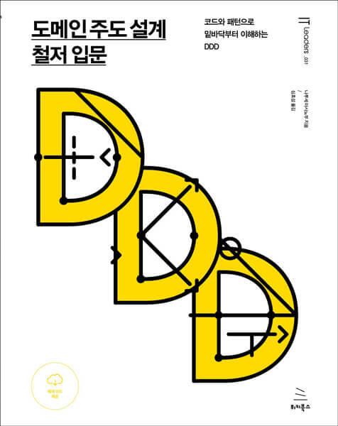

# 도메인 주도 설계 철저 입문

## 1. 도메인 주도 설계란?

- 도메인은 '영역'이라는 뜻이다. 특히 소프트웨어 개발에서 말하는 도메인은 '프로그램이 쓰이는 대상 분야'라는 의미로 쓰인다. 여기서는 더 중요한 것은 도메인이 무엇인지보다는 도메인에 포함되는 것이 무엇인가 하는 것이다.
  - 도메인에 포함되는 개념은 시스템의 대상 분야가 무엇인지에 따라 크게 달라진다.

**모델링이란??**

- 모델은 현실에 일어나느 사건 혹은 개념을 추상화한 개념이다. 추상이란 여러 사물 혹은 개념에서 공통적인 것을 뽑아 파악하는 것으로, 현실의 모든 것을 반영하는 것이 아니다. 상황에 따라 취사선택이 필요하다. 무엇을 버리고 무엇을 취할지는 도메인에 따라 결정된다.

- 도메인의 개념을 빠짐없이 표현하는 것은 매우 어렵다. 표현에 제약이 많은 코드로 나타내야 한다면 더욱더 그렇다. 그러나 코드로 나타낼 대상을 소프트웨어가 맡은 바 역할을 다하기 위해 필요한 정보로 한정한다면, 현실적으로 실현하는 데 문제가 없다. 물류 시스템으로 예를 들면, 트럭은 '화물을 나를 수 있다' 는 성질만 표현해도 충분하다. '차 키를 돌리면 엔진에 시동이 걸린다' 와 같은 정보까지 나타낼 필요는 없다.

- 도메인 모델은 처음부터 정해진 것이 아니다. 도메인 분야의 관계자는 도메인 개념에 대한 지식은 있어도 소프트웨어에 대한 지식은 없다. 반면 개발자는 소프트웨어에 대한 지식은 있어도 도메인 개념에 대한 지식이 없다. 도메인 문제를 해결하는 소프트웨어를 만들려면 각 분야의 두 사람이 협력하여 도메인 모델을 만들어야 한다.

**지식을 코드로 나타내는 도메인 객체**

- 도메인 모델을 소프트웨어 형태의 동작하는 모듈로 나타낸 것이 도메인 객체다.
  - 어떤 도메인 모델을 도메인 객체로 구현할지도 중요한 문제다. 개발자는 정말로 유용한 모델과 그렇지 않은 모델을 구분해야 한다. 오랜 시간을 들여 만든 도멩니 모델이 있어도 해당 모델이 이용자의 문제를 해결하는 것과 관계가 없다면 이를 도메인 객체로 구현하는 것은 쓸데없는 작업일 뿐이다.

## 2. 시스템 특유의 값을 나타내기 위한 '값 객체'

- 프로그래밍 언어에는 원시 데이터 타입이 있다. 이 원시 데이터 타입만 사용해 시슽메을 개발할 수도 있지만, 때로는 시스템 특유의 값을 정의해야 할 때가 있다. 이러한 시스템 특유의 값을 표현하기 위해 정의하는 객체를 값 객체라고 한다.
- 값 객체는 원시 데이터 타입이 아닐 수도 있다. 시스템에서 어떤 처리를 해야 하는지에 따라 값을 나타내는 적합한 표현이 정해진다.

- 값의 성질로는 대표적으로 다음 세 가지를 꼽을 수 있다.
  - 변하지 않는다.
  - 주고받을 수 있다.
  - 등가성을 비교할 수 있다.

**값 객체를 도입했을 때의 장점**

아래 네 가지 모두 간단하지만, 시스템을 보호하는 데는 크게 도움이 된다.

- 표현력이 증가한다.
- 무결성이 유지된다.
- 잘못된 대입을 방지한다.
- 로직이 코드 이곳저곳에 흩어지는 것을 방지한다.

## 3. 생애주기를 갖는 객체 - 엔티티

- 도메인 주도 개발에서 말하는 엔티티는 도메인 모델을 구현한 도메인 객체를 의미한다. 값 객체도 도메인 모델을 구현한 도메인 객체다. 이 두 가지 객체의 차이는 동일성을 통해 식별이 가능한지 아닌지에 있다.
  - 엔티티는 속성이 아닌 동일성으로 식별되는 객체다.
  - 사람이 나이를 먹는다고 이전과 다른 사람이 되지는 않는 것. 대표적으로 시스템의 사용자는 특정 속성 값이 아닌 동일성(identity)로 식별된다.

엔티티의 성질은 다음과 같다.

- 가변이다.
- 속성이 같아도 구분할 수 있다.
- 동일성을 통해 구별된다.

**엔티티의 판단 기준 - 생애주기와 연속성**

- 값 객체와 엔티티는 모두 도메인 개념을 나타내는 객체로서 서로 유사한 점이 많다. 그렇다면 어떤 것을 값 객체로 정의하고 어떤 것을 엔티티로 정의할 것인지 판단 기준이 필요할 것이다. 여기에는 생애주기의 존재 여부와 그 생애주기의 연속성 여부가 중요한 판단 기준이 된다.

- 생애주기를 갖지 않거나 생애주기를 나타내는 것이 무의미한 개념이라면 우선 값 객체로서 다루는 것이 좋다. 생애주기를 갖는 객체는 태어나서 죽을 때까지 변화를 겪을 수 있다. 정확함이 필요한 소프트웨어를 만들려고 할 때 가변 객체는 신중히 다뤄야 할 성가신 존재다. 불변으로 남겨둘 수 있는 것은 최대한 불변 객체로 남겨둬야 시스템을 단순하게 유지할 수 있다.

**값 객체도 되고 엔티티도 될 수 있는 모델**

- 타이어를 예로 들면, 타이어는 자동차를 구성하는 한 부품이다. 특성에는 세세한 차이가 있어도 서로 바꿔 쓸 수 있으므로 값 객체로 나타내기에 적합한 개념이다. 그러나 타이어를 만드는 공장의 입장에서 타이어를 식별하는 것은 중요하다. 여기서의 타이어는 엔티티로 나타내는 것이 더 적합하다.

**도메인 객체를 정의할 때의 장점**

- 자기 서술적인 코드가 된다.
- 도메인에 변경사항이 있을 시 코드에 반영하기 쉽다.

## 4. 부자연스러움을 해결하는 도메인 서비스

- 소프트웨어 개발에서 말하는 서비스는 클라이언트를 위해 무언가를 해주는 객체를 말한다. 그러나 이 '무언가'의 범위가 매우 넓고 다양하기 때문에 도리어 혼란스럽다.
  - 도메인 주도 설계에서 말하는 서비스는 크게 두 가지로 나뉘다. 첫 번째는 도메인을 위한 서비스고 두 번째는 애플리케이션을 위한 서비스다.

## 5. 데이터와 관계된 처리를 분리하자 - 리포지토리

- 소프트웨어로 도메인 개념을 포현했다고 해서 그대로 애플리케이션이 되는 것은 아니다. 프로그램을 실행할 때 메모리에 로드된 데이터는 프로그램을 종료하면 그대로 사라져버린다. 특히 엔티티는 생애주기를 갖는 객체이기 때문에 프로그램의 종료와 함께 객체가 사라져서는 안 된다.
- 객체를 다시 이용하려면 데이터스토어에 객체 데이터를 저장 및 복원할 수 있어야 한다. 리포지토리는 데이터를 저장하고 복원하는 처리를 추상화하는 객체이다.
- 리포지토리의 책임은 도메인 객체를 저장하고 복원하는 퍼시스턴시다. 퍼시스턴시라고 하면 무조건 관계형 데이터베이스를 떠올리는 사람이 많지만, 퍼시스턴시의 기반 기술은 관계형 데이터베이스 외에도 다양하다.

## 6. 유스케이스를 구현하기 위한 '애플리케이션 서비스'

- 애플리케이션은 일반적으로 이용자의 목적에 부응하는 프로그램을 의미한다. 애플리케이션의 목표는 이용자의 필요를 만족시키고 목적을 달성하게 하는 것이다.
- 도메인 객체는 도메인을 코드로 옮긴 것이다. 도메인을 코드로 나타냈다고 해도 그것만으로는 이용자가 당연한 문제나 필요가 해결되지 않는다. 이용자의 필요를 만족시키거나 문제를 해결하려면 도메인 객체의 힘을 하나로 엮어 올바른 방향으로 이끌어야 한다.
- 서비스는 클라이언트를 위해 무언가를 해주는 존재다. 값 객체와 엔티티는 자신을 위한 행동을 갖고 있지만, 서비스의 행동을 자신을 위한 것이 아니다. 따라서 서비스는 어떤 사물보다는 활동이나 행동인 경우가 많다.
  - 서비스는 어떤 영역에도 존재할 수 있다. 도메인과 관련된 활동은 도메인 서비스가 되고, 애플리케이션이 되기 위한 서비스는 애플리케이션 서비스가 된다.
  - 도메인 서비스 : 사용자명 중복 확인
  - 애플리케이션 서비스 : 회원 가입, 회원 탈퇴
- 서비스는 자신의 행동을 변화시키는 것을 목적으로 하는 상태를 갖지 않는다. 서비스가 상태를 갖지 않으면 현재 상태를 신경 쓸 필요가 없다는 장점이 있다. 하지만 서비스가 전혀 상태를 갖지 않는다는 것은 아니다.

## 7. 소프트웨어의 유연성을 위한 의존 관계 제어

**IoC Container 패턴**

- Dependency Injection 패턴의 활용

## 8. 소프트웨어 시스템 구성하기

- 이번 장은 넘김

## 9. 복잡한 객체 생성을 맡길 수 있는 팩토리 패턴

- 복잡한 도구는 만드는 과정도 복잡하다. 그렇다면 도구를 만드는 과정도 일종의 지식이라고 할 수 있다. 프로그램에서도 이 점은 마찬가지여서 복잡한 객체는 객체를 생성하는 처리도 그만큼 복잡하다. 복잡한 객체를 생성하기 위한 복잡한 처리는 도메인 모델을 나타낸다는 객체의 취지를 불분명하게 만든다. 하지만 그렇다고 객체 생성을 무작정 클라이언트에만 맡기는 것도 좋은 방법이 아니다. 객체를 생성하는 과정 자체는 도메인에 큰 의미가 없을지 몰라도, 도멩니을 나타내기 위한 계층의 책임임에는 변함이 없기 때문이다.
  - 여기서 바로 객체 생성 과정을 객체로 정의할 필요가 생긴다. 이렇게 객체 생성을 책임지는 객체를 마치 도구를 만드는 공장과도 같아고 해서 '팩토리'라고 부른다. 팩토라 객체의 생성 과정과 관련된 지식이 정리된 객체다.

## 10. 데이터의 무결성 유지하기

- 시스템이 수행하는 처리 중에는 데이터의 무결성을 필요로 하는 것이 있다. 여기서 말하는 무결성이란 '서로 모순이 없고 일관적'이라는 뜻이다.

- 데이터 베이스에 데이터 작성 시 유일 키 혹은 트랜잭션 활용

## 11. 애플리케이션 밑바닥부터 만들기

- 이번 장은 넘김

## 12. 도메인의 규칙을 지키는 '애그리게이트 Aggregate'

- 애그리게이트는 불변 조건을 유지하는 단위로 꾸려지며 객체 조작의 질서를 유지한다.
- 애그리게이트는 경계와 루트를 갖는다. 애그리게이트의 경계는 말 그대로 애그리게이트에 포함되는 대상을 결정하는 경계다. 그리고 루트는 애그리게이트에 포함되는 특정한 객체다.
- 외부에서 애그리게이트를 다루는 조작은 모두 루트를 거쳐야 한다. 애그리게이트에 포함되는 객체를 외부에 노출하지 않음으로써 불변 조건을 유지할 수 있다.

**객체를 다루는 조작의 기본 원칙**

- 데메테르의 법칙은 객체 간의 메서드 호출에 질서를 부여하기 위한 가이드라인이다.
- 데메테르의 법칙은 어떤 컨텍스트에서 다음 객체의 메서드만을 호출할 수 있게 제한한다.
  - 객체 자신
  - 인자로 전달받은 객체
  - 인스턴스 변수
  - 해당 컨텍스트에서 직접 생성한 객체

- 예를 들어 자동차를 운전할 때 타이어에 직접 명령을 내리지 않듯이, 객체의 속성에도 직접 명령을 내리는 대신 그 속성을 갖는 객체에 명령을 내려 해당 객체가 자신의 속성을 관리하게 하는 것이다.

## 13. 복잡한 조건을 나타내기 위한 '명세'

- 이번 장은 넘김

## 14. 아키텍처

- 도메인 주도 설계가 아키텍터에게서 원하는 것은 도메인 객체가 서로 얽힌 레이얼르 분리해 소프트웨어 구현에 필요한 사정으로부터 도메인 객체를 지켜내는 것이다. 이것이 가능하다면 어떤 아키텍처를 사용해도 무방하다.

- 다음은 도메인 주도 설계와 함께 자주 언급되는 아키텍처다.
  - 계층형 아키텍처
  - 헥사고날 아키텍처
  - 클린 아키텍처

**계층형 아키텍처**

- 계층형 아키텍처는 도메인 주도 설계와 함께 언급되는 아키텍처 중에서 가장 전통적이면서도 유명한 아키텍처다. 계층형 아키텍처는 이름 그대로 여러 층이 쌓인 구조로 나타낼 수 있다.
- 계층형 아키텍처를 구성하는 4개의 계층은 다음과 같다.
  - 프레젠테이션 계층(사용자 인터페이스 계층) : 사용자 인터페이스와 애플리케이션이 연결되는 곳. 이 층의 주요 책임은 출력의 표시와 입력의 해석이다.
  - 애플리케이션 계층 : 도메인 계층의 요소를 지휘하는 요소가 모인 계층. 애플리케이션 서비스는 도메인 객체의 직접적인 클라이언트가 되며 유스케이스를 구현하는 진행하 역할을 한다.ㅇ
  - 도메인 계층 : 소프트웨어가 적용될 분야에서 문제 해결에 필요한 지식을 담는 계층
  - 인프라스트럭쳐 계층 : 자신 외의 계층을 지탱한느 기술적 기반에 대한 접근을 제공한다.

**hexagonal 아키텍처**

- 애플리케이션과 그 외 인터페이스나 저장 매체를 자요롭게 탈착 가능하게 하는 것이다.
- 게임기를 예로 들 수 있는데, 게임기는 게임 컨트롤러와 모니터 등 사용자와 직접 접하는 인터페이스를 갖는다. 게임 컨트롤러는 제조사에서 판매하는 제품도 있지만, 사용자의 취향에 따라 서드파티 제품을 연결해도 그대로 사용이 가능하다. 모니터를 봐도 게임기의 입장에서는 화면을 보여준다는 기능을 제공하는 것은 동일하고 사용자는 어떤 제조사의 모니터를 사용해도 관계없다.
- 헥사고날 아키텍처는 이러한 개념ㅇㄹ 애플리케이션 구조에 도입한 것이다. 애플리케이션 외에 모듈은 다른 것으로 바꿔 끼울 수 있는 요소다. 이러한 준비가 되어있다면 인터페이스가 변경되는 상황이 생겨도 코어가 되는 애플리케이션에는 그 여파가 미치지 않는다.

**클린 아키텍처**

- 클린 아키텍처는 4개의 동심원이 있는 특징적인 그림으로 설명되는 아키텍처다.