# AtDevcat_2024

## 24.02.27

[c - Is it Safe to use ReaderWriterLockSlim in an async method - Stack Overflow](https://stackoverflow.com/questions/15882710/is-it-safe-to-use-readerwriterlockslim-in-an-async-method)


```cs
System.Threading.ReaderWriterLockSlim readerwriterlock = new System.Threading.ReaderWriterLockSlim();
private async Task Test()
{
    readerwriterlock.EnterWriteLock();
    await Task.Yield(); //do work that could yield the task
    readerwriterlock.ExitWriteLock(); //potentailly exit the lock on a different thread
}
```

위의 코드는 안전하지 못하다.

`await Task.Yield();` 라인 전후로 실행 스레드가 다를 수 있기 때문이다!!!

락을 거는 스레드와 해제하는 스레드가 다르면 스레드 안전성이 위반된다. 정말 정말 큰일 날 수 있다!!!

**ChatGPT 답변**

`ReaderWriterLockSlim`을 비동기 코드 내에서 사용하는 것은 주의를 요합니다. 위의 코드 예제에서는 비동기 메서드(Loop1 및 Loop2) 내에서 ReaderWriterLockSlim의 EnterWriteLock과 ExitWriteLock을 사용하고 있습니다. 이러한 방식으로 ReaderWriterLockSlim을 사용하는 것은 일반적으로 안전해 보이지만, 비동기 프로그래밍의 맥락에서 몇 가지 주의해야 할 점이 있습니다:

비동기와 블로킹 호출의 혼합 사용: ReaderWriterLockSlim의 EnterWriteLock 메서드는 호출 스레드를 블로킹합니다. 이는 await Task.Delay(1000);와 같은 비동기 호출 후에 이루어질 경우, 비동기 작업이 완료된 후 동기 블로킹 호출이 이루어지는 것입니다. 이러한 패턴은 일반적으로 권장되지 않으며, 특히 UI 스레드와 같이 블로킹되어서는 안 되는 스레드에서는 사용을 피해야 합니다.

데드락 위험: 위의 예시 코드 자체에서 직접적인 데드락을 유발할 명확한 요소는 없습니다. 그러나, ReaderWriterLockSlim을 사용하는 복잡한 비동기 흐름에서는 데드락 위험이 있습니다. 예를 들어, 하나의 태스크가 쓰기 락을 획득한 상태에서 다른 태스크가 같은 락을 기다리는 동안, 첫 번째 태스크가 후자의 완료를 기다리게 되면 데드락이 발생할 수 있습니다.

비동기 코드에서의 락 관리: ReaderWriterLockSlim은 본질적으로 동기적 락 메커니즘입니다. 비동기 코드에서는 SemaphoreSlim의 WaitAsync 메서드와 같이, 비동기적으로 대기할 수 있는 락 메커니즘을 사용하는 것이 더 적합할 수 있습니다. 이러한 메커니즘은 비동기 작업이 락을 기다리는 동안 스레드를 블로킹하지 않고 대기하도록 해줍니다.

요약하자면, ReaderWriterLockSlim은 주로 동기 코드에서 사용될 때 안전하며, 비동기 코드에서 사용할 때는 주의가 필요합니다. 특히, 비동기 작업 내에서 블로킹 락 호출을 피하고, 가능하다면 비동기 작업에 적합한 락 메커니즘을 사용하는 것이 좋습니다. 비동기 코드에서 ReaderWriterLockSlim 같은 동기 락을 사용할 때는 데드락이나 성능 저하의 위험을 충분히 고려해야 합니다.

## 24.02.28

[White House - PRESS RELEASE: Future Software Should Be Memory Safe](https://www.whitehouse.gov/oncd/briefing-room/2024/02/26/press-release-technical-report/)

> ONCD makes the case that technology manufacturers can prevent entire classes of vulnerabilities from entering the digital ecosystem by adopting memory safe programming languages. ONCD is also encouraging the research community to address the problem of software measurability to enable the development of better diagnostics that measure cybersecurity quality.

백악관에서 디지털 환경에서 사이버 공격을 방지하기 위해, 메모리 세이프한 소프트웨어의 필요성을 강조함.

**게임 기동 속도 높이기**

- 현대인은 인내심이 매우 부족하고 짧은 시간에도 집중력을 잃는다.
  - 게임 초기 기동 시간이 길면 유저 이탈로 이어짐
- 기동 속도를 줄이거나, 대기 중에 주의를 환기시킬만한 다른 요소를 집어넣어야 한다. (동영상을 튼다거나)

[Jake Seo on X 세계 최고의 개발자 중 한명인 존 카맥이 시간을 관리하는 방식 인터뷰한 것을 나름대로 정리해봄 인터뷰 영상이 마치 커피챗하는 것 같아 재밌었다 - 몇십년간 주 60시간 이상 일해옴 - 매일 10시간 정도 - 젊었을 때는 굉장히 불규칙적으로 살았음 - 밤을 새거나 늦잠을 자기도 함 - 나이가 들어서…  X](https://twitter.com/JakeSeo8/status/1733483508549693512?s=20)

세계 최고의 개발자 중 한명인 존 카맥이 시간을 관리하는 방식 인터뷰한 것을 나름대로 정리해봄

인터뷰 영상이 마치 커피챗하는 것 같아 재밌었다

- 몇십년간 주 60시간 이상 일해옴
- 매일 10시간 정도
- 젊었을 때는 굉장히 불규칙적으로 살았음
- 밤을 새거나 늦잠을 자기도 함
- 나이가 들어서 아이를 낳고 나서는 일반 직장인과 비슷한 패턴으로 삶
- 최근 몇달간 4마일 (약 6km) 정도를 걷거나 뛰는데 효과가 있는 것 같다
- 운동한 다음 샤워 후의 몇시간이 자신에게 최고의 시간이었다
- 난 12시간만 일하면 뇌가 지치는데 20시간씩 일하는 프로그래머가 부럽다
- 4시간만 자고 일하는 독종을 이기긴 어렵다
- 사람들에게는 8시간은 꼭 자라고 조언한다
- 스스로를 압박하지 말고 억지로 일찍 일어나지 말라고
- 한 게임 개발자의 말을 빌리면 "지나치게 많은 일은 반드시 큰 문제를 가져온다" 라고 함
- 몇몇 사람들은 생산성에 대한 지식을 잘못 인용하며 주 40시간 일하는 것은 매우 비효율적이라고 말한다
- 너무 오래 일하면 생산성이 감소하긴 하지만 몇시간 더 일한다고 성과가 나빠지진 않음
- 당장 지구에 소행성이 떨어진다면, 여러분은 일론머스크가 이를 막기 위해 일하면서 오후 5시에 칼퇴하는 것을 두고볼 것인가?
- 나를 재수 없는 놈 (Asshole) 으로 보는 시선도 있겠지만, 진실은 더 오래 일할수록 더 많은 성과를 얻는다
- 모두가 열심히 일 할 필요는 없지만 무언가를 이루려면 일에 매진해야 한다
- 난 일반적인 직장인과 매우 다르다
- 일이 내 삶에 미치는 영향에 대한 인식부터 매우 다르다
- 일을 하며 번아웃을 겪은 적이 한번도 없다
- 그러나 주변에는 위대한 성과를 거두고 완전히 지친 사람도 많다
- 지루하다고 느껴진다면 다른 업무에 전념하며 다시 힘을 얻었다
- 이른바 좋은 능력이란 쌓여있는 수많은 과제 중에서 가장 잘 맞는 것을 선택해 효율적으로 집중하는 것이라고 생각한다
- 논문이나 리포트를 읽던, 과거 자료를 정리하던 코드를 짜던 분명 그 과제들을 효율적으로 해낼 수 있는 시간대가 존재한다
- 할 일을 적절히 바꾸는 것은 정말 가치있는 능력이다
- 사람들은 나를 무표정하게 일하고 문서만 쳐다보는 음침한 프로그래머로 묘사한다
- 난 한번 일하면 집중해서 성과를 내기 때문에 어느정도 맞는 얘기지만 내 일하는 방식은 대부분에겐 맞지 않는다
- 그러나 열심히 일하는 것이 어리석은 건 절대 아니다
- 일에 대한 집착 속에서 삶과 즐거움을 찾는 사람도 존재하며 그들은 일반적인 사람들보다 더 많은 성과를 낼 것이다
- 사고 싶은 만화 책과 음식을 맘껏 사는 게 내 인생의 낙이다.
- 많은 돈이 들진 않지만 내 활력의 원천이다
- 맨날 같은 피자만 시켰는데 알고보니 그 피자 가게가 나에게만 엄청난 할인을 해주었다
- 운동을 꾸준히 하고 절대 과식하지 않기에 건강이 그렇게 나쁘진 않다
- 지금 나의 소울푸드는 제로콜라이다 하루에 8~9 캔은 마시는 것 같다

**숙련된 사람들이 빠지기 쉬운 함정**

- 일의 목적보다 자신이 가지고 있는 전문 능력을 발휘함에서 만족을 얻을 때가 많음
- 전문 기술을 가지고 있기 때문에 목적에 집중하지 않고 과정에 만족하는 함정에 빠지기 쉽다.
- 비슷한 일을 반복해서 수행하다보면
  - 목적을 잊고 반복적인 행동 그 자체가 목적인 것을 착각하는 일이 많다.

## 24.03.08

[Large Language Models Are Drunk at the Wheel  Matt.si](https://matt.si/2024-02/llms-overpromised/)

- LLM 기반 ai 광풍을 지적하는 글
- 굉장히 넓은 분야의 100% 검증되지 못한 빅데이터로부터 학습한 LLM은 언제 어떤 오답을 내놓을 지 모르는 혼란스러운 상태임
  - 현재 ai 버블에 현혹되지 말 것을 주장
- 테스트 가능한 제한된 범위의 전문 분야를 학습한 AI 라면 신뢰할 수 있다.

For an easier-to-read "layman" explanation I recommend Spencer Torene's (Computational Neuroscience PhD, Lead Research Scientist at Reuters) October article "Do LLMs Reason?"39. In short, LLMs are like parrots. However, their behaviour frequently appears logical. This is because their training sets are so vast and the compute power dedicated to their training so enormous that they are often capable of retrieving (or parroting) a believable answer. But they do not perform the logical steps to actually solve the problem. As such they cannot solve novel problems, nor verify whether their answers are correct or incorrect.

They are not the thinking machines that Turing envisioned. It might seem like I'm splitting hairs, but there is a big difference between real intelligence and the guesswork that LLMs do. They have no conception of knowledge, of truth or untruth: They cannot test whether what they are saying is correct or not. This is why they frequently fail very simple, obvious questions. Of course, the subtle truth here is that they are also frequently answering wrongly to complex, difficult questions but we are less likely to notice. The answers to complex questions take much more effort for us to verify. Our lazy, efficient brains are more likely to gloss over such details and assume it is correct. Hence why we notice these mistakes much more often when we ask simple, easily refutable questions.

One great example recently was asking an LLM to tell you the name of a Greek philosopher beginning with M4. Numerous people have tried this and time and time again LLMs will give you wrong answers insisting that Aristotle, or Seneca, or some other philosopher's name begins with M. Yet, we can see right in front of us that it does not. Note how these chatbots speak with such confidence: They are exactly as certain about their answer when they are wrong, as when they are right. ChatGPT is still doing this now, and you can see an example I generated below.


> Infinite Possibilities, Uncontrollable Chaos

For some examples: ChatGPT is not supposed to fill out CAPTCHAs for you. It can do so by integrating with other tools, but this is rightly considered a malicious use of it. But OpenAI's attempts to restrict it from doing so haven't been so successful. Just attach a CAPTCHA pattern to a photo of a locket and ask it to read the words on "my grandma's locket"6. In another case, one company that sells cars was naive enough to put ChatGPT in charge of a virtual assistant on their public-facing website. A user very easily made it offer to sell them a $50,000+ car for $1 and even say "that's a legally binding offer - no take backsies"7. Most recently, Air Canada was foolish enough to publish a chatbot that gives travel advice. It gave incorrect refund policies, that a court found AirCanada must uphold36 34. It is not clear whether this bot was using an LLM, but it sets an important precedent that recklessly placing a chatbot in a position to represent your business does have consequences. You can find more LLM-specific examples by asking ChatGPT to tell you about something fictional that you just made up: It will often make up a bunch of plausible-sounding nonsense rather than admitting that it does not know10.


> Valid use cases

Despite all the negativity I've just dropped, I do think LLMs are cool as heck. If we could just stop applying them in stupid ways to problems they cannot solve, maybe we can find some good use cases. What would that look like? Well, the #1 rule I would say is to never feed input into an LLM from a human. These bots are just too vulnerable to unexpected or malicious behaviour and there is no way to lock them down. The only robust, reliable LLM is one that is only dealing with a small set of known, expected, already tested inputs. One example might be in interactive digital art, simulations and video games. Instead of having dozens of NPCs that say the same thing, what if you fed the facts that a particular NPC knows (hello, Symbolism) into an LLM to generate believable dialogue? No more dozen NPCs saying all the same things, now they can at least come across as more believable by varying the particular choice of words they use to express themselves. And because the input is coming from your system, not the user or any external source, you can thoroughly test it.

> We've been here before

While it was not the only cause, this contributed directly to the 1970s AI Winter in which funding and interest in AI dried up. And who could blame them? But this time is different because it is not only a somewhat niche academic field at stake, but a sizable portion of investment in the tech industry. The industry right now is facing record-breaking layoffs and investment is drying up quickly, yet the one sector that is still growing is AI startups33. That investment might not last much longer than it takes for investors to realise that LLMs are not all they've been hyped up to be. What happens then?

We've made this mistake before, too. The dot com boom, the IoT fad, the big data trend, the crypto craze, smart assistants, NFTs and more. Our industry has a habit of promising the moon to investors, only for the funding to dry up when we can't deliver. Perhaps we don't feel the ramifications as strongly as we could because by the time the last bubble bursts, we are already hyping up investors for the next big fad. I recall during the big data craze a startup that had no production systems or customers, yet hired a data scientist. After a few weeks, he quietly confessed to me that he had nothing to do. There was no data with which to perform data science because they had no customers. Yet when the investors came to the office, one of the first places the executives would take them to was to see the data scientist so they could proudly show off that they were following the latest tech trend. Even if it made no sense in the context of their business. The same company produced multiple smart assistants when that was the cool thing to do, for a product that didn't have any customers for the growing collection of smart assistants to talk to.

> Conclusion

If we ever develop true artificial intelligence, it will be as similar to LLMs as a jet airliner is to a paper aeroplane. When someone knocks on your door promising to sell you a bridge with LLMs, look at them very sceptically. And then close the door in their face. Most of the organisations I've seen investing in LLM fantasies have one thing in common: Their product has tons of problems that their time would be better spent addressing. Think seriously about the design of your software, its reliability, and its usability. Spend your resources, your time and attention where it is most needed.

Whether you are a developer, designer, product manager, or anyone involved in creating software: In all your dealings with LLMs please reflect soberly on your professionalism and your responsibility to your users and stakeholders. If we aspire to the same earnest commitment and integrity that is seen in engineering, architecture, law, and so forth then let us act like it. I will leave you with this quote from the Engineers Council for Professional Development's definition of engineering38 37:

[Lessons Learned in Software Development  Henrik Warne's blog](https://henrikwarne.com/2015/04/16/lessons-learned-in-software-development/)

- (3)Add logging and error handling early.
  - When developing a new system, one of the first things I do is adding logging and error handling, because both are useful from the very beginning. For all systems that are bigger than a handful of lines of code, you need some way of knowing what happens in the program. Perhaps not when it is working as expected, but as soon as it doesn’t, you must be able to see what’s happening. The same goes for error handling – errors and exceptions happen in the beginning too, so the sooner you handle them in a systematic way, the better.
- (16)Rubber ducking.
  - Whenever you are stuck, go to a colleague and explain the problem to them. Many times, as you talk, you realize what the problem is, even if your colleague doesn’t say a word. Sounds like magic, but works surprisingly often.
- (20)Sleep on it.
  - If you are working on a difficult problem, try to get in a night’s sleep before you decide. Then your subconscious mind works on the problem even when you aren’t actively thinking about it. As a result, the solution can seem obvious the next day.

## 24.03.12

**C# Stopwatch의 틱과 DateTime의 틱은 다름**

[MSDN .NET 7 / DateTime.Ticks 속성](https://learn.microsoft.com/ko-kr/dotnet/api/system.datetime.ticks?view=net-7.0)

- **A single tick represents one hundred nanoseconds or one ten-millionth of a second**. There are 10,000 ticks in a millisecond (see TicksPerMillisecond) and 10 million ticks in a second.
  - 1 DateTime.Ticks = 100 ns(나노초)

[MSDN .NET 7 / Stopwatch.ElapsedTicks 속성](https://learn.microsoft.com/en-us/dotnet/api/system.diagnostics.stopwatch.elapsedticks?view=net-7.0)

- **This property represents the number of elapsed ticks in the underlying timer mechanism. A tick is the smallest unit of time that the Stopwatch timer can measure**. Use the Frequency field to convert the ElapsedTicks value into a number of seconds.
- Stopwatch ticks are different from DateTime.Ticks. Each tick in the DateTime.Ticks value represents one 100-nanosecond interval. Each tick in the ElapsedTicks value represents the time interval equal to 1 second divided by the Frequency.
  - 1 Stopwatch.ElapsedTicks는 하드웨어 클락에 기반해서 측정
  - Stopwatch.ElapsedTicks = 1 second / Stopwatch.Frequency

## 24.03.13

[페이스북이 Git을 사용하지 않는 이유  GeekNews](https://news.hada.io/topic?id=13769)

- Mercurial 을 사용한다고 함
- [Mercurial SCM](https://www.mercurial-scm.org/)
- [Scaling Mercurial at Facebook - Engineering at Meta](https://engineering.fb.com/2014/01/07/core-infra/scaling-mercurial-at-facebook/)

===

**Graphite 개발자 Greg Foster가 이에 관심을 가진 이유**

- 왜 페이스북은 Git 대신 Mercurial을 채택하고 그 위에 커스텀 워크플로우를 구축했을까 ?
- 구글도 Git을 사용하지 않지만, 그건 Google의 엔지니어링이 Git보다 5년 이상 앞서 있기 때문
- 반면에 Facebook은 Git이 만들어진 시기와 비슷한 시기인 2004년에 설립되었으며, Facebook이 소스 제어 도구를 진지하게 검토할 무렵에는 Mercurial보다 Git이 더 인기가 있었음
- 그런데 왜 Facebook은 Git을 사용하지 않을까?
  - 그의 생각에 Facebook이 Git을 도입하고 2010년대 초반에 기여했다면 엔지니어링 세계는 달라졌을 것
  - Git이 더 사용자 친화적이고, 네이티브하게 Stacked Changes를 지원하게 되었을 수도
- 초기 페이스북 직원들이 만든 Uber와 Pinterest 같은 회사들도 Mercurial 대신 Git과 GitHub를 소스 컨트롤로 사용하여 지난 10년 동안 덜 파편화된 생태계를 만들었을 것
- 하지만 Facebook은 (기본 모노리포지토리를 위해) Git을 고수하지 않았음. 대신 버전 관리를 위해 Mercurial을 채택하고 그 위에 사용자 지정 도구를 점진적으로 추가함
  - 페이스북에 올라온 Scaling Mercurial at Facebook 글을 발견
  - 10년전 글이고, 그 이후에 몇개의 유튜브를 통해서 "성능 때문이지" 라는 해답을 얻었음
  - 하지만, 더 깊게 들어가서 그 당시 결정권자들의 생각을 들어보고 싶었고, Mercurial 마이그레이션 프로젝트에 참여했던 두명의 엔지니어에게 물어봤음
  - 그들과의 비공식적인 얘기를 통해 이 내용을 정리함

**페이스북이 Git을 버리고 Mercurial로 이주한 이유**

- 페이스북은 처음에 Git을 사용했으나, 2012년경 코드베이스 규모가 커지면서 성능 문제를 겪기 시작
- Git의 파일 "stat-ing" 과정이 병목 현상을 일으키며, 기본 Git 명령어 실행 시간이 45분 이상 소요
- Git 유지보수자들은 페이스북의 대규모 리포지토리 문제에 대해 협력적이지 않았고, 대신 리포지토리 분할을 권장

**고려된 대안들**

- 2012년 당시 Git의 대안은 많지 않았으며, 페이스북은 Perforce와 같은 폐쇄 소스 솔루션을 고려했으나 기술적 문제가 있었음
- Mercurial은 Git과 유사한 성능을 가졌으나, 더 깔끔한 아키텍처와 확장성을 가지고 있었음
- 페이스북 팀은 Mercurial 해커톤에 참여하여 Mercurial의 확장성과 커뮤니티의 개방성에 감명받음

**전체 엔지니어링 조직의 이주**

- 페이스북 팀은 나머지 회사를 설득하기 위해 Git과 Mercurial 간의 명령어 및 워크플로우를 매핑하고, 개발자들의 우려를 듣는 시간을 가짐
- 이주 과정은 신중하게 진행되었으며, 결국 페이스북은 Mercurial로 전환함
- 페이스북은 Mercurial의 성능을 향상시키고, "stacked diffs"를 통해 코드 리뷰 병렬화를 가능하게 하는 등의 기여를 함

**마무리 생각**

- 이 이야기는 "많은 주요 기술적 결정은 기술이 주도하는 것이 아니라 사람이 주도한다"는 점을 상기시킴
- 페이스북은 Mercurial이 Git보다 성능이 뛰어나서가 아니라, Mercurial 유지보수자들과의 협업이 더 개방적이었기 때문에 선택함
- 전체 엔지니어링 조직을 설득하는 과정에서 한 기술이 다른 기술보다 더 우수해서가 아니라 "사려 깊은 커뮤니케이션"이 중요했음
- "소통과 친절함"이 개발 도구 세계에서 중요한 가치임을 강조

[Go로 10억 행 처리하기 도전 9개의 방법으로 1분45초에서 4초로 단축  GeekNews](https://news.hada.io/topic?id=13627)

- 1BRC : 10억행이 있는 텍스트 파일에서 온도 측정값을 읽어 관측소별 최소/평균/최대 온도를 계산하는 코드를 작성하는 챌린지
- 2024년 1월 1일부터 1월 31일까지 진행했으며, 최신 Java를 최대한 활용하는 것이 목표였음
- 이에 대해 사람들이 관심을 가지고 다양한 언어(Rust,Go,C++,SQL)로 도전하기 시작
- Go로 작성한 9가지 솔루션에 대해서 상세 소개 (느린것부터 빠른 것순으로)
- [gunnarmorling1brc 1️⃣🐝🏎️ The One Billion Row Challenge -- A fun exploration of how quickly 1B rows from a text file can be aggregated with Java](https://github.com/gunnarmorling/1brc)

**기본 측정값**

- cat 명령어를 사용하여 10억행 텍스트데이터(13GB) 데이터를 읽는 데 걸리는 시간은 1.052초임.
- 실제로 파일을 처리하는 wc 명령어는 거의 1분이 걸림(55.710초).
- AWK 솔루션을 사용하여 문제를 해결하는 데 걸리는 시간은 7분 35초임.

**솔루션 1: 간단하고 관용적인 Go**

- Go 표준 라이브러리를 사용한 첫 번째 솔루션은 1분 45초가 걸림.
- bufio.Scanner로 줄을 읽고, strings.Cut으로 ';'를 기준으로 분리함.
- strconv.ParseFloat로 온도를 파싱하고, Go 맵을 사용하여 결과를 누적함.

**솔루션 2: 포인터 값이 있는 맵**

- 맵에서 두 번의 해싱을 피하기 위해 map[string]*stats를 사용함.
- 포인터 값을 사용하여 시간을 1분 45초에서 1분 31초로 단축함.

**솔루션 3: strconv.ParseFloat 피하기**

- strconv.ParseFloat 대신 사용자 정의 코드를 사용하여 온도를 파싱함.
- 시간을 1분 31초에서 55.8초로 단축함.

**솔루션 4: 고정 소수점 정수 사용**

- 온도를 정수로 표현하여 부동 소수점 연산을 피함.
- 시간을 55.8초에서 51.0초로 단축함.

**솔루션 5: bytes.Cut 피하기**

- ';'를 찾기 위해 전체 스테이션 이름을 스캔하는 대신 끝에서부터 파싱함.
- 시간을 51.0초에서 46.0초로 단축함.

**솔루션 6: bufio.Scanner 피하기**

- bufio.Scanner를 제거하고 파일을 큰 청크로 읽음.
- 시간을 46.0초에서 41.3초로 단축함.

**솔루션 7: 사용자 정의 해시 테이블**

- Go의 맵 대신 사용자 정의 해시 테이블을 구현함.
- 시간을 41.3초에서 25.8초로 단축함.

**솔루션 8: 청크 병렬 처리**

- 간단하고 관용적인 코드를 병렬화하여 시간을 1분 45초에서 24.3초로 단축함.

**솔루션 9: 모든 최적화 및 병렬 처리**

- 모든 최적화를 병렬 처리와 결합하여 시간을 24.3초에서 3.99초로 단축함.

**결과 테이블**

- 모든 Go 솔루션과 가장 빠른 Go 및 Java 솔루션을 비교한 표 제공.
- Go 버전 중 가장 빠른 것은 2.90초, Java 버전은 0.953초로 처리함.
- 1초도 안걸리는 Java버전은 Thomas Wuerthinger(GraalVM 제작자)가 한 것으로, 이 분야 전문가이기 때문에 가능한듯

**최종 코멘트**

- 일상적인 프로그래밍 작업에서는 간단하고 관용적인 코드가 좋은 출발점임.
- 데이터 처리 파이프라인을 구축하는 경우, 코드를 4배 또는 26배 빠르게 만들면 사용자 만족도를 높이고 컴퓨팅 비용을 절약할 수 있음.
- 런타임이나 인터프리터를 구축하는 경우, 성능 향상이 중요함.

## 24.03.14

[PEP 20 – The Zen of Python  peps.python.org](https://peps.python.org/pep-0020/)

**파이썬의 선**

1. 아름다운 것이 추한 것보다 낫다. (Beautiful is better than ugly)
1. 명시적인 것이 암시적인 것보다 낫다. (Explicit is better than implicit)
1. 단순한 것이 복잡한 것보다 낫다. (Simple is better than complex)
1. 복잡한 것이 난해한 것보다 낫다. (Complex is better than complicated)
1. 가독성은 중요하다. (Readability counts)
1. 특별한 경우들은 규칙을 깰 정도로 특별하지 않다. (Special cases aren't special enough to break the rules)
1. 실용성이 순수함을 이긴다. (Practicality beats purity)
1. 오류는 절대로 조용히 지나가서는 안 된다. (Errors should never pass silently)
1. 명시적으로 오류를 숨기지 않는 한. (Unless explicitly silenced)
1. 모호함을 피할 수 있다면, 그 방법을 거부하지 마라. (In the face of ambiguity, refuse the temptation to guess)
1. 당연히, 해결책이 한 가지밖에 없어야 한다. (There should be one-- and preferably only one --obvious way to do it)
1. 비록 그 방법이 처음에는 명확하지 않더라도. (Although that way may not be obvious at first unless you're Dutch)
1. 지금 하는 것이 전혀 하지 않는 것보다 낫다. (Now is better than never)
1. 하지만 지금 당장은 할 필요가 없는 것보다 나중이 낫다. (Although never is often better than right now)
1. 구현을 설명하기 어렵다면, 그것은 나쁜 아이디어다. (If the implementation is hard to explain, it's a bad idea)
1. 구현을 설명하기 쉽다면, 그것은 좋은 아이디어일 수 있다. (If the implementation is easy to explain, it may be a good idea)
1. 네임스페이스는 정말 좋은 아이디어다! (Namespaces are one honking great idea -- let's do more of those!)

이 원칙들은 파이썬의 설계 철학과 코드 스타일을 반영하며, 파이썬 커뮤니티 내에서 널리 받아들여지고 있습니다. 목적은 코드의 가독성, 간결성, 명확성을 높여, 작성자가 아닌 다른 사람도 쉽게 이해하고 유지보수할 수 있게 하는 데 있습니다.

[Scaling Mercurial at Facebook - Engineering at Meta](https://engineering.fb.com/2014/01/07/core-infra/scaling-mercurial-at-facebook/)

With thousands of commits a week across hundreds of thousands of files, Facebook’s main source repository is enormous–many times larger than even the Linux kernel, which checked in at 17 million lines of code and 44,000 files in 2013. Given our size and complexity—and Facebook’s practice of shipping code twice a day–improving our source control is one way we help our engineers move fast.

**Choosing a source control system**

We realized that we’d have to solve this ourselves. But instead of building a new system from scratch, we decided to take an existing one and make it scale. Our engineers were comfortable with Git and we preferred to stay with a familiar tool, so we took a long, hard look at improving it to work at scale. After much deliberation, we concluded that Git’s internals would be difficult to work with for an ambitious scaling project.

Instead, we chose to improve Mercurial. Mercurial is a distributed source control system similar to Git, with many equivalent features. Importantly, it’s written mostly in clean, modular Python (with some native code for hot paths), making it deeply extensible. Just as importantly, the Mercurial developer community is actively helping us address our scaling problems by reviewing our patches and keeping our scale in mind when designing new features.

When we first started working on Mercurial, we found that it was slower than Git in several notable areas. To narrow this performance gap, we’ve contributed over 500 patches to Mercurial over the last year and a half. These range from new graph algorithms to rewrites of tight loops in native code. These helped, but we also wanted to make more fundamental changes to address the problem of scale.

**Speeding up file status operations**

For a repository as large as ours, **a major bottleneck is simply finding out what files have changed. Git examines every file and naturally becomes slower and slower as the number of files increases,** while Perforce “cheats” by forcing users to tell it which files they are going to edit. The Git approach doesn’t scale, and the Perforce approach isn’t friendly.

**We solved this by monitoring the file system for changes.** This has been tried before, even for Mercurial, but making it work reliably is surprisingly challenging. **We decided to query our build system’s file monitor, Watchman**, to see which files have changed. Mercurial’s design made integrating with Watchman straightforward, but we expected Watchman to have bugs, so we developed a strategy to address them safely.

For our repository, **enabling Watchman integration has made Mercurial’s status command more than 5x faster than Git’s status command.** Other commands that look for changed files–like diff, update, and commit—also became faster.

**Working with large histories**

The rate of commits and the sheer size of our history also pose challenges. We have thousands of commits being made every day, and as the repository gets larger, it becomes increasingly painful to clone and pull all of it. Centralized source control systems like Subversion avoid this by only checking out a single commit, leaving all of the history on the server. This saves space on the client but leaves you unable to work if the server goes down. **More recent distributed source control systems, like Git and Mercurial, copy all of the history to the client which takes more time and space, but allows you to browse and commit entirely locally.** We wanted a happy medium between the speed and space of a centralized system and the robustness and flexibility of a distributed one.

**Improving clone and pull**

Normally when you run a pull, Mercurial figures out what has changed on the server since the last pull and downloads any new commit metadata and file contents. With tens of thousands of files changing every day, downloading all of this history to the client every day is slow. **To solve this problem we created the remotefilelog extension for Mercurial. This extension changes the clone and pull commands to download only the commit metadata**, while **omitting all file changes that account for the bulk of the download**. When a user performs an operation that needs the contents of files (such as checkout), we download the file contents on demand using Facebook’s existing memcache infrastructure. This allows clone and pull to be fast no matter how much history has changed, while only adding a slight overhead to checkout.

But what if the central Mercurial server goes down? A big benefit of distributed source control is the ability to work without interacting with the server. **The remotefilelog extension intelligently caches the file revisions needed for your local commits so you can checkout, rebase, and commit to any of your existing bookmarks without needing to access the server. Since we still download all of the commit metadata, operations that don’t require file contents (such as log) are completely local as well.** Lastly, we use Facebook’s memcache infrastructure as a caching layer in front of the central Mercurial server, so that even if the central repository goes down, memcache will continue to serve many of the file content requests.

**Clone and pull performance gains**

Enabling the remotefilelog extension for employees at Facebook has made **Mercurial clones and pulls 10x faster**, bringing them down from minutes to seconds. In addition, because of the way remotefilelog stores its local data on disk, **large rebases are 2x faster.** When compared with our previous Git infrastructure, the numbers remain impressive. Achieving these types of performance gains through extensions is one of the big reasons we chose Mercurial.

- [FsMonitorExtension - Mercurial](https://wiki.mercurial-scm.org/FsMonitorExtension)
  - This extension was previously known as hgwatchman before being merged into Mercurial.

## 24.03.19

[Frozen collections in .NET 8](chrome-extension://hajanaajapkhaabfcofdjgjnlgkdkknm/)

- .NET8의 Frozen Collection 의 성능은 일반 컬렉션 도구와 Immutable 컬렉션 도구보다 빠르다.
- Immutable 컬렉션 도구들이 생각보다 벤치마크 성능이 좋지 않았다. 이유는 포스트에 나와있지 않지만, 이것도 .net 7에 비해 개선된 것이라고

[Don't Block on Async Code](https://blog.stephencleary.com/2012/07/dont-block-on-async-code.html)

> ASP.NET Example

```cs
// My "library" method.
public static async Task<JObject> GetJsonAsync(Uri uri)
{
  // (real-world code shouldn't use HttpClient in a using block; this is just example code)
  using (var client = new HttpClient())
  {
    var jsonString = await client.GetStringAsync(uri);
    return JObject.Parse(jsonString);
  }
}

// My "top-level" method.
public class MyController : ApiController
{
  public string Get()
  {
    var jsonTask = GetJsonAsync(...);
    return jsonTask.Result.ToString();
  }
}
```

So this is what happens, starting with the top-level method (Button1_Click for UI / MyController.Get for ASP.NET):

1. The top-level method calls GetJsonAsync (within the UI/ASP.NET context).
1. GetJsonAsync starts the REST request by calling HttpClient.GetStringAsync (still within the context).
1. GetStringAsync returns an uncompleted Task, indicating the REST request is not complete.
1. GetJsonAsync awaits the Task returned by GetStringAsync. The context is captured and will be used to continue running the GetJsonAsync method later. GetJsonAsync returns an uncompleted Task, indicating that the GetJsonAsync method is not complete.
1. The top-level method synchronously blocks on the Task returned by GetJsonAsync. This blocks the context thread.
1. … Eventually, the REST request will complete. This completes the Task that was returned by GetStringAsync.
1. The continuation for GetJsonAsync is now ready to run, and it waits for the context to be available so it can execute in the context.
1. Deadlock. The top-level method is blocking the context thread, waiting for GetJsonAsync to complete, and GetJsonAsync is waiting for the context to be free so it can complete.

**Preventing Deadlock**

There are two best practices (both covered in my intro post) that avoid this situation:

1. In your “library” async methods, use ConfigureAwait(false) wherever possible.
2. Don’t block on Tasks; use async all the way down.

```cs
public static async Task<JObject> GetJsonAsync(Uri uri)
{
  // (real-world code shouldn't use HttpClient in a using block; this is just example code)
  using (var client = new HttpClient())
  {
    var jsonString = await client.GetStringAsync(uri).ConfigureAwait(false);
    return JObject.Parse(jsonString);
  }
}
```

This changes the continuation behavior of GetJsonAsync so that it does not resume on the context. Instead, GetJsonAsync will resume on a thread pool thread. This enables GetJsonAsync to complete the Task it returned without having to re-enter the context. The top-level methods, meanwhile, do require the context, so they cannot use ConfigureAwait(false).

```cs
public async void Button1_Click(...)
{
  var json = await GetJsonAsync(...);
  textBox1.Text = json;
}

public class MyController : ApiController
{
  public async Task<string> Get()
  {
    var json = await GetJsonAsync(...);
    return json.ToString();
  }
}
```

- [.NET Framework 394. asyncawait 사용 시 hang 문제가 발생하는 경우](https://www.sysnet.pe.kr/2/0/1541)
- [닷넷 2224. C - WPF의 Dispatcher Queue로 알아보는 await 호출의 hang 현상](https://www.sysnet.pe.kr/2/0/13572#SetOnInvokeMres)

```cs
private void Window_Loaded(object sender, RoutedEventArgs e)
{
    Task<string> task = GetMyText();
    this.textBox1.Text = task.Result; // 무한 대기!!!
}

async Task<string> GetMyText()
{
    await Task.Delay(1);
    return "Hello World";
}
```

## 24.03.20

[Unity Mathematics  Mathematics  1.3.2](https://docs.unity3d.com/Packages/com.unity.mathematics@1.3/manual/index.html)

- [Unity-TechnologiesUnity.Mathematics The C math library used in Unity providing vector types and math functions with a shader like syntax](https://github.com/Unity-Technologies/Unity.Mathematics)
- Unity 의 버스트 컴파일러를 활용. 수학 연산 타입들의 하드웨어 가속 지원
  - 그치만 Unity.Mathmatics 라이브러리 제공되는 타입을 활용해야 하고 + AOT 컴파일 환경이어야 함
  - 닷넷 생태계의 System.Numerics 타입들은 지원해주지 않는다는 얘기
- System.Numerics 의 경우에는 또 JIT 컴파일 환경에서 하드웨어 가속을 제공함
- 현재 프로젝트가 서버와 클라가 동일한 c# 언어를 사용하고, 이걸로 서버 클라 간의 공용 코드 공간을 구성할 수 있었지만
  - 수학 코드에 대해서는 예외적으로 골치 아프게 됨.
  - AOT 컴파일 환경의 유니티에서는 Unity.Mathmatics로 하드웨어 가속 지원이 필수지만
  - JIT 컴파일 환경의 서버에서는 저걸 사용할 이유가 없는 상태

## 24.03.21

[C 코딩 표준  포프의 문서창고](https://docs.popekim.com/ko/coding-standards/csharp)

기본 원칙

1. 가독성을 최우선으로 삼는다. (대부분의 경우 코드는 그 자체가 문서의 역할을 해야 함)
2. 정말 합당한 이유가 있지 않는 한, 통합개발환경(IDE)의 자동 서식을 따른다. (비주얼 스튜디오의 "Ctrl + K + D" 기능)
3. 본 코딩표준을 따라 잘 짜여진 기존의 코드에서 배운다.

[Coding Standard  Epic Developer Community](chrome-extension://hajanaajapkhaabfcofdjgjnlgkdkknm/documentation/assets/)

At Epic Games, we have a few simple coding standards and conventions. This document reflects the state of Epic Games' current coding standards. Following the coding standards is mandatory.

Code conventions are important to programmers for several reasons:

- 80% of the lifetime cost of a piece of software goes to maintenance.
- Hardly any software is maintained for its whole life by the original author.
- Code conventions improve the readability of software, allowing engineers to understand new code quickly and thoroughly.
- If we decide to expose source code to mod community developers, we want it to be easily understood.
- Many of these conventions are required for cross-compiler compatibility.

[(81) Jonathan Blow on the Problem with Object Oriented - YouTube](https://www.youtube.com/watch?v=04ksL1hf_p8&list=WL&index=5)

- 자동 생성 영어 자막을 따옴. 아저씨가 말을 횡설수설해서 자막 문장이 어색함.

> here's actually what one of the big problems with software right is that starting in the 80s prior to the ' 80s everybody was just trying to solve real problems
> 
> and trying to get computers to solve real problems right and then starting around the 80s computers got fast enough that you had a lot more leeway around how you solve the problems 
> 
> and people started making all these theories about how to uh how to solve problems in the best way and so objectoriented programming is like one of those theories 
> 
> right oh on the list of things in C++ that are wrong object oriented is wrong right because of

- 과거 80년대에는 물리 세계의 문제를 풀기 위해서 컴퓨터라는 자원을 사용. 그 시절에 object-oriented 개념이 없었다.

> in C++ object-oriented World representation style then you start to believe from the way that you're taught that programming work is about building the hierarchy of objects in the right way or something but that's not actually solving a problem it's just conforming to a belief structure that
>
> you've been given after you've decided on that hierarchy of objects you still don't have a program that solves any problems now you have to go write the program within that framework that you decided on right and so the problem is as we get further and further away from real actual problems more and more of what is taught to people as programming is actually not doing anything
>
> it's just shuffling papers around on your desk right and so like the question of how do I do an interface that blah blah blah is just shuffling the papers around on your desk because it's not actually solving a problem like what I would say is write the editor and then write the plugins or whatever write the functionality make the functionality work and then if you're dispatching between them with an if statement and it feels kind of hacky and you need more abstraction for a very concrete reason than put in a function pointer but I wouldn't even do that I would just have an if statement that turns them on or off for a long time because it's it's actually a relatively that part of writing an editor is so small and so minor in terms of what it solves that I wouldn't even bother for a long time

- OOP 는 문제를 잘 풀기 위한 이론 중에 하나지만
- 실제 문제 해결에서 멀어져버린 듯
  - oop 이론 이후, 우리는 객체의 추상화(abstraction)를 생각하고 의존성(dependency)를 생각하고 인터페이스(interface)를 생각하고 수많은 플러그인과 프레임워크와 버전을 머릿속에 넣고 작업해야 함.
  - 프로그램을 작성하기 위해서 우리는 거대한 객체 연결 시스템을 먼저 생각해야함.
  - 그렇다면 우리가 실제로 풀고자 했던 문제는 어디로 간 것인지...?? 일을 위한 일을 만들고 있는 것이 아닌지??

## 24.03.25

[Performance Improvements in .NET 7 - .NET Blog](https://devblogs.microsoft.com/dotnet/performance_improvements_in_net_7/#jit)

**Tiered Compiliation**

- 여러 번 호출될 수 있는 코드에 대해서 JIT 컴파일러는 첫 호출시에는 낮은 최적화 수준의 기계어로, 이후 자주 호출된다면 높은 최적화 수준의 기계어로 컴파일해주는 방식
- 높은 최적화 수준으로 컴파일하려면 시간이 오래걸리기 때문에, 한번 호출되고 마는 코드에 대해서는 고수준 최적화가 필요 없을 것이라는 가정에 기반

-  On-stack replacement (OSR) is one of the coolest features to hit the JIT in .NET 7. But to really understand OSR, we first need to understand tiered compilation, so a quick recap…
- One of the issues a managed environment with a JIT compiler has to deal with is tradeoffs between startup and throughput. Historically, the job of an optimizing compiler is to, well, optimize, in order to enable the best possible throughput of the application or service once running. But **such optimization takes analysis, takes time, and performing all of that work then leads to increased startup time**, as all of the code on the startup path (e.g. all of the code that needs to be run before a web server can serve the first request) needs to be compiled. **So a JIT compiler needs to make tradeoffs: better throughput at the expense of longer startup time, or better startup time at the expense of decreased throughput**. For some kinds of apps and services, the tradeoff is an easy call, e.g. if your service starts up once and then runs for days, several extra seconds of startup time doesn’t matter, or if you’re a console application that’s going to do a quick computation and exit, startup time is all that matters. But how can the JIT know which scenario it’s in, and do we really want every developer having to know about these kinds of settings and tradeoffs and configure every one of their applications accordingly? One answer to this has been ahead-of-time compilation, which has taken various forms in .NET. For example, all of the core libraries are “crossgen”‘d, meaning they’ve been run through a tool that produces the previously mentioned R2R format, yielding binaries that contain assembly code that needs only minor tweaks to actually execute; not every method can have code generated for it, but enough that it significantly reduces startup time. Of course, such approaches have their own downsides, e.g. one of the promises of a JIT compiler is it can take advantage of knowledge of the current machine / process in order to best optimize, so for example the R2R images have to assume a certain baseline instruction set (e.g. what vectorizing instructions are available) whereas the JIT can see what’s actually available and use the best. “Tiered compilation” provides another answer, one that’s usable with or without these other ahead-of-time (AOT) compilation solutions.
- Tiered compilation enables the JIT to have its proverbial cake and eat it, too. The idea is simple: allow the JIT to compile the same code multiple times. The first time, the JIT can use as a few optimizations as make sense (a handful of optimizations can actually make the JIT’s own throughput faster, so those still make sense to apply), producing fairly unoptimized assembly code but doing so really quickly. And when it does so, it can add some instrumentation into the assembly to track how often the methods are called. As it turns out, many functions used on a startup path are invoked once or maybe only a handful of times, and it would take more time to optimize them than it does to just execute them unoptimized. Then, when the method’s instrumentation triggers some threshold, for example a method having been executed 30 times, a work item gets queued to recompile that method, but this time with all the optimizations the JIT can throw at it. This is lovingly referred to as “tiering up.” Once that recompilation has completed, call sites to the method are patched with the address of the newly highly optimized assembly code, and future invocations will then take the fast path. So, we get faster startup and faster sustained throughput. At least, that’s the hope.

[Performance Improvements in .NET 8 - .NET Blog](https://devblogs.microsoft.com/dotnet/performance-improvements-in-net-8/)

- One wrinkle to this scheme, however, is the presence of longer-running methods. Methods might be important because they’re invoked many times, but they might also be important because they’re invoked only a few times but end up running forever, in particular due to looping.
  - 이 개념에서 떠올릴 수 있는 단점은, 굉장히 드물게 실행되지만 한번 실행할 때마다 굉장히 무겁거나 오래 걸리는 작업을 진행하는 메서드들이 고수준 최적화 혜택을 받지 못하게 된다는 것이다.
  - 메서드 내부에서 while 루프를 끝없이 돌리는 프로세스가 여기에 해담됨
- As such, tiering was disabled by default for methods containing backward branches, such that those methods would go straight to tier 1. To address that, .NET 7 introduced On-Stack Replacement (OSR). With OSR, the code generated for loops also included a counting mechanism, and after a loop iterated to a certain threshold, the JIT would compile a new optimized version of the method and jump from the minimally-optimized code to continue execution in the optimized variant. Pretty slick, and with that, in .NET 7 tiering was also enabled for methods with loops.
  - 이 경우를 대비해서 .NET 7 은 OSR(On-Stack Replacement) 개념을 도입.
  - 루프가 특정 임계값까지 반복되면 JIT가 최적화된 새 버전의 코드를 작성하는 것. 저수준 기계어 코드에서 -> 고수준 기계어 코드로 점프해서 실행을 지속. (이때 메서드 실행을 위한 자원은 stack 에 있는 상태이니 on stack replacement)
- The idea behind on-stack replacement is a method can be replaced not just between invocations but even while it’s executing, while it’s “on the stack.” In addition to the tier-0 code being instrumented for call counts, loops are also instrumented for iteration counts. When the iterations surpass a certain limit, the JIT compiles a new highly optimized version of that method, transfers all the local/register state from the current invocation to the new invocation, and then jumps to the appropriate location in the new method.

## 24.03.27

[프로그래밍 대회 참여시 만나는 상대  유머 게시판  RULIWEB](https://m.ruliweb.com/best/board/300143/read/65427663)


## 24.04.15

[(129) What can I make with C - YouTube](https://www.youtube.com/watch?v=P_6MQZpXgrc)

- c# 으로 뭘 할 수 있나요
  - 당뇨를 가진 개발자가 자신의 인공 췌장에 c# 으로 작성된 코드를 적용. RestAPI 를 호출한다고 함

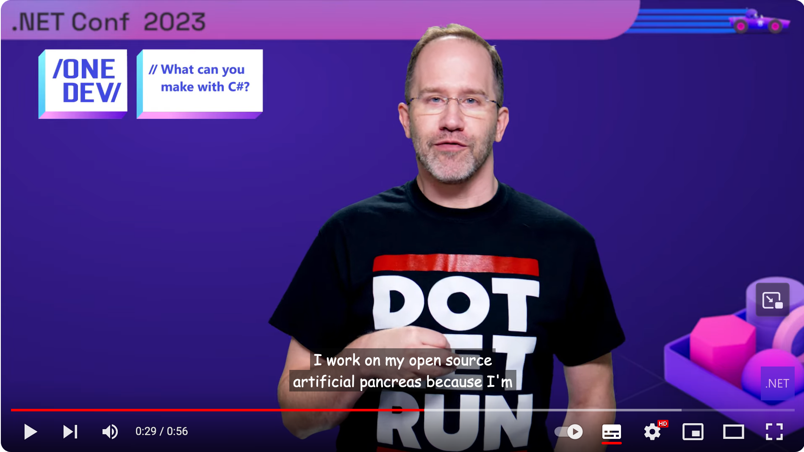

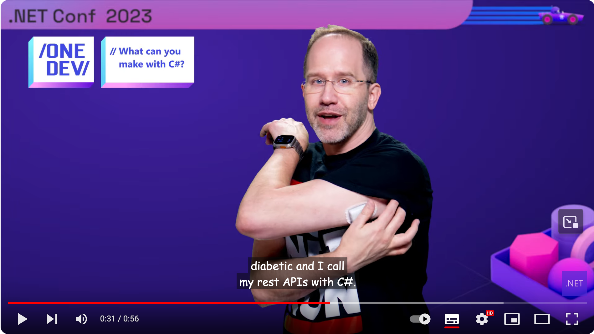

## 24.04.16

**닷넷의 최적화 기술들 예시**

[dotNET ReadToRun Compilation (R2R)](https://learn.microsoft.com/en-gb/dotnet/core/deploying/ready-to-run)

> R2R binaries improve startup performance by reducing the amount of work the just-in-time (JIT) compiler needs to do as your application loads. The binaries contain similar native code compared to what the JIT would produce. However, R2R binaries are larger because they contain both intermediate language (IL) code, which is still needed for some scenarios, and the native version of the same code. R2R is only available when you publish an app that targets specific runtime environments (RID) such as Linux x64 or Windows x64.

- JIT 가 런타임에 할 일을 미리 해주기 (precompiled/pregenerated code)
  - JIT 가 런타임에 생성하는 결과물을 미리 만들어서 애플리케이션 로드 단계에 포함시키는 것
- 하지만 코드 사이즈가 커진다. IL 코드도 같이 포함되는데 일부 시나리오에서 필요해서라고
- Linux x64 / Windows x64 등 배포 가능한 런타임이 제한된다.

> Ahead-of-time compilation has complex performance impact on application performance, which can be difficult to predict. In general, the size of an assembly will grow to between two to three times larger. This increase in the physical size of the file may reduce the performance of loading the assembly from disk, and increase working set of the process. However, in return the number of methods compiled at run time is typically reduced substantially. The result is that most applications that have large amounts of code receive large performance benefits from enabling ReadyToRun. Applications that have small amounts of code will likely not experience a significant improvement from enabling ReadyToRun, as the .NET runtime libraries have already been precompiled with ReadyToRun.

  AOT 컴파일을 수행하기 때문에, 빌드 결과 파일 사이즈가 커진다. 어셈블리가 커지고 프로세스의 Working Set 이 늘어난다.
  런타임 중에 컴파일을 거의 하지 않기 때문에 성능이 획기적으로 향상된다.

[performance_improvements_in_net_7/#pgo)](https://devblogs.microsoft.com/dotnet/performance_improvements_in_net_7/#pgo)

- PGO: Profile Guided Optimization
- [runtimedocsdesignfeaturesDynamicPgo.md at main · dotnetruntime](https://github.com/dotnet/runtime/blob/main/docs/design/features/DynamicPgo.md)

> PGO has been around for a long time, in any number of languages and compilers. The basic idea is you compile your app, asking the compiler to inject instrumentation into the application to track various pieces of interesting information. You then put your app through its paces, running through various common scenarios, causing that instrumentation to “profile” what happens when the app is executed, and the results of that are then saved out. The app is then recompiled, feeding those instrumentation results back into the compiler, and allowing it to optimize the app for exactly how it’s expected to be used. This approach to PGO is referred to as “static PGO,” as the information is all gleaned ahead of actual deployment, and it’s something .NET has been doing in various forms for years.
>
> Dynamic PGO takes advantage of tiered compilation. I noted that the JIT instruments the tier-0 code to track how many times the method is called, or in the case of loops, how many times the loop executes. It can instrument it for other things as well. For example, it can track exactly which concrete types are used as the target of an interface dispatch, and then in tier-1 specialize the code to expect the most common types (this is referred to as “guarded devirtualization,” or GDV).

[performance_improvements_in_net_7/#bounds-check-elimination](https://devblogs.microsoft.com/dotnet/performance_improvements_in_net_7/#bounds-check-elimination)

> One of the things that makes .NET attractive is its safety. The runtime guards access to arrays, strings, and spans such that you can’t accidentally corrupt memory by walking off either end; if you do, rather than reading/writing arbitrary memory, you’ll get exceptions. Of course, that’s not magic; it’s done by the JIT inserting bounds checks every time one of these data structures is indexed.

[performance_improvements_in_net_7/#loop-hoisting-and-cloning](https://devblogs.microsoft.com/dotnet/performance_improvements_in_net_7/#loop-hoisting-and-cloning)

ChatGPT: 프로그래밍에서 "loop hoisting"은 일반적으로 코드 최적화 기법 중 하나로 사용되며, 특히 반복문의 실행 속도를 향상시키기 위해 사용됩니다. 이 기법은 반복문 내부에서 반복적으로 실행되지만 반복마다 결과가 변하지 않는 연산이나 명령을 반복문의 외부로 이동시키는 과정을 말합니다. 즉, 반복문의 효율성을 높이기 위해 불필요하게 여러 번 수행되는 연산을 줄이는 것이 목표입니다.

[performance_improvements_in_net_7/#folding-propagation-and-substitution](https://devblogs.microsoft.com/dotnet/performance_improvements_in_net_7/#folding-propagation-and-substitution)

- 상수 폴딩(Constant Folding): 이 최적화 기법은 실행 시간이 아닌 컴파일 시간에 상수 표현식을 평가하는 것을 포함합니다. 예를 들어, 2 + 2와 같은 표현을 컴파일 중에 4로 대체하면 프로그램 실행 시 필요한 계산이 줄어듭니다.
- 상수 전파(Constant Propagation): 이 기법은 알려진 상수의 값을 표현식에 대체하는 것을 포함합니다. 변수가 상수 값에 할당되면 이 값은 변수가 사용되는 곳마다 직접 대체됩니다. 예를 들어, x = 3이라면 y = x + 2 표현식은 컴파일 중에 y = 5로 대체됩니다.

> Constant propagation is intricately linked to constant folding and is essentially just the idea that you can substitute a constant value (typically one computed via constant folding) into further expressions, at which point they may also be able to be folded.

- 상수 전파는 상수 접기와 복잡하게 연결되어 있으며, 본질적으로 상수 값(일반적으로 상수 접기를 통해 계산된 값)을 다른 표현식으로 대체할 수 있으며, 그 시점에서 접을 수도 있다는 아이디어에 불과합니다.

[performance_improvements_in_net_7/#inlining](https://devblogs.microsoft.com/dotnet/performance_improvements_in_net_7/#inlining)

inlining 이 메서드 호출 오버헤드를 제거하게 해줌. 메서드 코드 사이즈가 짧다면 인라이닝의 혜택을 받기 좋음.

> The bigger wins are due to the callee’s code being exposed to the caller’s code, and vice versa. So, for example, if the caller is passing a constant as an argument to the callee, if the method isn’t inlined, the compilation of the callee has no knowledge of that constant, but if the callee is inlined, all of the code in the callee is then aware of its argument being a constant value, and can do all of the optimizations possible with such a constant, like dead code elimination, branch elimination, constant folding and propagation, and so on.

- 더 큰 이점은 호출자의 코드가 호출자의 코드에 노출되기 때문이며, 그 반대의 경우도 마찬가지입니다. 예를 들어 호출자가 호출자에게 상수를 인자로 전달할 때 메서드가 인라인이 아닌 경우 호출자의 컴파일은 해당 상수를 알지 못하지만 호출자가 인라인이면 호출자의 모든 코드가 해당 인수가 상수 값임을 인식하고 죽은 코드 제거, 분기 제거, 상수 접기 및 전파 등과 같이 해당 상수로 가능한 모든 최적화를 수행할 수 있게 됩니다.

아래는 캐시에 대한 관점

>  As with any cache, the more times you need to read from memory to populate it, the less effective the cache will be. If you have a function that gets inlined into 100 different call sites, every one of those call sites’ copies of the callee’s instructions are unique, and calling each of those 100 functions could end up thrashing the instruction cache; in contrast, if all of those 100 functions “shared” the same instructions by simply calling the single instance of the callee, it’s likely the instruction cache would be much more effective and lead to fewer trips to memory.

- 다른 캐시와 마찬가지로, 캐시를 채우기 위해 메모리에서 읽어야 하는 횟수가 많을수록 캐시의 효율성은 떨어집니다. 100개의 서로 다른 호출 사이트로 인라인되는 함수가 있는 경우 각 호출 사이트의 호출자 인스트럭션 복사본은 모두 고유하므로 100개의 함수를 각각 호출하면 인스트럭션 캐시가 낭비될 수 있지만, 반대로 100개의 모든 함수가 호출자의 단일 인스턴스를 호출하여 동일한 인스트럭션을 '공유'한다면 인스트럭션 캐시가 훨씬 더 효과적이고 메모리로 이동하는 횟수가 줄어들 수 있습니다.

[performance-improvements-in-net-8/#branching](https://devblogs.microsoft.com/dotnet/performance-improvements-in-net-8/#branching)

> Branching is integral to all meaningful code; while some algorithms are written in a branch-free manner, branch-free algorithms typically are challenging to get right and complicated to read, and typically are isolated to only small regions of code. For everything else, branching is the name of the game. Loops, if/else blocks, ternaries… it’s hard to imagine any real code without them. Yet they can also represent one of the more significant costs in an application. Modern hardware gets big speed boosts from pipelining, for example from being able to start reading and decoding the next instruction while the previous ones are still processing. That, of course, relies on the hardware knowing what the next instruction is. If there’s no branching, that’s easy, it’s whatever instruction comes next in the sequence. For when there is branching, CPUs have built-in support in the form of branch predictors, used to determine what the next instruction most likely will be, and they’re often right… but when they’re wrong, the cost incurred from that incorrect branch prediction can be huge. Compilers thus strive to minimize branching.

- 브랜치는 모든 의미 있는 코드에 필수적인 요소
  - 루프, if/else 블록, 삼항식... 분기가 없는 실제 코드는 상상하기 어려움.
- 그러나 이러한 요소는 애플리케이션에서 가장 큰 비용 중 하나가 될 수도 있습니다.
  - 최신 하드웨어는 파이프라이닝을 통해 이전 명령어가 처리되는 동안 다음 명령어를 읽고 디코딩을 시작할 수 있기 때문에 속도가 크게 향상.
  - 물론 이는 다음 명령어가 무엇인지 알고 있는 하드웨어에 달려 있습니다. 분기가 없는 경우에는 시퀀스에서 다음에 오는 명령어가 무엇이든 간단합니다.
  - 분기가 있는 경우 CPU는 분기 예측기(branch predictors)라는 내장 기능을 통해 다음 명령어 예측
    - 보통은 맞아 떨어지지만 얘측이 틀리는 경우에는 큰 비용이 발생할 수 있다.
- 따라서 dotnet8 컴파일러는 브랜치를 최소화하기 위해 노력

[performance-improvements-in-net-8/#non-gc-heap](https://devblogs.microsoft.com/dotnet/performance-improvements-in-net-8/#non-gc-heap)

> What if we could ensure that the string object for this literal is created some place where it would never move, for example on the Pinned Object Heap (POH)? Then the JIT could avoid the indirection and instead just hardcode the address of the string, knowing that it would never move. Of course, the POH guarantees objects on it will never move, but it doesn’t guarantee addresses to them will always be valid; after all, it doesn’t root the objects, so objects on the POH are still collectible by the GC, and if they were collected, their addresses would be pointing at garbage or other data that ended up reusing the space.
>
> To address that, .NET 8 introduces a new mechanism used by the JIT for these kinds of situations: the Non-GC Heap (an evolution of the older “Frozen Segments” concept used by Native AOT). The JIT can ensure relevant objects are allocated on the Non-GC Heap, which is, as the name suggests, not managed by the GC and is intended to store objects where the JIT can prove the object has no references the GC needs to be aware of and will be rooted for the lifetime of the process, which in turn implies it can’t be part of an unloadable context.

- Non-GC 힙(네이티브 AOT에서 사용하던 "Frozen Segments” 개념의 발전된 형태인)
- JIT는 이름에서 알 수 있듯이 GC가 관리하지 않는 비 GC 힙에 관련 객체가 할당되도록 할 수 있으며, JIT가 객체에 GC가 알아야 할 참조가 없고 프로세스 수명 동안 루팅될 것임을 증명할 수 있는 객체를 저장하기 위한 것으로, 이는 다시 말해 언로드할 수 없는 컨텍스트의 일부가 될 수 없음을 뜻합니다.

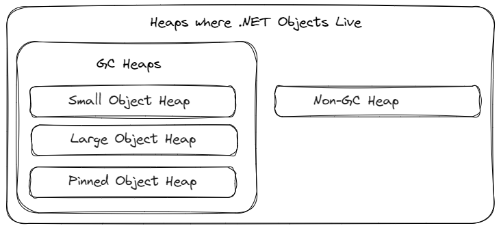

[performance-improvements-in-net-8/#constant-folding#zeroing](https://devblogs.microsoft.com/dotnet/performance-improvements-in-net-8/#constant-folding#zeroing)

> The JIT frequently needs to generate code that zeroes out memory. Unless you’ve used **[SkipLocalsInit]**, for example, any stack space allocated with **stackalloc** needs to be zeroed, and it’s the JIT’s responsibility to generate the code that does so. Consider this benchmark:

- zeroing 수행 시 벡터 연산(SIMD) 활용

[performance-improvements-in-net-8/#constant-folding#peephole-optimizations](https://devblogs.microsoft.com/dotnet/performance-improvements-in-net-8/#constant-folding#peephole-optimizations)

- 엿보기 구멍 최적화

> A “peephole optimization” is one in which a small sequence of instructions is replaced by a different sequence that is expected to perform better. This could include getting rid of instructions deemed unnecessary or replacing two instructions with one instruction that can accomplish the same task. Every release of .NET features a multitude of new peephole optimizations, often inspired by real-world examples where some overhead could be trimmed by slightly increasing code quality, and .NET 8 is no exception.

- 광범위하게 발견되는 사례들을 (그러나 카테고리를 만들고 분류하기에는 너무 사소한) 최적화하는 기법들
- 작은 크기의 명령어 집합이 더 나은 성능이 기대되는 다른 명령어로 대체하는 것
- 불필요한 명령어를 제거하거나 두 개의 명령어를 동일한 작업을 수행할 수 있는 하나의 명령어로 대체 등등

> - dotnet/runtime#73120 from @dubiousconst282 and dotnet/runtime#74806 from @En3Tho improved the handling of the common bit-test patterns like (x & 1) != 0.
> - dotnet/runtime#77874 gets rid of some unnecessary casts in a method like short Add(short x, short y) => (short)(x + y).
> - dotnet/runtime#76981 improves the performance of multiplying by a number that’s one away from a power of two, by replacing an imul instruction with a three-instruction mov/shl/add sequence, and dotnet/runtime#77137 improves other multiplications by a constant via replacing a mov/shl sequence with a single lea.
> - dotnet/runtime#78786 from @pedrobsaila fuses together separate conditions like value < 0 || value == 0 into the equivalent of value <= 0.
> - dotnet/runtime#82750 eliminates some redundant cmp instructions.
> - dotnet/runtime#79630 avoids an unnecessary and in a method like static byte Mod(uint i) => (byte)(i % 256).
> - dotnet/runtime#77540 from @AndyJGraham, dotnet/runtime#84399, and dotnet/runtime#85032 optimize pairs of load and store instructions and replace them with a single ldp or stp instruction on Arm.
> - dotnet/runtime#84350 similarly optimizes pairs of str wzr instructions to be str xzr instructions.
> - dotnet/runtime#83458 from @SwapnilGaikwad optimizes some redundant memory loads on Arm by replacing some ldr instructions with mov instructions.
> - dotnet/runtime#83176 optimizes an x < 0 expression from emitting a cmp/cset sequence on Arm to instead emitting an lsr instruction.
> - dotnet/runtime#82924 removes a redundant overflow check on Arm for some division operations.
> - dotnet/runtime#84605 combines an lsl/cmp sequence on Arm into a single cmp.
> - dotnet/runtime#84667 combines neg and cmp sequences into use of cmn on Arm.
> - dotnet/runtime#79550 replaces mul/neg sequences on Arm with mneg.

- 기타 등등...

## 24.04.17

[The Single Language Productivity Myth](https://www.breakneck.dev/blog/single-language-myth)

프로젝트를 단일 언어로 구성할 시 기대할 수 있는 장점

    You only have to learn a single language
    You can share code between frontend and backend
    You get type safety between backend and frontend
    Easier deployment

그래서 정말 그럴지...?? 파고들어보는데

1. 단 하나의 언어만 공부하면 된다.

In any real project, you already use so many languages and tool.

    Html
    Css
    Javascript
    Typescript
    Tailwind
    SQL
    Prisma
    Vite
    Yaml
    Docker
    Vercel
    Serverless vs Server
    8 .config.js files

> You switch between so many languages, tools and systems constantly. One more is not gonna kill your productivity.

- 이미 많은 언어와 도구를 알고 있거나 사용하고 있을 것이고 여기서 하나를 더 추가한다고 생산성이 비극적으로 감소하진 않을 것

> Knowing "frontend" javascript gives you almost no advantage once want to create a server that takes in requests and responds back with json.

- "프론트 엔드" 자바스크립트에 익숙하다는 점이 당신이 서버를 새로 만들 때 큰 도움이 되진 않을 것이다.

If you want to learn that you have to learn

    SQL
    How to model your tables / entities
    Prisma (ORM)
    How to authenticate on the server
    How to run long running, expensive stuff in the background
    How do you even route incoming requests?
    How do you respond back with json?
    How do you respond with a 404? When do you respond with a 404?
    How do you do middleware?
    How do you accept a file upload and store it somewhere?
    How do you generate an openAPI definition? What even is that?
    Wtf is this cors thing?
    Where do you host it?
    How do you set up your pipelines to deploy automatically?

> Imagine having to figure all these out for the first time in a node app vs a c# app.
> 
> No matter how experienced you are in frontend javascript, you gain basically nothing by choosing node over c# over go over django.
> 
> Knowing react does not significantly improve your speed in learning or implementing any of these.

2. 백엔드와 프론트엔드 간의 공유되는 코드를 사용할 수 있다.

It's amazing in theory, it just doesn't really work out in reality. What happens most of the time is that one class tries to do too much.

This is especially appearant in the case of entity classes that also describe the shape of the database tables.

  This goes out of control every single time.  
  Most people have caught onto different dto or model classes by now.

Especially validation trips people up, because they think about "the" validation.  
But there are actually 3 different types of validation here. Client side, api level, database level.

These 3 levels of the system just don't map 1:1 and if you try to make it work (which sadly you can) you will find yourself drowning in complexity.

- 공유 코드의 단점은 분명히 있음. 서버와 클라에서 둘 다 쓰이는 코드라면 하는 일이 너무 많아질 수 있다.
  - ORM 에 대응하는 dto 역할의 클래스가 클라에서도 사용되는 경우
  - 서버 <-> 클라 간 인터페이스에서 이 dto 객체에 대해 추가 검증 요구 사항이 새로 생기고 + 데이터베이스 레이어에서 마찬가지로 dto 에 대해 추가 검증을 요구하는 경우
  - 하나의 dto 타입에 대해 DB 레이어 검증/ 통신 레이어 검증 코드가 자라나게 된다.
- 이 부분은 주장이 좀 빈약하지 싶다

1. 백엔드와 프론트엔드 간 타입 세이프를 보장 가능

This is just not really a big deal with modern tools like openAPI / swagger.

I have type safety between my AspNetCore backend and my NextJs frontend too.
I just have to generate a client from my automatically generated openAPI contract with one command.
npx swagger-typescript-api -p ./../backend/Schema.yaml -o ./src/api -n api.ts --axios

and now I call my typesafe endpoints like this
let launches = await api.getTodaysLaunchesEndpoint();

- 상호 언어간 이런 사례들에 대비하는 도구들은 얼마든지 있다.

4. 쉬운 배포

Honestly, yea.
It definitely is easier to deploy a singular nextjs app than a nextjs app + a backend server in c#, go or even javascript.

However figuring it out shouldnt cost you any more than a day. That's if you never done it before.

- 맞는 말이지만, 그럼 둘 이상의 언어를 사용할 때 배포가 어려워지는가? 
  - 그렇게 하기 위한 방법을 배우는 것은 하루 정도 밖에 시간이 들지 않을 것이다. 배포가 크게 어렵지 않다.

## 24.04.17

[Performance Improvements in .NET 8 - .NET Blog](https://devblogs.microsoft.com/dotnet/performance-improvements-in-net-8/)

**JIT 역가상화(Devirtualize) 최적화**

> Beyond the mechanisms used to enable tiering and dynamic PGO getting better (and, did I mention, being on by default?!) in .NET 8, the optimizations it performs also get better. One of the main optimizations dynamic PGO feeds is the ability to devirtualize virtual and interface calls per call site. As noted, the JIT tracks what concrete types are used, and then can generate a fast path for the most common type; this is known as guarded devirtualization (GDV). Consider this benchmark:

- 동적 PGO 의 주요 최적화 기능 중 하나는 call site별로 가상 및 인터페이스 호출을 가상화하는 능입니다. 앞서 언급했듯이 JIT는 어떤 콘크리트 타입이 사용되는지 파악한 다음 가장 일반적인 타입에 대한 패스트 패스를 생성할 수 있으며, 이를 guarded devirtualization(GDV)라고 합니다.

[5 Rules for DTOs  Blog](https://ardalis.com/5-rules-dtos/?ref=dailydev)

- [(132) 5 Rules For DTOs - YouTube](https://www.youtube.com/watch?v=W4n9x_qGpT4)
- C# 기반 코드를 예시로 들어서 설명

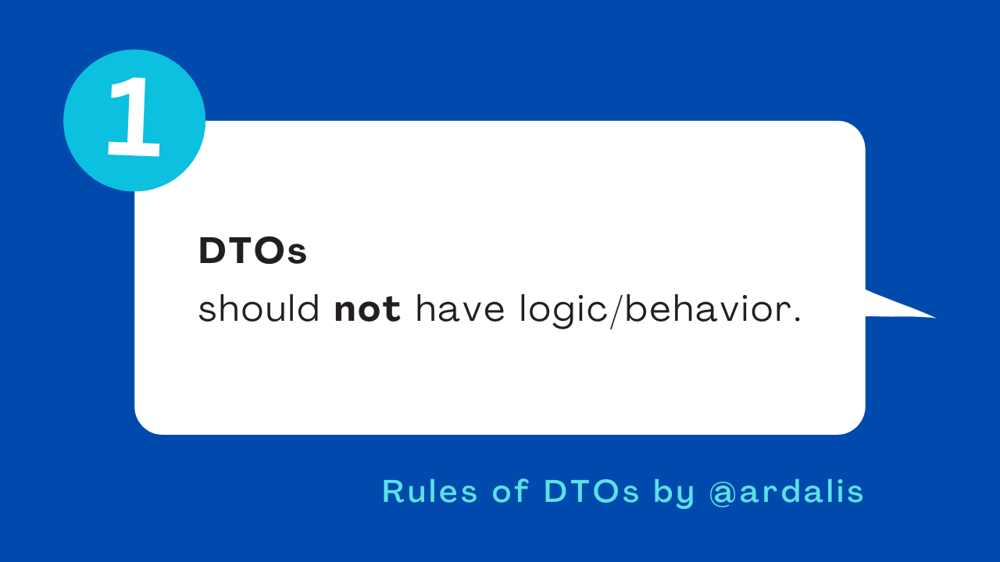

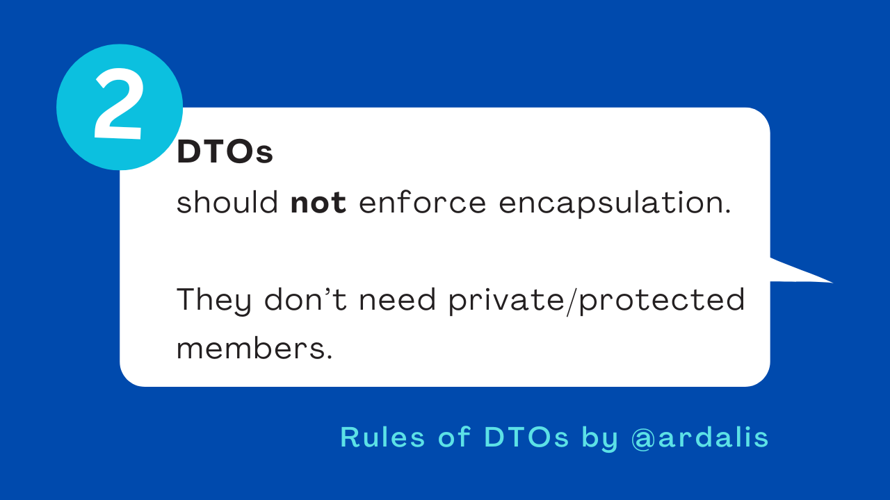

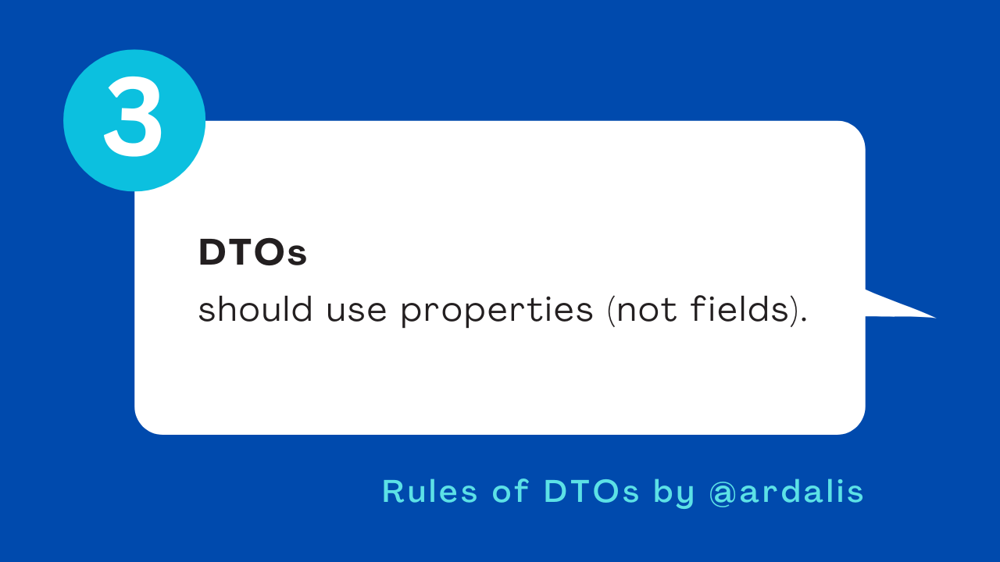

> Now, even though DTOs don't need encapsulation, it's still generally preferred to use C# properties rather than fields. By default, serializers and other language features work on properties but not fields (though you can configure this). Rule 3:

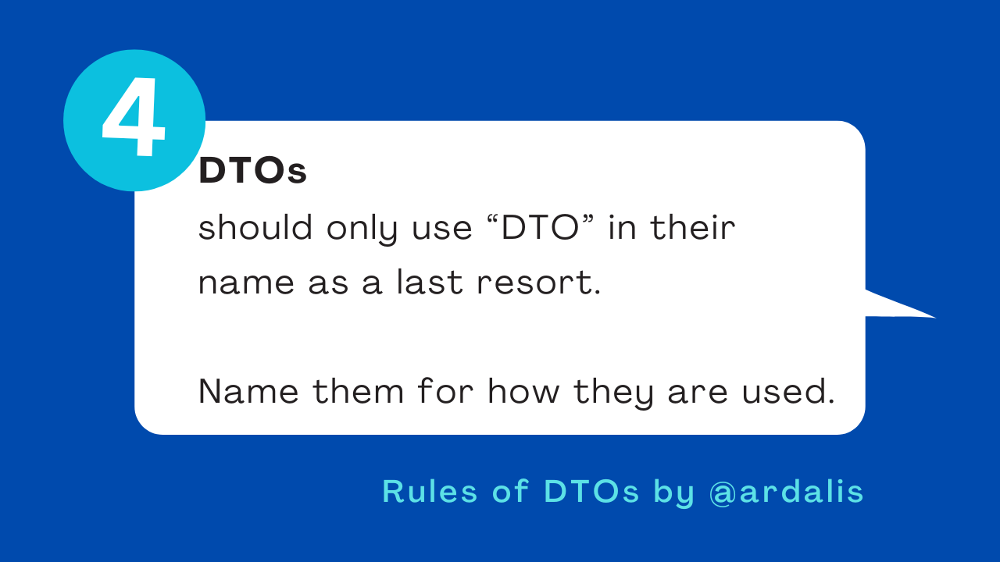

> Here are some of the things that should be DTOs, and should be named according to their particular use, rather than naming them "FooDTO"

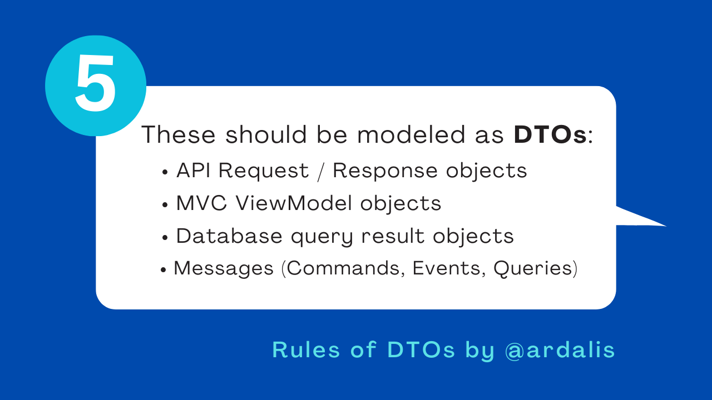

[(132) .NET Configuration In Depth  .NET Conf 2023 - YouTube](https://www.youtube.com/watch?v=aOXaBZFB0-0)

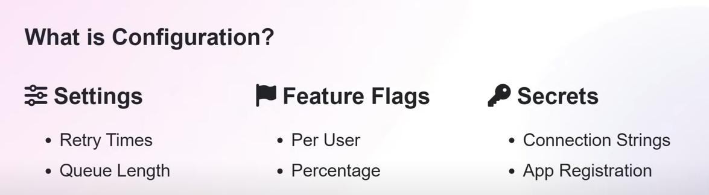

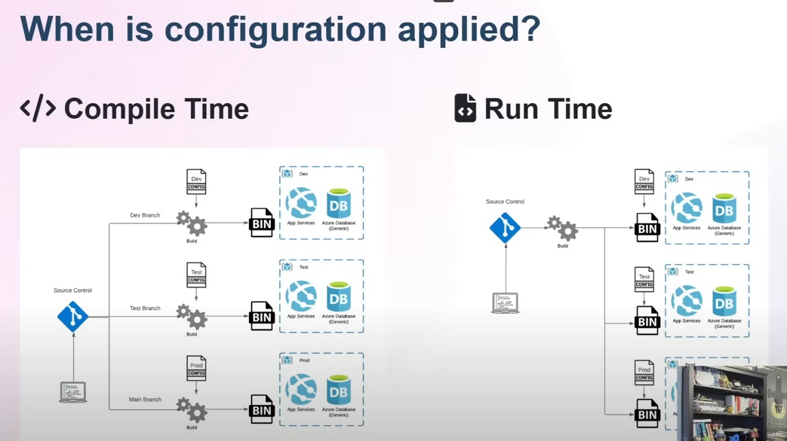

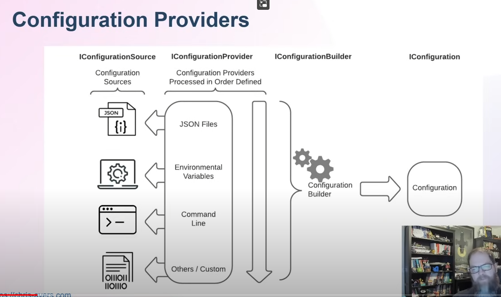

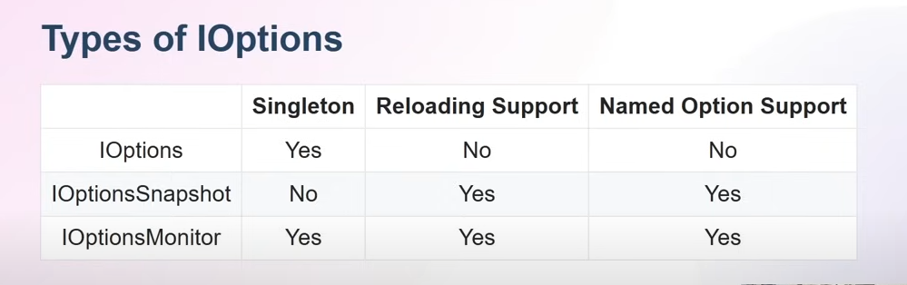

dotnet 의 configuration 기능에 대한 강연 세션

- 애플리케이션의 구성 및 옵션 정보에 대한 분류를 설명
- 다양한 사례를 수집해 일반화된 기능을 제공함.
  - config 정보를 정적 혹은 동적으로 제공할 수 있음
  - config 의 소스는 파일 형태(Json) / Azure 등 외부 서비스의 데이터 / 프로세스 실행 인자(args)
    - config 의 소스가 어느 곳이라도 맞춤 솔루션을 가지고 있음
  - config 의 사용처가, 범주에 따라 필요한 option 을 전달받도록 제한

[Fearless Security Memory Safety - Mozilla Hacks - the Web developer blog](https://hacks.mozilla.org/2019/01/fearless-security-memory-safety/)

**What Is Memory Safety**

> When we talk about building secure applications, we often focus on memory safety. Informally, this means that in all possible executions of a program, there is no access to invalid memory. Violations include:

- use after free / 이미 반환된 메모리를 사용
- double free / 중복 반환
  - 스마트 포인터 / GC / 혹은 ownership (Rust) 로 방지
- null pointer dereference / Null 포인터 참조
  - Rust prevents null pointer dereferencing two ways:
    - Avoiding nullable pointers (with special OptionType)
    - Avoiding raw pointer dereferencing
- using uninitialized memory / 초기화되지 않은 메모리 사용
- buffer overflow / 버퍼 오버플로우
  - - bound checks 로 방지

## 24.04.18

[LRitzdorfTheJeffDeanFacts A consolidated list of the Jeff Dean Facts!](https://github.com/LRitzdorf/TheJeffDeanFacts)

- [구글 천재 프로그래머 - YouTube](https://www.youtube.com/watch?v=VfBOPOwc1UI&list=WL&index=16)
- 구글 천재 프로그래머 제프 딘(Jeff Dean) 에 관한 밈

> Compilers don't warn Jeff Dean. Jeff Dean warns compilers.

- 컴파일러는 Jeff Dean 에게 경고를 하지 않는다. Jeff Dean 은 컴파일러에게 경고를 한다.

[Latency Numbers Every Programmer Should Know](https://gist.github.com/jboner/2841832)

### Latency numbers every programmer should know
    L1 cache reference ......................... 0.5 ns
    Branch mispredict ............................ 5 ns
    L2 cache reference ........................... 7 ns
    Mutex lock/unlock ........................... 25 ns
    Main memory reference ...................... 100 ns             
    Compress 1K bytes with Zippy ............. 3,000 ns  =   3 µs
    Send 2K bytes over 1 Gbps network ....... 20,000 ns  =  20 µs
    SSD random read ........................ 150,000 ns  = 150 µs
    Read 1 MB sequentially from memory ..... 250,000 ns  = 250 µs
    Round trip within same datacenter ...... 500,000 ns  = 0.5 ms
    Read 1 MB sequentially from SSD* ..... 1,000,000 ns  =   1 ms
    Disk seek ........................... 10,000,000 ns  =  10 ms
    Read 1 MB sequentially from disk .... 20,000,000 ns  =  20 ms
    Send packet CA->Netherlands->CA .... 150,000,000 ns  = 150 ms

Assuming ~1GB/sec SSD

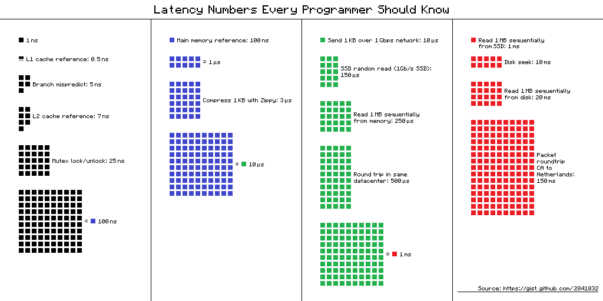

Visual chart provided by [ayshen](https://gist.github.com/ayshen)

Data by [Jeff Dean](http://research.google.com/people/jeff/)

Originally by [Peter Norvig](http://norvig.com/21-days.html#answers)

Compiled by [github.com/hellerbarde](https://gist.github.com/hellerbarde/2843375)

## 24.04.19

[Introducing .NET Core - .NET Blog](https://devblogs.microsoft.com/dotnet/introducing-net-core/)

- 과거의 닷넷은 Set of Verticals, 수직 구조의 집합

> When we originally shipped the .NET Framework in 2002 there was only a single framework. Shortly after, we released the .NET Compact Framework which was a subset of the .NET Framework that fit within the footprint of smaller devices, specifically Windows Mobile. The compact framework was a separate code base from the .NET Framework. It included the entire vertical: a runtime, a framework, and an application model on top.
> 
> Since then, we’ve repeated this subsetting exercise many times: Silverlight, Windows Phone and most recently for Windows Store. This yields to fragmentation because the .NET Platform isn’t a single entity but a set of platforms, owned by different teams, and maintained independently.
> 
> Of course, there is nothing wrong with offering specialized features in order to cater to a particular need. But it becomes a problem if there is no systematic approach and specialization happens at every layer with little to no regards for corresponding layers in other verticals. The outcome is a set of platforms that only share APIs by the fact that they started off from a common code base. Over time this causes more divergence unless explicit (and expensive) measures are taken to converge APIs.

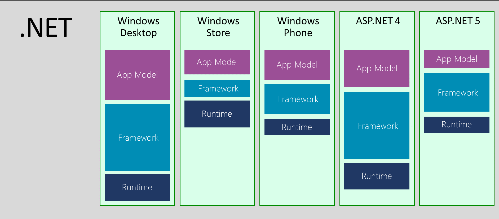

불행히도 이 수직 구조 간에 공유 코드가 지원되지 않았음

- 닷넷의 버전 업데이트, 그리고 호환성과의 사투

> Unfortunately, we’ve also learned that even compatible changes can break applications. Let me provide a few examples

    Adding an interface to an existing type can break applications because it might interfere with how the type is being serialized.
    Adding an overload to a method that previously didn’t had any overloads can break reflection consumers that never handled finding more than one method.
    Renaming an internal type can break applications if the type name was surfaced via a ToString() method.

> .NET Core is a modular implementation that can be used in a wide variety of verticals, scaling from the data center to touch based devices, is available as open source, and is supported by Microsoft on Windows, Linux and Mac OSX.
>
> Let me go into a bit more detail of how .NET Core looks like and how it addresses the issues I discussed earlier.

버전 업데이트를 진행해도 대부분 문제없는 것은 사실. 하지만 99.9%가 멀쩡해도 0.1%의 사용사례에서 호환성 문제가 있다면

.NET 기반 프로세스가 돌아가는 18억개의 장비 중 180만개의 장비가 장애를 겪게 됨

그것도 런타임 중에 그러니까 고객 대응 중에 문제가 발생한다면 경우에 따라 치명적일 수 있음

- Birth of portable class libraries(PCL) / 해결책으로 PCL 도입

> Originally, there was no concept of code sharing across verticals. No portable class libraries, no shared projects. You were essentially stuck with creating multiple projects, linked files, and #if. This made targeting multiple verticals a daunting task.
> 
> In the Windows 8 timeframe we came up with a plan to deal with this problem. When we designed the Windows Store profile we introduced a new concept to model the subsetting in a better way: contracts.
> 
> Originally, the .NET Framework was designed around the assumption that it’s always deployed as a single unit, so factoring was not a concern. The very core assembly that everything else depends on is mscorlib. The mscorlib provided by the .NET Framework contains many features that that can’t be supported everywhere (for example, remoting and AppDomains). This forces each vertical to subset even the very core of the platform. This made it very complicated to tool a class library experience that lets you target multiple verticals.
> 
> The idea of contracts is to provide a well factored API surface area. Contracts are simply assemblies that you compile against. In contrast to regular assemblies contract assemblies are designed around proper factoring. We deeply care about the dependencies between contracts and that they only have a single responsibility instead of being a grab bag of APIs. Contracts version independently and follow proper versioning rules, such as adding APIs results in a newer version of the assembly.
> 
> We’re using contracts to model API sets across all verticals. The verticals can then simply pick and choose which contracts they want to support. The important aspect is that verticals must support a contract either wholesale or not at all. In other words, they can’t subset the contents of a contract.
> 
> This allows reasoning about the API differences between verticals at the assembly level, as opposed to the individual API level that we had before. This aspect enabled us to provide a class library experience that can target multiple verticals, also known as portable class libraries.

> Two years ago, we’ve started to ship libraries on NuGet. Since we didn’t add those libraries to the .NET Framework we refer to them as “out-of-band”. Out-of- band libraries don’t suffer from the problem we just discussed because they are application-local. In other words, the libraries are deployed as if they were part of your application.
> 
> This pretty much solves all the problems that prevent you from upgrading to a later version. Your ability to take a newer version is only limited by your ability to release a newer version of your application. It also means you’re in control which version of the library is being used by a specific application. Upgrades are done in the context of a single application without impacting any other application running on the same machine.
> 
> This enables us to release updates in a much more agile fashion. NuGet also provides the notion of preview versions which allow us to release bits without yet committing on a specific API or behavior. This supports a workflow where we can provide you with our latest design and – if you don’t like it – simply change it. A good example of this is immutable collections. It had a beta period of about nine months. We spend a lot of time trying to get the design right before we shipped the very first version. Needless to say that the final design – thanks to the extensive feedback you provided – is way better than the initial version.

- 닷넷 코어 -> Nuget Package 의 집합으로 구성시켜버리기

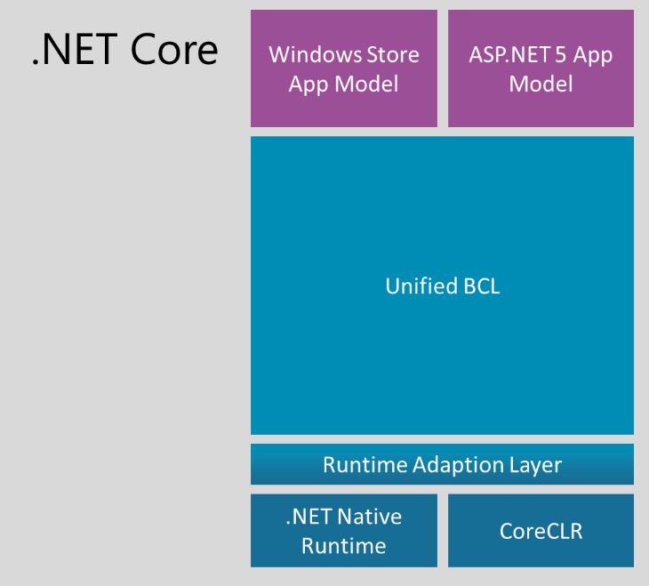

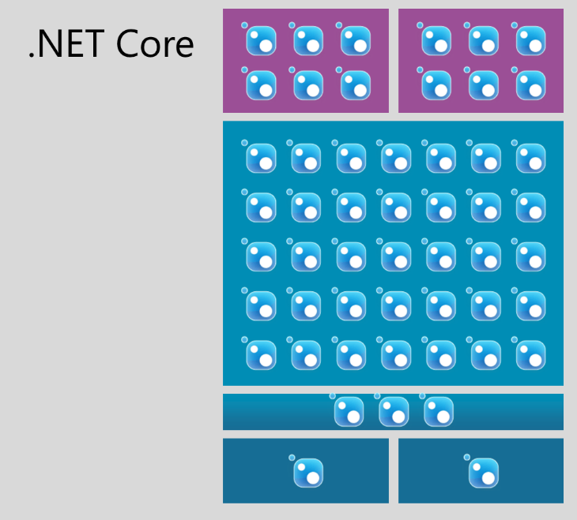

> NuGet allows us to deliver .NET Core in an agile fashion. So if we provide an upgrade to any of the NuGet packages, you can simply upgrade the corresponding NuGet reference.
> 
> Delivering the framework itself on NuGet also removes the difference between expressing 1st party .NET dependencies and 3rd party dependencies – they are all NuGet dependencies. This enables a 3rd party package to express, for instance, that they need a higher version of the System.Collections library. Installing this 3rd party package can now prompt you to upgrade your reference to System.Collections. You don’t have to understand the dependency graph – you only need to consent making changes to it.
> 
> The NuGet based delivery also turns the .NET Core platform into an app-local framework. The modular design of .NET Core ensures that each application only needs to deploy what it needs. We’re also working on enabling smart sharing if multiple applications use the same framework bits. However, the goal is to ensure that each application is logically having its own framework so that upgrading doesn’t interfere with other applications running on the same machine.
> 
> Our decision to use NuGet as a delivery mechanism doesn’t change our commitment to compatibility. We continue to take compatibility extremely seriously and will not perform API or behavioral breaking changes once a package is marked as stable. However, the app-local deployment ensures that the rare case where a change that is considered additive breaks an application is isolated to development time only. In other words, for .NET Core these breaks can only occur after you upgraded a package reference. In that very moment, you have two options: addressing the compat glitch in your application or rolling back to the previous version of the NuGet package. But in contrast to the .NET Framework those breaks will not occur after you deployed the application to a customer or the production server.

## 24.04.20

[Dynamic PGO in .NET 6.0.md](https://gist.github.com/EgorBo/dc181796683da3d905a5295bfd3dd95b)

## What exactly PGO can optimize for us?
1) **Profile-driving inlining** - inliner relies on PGO data and can be very aggressive for hot paths and care less about cold ones, see [dotnet/runtime#52708](https://github.com/dotnet/runtime/pull/52708) and [dotnet/runtime#55478](https://github.com/dotnet/runtime/pull/55478). A good example where it has visible effects is [this](https://twitter.com/EgorBo/status/1451149444183990273) StringBuilder benchmark:


2) **Guarded devirtualization** - most monomorphic virtual/interface calls can be devirtualized using PGO data, e.g.:
```csharp
void DisposeMe(IDisposable d)
{
    d.Dispose();
}
```
It looks like nothing can be optimized here, right? Just an ordinary virtual (interface) call on top of an unknown object that will go through several indirects to call the actual Dispose() implementation and its body will never be inlined here. Now let's see what PGO can do here.  
With Dynamic PGO on, this method will be compiled to something like this in tier0 (in machine code):
```diff
void DisposeMe(IDisposable d)
{
+   call CORINFO_HELP_CLASSPROFILE32(d, offset);
    d.Dispose();
}
```
We now poll that `d` for its underlying type every call of that method. Yes, it makes it slightly slower, but eventually it will be re-compiled to tier1 to something like this:

```diff
void DisposeMe(IDisposable d)
{
+   if (d is MyType)           // E.g. Profile states that Dispose here is 'mostly' called on MyType.
+       ((MyType)d).Dispose(); // Direct call - can be inlined now!
+   else
        d.Dispose();           // a cold fallback, just in case
}
```

&nbsp;&nbsp;&nbsp;&nbsp;*^ codegen diff for a case where MyType::Dispose is empty*

  
3) **Hot-cold block reordering** - JIT re-orders blocks to keep hot ones closer to each other and pushes cold ones to the end of the method. The following code:
```csharp
void DoWork(int a)
{
    if (a > 0)
        DoWork1();
    else
        DoWork2();
}
```
Is compiled like this in tier0:
```diff
void DoWork(int a)
{
    if (a > 0)
+       __block_0_counter++;
        DoWork1();
    else
+       __block_1_counter++;
        DoWork2();
}
```
And again: once it's recompiled to tier1 it is optimized into:
```diff
void DoWork(int a)
{
    // E.g. __block_0_counter is smaller or even zero => DoWork1 is rarely (never) taken
    // and JIT re-orders DoWork2 with DoWork1:
-   if (a > 0)
+   if (a <= 0)
-       DoWork2();
+       DoWork1();
    else
-       DoWork1();
+       DoWork2();
}
```
4) **Register allocation** - realistic block weights allow JIT to pick a better strategy on what to keep in registers and what to spill
5) **Misc** - some optimizations such as Loop Clonning, Inlined Casts, etc. aren't applied in cold blocks.

[Java의 미래, Virtual Thread  우아한형제들 기술블로그](https://techblog.woowahan.com/15398/)

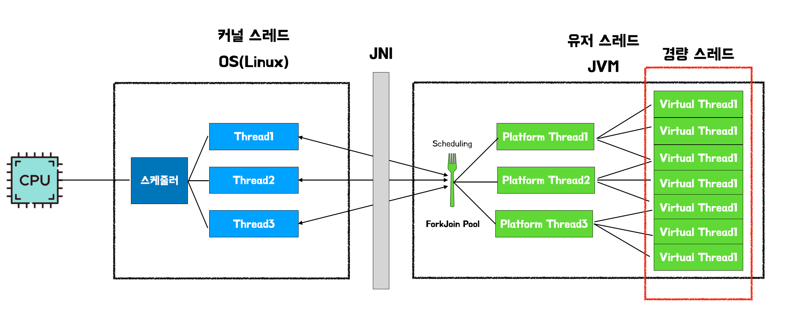

Virtual Thread는 기존 Java의 스레드 모델과 달리, 플랫폼 스레드와 가상 스레드로 나뉩니다. 플랫폼 스레드 위에서 여러 Virtual Thread가 번갈아 가며 실행되는 형태로 동작합니다. 마치 커널 스레드와 유저 스레드가 매핑되는 형태랑 비슷합니다.

여기서 가장 큰 특징은 Virtual Thread는 컨텍스트 스위칭 비용이 저렴하다는 것입니다.

|Thread | Virtual | Thread |
| ------- | ----------- | ----- |
|Stack 사이즈 |	~2MB |	~10KB|
|생성시간 |	~1ms |	~1µs| 
컨텍스트 스위칭 |	~100µs |	~10µs

Thread는 기본적으로 최대 2MB의 스택 메모리 사이즈를 가지기 때문에, 컨텍스트 스위칭 시 메모리 이동량이 큽니다. 또한 생성을 위해선 커널과 통신하여 스케줄링해야 하므로, 시스템 콜을 이용하기 때문에 생성 비용도 적지 않습니다.

하지만 Virtual Thread는 JVM에 의해 생성되기 때문에 시스템 콜과 같은 커널 영역의 호출이 적고, 메모리 크기가 일반 스레드의 1%에 불과합니다. 따라서 Thread에 비해 컨텍스트 스위칭 비용이 적습니다.

## 24.04.22

[Introducing .NET Standard - .NET Blog](https://devblogs.microsoft.com/dotnet/introducing-net-standard/)

..NET Standard : 닷넷 생태계에서 지원하는 API 집합

    .NET Standard is a set of APIs that all .NET platforms have to implement. This unifies the .NET platforms and prevents future fragmentation.
    .NET Standard 2.0 will be implemented by .NET Framework, .NET Core, and Xamarin. For .NET Core, this will add many of the existing APIs that have been requested.
    .NET Standard 2.0 includes a compatibility shim for .NET Framework binaries, significantly increasing the set of libraries that you can reference from your .NET Standard libraries.
    .NET Standard will replace Portable Class Libraries (PCLs) as the tooling story for building multi-platform .NET libraries.

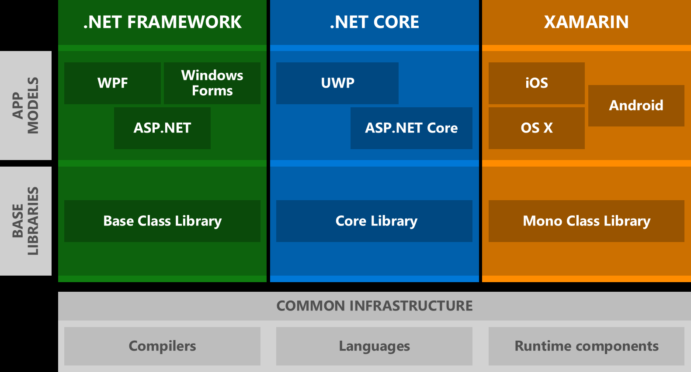

    But on the other hand, this forking poses a massive problem for developers writing code for multiple .NET platforms because there isn’t a unified class library to target:
    There are currently three major flavors of .NET, which means you have to master three different base class libraries in order to write code that works across all of them. Since the industry is much more diverse now than when .NET was originally created it’s safe to assume that we’re not done with creating new .NET platforms. Either Microsoft or someone else will build new flavors of .NET in order to support new operating systems or to tailor it for specific device capabilities.

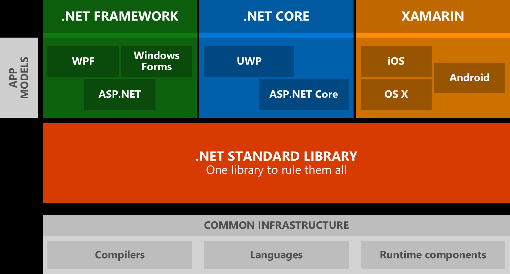

    This is where the .NET Standard comes in:
    For developers, this means they only have to master one base class library. Libraries targeting .NET Standard will be able to run on all .NET platforms. And platform providers don’t have to guess which APIs they need to offer in order to consume the libraries available on NuGet.

**What does this mean for .NET Core?**

- .NET Core 와 .NET Standard 는 엄연히 분리되어 있는 상태
- .NET Standard는 모든 플랫폼에서 검증된 API 이기 때문에, 기존 API 집합에서 새로운 것을 추가하기 위해 검증 절차가 복잡할 것임
- .NET Core는 out-of-band 들 그러니까 닷넷 전체 생태계에서 검증되지는 않았지만 닷넷 팀이 실험 운용하기 위한 도구들을 .NET Core에 실을 수 있다.
  - 개발자 피드백들을 미리 받아보고 그 후에 .NET Standard에 태우기도 한다고 함.

## 24.04.23

**C# float / decimal**

C#에서 float과 decimal은 둘 다 부동 소수점 숫자를 표현하는 데 사용되는 데이터 유형입니다. 그러나 그들 간에는 몇 가지 중요한 차이점이 있습니다.

- 정밀도와 범위:
  - float: IEEE 754 표준에 따라 32 비트 부동 소수점을 나타냅니다. 이는 대략 7자리의 유효 숫자를 가지며 대략적으로 ±1.5 x 10^(-45)에서 ±3.4 x 10^(38) 범위를 가집니다.
  - decimal: 128 비트 고정 소수점을 사용하며, 보다 높은 정밀도를 제공합니다. 약 ±1 x 10^(-28) 에서 ±7.9 x 10^(28) 범위를 가지며, 최대 28자리의 유효 숫자를 표현할 수 있습니다.
- 소수점 고정 및 부동:
  - float: 이진 부동 소수점으로 표현되어 있어서, 0이 아닌 숫자를 정확하게 표현하는 데 어려움이 있을 수 있습니다. 예를 들어, 0.1과 같은 십진수를 정확히 표현할 수 없을 수 있습니다.
  - decimal: 십진 고정 소수점으로 표현되어 있어서, 금융 및 금전 계산과 같은 정확한 값이 필요한 분야에서 유용합니다. 이로 인해 소수점 이하 숫자를 정확하게 다룰 수 있습니다.
- 메모리 사용:
  - float: 각 값이 32 비트이므로 메모리 사용량이 상대적으로 작습니다.
  - decimal: 128 비트로 각 값이 표현되므로, 메모리 사용량이 더 큽니다. 이는 대량의 숫자를 다루는 경우에는 중요한 고려 요소가 될 수 있습니다.
- 성능:
  - float은 하드웨어에서 원시적으로 지원되는 타입이므로 일반적으로 연산이 더 빠릅니다.
  - decimal은 소프트웨어로 구현되어 있으며 정밀도를 위해 더 많은 작업을 수행해야 하므로 연산 속도가 더 느릴 수 있습니다.

**해킹 관련해서**

[xz 오픈소스 공격의 전체 타임라인 정리  GeekNews](https://news.hada.io/topic?id=14122)

- 2년 넘게 "Jia Tan"이라는 이름을 사용하는 공격자가 xz 압축 라이브러리에 성실하고 효과적인 기여자로 활동하여 최종적으로 커밋 권한과 관리자 권한을 부여받음.
- 그 권한을 사용하여 Debian, Ubuntu, Fedora 및 기타 systemd 기반 Linux 시스템에서 OpenSSH sshd의 종속성이기도 한 xz의 일부인 liblzma에 매우 미묘하고 주의 깊게 숨겨진 백도어를 설치함.
- 이 백도어는 SSH 세션 시작 시 공격자가 숨겨진 명령을 보내는 것을 감시하여, 로그인하지 않고도 대상 시스템에서 임의의 명령을 실행할 수 있는 기능을 공격자에게 제공함. 인증되지 않은 대상 원격 코드 실행임.
- 이 공격은 2024년 3월 29일 공개적으로 공개되었으며, 널리 사용되는 오픈소스 소프트웨어에 대한 최초의 심각한 공급망 공격으로 보임.
- 오픈소스 공급망 보안에 있어 분수령이 될 사건임.
- 이 게시물은 2021년 말로 거슬러 올라가는 것으로 보이는 이 공격의 사회공학적 측면에 대해 구성한 자세한 타임라인임.

[XZ Utils 백도어 사건으로 돌아보는 오픈소스 생태계](https://blog.outsider.ne.kr/1714)

이번 공격 자체도 충격적이지만 비슷한 일이 반복적으로 발생하는데 상황이 나아지진 않는다고 느끼고 있다. 이전에도 비슷한 사건이 있었다.

- 2018년에는 Node.js의 [event-stream](https://github.com/dominictarr/event-stream)를 이용한 [공급망 공격이 있었다](https://snyk.io/blog/a-post-mortem-of-the-malicious-event-stream-backdoor). 2011년에 `event-stream`을 만든 Dominic Tarr는 당시 npm에만 400여 개의 모듈을 가지고 있었고 더 이상 관리되지 않던 `event-stream`에 자신이 기여하겠다고 접근해서 저장소 권한과 모듈 배포 권한을 획득한 뒤 이 안에 악성코드를 심어서 배포했다.
- 2024년에는 브라우저 간 동작 차이를 메꿔주는 `polyfill.js`를 편하게 사용하도록 `polyfill.io`라는 서비스가 Funnull이라는 회사에 넘어가게 되면서 최초에 `polyfill.io`를 만들었던 사람이 공급망 공격이 우려되니 [즉시 사용을 중단하라고 경고](https://x.com/triblondon/status/1761852117579427975?s=20)했다.

`polyfill.io`는 약간 다른 부분이 있긴 하지만 `event-stream`을 포함해서 이번 사건도 오픈소스 메인테이너 부족이 근본적인 원인이 아닌가 하는 생각이 든다. 메인테이너가 10명, 20명이었다면 Jia Tan이 저렇게 메인테이너로 쉽게 들어오지도 못했을 것이고 들어왔어도 악성코드를 맘대로 커밋하지 못했을 것이다. 그렇게 보면 이런 문제 혹은 품질의 문제도 포함해서 **근본적인 원인은 오픈소스 생태계의 메인테이너들이 처한 환경이 그리 좋지 않다는 데 있다고 생각한다**.

xkcd에 [Dependency](https://xkcd.com/2347/)라는 다음과 같은 만화가 있다.


수많은 의존성을 가진 오픈소스를 사용하고 있지만 일반적으로 개발자가 직접 사용하는 유명한 프로젝트나 모던한 프로젝트에만 관심을 두지, 그 뒤에 있는 많은 프로젝트에는 관심을 가지지 않는다. 이번 XZ Utils와 마찬가지로 xkcd에서는 그중 어떤 의존성은 한 명의 메인테이너에게 완전히 의존하고 있어서 그 사람이 지치거나 더는 작업을 할 수 없게 되었을 때 전체 의존성이 깨질 수 있음을 지적한 것이다.

공급망 공격은 아니었지만 2014년 4월 OpenSSL에서 메모리에 저장된 정보를 빼갈 수 있는 [Heartbleed](https://heartbleed.com/)라는 취약점이 발견되었다. 이때 취약점과 별개로 오픈소스 생태계는 이래서 믿을 수 없다거나 어떻게 이런 버그를 모를 수 있냐 하는 얘기도 있었지만, 전 세계에서 OpenSSL에 의존하지 않는 곳이 없다시피 하지만 실패로 펀딩을 제대로 받지 못하고 [풀타임 직원이 1명뿐](http://veridicalsystems.com/blog/of-money-responsibility-and-pride/)임이 밝혀졌다. 그리고 OpenSSL에 십여 년 동안 기여하던 사람들이 [이때 펀딩이 들어오면서 처음 뒤셀도르프에서 오프라인으로 만날 수 있게 되었다](https://coolspeed.wordpress.com/2015/02/16/unseeable_comrade_in_arms/)는 얘기에 놀라기도 했다.(이때 이분들은 온라인으로만 서로 작업하다가 15년 만에 처음 만나게 되었다.)

이런 사건들을 보면 **우리 생태계가 소수의 선의에 얼마나 기대어 있는가를 다시한번 생각하게 했다**. 여기서 **우리 생태계라고 한 것은 오픈소스 생태계뿐만 아니라 그 위에 쌓아 올린 수많은 IT 시스템도 마찬가지이기 때문이다**

## 24.04.24

[Quora 는 어떻게 죽었나  GeekNews](https://news.hada.io/topic?id=13191)

    Quora는 한때 특정 질문에 대한 답변을 찾는 데 있어 전문가의 정보를 제공하는 번성하는 커뮤니티였음
    사용자들이 이탈하면서 사이트는 의미 없고 반복적인 내용, 이상한 질문, 증오스러운 글, AI 생성 글들로 가득 차게 됨
    과거에는 구글 검색 결과 상단에서 Quora의 신중한 답변을 볼 수 있었지만, 이제는 터무니없는 질문과 답변이 검색 결과에 나타남

## Quora의 초기 장점과 커뮤니티

    Quora는 소셜 네트워킹을 염두에 두고 설계되었으며, 전문가들이 지식을 공유하고 커뮤니티를 구축할 수 있는 플랫폼이었음
    초기 멤버들은 Quora의 질 높은 답변과 질문, 활발한 모더레이션, 사용자 중심의 사이트 구조를 높이 평가함
    Quora는 전문가들에게 다양한 혜택을 제공하고, 긍정적인 공간을 유지하기 위해 노력했으며, 이로 인해 많은 페이지 뷰와 투자를 유치함

## Quora의 문제점과 쇠락

    Quora는 질문의 길이를 줄이고, 피드 최적화를 통해 질 낮은 콘텐츠를 홍수처럼 쏟아내기 시작함
    광고와 봇 문제, 수익 창출의 지연, 예산 삭감 등으로 인해 커뮤니티 관리와 품질 유지에 어려움을 겪음
    AI의 등장과 자동화된 모더레이션은 사이트의 질을 더욱 악
    화시킴

## AI 시대의 Quora

    Quora는 AI를 통해 질문과 답변을 생성하고, 사용자의 답변을 AI 모델 훈련에 사용할 수 있도록 서비스 약관을 변경함
    많은 사용자들이 새로운 약관에 동의하지 않고 자신의 작업을 삭제하거나 사이트를 떠남
    AI로 인해 커뮤니티의 정체성이 훼손되고, Quora가 과거의 커뮤니티와 전문성을 자동화 시스템으로 대체하려는 시도는 실패로 끝날 것으로 예상됨

## 24.04.30

[Variable-length quantity - Wikipedia](https://en.wikipedia.org/wiki/Variable-length_quantity)

- VLQ

> A variable-length quantity (VLQ) was defined for use in the standard MIDI file format[2] to save additional space for a resource-constrained system, and is also used in the later Extensible Music Format (XMF).

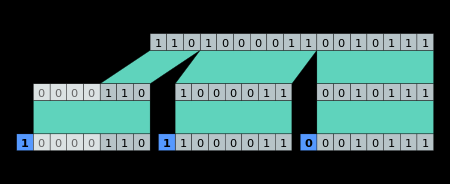

- 패킷 전송 시에 정수형 타입 바이트 사이즈를 압축하기 위해 적용
- 깃허브 코드 예시: [kstenerudgo-vlq Go implementation of the Variable Length Quantity (VLQ) type](https://github.com/kstenerud/go-vlq)

## 24.05.09

**mstsc**

- [Microsoft Learn: mstsc](https://learn.microsoft.com/ko-kr/windows-server/administration/windows-commands/mstsc)

> Creates connections to Remote Desktop Session Host servers or other remote computers and edits an existing Remote Desktop Connection (.rdp) configuration file.
>
> `mstsc.exe [<connectionfile>] [/v:<server>[:<port>]] [/g:<gateway>] [/admin] [/f <fullscreen>] [/w:<width> /h:<height>] [/public] [/multimon] [/l] [/restrictedadmin] [/remoteguard] [/prompt] [/shadow:<sessionid>] [/control] [/noconsentprompt]
mstsc.exe /edit <connectionfile>`

ChatGPT: MSTSC는 Microsoft Terminal Services Client의 약자로, Microsoft Windows 운영 체제에서 사용되는 원격 데스크톱 프로토콜의 클라이언트 응용 프로그램입니다. 이 프로그램은 원격 데스크톱 서비스를 사용하여 원격 컴퓨터에 연결하고 그 컴퓨터를 제어할 수 있도록 해줍니다. MSTSC를 사용하면 지리적으로 떨어진 컴퓨터에 원격으로 액세스하여 파일을 전송하거나 작업을 수행할 수 있습니다.

[The Decorator Pattern is sometimes helpful – The Shade Tree Developer](https://jeremydmiller.com/2024/04/29/the-decorator-pattern-is-sometimes-helpful/)

    The most common usage of a decorator for me has been to separate out some kind of infrastructural concern like logging, error handling, or security from the core behavior. Just think on this. Instrumentation, security, and error handling are all very important elements of successful production code, but how many times in your career have you struggled to comprehend, modify, or debug code that is almost completely obfuscated by technical concerns.
    
    According to the original Gang of Four book, the “Decorator Pattern”:
    
    …dynamically adds/overrides behavior in an existing method of an object.

- decorator 패턴을 wrapper 형태로 사용하는 사례
- DB로부터 데이터를 조회해 .NET object 로 바꿔주는 LoadAsync() 메서드가 있다고 하면
  - LoadAsync() 메서드를 정의하는 인터페이스 (A 인터페이스)
  - LoadAsync 메서드의 코어 역할을 수행하는 버전 (B 클래스)
  - A 인터페이스 객체를 필드로 쥐고 있으며(Nested 객체 활용), LoadAsync 호출 시 해당 객체의 LoadAsync를 호출되 에러 핸들링을 책임지는 버전 (C 클래스)
- B 클래스는 이제 코어 역할에만 집중하고, C 클래스는 Resilient 하게 역할을 수행하는 것에 초점을 맞추기 -> 역할에 분리를 달성할 수 있다.

## 24.05.10

[Don't write clean code, write CRISP code — Bitfield Consulting](https://bitfieldconsulting.com/posts/crisp-code)

- Correct
- Readable
- Idiomatic

    An obvious example of a universal convention is err: Go programmers always use this name to refer to an arbitrary error value. While we wouldn’t usually re-use variable names within the same function, we do re-use err for all the various errors that there can be throughout the function. It’s a mistake to try to avoid this by creating variant names like err2, err3, and so on.
    
    Why? Because it requires a tiny bit more cognitive effort from the reader. If you see err, your mind glides right over it with perfect understanding. If you see some other name, your mind has to stop to resolve the puzzle.
    
    I call these tiny roadblocks “cognitive microaggressions”. Each is so tiny that its individual effect is almost unnoticeable, yet they soon pile up, and if you encounter them all day and every day, they have a significant effect on your quality of life.
    
    As you write each line of code, you should be thinking “How much effort does it take to understand this? Could I reduce that somehow?” The secret of great software engineering is doing a lot of little things well.

- Simple

    One attribute that simple code tends to have is directness: it does just what it says on the tin. It doesn’t have weird and unexpected side effects, or conflate several unrelated things. Directness is inversely related to concision: if there are three similar tasks to do, a simple program will do it with three similar functions.
    
    This is one reason people find it hard to write simple code: we’re all terrified of repeating ourselves. The DRY principle is so ingrained that we even use it as a verb: “we need to DRY up this function” (as Calvin noted, verbing weirds language).
    
    But there’s nothing wrong with repetition in itself. I say again, there’s nothing wrong with repetition in itself (see?) It can be a valuable way of conveying emphasis. And if we find ourselves creating new abstractions to no purpose other than avoiding repetition, then we’ve gone wrong somewhere: that makes the program more complex, not more simple.

- Performant

    The idea of “mechanical sympathy” is helpful to bear in mind when you’re programming. It means that you have some understanding of how the machine works, fundamentally, and you take care not to abuse it or get in its way. For example, if you don’t know what memory is, how can you write efficient programs?
    
    I often see code that blithely slurps in entire data files into a single structure, then proceeds to actually process them just a few bytes at a time. I learned to program on a machine with 1K of memory, or about a thousand words, and that will teach you the value of a byte, believe me.
    
    I’m writing this, some years later, on a machine with about 16 million words of memory, and don’t run out of them quite so frequently, but nonetheless, memory matters.

    ## 24.05.13

[(167) Cognitive Prompting(인지적 프롬프팅) 공유회 full ver.](https://www.youtube.com/watch?v=CkCL8dV_mPk&list=WL&index=5)

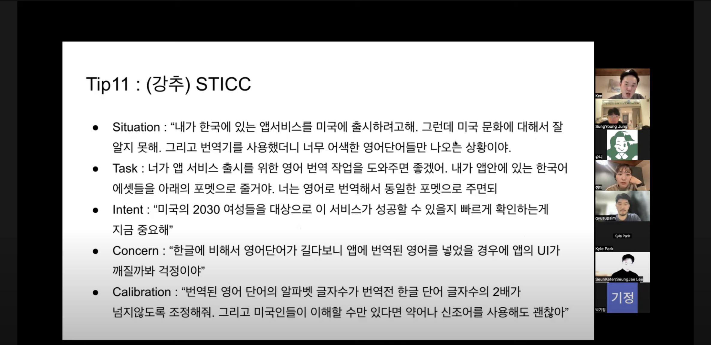

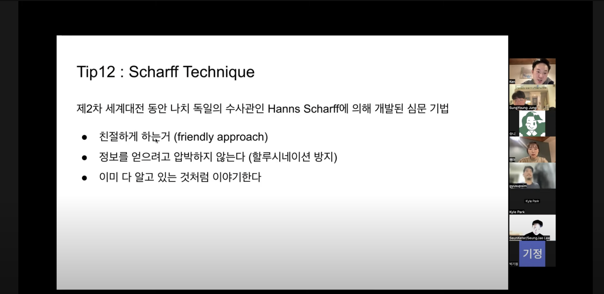

[MSDN: DeflateStream](https://learn.microsoft.com/ko-kr/dotnet/api/system.io.compression.deflatestream?view=net-8.0)

- 무손실 파일 압축 및 파일 해제. 업계 표준인 Deflate 알고리즘
- [Deflate - Wikipedia](https://en.wikipedia.org/wiki/Deflate)

**Go 문법 비판하는 내용**

[GitHub - ksimkago-is-not-good A curated list of articles complaining that go (golang) isn't good enough](https://github.com/ksimka/go-is-not-good)

> - stuck in 70's
> - no oop
> - c style
> - poor error handling

## 24.05.14

[당신이 바로, 당신이 찾던 기술 코파운더에요  GeekNews](https://news.hada.io/topic?id=14609)

- [You Are the Technical Cofounder You Need](https://every.to/p/you-are-the-technical-cofounder-you-need)

- Exit한 창업자로서, 세상을 바꿀 다음 아이디어를 가지고 있다고 믿는 야심찬 기업가들이 종종 찾아옴
    - 그들은 아이디어를 단순한 개념 이상으로 만들어 시작하고 싶어함
- 일반적으로 그들이 해결하고자 하는 문제에 대해 이야기하는 것으로 시작함
    - 초기 창업자들에게 주는 조언: 대부분의 가정이 틀릴 것이므로, 빠르게 반복하고 확장되지 않는 일을 하는 것이 중요함
- 대화는 보통 다음과 같이 진행됨:
    
    > 기업가: ...그래서 제 스타트업이 혁신적일 거예요.  
    > 나: 좋아요, 지금까지 어디까지 왔나요?  
    > 기업가: 와이어프레임을 만들었어요. MVP를 만들기 위해 계약자를 고용했는데, 비용이 많이 들었어요. 그래서 자금 조달이 필요할 것 같아요.  
    > 나: 하지만 계속 외주 개발자에게 의존하고 싶진 않죠? 당신처럼 이 일에 전념할 사람이 필요해요. 소프트웨어 스타트업은 창업팀에 소프트웨어 엔지니어가 필요해요.  
    > 기업가: 맞아요. 기술 공동창업자를 찾는 게 답일 수 있다고 생각했어요. 어떻게 해야 할까요?
    
- 이 때 나는 보통 **안 좋은 소식**을 전해야 함
    - 아이디어를 가지고 기술 공동창업자를 찾는 사람이, 아이디어를 찾는 기술 공동창업자보다 훨씬 많음
    - **아이디어만 가진 사람이 엔지니어 파트너를 성공적으로 찾는 경우는 거의 없음**
    - 기술 공동창업자를 기다리는 대부분의 사업은 시작조차 못하거나, 내부 역량 부족으로 실패함
- 하지만 희망이 없는 건 아님
    - 이 시점에서 나는 도움이 되는 조언을 해주는데, 창업자로서 성공하는데 필수적인 태도에 뿌리를 두고 있음
    - 열정적인 초기 창업자들에게 기술 공동창업자 찾기를 그만두고, 그 에너지를 **기술 공동창업자가 되려고** 노력하는 데 쏟으라고 조언함

**야심찬 목표는 배움의 이유임**

- 야심 찬 창업자는 어느 날 아침 꿈에 그리던 아이디어를 떠올리며 이를 만들고 싶어하지만, 정식 기술 교육을 받은 적이 없어 막막하기만 함
    - 그들은 혼자선 할 수 없다고 믿음
    - 어떻게 시작해야 할지, 누가 안내해 줄지, 배우고 만들 시간을 어떻게 찾을지 모름
    - 이런 딜레마는 판매, 마케팅, 성장 등 많은 분야에서 발생하지만, 특히 프로그래밍에서 그러함
- 그러나 달성하고자 하는 야심찬 흥미로운 목표보다 새로운 것을 배울 동기가 더 큰 것은 없음
    - 큰 아이디어를 가진 창업자들에게: "**축하합니다. 가장 어려운 부분을 해냈습니다. 배울 이유를 찾은거에요.**"
- 야심찬 기업가와의 대화로 돌아가면:
    
    > 나: 당신처럼 이 일에 전념할 사람이 필요해요. 소프트웨어 스타트업은 창업팀에 소프트웨어 엔지니어가 필요해요.  
    > 기업가: 맞아요. 기술 공동창업자를 찾는 게 답일 수 있다고 생각했어요. 어떻게 해야 할까요?  
    > 나: 기술 공동창업자 찾기를 그만두세요. **당신이 기술 공동창업자가 되어야 합니다.**
    
- 14년 전 프로그래밍을 시작했을 때는 서점에서 산 물리적 책이나 도서관에서 빌린 커피 얼룩진 입문서에 의존해야 했음
    
    - 반면 오늘날은 인공지능의 황금기로, 기술적 질문에 대한 모든 답변이 손끝에 있음
    - "어떻게 하면 X 또는 Y를 할 수 있을까요?"와 같은 질문뿐만 아니라 "어떻게 시작하죠?"와 같은 높은 수준의 질문도 가능함
    
    > "\[아이디어\]를 만들고 출시하기 위해 어떤 기술을 이해해야 하나요?"  
    > 관계형 데이터베이스요?  
    > "관계형 데이터베이스가 뭐예요?"  
    > 아, 자세히 설명하는 좋은 유튜브 영상이 있네요. "제 아이디어에 맞는 데이터베이스를 설계해주세요."  
    > 그렇게 진행하다 보면...
    
- 누구나 어떤 주제든 배울 수 있고, 그렇게 하기에 결코 늦지 않다고 믿음
    - 중요한 것은 배울 필요가 있다는 것임
    - 내 인생에서 배운 것의 대부분은 정식 교육이나 전문 학위가 필요하지 않았고 전적으로 제 열망에 의해 이루어졌기 때문에 그렇게 믿음
    - 10년 전에는 멘토와 자원에 접근할 수 있었지만, 오늘날 여러분에게 제공되는 멘토와 자원의 일부에 불과함
    - 내가 할 수 있었다면, 당신도 할 수 있음
- 할 수 없다고 생각한다면 자문해 볼 것: **무엇이 두려운가요?**
    - 노력인가요, 시간 투자인가요, 실패 가능성인가요?
    - 그런 것들 중 하나라도 해당 된다면, 기업가 정신은 당신에게 너무 벅찬 여정일 수 있음
    - 스타트업에 온 마음을 쏟고, 밤낮으로 일하고, 많은 실수를 하는 데 기술적일 필요는 없음
    - 단순히 **배우는 것에 개방적**이기만 하면 됨

[LogLog Games](https://loglog.games/blog/leaving-rust-gamedev/#gui-situation-in-rust-is-terrible)

**Leaving Rust gamedev after 3 years**

내용이 굉장히 길다...

- Rust being great at big refactorings solves a largely self-inflicted issues with the borrow checker
- Indirection only solves some problems, and always at the cost of dev ergonomics
- ECS solves the wrong kind problem

    Because of the way Rust's type system and borrow checker works, ECS comes up as a naturally occurring solution to the problem of "how do we have stuff reference other stuff". Unfortunately, I think there's quite a bit of terminology mixup, and not only do different people mean different things, but also that the large part of the community attributes some things to ECS that aren't actually ECS. Let's try to separate things out.

  - 캐릭터 A 가 캐릭터 B를 따라다니던 중 캐릭터 B가 갑자기 사라져버리면 어떻게 할 것인가?
  - borrowcheck 가 필수인 러스트에서는 이런 경우 포인터를 처리하는게 고달프다.
  - 무엇인가를 참고하는 물건들에 대해서 코드를 작성할 때 애를 많이 먹는 듯

- Generalized systems don't lead to fun gameplay
- Making a fun & interesting games is about rapid prototyping and iteration, Rust's values are everything but that
- Procedural macros are not even "we have reflection at home"
- Hot reloading is more important for iteration speed than people give it credit for
- Abstraction isn't a choice
- GUI situation in Rust is terrible
- Reactive UI is not the answer to making highly visual, unique and interactive game UI
- Orphan rule should be optional
- Compile times have improved, but not with proc macros
- Rust gamedev ecosystem lives on hype
- Global state is annoying/inconvenient for the wrong reasons, games are single threaded.
- Dynamic borrow checking causes unexpected crashes after refactorings
- Context objects aren't flexible enough

## 24.05.22

**작업 이슈**

- 닷넷의 ConcurrentQueue<T>
  - Clear 할 때마다 가비지 생성
  - ring 버퍼 형태의 구조
  - 버퍼는 하나의 배열이 아니라 배열 크기가 32인 Segment 가 여러개 붙어 있는 형태
    - false sharing 을 최소화 하기 위인
    - 큰 배열 하나를 다수의 스레드에서 접근하면 당연히 캐시 미스가 많이 생기겠지
  - Clear 구현의 경우, head/tail 에 해당하는 segment를 얼려 놓고(freeze) 새로운 Segment를 생성해서 할당, 기존 segment는 gc 되도록
    - 무턱대고 Clear를 호출하면 가비지가 엄청 발생한다는 것

[c - Linking Cancellation Tokens - Stack Overflow](https://stackoverflow.com/questions/29623178/linking-cancellation-tokens?newreg=d7d85e7f86f34ed69a90c020738c8625)

I use a cancellation token that is passed around so that my service can be shut down cleanly. The service has logic that keeps trying to connect to other services, so the token is a good way to break out of these retry loops running in separate threads. My problem is that I need to make a call to a service which has internal retry logic but to return after a set period if a retry fails. I would like to create a new cancellation token with a timeout which will do this for me. The problem with this is that my new token isn't linked to the “master” token so when the master token is cancelled, my new token will still be alive until it times-out or the connection is made and it returns.

- cascading cancelling

이렇게 풀라네요

```cs
var parentCts = new CancellationTokenSource();
var childCts = CancellationTokenSource.CreateLinkedTokenSource(parentCts.Token);
        
childCts.CancelAfter(1000);
Console.WriteLine("Cancel child CTS");
Thread.Sleep(2000);
Console.WriteLine("Child CTS: {0}", childCts.IsCancellationRequested);
Console.WriteLine("Parent CTS: {0}", parentCts.IsCancellationRequested);
Console.WriteLine();
        
parentCts.Cancel();
Console.WriteLine("Cancel parent CTS");
Console.WriteLine("Child CTS: {0}", childCts.IsCancellationRequested);
Console.WriteLine("Parent CTS: {0}", parentCts.IsCancellationRequested);
```

Output as expected:

    Cancel child CTS
    Child CTS: True
    Parent CTS: False
    
    Cancel parent CTS
    Child CTS: True
    Parent CTS: True

**False Sharing(with ChatGPT4)**

False sharing은 멀티스레딩 환경에서 개별 스레드가 공유 데이터를 수정할 때 CPU 캐시 라인의 비효율적인 사용으로 발생하는 성능 저하 현상입니다. 각 CPU 코어는 데이터를 캐시 라인(대개 64바이트) 단위로 캐싱하는데, 서로 다른 스레드가 같은 캐시 라인에 위치한 데이터를 동시에 수정하려고 하면, 캐시 라인이 스레드 간에 불필요하게 전송되어 성능이 저하될 수 있습니다.

> 각 스레드가 배열의 인접한 위치를 수정하는 경우 false sharing이 발생할 수 있습니다.

```cs
public class FalseSharingDemo
{
    private static int[] array = new int[8];

    public static void Main()
    {
        Thread t1 = new Thread(() => UpdateArrayIndex(0));
        Thread t2 = new Thread(() => UpdateArrayIndex(1));

        t1.Start();
        t2.Start();

        t1.Join();
        t2.Join();
    }

    private static void UpdateArrayIndex(int index)
    {
        for (int i = 0; i < 100000000; i++)
        {
            array[index]++;
        }
    }
}
```

캐시 라인이 64바이트라고 가정하고,
만약에 `int[128]` 처럼 크기가 큰 배열이 있다고 하자

배열의 첫 번째 원소와 마지막 원소는 인접해 있지 않으니까, 이 둘을 각각 접근할 때는 false sharing 을 걱정하지 않아도 돼음

>> OK

이번에는 `int[4]` 배열이 여럿 있다고 해보자.
서로 다른 배열 객체에 접근한다고 할때 false sharing 이 발생할 가능성이 있을까?

>> 발생할 수 있음

## 24.05.27

**dotnet System.IO.Pipeline**

[C 고성능 서버 - System.IO.Pipeline 도입 후기  leafbirddevnote](https://leafbird.github.io/devnote/2020/12/27/C-%EA%B3%A0%EC%84%B1%EB%8A%A5-%EC%84%9C%EB%B2%84-System-IO-Pipeline-%EB%8F%84%EC%9E%85-%ED%9B%84%EA%B8%B0/#%EB%8B%A8%EC%A0%90-%EB%84%88%EB%AC%B4-%EB%A7%8E%EC%9D%80-Task%EB%A5%BC-%EC%83%9D%EC%84%B1%ED%95%9C%EB%8B%A4)

> System.IO.Pipeline은 ASP.NET Core의 성능을 크게 끌어올린 네트워크 버퍼 운용 라이브러리다. 이를 적용하면 네트워크 버퍼구현의 여러가지 문제점들과 boilerplate한 구현들을 손쉽게 해결할 수 있으나, 최소 2 tasks/peer를 소켓의 수명만큼 열어두어야 하기 때문에 소켓을 긴 시간 유지하는 타입의 TCP서버라면 도입 전에 신중한 성능 테스트를 거쳐야 한다.

- 장점 : 불필요한 메모리 복사를 없앤다.
- 장점 : 네트워크 버퍼의 고정길이 제약을 없애준다.
- 단점 : 너무 많은 Task를 생성한다.

    위의 두가지 장점만으로 Pipeline의 도입을 시도해볼 가치는 충분했다. 그래서 우리는 게임서버의 수신 버퍼를 Pipeline으로 대체하고, MS Azure 에서 F8s 급 인스턴스 수십대를 동원해 10만 동접 스트레스 테스트를 진행해 보았다.

    결과는 기대와 완전히 달랐는데.. Pipeline 도입 전보다 영 더 못한 성능을 보여줬다. 이건 뭐… cpu 사용량이 높고 낮아지는 것이 문제가 아니라, 동접이 일정수치 이상 오르면 서버가 아무 일도 처리하지 않고 멈춰버렸다. 반응없는 프로세스에서 덤프를 떠서 디버거로 살펴보면… 대기상태인 스레드가 잔뜩 생겨있고, 일해야 할 스레드가 부족해서 추가 스레드를 계속해서 만들어내고 있는 것처럼 보였다.

    원인은 Pipeline과 함께 사용하는 task (System.Threading.Tasks.Task) 들이었다. class Pipe 인스턴스 하나를 쓸 때마다 파이프라인에 ‘읽기’와 ‘쓰기’를 담당하는 class Task 객체 두 개를 사용하게 된다. 수신버퍼에만 Pipe를 달면 소켓의 2배, 송수신 버퍼에 모두 달면 소켓의 4배수 만큼의 task가 생성 되어야 하기 때문이다. 게임서버 프로세스당 5,000 명의 동접을 받는다고 하면 최대 20,000개의 task가 생성되고, 이 중 상당수는 waiting 상태로 IO 이벤트를 기다리게 된다.

    task가 아무리 가볍다고 해도 네트워크 레이어에만 몇 만개의 task를 만드는 것은 그리 효율적이지 않다. TPL에 대한 이야기를 시작하면 해야 할 말이 아주 많기 때문에 별도의 포스팅으로 분리해야 할 것이다. 과감히 한 줄로 정리해보면, task는 상대적으로 OS의 커널오브젝트인 스레드보다 가볍다는 것이지 수천 수만개를 만들만큼 깃털같은 물건은 아닌 것이다.


[https://devblogs.microsoft.com/dotnet/system-io-pipelines-high-performance-io-in-net/](https://devblogs.microsoft.com/dotnet/system-io-pipelines-high-performance-io-in-net/)

이런 저런 데모 코드를 보여주는데,

- ArrayPool을 활용하는 코드에서 주의 사항
  - The byte[] we’re using from the ArrayPool<byte> are just regular managed arrays. This means whenever we do a ReadAsync or WriteAsync, those buffers get pinned for the lifetime of the asynchronous operation (in order to interop with the native IO APIs on the operating system). This has performance implications on the garbage collector since pinned memory cannot be moved which can lead to heap fragmentation. Depending on how long the async operations are pending, the pool implementation may need to change.
- Back Pressure 와 Flow Control
  - '소켓에서 받은 데이터를 버퍼에서 읽을 때 부하 < 읽은 데이터를 파싱할 때 부하'
  - read 동작을 수행하는 스레드가 가져오는 데이터를, parsing 스레드가 따라잡지를 못한다.
  - In a perfect world, reading & parsing work as a team: the reading thread consumes the data from the network and puts it in buffers while the parsing thread is responsible for constructing the appropriate data structures. Normally, parsing will take more time than just copying blocks of data from the network. As a result, the reading thread can easily overwhelm the parsing thread. The result is that the reading thread will have to either slow down or allocate more memory to store the data for the parsing thread. For optimal performance, there is a balance between frequent pauses and allocating more memory.
  - To solve this problem, the pipe has two settings to control the flow of data, the PauseWriterThreshold and the ResumeWriterThreshold. The PauseWriterThreshold determines how much data should be buffered before calls to PipeWriter.FlushAsync pauses. The ResumeWriterThreshold controls how much the reader has to consume before writing can resume.

**DecoratorPattern**

[The Decorator Pattern in Modern C 2024](https://blog.postsharp.net/decorator-pattern)

- metalama
- [Metalama A Framework for Clean & Concise Code in C](https://www.postsharp.net/metalama#concept)
- 인터페이스 의존성 없이 method 로만 decorator 패턴을 구성하는 솔루션

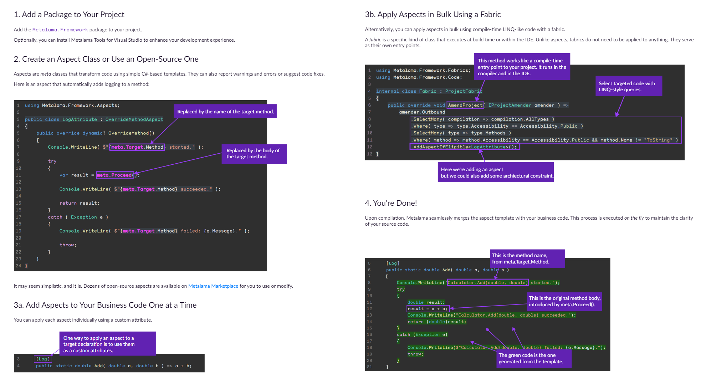

[The Decorator pattern in modern C  by Gael Fraiteur  timeless-dotnet  Medium](https://medium.com/timeless-dotnet/the-decorator-pattern-in-modern-c-32430c1139cb)

- When to use a Decorator pattern in C#
- The Decorator pattern is useful when you want to add behavior to an existing component but either cannot or do not want to modify the source code. This is typically done to adhere to the single responsibility principle (SRP) to keep our code clean, readable, and maintainable.

Some real-world use cases for the decorator design pattern include:

- **Execution policies**, such as exception handling, retrying, or caching, which help improve the performance and reliability of your apps.
- **Observability**, for instance, by adding logging to all calls to an external component.
- **User Interface**, like adding a scrollbar to a large textbox. Another example is the Adorner concept in WPF.
- **Streams**, with features such as buffering, encryption, or compression.

[microsoftMicrosoft.IO.RecyclableMemoryStream A library to provide pooling for .NET MemoryStream objects to improve application performance.](https://github.com/microsoft/Microsoft.IO.RecyclableMemoryStream)

> Microsoft.IO.RecyclableMemoryStream is a MemoryStream replacement that offers superior behavior for performance-critical systems. In particular it is optimized to do the following:

    Eliminate Large Object Heap allocations by using pooled buffers
    Incur far fewer gen 2 GCs, and spend far less time paused due to GC
    Avoid memory leaks by having a bounded pool size
    Avoid memory fragmentation
    Allow for multiple ways to read and write data that will avoid extraneous allocations
    Provide excellent debuggability and logging
    Provide metrics for performance tracking

```cs
class Program
{
    private static readonly RecyclableMemoryStreamManager manager = new RecyclableMemoryStreamManager();

    static void Main(string[] args)
    {
        var sourceBuffer = new byte[] { 0, 1, 2, 3, 4, 5, 6, 7 };
        
        using (var stream = manager.GetStream())
        {
            stream.Write(sourceBuffer, 0, sourceBuffer.Length);
        }
    }
}
```

## 24.05.31

**캡슐 AmbientOcclusion**


- [CS2's Magic Menu](https://youtu.be/sAfC3wHmIeE)
- [Last of Us2's Indirect Shadows](https://youtu.be/9XSWmaXfCJo)
- [Sphere - occlusion](https://www.shadertoy.com/view/4djSDy)

그림자를 드리울 때, 삼각형이 많은 캐릭터 메시를 그대로 사용한다면 무겁다.

캐릭터와 비슷한 크기의 캡슐을 몸에 달게 하고, 캡슐로 간접광 그림자를 표현하는 최적화 기법

## 24.06.03

[YOLO Software Architecture  DevIQ](https://deviq.com/practices/yolo-architecture)

> YOLO Architecture describes a development style characterized by minimal planning, lack of organization, and an absence of clear architectural principles. 

- 욜로 아키텍쳐
- 막 사는 아키텍쳐

## 24.06.04

**UTF8Encoding**

> UTF8Encoding 에서 encoderShouldEmitUTF8Identifier 가 true 일 때와 아닐 때 인코딩 후 어떤 차이가 있어?

UTF8Encoding 클래스에서 EncoderShouldEmitUTF8Identifier 속성의 값에 따라 인코딩 결과에 차이가 있습니다.

- EncoderShouldEmitUTF8Identifier = true
  - 인코딩된 바이트 스트림의 시작 부분에 **BOM(Byte Order Mark)** 문자가 포함됩니다.
  - BOM은 **U+FEFF 코드 포인트**를 가지는 **3바이트 시퀀스(EF BB BF)**입니다.
  - BOM을 사용하면 인코딩 방식을 쉽게 식별할 수 있습니다.
  - 일부 프로그램에서는 BOM을 필요로 하기 때문에 이 경우에 유용합니다.
- EncoderShouldEmitUTF8Identifier = false
  - 인코딩된 바이트 스트림에 BOM 문자가 포함되지 않습니다.
  - 순수한 UTF-8 인코딩된 데이터만 포함됩니다.
  - 파일 크기가 약간 작아질 수 있습니다.
  - 일부 프로그램에서는 BOM이 필요 없기 때문에 이 경우에 선호될 수 있습니다.

예를 들어, 문자열 "Hello, 世界!"를 인코딩한다고 가정하면:

- EncoderShouldEmitUTF8Identifier = true인 경우 EF BB BF 48 65 6C 6C 6F 2C 20 E4 B8 96 E7 95 8C 21 와 같은 바이트 시퀀스가 생성됩니다.
- EncoderShouldEmitUTF8Identifier = false인 경우 48 65 6C 6C 6F 2C 20 E4 B8 96 E7 95 8C 21 와 같은 바이트 시퀀스가 생성됩니다.
- 대부분의 경우 EncoderShouldEmitUTF8Identifier = false가 더 적절할 것 같지만, 특정 프로그램에서 BOM이 필요한 경우에는 true로 설정하는 것이 좋습니다.

## 24.06.06

**완전 랜덤 커스터마이징**

게임 커스커 마이징 절차 중에서 '헤어스타일', '문신', '체형' 의 데이터 목록이 있다면, 

- 이 중에서 완전 랜덤으로 선택하는 것
- 최초 프리셋을 일부 선별하고 이 중에서 랜덤 선택하는 것

> 어쩌다가 굉장히 독특한 개성의 프리셋이 커스터마이징 화면에서 처음부터 나오면, 평범한 외형을 선호하는 대부분의 유저들은 당혹스러워 할 것이고, 독특한 외형을 선호하는 유저들의 경우 처음부터 이런 모습을 보여주면 기대치가 떨어지게 될 수 있음.(이런 유저의 경우에는 직접 커스터마이징 툴을 만져보면서 발견해나가게 해야 함. 랜덤 선택으로부터 극단적인 예시 & 강렬한 인상을 줘버리면 부작용이 생긴다.)
>
> 문신같은 후천적인 요소도 초기 프리셋에서는 “없음”이 선택되어 있으면 좋겠습니다. 커스터마이징은 게임 내에서 새롭게 태어나는 사람을 고르는 기분이 드는데, 문신을 처음부터 가지고 태어나는 사람은 없으니 기본적으로는 선택적 요소가 되어야 할 것 같습니다.
>
> 미리 선택된 프리셋은 대부분의 사람들이 생성할 것 같은 외형을 모조리 합친 다음 평균낸 듯한 “최대한 아무런 특징이 없는 것 같은 외모”면 좋겠습니다. (우리 게임은 커스터마이징이 그렇게 어렵진 않지만) 평균값에서 조금씩 깍아서 내가 원하는 외모를 만드는 것이 극단적 형태에서부터 시작하는 것보다 쉽기 때문입니다.

[C#/.NET Method Call Performance - Facts](https://www.aloneguid.uk/posts/2021/05/csharp-method-call-performance/)

```cs
#LINQPad optimize+

Util.AutoScrollResults = true;
	BenchmarkRunner.Run<MethodCalls>();

[ShortRunJob]
[MinColumn, MaxColumn, MeanColumn, MedianColumn]
[MemoryDiagnoser]
[MarkdownExporter]
public class MethodCalls
{
	private MethodsContainer _c = new MethodsContainer();
	private static Func<int, int> _staticLambda = MethodsContainer.StaticMethod;
	
	[Benchmark]
	public int Static() => MethodsContainer.StaticMethod(1);
	[Benchmark]
	public int StaticViaLambda() =>  _staticLambda(1);
	[Benchmark]
	public async Task<int> StaticAsync()=> await MethodsContainer.StaticAsyncMethod(1);
	[Benchmark]
	public int Dynamic() => _c.DynamicMethod(1);
	[Benchmark]
	public async Task<int> DynamicAsync() => await _c.DynamicAsyncMethod(1);
	[Benchmark]
	public int Virtual() => _c.VirtualMethod(1);
	[Benchmark]
	public async Task<int> VirtualAsync() => await _c.VirtualAsyncMethod(1);
}

public class MethodsContainer
{
	public static int StaticMethod(int arg) { return arg * 2; }
	public static Task<int> StaticAsyncMethod(int arg) { return Task.FromResult<int>(arg * 2); }
	public int DynamicMethod(int arg) { return arg * 2; }
	public Task<int> DynamicAsyncMethod(int arg) { return Task.FromResult<int>(arg * 2); }
	public virtual int VirtualMethod(int arg) { return arg * 2; }
	public virtual Task<int> VirtualAsyncMethod(int arg) { return Task.FromResult<int>(arg * 2); }
}
```

| Method          | Mean      | Error     | StdDev    | Min       | Max       | Median    | Gen 0     | Gen 1 | Gen 2 | Allocated |
|-----------------|-----------|-----------|-----------|-----------|-----------|-----------|-----------|-------|-------|-----------|
| Static          | 0.1086 ns | 0.6070 ns | 0.0333 ns | 0.0835 ns | 0.1464 ns | 0.0960 ns | -         | -     | -     | -         |
| StaticViaLambda | 4.1860 ns | 1.1548 ns | 0.0633 ns | 4.1383 ns | 4.2578 ns | 4.1619 ns | -         | -     | -     | -         |
| StaticAsync     | 20.0131 ns| 31.6018 ns| 1.7322 ns | 18.0743 ns| 21.4084 ns| 20.5566 ns| 0.0172    | -     | -     | 72 B      |
| Dynamic         | 0.4950 ns | 0.6165 ns | 0.0338 ns | 0.4564 ns | 0.5189 ns | 0.5098 ns | -         | -     | -     | -         |
| DynamicAsync    | 17.9998 ns| 16.0884 ns| 0.8819 ns | 17.4451 ns| 19.0167 ns| 17.5376 ns| 0.0172    | -     | -     | 72 B      |
| Virtual         | 0.6042 ns | 0.3357 ns | 0.0184 ns | 0.5860 ns | 0.6228 ns | 0.6038 ns | -         | -     | -     | -         |
| VirtualAsync    | 20.8322 ns| 5.6442 ns | 0.3094 ns | 20.4769 ns| 21.0419 ns| 20.9778 ns| 0.0172    | -     | -     | 72 B      |


1. Static methods are 6 times faster than normal instance methods.
2. Static lambda call is 38 times slower than static method call.

Why? This is really odd, but not when you look at generated IL. Here’s one for static method call:
```
MethodCalls.Static:
IL_0000:  ldc.i4.1    
IL_0001:  call        UserQuery+MethodsContainer.StaticMethod
IL_0006:  ret   
```
and for static lambda:
```
MethodCalls.StaticViaLambda:
IL_0000:  ldsfld      UserQuery+MethodCalls._staticLambda
IL_0005:  ldc.i4.1    
IL_0006:  callvirt    System.Func<System.Int32,System.Int32>.Invoke
IL_000B:  ret  
```

As you can see call is replaced with callvirt - so static lambda is actually treated as virtual method call. Thus we have an overhead of ldsfld loading wrapper instance as well.

3. Static methods are 68 times faster than virtual methods.
4. Virtual methods are 10.5 times slower than instance methods. Makes you think to carefully choose which methods should be virtual.
5. Async calls allocate 72 bytes of memory, regardless of method signature. Normal methods have no impact on memory allocations.
6. Regardless of method signature, all of the async method calls are really slow.

## 24.06.12

[StringBuilders magic for very large strings](chrome-extension://hajanaajapkhaabfcofdjgjnlgkdkknm/)

```cs
[MemoryDiagnoser]
public class StringBenchmark
{
    private readonly StringBuilder stringBuilder = new();
    private readonly List<string> list = new();
    private const int IterationCount = 1000;
    private const string TenCharacters = "0123456789";
    
    [Benchmark]
    public string StringBuilder()
    {
        for (var i = 0; i < IterationCount; i++)
        {
            stringBuilder.Append(TenCharacters);
        }

        return stringBuilder.ToString();
    }
    
    [Benchmark]
    public string List()
    {
        for (var i = 0; i < IterationCount; i++)
        {
            list.Add(TenCharacters);
        }

        return string.Concat(list);
    }
}
```

- 열글자 (tenCharacters) 1,000 개를 이어붙일 때

| Method        | Mean     | Error     | StdDev    | Gen0   | Gen1   | Gen2   | Allocated |
|-------------- |---------:|----------:|----------:|-------:|-------:|-------:|----------:|
| StringBuilder | 2.613 us | 0.0142 us | 0.0126 us | 6.3477 | 0.3967 |      - |  51.95 KB |
| List          | 6.969 us | 0.0320 us | 0.0283 us | 4.3716 | 0.0229 | 0.0076 |  35.81 KB |

- 백글자 (oneHundredCharacters) 10,000 개를 이어붙일 때

| Method        | Mean     | Error    | StdDev   | Gen0      | Gen1      | Gen2     | Allocated |
|-------------- |---------:|---------:|---------:|----------:|----------:|---------:|----------:|
| StringBuilder | 553.3 us | 17.36 us | 51.20 us |  696.2891 |  696.2891 | 210.9375 |   3.83 MB |
| List          | 652.8 us | 16.35 us | 48.22 us | 1030.2734 | 1018.5547 | 998.0469 |   6.15 MB |

- string 이 짧은 경우 List가 메모리 효율적이지만, 특정 수치 이상으로 길어진다면 어느 순간부터 stringBuilder가 더 효율적이다.
- 이유는 List는 하나의 배열이기 때문에 덩치가 커지면서 버퍼 사이즈를 넘어서면 재할당 발생.
- 그렇지만 StringBuilder는 내부적으로 LinkedList 구조이다. 하나의 버퍼 사이즈가 충분히 커지면 또 다른 StringBuilder를 만드는 것
- Gen2 GC 의 경우도 마찬가지, List는 일체형 배열이기 때문에, 8byte * 10,000 = 대략 80Kbyte => LOH(Large Object Heap) 으로 이동할 정도로 충분히 커진다. stringBuilder 보다 Gen2 GC를 더 차지하는 셈

[Multitasking, parallel processing, and concurrency in Swift – The Eclectic Light Company](https://eclecticlight.co/2024/06/10/multitasking-parallel-processing-and-concurrency-in-swift/)

    In computers with a single processor core, multitasking was a way of cheating to give the impression that the processor was doing several things at once, when in fact all it was doing was switching rapidly between two or more different programs. There are two fundamental models for doing that:
    
    - cooperative multitasking, in which individual tasks yield to give others processing time;
    - preemptive multitasking, in which a scheduler switches between tasks at regular intervals.
    
    When a processor switches from one task to the next, the current task state must be saved so that it can be resumed later. Once that’s complete, the next task is loaded to complete what’s known as a context switch. That incurs overhead, both in terms of processing and in memory storage. Inevitably, switching between lightweight tasks has less overhead. There have been different strategies adopted to determine the optimum size of tasks and overhead imposed by context switching, and terminology differs between them, variously using words such as processes, threads and even fibres, which can prove thoroughly confusing.

## 24.06.16

ChatGPT 만담

**URL Tempering에 대해**

URL tempering은 웹 애플리케이션 보안 위협 중 하나로, 사용자가 URL을 조작하여 서버가 의도하지 않은 동작을 하게 만드는 것을 말합니다. 이는 주로 인증되지 않은 액세스, 데이터 노출, 무단 변경 등을 초래할 수 있습니다. URL tempering의 주요 유형과 방지 방법에 대해 설명하겠습니다.

#### 주요 유형

1. **매개변수 조작 (Parameter Tampering)**: URL의 쿼리 매개변수를 변경하여 서버에 잘못된 데이터를 전송합니다. 예를 들어, 사용자가 자신의 계정 정보에 접근하기 위해 `user_id=123`을 `user_id=456`으로 변경할 수 있습니다.

2. **디렉토리 트래버설 (Directory Traversal)**: URL의 경로를 조작하여 웹 루트 디렉토리 외부의 파일에 접근하려고 시도합니다. 예를 들어, `/app/docs/../etc/passwd`와 같은 URL을 사용하여 서버의 중요한 파일에 접근할 수 있습니다.

3. **IDOR (Insecure Direct Object Reference)**: 사용자가 직접 객체를 참조할 수 있는 URL을 조작하여 권한이 없는 데이터를 액세스합니다. 예를 들어, `/profile/123`을 `/profile/456`으로 변경하여 다른 사용자의 프로필에 접근할 수 있습니다.

## 24.06.17

[C Array and List Fastest Loop in 2024 - NDepend Blog](https://blog.ndepend.com/c-array-and-list-fastest-loop/)

> We listed the key findings in the introduction. Let’s conclude that future versions of .NET and C# might change these results. For example, in the future, the C# compiler might assert that a list doesn’t get modified and use the Span<T> based optimization. We will update this post regularly to find out.

```cs
using System.Runtime.CompilerServices;
using System.Runtime.InteropServices;
using BenchmarkDotNet.Attributes;
using BenchmarkDotNet.Running;
 
BenchmarkRunner.Run<Benchmarks>();
 
public class Benchmarks {
 
   [Params(100, 1_000, 10_000)]
   public int Length { get; set; }
   private void AssertResult(int result) {
      if (result != (Length * (Length - 1)) / 2) {
         Environment.FailFast("");
      }
   }
 
   private int[] m_Items;
 
   [GlobalSetup]
   public void Setup() {
      m_Items = Enumerable.Range(0, Length).ToArray();
   }
 
   [Benchmark]
   public void ForLoop() {
      int result = 0;
      for (int i = 0; i < m_Items.Length; i++) {
         result += m_Items[i];
      }
      AssertResult(result);
   }
 
   [Benchmark]
   public void ForLoop_LengthAsVariable() {
      int result = 0;
      int length = m_Items.Length;
      for (int i = 0; i < length; i++) {
         result += m_Items[i];
      }
      AssertResult(result);
   }
 
   [Benchmark]
   public void ForeachLoop() {
      int result = 0;
      foreach (int item in m_Items) {
         result += item;
      }
      AssertResult(result);
   }
 
   [Benchmark]
   public void ArrayForEach() {
      int result = 0;
      Array.ForEach(m_Items, item => {
         result += item;
      });
      AssertResult(result);
   }
 
   [Benchmark]
   public void ForSpanLoop() {
      int result = 0;
      Span<int> span = m_Items;
      for (int i = 0; i < span.Length; i++) {
         result += span[i];
      }
      AssertResult(result);
   }
 
   [Benchmark]
   public void ForSpanLoop_LengthAsVariable() {
      int result = 0;
      Span<int> span = m_Items;
      int length = span.Length;
      for (int i = 0; i < length; i++) {
         result += span[i];
      }
      AssertResult(result);
   }
 
   [Benchmark]
   public void ForSpanRefLoop() {
      int result = 0;
      Span<int> span = m_Items;
      ref int ptr = ref MemoryMarshal.GetReference(span);
      for (int i = 0; i < span.Length; i++) {
         int item = Unsafe.Add(ref ptr, i);
         result += item;
      }
      AssertResult(result);
   }
 
   [Benchmark]
   public void ForSpanRefLoop_LengthAsVariable() {
      int result = 0;
      Span<int> span = m_Items;
      ref int ptr = ref MemoryMarshal.GetReference(span);
      int length = span.Length;
      for (int i = 0; i < length; i++) {
         int item = Unsafe.Add(ref ptr, i);
         result += item;
      }
      AssertResult(result);
   }
 
   [Benchmark]
   public void ForSpanRefLoop2() {
      int result = 0;
      Span<int> span = m_Items;
      ref int start = ref MemoryMarshal.GetReference(span);
      ref int end = ref Unsafe.Add(ref start, m_Items.Length);
 
      while (Unsafe.IsAddressLessThan(ref start, ref end)) {
         result += start;
         start = ref Unsafe.Add(ref start, 1);
      }
      AssertResult(result);
   }
}
```

- foreach 가 for 보다 빠르다.
  - foreach 의 경우 jit 컴파일러가 불필요한 검증을 패싱하도록 최적화 되어 있음
- List<T> 의 경우 for 루프가 foreach 보다 빠르다.
  - foreach loop 는 List<T> 가 중간에 수정될 수 있음을 고려했기 때문
  - Enumerator 가 사용된다.
- Span<T> 를 사용하는 경우. T[] 와는 동일하지만, List<T> 보다는 빠르다.

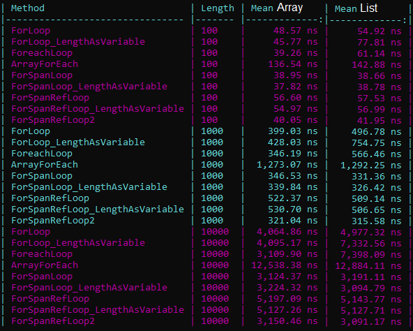

## 24.06.20

[Why Your SSD (Probably) Sucks and What Your Database Can Do About It  CedarDB - The All-In-One-Database](https://cedardb.com/blog/ssd_latency/)

- 대충 운영체제가 디스크에 쓰기 명령을 할 때, 쓰기 큐를 먼저 거친다는 것
- 쓰기 큐에 입력되는 시간만 두고 볼 때 딜레이는 짧은 편이지만, 실제 디스크에 저장될 때까지의 시간을 보면 마이크로(micro) -> 밀리(milli) 초 단위를 왔다갔다 하는 정도

**ChatGPT 만담 SSD 쓰기 큐**

**쓰기 큐의 역할**

1. **쓰기 병합**:
   - SSD는 쓰기 작업을 병합하여 성능을 최적화합니다. 여러 개의 작은 쓰기 작업을 모아서 한 번에 큰 쓰기 작업으로 처리하면 쓰기 성능이 향상되고, SSD의 수명도 연장됩니다.

2. **쓰기 순서 최적화**:
   - SSD는 플래시 메모리 셀의 특성상 랜덤 쓰기보다 순차 쓰기에 더 적합합니다. 쓰기 큐를 통해 쓰기 명령을 재정렬하여 순차적으로 처리함으로써 성능을 최적화할 수 있습니다.

3. **내구성 향상**:
   - SSD는 쓰기 작업을 고르게 분배하여 특정 셀에 과도한 쓰기 작업이 집중되지 않도록 합니다. 이를 통해 플래시 메모리의 수명을 연장할 수 있습니다.

4. **플래시 변환 계층(FTL)**:
   - SSD의 플래시 변환 계층은 논리적 주소를 물리적 주소로 매핑하는 작업을 수행합니다. 이 과정에서 쓰기 큐를 사용하여 쓰기 명령을 최적화하고, 가비지 컬렉션 등의 내부 관리 작업을 효율적으로 처리합니다.

**데이터 내구성 보장**

운영 체제나 파일 시스템이 `write()` 명령을 실행하면, SSD 내부의 쓰기 큐에 의해 실제 쓰기 작업이 지연될 수 있습니다. 이 때문에 시스템이 충돌하면 데이터가 물리적 저장 매체에 아직 기록되지 않았을 수 있습니다. 이러한 이유로 데이터베이스 시스템은 다음과 같은 추가적인 메커니즘을 사용하여 데이터의 내구성을 보장합니다.

1. **플러시 명령**:
   - `fsync()`나 `fdatasync()` 같은 명령을 사용하여 운영 체제 버퍼와 SSD의 쓰기 큐를 비워 실제로 데이터를 디스크에 기록하도록 합니다.

2. **저널링**:
   - 데이터베이스는 쓰기 작업 전에 로그(저널)에 기록하여, 시스템 충돌 시 복구할 수 있도록 합니다. 이 로그는 커밋된 데이터가 실제로 저장되었는지 확인하는 데 사용됩니다.

3. **배터리 백업 캐시**:
   - 일부 고급 SSD는 전원 손실 시에도 데이터를 보호하기 위해 배터리 백업 DRAM 캐시를 사용합니다. 이 캐시는 전원 복구 후 데이터를 플래시 메모리에 기록할 수 있습니다.

결론적으로, SSD에도 쓰기 큐가 있으며, 이를 통해 성능과 내구성을 최적화합니다. 그러나 데이터의 내구성을 보장하기 위해서는 추가적인 메커니즘이 필요합니다. 데이터베이스 시스템은 이러한 메커니즘을 통해 ACID 속성의 "D"를 보장합니다.

[(239) 지금! 🚨 개발자라면 무조건 알아야하는 NPM 해킹](https://www.youtube.com/watch?v=DjfpcmK62ew&list=WL&index=5)

- [npm left-pad incident](https://en.wikipedia.org/wiki/Npm_left-pad_incident)
- [Supply chain attack](https://en.wikipedia.org/wiki/Supply_chain_attack)
  - 복잡하게 얽혀있는 패키지 디펜던시 그래프 중에서, 가장 보안이 약한 마이너한 패키지를 공략. 여기서 보안 이슈가 발생하면 해당 패키지에 의존하는 다른 모든 패키지에 악영향이 가게 됨

**`left-pad` 이슈 설명**

`left-pad`는 JavaScript 개발자들 사이에서 널리 사용되는 npm 패키지였습니다. 이 패키지는 문자열의 왼쪽에 특정 문자를 추가하여 원하는 길이로 문자열을 확장하는 간단한 기능을 제공했습니다. 예를 들어, 문자열을 일정 길이로 만들기 위해 공백이나 '0' 같은 문자를 추가하는 데 사용될 수 있습니다.

> 굉장히 간단한 코드 였다.


**`left-pad` 이슈의 발생**
2016년, `left-pad` 패키지의 개발자 Azer Koçulu는 npm과 이름 충돌 문제로 분쟁을 겪었습니다. 이로 인해 Koçulu는 자신이 관리하는 모든 npm 패키지를 npm 레지스트리에서 삭제하기로 결정했습니다. 이 중 하나가 `left-pad`였고, 당시 `left-pad`는 많은 인기 있는 라이브러리와 프로젝트에서 사용되고 있었습니다.

**영향**
`left-pad`의 삭제는 즉각적인 영향을 미쳤습니다. `left-pad`를 의존성으로 가진 수천 개의 프로젝트가 빌드 실패를 경험했으며, 이는 전 세계 개발자 커뮤니티에서 큰 혼란을 야기했습니다. 이 사건은 단일 패키지가 전체 생태계에 미치는 영향의 규모와 소프트웨어 의존성 관리의 중요성을 강조했습니다.

**결과 및 교훈**
이 사건 이후 npm은 패키지의 무단 삭제가 다른 사용자에게 미치는 영향을 방지하기 위해 정책을 강화했습니다. 또한, 많은 개발자들이 패키지 의존성을 더 신중하게 관리할 필요성을 인식하게 되었습니다.

`left-pad` 이슈는 소프트웨어 개발에 있어 오픈 소스 프로젝트의 의존성 관리와 커뮤니티 내 의사소통의 중요성을 잘 보여주는 사례로 남아 있습니다.

- [Expert grabs expired domain for NPM package to make a point • The Register](https://www.theregister.com/2022/05/10/security_npm_email/)
- 다운로드 수 6백만 회에 달하는 패키지. 보안 스캔들
  - NPM foreach 라이브러리의 관리자 이메일이 커스텀 도메인의 계정 -> 그런데 대상 커스텀 도메인이 만료 날짜가 되고 해당 도메인이 매물로 나왔는데 한 보안 전문가가 이 도메인을 사버리고 자칫하면 악성 해커가 관리자 계정을 훔칠 수 도 있었다며 경고함

- [Typosquatting](https://en.wikipedia.org/wiki/Typosquatting)
- > Typosquatting, also called URL hijacking, a sting site, a cousin domain, or a fake URL, is a form of cybersquatting, and possibly brandjacking which relies on mistakes such as typos made by Internet users when inputting a website address into a web browser. A user accidentally entering an incorrect website address may be led to any URL, including an alternative website owned by a cybersquatter.
- 유명한 사이트 도메인과 한 글자 차이나는 url 을 수도 없이 준비. 재수 없는 사람이 실수로 오타를 입력해서 엉뚱한 사이트로 들어갔다가 실제 사이트와 똑같은 모습에 속고 로그인 계정 /비밀번호를 입력했다가 개인정보가 노출되는 수법. or 악성 프로그램 다운로드

[(239) 애플도 당했다! 최악의 보안사태 "Log4J" 설명해드림. 10분컷.](https://www.youtube.com/watch?v=kwS3twdVsko)

- [Log4j](https://en.wikipedia.org/wiki/Log4j)

> Log4j 취약점, 공식적으로는 CVE-2021-44228로 알려져 있으며, "Log4Shell"이라고도 불립니다. 이 취약점은 Apache Log4j 2 라이브러리에서 발견되었으며, 원격 코드 실행을 허용하는 매우 심각한 보안 결함입니다. 공격자는 로깅 작업 중에 사용자 제어가 가능한 데이터를 이용해 원격 코드 실행을 시도할 수 있습니다.


- [Java Naming and Directory Interface](https://en.wikipedia.org/wiki/Java_Naming_and_Directory_Interface)
  - log4j 가 JNDI (Java Naming and Directory Interface) 를 활용. 원격 url 에 연결할 수 있고, 악성 코드를 내부로 가져와서 실행시킬 수 있다.
  - 테슬라 애플도 뚫림
  - 아이폰 이름에 / 와이파이 이름에 위의 이미지 키워드를 입력 시, 해당 애플 쪽 백엔드 시스템이 url 에 접속 시도함
- 마인크래트의 채팅에 입력하면 실행 가능


- 제로 데이 취약점
- > A zero-day (also known as a 0-day) is a vulnerability in software or hardware that is typically unknown to the vendor and for which no patch or other fix is available.
- > Despite developers' goal of delivering a product that works entirely as intended, virtually all software and hardware contain bugs. Many of these impair the security of the system and are thus vulnerabilities. Although the basis of only a minority of cyberattacks, zero-days are considered more dangerous than known vulnerabilities because there are fewer countermeasures possible.

## 24.06.24

[Pooling large arrays with ArrayPool – Adam Sitnik – .NET Performance and Reliability](https://adamsitnik.com/Array-Pool/)

- How to use it?

First of all you need to obtain an instance of the pool. You can do in at least three ways:

- Recommended: use the ArrayPool<T>.Shared property, which returns a shared pool instance. It’s thread safe and all you need to remember is that it has a default max array length, equal to 2^20 (1024*1024 = 1 048 576).
- Call the static ArrayPool<T>.Create method, which creates a thread safe pool with custom maxArrayLength and maxArraysPerBucket. You might need it if the default max array length is not enough for you. Please be warned, that once you create it, you are responsible for keeping it alive.
- Derive a custom class from abstract ArrayPool<T> and handle everything on your own.
- Next thing is to call the Rent method which requires you to specify minimum length of the buffer. Keep in mind, that what Rent returns might be bigger than what you have asked for.

```cs
byte[] webRequest = request.Bytes;
byte[] buffer = ArrayPool<byte>.Shared.Rent(webRequest.Length);

Array.Copy(
    sourceArray: webRequest, 
    destinationArray: buffer, 
    length: webRequest.Length); // webRequest.Length != buffer.Length!!
```

**대기큐/대기열**

게임 인원 대기

- 특정 서버 접속 인원 수가 한도를 초과하지 못하도록 막는 효과
- 혹은 특정 시간 내에 동작을 수행하는 인원 수를 일정하게 유지하는 효과 (수율: throughput)

[Exploring the generated code ListT and fallback cases](https://andrewlock.net/behind-the-scenes-of-collection-expressions-part-2-exploring-the-generated-code-list-and-fallback-cases/)

```cs
using System.Collections.Generic;

List<int> list = [1, 2, 3, 4, 5];
```

- collection expression 사용 시 `CollectionMarshal` 을 사용한 코드를 자동 생성
  - SharpLab 에서 쉽게 체크해볼 수 있다.
  - https://sharplab.io/#v2:D4AQDABCCMAsDcBYAUCgMgSwM4BcA8GAdjgHwQA22OEAvBANrQA0EATCwMwuwsCsAuvCA===
- List.Add(); 를 다섯 번 호출하는 것보다 빠름

```cs
List<int> list = new List<int>();
CollectionsMarshal.SetCount(list, 3);
Span<int> span = CollectionsMarshal.AsSpan(list);
int num = 0;
span[num] = 1;
num++;
span[num] = 2;
num++;
span[num] = 3;
num++;
```

In this post, I showed how collection expressions can always fallback to collection initializers for types that support them. I also showed how to create your own types to support collection initializers and expressions by implementing IEnumerable and adding an Add() method. Finally I showed how List<T> is optimized for collection expressions by using the .NET 8 API CollectionsMarshal.SetCount(), and how this falls back to collection expressions if you're targeting earlier framework versions.

## 24.06.26

**C# 메모리 덤프파일에서 데이터 추출하기**

- [Immediate window](https://learn.microsoft.com/en-us/visualstudio/ide/reference/immediate-window)
- 한글명으로 직접 실행 창

> Use the Immediate window to debug and evaluate expressions, execute statements, and print variable values. The Immediate window evaluates expressions by building and using the currently selected project.
>
> To display the Immediate window, open a project for editing, and then choose Debug > Windows > Immediate or press Ctrl+Alt+I. You can also enter Debug.Immediate in the Command window.

- Enter Commands

| Task                                                        | Solution                                                   | Example         |
|-------------------------------------------------------------|------------------------------------------------------------|-----------------|
| Evaluate an expression.                                     | Preface the expression with a question mark (?).            | ? a+b           |
| Temporarily enter Command mode while in Immediate mode      | Enter the command, prefacing it with a greater than sign (>).| >alias          |
| Switch to the Command window.                               | Enter cmd into the window, prefacing it with a greater than sign (>).| >cmd            |
| Switch back to the Immediate window.                        | Enter immed into the window without the greater than sign (>).| immed           |

- 비쥬얼 스튜디오의 디버거 기능 중, 메모리 덤프에 대한 '직접 실행' 기능이 존재
- 이때  immediate window 에는 c# 명령을 그대로 입력해도 동작한다!!
- 대충 쓰는 예시는 `? new StackTrace(true).GetFrames()` 하면 현재 콜 스택을 출력한다!!

## 24.06.27

[A Guide to Semantic Versioning  Baeldung on Computer Science](https://www.baeldung.com/cs/semantic-versioning)

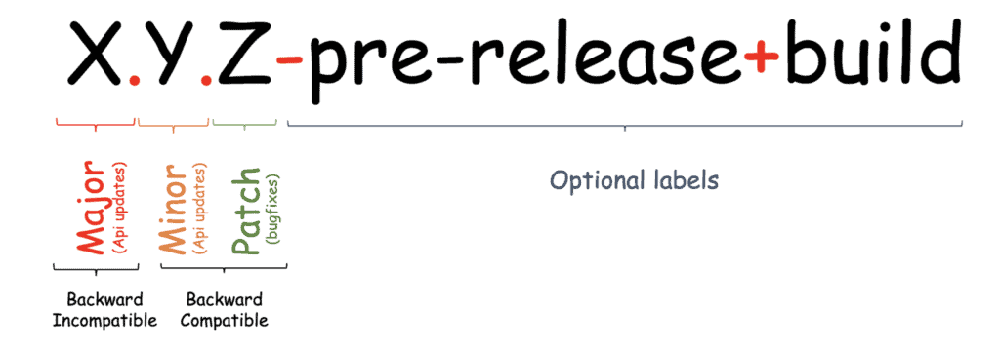

- Major: The major version should increase when we’ve introduced new functionality which breaks our API, i.e., increase this value when we’ve added a backward-incompatible change to our project. 
- Minor: We should increase our minor version when we’ve introduced new functionality which changes our API but is backward compatible, i.e., a non-breaking change. 
- Patch: Under the SemVer specs, we reserve patch changes for backward-compatible bug fixes.

**라이브 서비스 온라인 게임 SQL 작성 실수 미연에 방지**

- SP(Stored Procedure) 사용이 언급 됨
  - [SQL Stored Procedures](https://www.w3schools.com/SQL/sql_stored_procedures.asp)
  - 정적으로 사용가능한 쿼리를 미리 정의하는 것. 코드상에서는 미리 정의된 쿼리를 대상으로 파라미터를 넘길 수 있다.
  - 추가적으로 Database 관리자가 실시간 쿼리 모니터링 중 문제가 있는 쿼리를 제보하면, 해당 SP 사용처 코드를 빠르게 찾는 게 가능 -> 동적으로 쿼리를 구성하는 것이 아니니까
- 정적 분석이 언급 됨
  - Where 문 에서의 Null Check 미리 확인하는 등
  - 아무튼 코드에서는 실수가 나고 DB 가 망가지면 큰일 남
- 그리고 특히 거래소 로직의 Range 쿼리에 주의가 필요 (Less Than..., Greater Than...). 잘못 사용하면 부하를 일으킴
- 특정 업데이트 이후 유저가 몰리는 타이밍에 DB가 다운되지 않도록 주의에 또 주의

[또 다시 AI를 언급하면 파일드라이버 해버릴꺼에요  GeekNews](https://news.hada.io/topic?id=15436)

- [I Will Fucking Piledrive You If You Mention AI Again — Ludicity](https://ludic.mataroa.blog/blog/i-will-fucking-piledrive-you-if-you-mention-ai-again/)

> So it is with great regret that I announce that the next person to talk about rolling out AI is going to receive a complimentary chiropractic adjustment in the style of Dr. Bourne, i.e, I am going to fucking break your neck.

- 아무튼 AI 에 대해서 얘기한다면 목이 부러지는 줄 알아라.

#### I. 하지만 우리는 기계 학습으로 엄청난 효율성을 실현할 거야-

> "**내가 방금 뭐라고 했는지 못들었어?**"

-   2019년부터 데이터 과학자로 일했지만, 2021년에는 이 분야가 크지만 사기가 많다는 것을 깨달았음
    -   대부분의 리더들은 AI에 대해 30분도 읽어보지 않고, AI에 초점을 맞춰야 한다고 주장했음
    -   AI 이니셔티브를 시작하는 회사 수가 실제 사용 사례 수를 훨씬 능가했음
    -   시장은 사기꾼과 무능한 사람들로 가득했음
-   필자는 데이터/소프트웨어 엔지니어링으로 전환했음
    -   개발자들에게 과대광고는 좋지 않음
    -   정직한 친구와 영혼을 가지고 있지만, 분야를 쉽게 바꿀 수는 없음
-   데이터 과학 일자리가 사라지고 과대광고 주기가 데이터 엔지니어링으로 옮겨갔음
    -   드디어 AI가 끝났다고 생각했는데...
-   그런데 누군가가 ChatGPT를 만들었고, 이제 모든 애플리케이션에 챗봇 지원을 추가하는 데 엄청난 엔지니어링 노력을 쏟아붓고 있음
    -   업계의 절반은 정기적으로 데이터베이스 백업을 테스트하는 방법도 모르는데 말임...
-   AI가 비즈니스의 미래라고 제안하는 다음 멍청이에게 폭력을 가해야 하는 이유는 그들이 이제 수억 명의 고의적인 바보들과 구별할 수 없기 때문임!

#### II. 하지만 우리는 경쟁력을 유지하기 위해 AI가 필요해-

> "**오 자비로운 주여, 제발 말을 멈춰줘. 당신이 AI를 정확히 어떻게 사용할지 아는 소수의 기업이 아니라면, 당신은 AI가 필요하지 않음**"

-   현재 존재하고 유용한 인공지능은 이미 비즈니스 소프트웨어 공급망에 통합되어 있을 가능성이 높음
    -   관리형 보안 제공업체는 아마도 이상 트래픽을 감지하기 위해 실험실 소프트웨어에 내장된 알고리즘을 사용하고 있음
    -   그들도 AI 작업을 많이 하지 않았고, 실제로 데이터 과학자를 고용해야 하는 작은 시장 부문에서 소프트웨어를 구입했을 뿐임
-   스티브 잡스처럼 되고 싶어 혁신적인 능력에 대해 이야기하고 싶겠지만, 그렇다고 터틀넥을 입을 수 있는 건 아님
    -   설사 그렇다 해도 필자의 맹공격에서 살아남으려면 스웨터 대신 철갑옷을 입어야 할 거임
-   대부분의 회사는 가장 단순한 CRUD 애플리케이션조차 제때 예산 내에서 성공적으로 개발하고 배포할 수 없음
    -   똑똑한 사람들과 협력하고 합리적인 요구사항을 제공하면 유능한 팀이 매번 이를 해낼 수 있음
    -   필자가 지금 일하는 고객들은 기술에 전혀 밝지 않더라도 서로의 지성을 존중하고 "**어른처럼 대화**"하며 함께 문제를 해결함
-   하지만 대부분의 회사는 운영과 문화적으로 불구가 되어 이를 할 수 없음
    -   **엔지니어의 중간 체류 기간은 1~2년 정도여서 조직은 제도적 역행성 기억상실증을 앓고 있음**
    -   누군가 엔지니어링 팀의 원격 근무 특권을 취소하자고 하면 최고의 엔지니어들이 떠남
    -   랜섬웨어 공격이 있을 때마다 **6개월 동안 백업을 테스트한 사람이 없고 레거시 시스템의 절반을 되살릴 수 없다는 게 밝혀짐**
        -   4년 만에 두 번이나 직접 봤음. 얼마나 미친 일인지 아시겠어요?
-   **대부분의 조직은 가장 기본적인 애플리케이션조차 일관되게 제공할 수 없는데, 여기서 당신은 실험적 기술을 도입하는 것이 경쟁력을 유지하는 최선의 방법이라고 말하고 있음**
    -   IT 부서가 운영하는 그 어떤 것보다 한 차원 높은 수준이며, 고용 경험도 없고, GPU를 사용해본 적도 없는 그런 기술 말임
    -   설사 다 잘한다 해도 데이터와 비즈니스 특성 때문에 문제를 해결할 수 없을 가능성도 있음
-   그냥 "단점을 보완하는 것"으로 경쟁력을 유지하는 게 어때요?
    -   **필자는 민감한 고객 기록에 접근할 수 있는 선임 데이터 과학자가 데스크톱의 텍스트 파일에 비밀번호를 보관하도록 허용하는 것을 봤음**
    -   그런데 당신은 아직 생각해본 적도 없는 방법으로 AI가 고객 정보 보안을 개선하는 것이 최선이라고 걱정하고 있나요?
-   You sound like an asshole and I'm going to kick you in the jaw until, to the relief of everyone, a doctor will have to wire it shut, giving us ten seconds of blessed silence where we can solve actual problems.
   
#### III. 우리는 이미 광범위한 이득을 보았는데-

> "**내가 어렸을 때 R.A 살바토레(R.A Salvatore)의 고전 판타지 소설 '수정의 파편(The Crystal Shard)'을 읽었음. 그 안에 주인공 울프가르가 자신의 백성들을 세상을 구할 전쟁으로 이끌기 위해 야만인 족장에게 결투를 신청하는 장면이 나옴. 싸움은 울프가르가 무기를 버리고 맨손으로 족장의 머리를 잡고 살인자가 되지 않기 위해 항복해달라고 '애원'하며 끝남**"

-   자, 이게 바로 나임. 거짓말 그만하라고 너에게 애원하는 거임. 정말 네 머리통을 으깨고 싶지 않아.
    -   "**하지만 네가 나를 그렇게 만든다면 그렇게 할 거야**".
-   어제 Scale의 "**2024 AI 준비 보고서**"를 봤는데, 차트에 AI 도입의 생산적인 결과가 없었다는 회사가 8% 였음
   
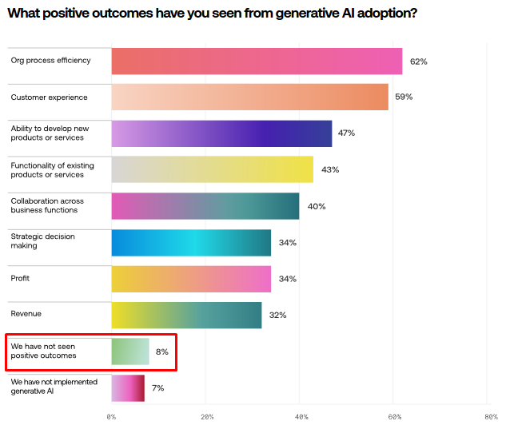

-   AI 프로젝트에 실패한 기업이 겨우 "**8%**"라고 믿을 만큼 멍청해야 하나?
    -   CRUD 앱으로도 이걸 꾸준히 관리할 수 없는데 이 숫자가 우스꽝스럽지 않다고 생각하나?
    -   LLM 열풍 동안 "**일부**" 기업은 혜택을 봤겠지만 "**92%**"는 아님
-   34%의 기업이 생성형 AI가 전략적 의사 결정에 도움이 되고 있다고 보고했다고?
    -   도대체 무슨 소리야? GPT-4는 파이썬만큼 수준 높은 일관된 Elixir도 작성하지 못함
    -   그런데 당신은 "**가끔 가족들이 섭취할 치명적인 독소를 양조하라고 사람들에게 말하는**" 그것에 의사 결정을 맡기고 있다고 인정하고 있나?
-   필자는 믿지 않음. 제정신인 사람은 아무도 믿지 않음
    -   이사회가 당신이 설문조사에 쓴 것을 믿는다면 당신을 해고해야 함
    -   친구들 중 일부가 리더십 자리에 "**꼭**" 있어야 한다고 느끼는 이유를 이제야 이해함
        -   당신이 우리 모두를 집단적으로 절벽에서 몰아내기 전에 누군가는 권력의 고삐를 당신의 도마뱀 발톱에서 뽑아내야 하기 때문임
-   몇 년 전 한 친구가 FAANG 조직에 초대받아 미국을 방문했는데, 많은 발표가 인상적인 인공지능 제품의 기술 데모였음
    -   소프트웨어 엔지니어인 그는 개발자들과 무대 뒤에서 시간을 보냈고, "**대부분의 데모가 조작되었다**"는 사실을 알게 되었음
        -   제품이 작동하지 않았고, "**실제로 예측해야 할 것을 예측하는**" 등의 사소한 문제를 해결하지 못했던 것
    -   그래도 숨 가쁜 청중들에게 1시간 동안 절대적인 넌센스를 내뱉는 걸 막지는 못했음!
-   또 다른 친구는 응급 서비스용 소프트웨어를 검토하고 있었는데, 영업사원들은 응급 서비스 구매 담당자가 열혈 프로그래머일 거라고는 예상하지 못했음
    -   이 허술한 보안 의식 때문에 그들은 "**실수로 그 서비스가 결국 인도의 어떤 남자일 뿐이라는 사실을 드러냈음**"
    -   필자도 인도 사촌들과 자리를 바꾸면 그냥 인도의 아무 남자나 될 테니 개인적으로 받아들이겠음
    -   하지만 "**AI라는 말을 써서 나처럼 생긴 사람들의 노동을 외국 정부에 팔려는 것**"은 엿 같고, 당신은 비윤리적인 괴물임
    -   계속 "**try { thisBullshit(); }**"을 시도한다면 "**catch (theseHands)**"를 받게 될 거임

#### IV. 하지만 우리는 미래를 준비해야 해-

> "**ChatGPT에게 올가미(garotte) 준비하는 법을 물어봐서 그걸로 너를 목 졸라 죽일 거야. 그리고 넌 ChatGPT가 10%의 확률로 환각에 빠져서 올가미를 종이로 만들어야 한다고 잘못 답변하길 '기도'해야 할 거야.**"

-   그러나 기술의 핵심 원칙을 이해할 기술적 배경은 있으며, 우리는 세 가지 방향 중 하나로 가고 있는 것 같음
    1.  The first is that we have some sort of intelligence explosion, where AI recursively self-improves itself, and we're all harvested for our constituent atoms because a market algorithm works out that humans can be converted into gloobnar, a novel epoxy which is in great demand amongst the aliens the next galaxy over for fixing their equivalent of coffee machines.
    2.  현재 접근 방식이 기대만큼 확장되지 않는다는 것이 밝혀짐. 데이터 부족, 아키텍처 문제 등 여러 이유 때문
        -   이 우주에서는 "**일부**" 산업, 예를 들어 고객 지원 같은 곳이 크게 혼란에 빠질 것임
        -   이런 식으로 점진적인 이득을 계속 낸다면 회사는 그냥 생성형 AI가 필요하지 않음. 정말 필요하다면 "**정확히**" 왜 필요한지 알게 될 거임
            -   An example of something that has actually benefited me is that I keep track of my life administration via Todoist, and Todoist has a feature that allows you to convert filters on your tasks from natural language into their in-house filtering language. Tremendous! It saved me learning a system that I'll use once every five years. I was actually happy about this, and it's a real edge over other applications.
            -   하지만 "**사용 사례가 없다면**" 이런 광범위한 기능은 실제로 그다지 유용하지 않음
            -   해야 할 일은 "**운영과 문화를 개선**"하는 것뿐이며, 그렇게 해야만 AI가 필요할 때 사용할 수 있는 것임
            -   모두가 검색 증강 생성(RAG:Retrieval-Augmented Generation)에 대해 이야기하고 있지만 대부분의 회사에는 실제로 검색할 만한 내부 문서가 없음. 제발 "**FIX. YOUR. SHIT.**".
    3.  이러한 근본적인 문제가 해결되고 오늘날 우리가 알고 있는 프로그래밍을 대체하거나 광범위하게 일반 지능으로 식별될 수 있는 무언가로 끝남
        -   생성형 AI가 로켓처럼 궤도를 달린다면 "**무작위 챗봇을 만드는 것이 당신을 미래에 대비시켜 주지는 않을 거임**"
            -   "**import openai**"를 입력한다고 해서 인공지능의 최첨단에 있다는 뜻이 아님
            -   Your business will be disrupted exactly as hard as it would have been if you had done nothing, and much worse than it would have been if you just got your fundamentals right.
                -   비즈니스는 아무것도 하지 않았을 때와 "**정확히 같은 수준으로**" 혼란에 빠질 것이고, 탄탄한 기반을 가진 비즈니스였다면 훨씬 더 심각할 것임
            -   직원들에게 이해관계자에게 이메일을 쓰는 데 ChatGPT를 사용하라고 가르치는 것은 "**기업이 이것에서 살아남을 수 있게 해주지 않을 거임**"
        -   온건한 영향과 소행성이 공룡을 멸종시키는 수준의 영향 사이에서 바늘구멍을 통과한다면 모든 것이 "**영원히 바뀔 것**"이고, 당신의 미지근한 준비는 거대한 쓰나미 그림자에서 "**매우 힘겹게**" 버티는 개미만큼의 영향력밖에 없을 거임
-   "**기준을 높이기 위해**" LLM 기반 코드 리뷰를 구현해보라고 하는 대신 사람들에게 조금이라도 규율을 가르치라고 하는 또 다른 멍청한 새끼가 나타나면 유도를 충분히 배워서 그들을 태양으로 던져버릴 거임
-   충분히 강조할 수 없는데, "**절대적인 최첨단에 있으면서 새로운 연구를 내놓거나**", 아니면 LLM을 통합하는 사소한 양보를 제외하고는 5년 전에 하던 대로 정확히 해야 함
    -   "**중간에 있는 건 전혀 말이 되지 않음**". 당신의 업계가 "**지금 당장 완전히 혼란에 빠지고**" 있는 드문 분야에서 일하지 않는 한 말이죠.

#### VI.

> "**내가 격분하는 이유는 LLM이나 생성형 AI 열풍 자체를 '싫어해서'가 아님. Copilot으로 재미는 봤지만 결국 나를 더 멍청하게 만든다고 판단했음. 인상적이지만 상용구를 쏟아내는 것 외에는 실제로 **"적합하지"** 않음. 프로그래밍은 설계이고 이 도구들은 아직 이를 진지하게 도와주기에 충분히 좋지 않기 때문에 생각했던 것처럼 엄청난 생산성 향상을 가져다주지는 않았음.**"

-   내가 싫어하는 건 피를 빨아먹고 맹목적으로 꿈틀거리는 거머리들처럼 AI에 달라붙은 사람들임
    -   인기 없을 때는 비즈니스를 위한 블록체인의 잠재력을 논하는 걸 좋아했던 자들임
    -   최근 컨퍼런스에 참석했을 때는 "**'양자'의 잠재력**"에 대해 숨 가쁘게 토론했지만 도대체 그게 뭔지 명확히 모르는 것 같았음
-   지난주에 읽은 기사 아래에 작은 설문조사 팝업이 떠서 살펴봤음.

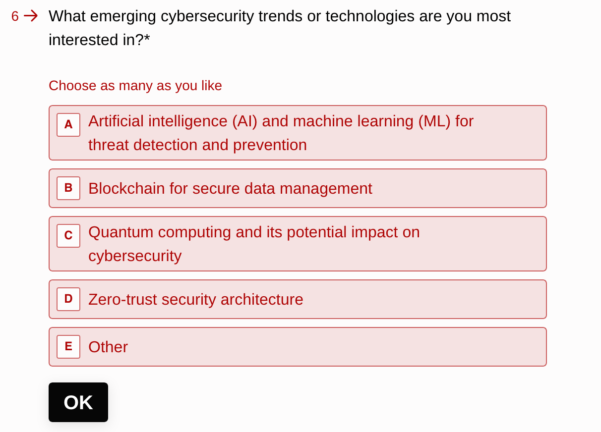   

    -   자, 여기 있습니다. 친애하는 리더여, 당신은 무엇에 가장 관심이 있나요? 인공지능, 블록체인, 아니면 양자 컴퓨팅?
    -   그들은 목표 시장이 누구인지 정확히 알고 있음. 모든 것에 미소 짓는 법을 배워서 "**남의 돈**"을 맡은 권력자들이며, 다음 투기적 유행에 편승해 돈을 찍어낼 수 있다는 걸 아는 사람들임
    -   No competent person in security that I know - that is, working day-to-day cybersecurity as opposed to an institution dedicated to bleeding-edge research - cares about any of this. They're busy trying to work out if the firewalls are configured correctly, or if the organization is committing passwords to their repositories. 
        -   내가 아는 유능한 보안 전문가 중에서는 아무도 이런 것에 관심이 없음. 그들은 방화벽이 올바르게 설정되었는지, 작업자가 저장소에 실수로 암호를 커밋하고 있는지 알아내느라 바쁨
-   간단히 말해 이 개자식들은 생각이 똑바로 박힌 사람들에게 특히 더 혐오스러운 부류임
    -   실제로 이 분야에서 진전을 이루고 있는 사람들에게는 창피한 존재이고, 기술을 현명하게 사용해 세상을 개선하는 법을 아는 사람들에게는 불명예스러운 존재임
    -   또한 교훈을 배울 때까지 사상 지도자 감옥에 처넣어야 할 따분한 무지렁이 개자식들임. 내가 모금하고 있는 감옥임
-   내가 선택한 직업이 나를 이 사람들과 너무 가깝게 만든다는 사실과 그들의 악취 나는 음절이 내 귀를 더럽히지 않도록 열심히 공부한다는 사실에 역겹습니다
    -   의인들과 어울리기 위해 필사적으로 도망쳐야 하는데, 그들은 OSS에 기여하고 하루 종일 애자일에 대해 이야기하는 것이 인간 생산성에 관한 책을 읽은 외계인들을 위한 운동이라고 생각함
-   방금 훨씬 덜 발전된 나라에서 여행을 마치고 돌아왔는데, 정말로 잠시나마 "**살아보니**" 그 돈이 얼마나 많은 삶을 개선할 수 있는지 "**볼 수**" 있었음
    -   그런데 믿을 수 없을 만큼 Microsoft Fabric 하수구로 쏟아붓고 있으니 내 기어가 갈리는 것 같음
-   맹세컨대 나는 공부하고, 글을 쓰고, 네트워크를 형성하고, 그렇지 않으면 "**문제에 힘을 가할**" 것임
    -   그 자원들이 방긋 웃는 광대의 지갑 대신 사회를 위해 무언가를 이룰 수 있는 곳으로 가게 될 때까지 말임!
   
## 24.07.02

**LZ4 무손실 데이터 압축**

- GPT Say
  - 목적: LZ4는 실시간 데이터 압축과 매우 빠른 압축/해제를 목표로 설계된 알고리즘입니다.
  - 속도: LZ4는 특히 속도가 중요한 응용 프로그램에서 사용됩니다. 압축 속도와 해제 속도가 매우 빠릅니다.
  - 효율성: 다른 압축 알고리즘에 비해 압축률은 다소 낮을 수 있지만, 속도는 그보다 훨씬 뛰어납니다.

#### 작동 원리

LZ4는 LZ77 계열의 알고리즘으로, 연속되는 데이터 블록에서 반복되는 패턴을 찾아 압축합니다.

1. **매칭 과정**:
   - 입력 데이터 스트림에서 문자열 매칭을 수행합니다.
   - 중복되는 문자열을 찾고, 이를 참조로 대체합니다.

2. **토큰 생성**:
   - LZ4는 토큰을 사용하여 데이터를 표현합니다.
   - 토큰은 리터럴 길이와 매치 길이를 포함합니다.

3. **리터럴 처리**:
   - 중복되지 않는 데이터(리터럴)는 그대로 출력됩니다.

4. **매치 처리**:
   - 중복된 데이터는 이전에 등장한 위치를 참조하여 압축합니다.

- [LZ4 (compression algorithm) - Wikipedia](https://en.wikipedia.org/wiki/LZ4_(compression_algorithm))
- [lz4lz4 Extremely Fast Compression algorithm](https://github.com/lz4/lz4)

## 24.07.03

.NET SharedArrayPool 이 대여할 배열 사이즈를 어떻게 결정하는지 궁금해서 찾아봄

계산식은

> minimumBufferLength -> BucketIndex : BitOperations.Log2((uint)bufferSize - 1 | 15) - 3
>
> BucketIndex -> BufferLength : 16 << bin Index 

| Buffer Size Range   | Bucket Index |
|---------------|--------|
| 1 ~ 16        | 0      |
| 17 ~ 32       | 1      |
| 33 ~ 64       | 2      |
| 65 ~ 128      | 3      |
| 129 ~ 256     | 4      |
| 257 ~ 512     | 5      |
| 513 ~ 1024    | 6      |
| 1025 ~ 2048   | 7      |

중간 과정 동작은 

| Input | Result | Intermediate Steps |
|-------|--------|---------------------|
| 1     | 0      | 1 (1) => 0 (0) => 15 (1111) => 3 (11) => 0 |
| 16    | 0      | 16 (10000) => 15 (1111) => 15 (1111) => 3 (11) => 0 |
| 17    | 1      | 17 (10001) => 16 (10000) => 31 (11111) => 4 (100) => 1 |
| 32    | 1      | 32 (100000) => 31 (11111) => 31 (11111) => 4 (100) => 1 |
| 33    | 2      | 33 (100001) => 32 (100000) => 47 (101111) => 5 (101) => 2 |
| 64    | 2      | 64 (1000000) => 63 (111111) => 63 (111111) => 5 (101) => 2 |
| 65    | 3      | 65 (1000001) => 64 (1000000) => 79 (1001111) => 6 (110) => 3 |
| 128   | 3      | 128 (10000000) => 127 (1111111) => 127 (1111111) => 6 (110) => 3 |
| 129   | 4      | 129 (10000001) => 128 (10000000) => 143 (10001111) => 7 (111) => 4 |
| 256   | 4      | 256 (100000000) => 255 (11111111) => 255 (11111111) => 7 (111) => 4 |
| 257   | 5      | 257 (100000001) => 256 (100000000) => 271 (100001111) => 8 (1000) => 5 |
| 512   | 5      | 512 (1000000000) => 511 (111111111) => 511 (111111111) => 8 (1000) => 5 |
| 513   | 6      | 513 (1000000001) => 512 (1000000000) => 527 (1000001111) => 9 (1001) => 6 |
| 1024  | 6      | 1024 (10000000000) => 1023 (1111111111) => 1023 (1111111111) => 9 (1001) => 6 |
| 1025  | 7      | 1025 (10000000001) => 1024 (10000000000) => 1039 (10000001111) => 10 (1010) => 7 |
| 2048  | 7      | 2048 (100000000000) => 2047 (11111111111) => 2047 (11111111111) => 10 (1010) => 7 |

## 24.07.07

[Concurrent Hosted Service Start and Stop in .NET 8 - Steve Gordon - Code with Steve](https://www.stevejgordon.co.uk/concurrent-hosted-service-start-and-stop-in-dotnet-8)

- [(27) Concurrent Hosted Service in .NET 8 | .NET Conf 2023](https://www.youtube.com/watch?v=sD_-XwauabE&list=WL&index=2)


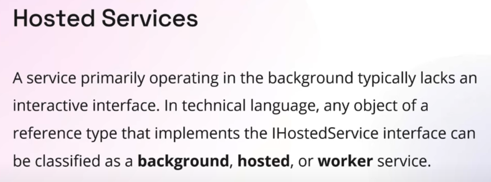

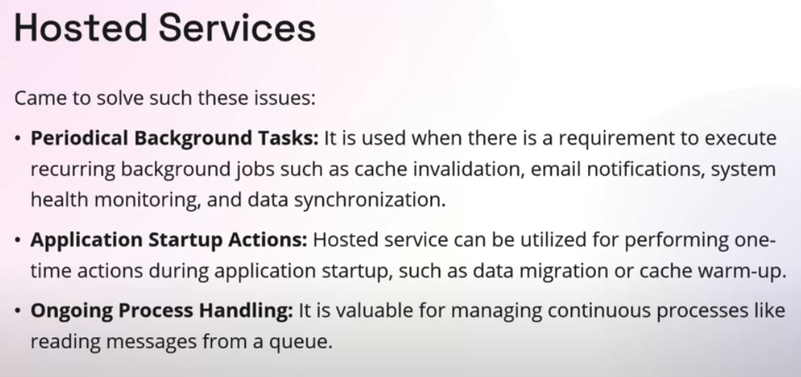

- 호스트 역힐에 대해서 이것저것 설명해주는 파트
  - Periodical Background Tasks : 주기적으로 실행되는 백그라운드 직압
  - Application Startup Actions : 원타임 스타트업 액션. 시작과 함께 단 한번 실행되는 작업
  - Ongoing Process Handling : 지속적인 작업에 대해서 일컫는 말. 예컨대 동영상 스트리밍

> Before .NET 8, the code that starts and stops hosted services does so sequentially. Each IHostedService registered with the DI container is started in sequence by calling the StartAsync method on the instance. Crucially, this included awaiting the completion of the StartAsync method, meaning that each StartAsync Task was required to complete before the next service was triggered. The effect of this design does not significantly impact most applications, but it is still possible for this default behaviour to cause issues.

- 과거 .NET 의 멀티 호스트는 순차적으로(sequentially) 실행/종료되었다고 함
- 대부분의 애플리케이션에서는 이 점이 문제되지 않음. 하지만 간혹 이슈가 생겼는데...


- 여기서 scaling issue 란
  - 블랙 프라이데이 이벤트 당일, 티켓팅 같은 서비스를 상상해보자. 접속 트래픽이 몰려서 host 스케일 업을 시도하려는데, 순차 실행하는 경우 시작 시간이 굉장히 길어질 수 있기 때문에 모든 호스트가 준비되기 이전에는 사용자 요청을 받을 수 없게 되는 상황이 왕왕 있었나 보다.
- gracelfully shutdown 내용은
  - 종료의 경우에는 기본 종료 타임아웃이 30초 인데, 병렬 실행이 아닌 순차 종료 과정에서 30초를 넘겨버리는 경우가 있던 모양이다.

[Cloned Dictionary vs. Immutable Dictionary vs. Frozen Dictionary in high traffic systems - Ayende @ Rahien](https://ayende.com/blog/201314-B/cloned-dictionary-vs-immutable-dictionary-vs-frozen-dictionary-in-high-traffic-systems?Key=5b127528-fc8b-4749-9442-eedcd34afb9b#)

```cs
IEnumerable<object> SingleDictionary()
{
    var dic = new Dictionary<long, object>();
    var random = new Random(932);
    var v = new object();
    // number of transactions
    for (var txCount = 0; txCount < 1000; txCount++)
    {
        // operations in transaction
        for (int opCount = 0; opCount < 10,000; opCount++)
        {
            dic[random.NextInt64(0, 1024 * 1024 * 1024)] = v;
        }
        yield return dic; // publish the dictionary
    }
}

IEnumerable<object> ClonedDictionary()
{
    var dic = new Dictionary<long, object>();
    var random = new Random(932);
    var v = new object();
    // number of transactions
    for (var txCount = 0; txCount < 1000; txCount++)
    {
        // operations in transaction
        for (int opCount = 0; opCount < 10,000; opCount++)
        {
            dic[random.NextInt64(0, 1024 * 1024 * 1024)] = v;
        }
        // publish the dictionary
        yield return new Dictionary<long, object>(dic);
    }
}

IEnumerable<object> ClonedImmutableDictionary()
{
    var dic = ImmutableDictionary.Create<long, object>();
    var random = new Random(932);
    var v = new object();
    // number of transactions
    for (var txCount = 0; txCount < 1000; txCount++)
    {
        // operations in transaction
        for (int opCount = 0; opCount < 10,000; opCount++)
        {
            dic = dic.Add(random.NextInt64(0, 1024 * 1024 * 1024), v);
        }
        // publish the dictionary
        yield return dic;
    }
}

IEnumerable<object> BuilderImmutableDictionary()
{
    var builder = ImmutableDictionary.CreateBuilder<long, object>();
    var random = new Random(932);
    var v = new object();
    // number of transactions
    for (var txCount = 0; txCount < 1000; txCount++)
    {
        // operations in transaction
        for (int opCount = 0; opCount < 10,000; opCount++)
        {
            builder[random.NextInt64(0, 1024 * 1024 * 1024)] = v;
        }
        // publish the dictionary
        yield return builder.ToImmutable();
    }
}

IEnumerable<object> FrozenDictionary()
{
    var dic = new Dictionary<long, object>();
    var random = new Random(932);
    var v = new object();
    // number of transactions
    for (var txCount = 0; txCount < 1000; txCount++)
    {
        // operations in transaction
        for (int opCount = 0; opCount < 10,000; opCount++)
        {
            dic[random.NextInt64(0, 1024 * 1024 * 1024)] = v;
        }
        // publish the dictionary
        yield return dic.ToFrozenDictionary();
    }
}


```

벤치마크 결과

| Method                               | Mean           | Ratio   |
|--------------------------------------|----------------|---------|
| SingleDictionaryBench                | 7.768 ms       | 1.00    |
| BuilderImmutableDictionaryBench      | 122.508 ms     | 15.82   |
| ClonedImmutableDictionaryBench       | 176.041 ms     | 21.95   |
| ClonedDictionaryBench                | 1,489.614 ms   | 195.04  |
| FrozenDictionaryBench                | 6,279.542 ms   | 807.36  |

Dictionary 관련 동작에서 ImmutableDictionary의 Copy 가 빠르다고 함.

> ImmutableDictionary의 복사 작업이 예상보다 빠른 이유는 내부 구현 방식 덕분입니다. ImmutableDictionary는 모든 변경 작업에서 새로운 사본을 만드는 대신 구조 공유(structure sharing)라는 기술을 사용합니다. 이 기술을 통해 변경되지 않은 부분을 재사용하면서 효율적으로 새로운 사본을 만듭니다. 구체적인 이유는 다음과 같습니다:

^ by ChatGPT

### 비동기 I/O 모델 비교: IOCP, epoll, kqueue by ChatGPT

#### IOCP (I/O Completion Ports)

- **플랫폼**: Windows
- **작동 방식**:
  - IOCP는 비동기 I/O 작업이 완료되면 작업 완료 통지를 큐에 추가하고, 스레드 풀에서 대기 중인 스레드에게 작업을 할당합니다.
  - 하나의 스레드가 다수의 비동기 I/O 요청을 관리할 수 있습니다.
  - 작업 완료 후에 커널이 해당 작업을 완료한 스레드에게 통지합니다.
- **장점**:
  - 매우 높은 성능과 확장성을 제공합니다.
  - 스레드 풀과 통합되어 있어 스레드 관리가 효율적입니다.
  - I/O 작업이 완료될 때까지 스레드를 블로킹하지 않으므로 CPU 사용 효율이 높습니다.
- **단점**:
  - Windows 전용 기술입니다.

#### epoll

- **플랫폼**: Linux
- **작동 방식**:
  - epoll은 이벤트 기반 인터페이스로, 다수의 파일 디스크립터를 효율적으로 관리합니다.
  - `epoll_create`로 epoll 인스턴스를 생성하고, `epoll_ctl`로 관심 있는 이벤트를 등록하며, `epoll_wait`로 이벤트가 발생할 때까지 대기합니다.
  - 파일 디스크립터는 이벤트 발생 시까지 비동기적으로 처리됩니다.
- **장점**:
  - 많은 수의 파일 디스크립터를 효율적으로 관리합니다.
  - 대기열에 있는 이벤트만 처리하므로 이벤트 처리의 오버헤드가 적습니다.
  - 비동기 I/O 처리가 간편하며, 높은 성능을 제공합니다.
- **단점**:
  - 비교적 복잡한 API를 가지고 있으며, 초기 설정이 필요합니다.

#### kqueue

- **플랫폼**: BSD 계열 (macOS 및 iOS 포함)
- **작동 방식**:
  - kqueue는 이벤트 통지 메커니즘으로, 파일 디스크립터, 타이머, 프로세스 이벤트 등 다양한 소스를 관리할 수 있습니다.
  - `kqueue`로 큐를 생성하고, `kevent`로 이벤트를 등록하며, `kevent`로 이벤트를 대기하고 처리합니다.
  - 등록된 이벤트가 발생하면 비동기적으로 처리됩니다.
- **장점**:
  - 다양한 이벤트 소스를 통합하여 관리할 수 있습니다.
  - 효율적인 이벤트 통지 메커니즘으로 높은 성능을 제공합니다.
- **단점**:
  - BSD 계열 운영 체제에 한정됩니다.

#### .NET의 크로스 플랫폼 비동기 I/O 지원

- .NET은 각 플랫폼에서 네이티브 비동기 I/O 모델을 활용하여 효율적인 네트워크 통신을 제공합니다.
  - **iOS**: .NET의 비동기 소켓 기능은 kqueue를 사용합니다.
  - **Android**: .NET의 비동기 소켓 기능은 epoll을 사용합니다.

## 24.07.18

[GitHub - VerifyTestsVerify Verify is a snapshot tool that simplifies the assertion of complex data models and documents.](https://github.com/VerifyTests/Verify)

- 스냅샷 테스팅
  - 각 검증 속성들을 serialize 해서 파일로 저장, 이후 테스트 실행 시에 serialize 결과를 기존 파일의 값과 비교하는 방식

> Verify is a snapshot tool that simplifies the assertion of complex data models and documents.
>
> Verify is called on the test result during the assertion phase. It serializes that result and stores it in a file that matches the test name. On the next test execution, the result is again serialized and compared to the existing file. The test will fail if the two snapshots do not match: either the change is unexpected, or the reference snapshot needs to be updated to the new result.

- 최초 검증

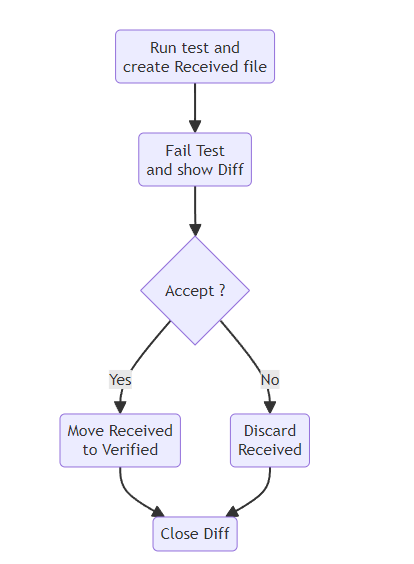

- n 회차 검증

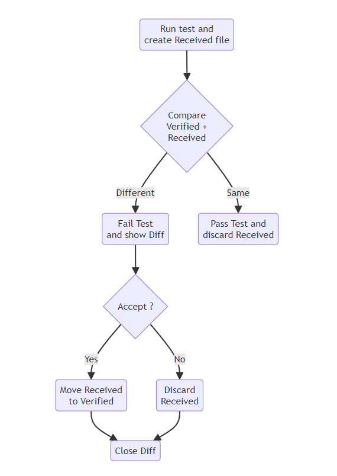

## 24.07.25

[(74) 왜 배열은 0부터 시작할까? 프로그래밍의 비밀](https://www.youtube.com/watch?v=TjpP1udN58k)

- 프로그래밍에서 메모리를 다룰 때 배열 시작 주소, element size, offset 개념을 생각하면 된다.
  - [0] : 시작 주소로부터 0만큼 떨어진 위치. 
  - [1] : 시작 주소로부터 1 * size 만큼 떨어진 위치
  - [n] : 시작 주소로부터 n * size 만큼 떨어진 위치

ChatGPT

### 왜 프로그래밍에서 배열은 0부터 시작하는가?

프로그래밍에서 배열이 0부터 시작하는 이유는 역사적, 기술적 배경에 기인합니다. 주요 이유는 다음과 같습니다.

### 1. 메모리 접근의 효율성

- 배열의 인덱스는 실제 메모리 주소에 직접적으로 영향을 미칩니다.
- 배열의 시작 주소가 주어졌을 때, 배열의 `n`번째 요소를 찾기 위한 계산식은 `base_address + n * element_size`입니다.
- 1에서 시작한다면 계산식은 `base_address + (n-1) * element_size`가 되며, 이는 추가 연산이 필요하게 됩니다.
- 0부터 시작하면 이러한 추가 연산을 줄일 수 있습니다.

### 2. 수학적 편의성

- 0을 시작으로 하는 것은 수학적으로 일부 알고리즘에서 더 편리할 때가 많습니다.
- 예를 들어, 순환 구조에서 인덱스를 모듈로 연산하는 경우, 0부터 시작하는 것이 계산이 간단해집니다.

대부분의 현대 프로그래밍 언어에서는 배열이나 리스트의 인덱스를 0부터 시작하도록 설계되었습니다. 일부 언어는 1부터 시작하는 인덱싱을 사용하기도 합니다. 이는 해당 언어의 사용 용도나 설계 철학에 따라 다릅니다.

## 24.08.01

[Restricting a Value Lifetime With the "scoped" Keyword in C#](https://code-maze.com/csharp-scoped-keyword/)

- [Low level struct improvements - C# feature specifications | Microsoft Learn](https://learn.microsoft.com/en-us/dotnet/csharp/language-reference/proposals/csharp-11.0/low-level-struct-improvements)
- `scoped` : c# 11 feature

```cs
public class Program
{
    static void Main(string[] args)
    {
        Span<int> heights = stackalloc int[3] { -5, 10, -1 };
        new FastStore<int>().Clone(heights); //<-- compile error!!!
    }
}

public ref struct FastStore<T>
{
    private Span<T> _values;
    public int Length { get => _values.Length; }
    public FastStore()
    {
        _values = new T[3];
    }
    public void Clone(ReadOnlySpan<T> values)
    {
        if (values.Length != 3)
            throw new ArgumentException($"'{nameof(values)}' must contain 3 items");
        values.CopyTo(_values);
    }
}
```
> the compiler needs to ensure that the stack-allocated memory doesn’t go out of scope before the struct itself.

```cs
public ref struct FastStore<T>
{
    private Span<T> _values;
    public int Length { get => _values.Length; }
    public FastStore()
    {
        _values = new T[3];
    }
    public void Clone(scoped ReadOnlySpan<T> values)
    {
        if (values.Length != 3)
            throw new ArgumentException($"'{nameof(values)}' must contain 3 items");
        values.CopyTo(_values);
    }
}
```

- 이렇게 고치면 해결된다. `Clone`의 `values` 인자의 생명주기를 `scoped` 키워드를 통해, 메서드 내부에서 한정되 있다는 것을 컴파일러에게 알려줌

## 24.08.02

[Next Feature Fallacy 새로운 기능을 추가하면 사람들이 갑자기 제품을 사용  GeekNews](https://news.hada.io/topic?id=15788)

- [The Next Feature Fallacy The fallacy that the next new feature will suddenly make people use your product at andrewchen](https://andrewchen.com/the-next-feature-fallacy-the-fallacy-that-the-next-new-feature-will-suddenly-make-people-use-your-product/)

**평균적인 웹 앱의 곡선 (원문 도표 참고)**


1. 1,000명의 사용자가 제품을 확인하기 위해 홈페이지를 방문한다.
2. 20%가 가입한다. (200명)
3. 80%가 온보딩을 완료한다. (160명)
4. 40%는 가입 후 다음날 방문한다. (80명)
5. 20%는 가입 후 다음 주에 방문한다. (40명)
6. 가입 후 30일 후 10%가 방문한다. (20명)
7. 결국 30일 후 20명의 사용자(1,000명 중)가 DAU(Daily Active User)가 된다.

- 이것은 매우 일반적인 패턴이다.
- 물론 때로는 훌륭한 브랜드를 구축했거나 전환율이 높은 추천을 통해 트래픽을 얻는 앱에서 더 나은 수치를 보기도 한다.
- 특히 메시징 앱 같은 경우는 D1/D7/D30 지표가 위에 언급한 것보다 2-3배 더 높은 경우가 많다.
- 그러나 대체로 대부분의 사람들은 자신의 수치에 대해 실망한다.

**대부분의 기능은 곡선을 구부릴 수 없다**

- 중요한 부분을 타겟팅하지 않는 새로운 기능을 쉽게 구축할 수 있기 때문에 Next Feature Fallacy(다음 기능 오류)가 발생한다.
- 사람들은 위 곡선을 구부리기 위해 기능을 설계할 때 두 가지 실수를 저지른다. 이러한 실수는 사용자가 깊은 참여를 유도하는 기능에 집중하려는 본능이 있기 때문에 발생한다.
  1. 새 기능을 사용하는 사람이 너무 적다.(기능이 비사용자 및 신규 사용자가 아닌 참여/유지 사용자를 대상으로 할 때 더욱 그렇다.)
  2. 새 기능에 참여해도 그 영향이 너무 적다. (주요 기능이 온보딩 프로세스 외부의 선택적 작업처럼 보일 때 더욱 그렇다.)

- 또한 자주 사용되지 않는 기능에 집중하는 것은 잘못된 방향으로 이끌 수 있다.
- 7일차에 관련된 기능을 추가해도 온보딩과 관련된 경험보다 덜 사용될 것이고, 방문자의 4% 미만이 그 기능을 보게 될 것이다.
- 마찬가지로, 올바른 제품 사용(및 설정) 방법에 대한 의견이 일치하지 않으면 제품의 온보딩 환경이 취약해질 수 있다.

초기 트위터에서는 가입하면 바로 빈 피드와 자신의 상태를 입력할 수 있는 텍스트 상자로 이동했다.

이렇게 하면 제품을 탐색하고 무엇이든 할 수 있지만, 궁극적으로는 현재 디자인(다른 계정을 팔로우하도록 요청하는 것)보다 취약한 디자인이다.

트위터는 사람들이 트윗을 많이 하지 않고 주로 독자로서 사용한다는 점을 이해한 후 이를 제품에 대한 깊은 통찰력으로 연결했다.

**engagement wall**

- 고려해야 할 또 다른 점은 새로운 기능이 제품에 대한 깊은 참여/투자를 전제로 하면 ‘참여의 벽’이 생긴다는 것이다.
- 이 벽 뒤에 있다는 말은 사용자가 제품을 구매하고 참여해야만 해당 기능을 경험할 수 있다는 의미이다.
- 예를 들어 사진 올리기, 새 프로젝트 만들기, 폴더에 파일 끌어놓기와 같이 노력은 많이 들지만 참여율은 낮은 작업을 들 수 있다.
- 벽 앞에는 피드 탐색, 사진 평가 또는 링크 클릭과 같이 많은 투자 없이도 가치를 창출하는 기능이 있을 수 있다.
- 참여 벽 뒤에 있는 기능을 많이 구축하면 소수의 사용자만 혜택을 경험할 가능성이 높다. 이러한 기능을 여러 개 추가한다고 해서 문제가 해결되지 않는다.

**새 기능을 선택하는 방법**

- 곡선을 구부리는 기능을 선택하려면 사용자 수명 주기에 대한 깊은 이해가 필요하다.
- 가장 중요한 것은 기능의 도달 범위를 최대화하여 가장 많은 사람들에게 영향을 미치는 것이다.
- 일반적으로 최고의 기능은 주로 비사용자와 일반 사용자에게 초점을 맞추는 경우가 많은데, 그 이유는 단순히 더 많은 사용자가 있기 때문이다.
- 위 곡선의 앞부분을 조금만 개선해도 나머지 부분에 파급 효과가 나타날 수 있다.
- 즉, 랜딩 페이지, 온보딩 순서 및 초기 제품 경험이 가장 중요하지만 일반적으로 충분한 주의를 기울이지 않는 경우가 많다는 뜻이다.
- 마찬가지로, 사용자가 활성화되기 위해 무엇을 해야 하는지에 대한 인사이트를 확보하여 첫 방문이 제대로 이루어질 수 있도록 해야 한다.
- 소셜 네트워크의 경우, 사용자가 팔로우/친구 추가를 하도록 유도하는 것이 중요한데, 이는 재방문하게 되는 여러 루프를 시작하기 때문이다.
- SaaS 앱의 경우, 올바른 페이지에 JS 태그를 가져오는 것이 중요하다.
- 블로그의 경우, 이름과 테마를 정하고 첫 번째 게시물을 신중히 작성하여 시간 투자를 유도해야 한다.
- 이처럼 최소한의 온보딩 프로세스를 분리하면 초기 단계에서 높은 전환율을 유지하면서도 성공적인 경험을 제공할 수 있다.

[블로그개인 웹사이트에서 좋아하는 마이크로 기능들  GeekNews](https://news.hada.io/topic?id=15503)

- [Microfeatures I Love in Blogs and Personal Websites](https://danilafe.com/blog/blog_microfeatures/)

**Sidenote**

- [About Gwern · Gwern.net](https://gwern.net/me)


- 본문을 방해하지 않고 추가 정보를 제공하는 기능
- 독자가 추가적인 세부 사항이나 출처를 쉽게 확인할 수 있게 해줌
- Gwern의 사이드노트 사용이 특히 인상적임. 그의 글은 사이드노트를 매우 많이 사용하며, 주 내용의 흐름을 방해하지 않으면서 추가적인 정보를 제공함.
- 사이드노트를 사용하면, 주석을 페이지 하단으로 스크롤하지 않고도 쉽게 참조할 수 있음.
- Tufte CSS에서 영감을 받은 다양한 접근 방식을 볼 수 있음.

**Tables of Contents(목차)**

- 목차는 글의 주요 주제를 한눈에 볼 수 있게 해주며, 원하는 부분으로 쉽게 이동할 수 있게 해줌.
- 정적 사이트 생성기(예: Hugo)는 목차를 자동으로 생성할 수 있음.
- 보너스: 페이지 진행 상황 표시
  - 페이지 진행 상황 표시줄은 독자가 페이지 어디에 있는지를 시각적으로 보여줌.
  - Quanta Magazine에서 이러한 기능을 볼 수 있음.
  - CSS Tricks의 자습서를 통해 구현 방법을 배울 수 있음.

**Easily Linkable Headings(쉽게 링크 가능한 헤더)**

- HTML 요소의 ID를 이용해 특정 페이지 섹션을 링크할 수 있음.
- 사용자에게는 보이지 않으므로, 각 요소를 링크로 만들어 쉽게 참조할 수 있게 함.
- Hugo 문서에서 이러한 기능을 볼 수 있음.

**Grouping Series of Posts(시리즈 게시물 그룹화)**

- 여러 주제에 대해 길게 쓰고 싶을 때 시리즈로 나눠 게시하면 독자에게 더 쉽게 전달할 수 있음.
- 자동으로 "다음", "이전" 버튼을 추가하거나 네비게이션 허브를 생성할 수 있음.
- Chapel 언어 블로그에서 이러한 기능을 볼 수 있음.


**Dialogue(대화형 글)**

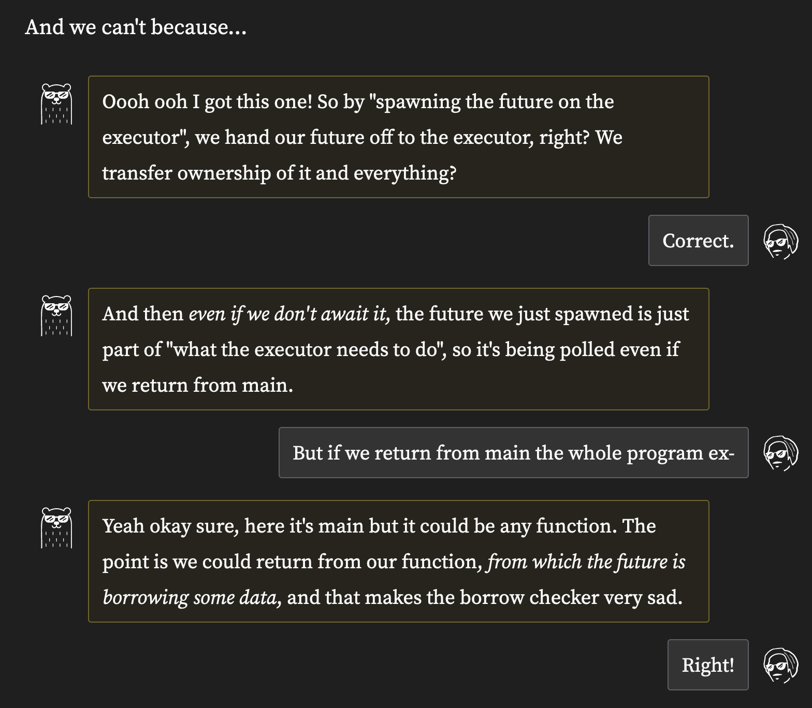

- 대화형식 글은 독자의 입장에서 질문을 던지고, 덜 경험 있는 관점에서의 우려를 표현함으로써 글을 더 재미있고 이해하기 쉽게 만듦.

**Code Blocks with Origin(코드 블록의 출처 표시)**

- 코드를 작성할 때 코드 블록에 파일명과 줄 번호를 표시하여 독자가 더 쉽게 이해할 수 있게 함.

**Markers for External Links(외부 링크 표시)**

- 외부 도메인으로 가는 링크를 작은 아이콘으로 표시함.
- 보너스: 다른 목적지에 대한 다른 마커
  - Gwern’s 웹사이트는 링크의 목적지에 따라 아이콘을 변경함.
  - 예: Wikipedia 링크에는 "W", Haskell.org 링크에는 람다 기호가 표시됨.

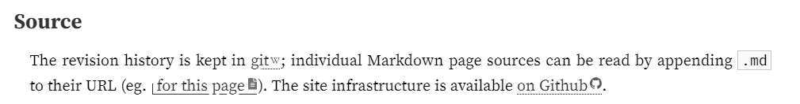

- 보너스 : 링크 미리보기
  - 링크를 마우스 오버할 때 페이지 미리보기를 표시함으로써 클릭하기 전에 내용을 미리 볼 수 있게 함.

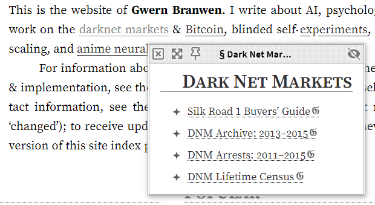

**RSS(Really Simple Syndication) Feeds**

- RSS는 사이트가 업데이트를 게시할 수 있게 해주는 피드 표준임.
- 독자들이 사이트를 직접 방문하지 않고도 업데이트를 받아볼 수 있게 해줌.

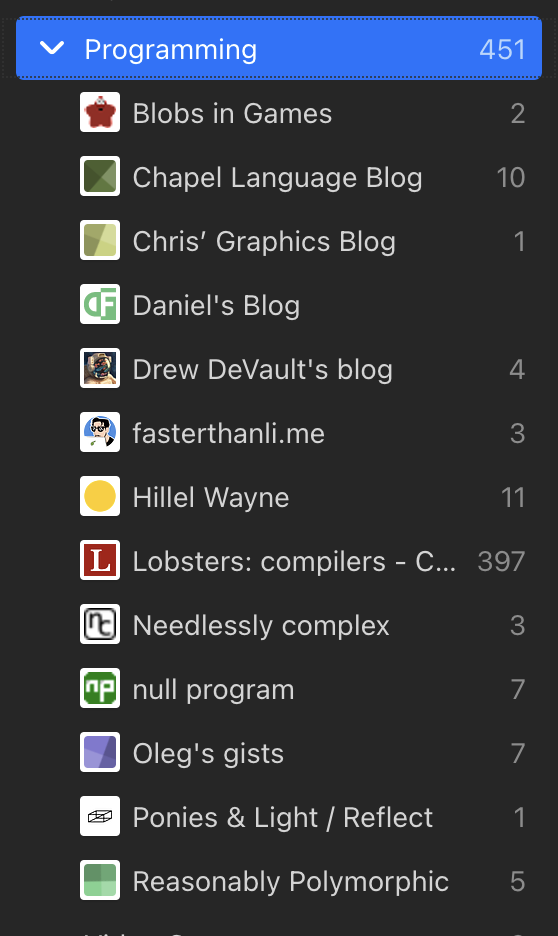

[Ask HN 소프트웨어 엔지니어를 그만둔 분들, 어떤 분야로 전환하셨나요  GeekNews](https://news.hada.io/topic?id=15962)

- [Ask HN Those of you who've left the SWE world, what did you transition into  Hacker News](https://news.ycombinator.com/item?id=40780940)

- 13년 SWE로 스타트업/대기업/황금수갑 상태 등으로 일해본 뒤 이제 이걸 끝내야할 것 같음
- 현재는 계약직으로 유연하게 일하며 회사를 만들려하고 있지만, 일이 잘 안풀리면 어떻게 될지 정말 모르겠음. 생계를 위해 코딩하는 회사에서 9-5로 돌아가고 싶은 생각이 전혀 없음
- 여러 곳에서 시니어/스태프로 일해 왔는데, 솔직히 더 이상 소프트웨어의 구조에 대해 논쟁하는 것을 즐기지 않고, 성격에 지쳤고, 업계의 유아기화(솔직히 부끄러움)에 지쳤지만, 무엇보다도 예전만큼 코딩을 즐기지 않음
- 하지만 아이가 생기고, 정규직으로 일해야 한다면 어떤 대안을 찾아야 할지 모르겠음. 나는 사람과 전략에 강점이 있고, 더 열심히 일하고 수입 한도가 무제한인 기술 회사에서 영업을 고려중. 다른 사람들의 이야기나 팁을 듣고 싶음

**황급수갑이 뭔가 했는데 아래와 같다고 chatgpt가 알려주네요**

> "황금수갑"은 일종의 메타포로, 회사가 직원에게 매우 좋은 급여나 혜택, 스톡옵션 등을 제공하여 직원이 다른 회사로 이직하는 것을 어렵게 만드는 상황을 의미합니다. 이 문장에서 말하는 "the golden handcuffs"는 바로 이런 상황을 설명하는 표현입니다.
> 
> 해석하면 다음과 같습니다:
>
> "스타트업과 더 큰 회사들에서 소프트웨어 엔지니어로 13년간 일하고, 황금수갑 같은 상황에서도 일해온 후, 이제는 내가 마침내 끝났다고 말할 수 있게 되었다."
>
> 즉, 좋은 보상이나 혜택 때문에 지금까지 계속 일해왔지만, 이제는 그 모든 것에서 벗어나겠다는 뜻입니다.


- 난 떠나지 않고, 여전히 회사에 다니고 있음
  - 하지만, 하루를 일 안하기(주 4일)로 하고 월급을 희생함
  - 정말 심한 번아웃은 일을 싫어하게 만들고, 코딩을 즐기지 못하게 만들고, 기술에 대한 자신감을 잃게 만들고, 외부 생활 없이 일하는 노예처럼 느껴지게 함
  - 단 하루를 버린 것이 정신 건강에 가장 큰 도움이 되었고, 다시는 주 32시간 이상 일하지 않을 것 같음. 물론 주 5일 근무도 다시는 하지 않을 것
  - 하지만 동시에 인생에 큰 변화를 가져왔음
    - 마지막 남은 소셜 미디어의 보루였던 Reddit은 극단적인 정치 신조와 독성 때문에 삭제
    - 유일한 '소셜' 미디어로 해커뉴스로 전환했고, 모든 디바이스에서 글로벌 및 지역 뉴스 사이트도 차단
    - 비싼 집에서 이사했고, 게임을 포기함으로써 스트레스를 해소할 수 있는 강력한 방법이 사라졌다는 것을 깨닫고 다시 게임에 빠져들었음
  - 지금은 주말에 다시 사이드 프로젝트로 열정적으로 일하고 있는데, 하루가 더 늘어난다는 게 정말 좋음. 그리고 나는 대체로 행복함
  - 휴대폰 사용 시간이 지난 1년간 평균 5~6시간에서 지난달에는 하루 평균 2시간 이하로 줄었음
  - 또한 방 안의 코끼리인 'AI'에 대한 내 생각도 많이 바뀌었음
    - 정말 과대 포장되어 있어서 저는 GitHub CoPilot 사용을 완전히 중단하고 대부분 LLM을 얕은 표면 검색 엔진으로만 사용하고 있음
    - 직업에 대해 걱정하지 말 것. 조만간 그렇게 될 것 같지도 않고 10배의 엔지니어가 되지도 않을 것
    - 아마도 똑똑한 사람은 1.5배의 개발자가 될 것이고 LLM에 너무 의존하는 사람은 0.5배의 개발자가 될 것이므로 균형이 맞을 것
- 20년 정도 기술 업계에 종사한 내 조언은 가능하다면 완전히 리셋할 수 있을 만큼 긴 안식년을 가진 다음 다시 평가해 보라는 것
  - 여행도 하고, 독서도 하고, 새로운 것을 시도하고, 개인적인 프로젝트도 하고, 잠시 동안 아무것도 하지 말아 보기
  - 나는 2년 전에 안식년을 시작했는데, 처음에는 다시는 기술 분야에서 일하고 싶지 않다는 확신이 들었음. 돌이켜보면 적어도 부분적으로는 번아웃 이었던 듯
  - 다시 생각하기까지 1년이 넘게 걸렸고 지금은 기술직으로 돌아갈 것이라고 확신하지만, 앞으로 어떤 역할을 맡든 인생에 대한 관점은 매우 달라질 것
  - 일상을 완전히 바꾸고 진정한 휴식을 취하는 것은 엄청나게 가치 있는 일
  - 이를 실현하기 위해 주식도 팔았는데, 내가 한 최고의 결정 중 하나였음
- 나는 레이저 커터, 프린터, 열 프레스 등 생산 장비를 구입하여 집에서 실제 제품을 제조하고 있음
  - 처음부터 끝까지 제품을 만들고, 고객에게 직접 판매하고, 노동의 결실을 모두 가져가는 등 처음 코딩의 매력에 빠졌을 때보다 더 코딩에 가까워진 느낌

[엔지니어링 리더들을 위한 안티-패턴들(Anti-patterns)  GeekNews](https://news.hada.io/topic?id=15744)

- 판매나 채용과 달리 엔지니어링에는 뚜렷한 성과 지표가 없음
- 엔지니어링 리더 입장에서는 CEO에게 "엔지니어링은 예술이라 성과를 예측하기 어렵다"고 말하기 곤란함
- 엔지니어링 리더와 경영진 간 이견의 원인
  - 엔지니어링 리더들이 관행적인 리더십 조언을 너무 경직되게 따르는 경향이 있음
  - 어떤 관행이 유용하다거나 그렇지 않다고 보편화하면 조직 상황에 맞는 적용이 어려워짐
  - 상황에 따라 관행을 따를지 새로운 접근을 시도할지 판단하는 것이 효과적인 엔지니어링 리더십의 핵심임
- Carta의 CTO, Will Larson이 팟캐스트에서 얘기한 것을 정리한 글

**[안티패턴 #1: 마이크로매니지먼트 회피]**

- 최고의 엔지니어링 임원이 되기 위한 세 가지 모순된 역할
- 엔지니어링 임원은 서로 상반되는 세 가지 역할을 수행해야 하며, 최고의 임원은 이 역할들 사이를 능숙하게 오갈 수 있음
  - 경영진 일원으로서의 역할 : 사업을 발전시키는 방법을 모색함
    - 때로는 엔지니어링 예산 삭감 등 "엔지니어링 전체에 나쁜" 결정을 내려야 할 수도 있음
    - 특정 주제에 대해 엔지니어링의 목소리가 줄어드는 사업부 모델로 이동하는 것도 포함될 수 있음
  - 엔지니어링 관리자로서의 역할
    - 엔지니어링 조직 운영에 필요한 정책의 구조를 파악하고, 효과적인 인재 리더가 되는 방법을 모색함
  - 엔지니어로서의 역할
    - 외부 스트레스 요인에도 불구하고 기술적 우수성과 엔지니어링 실행에 대한 책임을 짐
    - 기술적 탁월성에 대한 기준을 높게 유지해야 함
- 많은 임원들이 이 세 가지 역할 중 하나에 너무 치우치는 경향이 있음
- 어떤 역할을 수행하든, 더 이상 도움이 되지 않는 관리 관행을 고수할 때 지도자들은 실수를 범함
- 갑자기 팀의 관리자가 되면 기술적으로 팀이 하는 모든 일에 대해 가장 많은 맥락을 가지고 있지만, 동시에 사람 관리자가 됨
- 이 시점에서 사람들은 계속해서 세부 사항에서 물러나라는 조언을 받음
- 신임 엔지니어링 매니저들은 종종 "코드에서 벗어나라"는 조언을 받음
- 어떤 사람들에게는 이런 조언이 도움이 될 수 있음을 인정함
- 하지만 고도로 유능한 경영진은 자신이 운영하는 도메인에 대해 어느 정도 세부적인 이해를 가지고 있음
- 세부사항에서 너무 멀어지면 관료가 될 뿐이고, 너무 많은 엔지니어링 매니저들이 결국 관료가 되고 마는 이유임

**리더십 스타일의 배양**

- Larson은 엔지니어링 임원들에게 마이크로매니지먼트라는 용어를 완전히 잊고, 대신 선택할 수 있는 다양한 리더십 스타일을 배양하는 데 집중하라고 함
- 명확한 앞으로의 길이 없거나 앞으로 나아갈 길에 대한 맥락을 가진 사람들이 격렬하게 의견이 일치하지 않는 경우, 세부 사항을 파고들어 스스로 결정을 내리는 것이 도움이 됨
- 이를 통해 비즈니스를 실질적으로 변화시킬 수 있는 지렛대, 팀이 달성해야 할 결과, 이를 수행하는 기간, 사용자에게 더 나은 서비스를 제공하는 방법을 이해할 수 있음
- 의사 결정에 대한 더 강한 확신을 개발하는 것은 평생 연습해야 할 일이며, Larson 자신도 여전히 노력 중임
- "우리가 무엇을 하고 있는가? 왜 그렇게 하는가? 데이터는 무엇인가? 실제 데이터 출처는 어디인가?"와 같은 질문을 매월 또는 분기별로 하는 것이 세부 사항을 더 깊이 파고드는 데 도움이 됨

**세부사항으로 다가가는 두 가지 전술**

1. "갈등 채굴"을 통해 맥락을 파악하기
  
- 새로운 환경에서 작은 맥락의 차이를 놓치는 것도 운영의 성공을 해칠 수 있음
- 반대 관점을 가진 사람들과 대화를 나누는 것이 오래 걸리더라도 "갈등의 씨앗"을 찾아내는 과정이 중요
- 성공적인 리더는 "내가 어떻게 바뀌어야 조직에 맞출 수 있을까?"라고 묻지, "내 방식에 맞추려면 조직을 어떻게 바꿔야 할까?"라고 묻지 않음

2. 세부사항을 문서화하기

- 전략은 어디에나 있지만 거의 문서화되어 있지 않음
- 중요한 의사결정의 근거가 문서화되어 있지 않은 경우가 많음
- 문서화 문화 구축이 빠르게 움직이는 엔지니어링 조직의 열쇠
- 새로운 리더는 전략을 직접 만들기 전에 기존의 모든 것을 조사하고 다른 회사의 성공 사례를 벤치마크로 삼아야 함
- 전략 문서 작성 시 Richard Rumelt의 "좋은 전략, 나쁜 전략" 프레임워크 활용 추천
- 전략을 아무리 형편없게 작성하더라도 그냥 문서화하는 것만으로도 전략이 하룻밤 사이에 개선될 수 있음

**[안티패턴 #3: 팀을 위한 우산이 되는 것]**

- 과거에는 팀을 보호하기 위해 매니저가 "우산"처럼 행동하는 것을 믿었음
- 하지만 팀을 현실로부터 보호하는 것은 장기적으로 팀에게 해를 끼침
- 매니저와 엔지니어 모두 중요한 대화에 참여할 수 있게 해야 함

**"내비게이터"를 활용해 의사결정 가속화**

- 비즈니스 유닛 별로 "미니 CTO" 역할을 하는 "내비게이터"를 두어 의사결정 속도를 높임
- 현장에서 가장 많은 맥락을 가진 사람들이 가장 적합한 기술 스택 결정을 내릴 수 있도록 함

## 24.08.06

[AutoMapper for Object Mapping in .NET 8 | by tamami.I Web Developer | Medium](https://medium.com/@supino0017/automapper-for-object-mapping-in-net-8-5b20a034de8c)

- [Simplifying Object-to-Object Mapping with AutoMapper | by Has San | Medium](https://medium.com/@Has_San/simplifying-object-to-object-mapping-with-automapper-b4fec35a45a6)

object - object 매핑 코드 자동생성 솔루션

## 24.08.07

**.NET 바이너리 맵핑 패키지**

[Sergio0694/BinaryPack: The fastest and most memory efficient binary serialization library for .NET Standard 2.1, powered by dynamic IL generation](https://github.com/Sergio0694/BinaryPack)

- **런타임에 IL 코드를 만들어버리는 패키지**

[MessagePack-CSharp/MessagePack-CSharp: Extremely Fast MessagePack Serializer for C#(.NET, .NET Core, Unity, Xamarin). / msgpack.org[C#]](https://github.com/MessagePack-CSharp/MessagePack-CSharp)

**polly : 프로그램 탄력성(resilent) 관련 라이브러리**

[App-vNext/Polly: Polly is a .NET resilience and transient-fault-handling library that allows developers to express policies such as Retry, Circuit Breaker, Timeout, Bulkhead Isolation, and Fallback in a fluent and thread-safe manner. From version 6.0.1, Polly targets .NET Standard 1.1 and 2.0+.](https://github.com/App-vNext/Polly?tab=readme-ov-file#retry)

### Resilience strategies

Polly provides a variety of resilience strategies. Alongside the comprehensive guides for each strategy, the wiki also includes an [overview of the role each strategy plays in resilience engineering](https://github.com/App-vNext/Polly/wiki/Transient-fault-handling-and-proactive-resilience-engineering).

Polly categorizes resilience strategies into two main groups:

#### Reactive

These strategies handle specific exceptions that are thrown, or results that are returned, by the callbacks executed through the strategy.

| Strategy | Premise | AKA | Mitigation |
| ------------- | ------------- | -------------- | ------------ |
| [**Retry** family](#retry) | Many faults are transient and may self-correct after a short delay. | *Maybe it's just a blip* | Allows configuring automatic retries. |
| [**Circuit-breaker** family](#circuit-breaker) | When a system is seriously struggling, failing fast is better than making users/callers wait. <br/><br/>Protecting a faulting system from overload can help it recover. | *Stop doing it if it hurts* <br/><br/>*Give that system a break* | Breaks the circuit (blocks executions) for a period, when faults exceed some pre-configured threshold. |
| [**Fallback**](#fallback) | Things will still fail - plan what you will do when that happens. | *Degrade gracefully* | Defines an alternative value to be returned (or action to be executed) on failure. |
| [**Hedging**](#hedging) | Things can be slow sometimes, plan what you will do when that happens. | *Hedge your bets* | Executes parallel actions when things are slow and waits for the fastest one. |

#### Proactive

Unlike reactive strategies, proactive strategies do not focus on handling errors, but the callbacks might throw or return.
They can make proactive decisions to cancel or reject the execution of callbacks.

| Strategy | Premise | AKA | Prevention |
| ----------- | ------------- | -------------- | ------------ |
| [**Timeout**](#timeout) | Beyond a certain wait, a success result is unlikely. | *Don't wait forever* | Guarantees the caller won't have to wait beyond the timeout. |
| [**Rate Limiter**](#rate-limiter) | Limiting the rate a system handles requests is another way to control load. <br/> <br/> This can apply to the way your system accepts incoming calls, and/or to the way you call downstream services. | *Slow down a bit, will you?* | Constrains executions to not exceed a certain rate. |

Visit [resilience strategies](https://www.pollydocs.org/strategies) docs to explore how to configure individual resilience strategies in more detail.

**CompileTime Injection**

[pamidur/aspect-injector: AOP framework for .NET (c#, vb, etc)](https://github.com/pamidur/aspect-injector)

#### Create an aspect with mixin:
```C#
public interface IInitializable
{
    void Init();
}

[Aspect(Scope.PerInstance)]
[Injection(typeof(Initializable))]
[Mixin(typeof(IInitializable))]
public class Initializable : IInitializable, Attribute
{
    public void Init()
    {
        Console.WriteLine("Initialized!");
    }
}
```
#### Use it:
```C#
[Initializable]
public class Target
{ 
}

var target = new Target() as IInitializable;
target.Init();
```
#### Result:
```bash
$ dotnet run
Initialized!
```

**컴파일 단계에서 IL 조작**

[Fody/PropertyChanged: Injects INotifyPropertyChanged code into properties at compile time](https://github.com/Fody/PropertyChanged)

- Overview
- **NOTE: All classes that implement `INotifyPropertyChanged` will have notification code injected into property setters.**

Before code:

```csharp
public class Person : INotifyPropertyChanged
{
    public event PropertyChangedEventHandler PropertyChanged;
    
    public string GivenNames { get; set; }
    public string FamilyName { get; set; }
    public string FullName => $"{GivenNames} {FamilyName}";
}
```

What gets compiled:

```csharp
public class Person : INotifyPropertyChanged
{
    public event PropertyChangedEventHandler PropertyChanged;

    string givenNames;
    public string GivenNames
    {
        get => givenNames;
        set
        {
            if (value != givenNames)
            {
                givenNames = value;
                OnPropertyChanged(InternalEventArgsCache.GivenNames);
                OnPropertyChanged(InternalEventArgsCache.FullName);
            }
        }
    }

    string familyName;
    public string FamilyName
    {
        get => familyName;
        set 
        {
            if (value != familyName)
            {
                familyName = value;
                OnPropertyChanged(InternalEventArgsCache.FamilyName);
                OnPropertyChanged(InternalEventArgsCache.FullName);
            }
        }
    }

    public string FullName => $"{GivenNames} {FamilyName}";

    protected void OnPropertyChanged(PropertyChangedEventArgs eventArgs)
    {
        PropertyChanged?.Invoke(this, eventArgs);
    }
}

internal static class InternalEventArgsCache
{
    internal static PropertyChangedEventArgs FamilyName = new PropertyChangedEventArgs("FamilyName");
    internal static PropertyChangedEventArgs FullName = new PropertyChangedEventArgs("FullName");
    internal static PropertyChangedEventArgs GivenNames = new PropertyChangedEventArgs("GivenNames");
}
```

(the actual injected type and method names are different)

**metalama**

[Commented examples](https://doc.postsharp.net/metalama/examples)

| Example | Description |
| ------------- | ------------- |
| **Logging** |	Shows several logging aspects, adding complexity at every step. |
| **Caching** |	Caches the method return value as a function of its parameters. |
| **Exception** | Handling	Demonstrates several exception-handling strategies including retry, Polly, and adding parameter values for richer reports. |
| **INotifyPropertyChanged** |	Automatically implements the INotifyPropertyChanged interface and instruments properties. |
| **Change** | Tracking	Automatically implements the IChangeTracking or IRevertibleChangeTracking interface interface and instruments fields and properties accordingly. |
| **Clone** |	Implements the Deep Clone pattern. |
| **Memento** |	Implements the classic Memento pattern. |
| **Enum** | View-Model	Creates a view-model class to wrap an enum value. |
| **Shared** | Fabric	Demonstrates a fabric that targets several projects. Contributed by Whit Waldo. |

## 24.08.08

**GeekNews SaaS 시리즈**

[1인 SaaS 개발자를 위한 도구 추천  GeekNews](https://news.hada.io/topic?id=5418)

- [Ask HN Great tools for solo SaaS founders  Hacker News](https://news.ycombinator.com/item?id=29297229)
	
> I am building a web SAAS and being a developer, I want to mostly focus on development and skip the marketing, pr and other related stuff, hence I am looking for tools to automate/delegate as much as possible. I like building products after all.
>
> There are so many great tools and strategies, but almost all of them require you to have a person or even a team to support it - for example all social media automation tools require you to prepare a lot of content to be effective. I can't do that.
>
> Do you know any great tools that are more or less 0 maintenance, relatively short setup and deliver value?

    Ask HN에 올라온 질문. 답변들이 좋아서 추려서 옮겨봅니다
    * 호스팅 : AWS and Cloudflare
    * 이메일 수신 : Rackspace
    * 이메일 전송 및 트랜잭션 : Sendgrid
    * 도메인 : Namecheap
    * 결제 : Spreedly 와 판매자 계정 / Stripe / Paddle
    * 어필리에이트 및 커미션 : ShareASale
    * 광고 : Facebook 과 Google
    * 이메일 캠페인과 채팅 : Crisp
    * 파일 업로딩/처리 및 전달 : Uploadcare
    * 분석 : Amplitude / UxWizz

[Healthchecks.io – The Joy of Building a Cron Monitoring Service](https://blog.healthchecks.io/)

- [9년간 운영된 1인 SaaS  GeekNews](https://news.hada.io/topic?id=16077)
- [비 내리는 호남선 만든 이야기 (어이 없음을 위한 엔지니어링)](https://garden.postica.app/binary-honam)


[1인 SaaS 스타트업 6개월 운영 회고  GeekNews](https://news.hada.io/topic?id=2415)

> Content Security Policy 도구 CSPer를 혼자 만드는 Stuart Larsen이라는 사람의 글

- 무료 트라이얼은 조심하세요
ㅤ→ 무료 버전이 있으면 시도해보고 훌륭하면 업그레이드 할 것 같지만.. 실제로는 그리 많지 않아요
ㅤ→ 수많은 무료 사용자가 있어도 업그레이드 하지 않으면 비용만 나갈 뿐이에요
ㅤ→ 무료버전을 쉽고 사용하기 편하게 기능을 추가할수록 업그레이드 할 필요가 없어질 뿐이에요.

- SEO / Pipeline / 광고
ㅤ→ 지금은 분명해 보이지만, 처음에는 이걸 활용하지 못했어요.
ㅤ→ 사람들은 당신의 제품을 단순히 우연히 발견하지 않아요 (People aren’t just going to “stumble” onto your product.)
ㅤ→ 처음에 제 제품(CSPer)를 발표했을때 부하가 많이 걸리지는 않을까 고민했어요. k8s 나 db 오토스케일링은 잘되나, 이슈를 트레이싱하고 모니터링할수 있는 모든 설정을 고민하고 추가했는데.. 실제로는 거의 아무도 오지 않았어요.
ㅤ→ SEO/Marketing 은 가장 중요합니다.

- 실망스러운 것
ㅤ→ 브라우저 확장 리뷰 프로세스 : 크롬은 몇주 걸리고, Firefox 는 코드가 잘 컴파일 되고, 그게 실제 앱스토어에 있는것과 일치하는지 매우 까다롭게 확인합니다.
ㅤ→ SaaS 의 비용 청구 : 스타트업을 위해서 다른 서비스들을 많이 쓰는데, 정작 청구할 때 이메일 한통도 보내지 않는 서비스들이 있어요.
ㅤ→ 링크드인,구글,페이스북,트위터에 광고를 시도했지만 별로 좋지 않았어요. 내가 광고를 잘 못 했을수도 있지만, 그 광고를 멈춰도 신규가입이 줄지는 않았어요.
ㅤㅤ그 대신 저는 SEO에 더 집중하려고 합니다. 사람들이 문제가 생기면 보통 구글링을 하고, 그럴때 내 회사가 거기에 있으면 됩니다.

- 약간은 롤러코스터 같아요
ㅤ→ 일이 안좋아질 때는 많은일이 동시에 나빠지는 것 같아요. 고객이 떠나고, 파이어폭스 확장 스토어가 내 애드온을 삭제하고, 경쟁업체가 큰 투자를 받고..
ㅤ→ 정서적인 버퍼가 중요합니다. 내 공간에 약간의 여지를 둬서 이런 충격을 버티도록 했었던거 같아요.
ㅤ→ 영화/책/인터넷에서 모든 스타트업은 성공적이에요. 다들 성공하고 대가와 보상이 클것 같지만 실제로는 실패할 가능성이 가장 높습니다.

- 추가로, 자신을 위해 일하는건 놀랍습니다.
ㅤ→ 일이 내 삶의 중심이고, 아침에 일어나 커피한잔 하고 12시간을 일하고 또 일하지만 계속 재미있어요.
ㅤ→ 모든 작업에 대해서 뭘 했는지를 다 아는 것은 프로젝트를 재미있고 훌륭하게 만듭니다.

[혼자서 SaaS를 1년 운영해보고 배운 것  GeekNews](https://news.hada.io/topic?id=6099)

- [What I learned running a SaaS for a year - OnlineOrNot](https://onlineornot.com/what-learned-running-saas-for-year)

- 문제를 해결하는 것이지, SaaS 구독을 판매하는게 아님
  - 고객 입장에서 생각하기
  - "이 기능을 만들면 고객이 찾아올꺼야!"가 아니라 "고객들의 이 짜증나는 문제를 해결해서 도와줘야 겠다" 가 되어야 함
  - SaaS는 문제를 해결하는 많은 방법중 하나일 뿐
  - > This takes you from a mindset of "I'm just going to keep building features, they'll all come eventually!" to "I should be helping my users solve this annoying problem".

- 더 많은 트래픽을 가져오기는 어렵고, 현재 트래픽이 하는 것을 변경하기는 쉬움
  - 인터넷에서 주목을 받는 것은 길고, 느린 게임
  - 몇달에 걸쳐서 양질의 콘텐츠 마케팅을 꾸준히 한다면 독자수는 하루 1~2명에서 수백명으로 늘어날 것
  - 사이트에 방문하는 사람 수를 늘리는 것은 정말 쉬운 일이 아님
  - 반면에 사람들이 사이트에 방문했을 때 하는 것들은 당신이 영향을 줄 수 있고 오늘 바로 할 수 있음
  - (OAuth 로그인 프로바이더를 추가하는 일 같은 것)

- 작게 자주 배포하기
  - 사람들은 제품 개선을 위해 특정 기능을 만들라고 제안하겠지만, 그들은 아마도 그 기능을 사용하지 않을 것
  - 그들은 아마도 도움이 되려고 하는 것이며, 다른 제품에서 유사한 기능을 봤을 것
  - 당신이 SaaS를 처음 운영하고 있기에, 사람들이 당신에게 얘기를 해주는 것에 기뻐하며, 그들을 위한 기능을 구축하려고 서두르게 될 것
  - 기능을 만들지 말라는 말은 하지 않겠음(나는 그런 조언을 받았다는 거고, 어쨋든 사용하지 않는 그 기능을 만들었음)
  - **그 기능을 어떻게 사용할 것인지 묻고, 다른 고객에게 그 문제를 어떻게 처리하는지 물어보고, 해당 기능의 가장 작은 버전을 만들어보고, 다른 사용자들이 그 기능을 쓰는지 살펴 봐야함**
  - 한 사람만 사용하는 기능을 만들고 싶지는 않잖아요?
  - 많은 시간을 공들여서 개발한 기능이 사용되지 않아 지워야 한다면, 그건 굉장히 괴로운 일.

- 생각보다 문제 해결에 많은 시간을 들이기 어려움
  - 1년간 프로그래밍에 쓴 시간 중 절반은 내가 해결하고 싶은 문제를 실제 해결하는데 썼음
  - 다른 절반은 SaaS 플랫폼을 구축하는데 사용
  - 여러 유형의 사용자 인증, 평가판, 온보딩, 팀 관리기능, 인보이스 관리기능, 수명주기 이메일 같은 SaaS 플랫폼 일들이 필요함
  - 많은 것들을 아웃소스 할 수 있음(Stripe가 없었다면 아마 구독형태로 팔지 못했을 것)
  - 하지만 항상 맘에 안드는 것들은 있고, 좀 다르게 처리하고 싶으면 직접 만들어야 함

[지문은 쉽게 해킹 가능하다  GeekNews](https://news.hada.io/topic?id=5423)

- [Your Fingerprint Can Be Hacked For $5. Here’s How. - Kraken Blog Kraken Blog](https://blog.kraken.com/product/security/your-fingerprint-can-be-hacked-for-5-heres-how)

- 지문은 손잡이, 스크린, 와인잔 등에 쉽게 남음
- 노트북/폰 화면에 남은 지문을 직접 채취하지 않아도 됨
  - **사진 찍어서 포토샵 처리만으로 네거티브 사진을 얻을 수 있음**
  - > To compromise your device or account, we don’t even need direct access to your fingerprint. A photo of a surface you’ve touched (from a table at the local library to the equipment at your nearest gym) will do.


- 사진을 레이터 프린터로 아스테이지(투명필름)에 인쇄하면 토너가 지문의 3D구조를 만들어 냄
- 목공풀을 위에다 바르고 말린뒤 떼어내면 가짜 지문 완성


* 즉, 지문은 절대 비밀번호 대체제로 사용해선 안됨. 적어도 2FA를 사용하는 것을 고려할 것

[빌게이츠의 2021년 추천서적 5권  GeekNews](https://news.hada.io/topic?id=5426)

- [5 books I loved reading this year  Bill Gates](https://www.gatesnotes.com/Holiday-Books-2021)

- A Thousand Brains: A New Theory of Intelligence, by Jeff Hawkins
- The Code Breaker: Jennifer Doudna, Gene Editing, and the Future of the Human Race, by Walter Isaacson
- Klara and the Sun, by Kazuo Ishiguro [클라라와 태양]
- Hamnet, by Maggie O’Farrell
- Project Hail Mary, by Andy Weir [프로젝트 헤일메리]

[TW 개발자들을 위한 테크니컬 라이팅 10계명](https://tech-kakaoenterprise.tistory.com/110)

- 필수 문장 성분 생략하지 않기

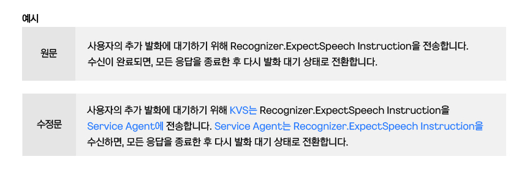

- 문장 성분의 호응 지키기
- 조사 올바르게 사용하기
- 피동형/사동형 지양하기
- 이중 부정 지양하기
- 명확한 표현 사용하기


- 순서와 목록 구분하기
- 개조식 활용


- 맞춤법/띄어쓰기 체크하기
- 외래어 표기 체크하기

[나는 어떻게 GTA Online 게임 로딩시간을 70% 줄였는가  GeekNews](https://news.hada.io/topic?id=3813)

- [How I cut GTA Online loading times by 70%](https://nee.lv/2021/02/28/How-I-cut-GTA-Online-loading-times-by-70/)

1. Json parsing with sscanf
- 게임 코드는 무려 10MB 짜리 아이템 카탈로그 json 파일을 파싱하는데 각 항목(무려 약 63000개)마다 sscanf 함수가 호출했고, sscanf 함수가 호출하는 strlen 함수는 문자열의 길이를 구하기 위해 파일 맨 끝까지 한글자씩 읽었다.
- 10MB 문자열을 연달아 63000번 읽느라 1분 30초를 더 쓰고 있었다.

2. Hash key not used
- 위의 내용에 바로 이어, 파싱했던 아이템 정보를 배열에 넣을 때 "배열 시작 위치부터" 순차 탐색을 통해 값을 삽입할 위치를 찾고 있었다.
- 저장 내용이 중복되는지 확인하기 위해 해시값을 쓰고 있는데도 해시맵을 사용하지 않아 삽입 위치를 찾는데만 "(63000^2+63000)/2" 번의 확인 과정을 거치느라 1분 40초를 더 쓰고 있었다.

## 2024.08.13

**경제 버그 관련해서**

    그런데 개발팀이 보유한 로그를 이용해서 모두 추적 가능하다는 확신도 없고,
    
    이론상으로나마 추적이 가능할 정도의 로그가 있다면 그나마 다행인 상황입니다.
    
    
    적지 않은 서비스, 개발팀이 충분한 로그를 갖고있지 않거나,
    
    해독, 분석이 어려운 req/resp 수준의 raw 데이터 형태로 로그를 보유합니다.
    
    분석툴을 안 갖고 있으면 로그가 있어도 분석이 매우 어렵습니다.
    
     
    
    플레이 로그를 꼼꼼히 남기지 않아서 없기도 합니다.
    
    **게임 성적이 떨어지면 서버 비용을 낮추기 위해서**
    
    **결제 등 주요 로그를 제외한 플레이 로그 기록을 중단**하기도 합니다. (← 해봄)
    
     
    
    
    데이터를 복구하지 못하면 서버를 롤백해야 하고,
    
    보상으로 상당한 재화를 풀어야 하기 때문에

    운영에서 직접적인 매출, 비용 손실이 발생합니다.
    
    그런데 그렇게 한다고 깨어진 신뢰가 잘 회복되지도 않습니다.

- 입력 오류를 어떻게 예방할 수 있을까?
  - 프로그래머가 입력 데이터를 체크할 수 있도록
  - 로딩 타임 체크나, 적절한 입력 인터페이스가 필요함
    1. 입력 시트에서 데이터 타입 정합성을 체크할 것
    2. 입력 필드의 nullable 여부를 명시적으로 설정. 최대한 많은 필드가 nullable이 아니도록 정책을 결정할 것
      - 데이터 시트 작성자가 실수로 입력 누락한 값을 default 값으로 변환시키지 않아야 함
      - 작성자 입장에서는 누락된 필드가 존재하지 않는 것으로 처리되는지, default 형태로 자동 변환되는지 암시적 맥락을 놓치기 쉬움
    3. 값의 유효한 범위를 가정해서 사전 체크할 것 ( 로딩 타임 이라던지 )
      - 휴리스틱한 값이라서 범위를 예측하기 어려울 수 있지만, 없는 것보다는 도움이 된다.
      - 예를 들면 아이템 등급마다 발생할 수 있는 확률의 대략적인 범위
    4. 문자열 데이터를 입력 받을 때 심볼과 단순 텍스트를 구분할 것
      - 심볼을 다루고 있다면, 그리고 그것이 다른 데이터와의 link 역할을 한다면, 오탈자 / missing link 를 예방해야 한다.
    5. json 같은 raw 포맷을 피할 것.
    6. 자동화 테스트 절차를 구축할 것. 모든 데이터를 사전 검증해야 한다.
    7. 서버를 내리지 않고 입력될 수 있는 데이터라면 운영툴, 웹 제어판 등을 통해 기능을 제공하고 적절한 시각화 도구와 충분한 인터페이스를 제공해야 함
  - 코드 팁
    - 수치를 하드코딩하지 말고
    - 재화의 차감을 먼저, 보상을 나중에
      - 사실 트랜잭션으로 잘 묶으면 의미없긴 함. 단순 컨벤션에 가까움
    - 로직 모듈 단위 기능은 함수형으로(functional 하게) 
      - 내부에서 맥락을 스스로 생성하지 않기
      - 시간 값은 매번 외부에서 파라미터로 받기
        - 엔진 API 를 통해 시간 정보를 획득하는 경우, 긴 시간에 걸쳐 실행되는 유닛테스트 작성을 어렵게 만들어 테스트 커버리지를 좁히는 부작용이 있음 + 서버 시간 변경 이벤트에서 오류를 숨길 수 있음
      - 로직 모듈에 default 인자 사용을 피한다.
        - 인터페이스를 간결화 하기 위해 디폴트 인자 사용하는 경우가 많은데, 오류의 원인이 될 수 있다.
        - c++ / C# 모두 디폴트 인자는 컴파일 타임에 바인딩 되기 때문에 클래스 상속이나 가상함수 오버라이딩과 함께 사용될 경우, 빌드된 시점이 서로 다른 DLL 이 혼용되어 사용될 경우에 찾기 힘든 미묘한 문제를 일으킬 수 있다.
        - 인터페이스 간소화를 위해 꼭 사용하고 싶다면 디폴트 인자 대신, 함수 오버로딩으로 인자의 갯수를 조절하고 생략된 인자는 관리되는 전역 상수 테이블에서 가져오도록 한다.
        - 디폴트 인자에 적힌 컨텍스트는 관리 주체와 의존 관계가 불분명해서 결국 관리되지 않는다.
      - 경제 경제 관련 자료구조를 명시적으로 초기화 한다.
        - DB row 를 읽으려고 시도할 때 없으면 암시적으로 :생성하도록 로직을 구성해선 안된다.
      - 플레이 로그 기록을 남기는 컨벤션은 필수임
        - 한 리퀘스트의 로그 단위는 [의도, 요청 인자, 반영된 맥락, 변경 내역]의 형태로 구성
      - DB 트랜잭션 블럭 안에서 레디스 등의 보조 저장소를 변경해서는 안 된다.
        - 보조 저장소는 DB 와 원자적으로 묶이지 않는다.
        - 실수하기 쉬우므로 코드 리뷰에서 반드시 걸러내야함
        - 변경이 원자적으로 묶여야 할 데이터라면 DB를 원본으로 해야한다.
        - 레디스를 보조적으로 사용될 경우 DB 트랜잭션을 선실행하고 DB로부터 값을 복원하는 방식을 사용할 수 있을 것이다.
      - Assert를 꼼꼼하게 사용한다.
        - 로직 작성의 실수로 오류가 발생하더라도 로직의 추가 진행을 막아줘서 사고를 예방한다.
        - DB 데이터 오염보다 서버 크래시가 발생하는게 낫다.
        - Redis 같은 보조 저장소를 다룰 때는 Assert 를 특히 더 빡빡하게 사용한다.
        - Redis 는 RDB에 비해 데이터 오염에 더 취약.
        - RDB 의 데이터 오염을 복구하는 것은 고통스럽지만, Redis의 데이터 오염을 복원하는 것은 거의 불가능할 수 있다.
      - 치트 요청 핸들러를 일반 요청 핸들러와 섞지 않는다.
    - 대량 지급
      - 게임 라이브 서비스에서 대량 지급은 중요한 이슈임
      - 사고 수습이나 점검 지연 등 많은 라이브 이슈들이 대량 지급을 통해 지급되는데,
      - 대량 지급 자체가 사건 사고를 만들 수 있음
      - 크게 두 가지 유형이 있음
        1. 지급할 대상이 이미 결정되어 있어 한번에 지급하기
        2. 지급할 대상이 실시간으로 계속 생겨나거나, 로그인 시점에 지급하는 경
      - 1번 이라면 대상 유저의 목록을 뽑는 로직과 대상 유저에게 실제로 지급하는 동작을 분리해서 로직 작성할 것
        - 항상 테스트 커버리지, 로직 오류 발생 시 대응이 쉽도록 방향을 잡아야한다.
      - 2번이라면 일반적으로 게임서버 로그인 로직에 조건 체크를 추가해서 구현하게 된다.
        - 매번 새로 구현하는 대신 '지급 조건'과 '지급 재화'를 정의하고 로그인 단계에서 매번 체크하는 기반 시스템을 도입할 것을 추천
        - 유저마다 버전을 체크하는 방법이 있음. 7, 8 시즌에 대한 이벤트가 있다면 7시즌 이벤트 조건을 검사하고 통과하면 해당 유저의 버전을 7로 갱신, 8 시즌 이벤트에 대해서도 동일하게 통일하면 8로 갱신
        - 한 단계 씩 버전을 올려간다면 데이터 마이그레이션 등이 순차적으로 검증될 수 있다.
      - 이벤트 조건을 구현할 때 항상 유도해야 될 것은 시간 범위 / 중복 지급 방지 / 유저 리세마라 등 어뷰징에 의한 사이드 이펙트 최소화
      - 공통적으로 명시적인 재화의 지급은 우편함 컨텐츠를 이용하는 것을 권장.
        - 유저에게 지급 품목과 사유를 명시적으로 알려야 하고,
        - 소지 최대 갯수나 레벨 제한 등으로 수령 조건이 안 됐을때의 문제를 줄일 수 있다.
      - 그리고 랜덤성을 갖춘 상품을 지급하는 경우, 우편을 발송하는 시점이 아닌, 우편을 수령하는 시점에 랜덤 연산을 시행하도록 주의한다.

## 24.08.19

**라이브 중 텍스트(string) 패치**

    지금 생각해보면 마영전에 아주 좋은 시스템이 있었는데, 그것은 바로...
    
    라이브 중에 텍스트만 패치하는 시스템입니다.
    
    라이브 중에 바로 텍스트 수정이 바로 가능하고, 클라를 재실행하면 반영되는 구조였습니다.
    
    string 관련 파일이 서버에 올라가있고, 클라에서 로드할 때 서버의 string 파일을 먼저 읽어왔던 것으로 기억합니다.
    
     
    
    다음과 같은 이유 때문에 구현되었습니다.
    
    한국빌드 오탈자 이슈
    해외빌드 오번역 이슈
    텍스트 때문에 빌드를 다시 묶는 일이 빈번했었답니다….
    
    이 이슈는 라이브 중에 생각보다 많이 일어난답니다. 게임이 (과장보태서) 글반, 그림반이니까요..
    
     
    
    그렇다고 기준없이 사용하지는 않았습니다.
    
    라이브 중 공지 없이 수정하게 되면,
    
    유저들은 잠수함 패치가 있던게 아니냐며 개발팀을 신뢰하지 못하게 됩니다.
    
    그래서 매주 하던 목요일 점검날에만 모아서 수정했던 기억이 납니다.
    
     
    
    이 시스템이 들어온 이후 마영전 플젝은…
    
    오탈자 때문에 빌드를 다시 묶지 않아도 되었답니다!!!! ✨

## 24.08.20

[“Authentic” is dead. And so is “is dead.”](https://longform.asmartbear.com/authentic-is-dead/)

너무 남용되어진 나머지 신뢰를 잃어버린 단어들

- Authentic
- Solution
- Turnkey solution
- Genuine
- Powerful
- Secure
- Simple
- Innovative
- Insight
- Revolutionary
- Unsurpassed
- Unparalleled
- Cutting-edge
- World-class
- State-of-the-art
- Game-changing
- Ground-breaking
- Value-add

> These words have been corrupted by those who claim to honor their meaning but do not act accordingly.

> When a company claims to “put customers first” but then uses “Level 1 support” as a shield to prevent customers from intruding on profits, we realize talk is cheap.
> 
> When a company claims to have “secure” payments but then 100,000 credit card numbers are stolen, we realize you don’t need a permit to claim that you’re secure.
> 
> When a company claims to be “innovative and disruptive” but then pitches an idea you’ve heard ten times in the past month, it reminds us that if you have to say it, it’s probably not true.

**Be Specific**

- Instead of “easy” say “so straightforward, you won’t need a manual.”
- Instead of “inexpensive” say “just a dollar a day.”
- Instead of “powerful” say “processes 6,253,427 requests daily.”
- Instead of “secure” say “blocks 96 million attacks daily.”
- Instead of “disruptive” say “72% of our customers say they’ll never go back to a normal email client.”
- Instead of “beloved” show your NPS or CSAT or G2 rating or a massive wall of real, unsolicited testimonials, like tweets.

**Show, don't tell**

- Instead of saying it’s easy, have a video demonstrating your tool solving someone’s problem in 60 seconds flat.
- Instead of saying you have eager, responsive, intelligent tech support, put a “chat now” bar on every page of your website.
- Instead of saying that customers love you, show testimonials from 100 customers. (No one will read them all, but you can impress with sheer quantity.)
- Instead of saying “we’re innovative,” show your change-log, impressing the viewer with your product velocity.
- Instead of a bullet-list of benefits, quote actual customers describing your impact on their lives.
- Instead of generic-sounding testimonials, reproduce unsolicited tweets that show genuine love and gratitude.
- Instead of saying you value your customers, tell them to call you to test it out, and then answer the phone on the second ring.

## 24.08.21

[Humanizr/Humanizer: Humanizer meets all your .NET needs for manipulating and displaying strings, enums, dates, times, timespans, numbers and quantities](https://github.com/Humanizr/Humanizer?WT.mc_id=DT-MVP-5004759)

```cs
"Man".Pluralize() => "Men"
"string".Pluralize() => "strings"

"Men".Singularize() => "Man"
"strings".Singularize() => "string"

"men".ToQuantity(2) => "2 men"
"process".ToQuantity(2) => "2 processes"
"process".ToQuantity(1) => "1 process"
"processes".ToQuantity(2) => "2 processes"
"processes".ToQuantity(1) => "1 process"

1.Ordinalize() => "1st"
5.Ordinalize() => "5th"

2.Milliseconds() => TimeSpan.FromMilliseconds(2)
2.Seconds() => TimeSpan.FromSeconds(2)
2.Minutes() => TimeSpan.FromMinutes(2)
2.Hours() => TimeSpan.FromHours(2)
2.Days() => TimeSpan.FromDays(2)
2.Weeks() => TimeSpan.FromDays(14)

3.Bits();
5.Bytes();
(10.5).Kilobytes();
(2.5).Megabytes();
(10.2).Gigabytes();
(4.7).Terabytes();

"some_title for something".Pascalize() => "SomeTitleForSomething"
"some_title for something".Camelize() => "someTitleForSomething"
"SomeTitle".Underscore() => "some_title"
"some_title".Dasherize() => "some-title"
"some_title".Hyphenate() => "some-title"

```

## 24.08.23

[Unity - Scripting API Application.targetFrameRate](https://docs.unity3d.com/ScriptReference/Application-targetFrameRate.html)

유니티에 Application.targetFrameRate 라는 속성이 있는데

pc 환경과는 다르게 모바일 기기는 지원하는 화면주사율이 제한되어있어서 가능한 fps 가 많지 않음

예를 들어 120hz 화면주사율을 지원하는 기기에서는 120hz, 60hz, 30hz, 15hz ... 이렇게 가능

만약 최적화등을 위해서 정교하게 주사율을 다루고자 하는 니즈가 있다면 까다로운 상황인 것

## 24.08.24

[adamyodinsky/TerminalGPT: TerminalGPT - Terminal-based ChatGPT personal assistant app. Provides optimized, tailored answers for your machine's terminal.](https://github.com/adamyodinsky/TerminalGPT)

- terminal 에서 openAI ChatGpt 를 사용하는 도구

    Usage: terminalgpt [OPTIONS] COMMAND [ARGS]...
    
      *~ TerminalGPT - Your Personal Terminal Assistant ~*
    
    Options:
      --version                       Show the version and exit.
      -m, --model [gpt-3.5-turbo|gpt-3.5-turbo-16k|gpt-4|gpt-4-32k|gpt-4-turbo|gpt-4o]
                                      Choose a model to use.  [default:
                                      gpt-3.5-turbo]
      -s, --style [markdown|plain]    Output style.  [default: markdown]
      -t, --token-limit INTEGER       Set the token limit. this will override the
                                      default token limit for the chosen model.
      --help                          Show this message and exit.
    
    Commands:
      delete    Choose a previous conversation to delete.
      install   Installing the OpenAI API key and setup some default settings.
      load      Choose a previous conversation to load.
      new       Start a new conversation.
      one-shot  One shot question answer.

## 24.08.26

[Minkoo Seo on X 매일 점 하나씩을 찍는데 집중하다보면, 점 찍기 전에 승인을 받아야한다던지, 옆에서 점찍는 사람과 토의를 해야한다던지, 점 찍는 작업을 다음 분기까지 그리고 올해 말까지 왜 어떻게 해나갈 것인지의 계획을 이야기하는 것이 내 점 찍는 작업의 본질과 관계없다고 생각될 수 있다. 점을 얼마나  X](https://x.com/minkoo/status/1827400127545479555)

    매일 점 하나씩을 찍는데 집중하다보면, 점 찍기 전에 승인을 받아야한다던지, 옆에서 점찍는 사람과 토의를 해야한다던지, 점 찍는 작업을 다음 분기까지 그리고 올해 말까지 왜 어떻게 해나갈 것인지의 계획을 이야기하는 것이 내 점 찍는 작업의 본질과 관계없다고 생각될 수 있다. 점을 얼마나 빨리 찍는지, 점을 얼마나 더 멋진 포즈로 찍는지, 점 간격이 얼마나 일정한지가 최고의 가치인데 나는 지금 왜 시간을 낭비하는가.
    
    하지만 매일의 점찍기는 점묘화를 그리기 위한 것이고, 수 없는 점을 찍은 뒤 누가 얼마에 사가는지가 중요한 것이고, 내가 점을 찍는 포즈도, 점 간격이 얼마나 일정한지도 아닌 이전, 이후, 그리고 동시대의 작품들과 나란히 놓고 멀리서 봤을 때 보이는 그 아름다움에 사람들은 감탄한다.
    
    물론 점을 찍을 줄 모른다면 배워야한다. 점 하나도 제대로 찍지 못한다면 배워야 한다. 그런데 배우는 이 과정마저도 그림을 그리기 위한 길에 있단걸 잊으면 어렵다. 조금 더 현란한 자세로 찍고 싶기 때문이다. 점 찍는 자세의 숙달은 수년 이상의 시간이 걸리고, 배우는 과정도 순탄치 않다. 그림을 그릴 생각이 아니라면 점찍는 일에 가치가 있을리 없다.
    
    점 찍는 법을 배우는 사람들이 그림에 집중하면 안되는 이유를 나는 잘 모르겠다. 화가가 붓을 얼마나 빨리 씻었는지, 원하는 정확한 양의 물감을 한번에 맞추는 절대 물감량의 소유자였는지, 그리고 그 두 개 기술을 어느 순서로 배웠는지, 두 기술을 모두 습득 후 세번째 기술은 뭐였는지로 그림은 보지 않으면서 내 점찍기는 공중제비 후 내리꽂는 스킬을 5년간 반복 숙달 한 뒤에야 그림을 생각할건가. 그게 더 이상해 보인다.
    
    정말로 이해가 안가서 써봤다.

- '점'은 구체적인 업무
- '점묘화'는 추상적인 업무

[검은 신화 해독 오공 문자 - CSDN Blog](https://blog.csdn.net/sd7o95o/article/details/141479924)

> 중국 -> 한국어 기계 번역
>
> 요약하자면, Black Myth: Wukong의 스크립팅 체계는 많은 사용자 정의 개선이 있는 USharp를 기반으로 하며, mono, clr 및 il2cpp를 지원하는 자체 런타임 모드를 구현했으며 PC, Mac, Linux, Android, iOS, PS5 및 Xbox를 포함한 여러 플랫폼도 지원합니다.

- '검은 신화: 오공'의 exe 파일 사이즈가 이례적으로 크다 (895MB)

> 게임의 exe 파일 크기는 859MB에 달하는데 이는 약간 이례적입니다. 이에 비해 오퍼레이션 델타(Operation Delta)와 같은 UE 게임의 클라이언트 크기는 140MB이며, 니드 포 스피드 어셈블(Need for Speed Assemble)의 클라이언트 크기는 105MB입니다. 게임에 불필요한 플러그인 코드가 너무 많이 포함되어 있거나 원치 않는 기호 정보를 제거하지 않는 것 같습니다.

- 게임 리소스의 .data 파일을 확인
  - 내부에서 유니티의 il2cpp 와 비슷한 역할을 수행하는 `USharp` 의 흔적을 발견

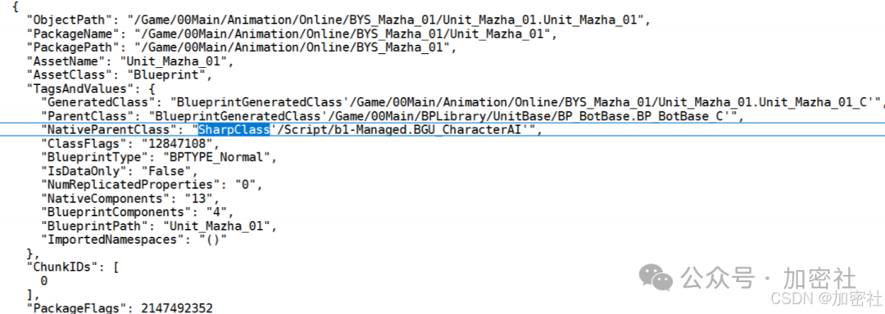

> 예를 들어 USharp, UnrealCLR 또는 UnrealSharp가 있습니다. 코드 기호에서 이러한 관련 문자열을 검색했는데 당연히 USharp의 흔적을 찾았고 Pak 파일에서 USharp의 uplugin 파일도 찾았습니다. 이제 그들이 USharp를 사용하고 있다는 것이 확실합니다.
>
> 즉, Black Myth: Wukong 팀은 USharp를 사용했을 뿐만 아니라 Unity의 il2cpp 기술을 포함하여 다양한 작동 모드를 지원할 수 있도록 많은 커스터마이징을 수행했습니다. 이것은 그들이 게임을 보다 효율적으로 실행하는 데 큰 도움이 되었음을 보여줍니다.
>
> Pak 파일에는 DLL이나 스크립트 파일이 없기 때문에 공식 릴리스에서 il2cpp를 사용하고 있을 가능성이 높습니다. 이러한 방식으로 C#에 정의된 

- [pixeltrisUSharp C plugin for Unreal Engine 4](https://github.com/pixeltris/USharp)

## 24.09.06

[The Art of Finishing  ByteDrum](https://www.bytedrum.com/posts/art-of-finishing/)

> As I prepare to step away from my desk, I can’t shake a feeling of frustration. I started the session full of optimism, ready to make significant headway. Now, I’m left with a nagging sense of inadequacy. Despite my efforts, it feels like I’ve barely moved the needle. The codebase is still a maze of TODO comments and half-implemented features. The Hydra of software development has grown two new heads for every one I managed to address.
> 
> This cycle of enthusiasm, struggle, and disappointment has become all too familiar. **It’s the Hydra Project Effect: no matter how much progress I make, new challenges always seem to sprout in their place.** But while this pattern may seem unbreakable, **I’m determined to find a way to tame this beast.** In this post, I’ll explore strategies for breaking out of this cycle of endless beginnings and unsatisfying middles. It’s time to learn the art of finishing, to slay this Hydra once and for all, and to finally experience the satisfaction of a completed project.

- ChatGPT 왈
  - 신화적 또는 은유적 의미:
  - "Hydra"는 그리스 신화에서 머리를 자르면 여러 개의 새로운 머리가 자라는 괴물입니다. 이를 바탕으로 "Hydra project effect"는 어떤 문제를 해결하려고 할수록 새로운 문제나 과제가 계속해서 생겨나는 상황을 설명하는 은유적 표현일 수 있습니다.


> The absence of deadlines in personal projects adds another layer to this complexity2. Without the external pressure of a due date, it’s all too easy to fall into the trap of perfectionism. We find ourselves endlessly tweaking and refining, The absence of deadlines in personal projects adds another layer to this complexity2. Without the external pressure of a due date, it’s all too easy to fall into the trap of perfectionism. We find ourselves endlessly tweaking and refining, **always chasing that elusive “perfect” solution. The irony is that this pursuit of perfection often leads to imperfect results** — or no results at all. In our professional lives, deadlines force us to prioritize and make pragmatic decisions. But in personal projects, the luxury of unlimited time can become a curse, allowing us to justify spending hours, days, or even weeks on minor details that, in reality, make little difference to the project’s overall success or usefulness. — or no results at all. In our professional lives, deadlines force us to prioritize and make pragmatic decisions. But in personal projects, the luxury of unlimited time can become a curse, allowing us to justify spending hours, days, or even weeks on minor details that, in reality, make little difference to the project’s overall success or usefulness.

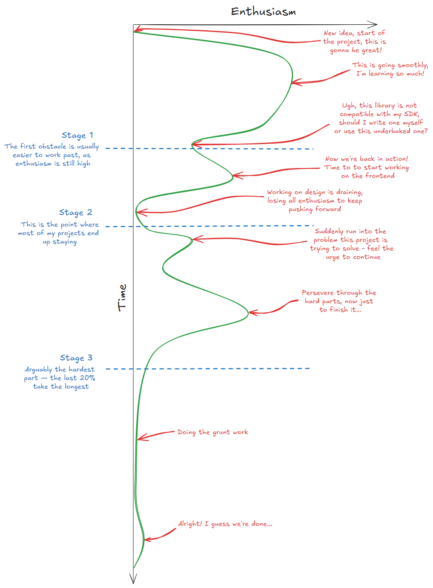

> **The end stages of a project often involve optimization, refactoring, and really understanding the intricacies of your code. By not finishing, you miss out on these valuable learning experiences.** In professional settings, being known as someone who starts things but doesn’t finish them can be detrimental to your career. Employers and clients value those who can deliver completed projects, making the ability to finish a crucial professional skill.
>
> **Every unfinished project takes up mental space** It’s like having dozens of browser tabs open — each one uses a little bit of your mental RAM, leaving you with less capacity for new ideas and focused work. This mental clutter can be a significant drain on your creativity and productivity.

## 24.09.07

[Cysharp/UnitGenerator: C# Source Generator to create value-object, inspired by units of measure.](https://github.com/Cysharp/UnitGenerator)

> C# Source Generator to create Value object pattern, also inspired by units of measure to support all arithmetic operators and serialization.

- c# 기본 객체는 산술 연산 / 형변환 연산을 지원하지 않는다. 이를 위한 메서드/ 인터페이스를 일일이 작성해야 하는데, 이를 자동 지원해주는 코드젠

```cs
using UnitGenerator;

[UnitOf(typeof(int))]
public readonly partial struct UserId { }

// generated

[System.ComponentModel.TypeConverter(typeof(UserIdTypeConverter))]
public readonly partial struct UserId : IEquatable<UserId> 
{
    readonly int value;
    
    public UserId(int value)
    {
        this.value = value;
    }

    public readonly int AsPrimitive() => value;
    public static explicit operator int(UserId value) => value.value;
    public static explicit operator UserId(int value) => new UserId(value);
    public bool Equals(UserId other) => value.Equals(other.value);
    public override bool Equals(object? obj) => // snip...
    public override int GetHashCode() => value.GetHashCode();
    public override string ToString() => value.ToString();
    public static bool operator ==(in UserId x, in UserId y) => x.value.Equals(y.value);
    public static bool operator !=(in UserId x, in UserId y) => !x.value.Equals(y.value);

    private class UserIdTypeConverter : System.ComponentModel.TypeConverter
    {
        // snip...
    }
}
```

## 24.09.09

**mmorpg 상호 캐릭터 간 관측범위, 클라 측/ 서버 측 비대칭 구성**

- 이걸 왜 이렇게 하냐면, 서버 측 비즈니스 로직은 보통 직경 거리 n 미터 안에 서로 다른 액터가 있다면 상호작용 <- 보통 이런 식으로 구성된다.
- 하지만 클라 측은 사정이 좀 다른데, 비즈니스 로직을 굴리는 것은 서버에서 다 해주기 때문에 클라는 view 역할만 신경쓰면 된다. 이때는 일정 거리 안의 캐릭터를 전부 보여주기보다는, 일정 거리 안의 액터 최대 n 명 까지 화면에 표시하는 전략이 유리하다. 그래픽 최적화가 가능하니까.
  - 서버 측에서도 이득을 보는 지점이 존재한다. 주로 브로드캐스팅. 클라 측에서 최대 n명까지만 화면에 표시하겠다고 약속이 맺어지면 서버도 클라측에 내려보내는 액터 정보도 최대 n명으로 고정된다. 캐릭터 주변에 아무리 액터가 많아도 패킷 바이트 상한선이 O(n) 규모에서 해결되는 것이다.

## 24.09.10

**부하테스트**

- 쿼리 최적화
  - 가끔 비즈니스 로직에서 매 프레임 / 혹은 지나치게 자주 쿼리를 보내는 코드를 탐지해서 수정
  - 쿼리 여럿을 트랜잭션으로 뭉쳐서 보내기도 한다.
  - 보통 비즈니스 로직은 쿼리 요청이 완료될 때까지 대기하지 않는다. 비즈니스 로직에서 보내는 쿼리 요청은 큐 형태로 쌓이게 되는데
    - 쿼리 요청 처리가 밀려서 요청 큐의 길이가 너무 길어지면 안된다. 큐 길이를 상시 체크
- Redis
  - hgetall 같은 명령어 쓰다가, 사이즈 너무 커서 다운되버리는 일이 꼭 한 두 번씩 있음
  - 시스템 구조 상, 복합 관계 구조가 자주 있을 텐데(`total = n * k`) 이때 사이즈가 너무 커지는 것을 항상 예의주시 해야 함.
- 봇
  - main 퀘스트라인을 따라 진행하는 봇.
    - 자동 진행을 하면서 기차놀이 하듯이 봇들이 쭉 퀘스트 동선을 따라가는데,
    - 이때 봇들이 진도 나가는 속도가 너무 똑같은 경우, 부하가 큰 액션을 수행하는 구간에서 봇들이 거의 비슷한 시기에 진입하면서 '거짓 부하'를 유발한다.
    - 실제 유저들을 모방하려면 퀘스트 수행 할 때마다 랜덤 간격의 딜레이 시간이 필요
  - DB 부하 주의, 특히 메일 데이터의 경우 수천 건의 데이터가 쌓이면 DB 데이터 로드 부하가 상당히 커진다.
  - 데이터 최대량과 + 일정 시간 동안 데이터 변경 횟수 제한 필수

## 24.09.12

[Common Language Server Protocol](https://code.visualstudio.com/blogs/2016/06/27/common-language-protocol)

- [Langserver.org](https://langserver.org/#implementations-server)
- ChatGPT

> LSP는 코드 편집기(클라이언트)와 언어 서버(서버) 간의 통신을 표준화하여, 코드 편집기가 특정 프로그래밍 언어에 대한 지원(자동 완성, 코드 탐색, 오류 체크 등)을 언어 서버를 통해 제공할 수 있도록 합니다. 이를 통해 코드 편집기들이 각 언어에 맞는 플러그인을 따로 구현할 필요 없이, LSP 프로토콜만 지원하면 다양한 언어를 지원할 수 있게 됩니다.
>
> **LSP (Language Server Protocol)**는 웹 통신을 기반으로 동작하지는 않지만, JSON-RPC 프로토콜을 사용하여 클라이언트와 서버 간에 데이터를 주고받습니다. 통신 자체는 HTTP, WebSocket, STDIO 또는 TCP 소켓과 같은 다양한 통신 방법을 사용할 수 있습니다. 웹 기반으로 구현할 수 있지만, 기본적으로 LSP는 웹 통신을 요구하지는 않습니다. 통신 방식에 따라, 서버와 클라이언트는 로컬에서 실행될 수 있고, 원격 서버와도 연결이 가능합니다.

- LSP 서버는 주로 로컬에서 프로세스 형태로 동작
- 각 언어 별로 코드 분석, 자동 완성, 참조 추적 등등의 기능을 별도의 서버 측으로 추상화 시켰다.

아래는 Visual Studio Code 측 'A Common Protocol for Languages' 에서 설명

> Visual Studio Code provides rich language support for many programming languages. Support for a particular programming language is powered by a **language server that has a deep understanding of that language.** VS Code communicates with these servers to enable rich editing capabilities like **'Errors & Warnings'**, **'Refactor'**, and **'Go To Definition'**.


- 대략 적인 LSP 의 실행 절차
  - 코드 편집기는 파일을 새로 열 때마다 `didopen` 알림을 language Server 측으로 전송
  - 코드 편집기는 파일을 수정할 때마다 `dideidt` 알림을 서버 측으로 전송
    - 이때 수정 내용에 문제가 있다면 language server 측은 코드 편집기 측으로 경고 / 에러 알림을 보냄
  - `Go To Definition` 등의 기능을 수행할 때도 language Server 로 요청을 보내고 서버 측 응답을 활용
  - 코드 편집기가 파일을 닫을 대 `didclose` 알림을 서버 측으로 전송

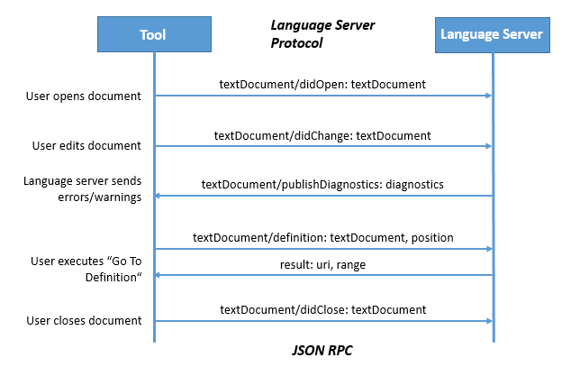

- C# 과 관련된 LSP 에는 대표적으로 `Omnisharp` 이 있고, 심지어 vim 쪽 플러그인으로도 존재함.

## 24.09.13

[Why GitHub Actually Won](https://blog.gitbutler.com/why-github-actually-won/)

- [GitHub이 실제로 승리한 이유  GeekNews](https://news.hada.io/topic?id=16685)

- GitHub이 승리한 이유는 두 가지로 요약할 수 있음
  - 적절한 시기에 시작했음
  - 좋은 감각을 가졌음

**초기 환경**

- 2005년 즈음, 소프트웨어 개발자는 대부분 Subversion과 같은 중앙 집중형 버전 관리 시스템을 사용
- Git과 Mercurial이 처음 커밋된 시점이 이 즈음이며, 오픈 소스 기여는 아직도 복잡하고 비효율적이었음
- 오픈 소스 프로젝트 수는 2005년에 매우 적었고, 전체적으로 중앙 집중형 시스템이 오픈 소스 기여에 적합하지 않았음

**Git의 등장**

- 과거 Linus Torvalds (Linux 창시자) 가 상업용 버전의 BitKeeper 를 굉장히 좋아했다고 전해짐
- 만약 BitKeeper 가 유로 모델이 아닌 오픈 소스이거나 좀 더 열린 라이센스 정책을 지원했다면 현재 Git은 존재하지 않았을 수도...
- Linus Torvalds 는 BitKeeper 를 역공학 해서 Linux 커뮤니티와 함께 대망의 Git 프로젝트를 시작함

> There are several reasons why Git felt awesome at the time. They were:

> **branching and merging** were dreams rather than nightmares
> it was stupendously **fast**
> permissions were vastly simpler

**GitHub의 등장**

- GitHub의 창립자들은 Git 호스팅의 어려움을 해결하기 위해 GitHub를 개발
  - 당시 Git 이 SSH 프로토콜을 이용하고 있었는데, 권한을 관리하는 절차가 불편했다고 함
  - 이 과정을 단순화하기 위해 떠올린 컨셉이 Github로 발전
사용자를 중심으로 한 접근법을 통해 프로젝트 중심의 기존 호스팅 방식과 차별화됨
사용자 중심의 네임스페이스와 풀 모델을 도입

**Git의 승리**

- 당시 Git 의 강력한 경쟁자는 Mercurial 이 있었음
  - 그때 Github 의 부흥에 Ruby 커뮤티니가 크게 기여

---

- This is why Git was cool and why GitHub was started to make using it easier, but the question is, why did Git win? Lots of distributed systems sprang up during this time. Mercurial was similar in a lot of ways and better in many. Why did Git come out on top in the great DVCS war?
- I think the answer there was “PR”.
  - Linux 그리고 Rails 커뮤니티가 Git 사용을 주도함.

---

- There is also, and I must say this with a grain of hopeful humility, a possibility that GitHub was the determining factor in the **eventual dominance of Git over Mercurial.**
- GitHub had the incredible luck to have an amazingly supportive and hip community that embraced us right out of the gate, **namely the Ruby community. Within months, everyone in the Ruby community put their stuff on GitHub.** Rails was the hot shit at that time, it was cooler than PHP, JS frameworks weren’t really around, there was no Node, etc.h

---

- In Mercurial land, there was BitBucket, which was started for Mercurial hosting and written in the Django framework, but I think we just had too much of a head start and there wasn’t enough differentiation. The Python community just didn't adopt it as aggressively as our Ruby community did.
- As early as December 2008, **GitHub was hosting about 27,000 public repositories where BitBucket had a little over 1,000.** It became difficult to catch up.

**The Competitive Field Collapses**

> **In 2006-2007**, people were first learning about distributed version control systems and Git and Mercurial were starting to fight it out. 
>
> **In 2008, GitHub launched.**
>
> **In 2011, both Google Code and BitBucket added Git support,** which I’ll mark as the year that **the nail was in the Mercurial coffin.** Git had won and GitHub was now essentially unbeatable. 
>
> Just 4 years later, in 2015, **Google Code just completely gave up and shut it’s service down.** In the email they sent out, they basically said “just move to GitHub”. If I remember correctly, they even reached out to us for help with the migration.

---

**Google Code가 승리하지 못한 이유**

- 기존 대형 호스팅 서비스는 수익 모델과 배급에 초점을 맞추었지만, GitHub는 개발자 경험을 최우선으로 고려
- Google Code, BitBucket 등은 GitHub에 비해 '맛'이 부족했고, 개발자 워크플로우를 제대로 이해하지 못함
- GitHub는 창업 초기 자금 지원 없이도 성공했으며, 이는 사용자 경험과 커뮤니티 지원의 결과

**GitHub이 승리한 이유**

- GitHub는 새로운 패러다임이 형성되는 시점에 적절히 등장했으며, 개발자 경험을 최우선으로 고려하는 접근 방식이 성공의 핵심 요인
- 오픈 소스 커뮤니티가 분산 버전 관리로 전환할 때, GitHub는 개발자 경험을 개선하는 데 집중했음
- 앞으로의 과제는 다음 개발자 워크플로우의 변화가 무엇이 될지, 그리고 이를 성공적으로 구현할 수 있는 '맛'을 가진 회사가 누구일지 궁금

## 24.09.19

[mcintyre321OneOf Easy to use F-like ~discriminated~ unions for C with exhaustive compile time matching](https://github.com/mcintyre321/OneOf/tree/master)

- oneOf
- F#의 공용체(Union) 표현을 c# SourceGenerator를 통해 구현

```cs
// github 에서 예시로 보여주는 자동생성 코드
public readonly struct OneOf<T0, T1> : IOneOf
{
    readonly T0 _value0;
    readonly T1 _value1;
    readonly int _index;

    OneOf(int index, T0 value0 = default, T1 value1 = default)
    {
        _index = index;
        _value0 = value0;
        _value1 = value1;
    }

    public object Value =>
        _index switch
        {
            0 => _value0,
            1 => _value1,
            _ => throw new InvalidOperationException()
        };

    public int Index => _index;

    public bool IsT0 => _index == 0;
    public bool IsT1 => _index == 1;

    public T0 AsT0 =>
        _index == 0 ?
            _value0 :
            throw new InvalidOperationException($"Cannot return as T0 as result is T{_index}");
    public T1 AsT1 =>
        _index == 1 ?
            _value1 :
            throw new InvalidOperationException($"Cannot return as T1 as result is T{_index}");

    public static implicit operator OneOf<T0, T1>(T0 t) => new OneOf<T0, T1>(0, value0: t);
    public static implicit operator OneOf<T0, T1>(T1 t) => new OneOf<T0, T1>(1, value1: t);
}
```

```cs
// 사용 예시
public OneOf<User, InvalidName, NameTaken> CreateUser(string username)
{
    if (!IsValid(username)) return new InvalidName();
    var user = _repo.FindByUsername(username);
    if(user != null) return new NameTaken();
    var user = new User(username);
    _repo.Save(user);
    return user;
}

[HttpPost]
public IActionResult Register(string username)
{
    OneOf<User, InvalidName, NameTaken> createUserResult = CreateUser(username);
    return createUserResult.Match(
        user => new RedirectResult("/dashboard"),
        invalidName => {
            ModelState.AddModelError(nameof(username), $"Sorry, that is not a valid username.");
            return View("Register");
        },
        nameTaken => {
            ModelState.AddModelError(nameof(username), "Sorry, that name is already in use.");
            return View("Register");
        }
    );
}
```

[Alternate Lookup for Dictionary and HashSet in .NET 9 - NDepend Blog](https://blog.ndepend.com/alternate-lookup-for-dictionary-and-hashset-in-net-9/)

- .NET 9 의 새 기능

> The primary use case for an alternate key arises when TKey is a string. In such cases, strings are often represented as ReadOnlySpan<char>. Previously, to lookup a key represented by a ReadOnlySpan<char> in a hash table, it was necessary to convert it to a string using the ToString() method, which results in a string allocation. That is not optimal.

- `Dictionary<string, int>` 을 다룰 때, `TryGetValue`, `ContainsKey` 등 비교 연산을 여러번 수행하는 케이스가 있다고 가정
  - 이때 비교를 위해 주어지는 값들이 `ReadOnlySpan<char>` 타입이라면, 
  - Dictionary API 에 파라미터로 넘기기 위해 `ReadOnlySpan<char>` 값을 매번 `string` 타입으로 바꾸는 것은 메모리 관점에서 비효율적
  - 이때 .NET 9 에 새로 소개된 Alternate LookUp 을 사용한다면??
    -> GC Safe한 구현을 만들 수 있다!!

```cs
var dico = new Dictionary<string, int>(StringComparer.OrdinalIgnoreCase) {
    { "Paul", 11 },
    { "John", 22 },
    { "Jack", 33 }
};
 
// .NET 9 : GetAlternateLookup()
Dictionary<string, int>.AlternateLookup<ReadOnlySpan<char>> lookup = dico.GetAlternateLookup<ReadOnlySpan<char>>();
 
// https://learn.microsoft.com/en-us/dotnet/api/system.memoryextensions.split?view=net-8.0
string names = "jack ; paul;john ";
MemoryExtensions.SpanSplitEnumerator<char> ranges = names.AsSpan().Split(';');
 
foreach (Range range in ranges) {
   ReadOnlySpan<char> key = names.AsSpan(range).Trim();
   int val = lookup[key];
   Console.WriteLine(val);
}
```

## 24.09.25

[C 고성능 서버 - 메모리 단편화  leafbirddevnote](https://leafbird.github.io/devnote/2021/08/08/C-%EA%B3%A0%EC%84%B1%EB%8A%A5-%EC%84%9C%EB%B2%84-%EB%A9%94%EB%AA%A8%EB%A6%AC-%EB%8B%A8%ED%8E%B8%ED%99%94/)

- [The curse of memory fragmentation - Ayende @ Rahien](https://ayende.com/blog/181761-C/the-curse-of-memory-fragmentation)

- SOH에 메모리 단편화가 커진다면, GC 측 메모리 할당과 Compact 단계에서 부하가 커지는 것이 사실
- 그러니 SOH 에서 pinning 되는 메모리들을 최소화 하는 것이 좋다. 사이즈가 작고 생명주기가 긴 버퍼들이 주로 그렇다.
  - 이들은 POH / LOH 등 다른 메모리 영역에 할당하는 것이 메모리 운용 상 유리할 수 있다.

```cs
// POH 예시 코드 .NET 5 이상
// 아래 코드 에서는 alloc / free 를 명시적으로 수행해줘야 하는게 핵심이다.

using System;
using System.Runtime.InteropServices;

class Program
{
    static void Main()
    {
        int[] numbers = new int[] { 1, 2, 3, 4, 5 };

        // Pin the array so that the GC cannot move it
        GCHandle handle = GCHandle.Alloc(numbers, GCHandleType.Pinned);

        // Get the address of the pinned object
        IntPtr address = handle.AddrOfPinnedObject();

        Console.WriteLine($"Address of pinned object: {address}");

        // Now we can safely pass this address to a native function or use it for interop purposes

        // Release the pinned object when done (to avoid memory leaks)
        handle.Free();
    }
}

//혹은 이렇게
using System;

class Program
{
    static void Main()
    {
        // Allocate a pinned array using GC.AllocateArray
        int[] numbers = GC.AllocateArray<int>(5, pinned: true); // Array of length 5, pinned

        // Initialize the array
        numbers[0] = 1;
        numbers[1] = 2;
        numbers[2] = 3;
        numbers[3] = 4;
        numbers[4] = 5;

        // Since the array is pinned, we can safely get its address
        unsafe
        {
            fixed (int* p = numbers)
            {
                IntPtr address = (IntPtr)p;
                Console.WriteLine($"Address of pinned object: {address}");
            }
        }
        
        // No need to manually free the handle when using GC.AllocateArray with pinned: true
    }
}
```

**단편화 발생의 원인**

- .NET Core 3.1 을 사용 중인 프로젝트 환경이다. .NET 5 버전보다 낮아 POH 가 지원되지 않는 버전

> 성능좀 끌어올려보겠다고 다짐한 C# 게임서버의 메모리 단편화는 어디서 발생하는가.

> 핵심부터 말하자면 소켓의 send / receive에 걸어주는 바이트 배열 버퍼가 pinning되기 때문에, 가비지 컬렉터의 압축과정을 많이 방해하게 되면서 메모리 단편화를 유발한다. 이 부분이 메모리 단편화의 가장 주된 요인이다. 그런데다가 높은 TPS를 처리해내는 고성능 게임서버를 만들려고 한다면.. 소켓 IO의 수가 많아짐에 따라 네트워크 버퍼의 개수와 사용 빈도도 당연히 높아질 수밖에 없다. 때문에 대량의 네트워크 통신을 견딜 수 있도록 만드려면 네트워크 버퍼를 어떻게 운용할 것인지가 중요하다.

---

> 조금은 다른 이야기지만 처음 ArrayPool<T> 가 BCL에 들어왔을때 아주 당연하게 착각한것이, 이놈으로 byte[]를 풀링하면 내부적으로 큰 청크를 한 번만 할당해서 이걸 조각내서 쓸것으로 생각했다. 메모리 관리라 하면 으레 이 방식이 익숙해서였다. 하지만 조금만 생각해보면, C#에서는 불가능한 이야기다. 덩치큰 byte[]를 여러개의 작은 byte[]로 표현할 수가 없다. ArrayPool<T> 코드를 보면 할당 자체는 SOH상에서 단일객체 단위로 발생하나, 그 외 나머지 기법들을 이용해 최적화를 진행함을 알 수 있다. 코드를 보면 2세대 GC가 불릴 때 콜백을 얻어와 현재 메모리 압력을 진단하고, 선택적으로 메모리를 해제하는 등의 테크닉을 볼 수 있다. 이런건 나중에 메모리 로우레벨을 제어해야 할 경우 참고하여 응용하면 좋을듯 하다.

