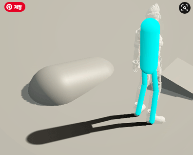
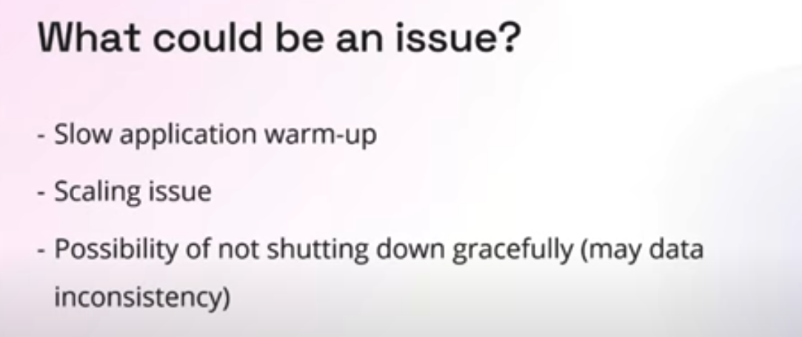
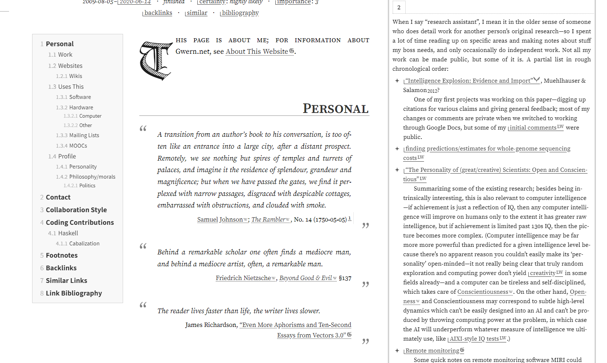
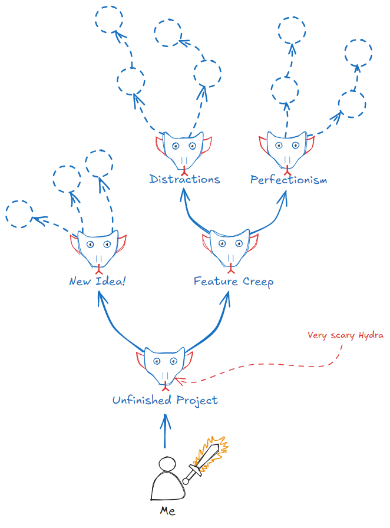
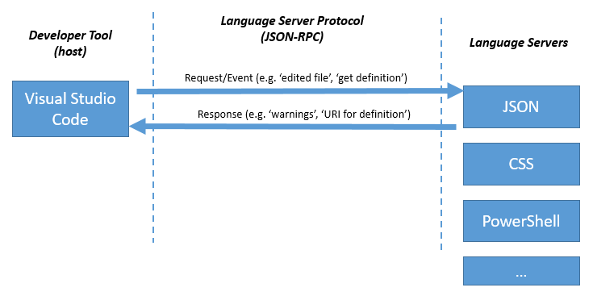

# AtDevcat_2024

## 24.02.27

[c - Is it Safe to use ReaderWriterLockSlim in an async method - Stack Overflow](https://stackoverflow.com/questions/15882710/is-it-safe-to-use-readerwriterlockslim-in-an-async-method)


```cs
System.Threading.ReaderWriterLockSlim readerwriterlock = new System.Threading.ReaderWriterLockSlim();
private async Task Test()
{
    readerwriterlock.EnterWriteLock();
    await Task.Yield(); //do work that could yield the task
    readerwriterlock.ExitWriteLock(); //potentailly exit the lock on a different thread
}
```

ìœ„ì˜ ì½”ë“œëŠ” 안전하지 못하다.

`await Task.Yield();` ë¼ì¸ 전후로 실행 스레드가 다를 수 ìˆê¸° 때문ì´ë‹¤!!!

ë½ì„ 거는 스레드와 해제하는 스레드가 다르면 스레드 ì•ˆì „ì„±ì´ ìœ„ë°˜ëœë‹¤. ì •ë§ ì •ë§ í°ì¼ ë‚  수 ìˆë‹¤!!!

**ChatGPT 답변**

`ReaderWriterLockSlim`ì„ ë¹„ë™ê¸° 코드 ë‚´ì—ì„œ 사용하는 ê²ƒì€ ì£¼ì˜ë¥¼ 요합니다. ìœ„ì˜ ì½”ë“œ 예제ì—서는 비ë™ê¸° 메서드(Loop1 ë° Loop2) ë‚´ì—ì„œ ReaderWriterLockSlimì˜ EnterWriteLockê³¼ ExitWriteLockì„ ì‚¬ìš©í•˜ê³  ìˆìŠµë‹ˆë‹¤. ì´ëŸ¬í•œ ë°©ì‹ìœ¼ë¡œ ReaderWriterLockSlimì„ ì‚¬ìš©í•˜ëŠ” ê²ƒì€ ì¼ë°˜ì ìœ¼ë¡œ 안전해 ë³´ì´ì§€ë§Œ, 비ë™ê¸° 프로그ë˜ë°ì˜ 맥ë½ì—ì„œ 몇 가지 주ì˜í•´ì•¼ í•  ì ì´ ìˆìŠµë‹ˆë‹¤:

비ë™ê¸°ì™€ 블로킹 í˜¸ì¶œì˜ í˜¼í•© 사용: ReaderWriterLockSlimì˜ EnterWriteLock 메서드는 호출 스레드를 블로킹합니다. ì´ëŠ” await Task.Delay(1000);와 ê°™ì€ ë¹„ë™ê¸° 호출 í›„ì— ì´ë£¨ì–´ì§ˆ 경우, 비ë™ê¸° ì‘ì—…ì´ ì™„ë£Œëœ í›„ ë™ê¸° 블로킹 í˜¸ì¶œì´ ì´ë£¨ì–´ì§€ëŠ” 것ì…니다. ì´ëŸ¬í•œ íŒ¨í„´ì€ ì¼ë°˜ì ìœ¼ë¡œ 권ì¥ë˜ì§€ 않으며, íŠ¹íˆ UI 스레드와 ê°™ì´ ë¸”ë¡œí‚¹ë˜ì–´ì„œëŠ” 안 ë˜ëŠ” 스레드ì—서는 ì‚¬ìš©ì„ í”¼í•´ì•¼ 합니다.

ë°ë“œë½ 위험: ìœ„ì˜ ì˜ˆì‹œ 코드 ìì²´ì—ì„œ ì§ì ‘ì ì¸ ë°ë“œë½ì„ 유발할 명확한 요소는 없습니다. 그러나, ReaderWriterLockSlimì„ ì‚¬ìš©í•˜ëŠ” ë³µì¡í•œ 비ë™ê¸° í름ì—서는 ë°ë“œë½ ìœ„í—˜ì´ ìˆìŠµë‹ˆë‹¤. 예를 들어, í•˜ë‚˜ì˜ íƒœìŠ¤í¬ê°€ 쓰기 ë½ì„ íšë“í•œ ìƒíƒœì—ì„œ 다른 태스í¬ê°€ ê°™ì€ ë½ì„ 기다리는 ë™ì•ˆ, 첫 번째 태스í¬ê°€ 후ìì˜ ì™„ë£Œë¥¼ 기다리게 ë˜ë©´ ë°ë“œë½ì´ ë°œìƒí•  수 ìˆìŠµë‹ˆë‹¤.

비ë™ê¸° 코드ì—ì„œì˜ ë½ ê´€ë¦¬: ReaderWriterLockSlimì€ ë³¸ì§ˆì ìœ¼ë¡œ ë™ê¸°ì  ë½ ë©”ì»¤ë‹ˆì¦˜ì…니다. 비ë™ê¸° 코드ì—서는 SemaphoreSlimì˜ WaitAsync 메서드와 ê°™ì´, 비ë™ê¸°ì ìœ¼ë¡œ 대기할 수 ìˆëŠ” ë½ ë©”ì»¤ë‹ˆì¦˜ì„ ì‚¬ìš©í•˜ëŠ” ê²ƒì´ ë” ì í•©í•  수 ìˆìŠµë‹ˆë‹¤. ì´ëŸ¬í•œ ë©”ì»¤ë‹ˆì¦˜ì€ ë¹„ë™ê¸° ì‘ì—…ì´ ë½ì„ 기다리는 ë™ì•ˆ 스레드를 블로킹하지 ì•Šê³  대기하ë„ë¡ í•´ì¤ë‹ˆë‹¤.

요약하ìë©´, ReaderWriterLockSlimì€ ì£¼ë¡œ ë™ê¸° 코드ì—ì„œ ì‚¬ìš©ë  ë•Œ 안전하며, 비ë™ê¸° 코드ì—ì„œ 사용할 때는 주ì˜ê°€ 필요합니다. 특íˆ, 비ë™ê¸° ì‘ì—… ë‚´ì—ì„œ 블로킹 ë½ í˜¸ì¶œì„ í”¼í•˜ê³ , 가능하다면 비ë™ê¸° ì‘ì—…ì— ì í•©í•œ ë½ ë©”ì»¤ë‹ˆì¦˜ì„ ì‚¬ìš©í•˜ëŠ” ê²ƒì´ ì¢‹ìŠµë‹ˆë‹¤. 비ë™ê¸° 코드ì—ì„œ ReaderWriterLockSlim ê°™ì€ ë™ê¸° ë½ì„ 사용할 때는 ë°ë“œë½ì´ë‚˜ 성능 ì €í•˜ì˜ ìœ„í—˜ì„ ì¶©ë¶„íˆ ê³ ë ¤í•´ì•¼ 합니다.

## 24.02.28

[White House - PRESS RELEASE: Future Software Should Be Memory Safe](https://www.whitehouse.gov/oncd/briefing-room/2024/02/26/press-release-technical-report/)

> ONCD makes the case that technology manufacturers can prevent entire classes of vulnerabilities from entering the digital ecosystem by adopting memory safe programming languages. ONCD is also encouraging the research community to address the problem of software measurability to enable the development of better diagnostics that measure cybersecurity quality.

백악관ì—ì„œ 디지털 환경ì—ì„œ 사ì´ë²„ ê³µê²©ì„ ë°©ì§€í•˜ê¸° 위해, 메모리 세ì´í”„í•œ ì†Œí”„íŠ¸ì›¨ì–´ì˜ í•„ìš”ì„±ì„ ê°•ì¡°í•¨.

**ê²Œì„ ê¸°ë™ ì†ë„ 높ì´ê¸°**

- 현대ì¸ì€ ì¸ë‚´ì‹¬ì´ 매우 부족하고 ì§§ì€ ì‹œê°„ì—ë„ ì§‘ì¤‘ë ¥ì„ ìƒëŠ”다.
  - ê²Œì„ ì´ˆê¸° ê¸°ë™ ì‹œê°„ì´ ê¸¸ë©´ 유저 ì´íƒˆë¡œ ì´ì–´ì§
- ê¸°ë™ ì†ë„를 줄ì´ê±°ë‚˜, 대기 ì¤‘ì— ì£¼ì˜ë¥¼ 환기시킬만한 다른 요소를 집어넣어야 한다. (ë™ì˜ìƒì„ 튼다거나)

[Jake Seo on X 세계 ìµœê³ ì˜ ê°œë°œì 중 í•œëª…ì¸ ì¡´ ì¹´ë§¥ì´ ì‹œê°„ì„ ê´€ë¦¬í•˜ëŠ” ë°©ì‹ ì¸í„°ë·°í•œ ê²ƒì„ ë‚˜ë¦„ëŒ€ë¡œ 정리해봄 ì¸í„°ë·° ì˜ìƒì´ 마치 커피챗하는 것 같아 ì¬ë°Œì—ˆë‹¤ - 몇십년간 주 60시간 ì´ìƒ ì¼í•´ì˜´ - ë§¤ì¼ 10시간 ì •ë„ - ì Šì—ˆì„ ë•ŒëŠ” 굉ì¥íˆ 불규칙ì ìœ¼ë¡œ ì‚´ì•˜ìŒ - ë°¤ì„ ìƒˆê±°ë‚˜ 늦ì ì„ ìê¸°ë„ í•¨ - 나ì´ê°€ 들어서…  X](https://twitter.com/JakeSeo8/status/1733483508549693512?s=20)

세계 ìµœê³ ì˜ ê°œë°œì 중 í•œëª…ì¸ ì¡´ ì¹´ë§¥ì´ ì‹œê°„ì„ ê´€ë¦¬í•˜ëŠ” ë°©ì‹ ì¸í„°ë·°í•œ ê²ƒì„ ë‚˜ë¦„ëŒ€ë¡œ 정리해봄

ì¸í„°ë·° ì˜ìƒì´ 마치 커피챗하는 것 같아 ì¬ë°Œì—ˆë‹¤

- 몇십년간 주 60시간 ì´ìƒ ì¼í•´ì˜´
- ë§¤ì¼ 10시간 ì •ë„
- ì Šì—ˆì„ ë•ŒëŠ” 굉ì¥íˆ 불규칙ì ìœ¼ë¡œ 살았ìŒ
- ë°¤ì„ ìƒˆê±°ë‚˜ 늦ì ì„ ìê¸°ë„ í•¨
- 나ì´ê°€ 들어서 ì•„ì´ë¥¼ 낳고 나서는 ì¼ë°˜ ì§ì¥ì¸ê³¼ 비슷한 패턴으로 삶
- 최근 몇달간 4ë§ˆì¼ (약 6km) ì •ë„를 걷거나 ë›°ëŠ”ë° íš¨ê³¼ê°€ ìˆëŠ” 것 같다
- ìš´ë™í•œ ë‹¤ìŒ ìƒ¤ì›Œ í›„ì˜ ëª‡ì‹œê°„ì´ ìì‹ ì—게 ìµœê³ ì˜ ì‹œê°„ì´ì—ˆë‹¤
- ë‚œ 12시간만 ì¼í•˜ë©´ 뇌가 ì§€ì¹˜ëŠ”ë° 20시간씩 ì¼í•˜ëŠ” 프로그ë˜ë¨¸ê°€ 부럽다
- 4시간만 ìê³  ì¼í•˜ëŠ” ë…ì¢…ì„ ì´ê¸°ê¸´ 어렵다
- 사ëŒë“¤ì—게는 8ì‹œê°„ì€ ê¼­ ìë¼ê³  조언한다
- 스스로를 압박하지 ë§ê³  억지로 ì¼ì° ì¼ì–´ë‚˜ì§€ ë§ë¼ê³ 
- í•œ ê²Œì„ ê°œë°œìì˜ ë§ì„ 빌리면 "지나치게 ë§ì€ ì¼ì€ 반드시 í° ë¬¸ì œë¥¼ 가져온다" ë¼ê³  함
- 몇몇 사ëŒë“¤ì€ ìƒì‚°ì„±ì— 대한 지ì‹ì„ ì˜ëª» ì¸ìš©í•˜ë©° 주 40시간 ì¼í•˜ëŠ” ê²ƒì€ ë§¤ìš° 비효율ì ì´ë¼ê³  ë§í•œë‹¤
- 너무 ì˜¤ë˜ ì¼í•˜ë©´ ìƒì‚°ì„±ì´ ê°ì†Œí•˜ê¸´ 하지만 몇시간 ë” ì¼í•œë‹¤ê³  성과가 나빠지진 ì•ŠìŒ
- ë‹¹ì¥ ì§€êµ¬ì— ì†Œí–‰ì„±ì´ ë–¨ì–´ì§„ë‹¤ë©´, ì—¬ëŸ¬ë¶„ì€ ì¼ë¡ ë¨¸ìŠ¤í¬ê°€ ì´ë¥¼ 막기 위해 ì¼í•˜ë©´ì„œ 오후 5ì‹œì— ì¹¼í‡´í•˜ëŠ” ê²ƒì„ ë‘ê³ ë³¼ 것ì¸ê°€?
- 나를 ì¬ìˆ˜ 없는 놈 (Asshole) 으로 보는 ì‹œì„ ë„ ìˆê² ì§€ë§Œ, ì§„ì‹¤ì€ ë” ì˜¤ë˜ ì¼í• ìˆ˜ë¡ ë” ë§ì€ 성과를 얻는다
- 모ë‘ê°€ ì—´ì‹¬íˆ ì¼ í•  필요는 없지만 무언가를 ì´ë£¨ë ¤ë©´ ì¼ì— 매진해야 한다
- ë‚œ ì¼ë°˜ì ì¸ ì§ì¥ì¸ê³¼ 매우 다르다
- ì¼ì´ ë‚´ ì‚¶ì— ë¯¸ì¹˜ëŠ” ì˜í–¥ì— 대한 ì¸ì‹ë¶€í„° 매우 다르다
- ì¼ì„ 하며 ë²ˆì•„ì›ƒì„ ê²ªì€ ì ì´ í•œë²ˆë„ ì—†ë‹¤
- 그러나 주변ì—는 위대한 성과를 ê±°ë‘ê³  ì™„ì „íˆ ì§€ì¹œ 사ëŒë„ ë§ë‹¤
- 지루하다고 ëŠê»´ì§„다면 다른 ì—…ë¬´ì— ì „ë…하며 다시 í˜ì„ 얻었다
- ì´ë¥¸ë°” ì¢‹ì€ ëŠ¥ë ¥ì´ë€ 쌓여ìˆëŠ” 수ë§ì€ 과제 중ì—ì„œ ê°€ì¥ ì˜ ë§ëŠ” ê²ƒì„ ì„ íƒí•´ 효율ì ìœ¼ë¡œ 집중하는 것ì´ë¼ê³  ìƒê°í•œë‹¤
- 논문ì´ë‚˜ 리í¬íŠ¸ë¥¼ ì½ë˜, 과거 ì료를 ì •ë¦¬í•˜ë˜ ì½”ë“œë¥¼ ì§œë˜ ë¶„ëª… ê·¸ ê³¼ì œë“¤ì„ íš¨ìœ¨ì ìœ¼ë¡œ 해낼 수 ìˆëŠ” 시간대가 ì¡´ì¬í•œë‹¤
- í•  ì¼ì„ ì ì ˆíˆ 바꾸는 ê²ƒì€ ì •ë§ ê°€ì¹˜ìˆëŠ” 능력ì´ë‹¤
- 사ëŒë“¤ì€ 나를 무표정하게 ì¼í•˜ê³  문서만 ì³ë‹¤ë³´ëŠ” ìŒì¹¨í•œ 프로그ë˜ë¨¸ë¡œ 묘사한다
- ë‚œ 한번 ì¼í•˜ë©´ 집중해서 성과를 내기 ë•Œë¬¸ì— ì–´ëŠì •ë„ ë§ëŠ” 얘기지만 ë‚´ ì¼í•˜ëŠ” ë°©ì‹ì€ 대부분ì—ê² ë§ì§€ 않는다
- 그러나 ì—´ì‹¬íˆ ì¼í•˜ëŠ” ê²ƒì´ ì–´ë¦¬ì„ì€ ê±´ 절대 아니다
- ì¼ì— 대한 집착 ì†ì—ì„œ 삶과 ì¦ê±°ì›€ì„ 찾는 사ëŒë„ ì¡´ì¬í•˜ë©° ê·¸ë“¤ì€ ì¼ë°˜ì ì¸ 사ëŒë“¤ë³´ë‹¤ ë” ë§ì€ 성과를 낼 것ì´ë‹¤
- 사고 ì‹¶ì€ ë§Œí™” ì±…ê³¼ ìŒì‹ì„ ë§˜ê» ì‚¬ëŠ” 게 ë‚´ ì¸ìƒì˜ ë‚™ì´ë‹¤.
- ë§ì€ ëˆì´ 들진 않지만 ë‚´ í™œë ¥ì˜ ì›ì²œì´ë‹¤
- 맨날 ê°™ì€ í”¼ì만 ì‹œì¼°ëŠ”ë° ì•Œê³ ë³´ë‹ˆ ê·¸ 피ì 가게가 나ì—게만 ì—„ì²­ë‚œ í• ì¸ì„ 해주었다
- ìš´ë™ì„ ê¾¸ì¤€íˆ í•˜ê³  절대 ê³¼ì‹í•˜ì§€ ì•Šê¸°ì— ê±´ê°•ì´ ê·¸ë ‡ê²Œ 나ì˜ì§„ 않다
- 지금 ë‚˜ì˜ ì†Œìš¸í‘¸ë“œëŠ” 제로콜ë¼ì´ë‹¤ í•˜ë£¨ì— 8~9 ìº”ì€ ë§ˆì‹œëŠ” 것 같다

**ìˆ™ë ¨ëœ ì‚¬ëŒë“¤ì´ 빠지기 쉬운 함정**

- ì¼ì˜ 목ì ë³´ë‹¤ ìì‹ ì´ ê°€ì§€ê³  ìˆëŠ” 전문 ëŠ¥ë ¥ì„ ë°œíœ˜í•¨ì—ì„œ ë§Œì¡±ì„ ì–»ì„ ë•Œê°€ ë§ìŒ
- 전문 ê¸°ìˆ ì„ ê°€ì§€ê³  ìˆê¸° ë•Œë¬¸ì— ëª©ì ì— 집중하지 ì•Šê³  ê³¼ì •ì— ë§Œì¡±í•˜ëŠ” í•¨ì •ì— ë¹ ì§€ê¸° 쉽다.
- 비슷한 ì¼ì„ 반복해서 수행하다보면
  - 목ì ì„ ìŠê³  반복ì ì¸ í–‰ë™ ê·¸ ìì²´ê°€ 목ì ì¸ ê²ƒì„ ì°©ê°í•˜ëŠ” ì¼ì´ ë§ë‹¤.

## 24.03.08

[Large Language Models Are Drunk at the Wheel  Matt.si](https://matt.si/2024-02/llms-overpromised/)

- LLM 기반 ai ê´‘í’ì„ ì§€ì í•˜ëŠ” 글
- 굉ì¥íˆ ë„“ì€ ë¶„ì•¼ì˜ 100% ê²€ì¦ë˜ì§€ 못한 ë¹…ë°ì´í„°ë¡œë¶€í„° 학습한 LLMì€ ì–¸ì œ ì–´ë–¤ ì˜¤ë‹µì„ ë‚´ë†“ì„ ì§€ 모르는 혼ë€ìŠ¤ëŸ¬ìš´ ìƒíƒœì„
  - í˜„ì¬ ai ë²„ë¸”ì— í˜„í˜¹ë˜ì§€ ë§ ê²ƒì„ ì£¼ì¥
- 테스트 가능한 ì œí•œëœ ë²”ìœ„ì˜ ì „ë¬¸ 분야를 학습한 AI ë¼ë©´ 신뢰할 수 ìˆë‹¤.

For an easier-to-read "layman" explanation I recommend Spencer Torene's (Computational Neuroscience PhD, Lead Research Scientist at Reuters) October article "Do LLMs Reason?"39. In short, LLMs are like parrots. However, their behaviour frequently appears logical. This is because their training sets are so vast and the compute power dedicated to their training so enormous that they are often capable of retrieving (or parroting) a believable answer. But they do not perform the logical steps to actually solve the problem. As such they cannot solve novel problems, nor verify whether their answers are correct or incorrect.

They are not the thinking machines that Turing envisioned. It might seem like I'm splitting hairs, but there is a big difference between real intelligence and the guesswork that LLMs do. They have no conception of knowledge, of truth or untruth: They cannot test whether what they are saying is correct or not. This is why they frequently fail very simple, obvious questions. Of course, the subtle truth here is that they are also frequently answering wrongly to complex, difficult questions but we are less likely to notice. The answers to complex questions take much more effort for us to verify. Our lazy, efficient brains are more likely to gloss over such details and assume it is correct. Hence why we notice these mistakes much more often when we ask simple, easily refutable questions.

One great example recently was asking an LLM to tell you the name of a Greek philosopher beginning with M4. Numerous people have tried this and time and time again LLMs will give you wrong answers insisting that Aristotle, or Seneca, or some other philosopher's name begins with M. Yet, we can see right in front of us that it does not. Note how these chatbots speak with such confidence: They are exactly as certain about their answer when they are wrong, as when they are right. ChatGPT is still doing this now, and you can see an example I generated below.


> Infinite Possibilities, Uncontrollable Chaos

For some examples: ChatGPT is not supposed to fill out CAPTCHAs for you. It can do so by integrating with other tools, but this is rightly considered a malicious use of it. But OpenAI's attempts to restrict it from doing so haven't been so successful. Just attach a CAPTCHA pattern to a photo of a locket and ask it to read the words on "my grandma's locket"6. In another case, one company that sells cars was naive enough to put ChatGPT in charge of a virtual assistant on their public-facing website. A user very easily made it offer to sell them a $50,000+ car for $1 and even say "that's a legally binding offer - no take backsies"7. Most recently, Air Canada was foolish enough to publish a chatbot that gives travel advice. It gave incorrect refund policies, that a court found AirCanada must uphold36 34. It is not clear whether this bot was using an LLM, but it sets an important precedent that recklessly placing a chatbot in a position to represent your business does have consequences. You can find more LLM-specific examples by asking ChatGPT to tell you about something fictional that you just made up: It will often make up a bunch of plausible-sounding nonsense rather than admitting that it does not know10.


> Valid use cases

Despite all the negativity I've just dropped, I do think LLMs are cool as heck. If we could just stop applying them in stupid ways to problems they cannot solve, maybe we can find some good use cases. What would that look like? Well, the #1 rule I would say is to never feed input into an LLM from a human. These bots are just too vulnerable to unexpected or malicious behaviour and there is no way to lock them down. The only robust, reliable LLM is one that is only dealing with a small set of known, expected, already tested inputs. One example might be in interactive digital art, simulations and video games. Instead of having dozens of NPCs that say the same thing, what if you fed the facts that a particular NPC knows (hello, Symbolism) into an LLM to generate believable dialogue? No more dozen NPCs saying all the same things, now they can at least come across as more believable by varying the particular choice of words they use to express themselves. And because the input is coming from your system, not the user or any external source, you can thoroughly test it.

> We've been here before

While it was not the only cause, this contributed directly to the 1970s AI Winter in which funding and interest in AI dried up. And who could blame them? But this time is different because it is not only a somewhat niche academic field at stake, but a sizable portion of investment in the tech industry. The industry right now is facing record-breaking layoffs and investment is drying up quickly, yet the one sector that is still growing is AI startups33. That investment might not last much longer than it takes for investors to realise that LLMs are not all they've been hyped up to be. What happens then?

We've made this mistake before, too. The dot com boom, the IoT fad, the big data trend, the crypto craze, smart assistants, NFTs and more. Our industry has a habit of promising the moon to investors, only for the funding to dry up when we can't deliver. Perhaps we don't feel the ramifications as strongly as we could because by the time the last bubble bursts, we are already hyping up investors for the next big fad. I recall during the big data craze a startup that had no production systems or customers, yet hired a data scientist. After a few weeks, he quietly confessed to me that he had nothing to do. There was no data with which to perform data science because they had no customers. Yet when the investors came to the office, one of the first places the executives would take them to was to see the data scientist so they could proudly show off that they were following the latest tech trend. Even if it made no sense in the context of their business. The same company produced multiple smart assistants when that was the cool thing to do, for a product that didn't have any customers for the growing collection of smart assistants to talk to.

> Conclusion

If we ever develop true artificial intelligence, it will be as similar to LLMs as a jet airliner is to a paper aeroplane. When someone knocks on your door promising to sell you a bridge with LLMs, look at them very sceptically. And then close the door in their face. Most of the organisations I've seen investing in LLM fantasies have one thing in common: Their product has tons of problems that their time would be better spent addressing. Think seriously about the design of your software, its reliability, and its usability. Spend your resources, your time and attention where it is most needed.

Whether you are a developer, designer, product manager, or anyone involved in creating software: In all your dealings with LLMs please reflect soberly on your professionalism and your responsibility to your users and stakeholders. If we aspire to the same earnest commitment and integrity that is seen in engineering, architecture, law, and so forth then let us act like it. I will leave you with this quote from the Engineers Council for Professional Development's definition of engineering38 37:

[Lessons Learned in Software Development  Henrik Warne's blog](https://henrikwarne.com/2015/04/16/lessons-learned-in-software-development/)

- (3)Add logging and error handling early.
  - When developing a new system, one of the first things I do is adding logging and error handling, because both are useful from the very beginning. For all systems that are bigger than a handful of lines of code, you need some way of knowing what happens in the program. Perhaps not when it is working as expected, but as soon as it doesn’t, you must be able to see what’s happening. The same goes for error handling – errors and exceptions happen in the beginning too, so the sooner you handle them in a systematic way, the better.
- (16)Rubber ducking.
  - Whenever you are stuck, go to a colleague and explain the problem to them. Many times, as you talk, you realize what the problem is, even if your colleague doesn’t say a word. Sounds like magic, but works surprisingly often.
- (20)Sleep on it.
  - If you are working on a difficult problem, try to get in a night’s sleep before you decide. Then your subconscious mind works on the problem even when you aren’t actively thinking about it. As a result, the solution can seem obvious the next day.

## 24.03.12

**C# Stopwatchì˜ í‹±ê³¼ DateTimeì˜ í‹±ì€ ë‹¤ë¦„**

[MSDN .NET 7 / DateTime.Ticks ì†ì„±](https://learn.microsoft.com/ko-kr/dotnet/api/system.datetime.ticks?view=net-7.0)

- **A single tick represents one hundred nanoseconds or one ten-millionth of a second**. There are 10,000 ticks in a millisecond (see TicksPerMillisecond) and 10 million ticks in a second.
  - 1 DateTime.Ticks = 100 ns(나노초)

[MSDN .NET 7 / Stopwatch.ElapsedTicks ì†ì„±](https://learn.microsoft.com/en-us/dotnet/api/system.diagnostics.stopwatch.elapsedticks?view=net-7.0)

- **This property represents the number of elapsed ticks in the underlying timer mechanism. A tick is the smallest unit of time that the Stopwatch timer can measure**. Use the Frequency field to convert the ElapsedTicks value into a number of seconds.
- Stopwatch ticks are different from DateTime.Ticks. Each tick in the DateTime.Ticks value represents one 100-nanosecond interval. Each tick in the ElapsedTicks value represents the time interval equal to 1 second divided by the Frequency.
  - 1 Stopwatch.ElapsedTicks는 하드웨어 í´ë½ì— 기반해서 측정
  - Stopwatch.ElapsedTicks = 1 second / Stopwatch.Frequency

## 24.03.13

[í˜ì´ìŠ¤ë¶ì´ Gitì„ ì‚¬ìš©í•˜ì§€ 않는 ì´ìœ   GeekNews](https://news.hada.io/topic?id=13769)

- Mercurial ì„ ì‚¬ìš©í•œë‹¤ê³  함
- [Mercurial SCM](https://www.mercurial-scm.org/)
- [Scaling Mercurial at Facebook - Engineering at Meta](https://engineering.fb.com/2014/01/07/core-infra/scaling-mercurial-at-facebook/)

===

**Graphite 개발ì Greg Fosterê°€ ì´ì— ê´€ì‹¬ì„ ê°€ì§„ ì´ìœ **

- 왜 í˜ì´ìŠ¤ë¶ì€ Git 대신 Mercurialì„ ì±„íƒí•˜ê³  ê·¸ ìœ„ì— ì»¤ìŠ¤í…€ 워í¬í”Œë¡œìš°ë¥¼ 구축했ì„까 ?
- êµ¬ê¸€ë„ Gitì„ ì‚¬ìš©í•˜ì§€ 않지만, 그건 Googleì˜ ì—”ì§€ë‹ˆì–´ë§ì´ Git보다 5ë…„ ì´ìƒ ì•ì„œ ìˆê¸° 때문
- ë°˜ë©´ì— Facebookì€ Gitì´ ë§Œë“¤ì–´ì§„ 시기와 비슷한 ì‹œê¸°ì¸ 2004ë…„ì— ì„¤ë¦½ë˜ì—ˆìœ¼ë©°, Facebookì´ ì†ŒìŠ¤ 제어 ë„구를 진지하게 검토할 무렵ì—는 Mercurial보다 Gitì´ ë” ì¸ê¸°ê°€ ìˆì—ˆìŒ
- ê·¸ëŸ°ë° ì™œ Facebookì€ Gitì„ ì‚¬ìš©í•˜ì§€ ì•Šì„까?
  - ê·¸ì˜ ìƒê°ì— Facebookì´ Gitì„ ë„ì…하고 2010년대 ì´ˆë°˜ì— ê¸°ì—¬í–ˆë‹¤ë©´ ì—”ì§€ë‹ˆì–´ë§ ì„¸ê³„ëŠ” 달ë¼ì¡Œì„ 것
  - Gitì´ ë” ì‚¬ìš©ì 친화ì ì´ê³ , 네ì´í‹°ë¸Œí•˜ê²Œ Stacked Changes를 지ì›í•˜ê²Œ ë˜ì—ˆì„ 수ë„
- 초기 í˜ì´ìŠ¤ë¶ ì§ì›ë“¤ì´ 만든 Uber와 Pinterest ê°™ì€ íšŒì‚¬ë“¤ë„ Mercurial 대신 Gitê³¼ GitHub를 소스 컨트롤로 사용하여 지난 10ë…„ ë™ì•ˆ ëœ íŒŒí¸í™”ëœ ìƒíƒœê³„를 ë§Œë“¤ì—ˆì„ ê²ƒ
- 하지만 Facebookì€ (기본 모노리í¬ì§€í† ë¦¬ë¥¼ 위해) Gitì„ ê³ ìˆ˜í•˜ì§€ 않았ìŒ. 대신 버전 관리를 위해 Mercurialì„ ì±„íƒí•˜ê³  ê·¸ ìœ„ì— ì‚¬ìš©ì 지정 ë„구를 ì ì§„ì ìœ¼ë¡œ 추가함
  - í˜ì´ìŠ¤ë¶ì— 올ë¼ì˜¨ Scaling Mercurial at Facebook ê¸€ì„ ë°œê²¬
  - 10ë…„ì „ 글ì´ê³ , ê·¸ ì´í›„ì— ëª‡ê°œì˜ ìœ íŠœë¸Œë¥¼ 통해서 "성능 때문ì´ì§€" ë¼ëŠ” í•´ë‹µì„ ì–»ì—ˆìŒ
  - 하지만, ë” ê¹Šê²Œ 들어가서 ê·¸ 당시 결정권ìë“¤ì˜ ìƒê°ì„ 들어보고 싶었고, Mercurial 마ì´ê·¸ë ˆì´ì…˜ 프로ì íŠ¸ì— ì°¸ì—¬í–ˆë˜ ë‘ëª…ì˜ ì—”ì§€ë‹ˆì–´ì—게 물어봤ìŒ
  - ê·¸ë“¤ê³¼ì˜ ë¹„ê³µì‹ì ì¸ 얘기를 통해 ì´ ë‚´ìš©ì„ ì •ë¦¬í•¨

**í˜ì´ìŠ¤ë¶ì´ Gitì„ ë²„ë¦¬ê³  Mercurialë¡œ ì´ì£¼í•œ ì´ìœ **

- í˜ì´ìŠ¤ë¶ì€ 처ìŒì— Gitì„ ì‚¬ìš©í–ˆìœ¼ë‚˜, 2012ë…„ê²½ 코드베ì´ìŠ¤ 규모가 커지면서 성능 문제를 겪기 ì‹œì‘
- Gitì˜ íŒŒì¼ "stat-ing" ê³¼ì •ì´ ë³‘ëª© 현ìƒì„ ì¼ìœ¼í‚¤ë©°, 기본 Git 명령어 실행 ì‹œê°„ì´ 45분 ì´ìƒ 소요
- Git 유지보수ìë“¤ì€ í˜ì´ìŠ¤ë¶ì˜ 대규모 리í¬ì§€í† ë¦¬ ë¬¸ì œì— ëŒ€í•´ 협력ì ì´ì§€ 않았고, 대신 리í¬ì§€í† ë¦¬ ë¶„í• ì„ ê¶Œì¥

**ê³ ë ¤ëœ ëŒ€ì•ˆë“¤**

- 2012ë…„ 당시 Gitì˜ ëŒ€ì•ˆì€ ë§ì§€ 않았으며, í˜ì´ìŠ¤ë¶ì€ Perforce와 ê°™ì€ í쇄 소스 ì†”ë£¨ì…˜ì„ ê³ ë ¤í–ˆìœ¼ë‚˜ ê¸°ìˆ ì  ë¬¸ì œê°€ ìˆì—ˆìŒ
- Mercurialì€ Gitê³¼ 유사한 ì„±ëŠ¥ì„ ê°€ì¡Œìœ¼ë‚˜, ë” ê¹”ë”í•œ 아키í…처와 확ì¥ì„±ì„ 가지고 ìˆì—ˆìŒ
- í˜ì´ìŠ¤ë¶ íŒ€ì€ Mercurial í•´ì»¤í†¤ì— ì°¸ì—¬í•˜ì—¬ Mercurialì˜ í™•ì¥ì„±ê³¼ ì»¤ë®¤ë‹ˆí‹°ì˜ ê°œë°©ì„±ì— ê°ëª…ë°›ìŒ

**ì „ì²´ ì—”ì§€ë‹ˆì–´ë§ ì¡°ì§ì˜ ì´ì£¼**

- í˜ì´ìŠ¤ë¶ íŒ€ì€ ë‚˜ë¨¸ì§€ 회사를 설ë“하기 위해 Gitê³¼ Mercurial ê°„ì˜ ëª…ë ¹ì–´ ë° ì›Œí¬í”Œë¡œìš°ë¥¼ 매핑하고, 개발ìë“¤ì˜ ìš°ë ¤ë¥¼ 듣는 ì‹œê°„ì„ ê°€ì§
- ì´ì£¼ ê³¼ì •ì€ ì‹ ì¤‘í•˜ê²Œ 진행ë˜ì—ˆìœ¼ë©°, ê²°êµ­ í˜ì´ìŠ¤ë¶ì€ Mercurialë¡œ 전환함
- í˜ì´ìŠ¤ë¶ì€ Mercurialì˜ ì„±ëŠ¥ì„ í–¥ìƒì‹œí‚¤ê³ , "stacked diffs"를 통해 코드 리뷰 병렬화를 가능하게 하는 ë“±ì˜ ê¸°ì—¬ë¥¼ 함

**마무리 ìƒê°**

- ì´ ì´ì•¼ê¸°ëŠ” "ë§ì€ 주요 ê¸°ìˆ ì  ê²°ì •ì€ ê¸°ìˆ ì´ ì£¼ë„하는 ê²ƒì´ ì•„ë‹ˆë¼ ì‚¬ëŒì´ 주ë„한다"는 ì ì„ ìƒê¸°ì‹œí‚´
- í˜ì´ìŠ¤ë¶ì€ Mercurialì´ Git보다 ì„±ëŠ¥ì´ ë›°ì–´ë‚˜ì„œê°€ 아니ë¼, Mercurial 유지보수ìë“¤ê³¼ì˜ í˜‘ì—…ì´ ë” ê°œë°©ì ì´ì—ˆê¸° ë•Œë¬¸ì— ì„ íƒí•¨
- ì „ì²´ ì—”ì§€ë‹ˆì–´ë§ ì¡°ì§ì„ 설ë“하는 과정ì—ì„œ í•œ ê¸°ìˆ ì´ ë‹¤ë¥¸ 기술보다 ë” ìš°ìˆ˜í•´ì„œê°€ ì•„ë‹ˆë¼ "사려 ê¹Šì€ ì»¤ë®¤ë‹ˆì¼€ì´ì…˜"ì´ ì¤‘ìš”í–ˆìŒ
- "소통과 친절함"ì´ ê°œë°œ ë„구 세계ì—ì„œ 중요한 가치ì„ì„ ê°•ì¡°

[Goë¡œ 10ì–µ í–‰ 처리하기 ë„ì „ 9ê°œì˜ ë°©ë²•ìœ¼ë¡œ 1분45ì´ˆì—ì„œ 4초로 단축  GeekNews](https://news.hada.io/topic?id=13627)

- 1BRC : 10ì–µí–‰ì´ ìˆëŠ” í…스트 파ì¼ì—ì„œ ì˜¨ë„ ì¸¡ì •ê°’ì„ ì½ì–´ 관측소별 최소/í‰ê· /최대 온ë„를 계산하는 코드를 ì‘성하는 챌린지
- 2024ë…„ 1ì›” 1ì¼ë¶€í„° 1ì›” 31ì¼ê¹Œì§€ 진행했으며, 최신 Java를 최대한 활용하는 ê²ƒì´ ëª©í‘œì˜€ìŒ
- ì´ì— 대해 사ëŒë“¤ì´ ê´€ì‹¬ì„ ê°€ì§€ê³  다양한 언어(Rust,Go,C++,SQL)ë¡œ ë„전하기 ì‹œì‘
- Goë¡œ ì‘성한 9가지 ì†”ë£¨ì…˜ì— ëŒ€í•´ì„œ ìƒì„¸ 소개 (ëŠë¦°ê²ƒë¶€í„° 빠른 것순으로)
- [gunnarmorling1brc 1ï¸âƒ£ğŸğŸï¸ The One Billion Row Challenge -- A fun exploration of how quickly 1B rows from a text file can be aggregated with Java](https://github.com/gunnarmorling/1brc)

**기본 측정값**

- cat 명령어를 사용하여 10억행 í…스트ë°ì´í„°(13GB) ë°ì´í„°ë¥¼ ì½ëŠ” ë° ê±¸ë¦¬ëŠ” ì‹œê°„ì€ 1.052ì´ˆì„.
- 실제로 파ì¼ì„ 처리하는 wc 명령어는 ê±°ì˜ 1ë¶„ì´ ê±¸ë¦¼(55.710ì´ˆ).
- AWK ì†”ë£¨ì…˜ì„ ì‚¬ìš©í•˜ì—¬ 문제를 해결하는 ë° ê±¸ë¦¬ëŠ” ì‹œê°„ì€ 7분 35ì´ˆì„.

**솔루션 1: 간단하고 관용ì ì¸ Go**

- Go 표준 ë¼ì´ë¸ŒëŸ¬ë¦¬ë¥¼ 사용한 첫 번째 ì†”ë£¨ì…˜ì€ 1분 45초가 걸림.
- bufio.Scannerë¡œ ì¤„ì„ ì½ê³ , strings.Cut으로 ';'를 기준으로 분리함.
- strconv.ParseFloatë¡œ 온ë„를 파싱하고, Go ë§µì„ ì‚¬ìš©í•˜ì—¬ 결과를 누ì í•¨.

**솔루션 2: í¬ì¸í„° ê°’ì´ ìˆëŠ” 맵**

- 맵ì—ì„œ ë‘ ë²ˆì˜ í•´ì‹±ì„ í”¼í•˜ê¸° 위해 map[string]*stats를 사용함.
- í¬ì¸í„° ê°’ì„ ì‚¬ìš©í•˜ì—¬ ì‹œê°„ì„ 1분 45ì´ˆì—ì„œ 1분 31초로 단축함.

**솔루션 3: strconv.ParseFloat 피하기**

- strconv.ParseFloat 대신 사용ì ì •ì˜ ì½”ë“œë¥¼ 사용하여 온ë„를 파싱함.
- ì‹œê°„ì„ 1분 31ì´ˆì—ì„œ 55.8초로 단축함.

**솔루션 4: ê³ ì • ì†Œìˆ˜ì  ì •ìˆ˜ 사용**

- 온ë„를 정수로 표현하여 ë¶€ë™ ì†Œìˆ˜ì  ì—°ì‚°ì„ í”¼í•¨.
- ì‹œê°„ì„ 55.8ì´ˆì—ì„œ 51.0초로 단축함.

**솔루션 5: bytes.Cut 피하기**

- ';'를 찾기 위해 ì „ì²´ 스테ì´ì…˜ ì´ë¦„ì„ ìŠ¤ìº”í•˜ëŠ” 대신 ëì—서부터 파싱함.
- ì‹œê°„ì„ 51.0ì´ˆì—ì„œ 46.0초로 단축함.

**솔루션 6: bufio.Scanner 피하기**

- bufio.Scanner를 제거하고 파ì¼ì„ í° ì²­í¬ë¡œ ì½ìŒ.
- ì‹œê°„ì„ 46.0ì´ˆì—ì„œ 41.3초로 단축함.

**솔루션 7: 사용ì ì •ì˜ í•´ì‹œ í…Œì´ë¸”**

- Goì˜ ë§µ 대신 사용ì ì •ì˜ í•´ì‹œ í…Œì´ë¸”ì„ êµ¬í˜„í•¨.
- ì‹œê°„ì„ 41.3ì´ˆì—ì„œ 25.8초로 단축함.

**솔루션 8: ì²­í¬ ë³‘ë ¬ 처리**

- 간단하고 관용ì ì¸ 코드를 병렬화하여 ì‹œê°„ì„ 1분 45ì´ˆì—ì„œ 24.3초로 단축함.

**솔루션 9: 모든 최ì í™” ë° ë³‘ë ¬ 처리**

- 모든 최ì í™”를 병렬 처리와 결합하여 ì‹œê°„ì„ 24.3ì´ˆì—ì„œ 3.99초로 단축함.

**ê²°ê³¼ í…Œì´ë¸”**

- 모든 Go 솔루션과 ê°€ì¥ ë¹ ë¥¸ Go ë° Java ì†”ë£¨ì…˜ì„ ë¹„êµí•œ í‘œ 제공.
- Go 버전 중 ê°€ì¥ ë¹ ë¥¸ ê²ƒì€ 2.90ì´ˆ, Java ë²„ì „ì€ 0.953초로 처리함.
- 1ì´ˆë„ ì•ˆê±¸ë¦¬ëŠ” Javaë²„ì „ì€ Thomas Wuerthinger(GraalVM ì œì‘ì)ê°€ í•œ 것으로, ì´ ë¶„ì•¼ 전문가ì´ê¸° ë•Œë¬¸ì— ê°€ëŠ¥í•œë“¯

**최종 코멘트**

- ì¼ìƒì ì¸ 프로그ë˜ë° ì‘ì—…ì—서는 간단하고 관용ì ì¸ 코드가 ì¢‹ì€ ì¶œë°œì ì„.
- ë°ì´í„° 처리 파ì´í”„ë¼ì¸ì„ 구축하는 경우, 코드를 4ë°° ë˜ëŠ” 26ë°° 빠르게 만들면 사용ì 만족ë„를 높ì´ê³  컴퓨팅 ë¹„ìš©ì„ ì ˆì•½í•  수 ìˆìŒ.
- 런타ì„ì´ë‚˜ ì¸í„°í”„리터를 구축하는 경우, 성능 í–¥ìƒì´ 중요함.

## 24.03.14

[PEP 20 – The Zen of Python  peps.python.org](https://peps.python.org/pep-0020/)

**파ì´ì¬ì˜ ì„ **

1. 아름다운 ê²ƒì´ ì¶”í•œ 것보다 낫다. (Beautiful is better than ugly)
1. 명시ì ì¸ ê²ƒì´ ì•”ì‹œì ì¸ 것보다 낫다. (Explicit is better than implicit)
1. 단순한 ê²ƒì´ ë³µì¡í•œ 것보다 낫다. (Simple is better than complex)
1. ë³µì¡í•œ ê²ƒì´ ë‚œí•´í•œ 것보다 낫다. (Complex is better than complicated)
1. ê°€ë…ì„±ì€ ì¤‘ìš”í•˜ë‹¤. (Readability counts)
1. 특별한 ê²½ìš°ë“¤ì€ ê·œì¹™ì„ ê¹° ì •ë„ë¡œ 특별하지 않다. (Special cases aren't special enough to break the rules)
1. ì‹¤ìš©ì„±ì´ ìˆœìˆ˜í•¨ì„ ì´ê¸´ë‹¤. (Practicality beats purity)
1. 오류는 절대로 ì¡°ìš©íˆ ì§€ë‚˜ê°€ì„œëŠ” 안 ëœë‹¤. (Errors should never pass silently)
1. 명시ì ìœ¼ë¡œ 오류를 숨기지 않는 í•œ. (Unless explicitly silenced)
1. ëª¨í˜¸í•¨ì„ í”¼í•  수 ìˆë‹¤ë©´, ê·¸ ë°©ë²•ì„ ê±°ë¶€í•˜ì§€ 마ë¼. (In the face of ambiguity, refuse the temptation to guess)
1. 당연íˆ, í•´ê²°ì±…ì´ í•œ ê°€ì§€ë°–ì— ì—†ì–´ì•¼ 한다. (There should be one-- and preferably only one --obvious way to do it)
1. ë¹„ë¡ ê·¸ ë°©ë²•ì´ ì²˜ìŒì—는 명확하지 ì•Šë”ë¼ë„. (Although that way may not be obvious at first unless you're Dutch)
1. 지금 하는 ê²ƒì´ ì „í˜€ 하지 않는 것보다 낫다. (Now is better than never)
1. 하지만 지금 당ì¥ì€ í•  필요가 없는 것보다 ë‚˜ì¤‘ì´ ë‚«ë‹¤. (Although never is often better than right now)
1. êµ¬í˜„ì„ ì„¤ëª…í•˜ê¸° 어렵다면, ê·¸ê²ƒì€ ë‚˜ìœ ì•„ì´ë””어다. (If the implementation is hard to explain, it's a bad idea)
1. êµ¬í˜„ì„ ì„¤ëª…í•˜ê¸° 쉽다면, ê·¸ê²ƒì€ ì¢‹ì€ ì•„ì´ë””ì–´ì¼ ìˆ˜ ìˆë‹¤. (If the implementation is easy to explain, it may be a good idea)
1. 네ì„스í˜ì´ìŠ¤ëŠ” ì •ë§ ì¢‹ì€ ì•„ì´ë””어다! (Namespaces are one honking great idea -- let's do more of those!)

ì´ ì›ì¹™ë“¤ì€ 파ì´ì¬ì˜ 설계 철학과 코드 스타ì¼ì„ ë°˜ì˜í•˜ë©°, 파ì´ì¬ 커뮤니티 ë‚´ì—ì„œ ë„리 받아들여지고 ìˆìŠµë‹ˆë‹¤. 목ì ì€ ì½”ë“œì˜ ê°€ë…성, 간결성, ëª…í™•ì„±ì„ ë†’ì—¬, ì‘성ìê°€ ì•„ë‹Œ 다른 사ëŒë„ 쉽게 ì´í•´í•˜ê³  유지보수할 수 ìˆê²Œ 하는 ë° ìˆìŠµë‹ˆë‹¤.

[Scaling Mercurial at Facebook - Engineering at Meta](https://engineering.fb.com/2014/01/07/core-infra/scaling-mercurial-at-facebook/)

With thousands of commits a week across hundreds of thousands of files, Facebook’s main source repository is enormous–many times larger than even the Linux kernel, which checked in at 17 million lines of code and 44,000 files in 2013. Given our size and complexity—and Facebook’s practice of shipping code twice a day–improving our source control is one way we help our engineers move fast.

**Choosing a source control system**

We realized that we’d have to solve this ourselves. But instead of building a new system from scratch, we decided to take an existing one and make it scale. Our engineers were comfortable with Git and we preferred to stay with a familiar tool, so we took a long, hard look at improving it to work at scale. After much deliberation, we concluded that Git’s internals would be difficult to work with for an ambitious scaling project.

Instead, we chose to improve Mercurial. Mercurial is a distributed source control system similar to Git, with many equivalent features. Importantly, it’s written mostly in clean, modular Python (with some native code for hot paths), making it deeply extensible. Just as importantly, the Mercurial developer community is actively helping us address our scaling problems by reviewing our patches and keeping our scale in mind when designing new features.

When we first started working on Mercurial, we found that it was slower than Git in several notable areas. To narrow this performance gap, we’ve contributed over 500 patches to Mercurial over the last year and a half. These range from new graph algorithms to rewrites of tight loops in native code. These helped, but we also wanted to make more fundamental changes to address the problem of scale.

**Speeding up file status operations**

For a repository as large as ours, **a major bottleneck is simply finding out what files have changed. Git examines every file and naturally becomes slower and slower as the number of files increases,** while Perforce “cheats†by forcing users to tell it which files they are going to edit. The Git approach doesn’t scale, and the Perforce approach isn’t friendly.

**We solved this by monitoring the file system for changes.** This has been tried before, even for Mercurial, but making it work reliably is surprisingly challenging. **We decided to query our build system’s file monitor, Watchman**, to see which files have changed. Mercurial’s design made integrating with Watchman straightforward, but we expected Watchman to have bugs, so we developed a strategy to address them safely.

For our repository, **enabling Watchman integration has made Mercurial’s status command more than 5x faster than Git’s status command.** Other commands that look for changed files–like diff, update, and commit—also became faster.

**Working with large histories**

The rate of commits and the sheer size of our history also pose challenges. We have thousands of commits being made every day, and as the repository gets larger, it becomes increasingly painful to clone and pull all of it. Centralized source control systems like Subversion avoid this by only checking out a single commit, leaving all of the history on the server. This saves space on the client but leaves you unable to work if the server goes down. **More recent distributed source control systems, like Git and Mercurial, copy all of the history to the client which takes more time and space, but allows you to browse and commit entirely locally.** We wanted a happy medium between the speed and space of a centralized system and the robustness and flexibility of a distributed one.

**Improving clone and pull**

Normally when you run a pull, Mercurial figures out what has changed on the server since the last pull and downloads any new commit metadata and file contents. With tens of thousands of files changing every day, downloading all of this history to the client every day is slow. **To solve this problem we created the remotefilelog extension for Mercurial. This extension changes the clone and pull commands to download only the commit metadata**, while **omitting all file changes that account for the bulk of the download**. When a user performs an operation that needs the contents of files (such as checkout), we download the file contents on demand using Facebook’s existing memcache infrastructure. This allows clone and pull to be fast no matter how much history has changed, while only adding a slight overhead to checkout.

But what if the central Mercurial server goes down? A big benefit of distributed source control is the ability to work without interacting with the server. **The remotefilelog extension intelligently caches the file revisions needed for your local commits so you can checkout, rebase, and commit to any of your existing bookmarks without needing to access the server. Since we still download all of the commit metadata, operations that don’t require file contents (such as log) are completely local as well.** Lastly, we use Facebook’s memcache infrastructure as a caching layer in front of the central Mercurial server, so that even if the central repository goes down, memcache will continue to serve many of the file content requests.

**Clone and pull performance gains**

Enabling the remotefilelog extension for employees at Facebook has made **Mercurial clones and pulls 10x faster**, bringing them down from minutes to seconds. In addition, because of the way remotefilelog stores its local data on disk, **large rebases are 2x faster.** When compared with our previous Git infrastructure, the numbers remain impressive. Achieving these types of performance gains through extensions is one of the big reasons we chose Mercurial.

- [FsMonitorExtension - Mercurial](https://wiki.mercurial-scm.org/FsMonitorExtension)
  - This extension was previously known as hgwatchman before being merged into Mercurial.

## 24.03.19

[Frozen collections in .NET 8](chrome-extension://hajanaajapkhaabfcofdjgjnlgkdkknm/)

- .NET8ì˜ Frozen Collection ì˜ ì„±ëŠ¥ì€ ì¼ë°˜ 컬렉션 ë„구와 Immutable 컬렉션 ë„구보다 빠르다.
- Immutable 컬렉션 ë„êµ¬ë“¤ì´ ìƒê°ë³´ë‹¤ ë²¤ì¹˜ë§ˆí¬ ì„±ëŠ¥ì´ ì¢‹ì§€ 않았다. ì´ìœ ëŠ” í¬ìŠ¤íŠ¸ì— 나와ìˆì§€ 않지만, ì´ê²ƒë„ .net 7ì— ë¹„í•´ ê°œì„ ëœ ê²ƒì´ë¼ê³ 

[Don't Block on Async Code](https://blog.stephencleary.com/2012/07/dont-block-on-async-code.html)

> ASP.NET Example

```cs
// My "library" method.
public static async Task<JObject> GetJsonAsync(Uri uri)
{
  // (real-world code shouldn't use HttpClient in a using block; this is just example code)
  using (var client = new HttpClient())
  {
    var jsonString = await client.GetStringAsync(uri);
    return JObject.Parse(jsonString);
  }
}

// My "top-level" method.
public class MyController : ApiController
{
  public string Get()
  {
    var jsonTask = GetJsonAsync(...);
    return jsonTask.Result.ToString();
  }
}
```

So this is what happens, starting with the top-level method (Button1_Click for UI / MyController.Get for ASP.NET):

1. The top-level method calls GetJsonAsync (within the UI/ASP.NET context).
1. GetJsonAsync starts the REST request by calling HttpClient.GetStringAsync (still within the context).
1. GetStringAsync returns an uncompleted Task, indicating the REST request is not complete.
1. GetJsonAsync awaits the Task returned by GetStringAsync. The context is captured and will be used to continue running the GetJsonAsync method later. GetJsonAsync returns an uncompleted Task, indicating that the GetJsonAsync method is not complete.
1. The top-level method synchronously blocks on the Task returned by GetJsonAsync. This blocks the context thread.
1. … Eventually, the REST request will complete. This completes the Task that was returned by GetStringAsync.
1. The continuation for GetJsonAsync is now ready to run, and it waits for the context to be available so it can execute in the context.
1. Deadlock. The top-level method is blocking the context thread, waiting for GetJsonAsync to complete, and GetJsonAsync is waiting for the context to be free so it can complete.

**Preventing Deadlock**

There are two best practices (both covered in my intro post) that avoid this situation:

1. In your “library†async methods, use ConfigureAwait(false) wherever possible.
2. Don’t block on Tasks; use async all the way down.

```cs
public static async Task<JObject> GetJsonAsync(Uri uri)
{
  // (real-world code shouldn't use HttpClient in a using block; this is just example code)
  using (var client = new HttpClient())
  {
    var jsonString = await client.GetStringAsync(uri).ConfigureAwait(false);
    return JObject.Parse(jsonString);
  }
}
```

This changes the continuation behavior of GetJsonAsync so that it does not resume on the context. Instead, GetJsonAsync will resume on a thread pool thread. This enables GetJsonAsync to complete the Task it returned without having to re-enter the context. The top-level methods, meanwhile, do require the context, so they cannot use ConfigureAwait(false).

```cs
public async void Button1_Click(...)
{
  var json = await GetJsonAsync(...);
  textBox1.Text = json;
}

public class MyController : ApiController
{
  public async Task<string> Get()
  {
    var json = await GetJsonAsync(...);
    return json.ToString();
  }
}
```

- [.NET Framework 394. asyncawait 사용 ì‹œ hang 문제가 ë°œìƒí•˜ëŠ” 경우](https://www.sysnet.pe.kr/2/0/1541)
- [ë‹·ë„· 2224. C - WPFì˜ Dispatcher Queueë¡œ 알아보는 await í˜¸ì¶œì˜ hang 현ìƒ](https://www.sysnet.pe.kr/2/0/13572#SetOnInvokeMres)

```cs
private void Window_Loaded(object sender, RoutedEventArgs e)
{
    Task<string> task = GetMyText();
    this.textBox1.Text = task.Result; // 무한 대기!!!
}

async Task<string> GetMyText()
{
    await Task.Delay(1);
    return "Hello World";
}
```

## 24.03.20

[Unity Mathematics  Mathematics  1.3.2](https://docs.unity3d.com/Packages/com.unity.mathematics@1.3/manual/index.html)

- [Unity-TechnologiesUnity.Mathematics The C math library used in Unity providing vector types and math functions with a shader like syntax](https://github.com/Unity-Technologies/Unity.Mathematics)
- Unity ì˜ ë²„ìŠ¤íŠ¸ 컴파ì¼ëŸ¬ë¥¼ 활용. 수학 ì—°ì‚° 타ì…ë“¤ì˜ í•˜ë“œì›¨ì–´ ê°€ì† ì§€ì›
  - 그치만 Unity.Mathmatics ë¼ì´ë¸ŒëŸ¬ë¦¬ 제공ë˜ëŠ” 타ì…ì„ í™œìš©í•´ì•¼ 하고 + AOT ì»´íŒŒì¼ í™˜ê²½ì´ì–´ì•¼ 함
  - ë‹·ë„· ìƒíƒœê³„ì˜ System.Numerics 타ì…ë“¤ì€ ì§€ì›í•´ì£¼ì§€ 않는다는 얘기
- System.Numerics ì˜ ê²½ìš°ì—는 ë˜ JIT ì»´íŒŒì¼ í™˜ê²½ì—ì„œ 하드웨어 ê°€ì†ì„ 제공함
- í˜„ì¬ í”„ë¡œì íŠ¸ê°€ 서버와 í´ë¼ê°€ ë™ì¼í•œ c# 언어를 사용하고, ì´ê±¸ë¡œ 서버 í´ë¼ ê°„ì˜ ê³µìš© 코드 ê³µê°„ì„ êµ¬ì„±í•  수 ìˆì—ˆì§€ë§Œ
  - 수학 ì½”ë“œì— ëŒ€í•´ì„œëŠ” 예외ì ìœ¼ë¡œ 골치 아프게 ë¨.
  - AOT ì»´íŒŒì¼ í™˜ê²½ì˜ ìœ ë‹ˆí‹°ì—서는 Unity.Mathmaticsë¡œ 하드웨어 ê°€ì† ì§€ì›ì´ 필수지만
  - JIT ì»´íŒŒì¼ í™˜ê²½ì˜ ì„œë²„ì—서는 저걸 사용할 ì´ìœ ê°€ 없는 ìƒíƒœ

## 24.03.21

[C 코딩 표준  í¬í”„ì˜ ë¬¸ì„œì°½ê³ ](https://docs.popekim.com/ko/coding-standards/csharp)

기본 ì›ì¹™

1. ê°€ë…ì„±ì„ ìµœìš°ì„ ìœ¼ë¡œ 삼는다. (ëŒ€ë¶€ë¶„ì˜ ê²½ìš° 코드는 ê·¸ ìì²´ê°€ ë¬¸ì„œì˜ ì—­í• ì„ í•´ì•¼ 함)
2. ì •ë§ í•©ë‹¹í•œ ì´ìœ ê°€ ìˆì§€ 않는 í•œ, 통합개발환경(IDE)ì˜ ìë™ ì„œì‹ì„ 따른다. (비주얼 ìŠ¤íŠœë””ì˜¤ì˜ "Ctrl + K + D" 기능)
3. 본 ì½”ë”©í‘œì¤€ì„ ë”°ë¼ ì˜ ì§œì—¬ì§„ ê¸°ì¡´ì˜ ì½”ë“œì—ì„œ 배운다.

[Coding Standard  Epic Developer Community](chrome-extension://hajanaajapkhaabfcofdjgjnlgkdkknm/documentation/assets/)

At Epic Games, we have a few simple coding standards and conventions. This document reflects the state of Epic Games' current coding standards. Following the coding standards is mandatory.

Code conventions are important to programmers for several reasons:

- 80% of the lifetime cost of a piece of software goes to maintenance.
- Hardly any software is maintained for its whole life by the original author.
- Code conventions improve the readability of software, allowing engineers to understand new code quickly and thoroughly.
- If we decide to expose source code to mod community developers, we want it to be easily understood.
- Many of these conventions are required for cross-compiler compatibility.

[(81) Jonathan Blow on the Problem with Object Oriented - YouTube](https://www.youtube.com/watch?v=04ksL1hf_p8&list=WL&index=5)

- ìë™ ìƒì„± ì˜ì–´ ìë§‰ì„ ë”°ì˜´. 아저씨가 ë§ì„ 횡설수설해서 ì막 문ì¥ì´ 어색함.

> here's actually what one of the big problems with software right is that starting in the 80s prior to the ' 80s everybody was just trying to solve real problems
> 
> and trying to get computers to solve real problems right and then starting around the 80s computers got fast enough that you had a lot more leeway around how you solve the problems 
> 
> and people started making all these theories about how to uh how to solve problems in the best way and so objectoriented programming is like one of those theories 
> 
> right oh on the list of things in C++ that are wrong object oriented is wrong right because of

- 과거 80년대ì—는 물리 ì„¸ê³„ì˜ ë¬¸ì œë¥¼ 풀기 위해서 컴퓨터ë¼ëŠ” ìì›ì„ 사용. ê·¸ ì‹œì ˆì— object-oriented ê°œë…ì´ ì—†ì—ˆë‹¤.

> in C++ object-oriented World representation style then you start to believe from the way that you're taught that programming work is about building the hierarchy of objects in the right way or something but that's not actually solving a problem it's just conforming to a belief structure that
>
> you've been given after you've decided on that hierarchy of objects you still don't have a program that solves any problems now you have to go write the program within that framework that you decided on right and so the problem is as we get further and further away from real actual problems more and more of what is taught to people as programming is actually not doing anything
>
> it's just shuffling papers around on your desk right and so like the question of how do I do an interface that blah blah blah is just shuffling the papers around on your desk because it's not actually solving a problem like what I would say is write the editor and then write the plugins or whatever write the functionality make the functionality work and then if you're dispatching between them with an if statement and it feels kind of hacky and you need more abstraction for a very concrete reason than put in a function pointer but I wouldn't even do that I would just have an if statement that turns them on or off for a long time because it's it's actually a relatively that part of writing an editor is so small and so minor in terms of what it solves that I wouldn't even bother for a long time

- OOP 는 문제를 ì˜ í’€ê¸° 위한 ì´ë¡  ì¤‘ì— í•˜ë‚˜ì§€ë§Œ
- 실제 문제 í•´ê²°ì—ì„œ 멀어져버린 듯
  - oop ì´ë¡  ì´í›„, 우리는 ê°ì²´ì˜ 추ìƒí™”(abstraction)를 ìƒê°í•˜ê³  ì˜ì¡´ì„±(dependency)를 ìƒê°í•˜ê³  ì¸í„°í˜ì´ìŠ¤(interface)를 ìƒê°í•˜ê³  수ë§ì€ 플러그ì¸ê³¼ 프레ì„워í¬ì™€ ë²„ì „ì„ ë¨¸ë¦¿ì†ì— 넣고 ì‘업해야 함.
  - 프로그ë¨ì„ ì‘성하기 위해서 우리는 거대한 ê°ì²´ ì—°ê²° ì‹œìŠ¤í…œì„ ë¨¼ì € ìƒê°í•´ì•¼í•¨.
  - 그렇다면 우리가 실제로 풀고ì í–ˆë˜ ë¬¸ì œëŠ” 어디로 ê°„ 것ì¸ì§€...?? ì¼ì„ 위한 ì¼ì„ 만들고 ìˆëŠ” ê²ƒì´ ì•„ë‹Œì§€??

## 24.03.25

[Performance Improvements in .NET 7 - .NET Blog](https://devblogs.microsoft.com/dotnet/performance_improvements_in_net_7/#jit)

**Tiered Compiliation**

- 여러 번 í˜¸ì¶œë  ìˆ˜ ìˆëŠ” ì½”ë“œì— ëŒ€í•´ì„œ JIT 컴파ì¼ëŸ¬ëŠ” 첫 호출시ì—는 ë‚®ì€ ìµœì í™” ìˆ˜ì¤€ì˜ ê¸°ê³„ì–´ë¡œ, ì´í›„ ì주 호출ëœë‹¤ë©´ ë†’ì€ ìµœì í™” ìˆ˜ì¤€ì˜ ê¸°ê³„ì–´ë¡œ 컴파ì¼í•´ì£¼ëŠ” ë°©ì‹
- ë†’ì€ ìµœì í™” 수준으로 컴파ì¼í•˜ë ¤ë©´ ì‹œê°„ì´ ì˜¤ë˜ê±¸ë¦¬ê¸° 때문ì—, 한번 호출ë˜ê³  마는 ì½”ë“œì— ëŒ€í•´ì„œëŠ” 고수준 최ì í™”ê°€ í•„ìš” ì—†ì„ ê²ƒì´ë¼ëŠ” ê°€ì •ì— ê¸°ë°˜

-  On-stack replacement (OSR) is one of the coolest features to hit the JIT in .NET 7. But to really understand OSR, we first need to understand tiered compilation, so a quick recap…
- One of the issues a managed environment with a JIT compiler has to deal with is tradeoffs between startup and throughput. Historically, the job of an optimizing compiler is to, well, optimize, in order to enable the best possible throughput of the application or service once running. But **such optimization takes analysis, takes time, and performing all of that work then leads to increased startup time**, as all of the code on the startup path (e.g. all of the code that needs to be run before a web server can serve the first request) needs to be compiled. **So a JIT compiler needs to make tradeoffs: better throughput at the expense of longer startup time, or better startup time at the expense of decreased throughput**. For some kinds of apps and services, the tradeoff is an easy call, e.g. if your service starts up once and then runs for days, several extra seconds of startup time doesn’t matter, or if you’re a console application that’s going to do a quick computation and exit, startup time is all that matters. But how can the JIT know which scenario it’s in, and do we really want every developer having to know about these kinds of settings and tradeoffs and configure every one of their applications accordingly? One answer to this has been ahead-of-time compilation, which has taken various forms in .NET. For example, all of the core libraries are “crossgenâ€â€˜d, meaning they’ve been run through a tool that produces the previously mentioned R2R format, yielding binaries that contain assembly code that needs only minor tweaks to actually execute; not every method can have code generated for it, but enough that it significantly reduces startup time. Of course, such approaches have their own downsides, e.g. one of the promises of a JIT compiler is it can take advantage of knowledge of the current machine / process in order to best optimize, so for example the R2R images have to assume a certain baseline instruction set (e.g. what vectorizing instructions are available) whereas the JIT can see what’s actually available and use the best. “Tiered compilation†provides another answer, one that’s usable with or without these other ahead-of-time (AOT) compilation solutions.
- Tiered compilation enables the JIT to have its proverbial cake and eat it, too. The idea is simple: allow the JIT to compile the same code multiple times. The first time, the JIT can use as a few optimizations as make sense (a handful of optimizations can actually make the JIT’s own throughput faster, so those still make sense to apply), producing fairly unoptimized assembly code but doing so really quickly. And when it does so, it can add some instrumentation into the assembly to track how often the methods are called. As it turns out, many functions used on a startup path are invoked once or maybe only a handful of times, and it would take more time to optimize them than it does to just execute them unoptimized. Then, when the method’s instrumentation triggers some threshold, for example a method having been executed 30 times, a work item gets queued to recompile that method, but this time with all the optimizations the JIT can throw at it. This is lovingly referred to as “tiering up.†Once that recompilation has completed, call sites to the method are patched with the address of the newly highly optimized assembly code, and future invocations will then take the fast path. So, we get faster startup and faster sustained throughput. At least, that’s the hope.

[Performance Improvements in .NET 8 - .NET Blog](https://devblogs.microsoft.com/dotnet/performance-improvements-in-net-8/)

- One wrinkle to this scheme, however, is the presence of longer-running methods. Methods might be important because they’re invoked many times, but they might also be important because they’re invoked only a few times but end up running forever, in particular due to looping.
  - ì´ ê°œë…ì—ì„œ 떠올릴 수 ìˆëŠ” 단ì ì€, 굉ì¥íˆ 드물게 실행ë˜ì§€ë§Œ 한번 실행할 때마다 굉ì¥íˆ 무ê²ê±°ë‚˜ ì˜¤ë˜ ê±¸ë¦¬ëŠ” ì‘ì—…ì„ ì§„í–‰í•˜ëŠ” ë©”ì„œë“œë“¤ì´ ê³ ìˆ˜ì¤€ 최ì í™” 혜íƒì„ 받지 못하게 ëœë‹¤ëŠ” 것ì´ë‹¤.
  - 메서드 내부ì—ì„œ while 루프를 ëì—†ì´ ëŒë¦¬ëŠ” 프로세스가 ì—¬ê¸°ì— í•´ë‹´ë¨
- As such, tiering was disabled by default for methods containing backward branches, such that those methods would go straight to tier 1. To address that, .NET 7 introduced On-Stack Replacement (OSR). With OSR, the code generated for loops also included a counting mechanism, and after a loop iterated to a certain threshold, the JIT would compile a new optimized version of the method and jump from the minimally-optimized code to continue execution in the optimized variant. Pretty slick, and with that, in .NET 7 tiering was also enabled for methods with loops.
  - ì´ ê²½ìš°ë¥¼ 대비해서 .NET 7 ì€ OSR(On-Stack Replacement) ê°œë…ì„ ë„ì….
  - 루프가 특정 ì„계값까지 반복ë˜ë©´ JITê°€ 최ì í™”ëœ ìƒˆ ë²„ì „ì˜ ì½”ë“œë¥¼ ì‘성하는 것. 저수준 기계어 코드ì—ì„œ -> 고수준 기계어 코드로 ì í”„í•´ì„œ ì‹¤í–‰ì„ ì§€ì†. (ì´ë•Œ 메서드 ì‹¤í–‰ì„ ìœ„í•œ ìì›ì€ stack ì— ìˆëŠ” ìƒíƒœì´ë‹ˆ on stack replacement)
- The idea behind on-stack replacement is a method can be replaced not just between invocations but even while it’s executing, while it’s “on the stack.†In addition to the tier-0 code being instrumented for call counts, loops are also instrumented for iteration counts. When the iterations surpass a certain limit, the JIT compiles a new highly optimized version of that method, transfers all the local/register state from the current invocation to the new invocation, and then jumps to the appropriate location in the new method.

## 24.03.27

[프로그ë˜ë° 대회 참여시 만나는 ìƒëŒ€  유머 ê²Œì‹œíŒ  RULIWEB](https://m.ruliweb.com/best/board/300143/read/65427663)


## 24.04.15

[(129) What can I make with C - YouTube](https://www.youtube.com/watch?v=P_6MQZpXgrc)

- c# 으로 ë­˜ í•  수 ìˆë‚˜ìš”
  - 당뇨를 가진 개발ìê°€ ìì‹ ì˜ ì¸ê³µ ì·Œì¥ì— c# 으로 ì‘ì„±ëœ ì½”ë“œë¥¼ ì ìš©. RestAPI 를 호출한다고 함


## 24.04.16

**ë‹·ë„·ì˜ ìµœì í™” 기술들 예시**

[dotNET ReadToRun Compilation (R2R)](https://learn.microsoft.com/en-gb/dotnet/core/deploying/ready-to-run)

> R2R binaries improve startup performance by reducing the amount of work the just-in-time (JIT) compiler needs to do as your application loads. The binaries contain similar native code compared to what the JIT would produce. However, R2R binaries are larger because they contain both intermediate language (IL) code, which is still needed for some scenarios, and the native version of the same code. R2R is only available when you publish an app that targets specific runtime environments (RID) such as Linux x64 or Windows x64.

- JIT ê°€ 런타ì„ì— í•  ì¼ì„ 미리 해주기 (precompiled/pregenerated code)
  - JIT ê°€ 런타ì„ì— ìƒì„±í•˜ëŠ” ê²°ê³¼ë¬¼ì„ ë¯¸ë¦¬ 만들어서 애플리케ì´ì…˜ 로드 ë‹¨ê³„ì— í¬í•¨ì‹œí‚¤ëŠ” 것
- 하지만 코드 사ì´ì¦ˆê°€ 커진다. IL ì½”ë“œë„ ê°™ì´ í¬í•¨ë˜ëŠ”ë° ì¼ë¶€ 시나리오ì—ì„œ 필요해서ë¼ê³ 
- Linux x64 / Windows x64 등 ë°°í¬ ê°€ëŠ¥í•œ 런타ì„ì´ ì œí•œëœë‹¤.

> Ahead-of-time compilation has complex performance impact on application performance, which can be difficult to predict. In general, the size of an assembly will grow to between two to three times larger. This increase in the physical size of the file may reduce the performance of loading the assembly from disk, and increase working set of the process. However, in return the number of methods compiled at run time is typically reduced substantially. The result is that most applications that have large amounts of code receive large performance benefits from enabling ReadyToRun. Applications that have small amounts of code will likely not experience a significant improvement from enabling ReadyToRun, as the .NET runtime libraries have already been precompiled with ReadyToRun.

  AOT 컴파ì¼ì„ 수행하기 때문ì—, 빌드 ê²°ê³¼ íŒŒì¼ ì‚¬ì´ì¦ˆê°€ 커진다. 어셈블리가 커지고 í”„ë¡œì„¸ìŠ¤ì˜ Working Set ì´ ëŠ˜ì–´ë‚œë‹¤.
  ëŸ°íƒ€ì„ ì¤‘ì— ì»´íŒŒì¼ì„ ê±°ì˜ í•˜ì§€ 않기 ë•Œë¬¸ì— ì„±ëŠ¥ì´ íšê¸°ì ìœ¼ë¡œ í–¥ìƒëœë‹¤.

[performance_improvements_in_net_7/#pgo)](https://devblogs.microsoft.com/dotnet/performance_improvements_in_net_7/#pgo)

- PGO: Profile Guided Optimization
- [runtimedocsdesignfeaturesDynamicPgo.md at main · dotnetruntime](https://github.com/dotnet/runtime/blob/main/docs/design/features/DynamicPgo.md)

> PGO has been around for a long time, in any number of languages and compilers. The basic idea is you compile your app, asking the compiler to inject instrumentation into the application to track various pieces of interesting information. You then put your app through its paces, running through various common scenarios, causing that instrumentation to “profile†what happens when the app is executed, and the results of that are then saved out. The app is then recompiled, feeding those instrumentation results back into the compiler, and allowing it to optimize the app for exactly how it’s expected to be used. This approach to PGO is referred to as “static PGO,†as the information is all gleaned ahead of actual deployment, and it’s something .NET has been doing in various forms for years.
>
> Dynamic PGO takes advantage of tiered compilation. I noted that the JIT instruments the tier-0 code to track how many times the method is called, or in the case of loops, how many times the loop executes. It can instrument it for other things as well. For example, it can track exactly which concrete types are used as the target of an interface dispatch, and then in tier-1 specialize the code to expect the most common types (this is referred to as “guarded devirtualization,†or GDV).

[performance_improvements_in_net_7/#bounds-check-elimination](https://devblogs.microsoft.com/dotnet/performance_improvements_in_net_7/#bounds-check-elimination)

> One of the things that makes .NET attractive is its safety. The runtime guards access to arrays, strings, and spans such that you can’t accidentally corrupt memory by walking off either end; if you do, rather than reading/writing arbitrary memory, you’ll get exceptions. Of course, that’s not magic; it’s done by the JIT inserting bounds checks every time one of these data structures is indexed.

[performance_improvements_in_net_7/#loop-hoisting-and-cloning](https://devblogs.microsoft.com/dotnet/performance_improvements_in_net_7/#loop-hoisting-and-cloning)

ChatGPT: 프로그ë˜ë°ì—ì„œ "loop hoisting"ì€ ì¼ë°˜ì ìœ¼ë¡œ 코드 최ì í™” 기법 중 하나로 사용ë˜ë©°, íŠ¹íˆ ë°˜ë³µë¬¸ì˜ ì‹¤í–‰ ì†ë„를 í–¥ìƒì‹œí‚¤ê¸° 위해 사용ë©ë‹ˆë‹¤. ì´ ê¸°ë²•ì€ ë°˜ë³µë¬¸ 내부ì—ì„œ 반복ì ìœ¼ë¡œ 실행ë˜ì§€ë§Œ 반복마다 결과가 변하지 않는 ì—°ì‚°ì´ë‚˜ ëª…ë ¹ì„ ë°˜ë³µë¬¸ì˜ ì™¸ë¶€ë¡œ ì´ë™ì‹œí‚¤ëŠ” ê³¼ì •ì„ ë§í•©ë‹ˆë‹¤. 즉, ë°˜ë³µë¬¸ì˜ íš¨ìœ¨ì„±ì„ ë†’ì´ê¸° 위해 불필요하게 여러 번 수행ë˜ëŠ” ì—°ì‚°ì„ ì¤„ì´ëŠ” ê²ƒì´ ëª©í‘œì…니다.

[performance_improvements_in_net_7/#folding-propagation-and-substitution](https://devblogs.microsoft.com/dotnet/performance_improvements_in_net_7/#folding-propagation-and-substitution)

- ìƒìˆ˜ í´ë”©(Constant Folding): ì´ ìµœì í™” ê¸°ë²•ì€ ì‹¤í–‰ ì‹œê°„ì´ ì•„ë‹Œ ì»´íŒŒì¼ ì‹œê°„ì— ìƒìˆ˜ 표현ì‹ì„ í‰ê°€í•˜ëŠ” ê²ƒì„ í¬í•¨í•©ë‹ˆë‹¤. 예를 들어, 2 + 2와 ê°™ì€ í‘œí˜„ì„ ì»´íŒŒì¼ ì¤‘ì— 4ë¡œ 대체하면 í”„ë¡œê·¸ë¨ ì‹¤í–‰ ì‹œ 필요한 ê³„ì‚°ì´ ì¤„ì–´ë“­ë‹ˆë‹¤.
- ìƒìˆ˜ 전파(Constant Propagation): ì´ ê¸°ë²•ì€ ì•Œë ¤ì§„ ìƒìˆ˜ì˜ ê°’ì„ í‘œí˜„ì‹ì— 대체하는 ê²ƒì„ í¬í•¨í•©ë‹ˆë‹¤. 변수가 ìƒìˆ˜ ê°’ì— í• ë‹¹ë˜ë©´ ì´ ê°’ì€ ë³€ìˆ˜ê°€ 사용ë˜ëŠ” 곳마다 ì§ì ‘ 대체ë©ë‹ˆë‹¤. 예를 들어, x = 3ì´ë¼ë©´ y = x + 2 표현ì‹ì€ ì»´íŒŒì¼ ì¤‘ì— y = 5ë¡œ 대체ë©ë‹ˆë‹¤.

> Constant propagation is intricately linked to constant folding and is essentially just the idea that you can substitute a constant value (typically one computed via constant folding) into further expressions, at which point they may also be able to be folded.

- ìƒìˆ˜ 전파는 ìƒìˆ˜ 접기와 ë³µì¡í•˜ê²Œ ì—°ê²°ë˜ì–´ ìˆìœ¼ë©°, 본질ì ìœ¼ë¡œ ìƒìˆ˜ ê°’(ì¼ë°˜ì ìœ¼ë¡œ ìƒìˆ˜ 접기를 통해 ê³„ì‚°ëœ ê°’)ì„ ë‹¤ë¥¸ 표현ì‹ìœ¼ë¡œ 대체할 수 ìˆìœ¼ë©°, ê·¸ ì‹œì ì—ì„œ ì ‘ì„ ìˆ˜ë„ ìˆë‹¤ëŠ” ì•„ì´ë””ì–´ì— ë¶ˆê³¼í•©ë‹ˆë‹¤.

[performance_improvements_in_net_7/#inlining](https://devblogs.microsoft.com/dotnet/performance_improvements_in_net_7/#inlining)

inlining ì´ ë©”ì„œë“œ 호출 오버헤드를 제거하게 해줌. 메서드 코드 사ì´ì¦ˆê°€ 짧다면 ì¸ë¼ì´ë‹ì˜ 혜íƒì„ 받기 좋ìŒ.

> The bigger wins are due to the callee’s code being exposed to the caller’s code, and vice versa. So, for example, if the caller is passing a constant as an argument to the callee, if the method isn’t inlined, the compilation of the callee has no knowledge of that constant, but if the callee is inlined, all of the code in the callee is then aware of its argument being a constant value, and can do all of the optimizations possible with such a constant, like dead code elimination, branch elimination, constant folding and propagation, and so on.

- ë” í° ì´ì ì€ 호출ìì˜ ì½”ë“œê°€ 호출ìì˜ ì½”ë“œì— ë…¸ì¶œë˜ê¸° 때문ì´ë©°, ê·¸ ë°˜ëŒ€ì˜ ê²½ìš°ë„ ë§ˆì°¬ê°€ì§€ì…니다. 예를 들어 호출ìê°€ 호출ìì—게 ìƒìˆ˜ë¥¼ ì¸ìë¡œ 전달할 ë•Œ 메서드가 ì¸ë¼ì¸ì´ ì•„ë‹Œ 경우 호출ìì˜ ì»´íŒŒì¼ì€ 해당 ìƒìˆ˜ë¥¼ 알지 못하지만 호출ìê°€ ì¸ë¼ì¸ì´ë©´ 호출ìì˜ ëª¨ë“  코드가 해당 ì¸ìˆ˜ê°€ ìƒìˆ˜ ê°’ì„ì„ ì¸ì‹í•˜ê³  ì£½ì€ ì½”ë“œ 제거, 분기 제거, ìƒìˆ˜ 접기 ë° ì „íŒŒ 등과 ê°™ì´ í•´ë‹¹ ìƒìˆ˜ë¡œ 가능한 모든 최ì í™”를 수행할 수 ìˆê²Œ ë©ë‹ˆë‹¤.

ì•„ë˜ëŠ” ìºì‹œì— 대한 ê´€ì 

>  As with any cache, the more times you need to read from memory to populate it, the less effective the cache will be. If you have a function that gets inlined into 100 different call sites, every one of those call sites’ copies of the callee’s instructions are unique, and calling each of those 100 functions could end up thrashing the instruction cache; in contrast, if all of those 100 functions “shared†the same instructions by simply calling the single instance of the callee, it’s likely the instruction cache would be much more effective and lead to fewer trips to memory.

- 다른 ìºì‹œì™€ 마찬가지로, ìºì‹œë¥¼ 채우기 위해 메모리ì—ì„œ ì½ì–´ì•¼ 하는 횟수가 ë§ì„ìˆ˜ë¡ ìºì‹œì˜ íš¨ìœ¨ì„±ì€ ë–¨ì–´ì§‘ë‹ˆë‹¤. 100ê°œì˜ ì„œë¡œ 다른 호출 사ì´íŠ¸ë¡œ ì¸ë¼ì¸ë˜ëŠ” 함수가 ìˆëŠ” 경우 ê° í˜¸ì¶œ 사ì´íŠ¸ì˜ 호출ì ì¸ìŠ¤íŠ¸ëŸ­ì…˜ ë³µì‚¬ë³¸ì€ ëª¨ë‘ ê³ ìœ í•˜ë¯€ë¡œ 100ê°œì˜ í•¨ìˆ˜ë¥¼ ê°ê° 호출하면 ì¸ìŠ¤íŠ¸ëŸ­ì…˜ ìºì‹œê°€ ë‚­ë¹„ë  ìˆ˜ ìˆì§€ë§Œ, 반대로 100ê°œì˜ ëª¨ë“  함수가 호출ìì˜ ë‹¨ì¼ ì¸ìŠ¤í„´ìŠ¤ë¥¼ 호출하여 ë™ì¼í•œ ì¸ìŠ¤íŠ¸ëŸ­ì…˜ì„ '공유'한다면 ì¸ìŠ¤íŠ¸ëŸ­ì…˜ ìºì‹œê°€ 훨씬 ë” íš¨ê³¼ì ì´ê³  메모리로 ì´ë™í•˜ëŠ” 횟수가 줄어들 수 ìˆìŠµë‹ˆë‹¤.

[performance-improvements-in-net-8/#branching](https://devblogs.microsoft.com/dotnet/performance-improvements-in-net-8/#branching)

> Branching is integral to all meaningful code; while some algorithms are written in a branch-free manner, branch-free algorithms typically are challenging to get right and complicated to read, and typically are isolated to only small regions of code. For everything else, branching is the name of the game. Loops, if/else blocks, ternaries… it’s hard to imagine any real code without them. Yet they can also represent one of the more significant costs in an application. Modern hardware gets big speed boosts from pipelining, for example from being able to start reading and decoding the next instruction while the previous ones are still processing. That, of course, relies on the hardware knowing what the next instruction is. If there’s no branching, that’s easy, it’s whatever instruction comes next in the sequence. For when there is branching, CPUs have built-in support in the form of branch predictors, used to determine what the next instruction most likely will be, and they’re often right… but when they’re wrong, the cost incurred from that incorrect branch prediction can be huge. Compilers thus strive to minimize branching.

- 브ëœì¹˜ëŠ” 모든 ì˜ë¯¸ ìˆëŠ” ì½”ë“œì— í•„ìˆ˜ì ì¸ 요소
  - 루프, if/else 블ë¡, 삼항ì‹... 분기가 없는 실제 코드는 ìƒìƒí•˜ê¸° 어려움.
- 그러나 ì´ëŸ¬í•œ 요소는 애플리케ì´ì…˜ì—ì„œ ê°€ì¥ í° ë¹„ìš© 중 하나가 ë  ìˆ˜ë„ ìˆìŠµë‹ˆë‹¤.
  - 최신 하드웨어는 파ì´í”„ë¼ì´ë‹ì„ 통해 ì´ì „ 명령어가 처리ë˜ëŠ” ë™ì•ˆ ë‹¤ìŒ ëª…ë ¹ì–´ë¥¼ ì½ê³  ë””ì½”ë”©ì„ ì‹œì‘í•  수 ìˆê¸° ë•Œë¬¸ì— ì†ë„ê°€ í¬ê²Œ í–¥ìƒ.
  - 물론 ì´ëŠ” ë‹¤ìŒ ëª…ë ¹ì–´ê°€ 무엇ì¸ì§€ 알고 ìˆëŠ” í•˜ë“œì›¨ì–´ì— ë‹¬ë ¤ ìˆìŠµë‹ˆë‹¤. 분기가 없는 경우ì—는 시퀀스ì—ì„œ 다ìŒì— 오는 명령어가 무엇ì´ë“  간단합니다.
  - 분기가 ìˆëŠ” 경우 CPU는 분기 예측기(branch predictors)ë¼ëŠ” ë‚´ì¥ ê¸°ëŠ¥ì„ í†µí•´ ë‹¤ìŒ ëª…ë ¹ì–´ 예측
    - ë³´í†µì€ ë§ì•„ 떨어지지만 ì–˜ì¸¡ì´ í‹€ë¦¬ëŠ” 경우ì—는 í° ë¹„ìš©ì´ ë°œìƒí•  수 ìˆë‹¤.
- ë”°ë¼ì„œ dotnet8 컴파ì¼ëŸ¬ëŠ” 브ëœì¹˜ë¥¼ 최소화하기 위해 노력

[performance-improvements-in-net-8/#non-gc-heap](https://devblogs.microsoft.com/dotnet/performance-improvements-in-net-8/#non-gc-heap)

> What if we could ensure that the string object for this literal is created some place where it would never move, for example on the Pinned Object Heap (POH)? Then the JIT could avoid the indirection and instead just hardcode the address of the string, knowing that it would never move. Of course, the POH guarantees objects on it will never move, but it doesn’t guarantee addresses to them will always be valid; after all, it doesn’t root the objects, so objects on the POH are still collectible by the GC, and if they were collected, their addresses would be pointing at garbage or other data that ended up reusing the space.
>
> To address that, .NET 8 introduces a new mechanism used by the JIT for these kinds of situations: the Non-GC Heap (an evolution of the older “Frozen Segments†concept used by Native AOT). The JIT can ensure relevant objects are allocated on the Non-GC Heap, which is, as the name suggests, not managed by the GC and is intended to store objects where the JIT can prove the object has no references the GC needs to be aware of and will be rooted for the lifetime of the process, which in turn implies it can’t be part of an unloadable context.

- Non-GC í™(네ì´í‹°ë¸Œ AOTì—ì„œ ì‚¬ìš©í•˜ë˜ "Frozen Segments†개ë…ì˜ ë°œì „ëœ í˜•íƒœì¸)
- JIT는 ì´ë¦„ì—ì„œ ì•Œ 수 ìˆë“¯ì´ GCê°€ 관리하지 않는 비 GC í™ì— 관련 ê°ì²´ê°€ 할당ë˜ë„ë¡ í•  수 ìˆìœ¼ë©°, JITê°€ ê°ì²´ì— GCê°€ 알아야 í•  참조가 없고 프로세스 수명 ë™ì•ˆ ë£¨íŒ…ë  ê²ƒì„ì„ ì¦ëª…í•  수 ìˆëŠ” ê°ì²´ë¥¼ ì €ì¥í•˜ê¸° 위한 것으로, ì´ëŠ” 다시 ë§í•´ 언로드할 수 없는 컨í…ìŠ¤íŠ¸ì˜ ì¼ë¶€ê°€ ë  ìˆ˜ ì—†ìŒì„ 뜻합니다.


[performance-improvements-in-net-8/#constant-folding#zeroing](https://devblogs.microsoft.com/dotnet/performance-improvements-in-net-8/#constant-folding#zeroing)

> The JIT frequently needs to generate code that zeroes out memory. Unless you’ve used **[SkipLocalsInit]**, for example, any stack space allocated with **stackalloc** needs to be zeroed, and it’s the JIT’s responsibility to generate the code that does so. Consider this benchmark:

- zeroing 수행 시 벡터 연산(SIMD) 활용

[performance-improvements-in-net-8/#constant-folding#peephole-optimizations](https://devblogs.microsoft.com/dotnet/performance-improvements-in-net-8/#constant-folding#peephole-optimizations)

- 엿보기 êµ¬ë© ìµœì í™”

> A “peephole optimization†is one in which a small sequence of instructions is replaced by a different sequence that is expected to perform better. This could include getting rid of instructions deemed unnecessary or replacing two instructions with one instruction that can accomplish the same task. Every release of .NET features a multitude of new peephole optimizations, often inspired by real-world examples where some overhead could be trimmed by slightly increasing code quality, and .NET 8 is no exception.

- 광범위하게 발견ë˜ëŠ” ì‚¬ë¡€ë“¤ì„ (그러나 카테고리를 만들고 분류하기ì—는 너무 사소한) 최ì í™”하는 기법들
- ì‘ì€ í¬ê¸°ì˜ 명령어 ì§‘í•©ì´ ë” ë‚˜ì€ ì„±ëŠ¥ì´ ê¸°ëŒ€ë˜ëŠ” 다른 명령어로 대체하는 것
- 불필요한 명령어를 제거하거나 ë‘ ê°œì˜ ëª…ë ¹ì–´ë¥¼ ë™ì¼í•œ ì‘ì—…ì„ ìˆ˜í–‰í•  수 ìˆëŠ” í•˜ë‚˜ì˜ ëª…ë ¹ì–´ë¡œ 대체 등등

> - dotnet/runtime#73120 from @dubiousconst282 and dotnet/runtime#74806 from @En3Tho improved the handling of the common bit-test patterns like (x & 1) != 0.
> - dotnet/runtime#77874 gets rid of some unnecessary casts in a method like short Add(short x, short y) => (short)(x + y).
> - dotnet/runtime#76981 improves the performance of multiplying by a number that’s one away from a power of two, by replacing an imul instruction with a three-instruction mov/shl/add sequence, and dotnet/runtime#77137 improves other multiplications by a constant via replacing a mov/shl sequence with a single lea.
> - dotnet/runtime#78786 from @pedrobsaila fuses together separate conditions like value < 0 || value == 0 into the equivalent of value <= 0.
> - dotnet/runtime#82750 eliminates some redundant cmp instructions.
> - dotnet/runtime#79630 avoids an unnecessary and in a method like static byte Mod(uint i) => (byte)(i % 256).
> - dotnet/runtime#77540 from @AndyJGraham, dotnet/runtime#84399, and dotnet/runtime#85032 optimize pairs of load and store instructions and replace them with a single ldp or stp instruction on Arm.
> - dotnet/runtime#84350 similarly optimizes pairs of str wzr instructions to be str xzr instructions.
> - dotnet/runtime#83458 from @SwapnilGaikwad optimizes some redundant memory loads on Arm by replacing some ldr instructions with mov instructions.
> - dotnet/runtime#83176 optimizes an x < 0 expression from emitting a cmp/cset sequence on Arm to instead emitting an lsr instruction.
> - dotnet/runtime#82924 removes a redundant overflow check on Arm for some division operations.
> - dotnet/runtime#84605 combines an lsl/cmp sequence on Arm into a single cmp.
> - dotnet/runtime#84667 combines neg and cmp sequences into use of cmn on Arm.
> - dotnet/runtime#79550 replaces mul/neg sequences on Arm with mneg.

- 기타 등등...

## 24.04.17

[The Single Language Productivity Myth](https://www.breakneck.dev/blog/single-language-myth)

프로ì íŠ¸ë¥¼ ë‹¨ì¼ ì–¸ì–´ë¡œ 구성할 ì‹œ 기대할 수 ìˆëŠ” ì¥ì 

    You only have to learn a single language
    You can share code between frontend and backend
    You get type safety between backend and frontend
    Easier deployment

ê·¸ë˜ì„œ ì •ë§ ê·¸ëŸ´ì§€...?? 파고들어보는ë°

1. 단 í•˜ë‚˜ì˜ ì–¸ì–´ë§Œ 공부하면 ëœë‹¤.

In any real project, you already use so many languages and tool.

    Html
    Css
    Javascript
    Typescript
    Tailwind
    SQL
    Prisma
    Vite
    Yaml
    Docker
    Vercel
    Serverless vs Server
    8 .config.js files

> You switch between so many languages, tools and systems constantly. One more is not gonna kill your productivity.

- ì´ë¯¸ ë§ì€ 언어와 ë„구를 알고 ìˆê±°ë‚˜ 사용하고 ìˆì„ 것ì´ê³  여기서 하나를 ë” ì¶”ê°€í•œë‹¤ê³  ìƒì‚°ì„±ì´ 비극ì ìœ¼ë¡œ ê°ì†Œí•˜ì§„ ì•Šì„ ê²ƒ

> Knowing "frontend" javascript gives you almost no advantage once want to create a server that takes in requests and responds back with json.

- "프론트 엔드" ì바스í¬ë¦½íŠ¸ì— ìµìˆ™í•˜ë‹¤ëŠ” ì ì´ ë‹¹ì‹ ì´ ì„œë²„ë¥¼ 새로 만들 ë•Œ í° ë„ì›€ì´ ë˜ì§„ ì•Šì„ ê²ƒì´ë‹¤.

If you want to learn that you have to learn

    SQL
    How to model your tables / entities
    Prisma (ORM)
    How to authenticate on the server
    How to run long running, expensive stuff in the background
    How do you even route incoming requests?
    How do you respond back with json?
    How do you respond with a 404? When do you respond with a 404?
    How do you do middleware?
    How do you accept a file upload and store it somewhere?
    How do you generate an openAPI definition? What even is that?
    Wtf is this cors thing?
    Where do you host it?
    How do you set up your pipelines to deploy automatically?

> Imagine having to figure all these out for the first time in a node app vs a c# app.
> 
> No matter how experienced you are in frontend javascript, you gain basically nothing by choosing node over c# over go over django.
> 
> Knowing react does not significantly improve your speed in learning or implementing any of these.

2. 백엔드와 프론트엔드 ê°„ì˜ ê³µìœ ë˜ëŠ” 코드를 사용할 수 ìˆë‹¤.

It's amazing in theory, it just doesn't really work out in reality. What happens most of the time is that one class tries to do too much.

This is especially appearant in the case of entity classes that also describe the shape of the database tables.

  This goes out of control every single time.  
  Most people have caught onto different dto or model classes by now.

Especially validation trips people up, because they think about "the" validation.  
But there are actually 3 different types of validation here. Client side, api level, database level.

These 3 levels of the system just don't map 1:1 and if you try to make it work (which sadly you can) you will find yourself drowning in complexity.

- 공유 ì½”ë“œì˜ ë‹¨ì ì€ ë¶„ëª…íˆ ìˆìŒ. 서버와 í´ë¼ì—ì„œ 둘 다 ì“°ì´ëŠ” 코드ë¼ë©´ 하는 ì¼ì´ 너무 ë§ì•„질 수 ìˆë‹¤.
  - ORM ì— ëŒ€ì‘하는 dto ì—­í• ì˜ í´ë˜ìŠ¤ê°€ í´ë¼ì—ì„œë„ ì‚¬ìš©ë˜ëŠ” 경우
  - 서버 <-> í´ë¼ ê°„ ì¸í„°í˜ì´ìŠ¤ì—ì„œ ì´ dto ê°ì²´ì— 대해 추가 ê²€ì¦ ìš”êµ¬ ì‚¬í•­ì´ ìƒˆë¡œ ìƒê¸°ê³  + ë°ì´í„°ë² ì´ìŠ¤ ë ˆì´ì–´ì—ì„œ 마찬가지로 dto ì— ëŒ€í•´ 추가 ê²€ì¦ì„ 요구하는 경우
  - í•˜ë‚˜ì˜ dto 타ì…ì— ëŒ€í•´ DB ë ˆì´ì–´ ê²€ì¦/ 통신 ë ˆì´ì–´ ê²€ì¦ ì½”ë“œê°€ ìë¼ë‚˜ê²Œ ëœë‹¤.
- ì´ ë¶€ë¶„ì€ ì£¼ì¥ì´ 좀 빈약하지 싶다

1. 백엔드와 프론트엔드 ê°„ íƒ€ì… ì„¸ì´í”„를 ë³´ì¥ ê°€ëŠ¥

This is just not really a big deal with modern tools like openAPI / swagger.

I have type safety between my AspNetCore backend and my NextJs frontend too.
I just have to generate a client from my automatically generated openAPI contract with one command.
npx swagger-typescript-api -p ./../backend/Schema.yaml -o ./src/api -n api.ts --axios

and now I call my typesafe endpoints like this
let launches = await api.getTodaysLaunchesEndpoint();

- ìƒí˜¸ 언어간 ì´ëŸ° ì‚¬ë¡€ë“¤ì— ëŒ€ë¹„í•˜ëŠ” ë„êµ¬ë“¤ì€ ì–¼ë§ˆë“ ì§€ ìˆë‹¤.

4. 쉬운 ë°°í¬

Honestly, yea.
It definitely is easier to deploy a singular nextjs app than a nextjs app + a backend server in c#, go or even javascript.

However figuring it out shouldnt cost you any more than a day. That's if you never done it before.

- ë§ëŠ” ë§ì´ì§€ë§Œ, 그럼 둘 ì´ìƒì˜ 언어를 사용할 ë•Œ ë°°í¬ê°€ 어려워지는가? 
  - 그렇게 하기 위한 ë°©ë²•ì„ ë°°ìš°ëŠ” ê²ƒì€ í•˜ë£¨ ì •ë„ ë°–ì— ì‹œê°„ì´ ë“¤ì§€ ì•Šì„ ê²ƒì´ë‹¤. ë°°í¬ê°€ í¬ê²Œ 어렵지 않다.

## 24.04.17

[Performance Improvements in .NET 8 - .NET Blog](https://devblogs.microsoft.com/dotnet/performance-improvements-in-net-8/)

**JIT ì—­ê°€ìƒí™”(Devirtualize) 최ì í™”**

> Beyond the mechanisms used to enable tiering and dynamic PGO getting better (and, did I mention, being on by default?!) in .NET 8, the optimizations it performs also get better. One of the main optimizations dynamic PGO feeds is the ability to devirtualize virtual and interface calls per call site. As noted, the JIT tracks what concrete types are used, and then can generate a fast path for the most common type; this is known as guarded devirtualization (GDV). Consider this benchmark:

- ë™ì  PGO ì˜ ì£¼ìš” 최ì í™” 기능 중 하나는 call site별로 ê°€ìƒ ë° ì¸í„°í˜ì´ìŠ¤ í˜¸ì¶œì„ ê°€ìƒí™”하는 능ì…니다. ì•ì„œ ì–¸ê¸‰í–ˆë“¯ì´ JIT는 ì–´ë–¤ 콘í¬ë¦¬íŠ¸ 타ì…ì´ ì‚¬ìš©ë˜ëŠ”지 파악한 ë‹¤ìŒ ê°€ì¥ ì¼ë°˜ì ì¸ 타ì…ì— ëŒ€í•œ 패스트 패스를 ìƒì„±í•  수 ìˆìœ¼ë©°, ì´ë¥¼ guarded devirtualization(GDV)ë¼ê³  합니다.

[5 Rules for DTOs  Blog](https://ardalis.com/5-rules-dtos/?ref=dailydev)

- [(132) 5 Rules For DTOs - YouTube](https://www.youtube.com/watch?v=W4n9x_qGpT4)
- C# 기반 코드를 예시로 들어서 설명


> Now, even though DTOs don't need encapsulation, it's still generally preferred to use C# properties rather than fields. By default, serializers and other language features work on properties but not fields (though you can configure this). Rule 3:


> Here are some of the things that should be DTOs, and should be named according to their particular use, rather than naming them "FooDTO"


[(132) .NET Configuration In Depth  .NET Conf 2023 - YouTube](https://www.youtube.com/watch?v=aOXaBZFB0-0)


dotnet ì˜ configuration ê¸°ëŠ¥ì— ëŒ€í•œ ê°•ì—° 세션

- 애플리케ì´ì…˜ì˜ 구성 ë° ì˜µì…˜ ì •ë³´ì— ëŒ€í•œ 분류를 설명
- 다양한 사례를 수집해 ì¼ë°˜í™”ëœ ê¸°ëŠ¥ì„ ì œê³µí•¨.
  - config 정보를 ì •ì  í˜¹ì€ ë™ì ìœ¼ë¡œ 제공할 수 ìˆìŒ
  - config ì˜ ì†ŒìŠ¤ëŠ” íŒŒì¼ í˜•íƒœ(Json) / Azure 등 외부 ì„œë¹„ìŠ¤ì˜ ë°ì´í„° / 프로세스 실행 ì¸ì(args)
    - config ì˜ ì†ŒìŠ¤ê°€ ì–´ëŠ ê³³ì´ë¼ë„ ë§ì¶¤ ì†”ë£¨ì…˜ì„ ê°€ì§€ê³  ìˆìŒ
  - config ì˜ ì‚¬ìš©ì²˜ê°€, ë²”ì£¼ì— ë”°ë¼ í•„ìš”í•œ option ì„ ì „ë‹¬ë°›ë„ë¡ ì œí•œ

[Fearless Security Memory Safety - Mozilla Hacks - the Web developer blog](https://hacks.mozilla.org/2019/01/fearless-security-memory-safety/)

**What Is Memory Safety**

> When we talk about building secure applications, we often focus on memory safety. Informally, this means that in all possible executions of a program, there is no access to invalid memory. Violations include:

- use after free / ì´ë¯¸ ë°˜í™˜ëœ ë©”ëª¨ë¦¬ë¥¼ 사용
- double free / 중복 반환
  - 스마트 í¬ì¸í„° / GC / í˜¹ì€ ownership (Rust) ë¡œ 방지
- null pointer dereference / Null í¬ì¸í„° 참조
  - Rust prevents null pointer dereferencing two ways:
    - Avoiding nullable pointers (with special OptionType)
    - Avoiding raw pointer dereferencing
- using uninitialized memory / 초기화ë˜ì§€ ì•Šì€ ë©”ëª¨ë¦¬ 사용
- buffer overflow / ë²„í¼ ì˜¤ë²„í”Œë¡œìš°
  - - bound checks 로 방지

## 24.04.18

[LRitzdorfTheJeffDeanFacts A consolidated list of the Jeff Dean Facts!](https://github.com/LRitzdorf/TheJeffDeanFacts)

- [구글 ì²œì¬ í”„ë¡œê·¸ë˜ë¨¸ - YouTube](https://www.youtube.com/watch?v=VfBOPOwc1UI&list=WL&index=16)
- 구글 ì²œì¬ í”„ë¡œê·¸ë˜ë¨¸ 제프 딘(Jeff Dean) ì— ê´€í•œ ë°ˆ

> Compilers don't warn Jeff Dean. Jeff Dean warns compilers.

- 컴파ì¼ëŸ¬ëŠ” Jeff Dean ì—게 경고를 하지 않는다. Jeff Dean ì€ ì»´íŒŒì¼ëŸ¬ì—게 경고를 한다.

[Latency Numbers Every Programmer Should Know](https://gist.github.com/jboner/2841832)

### Latency numbers every programmer should know
    L1 cache reference ......................... 0.5 ns
    Branch mispredict ............................ 5 ns
    L2 cache reference ........................... 7 ns
    Mutex lock/unlock ........................... 25 ns
    Main memory reference ...................... 100 ns             
    Compress 1K bytes with Zippy ............. 3,000 ns  =   3 µs
    Send 2K bytes over 1 Gbps network ....... 20,000 ns  =  20 µs
    SSD random read ........................ 150,000 ns  = 150 µs
    Read 1 MB sequentially from memory ..... 250,000 ns  = 250 µs
    Round trip within same datacenter ...... 500,000 ns  = 0.5 ms
    Read 1 MB sequentially from SSD* ..... 1,000,000 ns  =   1 ms
    Disk seek ........................... 10,000,000 ns  =  10 ms
    Read 1 MB sequentially from disk .... 20,000,000 ns  =  20 ms
    Send packet CA->Netherlands->CA .... 150,000,000 ns  = 150 ms

Assuming ~1GB/sec SSD


Visual chart provided by [ayshen](https://gist.github.com/ayshen)

Data by [Jeff Dean](http://research.google.com/people/jeff/)

Originally by [Peter Norvig](http://norvig.com/21-days.html#answers)

Compiled by [github.com/hellerbarde](https://gist.github.com/hellerbarde/2843375)

## 24.04.19

[Introducing .NET Core - .NET Blog](https://devblogs.microsoft.com/dotnet/introducing-net-core/)

- ê³¼ê±°ì˜ ë‹·ë„·ì€ Set of Verticals, ìˆ˜ì§ êµ¬ì¡°ì˜ ì§‘í•©

> When we originally shipped the .NET Framework in 2002 there was only a single framework. Shortly after, we released the .NET Compact Framework which was a subset of the .NET Framework that fit within the footprint of smaller devices, specifically Windows Mobile. The compact framework was a separate code base from the .NET Framework. It included the entire vertical: a runtime, a framework, and an application model on top.
> 
> Since then, we’ve repeated this subsetting exercise many times: Silverlight, Windows Phone and most recently for Windows Store. This yields to fragmentation because the .NET Platform isn’t a single entity but a set of platforms, owned by different teams, and maintained independently.
> 
> Of course, there is nothing wrong with offering specialized features in order to cater to a particular need. But it becomes a problem if there is no systematic approach and specialization happens at every layer with little to no regards for corresponding layers in other verticals. The outcome is a set of platforms that only share APIs by the fact that they started off from a common code base. Over time this causes more divergence unless explicit (and expensive) measures are taken to converge APIs.


불행íˆë„ ì´ ìˆ˜ì§ êµ¬ì¡° ê°„ì— ê³µìœ  코드가 지ì›ë˜ì§€ 않았ìŒ

- ë‹·ë„·ì˜ ë²„ì „ ì—…ë°ì´íŠ¸, 그리고 í˜¸í™˜ì„±ê³¼ì˜ ì‚¬íˆ¬

> Unfortunately, we’ve also learned that even compatible changes can break applications. Let me provide a few examples

    Adding an interface to an existing type can break applications because it might interfere with how the type is being serialized.
    Adding an overload to a method that previously didn’t had any overloads can break reflection consumers that never handled finding more than one method.
    Renaming an internal type can break applications if the type name was surfaced via a ToString() method.

> .NET Core is a modular implementation that can be used in a wide variety of verticals, scaling from the data center to touch based devices, is available as open source, and is supported by Microsoft on Windows, Linux and Mac OSX.
>
> Let me go into a bit more detail of how .NET Core looks like and how it addresses the issues I discussed earlier.

버전 ì—…ë°ì´íŠ¸ë¥¼ ì§„í–‰í•´ë„ ëŒ€ë¶€ë¶„ 문제없는 ê²ƒì€ ì‚¬ì‹¤. 하지만 99.9%ê°€ ë©€ì©¡í•´ë„ 0.1%ì˜ ì‚¬ìš©ì‚¬ë¡€ì—ì„œ 호환성 문제가 ìˆë‹¤ë©´

.NET 기반 프로세스가 ëŒì•„가는 18ì–µê°œì˜ ì¥ë¹„ 중 180ë§Œê°œì˜ ì¥ë¹„ê°€ ì¥ì• ë¥¼ 겪게 ë¨

ê·¸ê²ƒë„ ëŸ°íƒ€ì„ ì¤‘ì— ê·¸ëŸ¬ë‹ˆê¹Œ ê³ ê° ëŒ€ì‘ ì¤‘ì— ë¬¸ì œê°€ ë°œìƒí•œë‹¤ë©´ ê²½ìš°ì— ë”°ë¼ ì¹˜ëª…ì ì¼ 수 ìˆìŒ

- Birth of portable class libraries(PCL) / 해결책으로 PCL ë„ì…

> Originally, there was no concept of code sharing across verticals. No portable class libraries, no shared projects. You were essentially stuck with creating multiple projects, linked files, and #if. This made targeting multiple verticals a daunting task.
> 
> In the Windows 8 timeframe we came up with a plan to deal with this problem. When we designed the Windows Store profile we introduced a new concept to model the subsetting in a better way: contracts.
> 
> Originally, the .NET Framework was designed around the assumption that it’s always deployed as a single unit, so factoring was not a concern. The very core assembly that everything else depends on is mscorlib. The mscorlib provided by the .NET Framework contains many features that that can’t be supported everywhere (for example, remoting and AppDomains). This forces each vertical to subset even the very core of the platform. This made it very complicated to tool a class library experience that lets you target multiple verticals.
> 
> The idea of contracts is to provide a well factored API surface area. Contracts are simply assemblies that you compile against. In contrast to regular assemblies contract assemblies are designed around proper factoring. We deeply care about the dependencies between contracts and that they only have a single responsibility instead of being a grab bag of APIs. Contracts version independently and follow proper versioning rules, such as adding APIs results in a newer version of the assembly.
> 
> We’re using contracts to model API sets across all verticals. The verticals can then simply pick and choose which contracts they want to support. The important aspect is that verticals must support a contract either wholesale or not at all. In other words, they can’t subset the contents of a contract.
> 
> This allows reasoning about the API differences between verticals at the assembly level, as opposed to the individual API level that we had before. This aspect enabled us to provide a class library experience that can target multiple verticals, also known as portable class libraries.

> Two years ago, we’ve started to ship libraries on NuGet. Since we didn’t add those libraries to the .NET Framework we refer to them as “out-of-bandâ€. Out-of- band libraries don’t suffer from the problem we just discussed because they are application-local. In other words, the libraries are deployed as if they were part of your application.
> 
> This pretty much solves all the problems that prevent you from upgrading to a later version. Your ability to take a newer version is only limited by your ability to release a newer version of your application. It also means you’re in control which version of the library is being used by a specific application. Upgrades are done in the context of a single application without impacting any other application running on the same machine.
> 
> This enables us to release updates in a much more agile fashion. NuGet also provides the notion of preview versions which allow us to release bits without yet committing on a specific API or behavior. This supports a workflow where we can provide you with our latest design and – if you don’t like it – simply change it. A good example of this is immutable collections. It had a beta period of about nine months. We spend a lot of time trying to get the design right before we shipped the very first version. Needless to say that the final design – thanks to the extensive feedback you provided – is way better than the initial version.

- ë‹·ë„· 코어 -> Nuget Package ì˜ ì§‘í•©ìœ¼ë¡œ 구성시켜버리기


> NuGet allows us to deliver .NET Core in an agile fashion. So if we provide an upgrade to any of the NuGet packages, you can simply upgrade the corresponding NuGet reference.
> 
> Delivering the framework itself on NuGet also removes the difference between expressing 1st party .NET dependencies and 3rd party dependencies – they are all NuGet dependencies. This enables a 3rd party package to express, for instance, that they need a higher version of the System.Collections library. Installing this 3rd party package can now prompt you to upgrade your reference to System.Collections. You don’t have to understand the dependency graph – you only need to consent making changes to it.
> 
> The NuGet based delivery also turns the .NET Core platform into an app-local framework. The modular design of .NET Core ensures that each application only needs to deploy what it needs. We’re also working on enabling smart sharing if multiple applications use the same framework bits. However, the goal is to ensure that each application is logically having its own framework so that upgrading doesn’t interfere with other applications running on the same machine.
> 
> Our decision to use NuGet as a delivery mechanism doesn’t change our commitment to compatibility. We continue to take compatibility extremely seriously and will not perform API or behavioral breaking changes once a package is marked as stable. However, the app-local deployment ensures that the rare case where a change that is considered additive breaks an application is isolated to development time only. In other words, for .NET Core these breaks can only occur after you upgraded a package reference. In that very moment, you have two options: addressing the compat glitch in your application or rolling back to the previous version of the NuGet package. But in contrast to the .NET Framework those breaks will not occur after you deployed the application to a customer or the production server.

## 24.04.20

[Dynamic PGO in .NET 6.0.md](https://gist.github.com/EgorBo/dc181796683da3d905a5295bfd3dd95b)

## What exactly PGO can optimize for us?
1) **Profile-driving inlining** - inliner relies on PGO data and can be very aggressive for hot paths and care less about cold ones, see [dotnet/runtime#52708](https://github.com/dotnet/runtime/pull/52708) and [dotnet/runtime#55478](https://github.com/dotnet/runtime/pull/55478). A good example where it has visible effects is [this](https://twitter.com/EgorBo/status/1451149444183990273) StringBuilder benchmark:


2) **Guarded devirtualization** - most monomorphic virtual/interface calls can be devirtualized using PGO data, e.g.:
```csharp
void DisposeMe(IDisposable d)
{
    d.Dispose();
}
```
It looks like nothing can be optimized here, right? Just an ordinary virtual (interface) call on top of an unknown object that will go through several indirects to call the actual Dispose() implementation and its body will never be inlined here. Now let's see what PGO can do here.  
With Dynamic PGO on, this method will be compiled to something like this in tier0 (in machine code):
```diff
void DisposeMe(IDisposable d)
{
+   call CORINFO_HELP_CLASSPROFILE32(d, offset);
    d.Dispose();
}
```
We now poll that `d` for its underlying type every call of that method. Yes, it makes it slightly slower, but eventually it will be re-compiled to tier1 to something like this:

```diff
void DisposeMe(IDisposable d)
{
+   if (d is MyType)           // E.g. Profile states that Dispose here is 'mostly' called on MyType.
+       ((MyType)d).Dispose(); // Direct call - can be inlined now!
+   else
        d.Dispose();           // a cold fallback, just in case
}
```

&nbsp;&nbsp;&nbsp;&nbsp;*^ codegen diff for a case where MyType::Dispose is empty*

  
3) **Hot-cold block reordering** - JIT re-orders blocks to keep hot ones closer to each other and pushes cold ones to the end of the method. The following code:
```csharp
void DoWork(int a)
{
    if (a > 0)
        DoWork1();
    else
        DoWork2();
}
```
Is compiled like this in tier0:
```diff
void DoWork(int a)
{
    if (a > 0)
+       __block_0_counter++;
        DoWork1();
    else
+       __block_1_counter++;
        DoWork2();
}
```
And again: once it's recompiled to tier1 it is optimized into:
```diff
void DoWork(int a)
{
    // E.g. __block_0_counter is smaller or even zero => DoWork1 is rarely (never) taken
    // and JIT re-orders DoWork2 with DoWork1:
-   if (a > 0)
+   if (a <= 0)
-       DoWork2();
+       DoWork1();
    else
-       DoWork1();
+       DoWork2();
}
```
4) **Register allocation** - realistic block weights allow JIT to pick a better strategy on what to keep in registers and what to spill
5) **Misc** - some optimizations such as Loop Clonning, Inlined Casts, etc. aren't applied in cold blocks.

[Javaì˜ ë¯¸ë˜, Virtual Thread  우아한형제들 기술블로그](https://techblog.woowahan.com/15398/)


Virtual Thread는 기존 Javaì˜ ìŠ¤ë ˆë“œ 모ë¸ê³¼ 달리, 플ë«í¼ 스레드와 ê°€ìƒ ìŠ¤ë ˆë“œë¡œ 나뉩니다. 플ë«í¼ 스레드 위ì—ì„œ 여러 Virtual Threadê°€ 번갈아 가며 실행ë˜ëŠ” 형태로 ë™ì‘합니다. 마치 ì»¤ë„ ìŠ¤ë ˆë“œì™€ 유저 스레드가 매핑ë˜ëŠ” í˜•íƒœë‘ ë¹„ìŠ·í•©ë‹ˆë‹¤.

여기서 ê°€ì¥ í° íŠ¹ì§•ì€ Virtual Thread는 컨í…스트 스위칭 ë¹„ìš©ì´ ì €ë ´í•˜ë‹¤ëŠ” 것ì…니다.

|Thread | Virtual | Thread |
| ------- | ----------- | ----- |
|Stack 사ì´ì¦ˆ |	~2MB |	~10KB|
|ìƒì„±ì‹œê°„ |	~1ms |	~1µs| 
컨í…스트 스위칭 |	~100µs |	~10µs

Thread는 기본ì ìœ¼ë¡œ 최대 2MBì˜ ìŠ¤íƒ ë©”ëª¨ë¦¬ 사ì´ì¦ˆë¥¼ 가지기 때문ì—, 컨í…스트 스위칭 ì‹œ 메모리 ì´ë™ëŸ‰ì´ í½ë‹ˆë‹¤. ë˜í•œ ìƒì„±ì„ 위해선 커ë„ê³¼ 통신하여 스케줄ë§í•´ì•¼ 하므로, 시스템 ì½œì„ ì´ìš©í•˜ê¸° ë•Œë¬¸ì— ìƒì„± ë¹„ìš©ë„ ì ì§€ 않습니다.

하지만 Virtual Thread는 JVMì— ì˜í•´ ìƒì„±ë˜ê¸° ë•Œë¬¸ì— ì‹œìŠ¤í…œ 콜과 ê°™ì€ ì»¤ë„ ì˜ì—­ì˜ í˜¸ì¶œì´ ì ê³ , 메모리 í¬ê¸°ê°€ ì¼ë°˜ ìŠ¤ë ˆë“œì˜ 1%ì— ë¶ˆê³¼í•©ë‹ˆë‹¤. ë”°ë¼ì„œ Threadì— ë¹„í•´ 컨í…스트 스위칭 ë¹„ìš©ì´ ì ìŠµë‹ˆë‹¤.

## 24.04.22

[Introducing .NET Standard - .NET Blog](https://devblogs.microsoft.com/dotnet/introducing-net-standard/)

..NET Standard : ë‹·ë„· ìƒíƒœê³„ì—ì„œ 지ì›í•˜ëŠ” API 집합

    .NET Standard is a set of APIs that all .NET platforms have to implement. This unifies the .NET platforms and prevents future fragmentation.
    .NET Standard 2.0 will be implemented by .NET Framework, .NET Core, and Xamarin. For .NET Core, this will add many of the existing APIs that have been requested.
    .NET Standard 2.0 includes a compatibility shim for .NET Framework binaries, significantly increasing the set of libraries that you can reference from your .NET Standard libraries.
    .NET Standard will replace Portable Class Libraries (PCLs) as the tooling story for building multi-platform .NET libraries.


    But on the other hand, this forking poses a massive problem for developers writing code for multiple .NET platforms because there isn’t a unified class library to target:
    There are currently three major flavors of .NET, which means you have to master three different base class libraries in order to write code that works across all of them. Since the industry is much more diverse now than when .NET was originally created it’s safe to assume that we’re not done with creating new .NET platforms. Either Microsoft or someone else will build new flavors of .NET in order to support new operating systems or to tailor it for specific device capabilities.


    This is where the .NET Standard comes in:
    For developers, this means they only have to master one base class library. Libraries targeting .NET Standard will be able to run on all .NET platforms. And platform providers don’t have to guess which APIs they need to offer in order to consume the libraries available on NuGet.

**What does this mean for .NET Core?**

- .NET Core 와 .NET Standard 는 ì—„ì—°íˆ ë¶„ë¦¬ë˜ì–´ ìˆëŠ” ìƒíƒœ
- .NET Standard는 모든 플ë«í¼ì—ì„œ ê²€ì¦ëœ API ì´ê¸° 때문ì—, 기존 API 집합ì—ì„œ 새로운 ê²ƒì„ ì¶”ê°€í•˜ê¸° 위해 ê²€ì¦ ì ˆì°¨ê°€ ë³µì¡í•  것ì„
- .NET Core는 out-of-band 들 그러니까 ë‹·ë„· ì „ì²´ ìƒíƒœê³„ì—ì„œ ê²€ì¦ë˜ì§€ëŠ” 않았지만 ë‹·ë„· íŒ€ì´ ì‹¤í—˜ 운용하기 위한 ë„êµ¬ë“¤ì„ .NET Coreì— ì‹¤ì„ ìˆ˜ ìˆë‹¤.
  - 개발ì í”¼ë“œë°±ë“¤ì„ ë¯¸ë¦¬ 받아보고 ê·¸ í›„ì— .NET Standardì— íƒœìš°ê¸°ë„ í•œë‹¤ê³  함.

## 24.04.23

**C# float / decimal**

C#ì—ì„œ floatê³¼ decimalì€ ë‘˜ 다 ë¶€ë™ ì†Œìˆ˜ì  ìˆ«ì를 표현하는 ë° ì‚¬ìš©ë˜ëŠ” ë°ì´í„° 유형ì…니다. 그러나 그들 ê°„ì—는 몇 가지 중요한 ì°¨ì´ì ì´ ìˆìŠµë‹ˆë‹¤.

- ì •ë°€ë„와 범위:
  - float: IEEE 754 í‘œì¤€ì— ë”°ë¼ 32 비트 ë¶€ë™ ì†Œìˆ˜ì ì„ 나타냅니다. ì´ëŠ” ëŒ€ëµ 7ìë¦¬ì˜ ìœ íš¨ 숫ì를 가지며 대ëµì ìœ¼ë¡œ ±1.5 x 10^(-45)ì—ì„œ ±3.4 x 10^(38) 범위를 가집니다.
  - decimal: 128 비트 ê³ ì • 소수ì ì„ 사용하며, 보다 ë†’ì€ ì •ë°€ë„를 제공합니다. 약 ±1 x 10^(-28) ì—ì„œ ±7.9 x 10^(28) 범위를 가지며, 최대 28ìë¦¬ì˜ ìœ íš¨ 숫ì를 표현할 수 ìˆìŠµë‹ˆë‹¤.
- ì†Œìˆ˜ì  ê³ ì • ë° ë¶€ë™:
  - float: ì´ì§„ ë¶€ë™ ì†Œìˆ˜ì ìœ¼ë¡œ 표현ë˜ì–´ ìˆì–´ì„œ, 0ì´ ì•„ë‹Œ 숫ì를 정확하게 표현하는 ë° ì–´ë ¤ì›€ì´ ìˆì„ 수 ìˆìŠµë‹ˆë‹¤. 예를 들어, 0.1ê³¼ ê°™ì€ ì‹­ì§„ìˆ˜ë¥¼ ì •í™•íˆ í‘œí˜„í•  수 ì—†ì„ ìˆ˜ ìˆìŠµë‹ˆë‹¤.
  - decimal: 십진 ê³ ì • 소수ì ìœ¼ë¡œ 표현ë˜ì–´ ìˆì–´ì„œ, 금융 ë° ê¸ˆì „ 계산과 ê°™ì€ ì •í™•í•œ ê°’ì´ í•„ìš”í•œ 분야ì—ì„œ 유용합니다. ì´ë¡œ ì¸í•´ ì†Œìˆ˜ì  ì´í•˜ 숫ì를 정확하게 다룰 수 ìˆìŠµë‹ˆë‹¤.
- 메모리 사용:
  - float: ê° ê°’ì´ 32 비트ì´ë¯€ë¡œ 메모리 ì‚¬ìš©ëŸ‰ì´ ìƒëŒ€ì ìœ¼ë¡œ ì‘습니다.
  - decimal: 128 비트로 ê° ê°’ì´ í‘œí˜„ë˜ë¯€ë¡œ, 메모리 ì‚¬ìš©ëŸ‰ì´ ë” í½ë‹ˆë‹¤. ì´ëŠ” ëŒ€ëŸ‰ì˜ ìˆ«ì를 다루는 경우ì—는 중요한 ê³ ë ¤ 요소가 ë  ìˆ˜ ìˆìŠµë‹ˆë‹¤.
- 성능:
  - floatì€ í•˜ë“œì›¨ì–´ì—ì„œ ì›ì‹œì ìœ¼ë¡œ 지ì›ë˜ëŠ” 타ì…ì´ë¯€ë¡œ ì¼ë°˜ì ìœ¼ë¡œ ì—°ì‚°ì´ ë” ë¹ ë¦…ë‹ˆë‹¤.
  - decimalì€ ì†Œí”„íŠ¸ì›¨ì–´ë¡œ 구현ë˜ì–´ ìˆìœ¼ë©° ì •ë°€ë„를 위해 ë” ë§ì€ ì‘ì—…ì„ ìˆ˜í–‰í•´ì•¼ 하므로 ì—°ì‚° ì†ë„ê°€ ë” ëŠë¦´ 수 ìˆìŠµë‹ˆë‹¤.

**해킹 관련해서**

[xz 오픈소스 ê³µê²©ì˜ ì „ì²´ 타ì„ë¼ì¸ 정리  GeekNews](https://news.hada.io/topic?id=14122)

- 2ë…„ 넘게 "Jia Tan"ì´ë¼ëŠ” ì´ë¦„ì„ ì‚¬ìš©í•˜ëŠ” 공격ìê°€ xz 압축 ë¼ì´ë¸ŒëŸ¬ë¦¬ì— 성실하고 효과ì ì¸ 기여ìë¡œ 활ë™í•˜ì—¬ 최종ì ìœ¼ë¡œ 커밋 권한과 관리ì ê¶Œí•œì„ ë¶€ì—¬ë°›ìŒ.
- ê·¸ ê¶Œí•œì„ ì‚¬ìš©í•˜ì—¬ Debian, Ubuntu, Fedora ë° ê¸°íƒ€ systemd 기반 Linux 시스템ì—ì„œ OpenSSH sshdì˜ ì¢…ì†ì„±ì´ê¸°ë„ í•œ xzì˜ ì¼ë¶€ì¸ liblzmaì— ë§¤ìš° 미묘하고 ì£¼ì˜ ê¹Šê²Œ 숨겨진 ë°±ë„어를 설치함.
- ì´ ë°±ë„어는 SSH 세션 ì‹œì‘ ì‹œ 공격ìê°€ 숨겨진 ëª…ë ¹ì„ ë³´ë‚´ëŠ” ê²ƒì„ ê°ì‹œí•˜ì—¬, 로그ì¸í•˜ì§€ ì•Šê³ ë„ ëŒ€ìƒ ì‹œìŠ¤í…œì—ì„œ ì„ì˜ì˜ ëª…ë ¹ì„ ì‹¤í–‰í•  수 ìˆëŠ” ê¸°ëŠ¥ì„ ê³µê²©ìì—게 제공함. ì¸ì¦ë˜ì§€ ì•Šì€ ëŒ€ìƒ ì›ê²© 코드 실행ì„.
- ì´ ê³µê²©ì€ 2024ë…„ 3ì›” 29ì¼ ê³µê°œì ìœ¼ë¡œ 공개ë˜ì—ˆìœ¼ë©°, ë„리 사용ë˜ëŠ” 오픈소스 ì†Œí”„íŠ¸ì›¨ì–´ì— ëŒ€í•œ ìµœì´ˆì˜ ì‹¬ê°í•œ ê³µê¸‰ë§ ê³µê²©ìœ¼ë¡œ ë³´ì„.
- 오픈소스 ê³µê¸‰ë§ ë³´ì•ˆì— ìˆì–´ ë¶„ìˆ˜ë ¹ì´ ë  ì‚¬ê±´ì„.
- ì´ ê²Œì‹œë¬¼ì€ 2021ë…„ ë§ë¡œ 거슬러 올ë¼ê°€ëŠ” 것으로 ë³´ì´ëŠ” ì´ ê³µê²©ì˜ ì‚¬íšŒê³µí•™ì  ì¸¡ë©´ì— ëŒ€í•´ 구성한 ì세한 타ì„ë¼ì¸ì„.

[XZ Utils ë°±ë„ì–´ 사건으로 ëŒì•„보는 오픈소스 ìƒíƒœê³„](https://blog.outsider.ne.kr/1714)

ì´ë²ˆ 공격 ìì²´ë„ ì¶©ê²©ì ì´ì§€ë§Œ 비슷한 ì¼ì´ 반복ì ìœ¼ë¡œ ë°œìƒí•˜ëŠ”ë° ìƒí™©ì´ 나아지진 않는다고 ëŠë¼ê³  ìˆë‹¤. ì´ì „ì—ë„ ë¹„ìŠ·í•œ ì‚¬ê±´ì´ ìˆì—ˆë‹¤.

- 2018ë…„ì—는 Node.jsì˜ [event-stream](https://github.com/dominictarr/event-stream)를 ì´ìš©í•œ [ê³µê¸‰ë§ ê³µê²©ì´ ìˆì—ˆë‹¤](https://snyk.io/blog/a-post-mortem-of-the-malicious-event-stream-backdoor). 2011ë…„ì— `event-stream`ì„ ë§Œë“  Dominic Tarr는 당시 npmì—만 400ì—¬ ê°œì˜ ëª¨ë“ˆì„ ê°€ì§€ê³  ìˆì—ˆê³  ë” ì´ìƒ 관리ë˜ì§€ ì•Šë˜ `event-stream`ì— ìì‹ ì´ ê¸°ì—¬í•˜ê² ë‹¤ê³  접근해서 ì €ì¥ì†Œ 권한과 모듈 ë°°í¬ ê¶Œí•œì„ íšë“í•œ ë’¤ ì´ ì•ˆì— ì•…ì„±ì½”ë“œë¥¼ 심어서 ë°°í¬í–ˆë‹¤.
- 2024ë…„ì—는 브ë¼ìš°ì € ê°„ ë™ì‘ ì°¨ì´ë¥¼ 메꿔주는 `polyfill.js`를 í¸í•˜ê²Œ 사용하ë„ë¡ `polyfill.io`ë¼ëŠ” 서비스가 Funnullì´ë¼ëŠ” íšŒì‚¬ì— ë„˜ì–´ê°€ê²Œ ë˜ë©´ì„œ ìµœì´ˆì— `polyfill.io`를 ë§Œë“¤ì—ˆë˜ ì‚¬ëŒì´ ê³µê¸‰ë§ ê³µê²©ì´ ìš°ë ¤ë˜ë‹ˆ [즉시 ì‚¬ìš©ì„ ì¤‘ë‹¨í•˜ë¼ê³  경고](https://x.com/triblondon/status/1761852117579427975?s=20)했다.

`polyfill.io`는 약간 다른 ë¶€ë¶„ì´ ìˆê¸´ 하지만 `event-stream`ì„ í¬í•¨í•´ì„œ ì´ë²ˆ ì‚¬ê±´ë„ ì˜¤í”ˆì†ŒìŠ¤ ë©”ì¸í…Œì´ë„ˆ ë¶€ì¡±ì´ ê·¼ë³¸ì ì¸ ì›ì¸ì´ 아닌가 하는 ìƒê°ì´ 든다. ë©”ì¸í…Œì´ë„ˆê°€ 10명, 20명ì´ì—ˆë‹¤ë©´ Jia Tanì´ ì €ë ‡ê²Œ ë©”ì¸í…Œì´ë„ˆë¡œ 쉽게 ë“¤ì–´ì˜¤ì§€ë„ ëª»í–ˆì„ ê²ƒì´ê³  ë“¤ì–´ì™”ì–´ë„ ì•…ì„±ì½”ë“œë¥¼ 맘대로 커밋하지 ëª»í–ˆì„ ê²ƒì´ë‹¤. 그렇게 ë³´ë©´ ì´ëŸ° 문제 í˜¹ì€ í’ˆì§ˆì˜ ë¬¸ì œë„ í¬í•¨í•´ì„œ **근본ì ì¸ ì›ì¸ì€ 오픈소스 ìƒíƒœê³„ì˜ ë©”ì¸í…Œì´ë„ˆë“¤ì´ 처한 í™˜ê²½ì´ ê·¸ë¦¬ 좋지 않다는 ë° ìˆë‹¤ê³  ìƒê°í•œë‹¤**.

xkcdì— [Dependency](https://xkcd.com/2347/)ë¼ëŠ” 다ìŒê³¼ ê°™ì€ ë§Œí™”ê°€ ìˆë‹¤.


수ë§ì€ ì˜ì¡´ì„±ì„ 가진 오픈소스를 사용하고 ìˆì§€ë§Œ ì¼ë°˜ì ìœ¼ë¡œ 개발ìê°€ ì§ì ‘ 사용하는 유명한 프로ì íŠ¸ë‚˜ 모ë˜í•œ 프로ì íŠ¸ì—만 ê´€ì‹¬ì„ ë‘지, ê·¸ ë’¤ì— ìˆëŠ” ë§ì€ 프로ì íŠ¸ì—는 ê´€ì‹¬ì„ ê°€ì§€ì§€ 않는다. ì´ë²ˆ XZ Utils와 마찬가지로 xkcdì—서는 그중 ì–´ë–¤ ì˜ì¡´ì„±ì€ í•œ ëª…ì˜ ë©”ì¸í…Œì´ë„ˆì—게 ì™„ì „íˆ ì˜ì¡´í•˜ê³  ìˆì–´ì„œ ê·¸ 사ëŒì´ 지치거나 ë”는 ì‘ì—…ì„ í•  수 없게 ë˜ì—ˆì„ ë•Œ ì „ì²´ ì˜ì¡´ì„±ì´ 깨질 수 ìˆìŒì„ 지ì í•œ 것ì´ë‹¤.

ê³µê¸‰ë§ ê³µê²©ì€ ì•„ë‹ˆì—ˆì§€ë§Œ 2014ë…„ 4ì›” OpenSSLì—ì„œ ë©”ëª¨ë¦¬ì— ì €ì¥ëœ 정보를 빼갈 수 ìˆëŠ” [Heartbleed](https://heartbleed.com/)ë¼ëŠ” 취약ì ì´ 발견ë˜ì—ˆë‹¤. ì´ë•Œ 취약ì ê³¼ 별개로 오픈소스 ìƒíƒœê³„는 ì´ë˜ì„œ ë¯¿ì„ ìˆ˜ 없다거나 어떻게 ì´ëŸ° 버그를 모를 수 ìˆëƒ 하는 ì–˜ê¸°ë„ ìˆì—ˆì§€ë§Œ, ì „ 세계ì—ì„œ OpenSSLì— ì˜ì¡´í•˜ì§€ 않는 ê³³ì´ ì—†ë‹¤ì‹œí”¼ 하지만 실패로 í€ë”©ì„ 제대로 받지 못하고 [í’€íƒ€ì„ ì§ì›ì´ 1명ë¿](http://veridicalsystems.com/blog/of-money-responsibility-and-pride/)ì„ì´ ë°í˜€ì¡Œë‹¤. 그리고 OpenSSLì— ì‹­ì—¬ ë…„ ë™ì•ˆ ê¸°ì—¬í•˜ë˜ ì‚¬ëŒë“¤ì´ [ì´ë•Œ í€ë”©ì´ 들어오면서 ì²˜ìŒ ë’¤ì…€ë„르프ì—ì„œ 오프ë¼ì¸ìœ¼ë¡œ 만날 수 ìˆê²Œ ë˜ì—ˆë‹¤](https://coolspeed.wordpress.com/2015/02/16/unseeable_comrade_in_arms/)는 ì–˜ê¸°ì— ë†€ë¼ê¸°ë„ 했다.(ì´ë•Œ ì´ë¶„ë“¤ì€ ì˜¨ë¼ì¸ìœ¼ë¡œë§Œ 서로 ì‘업하다가 15ë…„ ë§Œì— ì²˜ìŒ ë§Œë‚˜ê²Œ ë˜ì—ˆë‹¤.)

ì´ëŸ° ì‚¬ê±´ë“¤ì„ ë³´ë©´ **우리 ìƒíƒœê³„ê°€ ì†Œìˆ˜ì˜ ì„ ì˜ì— 얼마나 기대어 ìˆëŠ”가를 다시한번 ìƒê°í•˜ê²Œ 했다**. 여기서 **우리 ìƒíƒœê³„ë¼ê³  í•œ ê²ƒì€ ì˜¤í”ˆì†ŒìŠ¤ ìƒíƒœê³„ë¿ë§Œ ì•„ë‹ˆë¼ ê·¸ ìœ„ì— ìŒ“ì•„ 올린 수ë§ì€ IT ì‹œìŠ¤í…œë„ ë§ˆì°¬ê°€ì§€ì´ê¸° 때문ì´ë‹¤**

## 24.04.24

[Quora 는 어떻게 죽었나  GeekNews](https://news.hada.io/topic?id=13191)

    Quora는 한때 특정 ì§ˆë¬¸ì— ëŒ€í•œ ë‹µë³€ì„ ì°¾ëŠ” ë° ìˆì–´ ì „ë¬¸ê°€ì˜ ì •ë³´ë¥¼ 제공하는 번성하는 커뮤니티였ìŒ
    사용ìë“¤ì´ ì´íƒˆí•˜ë©´ì„œ 사ì´íŠ¸ëŠ” ì˜ë¯¸ 없고 반복ì ì¸ ë‚´ìš©, ì´ìƒí•œ 질문, ì¦ì˜¤ìŠ¤ëŸ¬ìš´ 글, AI ìƒì„± 글들로 ê°€ë“ ì°¨ê²Œ ë¨
    과거ì—는 구글 검색 ê²°ê³¼ ìƒë‹¨ì—ì„œ Quoraì˜ ì‹ ì¤‘í•œ ë‹µë³€ì„ ë³¼ 수 ìˆì—ˆì§€ë§Œ, ì´ì œëŠ” 터무니없는 질문과 ë‹µë³€ì´ ê²€ìƒ‰ ê²°ê³¼ì— ë‚˜íƒ€ë‚¨

## Quoraì˜ ì´ˆê¸° ì¥ì ê³¼ 커뮤니티

    Quora는 소셜 ë„¤íŠ¸ì›Œí‚¹ì„ ì—¼ë‘ì— ë‘ê³  설계ë˜ì—ˆìœ¼ë©°, ì „ë¬¸ê°€ë“¤ì´ ì§€ì‹ì„ 공유하고 커뮤니티를 구축할 수 ìˆëŠ” 플ë«í¼ì´ì—ˆìŒ
    초기 ë©¤ë²„ë“¤ì€ Quoraì˜ ì§ˆ ë†’ì€ ë‹µë³€ê³¼ 질문, 활발한 모ë”ë ˆì´ì…˜, 사용ì ì¤‘ì‹¬ì˜ ì‚¬ì´íŠ¸ 구조를 ë†’ì´ í‰ê°€í•¨
    Quora는 전문가들ì—게 다양한 혜íƒì„ 제공하고, ê¸ì •ì ì¸ ê³µê°„ì„ ìœ ì§€í•˜ê¸° 위해 노력했으며, ì´ë¡œ ì¸í•´ ë§ì€ í˜ì´ì§€ 뷰와 투ì를 유치함

## Quoraì˜ ë¬¸ì œì ê³¼ 쇠ë½

    Quora는 ì§ˆë¬¸ì˜ ê¸¸ì´ë¥¼ 줄ì´ê³ , 피드 최ì í™”를 통해 질 ë‚®ì€ ì½˜í…츠를 í™ìˆ˜ì²˜ëŸ¼ ìŸì•„내기 ì‹œì‘함
    광고와 ë´‡ 문제, ìˆ˜ìµ ì°½ì¶œì˜ ì§€ì—°, 예산 ì‚­ê° ë“±ìœ¼ë¡œ ì¸í•´ 커뮤니티 관리와 품질 ìœ ì§€ì— ì–´ë ¤ì›€ì„ ê²ªìŒ
    AIì˜ ë“±ì¥ê³¼ ìë™í™”ëœ ëª¨ë”ë ˆì´ì…˜ì€ 사ì´íŠ¸ì˜ ì§ˆì„ ë”ìš± ì•…
    화시킴

## AI ì‹œëŒ€ì˜ Quora

    Quora는 AI를 통해 질문과 ë‹µë³€ì„ ìƒì„±í•˜ê³ , 사용ìì˜ ë‹µë³€ì„ AI ëª¨ë¸ í›ˆë ¨ì— ì‚¬ìš©í•  수 ìˆë„ë¡ ì„œë¹„ìŠ¤ ì•½ê´€ì„ ë³€ê²½í•¨
    ë§ì€ 사용ìë“¤ì´ ìƒˆë¡œìš´ ì•½ê´€ì— ë™ì˜í•˜ì§€ ì•Šê³  ìì‹ ì˜ ì‘ì—…ì„ ì‚­ì œí•˜ê±°ë‚˜ 사ì´íŠ¸ë¥¼ 떠남
    AIë¡œ ì¸í•´ ì»¤ë®¤ë‹ˆí‹°ì˜ ì •ì²´ì„±ì´ í›¼ì†ë˜ê³ , Quoraê°€ ê³¼ê±°ì˜ ì»¤ë®¤ë‹ˆí‹°ì™€ ì „ë¬¸ì„±ì„ ìë™í™” 시스템으로 대체하려는 ì‹œë„는 실패로 ëë‚  것으로 예ìƒë¨

## 24.04.30

[Variable-length quantity - Wikipedia](https://en.wikipedia.org/wiki/Variable-length_quantity)

- VLQ

> A variable-length quantity (VLQ) was defined for use in the standard MIDI file format[2] to save additional space for a resource-constrained system, and is also used in the later Extensible Music Format (XMF).


- 패킷 전송 ì‹œì— ì •ìˆ˜í˜• íƒ€ì… ë°”ì´íŠ¸ 사ì´ì¦ˆë¥¼ 압축하기 위해 ì ìš©
- 깃허브 코드 예시: [kstenerudgo-vlq Go implementation of the Variable Length Quantity (VLQ) type](https://github.com/kstenerud/go-vlq)

## 24.05.09

**mstsc**

- [Microsoft Learn: mstsc](https://learn.microsoft.com/ko-kr/windows-server/administration/windows-commands/mstsc)

> Creates connections to Remote Desktop Session Host servers or other remote computers and edits an existing Remote Desktop Connection (.rdp) configuration file.
>
> `mstsc.exe [<connectionfile>] [/v:<server>[:<port>]] [/g:<gateway>] [/admin] [/f <fullscreen>] [/w:<width> /h:<height>] [/public] [/multimon] [/l] [/restrictedadmin] [/remoteguard] [/prompt] [/shadow:<sessionid>] [/control] [/noconsentprompt]
mstsc.exe /edit <connectionfile>`

ChatGPT: MSTSC는 Microsoft Terminal Services Clientì˜ ì•½ìë¡œ, Microsoft Windows ìš´ì˜ ì²´ì œì—ì„œ 사용ë˜ëŠ” ì›ê²© ë°ìŠ¤í¬í†± í”„ë¡œí† ì½œì˜ í´ë¼ì´ì–¸íŠ¸ ì‘ìš© 프로그ë¨ì…니다. ì´ í”„ë¡œê·¸ë¨ì€ ì›ê²© ë°ìŠ¤í¬í†± 서비스를 사용하여 ì›ê²© ì»´í“¨í„°ì— ì—°ê²°í•˜ê³  ê·¸ 컴퓨터를 제어할 수 ìˆë„ë¡ í•´ì¤ë‹ˆë‹¤. MSTSC를 사용하면 지리ì ìœ¼ë¡œ 떨어진 ì»´í“¨í„°ì— ì›ê²©ìœ¼ë¡œ 액세스하여 파ì¼ì„ 전송하거나 ì‘ì—…ì„ ìˆ˜í–‰í•  수 ìˆìŠµë‹ˆë‹¤.

[The Decorator Pattern is sometimes helpful – The Shade Tree Developer](https://jeremydmiller.com/2024/04/29/the-decorator-pattern-is-sometimes-helpful/)

    The most common usage of a decorator for me has been to separate out some kind of infrastructural concern like logging, error handling, or security from the core behavior. Just think on this. Instrumentation, security, and error handling are all very important elements of successful production code, but how many times in your career have you struggled to comprehend, modify, or debug code that is almost completely obfuscated by technical concerns.
    
    According to the original Gang of Four book, the “Decorator Patternâ€:
    
    …dynamically adds/overrides behavior in an existing method of an object.

- decorator íŒ¨í„´ì„ wrapper 형태로 사용하는 사례
- DB로부터 ë°ì´í„°ë¥¼ 조회해 .NET object ë¡œ 바꿔주는 LoadAsync() 메서드가 ìˆë‹¤ê³  하면
  - LoadAsync() 메서드를 ì •ì˜í•˜ëŠ” ì¸í„°í˜ì´ìŠ¤ (A ì¸í„°í˜ì´ìŠ¤)
  - LoadAsync ë©”ì„œë“œì˜ ì½”ì–´ ì—­í• ì„ ìˆ˜í–‰í•˜ëŠ” 버전 (B í´ë˜ìŠ¤)
  - A ì¸í„°í˜ì´ìŠ¤ ê°ì²´ë¥¼ 필드로 ì¥ê³  ìˆìœ¼ë©°(Nested ê°ì²´ 활용), LoadAsync 호출 ì‹œ 해당 ê°ì²´ì˜ LoadAsync를 í˜¸ì¶œë˜ ì—러 핸들ë§ì„ ì±…ì„지는 버전 (C í´ë˜ìŠ¤)
- B í´ë˜ìŠ¤ëŠ” ì´ì œ 코어 ì—­í• ì—만 집중하고, C í´ë˜ìŠ¤ëŠ” Resilient 하게 ì—­í• ì„ ìˆ˜í–‰í•˜ëŠ” ê²ƒì— ì´ˆì ì„ ë§ì¶”기 -> ì—­í• ì— ë¶„ë¦¬ë¥¼ 달성할 수 ìˆë‹¤.

## 24.05.10

[Don't write clean code, write CRISP code — Bitfield Consulting](https://bitfieldconsulting.com/posts/crisp-code)

- Correct
- Readable
- Idiomatic

    An obvious example of a universal convention is err: Go programmers always use this name to refer to an arbitrary error value. While we wouldn’t usually re-use variable names within the same function, we do re-use err for all the various errors that there can be throughout the function. It’s a mistake to try to avoid this by creating variant names like err2, err3, and so on.
    
    Why? Because it requires a tiny bit more cognitive effort from the reader. If you see err, your mind glides right over it with perfect understanding. If you see some other name, your mind has to stop to resolve the puzzle.
    
    I call these tiny roadblocks “cognitive microaggressionsâ€. Each is so tiny that its individual effect is almost unnoticeable, yet they soon pile up, and if you encounter them all day and every day, they have a significant effect on your quality of life.
    
    As you write each line of code, you should be thinking “How much effort does it take to understand this? Could I reduce that somehow?†The secret of great software engineering is doing a lot of little things well.

- Simple

    One attribute that simple code tends to have is directness: it does just what it says on the tin. It doesn’t have weird and unexpected side effects, or conflate several unrelated things. Directness is inversely related to concision: if there are three similar tasks to do, a simple program will do it with three similar functions.
    
    This is one reason people find it hard to write simple code: we’re all terrified of repeating ourselves. The DRY principle is so ingrained that we even use it as a verb: “we need to DRY up this function†(as Calvin noted, verbing weirds language).
    
    But there’s nothing wrong with repetition in itself. I say again, there’s nothing wrong with repetition in itself (see?) It can be a valuable way of conveying emphasis. And if we find ourselves creating new abstractions to no purpose other than avoiding repetition, then we’ve gone wrong somewhere: that makes the program more complex, not more simple.

- Performant

    The idea of “mechanical sympathy†is helpful to bear in mind when you’re programming. It means that you have some understanding of how the machine works, fundamentally, and you take care not to abuse it or get in its way. For example, if you don’t know what memory is, how can you write efficient programs?
    
    I often see code that blithely slurps in entire data files into a single structure, then proceeds to actually process them just a few bytes at a time. I learned to program on a machine with 1K of memory, or about a thousand words, and that will teach you the value of a byte, believe me.
    
    I’m writing this, some years later, on a machine with about 16 million words of memory, and don’t run out of them quite so frequently, but nonetheless, memory matters.

    ## 24.05.13

[(167) Cognitive Prompting(인지적 프롬프á„ᅵᆼ) 공유회 full ver.](https://www.youtube.com/watch?v=CkCL8dV_mPk&list=WL&index=5)


[MSDN: DeflateStream](https://learn.microsoft.com/ko-kr/dotnet/api/system.io.compression.deflatestream?view=net-8.0)

- 무ì†ì‹¤ íŒŒì¼ ì••ì¶• ë° íŒŒì¼ í•´ì œ. 업계 í‘œì¤€ì¸ Deflate 알고리즘
- [Deflate - Wikipedia](https://en.wikipedia.org/wiki/Deflate)

**Go 문법 비íŒí•˜ëŠ” ë‚´ìš©**

[GitHub - ksimkago-is-not-good A curated list of articles complaining that go (golang) isn't good enough](https://github.com/ksimka/go-is-not-good)

> - stuck in 70's
> - no oop
> - c style
> - poor error handling

## 24.05.14

[ë‹¹ì‹ ì´ ë°”ë¡œ, ë‹¹ì‹ ì´ ì°¾ë˜ ê¸°ìˆ  코파운ë”ì—ìš”  GeekNews](https://news.hada.io/topic?id=14609)

- [You Are the Technical Cofounder You Need](https://every.to/p/you-are-the-technical-cofounder-you-need)

- Exití•œ 창업ì로서, 세ìƒì„ 바꿀 ë‹¤ìŒ ì•„ì´ë””어를 가지고 ìˆë‹¤ê³  믿는 야심찬 ê¸°ì—…ê°€ë“¤ì´ ì¢…ì¢… 찾아옴
    - ê·¸ë“¤ì€ ì•„ì´ë””어를 단순한 ê°œë… ì´ìƒìœ¼ë¡œ 만들어 ì‹œì‘하고 싶어함
- ì¼ë°˜ì ìœ¼ë¡œ ê·¸ë“¤ì´ í•´ê²°í•˜ê³ ì 하는 ë¬¸ì œì— ëŒ€í•´ ì´ì•¼ê¸°í•˜ëŠ” 것으로 ì‹œì‘함
    - 초기 창업ì들ì—게 주는 ì¡°ì–¸: ëŒ€ë¶€ë¶„ì˜ ê°€ì •ì´ í‹€ë¦´ 것ì´ë¯€ë¡œ, 빠르게 반복하고 확ì¥ë˜ì§€ 않는 ì¼ì„ 하는 ê²ƒì´ ì¤‘ìš”í•¨
- 대화는 보통 다ìŒê³¼ ê°™ì´ ì§„í–‰ë¨:
    
    > 기업가: ...ê·¸ë˜ì„œ ì œ ìŠ¤íƒ€íŠ¸ì—…ì´ í˜ì‹ ì ì¼ 거예요.  
    > 나: 좋아요, 지금까지 어디까지 왔나요?  
    > 기업가: 와ì´ì–´í”„ë ˆì„ì„ ë§Œë“¤ì—ˆì–´ìš”. MVP를 만들기 위해 계약ì를 고용했는ë°, ë¹„ìš©ì´ ë§ì´ 들었어요. ê·¸ë˜ì„œ ì금 ì¡°ë‹¬ì´ í•„ìš”í•  것 같아요.  
    > 나: 하지만 ê³„ì† ì™¸ì£¼ 개발ìì—게 ì˜ì¡´í•˜ê³  싶진 않죠? 당신처럼 ì´ ì¼ì— ì „ë…í•  사ëŒì´ 필요해요. 소프트웨어 ìŠ¤íƒ€íŠ¸ì—…ì€ ì°½ì—…íŒ€ì— ì†Œí”„íŠ¸ì›¨ì–´ 엔지니어가 필요해요.  
    > 기업가: ë§ì•„ìš”. 기술 ê³µë™ì°½ì—…ì를 찾는 게 ë‹µì¼ ìˆ˜ ìˆë‹¤ê³  ìƒê°í–ˆì–´ìš”. 어떻게 해야 할까요?
    
- ì´ ë•Œ 나는 보통 **안 ì¢‹ì€ ì†Œì‹**ì„ ì „í•´ì•¼ 함
    - ì•„ì´ë””어를 가지고 기술 ê³µë™ì°½ì—…ì를 찾는 사ëŒì´, ì•„ì´ë””어를 찾는 기술 ê³µë™ì°½ì—…ì보다 훨씬 ë§ìŒ
    - **ì•„ì´ë””어만 가진 사ëŒì´ 엔지니어 파트너를 성공ì ìœ¼ë¡œ 찾는 경우는 ê±°ì˜ ì—†ìŒ**
    - 기술 ê³µë™ì°½ì—…ì를 기다리는 ëŒ€ë¶€ë¶„ì˜ ì‚¬ì—…ì€ ì‹œì‘ì¡°ì°¨ 못하거나, 내부 역량 부족으로 실패함
- 하지만 í¬ë§ì´ 없는 ê±´ 아님
    - ì´ ì‹œì ì—ì„œ 나는 ë„ì›€ì´ ë˜ëŠ” ì¡°ì–¸ì„ í•´ì£¼ëŠ”ë°, 창업ì로서 ì„±ê³µí•˜ëŠ”ë° í•„ìˆ˜ì ì¸ 태ë„ì— ë¿Œë¦¬ë¥¼ ë‘ê³  ìˆìŒ
    - ì—´ì •ì ì¸ 초기 창업ì들ì—게 기술 ê³µë™ì°½ì—…ì 찾기를 그만ë‘ê³ , ê·¸ ì—너지를 **기술 ê³µë™ì°½ì—…ìê°€ ë˜ë ¤ê³ ** 노력하는 ë° ìŸìœ¼ë¼ê³  조언함

**야심찬 목표는 ë°°ì›€ì˜ ì´ìœ ì„**

- 야심 ì°¬ 창업ì는 ì–´ëŠ ë‚  아침 ê¿ˆì— ê·¸ë¦¬ë˜ ì•„ì´ë””어를 떠올리며 ì´ë¥¼ 만들고 싶어하지만, ì •ì‹ ê¸°ìˆ  êµìœ¡ì„ ë°›ì€ ì ì´ 없어 막막하기만 함
    - ê·¸ë“¤ì€ í˜¼ìì„  í•  수 없다고 믿ìŒ
    - 어떻게 ì‹œì‘해야 할지, 누가 안내해 줄지, ë°°ìš°ê³  만들 ì‹œê°„ì„ ì–´ë–»ê²Œ ì°¾ì„지 모름
    - ì´ëŸ° 딜레마는 íŒë§¤, 마케팅, ì„±ì¥ ë“± ë§ì€ 분야ì—ì„œ ë°œìƒí•˜ì§€ë§Œ, íŠ¹íˆ í”„ë¡œê·¸ë˜ë°ì—ì„œ 그러함
- 그러나 달성하고ì 하는 야심찬 í¥ë¯¸ë¡œìš´ 목표보다 새로운 ê²ƒì„ ë°°ìš¸ ë™ê¸°ê°€ ë” í° ê²ƒì€ ì—†ìŒ
    - í° ì•„ì´ë””어를 가진 창업ì들ì—게: "**축하합니다. ê°€ì¥ ì–´ë ¤ìš´ ë¶€ë¶„ì„ í•´ëƒˆìŠµë‹ˆë‹¤. 배울 ì´ìœ ë¥¼ ì°¾ì€ê±°ì—ìš”.**"
- 야심찬 ê¸°ì—…ê°€ì™€ì˜ ëŒ€í™”ë¡œ ëŒì•„가면:
    
    > 나: 당신처럼 ì´ ì¼ì— ì „ë…í•  사ëŒì´ 필요해요. 소프트웨어 ìŠ¤íƒ€íŠ¸ì—…ì€ ì°½ì—…íŒ€ì— ì†Œí”„íŠ¸ì›¨ì–´ 엔지니어가 필요해요.  
    > 기업가: ë§ì•„ìš”. 기술 ê³µë™ì°½ì—…ì를 찾는 게 ë‹µì¼ ìˆ˜ ìˆë‹¤ê³  ìƒê°í–ˆì–´ìš”. 어떻게 해야 할까요?  
    > 나: 기술 ê³µë™ì°½ì—…ì 찾기를 그만ë‘세요. **ë‹¹ì‹ ì´ ê¸°ìˆ  ê³µë™ì°½ì—…ìê°€ ë˜ì–´ì•¼ 합니다.**
    
- 14ë…„ ì „ 프로그ë˜ë°ì„ ì‹œì‘í–ˆì„ ë•ŒëŠ” ì„œì ì—ì„œ ì‚° ë¬¼ë¦¬ì  ì±…ì´ë‚˜ ë„서관ì—ì„œ 빌린 커피 얼룩진 ì…ë¬¸ì„œì— ì˜ì¡´í•´ì•¼ í–ˆìŒ
    
    - 반면 ì˜¤ëŠ˜ë‚ ì€ ì¸ê³µì§€ëŠ¥ì˜ 황금기로, ê¸°ìˆ ì  ì§ˆë¬¸ì— ëŒ€í•œ 모든 ë‹µë³€ì´ ì†ëì— ìˆìŒ
    - "어떻게 하면 X ë˜ëŠ” Y를 í•  수 ìˆì„까요?"와 ê°™ì€ ì§ˆë¬¸ë¿ë§Œ ì•„ë‹ˆë¼ "어떻게 ì‹œì‘하죠?"와 ê°™ì€ ë†’ì€ ìˆ˜ì¤€ì˜ ì§ˆë¬¸ë„ ê°€ëŠ¥í•¨
    
    > "\[ì•„ì´ë””ì–´\]를 만들고 출시하기 위해 ì–´ë–¤ ê¸°ìˆ ì„ ì´í•´í•´ì•¼ 하나요?"  
    > 관계형 ë°ì´í„°ë² ì´ìŠ¤ìš”?  
    > "관계형 ë°ì´í„°ë² ì´ìŠ¤ê°€ ë­ì˜ˆìš”?"  
    > ì•„, ìì„¸íˆ ì„¤ëª…í•˜ëŠ” ì¢‹ì€ ìœ íŠœë¸Œ ì˜ìƒì´ ìˆë„¤ìš”. "ì œ ì•„ì´ë””ì–´ì— ë§ëŠ” ë°ì´í„°ë² ì´ìŠ¤ë¥¼ 설계해주세요."  
    > 그렇게 진행하다 보면...
    
- 누구나 ì–´ë–¤ 주제든 배울 수 ìˆê³ , 그렇게 í•˜ê¸°ì— ê²°ì½” 늦지 않다고 믿ìŒ
    - 중요한 ê²ƒì€ ë°°ìš¸ 필요가 ìˆë‹¤ëŠ” 것ì„
    - ë‚´ ì¸ìƒì—ì„œ ë°°ìš´ ê²ƒì˜ ëŒ€ë¶€ë¶„ì€ ì •ì‹ êµìœ¡ì´ë‚˜ 전문 학위가 필요하지 않았고 ì „ì ìœ¼ë¡œ ì œ ì—´ë§ì— ì˜í•´ ì´ë£¨ì–´ì¡Œê¸° ë•Œë¬¸ì— ê·¸ë ‡ê²Œ 믿ìŒ
    - 10ë…„ ì „ì—는 멘토와 ìì›ì— 접근할 수 ìˆì—ˆì§€ë§Œ, 오늘날 여러분ì—게 제공ë˜ëŠ” 멘토와 ìì›ì˜ ì¼ë¶€ì— 불과함
    - ë‚´ê°€ í•  수 ìˆì—ˆë‹¤ë©´, ë‹¹ì‹ ë„ í•  수 ìˆìŒ
- í•  수 없다고 ìƒê°í•œë‹¤ë©´ ì문해 ë³¼ 것: **ë¬´ì—‡ì´ ë‘려운가요?**
    - 노력ì¸ê°€ìš”, 시간 투ìì¸ê°€ìš”, 실패 가능성ì¸ê°€ìš”?
    - 그런 것들 중 하나ë¼ë„ 해당 ëœë‹¤ë©´, 기업가 ì •ì‹ ì€ ë‹¹ì‹ ì—게 너무 ë²…ì°¬ ì—¬ì •ì¼ ìˆ˜ ìˆìŒ
    - ìŠ¤íƒ€íŠ¸ì—…ì— ì˜¨ 마ìŒì„ ìŸê³ , 밤낮으로 ì¼í•˜ê³ , ë§ì€ 실수를 하는 ë° ê¸°ìˆ ì ì¼ 필요는 ì—†ìŒ
    - ë‹¨ìˆœíˆ **배우는 ê²ƒì— ê°œë°©ì **ì´ê¸°ë§Œ 하면 ë¨

[LogLog Games](https://loglog.games/blog/leaving-rust-gamedev/#gui-situation-in-rust-is-terrible)

**Leaving Rust gamedev after 3 years**

ë‚´ìš©ì´ êµ‰ì¥íˆ 길다...

- Rust being great at big refactorings solves a largely self-inflicted issues with the borrow checker
- Indirection only solves some problems, and always at the cost of dev ergonomics
- ECS solves the wrong kind problem

    Because of the way Rust's type system and borrow checker works, ECS comes up as a naturally occurring solution to the problem of "how do we have stuff reference other stuff". Unfortunately, I think there's quite a bit of terminology mixup, and not only do different people mean different things, but also that the large part of the community attributes some things to ECS that aren't actually ECS. Let's try to separate things out.

  - ìºë¦­í„° A ê°€ ìºë¦­í„° B를 ë”°ë¼ë‹¤ë‹ˆë˜ 중 ìºë¦­í„° Bê°€ ê°‘ì기 사ë¼ì ¸ë²„리면 어떻게 í•  것ì¸ê°€?
  - borrowcheck ê°€ í•„ìˆ˜ì¸ ëŸ¬ìŠ¤íŠ¸ì—서는 ì´ëŸ° 경우 í¬ì¸í„°ë¥¼ 처리하는게 고달프다.
  - 무엇ì¸ê°€ë¥¼ 참고하는 ë¬¼ê±´ë“¤ì— ëŒ€í•´ì„œ 코드를 ì‘성할 ë•Œ 애를 ë§ì´ 먹는 듯

- Generalized systems don't lead to fun gameplay
- Making a fun & interesting games is about rapid prototyping and iteration, Rust's values are everything but that
- Procedural macros are not even "we have reflection at home"
- Hot reloading is more important for iteration speed than people give it credit for
- Abstraction isn't a choice
- GUI situation in Rust is terrible
- Reactive UI is not the answer to making highly visual, unique and interactive game UI
- Orphan rule should be optional
- Compile times have improved, but not with proc macros
- Rust gamedev ecosystem lives on hype
- Global state is annoying/inconvenient for the wrong reasons, games are single threaded.
- Dynamic borrow checking causes unexpected crashes after refactorings
- Context objects aren't flexible enough

## 24.05.22

**ì‘ì—… ì´ìŠˆ**

- ë‹·ë„·ì˜ ConcurrentQueue<T>
  - Clear í•  때마다 가비지 ìƒì„±
  - ring ë²„í¼ í˜•íƒœì˜ êµ¬ì¡°
  - 버í¼ëŠ” í•˜ë‚˜ì˜ ë°°ì—´ì´ ì•„ë‹ˆë¼ ë°°ì—´ í¬ê¸°ê°€ 32ì¸ Segment ê°€ 여러개 붙어 ìˆëŠ” 형태
    - false sharing ì„ ìµœì†Œí™” 하기 위ì¸
    - í° ë°°ì—´ 하나를 ë‹¤ìˆ˜ì˜ ìŠ¤ë ˆë“œì—ì„œ 접근하면 ë‹¹ì—°íˆ ìºì‹œ 미스가 ë§ì´ ìƒê¸°ê² ì§€
  - Clear êµ¬í˜„ì˜ ê²½ìš°, head/tail ì— í•´ë‹¹í•˜ëŠ” segment를 얼려 놓고(freeze) 새로운 Segment를 ìƒì„±í•´ì„œ 할당, 기존 segment는 gc ë˜ë„ë¡
    - 무턱대고 Clear를 호출하면 가비지가 ì—„ì²­ ë°œìƒí•œë‹¤ëŠ” 것

[c - Linking Cancellation Tokens - Stack Overflow](https://stackoverflow.com/questions/29623178/linking-cancellation-tokens?newreg=d7d85e7f86f34ed69a90c020738c8625)

I use a cancellation token that is passed around so that my service can be shut down cleanly. The service has logic that keeps trying to connect to other services, so the token is a good way to break out of these retry loops running in separate threads. My problem is that I need to make a call to a service which has internal retry logic but to return after a set period if a retry fails. I would like to create a new cancellation token with a timeout which will do this for me. The problem with this is that my new token isn't linked to the “master†token so when the master token is cancelled, my new token will still be alive until it times-out or the connection is made and it returns.

- cascading cancelling

ì´ë ‡ê²Œ í’€ë¼ë„¤ìš”

```cs
var parentCts = new CancellationTokenSource();
var childCts = CancellationTokenSource.CreateLinkedTokenSource(parentCts.Token);
        
childCts.CancelAfter(1000);
Console.WriteLine("Cancel child CTS");
Thread.Sleep(2000);
Console.WriteLine("Child CTS: {0}", childCts.IsCancellationRequested);
Console.WriteLine("Parent CTS: {0}", parentCts.IsCancellationRequested);
Console.WriteLine();
        
parentCts.Cancel();
Console.WriteLine("Cancel parent CTS");
Console.WriteLine("Child CTS: {0}", childCts.IsCancellationRequested);
Console.WriteLine("Parent CTS: {0}", parentCts.IsCancellationRequested);
```

Output as expected:

    Cancel child CTS
    Child CTS: True
    Parent CTS: False
    
    Cancel parent CTS
    Child CTS: True
    Parent CTS: True

**False Sharing(with ChatGPT4)**

False sharingì€ ë©€í‹°ìŠ¤ë ˆë”© 환경ì—ì„œ 개별 스레드가 공유 ë°ì´í„°ë¥¼ 수정할 ë•Œ CPU ìºì‹œ ë¼ì¸ì˜ 비효율ì ì¸ 사용으로 ë°œìƒí•˜ëŠ” 성능 저하 현ìƒì…니다. ê° CPU 코어는 ë°ì´í„°ë¥¼ ìºì‹œ ë¼ì¸(대개 64ë°”ì´íŠ¸) 단위로 ìºì‹±í•˜ëŠ”ë°, 서로 다른 스레드가 ê°™ì€ ìºì‹œ ë¼ì¸ì— 위치한 ë°ì´í„°ë¥¼ ë™ì‹œì— 수정하려고 하면, ìºì‹œ ë¼ì¸ì´ 스레드 ê°„ì— ë¶ˆí•„ìš”í•˜ê²Œ 전송ë˜ì–´ ì„±ëŠ¥ì´ ì €í•˜ë  ìˆ˜ ìˆìŠµë‹ˆë‹¤.

> ê° ìŠ¤ë ˆë“œê°€ ë°°ì—´ì˜ ì¸ì ‘í•œ 위치를 수정하는 경우 false sharingì´ ë°œìƒí•  수 ìˆìŠµë‹ˆë‹¤.

```cs
public class FalseSharingDemo
{
    private static int[] array = new int[8];

    public static void Main()
    {
        Thread t1 = new Thread(() => UpdateArrayIndex(0));
        Thread t2 = new Thread(() => UpdateArrayIndex(1));

        t1.Start();
        t2.Start();

        t1.Join();
        t2.Join();
    }

    private static void UpdateArrayIndex(int index)
    {
        for (int i = 0; i < 100000000; i++)
        {
            array[index]++;
        }
    }
}
```

ìºì‹œ ë¼ì¸ì´ 64ë°”ì´íŠ¸ë¼ê³  가정하고,
ë§Œì•½ì— `int[128]` 처럼 í¬ê¸°ê°€ í° ë°°ì—´ì´ ìˆë‹¤ê³  하ì

ë°°ì—´ì˜ ì²« 번째 ì›ì†Œì™€ 마지막 ì›ì†ŒëŠ” ì¸ì ‘í•´ ìˆì§€ 않으니까, ì´ ë‘˜ì„ ê°ê° 접근할 때는 false sharing ì„ ê±±ì •í•˜ì§€ ì•Šì•„ë„ ë¼ìŒ

>> OK

ì´ë²ˆì—는 `int[4]` ë°°ì—´ì´ ì—¬ëŸ¿ ìˆë‹¤ê³  í•´ë³´ì.
서로 다른 ë°°ì—´ ê°ì²´ì— 접근한다고 í• ë•Œ false sharing ì´ ë°œìƒí•  ê°€ëŠ¥ì„±ì´ ìˆì„까?

>> ë°œìƒí•  수 ìˆìŒ

## 24.05.27

**dotnet System.IO.Pipeline**

[C 고성능 서버 - System.IO.Pipeline ë„ì… í›„ê¸°  leafbirddevnote](https://leafbird.github.io/devnote/2020/12/27/C-%EA%B3%A0%EC%84%B1%EB%8A%A5-%EC%84%9C%EB%B2%84-System-IO-Pipeline-%EB%8F%84%EC%9E%85-%ED%9B%84%EA%B8%B0/#%EB%8B%A8%EC%A0%90-%EB%84%88%EB%AC%B4-%EB%A7%8E%EC%9D%80-Task%EB%A5%BC-%EC%83%9D%EC%84%B1%ED%95%9C%EB%8B%A4)

> System.IO.Pipelineì€ ASP.NET Coreì˜ ì„±ëŠ¥ì„ í¬ê²Œ ëŒì–´ì˜¬ë¦° ë„¤íŠ¸ì›Œí¬ ë²„í¼ ìš´ìš© ë¼ì´ë¸ŒëŸ¬ë¦¬ë‹¤. ì´ë¥¼ ì ìš©í•˜ë©´ ë„¤íŠ¸ì›Œí¬ ë²„í¼êµ¬í˜„ì˜ ì—¬ëŸ¬ê°€ì§€ 문제ì ë“¤ê³¼ boilerplateí•œ êµ¬í˜„ë“¤ì„ ì†ì‰½ê²Œ í•´ê²°í•  수 ìˆìœ¼ë‚˜, 최소 2 tasks/peer를 ì†Œì¼“ì˜ ìˆ˜ëª…ë§Œí¼ ì—´ì–´ë‘어야 하기 ë•Œë¬¸ì— ì†Œì¼“ì„ ê¸´ 시간 유지하는 타ì…ì˜ TCP서버ë¼ë©´ ë„ì… ì „ì— ì‹ ì¤‘í•œ 성능 테스트를 ê±°ì³ì•¼ 한다.

- ì¥ì  : 불필요한 메모리 복사를 없앤다.
- ì¥ì  : ë„¤íŠ¸ì›Œí¬ ë²„í¼ì˜ ê³ ì •ê¸¸ì´ ì œì•½ì„ ì—†ì• ì¤€ë‹¤.
- ë‹¨ì  : 너무 ë§ì€ Task를 ìƒì„±í•œë‹¤.

    ìœ„ì˜ ë‘가지 ì¥ì ë§Œìœ¼ë¡œ Pipelineì˜ ë„ì…ì„ ì‹œë„í•´ë³¼ 가치는 충분했다. ê·¸ë˜ì„œ 우리는 게ì„ì„œë²„ì˜ ìˆ˜ì‹  버í¼ë¥¼ Pipeline으로 대체하고, MS Azure ì—ì„œ F8s 급 ì¸ìŠ¤í„´ìŠ¤ 수십대를 ë™ì›í•´ 10만 ë™ì ‘ 스트레스 테스트를 진행해 보았다.

    결과는 기대와 ì™„ì „íˆ ë‹¬ë는ë°.. Pipeline ë„ì… ì „ë³´ë‹¤ ì˜ ë” ëª»í•œ ì„±ëŠ¥ì„ ë³´ì—¬ì¤¬ë‹¤. ì´ê±´ ë­â€¦ cpu ì‚¬ìš©ëŸ‰ì´ ë†’ê³  낮아지는 ê²ƒì´ ë¬¸ì œê°€ 아니ë¼, ë™ì ‘ì´ ì¼ì •ìˆ˜ì¹˜ ì´ìƒ 오르면 서버가 아무 ì¼ë„ 처리하지 ì•Šê³  멈춰버렸다. ë°˜ì‘없는 프로세스ì—ì„œ ë¤í”„를 ë– ì„œ 디버거로 ì‚´í´ë³´ë©´â€¦ 대기ìƒíƒœì¸ 스레드가 ì”뜩 ìƒê²¨ìˆê³ , ì¼í•´ì•¼ í•  스레드가 부족해서 추가 스레드를 계ì†í•´ì„œ 만들어내고 ìˆëŠ” 것처럼 보였다.

    ì›ì¸ì€ Pipelineê³¼ 함께 사용하는 task (System.Threading.Tasks.Task) 들ì´ì—ˆë‹¤. class Pipe ì¸ìŠ¤í„´ìŠ¤ 하나를 쓸 때마다 파ì´í”„ë¼ì¸ì— ‘ì½ê¸°â€™ì™€ ‘쓰기’를 담당하는 class Task ê°ì²´ ë‘ ê°œë¥¼ 사용하게 ëœë‹¤. 수신버í¼ì—만 Pipe를 달면 ì†Œì¼“ì˜ 2ë°°, 송수신 버í¼ì— ëª¨ë‘ ë‹¬ë©´ ì†Œì¼“ì˜ 4배수 만í¼ì˜ taskê°€ ìƒì„± ë˜ì–´ì•¼ 하기 때문ì´ë‹¤. 게ì„서버 프로세스당 5,000 ëª…ì˜ ë™ì ‘ì„ ë°›ëŠ”ë‹¤ê³  하면 최대 20,000ê°œì˜ taskê°€ ìƒì„±ë˜ê³ , ì´ ì¤‘ ìƒë‹¹ìˆ˜ëŠ” waiting ìƒíƒœë¡œ IO ì´ë²¤íŠ¸ë¥¼ 기다리게 ëœë‹¤.

    taskê°€ 아무리 ê°€ë³ë‹¤ê³  í•´ë„ ë„¤íŠ¸ì›Œí¬ ë ˆì´ì–´ì—만 몇 ë§Œê°œì˜ task를 만드는 ê²ƒì€ ê·¸ë¦¬ 효율ì ì´ì§€ 않다. TPLì— ëŒ€í•œ ì´ì•¼ê¸°ë¥¼ ì‹œì‘하면 해야 í•  ë§ì´ 아주 ë§ê¸° ë•Œë¬¸ì— ë³„ë„ì˜ í¬ìŠ¤íŒ…으로 분리해야 í•  것ì´ë‹¤. ê³¼ê°íˆ í•œ 줄로 정리해보면, task는 ìƒëŒ€ì ìœ¼ë¡œ OSì˜ ì»¤ë„오브ì íŠ¸ì¸ 스레드보다 ê°€ë³ë‹¤ëŠ” 것ì´ì§€ 수천 수만개를 ë§Œë“¤ë§Œí¼ ê¹ƒí„¸ê°™ì€ ë¬¼ê±´ì€ ì•„ë‹Œ 것ì´ë‹¤.


[https://devblogs.microsoft.com/dotnet/system-io-pipelines-high-performance-io-in-net/](https://devblogs.microsoft.com/dotnet/system-io-pipelines-high-performance-io-in-net/)

ì´ëŸ° 저런 ë°ëª¨ 코드를 보여주는ë°,

- ArrayPoolì„ í™œìš©í•˜ëŠ” 코드ì—ì„œ ì£¼ì˜ ì‚¬í•­
  - The byte[] we’re using from the ArrayPool<byte> are just regular managed arrays. This means whenever we do a ReadAsync or WriteAsync, those buffers get pinned for the lifetime of the asynchronous operation (in order to interop with the native IO APIs on the operating system). This has performance implications on the garbage collector since pinned memory cannot be moved which can lead to heap fragmentation. Depending on how long the async operations are pending, the pool implementation may need to change.
- Back Pressure 와 Flow Control
  - '소켓ì—ì„œ ë°›ì€ ë°ì´í„°ë¥¼ 버í¼ì—ì„œ ì½ì„ ë•Œ 부하 < ì½ì€ ë°ì´í„°ë¥¼ 파싱할 ë•Œ 부하'
  - read ë™ì‘ì„ ìˆ˜í–‰í•˜ëŠ” 스레드가 가져오는 ë°ì´í„°ë¥¼, parsing 스레드가 ë”°ë¼ì¡ì§€ë¥¼ 못한다.
  - In a perfect world, reading & parsing work as a team: the reading thread consumes the data from the network and puts it in buffers while the parsing thread is responsible for constructing the appropriate data structures. Normally, parsing will take more time than just copying blocks of data from the network. As a result, the reading thread can easily overwhelm the parsing thread. The result is that the reading thread will have to either slow down or allocate more memory to store the data for the parsing thread. For optimal performance, there is a balance between frequent pauses and allocating more memory.
  - To solve this problem, the pipe has two settings to control the flow of data, the PauseWriterThreshold and the ResumeWriterThreshold. The PauseWriterThreshold determines how much data should be buffered before calls to PipeWriter.FlushAsync pauses. The ResumeWriterThreshold controls how much the reader has to consume before writing can resume.

**DecoratorPattern**

[The Decorator Pattern in Modern C 2024](https://blog.postsharp.net/decorator-pattern)

- metalama
- [Metalama A Framework for Clean & Concise Code in C](https://www.postsharp.net/metalama#concept)
- ì¸í„°í˜ì´ìŠ¤ ì˜ì¡´ì„± ì—†ì´ method 로만 decorator íŒ¨í„´ì„ êµ¬ì„±í•˜ëŠ” 솔루션


[The Decorator pattern in modern C  by Gael Fraiteur  timeless-dotnet  Medium](https://medium.com/timeless-dotnet/the-decorator-pattern-in-modern-c-32430c1139cb)

- When to use a Decorator pattern in C#
- The Decorator pattern is useful when you want to add behavior to an existing component but either cannot or do not want to modify the source code. This is typically done to adhere to the single responsibility principle (SRP) to keep our code clean, readable, and maintainable.

Some real-world use cases for the decorator design pattern include:

- **Execution policies**, such as exception handling, retrying, or caching, which help improve the performance and reliability of your apps.
- **Observability**, for instance, by adding logging to all calls to an external component.
- **User Interface**, like adding a scrollbar to a large textbox. Another example is the Adorner concept in WPF.
- **Streams**, with features such as buffering, encryption, or compression.

[microsoftMicrosoft.IO.RecyclableMemoryStream A library to provide pooling for .NET MemoryStream objects to improve application performance.](https://github.com/microsoft/Microsoft.IO.RecyclableMemoryStream)

> Microsoft.IO.RecyclableMemoryStream is a MemoryStream replacement that offers superior behavior for performance-critical systems. In particular it is optimized to do the following:

    Eliminate Large Object Heap allocations by using pooled buffers
    Incur far fewer gen 2 GCs, and spend far less time paused due to GC
    Avoid memory leaks by having a bounded pool size
    Avoid memory fragmentation
    Allow for multiple ways to read and write data that will avoid extraneous allocations
    Provide excellent debuggability and logging
    Provide metrics for performance tracking

```cs
class Program
{
    private static readonly RecyclableMemoryStreamManager manager = new RecyclableMemoryStreamManager();

    static void Main(string[] args)
    {
        var sourceBuffer = new byte[] { 0, 1, 2, 3, 4, 5, 6, 7 };
        
        using (var stream = manager.GetStream())
        {
            stream.Write(sourceBuffer, 0, sourceBuffer.Length);
        }
    }
}
```

## 24.05.31

**ìº¡ìŠ AmbientOcclusion**



- [CS2's Magic Menu](https://youtu.be/sAfC3wHmIeE)
- [Last of Us2's Indirect Shadows](https://youtu.be/9XSWmaXfCJo)
- [Sphere - occlusion](https://www.shadertoy.com/view/4djSDy)

그림ì를 드리울 ë•Œ, 삼ê°í˜•ì´ ë§ì€ ìºë¦­í„° 메시를 그대로 사용한다면 무ê²ë‹¤.

ìºë¦­í„°ì™€ 비슷한 í¬ê¸°ì˜ 캡ìŠì„ ëª¸ì— ë‹¬ê²Œ 하고, 캡ìŠë¡œ ê°„ì ‘ê´‘ 그림ì를 표현하는 최ì í™” 기법

## 24.06.03

[YOLO Software Architecture  DevIQ](https://deviq.com/practices/yolo-architecture)

> YOLO Architecture describes a development style characterized by minimal planning, lack of organization, and an absence of clear architectural principles. 

- 욜로 아키í…ì³
- 막 사는 아키í…ì³

## 24.06.04

**UTF8Encoding**

> UTF8Encoding ì—ì„œ encoderShouldEmitUTF8Identifier ê°€ true ì¼ ë•Œì™€ ì•„ë‹ ë•Œ ì¸ì½”딩 후 ì–´ë–¤ ì°¨ì´ê°€ ìˆì–´?

UTF8Encoding í´ë˜ìŠ¤ì—ì„œ EncoderShouldEmitUTF8Identifier ì†ì„±ì˜ ê°’ì— ë”°ë¼ ì¸ì½”딩 ê²°ê³¼ì— ì°¨ì´ê°€ ìˆìŠµë‹ˆë‹¤.

- EncoderShouldEmitUTF8Identifier = true
  - ì¸ì½”ë”©ëœ ë°”ì´íŠ¸ ìŠ¤íŠ¸ë¦¼ì˜ ì‹œì‘ ë¶€ë¶„ì— **BOM(Byte Order Mark)** 문ìê°€ í¬í•¨ë©ë‹ˆë‹¤.
  - BOMì€ **U+FEFF 코드 í¬ì¸íŠ¸**를 가지는 **3ë°”ì´íŠ¸ 시퀀스(EF BB BF)**ì…니다.
  - BOMì„ ì‚¬ìš©í•˜ë©´ ì¸ì½”딩 ë°©ì‹ì„ 쉽게 ì‹ë³„í•  수 ìˆìŠµë‹ˆë‹¤.
  - ì¼ë¶€ 프로그ë¨ì—서는 BOMì„ í•„ìš”ë¡œ 하기 ë•Œë¬¸ì— ì´ ê²½ìš°ì— ìœ ìš©í•©ë‹ˆë‹¤.
- EncoderShouldEmitUTF8Identifier = false
  - ì¸ì½”ë”©ëœ ë°”ì´íŠ¸ ìŠ¤íŠ¸ë¦¼ì— BOM 문ìê°€ í¬í•¨ë˜ì§€ 않습니다.
  - 순수한 UTF-8 ì¸ì½”ë”©ëœ ë°ì´í„°ë§Œ í¬í•¨ë©ë‹ˆë‹¤.
  - íŒŒì¼ í¬ê¸°ê°€ 약간 ì‘아질 수 ìˆìŠµë‹ˆë‹¤.
  - ì¼ë¶€ 프로그ë¨ì—서는 BOMì´ í•„ìš” 없기 ë•Œë¬¸ì— ì´ ê²½ìš°ì— ì„ í˜¸ë  ìˆ˜ ìˆìŠµë‹ˆë‹¤.

예를 들어, 문ìì—´ "Hello, 世界!"를 ì¸ì½”딩한다고 가정하면:

- EncoderShouldEmitUTF8Identifier = trueì¸ ê²½ìš° EF BB BF 48 65 6C 6C 6F 2C 20 E4 B8 96 E7 95 8C 21 와 ê°™ì€ ë°”ì´íŠ¸ 시퀀스가 ìƒì„±ë©ë‹ˆë‹¤.
- EncoderShouldEmitUTF8Identifier = falseì¸ ê²½ìš° 48 65 6C 6C 6F 2C 20 E4 B8 96 E7 95 8C 21 와 ê°™ì€ ë°”ì´íŠ¸ 시퀀스가 ìƒì„±ë©ë‹ˆë‹¤.
- ëŒ€ë¶€ë¶„ì˜ ê²½ìš° EncoderShouldEmitUTF8Identifier = falseê°€ ë” ì ì ˆí•  것 같지만, 특정 프로그ë¨ì—ì„œ BOMì´ í•„ìš”í•œ 경우ì—는 trueë¡œ 설정하는 ê²ƒì´ ì¢‹ìŠµë‹ˆë‹¤.

## 24.06.06

**완전 ëœë¤ 커스터마ì´ì§•**

ê²Œì„ ì»¤ìŠ¤ì»¤ 마ì´ì§• 절차 중ì—ì„œ '헤어스타ì¼', '문신', '체형' ì˜ ë°ì´í„° 목ë¡ì´ ìˆë‹¤ë©´, 

- ì´ ì¤‘ì—ì„œ 완전 ëœë¤ìœ¼ë¡œ ì„ íƒí•˜ëŠ” 것
- 최초 í”„ë¦¬ì…‹ì„ ì¼ë¶€ 선별하고 ì´ ì¤‘ì—ì„œ ëœë¤ ì„ íƒí•˜ëŠ” 것

> 어쩌다가 굉ì¥íˆ ë…특한 ê°œì„±ì˜ í”„ë¦¬ì…‹ì´ ì»¤ìŠ¤í„°ë§ˆì´ì§• 화면ì—ì„œ 처ìŒë¶€í„° 나오면, í‰ë²”í•œ ì™¸í˜•ì„ ì„ í˜¸í•˜ëŠ” ëŒ€ë¶€ë¶„ì˜ ìœ ì €ë“¤ì€ ë‹¹í˜¹ìŠ¤ëŸ¬ì›Œ í•  것ì´ê³ , ë…특한 ì™¸í˜•ì„ ì„ í˜¸í•˜ëŠ” ìœ ì €ë“¤ì˜ ê²½ìš° 처ìŒë¶€í„° ì´ëŸ° ëª¨ìŠµì„ ë³´ì—¬ì£¼ë©´ 기대치가 떨어지게 ë  ìˆ˜ ìˆìŒ.(ì´ëŸ° ìœ ì €ì˜ ê²½ìš°ì—는 ì§ì ‘ 커스터마ì´ì§• íˆ´ì„ ë§Œì ¸ë³´ë©´ì„œ 발견해나가게 해야 함. ëœë¤ ì„ íƒìœ¼ë¡œë¶€í„° 극단ì ì¸ 예시 & 강렬한 ì¸ìƒì„ 줘버리면 부ì‘ìš©ì´ ìƒê¸´ë‹¤.)
>
> ë¬¸ì‹ ê°™ì€ í›„ì²œì ì¸ ìš”ì†Œë„ ì´ˆê¸° 프리셋ì—서는 “없ìŒâ€ì´ ì„ íƒë˜ì–´ ìˆìœ¼ë©´ 좋겠습니다. 커스터마ì´ì§•ì€ ê²Œì„ ë‚´ì—ì„œ 새롭게 태어나는 사ëŒì„ 고르는 ê¸°ë¶„ì´ ë“œëŠ”ë°, ë¬¸ì‹ ì„ ì²˜ìŒë¶€í„° 가지고 태어나는 사ëŒì€ 없으니 기본ì ìœ¼ë¡œëŠ” ì„ íƒì  요소가 ë˜ì–´ì•¼ í•  것 같습니다.
>
> 미리 ì„ íƒëœ í”„ë¦¬ì…‹ì€ ëŒ€ë¶€ë¶„ì˜ ì‚¬ëŒë“¤ì´ ìƒì„±í•  것 ê°™ì€ ì™¸í˜•ì„ ëª¨ì¡°ë¦¬ 합친 ë‹¤ìŒ í‰ê· ë‚¸ 듯한 “최대한 아무런 íŠ¹ì§•ì´ ì—†ëŠ” 것 ê°™ì€ ì™¸ëª¨â€ë©´ 좋겠습니다. (우리 게ì„ì€ ì»¤ìŠ¤í„°ë§ˆì´ì§•ì´ 그렇게 어렵진 않지만) í‰ê· ê°’ì—ì„œ 조금씩 ê¹ì•„ì„œ ë‚´ê°€ ì›í•˜ëŠ” 외모를 만드는 ê²ƒì´ ê·¹ë‹¨ì  í˜•íƒœì—서부터 ì‹œì‘하는 것보다 쉽기 때문ì…니다.

[C#/.NET Method Call Performance - Facts](https://www.aloneguid.uk/posts/2021/05/csharp-method-call-performance/)

```cs
#LINQPad optimize+

Util.AutoScrollResults = true;
	BenchmarkRunner.Run<MethodCalls>();

[ShortRunJob]
[MinColumn, MaxColumn, MeanColumn, MedianColumn]
[MemoryDiagnoser]
[MarkdownExporter]
public class MethodCalls
{
	private MethodsContainer _c = new MethodsContainer();
	private static Func<int, int> _staticLambda = MethodsContainer.StaticMethod;
	
	[Benchmark]
	public int Static() => MethodsContainer.StaticMethod(1);
	[Benchmark]
	public int StaticViaLambda() =>  _staticLambda(1);
	[Benchmark]
	public async Task<int> StaticAsync()=> await MethodsContainer.StaticAsyncMethod(1);
	[Benchmark]
	public int Dynamic() => _c.DynamicMethod(1);
	[Benchmark]
	public async Task<int> DynamicAsync() => await _c.DynamicAsyncMethod(1);
	[Benchmark]
	public int Virtual() => _c.VirtualMethod(1);
	[Benchmark]
	public async Task<int> VirtualAsync() => await _c.VirtualAsyncMethod(1);
}

public class MethodsContainer
{
	public static int StaticMethod(int arg) { return arg * 2; }
	public static Task<int> StaticAsyncMethod(int arg) { return Task.FromResult<int>(arg * 2); }
	public int DynamicMethod(int arg) { return arg * 2; }
	public Task<int> DynamicAsyncMethod(int arg) { return Task.FromResult<int>(arg * 2); }
	public virtual int VirtualMethod(int arg) { return arg * 2; }
	public virtual Task<int> VirtualAsyncMethod(int arg) { return Task.FromResult<int>(arg * 2); }
}
```

| Method          | Mean      | Error     | StdDev    | Min       | Max       | Median    | Gen 0     | Gen 1 | Gen 2 | Allocated |
|-----------------|-----------|-----------|-----------|-----------|-----------|-----------|-----------|-------|-------|-----------|
| Static          | 0.1086 ns | 0.6070 ns | 0.0333 ns | 0.0835 ns | 0.1464 ns | 0.0960 ns | -         | -     | -     | -         |
| StaticViaLambda | 4.1860 ns | 1.1548 ns | 0.0633 ns | 4.1383 ns | 4.2578 ns | 4.1619 ns | -         | -     | -     | -         |
| StaticAsync     | 20.0131 ns| 31.6018 ns| 1.7322 ns | 18.0743 ns| 21.4084 ns| 20.5566 ns| 0.0172    | -     | -     | 72 B      |
| Dynamic         | 0.4950 ns | 0.6165 ns | 0.0338 ns | 0.4564 ns | 0.5189 ns | 0.5098 ns | -         | -     | -     | -         |
| DynamicAsync    | 17.9998 ns| 16.0884 ns| 0.8819 ns | 17.4451 ns| 19.0167 ns| 17.5376 ns| 0.0172    | -     | -     | 72 B      |
| Virtual         | 0.6042 ns | 0.3357 ns | 0.0184 ns | 0.5860 ns | 0.6228 ns | 0.6038 ns | -         | -     | -     | -         |
| VirtualAsync    | 20.8322 ns| 5.6442 ns | 0.3094 ns | 20.4769 ns| 21.0419 ns| 20.9778 ns| 0.0172    | -     | -     | 72 B      |


1. Static methods are 6 times faster than normal instance methods.
2. Static lambda call is 38 times slower than static method call.

Why? This is really odd, but not when you look at generated IL. Here’s one for static method call:
```
MethodCalls.Static:
IL_0000:  ldc.i4.1    
IL_0001:  call        UserQuery+MethodsContainer.StaticMethod
IL_0006:  ret   
```
and for static lambda:
```
MethodCalls.StaticViaLambda:
IL_0000:  ldsfld      UserQuery+MethodCalls._staticLambda
IL_0005:  ldc.i4.1    
IL_0006:  callvirt    System.Func<System.Int32,System.Int32>.Invoke
IL_000B:  ret  
```

As you can see call is replaced with callvirt - so static lambda is actually treated as virtual method call. Thus we have an overhead of ldsfld loading wrapper instance as well.

3. Static methods are 68 times faster than virtual methods.
4. Virtual methods are 10.5 times slower than instance methods. Makes you think to carefully choose which methods should be virtual.
5. Async calls allocate 72 bytes of memory, regardless of method signature. Normal methods have no impact on memory allocations.
6. Regardless of method signature, all of the async method calls are really slow.

## 24.06.12

[StringBuilders magic for very large strings](chrome-extension://hajanaajapkhaabfcofdjgjnlgkdkknm/)

```cs
[MemoryDiagnoser]
public class StringBenchmark
{
    private readonly StringBuilder stringBuilder = new();
    private readonly List<string> list = new();
    private const int IterationCount = 1000;
    private const string TenCharacters = "0123456789";
    
    [Benchmark]
    public string StringBuilder()
    {
        for (var i = 0; i < IterationCount; i++)
        {
            stringBuilder.Append(TenCharacters);
        }

        return stringBuilder.ToString();
    }
    
    [Benchmark]
    public string List()
    {
        for (var i = 0; i < IterationCount; i++)
        {
            list.Add(TenCharacters);
        }

        return string.Concat(list);
    }
}
```

- 열글ì (tenCharacters) 1,000 개를 ì´ì–´ë¶™ì¼ ë•Œ

| Method        | Mean     | Error     | StdDev    | Gen0   | Gen1   | Gen2   | Allocated |
|-------------- |---------:|----------:|----------:|-------:|-------:|-------:|----------:|
| StringBuilder | 2.613 us | 0.0142 us | 0.0126 us | 6.3477 | 0.3967 |      - |  51.95 KB |
| List          | 6.969 us | 0.0320 us | 0.0283 us | 4.3716 | 0.0229 | 0.0076 |  35.81 KB |

- 백글ì (oneHundredCharacters) 10,000 개를 ì´ì–´ë¶™ì¼ ë•Œ

| Method        | Mean     | Error    | StdDev   | Gen0      | Gen1      | Gen2     | Allocated |
|-------------- |---------:|---------:|---------:|----------:|----------:|---------:|----------:|
| StringBuilder | 553.3 us | 17.36 us | 51.20 us |  696.2891 |  696.2891 | 210.9375 |   3.83 MB |
| List          | 652.8 us | 16.35 us | 48.22 us | 1030.2734 | 1018.5547 | 998.0469 |   6.15 MB |

- string ì´ ì§§ì€ ê²½ìš° Listê°€ 메모리 효율ì ì´ì§€ë§Œ, 특정 수치 ì´ìƒìœ¼ë¡œ 길어진다면 ì–´ëŠ ìˆœê°„ë¶€í„° stringBuilderê°€ ë” íš¨ìœ¨ì ì´ë‹¤.
- ì´ìœ ëŠ” List는 í•˜ë‚˜ì˜ ë°°ì—´ì´ê¸° ë•Œë¬¸ì— ë©ì¹˜ê°€ 커지면서 ë²„í¼ ì‚¬ì´ì¦ˆë¥¼ 넘어서면 ì¬í• ë‹¹ ë°œìƒ.
- 그렇지만 StringBuilder는 내부ì ìœ¼ë¡œ LinkedList 구조ì´ë‹¤. í•˜ë‚˜ì˜ ë²„í¼ ì‚¬ì´ì¦ˆê°€ ì¶©ë¶„íˆ ì»¤ì§€ë©´ ë˜ ë‹¤ë¥¸ StringBuilder를 만드는 것
- Gen2 GC ì˜ ê²½ìš°ë„ ë§ˆì°¬ê°€ì§€, List는 ì¼ì²´í˜• ë°°ì—´ì´ê¸° 때문ì—, 8byte * 10,000 = ëŒ€ëµ 80Kbyte => LOH(Large Object Heap) 으로 ì´ë™í•  ì •ë„ë¡œ ì¶©ë¶„íˆ ì»¤ì§„ë‹¤. stringBuilder 보다 Gen2 GC를 ë” ì°¨ì§€í•˜ëŠ” ì…ˆ

[Multitasking, parallel processing, and concurrency in Swift – The Eclectic Light Company](https://eclecticlight.co/2024/06/10/multitasking-parallel-processing-and-concurrency-in-swift/)

    In computers with a single processor core, multitasking was a way of cheating to give the impression that the processor was doing several things at once, when in fact all it was doing was switching rapidly between two or more different programs. There are two fundamental models for doing that:
    
    - cooperative multitasking, in which individual tasks yield to give others processing time;
    - preemptive multitasking, in which a scheduler switches between tasks at regular intervals.
    
    When a processor switches from one task to the next, the current task state must be saved so that it can be resumed later. Once that’s complete, the next task is loaded to complete what’s known as a context switch. That incurs overhead, both in terms of processing and in memory storage. Inevitably, switching between lightweight tasks has less overhead. There have been different strategies adopted to determine the optimum size of tasks and overhead imposed by context switching, and terminology differs between them, variously using words such as processes, threads and even fibres, which can prove thoroughly confusing.

## 24.06.16

ChatGPT 만담

**URL Temperingì— ëŒ€í•´**

URL temperingì€ ì›¹ 애플리케ì´ì…˜ 보안 위협 중 하나로, 사용ìê°€ URLì„ ì¡°ì‘하여 서버가 ì˜ë„하지 ì•Šì€ ë™ì‘ì„ í•˜ê²Œ 만드는 ê²ƒì„ ë§í•©ë‹ˆë‹¤. ì´ëŠ” 주로 ì¸ì¦ë˜ì§€ ì•Šì€ ì•¡ì„¸ìŠ¤, ë°ì´í„° 노출, 무단 변경 ë“±ì„ ì´ˆë˜í•  수 ìˆìŠµë‹ˆë‹¤. URL temperingì˜ ì£¼ìš” 유형과 방지 ë°©ë²•ì— ëŒ€í•´ 설명하겠습니다.

#### 주요 유형

1. **매개변수 ì¡°ì‘ (Parameter Tampering)**: URLì˜ ì¿¼ë¦¬ 매개변수를 변경하여 ì„œë²„ì— ì˜ëª»ëœ ë°ì´í„°ë¥¼ 전송합니다. 예를 들어, 사용ìê°€ ìì‹ ì˜ ê³„ì • ì •ë³´ì— ì ‘ê·¼í•˜ê¸° 위해 `user_id=123`ì„ `user_id=456`으로 변경할 수 ìˆìŠµë‹ˆë‹¤.

2. **디렉토리 트ë˜ë²„설 (Directory Traversal)**: URLì˜ ê²½ë¡œë¥¼ ì¡°ì‘하여 웹 루트 디렉토리 ì™¸ë¶€ì˜ íŒŒì¼ì— 접근하려고 ì‹œë„합니다. 예를 들어, `/app/docs/../etc/passwd`와 ê°™ì€ URLì„ ì‚¬ìš©í•˜ì—¬ ì„œë²„ì˜ ì¤‘ìš”í•œ 파ì¼ì— 접근할 수 ìˆìŠµë‹ˆë‹¤.

3. **IDOR (Insecure Direct Object Reference)**: 사용ìê°€ ì§ì ‘ ê°ì²´ë¥¼ 참조할 수 ìˆëŠ” URLì„ ì¡°ì‘하여 ê¶Œí•œì´ ì—†ëŠ” ë°ì´í„°ë¥¼ 액세스합니다. 예를 들어, `/profile/123`ì„ `/profile/456`으로 변경하여 다른 사용ìì˜ í”„ë¡œí•„ì— ì ‘ê·¼í•  수 ìˆìŠµë‹ˆë‹¤.

## 24.06.17

[C Array and List Fastest Loop in 2024 - NDepend Blog](https://blog.ndepend.com/c-array-and-list-fastest-loop/)

> We listed the key findings in the introduction. Let’s conclude that future versions of .NET and C# might change these results. For example, in the future, the C# compiler might assert that a list doesn’t get modified and use the Span<T> based optimization. We will update this post regularly to find out.

```cs
using System.Runtime.CompilerServices;
using System.Runtime.InteropServices;
using BenchmarkDotNet.Attributes;
using BenchmarkDotNet.Running;
 
BenchmarkRunner.Run<Benchmarks>();
 
public class Benchmarks {
 
   [Params(100, 1_000, 10_000)]
   public int Length { get; set; }
   private void AssertResult(int result) {
      if (result != (Length * (Length - 1)) / 2) {
         Environment.FailFast("");
      }
   }
 
   private int[] m_Items;
 
   [GlobalSetup]
   public void Setup() {
      m_Items = Enumerable.Range(0, Length).ToArray();
   }
 
   [Benchmark]
   public void ForLoop() {
      int result = 0;
      for (int i = 0; i < m_Items.Length; i++) {
         result += m_Items[i];
      }
      AssertResult(result);
   }
 
   [Benchmark]
   public void ForLoop_LengthAsVariable() {
      int result = 0;
      int length = m_Items.Length;
      for (int i = 0; i < length; i++) {
         result += m_Items[i];
      }
      AssertResult(result);
   }
 
   [Benchmark]
   public void ForeachLoop() {
      int result = 0;
      foreach (int item in m_Items) {
         result += item;
      }
      AssertResult(result);
   }
 
   [Benchmark]
   public void ArrayForEach() {
      int result = 0;
      Array.ForEach(m_Items, item => {
         result += item;
      });
      AssertResult(result);
   }
 
   [Benchmark]
   public void ForSpanLoop() {
      int result = 0;
      Span<int> span = m_Items;
      for (int i = 0; i < span.Length; i++) {
         result += span[i];
      }
      AssertResult(result);
   }
 
   [Benchmark]
   public void ForSpanLoop_LengthAsVariable() {
      int result = 0;
      Span<int> span = m_Items;
      int length = span.Length;
      for (int i = 0; i < length; i++) {
         result += span[i];
      }
      AssertResult(result);
   }
 
   [Benchmark]
   public void ForSpanRefLoop() {
      int result = 0;
      Span<int> span = m_Items;
      ref int ptr = ref MemoryMarshal.GetReference(span);
      for (int i = 0; i < span.Length; i++) {
         int item = Unsafe.Add(ref ptr, i);
         result += item;
      }
      AssertResult(result);
   }
 
   [Benchmark]
   public void ForSpanRefLoop_LengthAsVariable() {
      int result = 0;
      Span<int> span = m_Items;
      ref int ptr = ref MemoryMarshal.GetReference(span);
      int length = span.Length;
      for (int i = 0; i < length; i++) {
         int item = Unsafe.Add(ref ptr, i);
         result += item;
      }
      AssertResult(result);
   }
 
   [Benchmark]
   public void ForSpanRefLoop2() {
      int result = 0;
      Span<int> span = m_Items;
      ref int start = ref MemoryMarshal.GetReference(span);
      ref int end = ref Unsafe.Add(ref start, m_Items.Length);
 
      while (Unsafe.IsAddressLessThan(ref start, ref end)) {
         result += start;
         start = ref Unsafe.Add(ref start, 1);
      }
      AssertResult(result);
   }
}
```

- foreach 가 for 보다 빠르다.
  - foreach ì˜ ê²½ìš° jit 컴파ì¼ëŸ¬ê°€ 불필요한 ê²€ì¦ì„ 패싱하ë„ë¡ ìµœì í™” ë˜ì–´ ìˆìŒ
- List<T> ì˜ ê²½ìš° for 루프가 foreach 보다 빠르다.
  - foreach loop 는 List<T> ê°€ ì¤‘ê°„ì— ìˆ˜ì •ë  ìˆ˜ ìˆìŒì„ 고려했기 때문
  - Enumerator ê°€ 사용ëœë‹¤.
- Span<T> 를 사용하는 경우. T[] 와는 ë™ì¼í•˜ì§€ë§Œ, List<T> 보다는 빠르다.


## 24.06.20

[Why Your SSD (Probably) Sucks and What Your Database Can Do About It  CedarDB - The All-In-One-Database](https://cedardb.com/blog/ssd_latency/)

- 대충 ìš´ì˜ì²´ì œê°€ 디스í¬ì— 쓰기 ëª…ë ¹ì„ í•  ë•Œ, 쓰기 í를 먼저 거친다는 것
- 쓰기 íì— ì…ë ¥ë˜ëŠ” 시간만 ë‘ê³  ë³¼ ë•Œ 딜레ì´ëŠ” ì§§ì€ í¸ì´ì§€ë§Œ, 실제 디스í¬ì— ì €ì¥ë  ë•Œê¹Œì§€ì˜ ì‹œê°„ì„ ë³´ë©´ 마ì´í¬ë¡œ(micro) -> 밀리(milli) ì´ˆ 단위를 왔다갔다 하는 ì •ë„

**ChatGPT 만담 SSD 쓰기 í**

**쓰기 íì˜ ì—­í• **

1. **쓰기 병합**:
   - SSD는 쓰기 ì‘ì—…ì„ ë³‘í•©í•˜ì—¬ ì„±ëŠ¥ì„ ìµœì í™”합니다. 여러 ê°œì˜ ì‘ì€ ì“°ê¸° ì‘ì—…ì„ ëª¨ì•„ì„œ í•œ ë²ˆì— í° ì“°ê¸° ì‘업으로 처리하면 쓰기 ì„±ëŠ¥ì´ í–¥ìƒë˜ê³ , SSDì˜ ìˆ˜ëª…ë„ ì—°ì¥ë©ë‹ˆë‹¤.

2. **쓰기 순서 최ì í™”**:
   - SSD는 플ë˜ì‹œ 메모리 ì…€ì˜ íŠ¹ì„±ìƒ ëœë¤ 쓰기보다 순차 ì“°ê¸°ì— ë” ì í•©í•©ë‹ˆë‹¤. 쓰기 í를 통해 쓰기 ëª…ë ¹ì„ ì¬ì •ë ¬í•˜ì—¬ 순차ì ìœ¼ë¡œ ì²˜ë¦¬í•¨ìœ¼ë¡œì¨ ì„±ëŠ¥ì„ ìµœì í™”í•  수 ìˆìŠµë‹ˆë‹¤.

3. **내구성 í–¥ìƒ**:
   - SSD는 쓰기 ì‘ì—…ì„ ê³ ë¥´ê²Œ 분배하여 특정 ì…€ì— ê³¼ë„í•œ 쓰기 ì‘ì—…ì´ ì§‘ì¤‘ë˜ì§€ ì•Šë„ë¡ í•©ë‹ˆë‹¤. ì´ë¥¼ 통해 플ë˜ì‹œ ë©”ëª¨ë¦¬ì˜ ìˆ˜ëª…ì„ ì—°ì¥í•  수 ìˆìŠµë‹ˆë‹¤.

4. **플ë˜ì‹œ 변환 계층(FTL)**:
   - SSDì˜ í”Œë˜ì‹œ 변환 ê³„ì¸µì€ ë…¼ë¦¬ì  ì£¼ì†Œë¥¼ ë¬¼ë¦¬ì  ì£¼ì†Œë¡œ 매핑하는 ì‘ì—…ì„ ìˆ˜í–‰í•©ë‹ˆë‹¤. ì´ ê³¼ì •ì—ì„œ 쓰기 í를 사용하여 쓰기 ëª…ë ¹ì„ ìµœì í™”하고, 가비지 컬렉션 ë“±ì˜ ë‚´ë¶€ 관리 ì‘ì—…ì„ íš¨ìœ¨ì ìœ¼ë¡œ 처리합니다.

**ë°ì´í„° 내구성 ë³´ì¥**

ìš´ì˜ ì²´ì œë‚˜ íŒŒì¼ ì‹œìŠ¤í…œì´ `write()` ëª…ë ¹ì„ ì‹¤í–‰í•˜ë©´, SSD ë‚´ë¶€ì˜ ì“°ê¸° íì— ì˜í•´ 실제 쓰기 ì‘ì—…ì´ ì§€ì—°ë  ìˆ˜ ìˆìŠµë‹ˆë‹¤. ì´ ë•Œë¬¸ì— ì‹œìŠ¤í…œì´ ì¶©ëŒí•˜ë©´ ë°ì´í„°ê°€ ë¬¼ë¦¬ì  ì €ì¥ ë§¤ì²´ì— ì•„ì§ ê¸°ë¡ë˜ì§€ ì•Šì•˜ì„ ìˆ˜ ìˆìŠµë‹ˆë‹¤. ì´ëŸ¬í•œ ì´ìœ ë¡œ ë°ì´í„°ë² ì´ìŠ¤ ì‹œìŠ¤í…œì€ ë‹¤ìŒê³¼ ê°™ì€ ì¶”ê°€ì ì¸ ë©”ì»¤ë‹ˆì¦˜ì„ ì‚¬ìš©í•˜ì—¬ ë°ì´í„°ì˜ ë‚´êµ¬ì„±ì„ ë³´ì¥í•©ë‹ˆë‹¤.

1. **플러시 명령**:
   - `fsync()`나 `fdatasync()` ê°™ì€ ëª…ë ¹ì„ ì‚¬ìš©í•˜ì—¬ ìš´ì˜ ì²´ì œ 버í¼ì™€ SSDì˜ ì“°ê¸° í를 비워 실제로 ë°ì´í„°ë¥¼ 디스í¬ì— 기ë¡í•˜ë„ë¡ í•©ë‹ˆë‹¤.

2. **ì €ë„ë§**:
   - ë°ì´í„°ë² ì´ìŠ¤ëŠ” 쓰기 ì‘ì—… ì „ì— ë¡œê·¸(ì €ë„)ì— ê¸°ë¡í•˜ì—¬, 시스템 ì¶©ëŒ ì‹œ 복구할 수 ìˆë„ë¡ í•©ë‹ˆë‹¤. ì´ ë¡œê·¸ëŠ” ì»¤ë°‹ëœ ë°ì´í„°ê°€ 실제로 ì €ì¥ë˜ì—ˆëŠ”지 확ì¸í•˜ëŠ” ë° ì‚¬ìš©ë©ë‹ˆë‹¤.

3. **배터리 백업 ìºì‹œ**:
   - ì¼ë¶€ 고급 SSD는 ì „ì› ì†ì‹¤ ì‹œì—ë„ ë°ì´í„°ë¥¼ 보호하기 위해 배터리 백업 DRAM ìºì‹œë¥¼ 사용합니다. ì´ ìºì‹œëŠ” ì „ì› ë³µêµ¬ 후 ë°ì´í„°ë¥¼ 플ë˜ì‹œ ë©”ëª¨ë¦¬ì— ê¸°ë¡í•  수 ìˆìŠµë‹ˆë‹¤.

ê²°ë¡ ì ìœ¼ë¡œ, SSDì—ë„ ì“°ê¸° íê°€ ìˆìœ¼ë©°, ì´ë¥¼ 통해 성능과 ë‚´êµ¬ì„±ì„ ìµœì í™”합니다. 그러나 ë°ì´í„°ì˜ ë‚´êµ¬ì„±ì„ ë³´ì¥í•˜ê¸° 위해서는 추가ì ì¸ ë©”ì»¤ë‹ˆì¦˜ì´ í•„ìš”í•©ë‹ˆë‹¤. ë°ì´í„°ë² ì´ìŠ¤ ì‹œìŠ¤í…œì€ ì´ëŸ¬í•œ ë©”ì»¤ë‹ˆì¦˜ì„ í†µí•´ ACID ì†ì„±ì˜ "D"를 ë³´ì¥í•©ë‹ˆë‹¤.

[(239) 지금! 🚨 개발ìë¼ë©´ 무조건 알아야하는 NPM 해킹](https://www.youtube.com/watch?v=DjfpcmK62ew&list=WL&index=5)

- [npm left-pad incident](https://en.wikipedia.org/wiki/Npm_left-pad_incident)
- [Supply chain attack](https://en.wikipedia.org/wiki/Supply_chain_attack)
  - ë³µì¡í•˜ê²Œ 얽혀ìˆëŠ” 패키지 ë””íœë˜ì‹œ ê·¸ë˜í”„ 중ì—ì„œ, ê°€ì¥ ë³´ì•ˆì´ ì•½í•œ 마ì´ë„ˆí•œ 패키지를 ê³µëµ. 여기서 보안 ì´ìŠˆê°€ ë°œìƒí•˜ë©´ 해당 íŒ¨í‚¤ì§€ì— ì˜ì¡´í•˜ëŠ” 다른 모든 íŒ¨í‚¤ì§€ì— ì•…ì˜í–¥ì´ 가게 ë¨

**`left-pad` ì´ìŠˆ 설명**

`left-pad`는 JavaScript 개발ì들 사ì´ì—ì„œ ë„리 사용ë˜ëŠ” npm 패키지였습니다. ì´ íŒ¨í‚¤ì§€ëŠ” 문ìì—´ì˜ ì™¼ìª½ì— íŠ¹ì • 문ì를 추가하여 ì›í•˜ëŠ” 길ì´ë¡œ 문ìì—´ì„ í™•ì¥í•˜ëŠ” 간단한 ê¸°ëŠ¥ì„ ì œê³µí–ˆìŠµë‹ˆë‹¤. 예를 들어, 문ìì—´ì„ ì¼ì • 길ì´ë¡œ 만들기 위해 공백ì´ë‚˜ '0' ê°™ì€ ë¬¸ì를 추가하는 ë° ì‚¬ìš©ë  ìˆ˜ ìˆìŠµë‹ˆë‹¤.

> 굉ì¥íˆ 간단한 코드 였다.


**`left-pad` ì´ìŠˆì˜ ë°œìƒ**
2016ë…„, `left-pad` íŒ¨í‚¤ì§€ì˜ ê°œë°œì Azer Koçulu는 npmê³¼ ì´ë¦„ ì¶©ëŒ ë¬¸ì œë¡œ 분ìŸì„ 겪었습니다. ì´ë¡œ ì¸í•´ Koçulu는 ìì‹ ì´ ê´€ë¦¬í•˜ëŠ” 모든 npm 패키지를 npm 레지스트리ì—ì„œ 삭제하기로 결정했습니다. ì´ ì¤‘ 하나가 `left-pad`였고, 당시 `left-pad`는 ë§ì€ ì¸ê¸° ìˆëŠ” ë¼ì´ë¸ŒëŸ¬ë¦¬ì™€ 프로ì íŠ¸ì—ì„œ 사용ë˜ê³  ìˆì—ˆìŠµë‹ˆë‹¤.

**ì˜í–¥**
`left-pad`ì˜ ì‚­ì œëŠ” 즉ê°ì ì¸ ì˜í–¥ì„ 미쳤습니다. `left-pad`를 ì˜ì¡´ì„±ìœ¼ë¡œ 가진 수천 ê°œì˜ í”„ë¡œì íŠ¸ê°€ 빌드 실패를 경험했으며, ì´ëŠ” ì „ 세계 개발ì 커뮤니티ì—ì„œ í° í˜¼ë€ì„ 야기했습니다. ì´ ì‚¬ê±´ì€ ë‹¨ì¼ íŒ¨í‚¤ì§€ê°€ ì „ì²´ ìƒíƒœê³„ì— ë¯¸ì¹˜ëŠ” ì˜í–¥ì˜ 규모와 소프트웨어 ì˜ì¡´ì„± ê´€ë¦¬ì˜ ì¤‘ìš”ì„±ì„ ê°•ì¡°í–ˆìŠµë‹ˆë‹¤.

**ê²°ê³¼ ë° êµí›ˆ**
ì´ ì‚¬ê±´ ì´í›„ npmì€ íŒ¨í‚¤ì§€ì˜ ë¬´ë‹¨ 삭제가 다른 사용ìì—게 미치는 ì˜í–¥ì„ 방지하기 위해 ì •ì±…ì„ ê°•í™”í–ˆìŠµë‹ˆë‹¤. ë˜í•œ, ë§ì€ 개발ìë“¤ì´ íŒ¨í‚¤ì§€ ì˜ì¡´ì„±ì„ ë” ì‹ ì¤‘í•˜ê²Œ 관리할 í•„ìš”ì„±ì„ ì¸ì‹í•˜ê²Œ ë˜ì—ˆìŠµë‹ˆë‹¤.

`left-pad` ì´ìŠˆëŠ” 소프트웨어 ê°œë°œì— ìˆì–´ 오픈 소스 프로ì íŠ¸ì˜ ì˜ì¡´ì„± 관리와 커뮤니티 ë‚´ ì˜ì‚¬ì†Œí†µì˜ ì¤‘ìš”ì„±ì„ ì˜ ë³´ì—¬ì£¼ëŠ” 사례로 남아 ìˆìŠµë‹ˆë‹¤.

- [Expert grabs expired domain for NPM package to make a point • The Register](https://www.theregister.com/2022/05/10/security_npm_email/)
- 다운로드 수 6백만 íšŒì— ë‹¬í•˜ëŠ” 패키지. 보안 스캔들
  - NPM foreach ë¼ì´ë¸ŒëŸ¬ë¦¬ì˜ 관리ì ì´ë©”ì¼ì´ 커스텀 ë„ë©”ì¸ì˜ 계정 -> ê·¸ëŸ°ë° ëŒ€ìƒ ì»¤ìŠ¤í…€ ë„ë©”ì¸ì´ 만료 날짜가 ë˜ê³  해당 ë„ë©”ì¸ì´ 매물로 ë‚˜ì™”ëŠ”ë° í•œ 보안 전문가가 ì´ ë„ë©”ì¸ì„ 사버리고 ì칫하면 악성 해커가 관리ì ê³„ì •ì„ í›”ì¹  수 ë„ ìˆì—ˆë‹¤ë©° 경고함

- [Typosquatting](https://en.wikipedia.org/wiki/Typosquatting)
- > Typosquatting, also called URL hijacking, a sting site, a cousin domain, or a fake URL, is a form of cybersquatting, and possibly brandjacking which relies on mistakes such as typos made by Internet users when inputting a website address into a web browser. A user accidentally entering an incorrect website address may be led to any URL, including an alternative website owned by a cybersquatter.
- 유명한 사ì´íŠ¸ ë„ë©”ì¸ê³¼ í•œ 글ì ì°¨ì´ë‚˜ëŠ” url ì„ ìˆ˜ë„ ì—†ì´ ì¤€ë¹„. ì¬ìˆ˜ 없는 사ëŒì´ 실수로 오타를 ì…력해서 엉뚱한 사ì´íŠ¸ë¡œ 들어갔다가 실제 사ì´íŠ¸ì™€ ë˜‘ê°™ì€ ëª¨ìŠµì— ì†ê³  ë¡œê·¸ì¸ ê³„ì • /비밀번호를 ì…력했다가 ê°œì¸ì •ë³´ê°€ 노출ë˜ëŠ” 수법. or 악성 í”„ë¡œê·¸ë¨ ë‹¤ìš´ë¡œë“œ

[(239) ì• í”Œë„ ë‹¹í–ˆë‹¤! ìµœì•…ì˜ ë³´ì•ˆì‚¬íƒœ "Log4J" 설명해드림. 10분컷.](https://www.youtube.com/watch?v=kwS3twdVsko)

- [Log4j](https://en.wikipedia.org/wiki/Log4j)

> Log4j 취약ì , ê³µì‹ì ìœ¼ë¡œëŠ” CVE-2021-44228ë¡œ 알려져 ìˆìœ¼ë©°, "Log4Shell"ì´ë¼ê³ ë„ 불립니다. ì´ ì·¨ì•½ì ì€ Apache Log4j 2 ë¼ì´ë¸ŒëŸ¬ë¦¬ì—ì„œ 발견ë˜ì—ˆìœ¼ë©°, ì›ê²© 코드 ì‹¤í–‰ì„ í—ˆìš©í•˜ëŠ” 매우 심ê°í•œ 보안 결함ì…니다. 공격ì는 로깅 ì‘ì—… ì¤‘ì— ì‚¬ìš©ì 제어가 가능한 ë°ì´í„°ë¥¼ ì´ìš©í•´ ì›ê²© 코드 ì‹¤í–‰ì„ ì‹œë„í•  수 ìˆìŠµë‹ˆë‹¤.


- [Java Naming and Directory Interface](https://en.wikipedia.org/wiki/Java_Naming_and_Directory_Interface)
  - log4j ê°€ JNDI (Java Naming and Directory Interface) 를 활용. ì›ê²© url ì— ì—°ê²°í•  수 ìˆê³ , 악성 코드를 내부로 가져와서 실행시킬 수 ìˆë‹¤.
  - í…ŒìŠ¬ë¼ ì• í”Œë„ ëš«ë¦¼
  - ì•„ì´í° ì´ë¦„ì— / 와ì´íŒŒì´ ì´ë¦„ì— ìœ„ì˜ ì´ë¯¸ì§€ 키워드를 ì…ë ¥ ì‹œ, 해당 애플 쪽 백엔드 ì‹œìŠ¤í…œì´ url ì— ì ‘ì† ì‹œë„함
- 마ì¸í¬ë˜íŠ¸ì˜ ì±„íŒ…ì— ì…력하면 실행 가능


- 제로 ë°ì´ 취약ì 
- > A zero-day (also known as a 0-day) is a vulnerability in software or hardware that is typically unknown to the vendor and for which no patch or other fix is available.
- > Despite developers' goal of delivering a product that works entirely as intended, virtually all software and hardware contain bugs. Many of these impair the security of the system and are thus vulnerabilities. Although the basis of only a minority of cyberattacks, zero-days are considered more dangerous than known vulnerabilities because there are fewer countermeasures possible.

## 24.06.24

[Pooling large arrays with ArrayPool – Adam Sitnik – .NET Performance and Reliability](https://adamsitnik.com/Array-Pool/)

- How to use it?

First of all you need to obtain an instance of the pool. You can do in at least three ways:

- Recommended: use the ArrayPool<T>.Shared property, which returns a shared pool instance. It’s thread safe and all you need to remember is that it has a default max array length, equal to 2^20 (1024*1024 = 1 048 576).
- Call the static ArrayPool<T>.Create method, which creates a thread safe pool with custom maxArrayLength and maxArraysPerBucket. You might need it if the default max array length is not enough for you. Please be warned, that once you create it, you are responsible for keeping it alive.
- Derive a custom class from abstract ArrayPool<T> and handle everything on your own.
- Next thing is to call the Rent method which requires you to specify minimum length of the buffer. Keep in mind, that what Rent returns might be bigger than what you have asked for.

```cs
byte[] webRequest = request.Bytes;
byte[] buffer = ArrayPool<byte>.Shared.Rent(webRequest.Length);

Array.Copy(
    sourceArray: webRequest, 
    destinationArray: buffer, 
    length: webRequest.Length); // webRequest.Length != buffer.Length!!
```

**대기í/대기열**

ê²Œì„ ì¸ì› 대기

- 특정 서버 ì ‘ì† ì¸ì› 수가 í•œë„를 초과하지 못하ë„ë¡ ë§‰ëŠ” 효과
- í˜¹ì€ íŠ¹ì • 시간 ë‚´ì— ë™ì‘ì„ ìˆ˜í–‰í•˜ëŠ” ì¸ì› 수를 ì¼ì •í•˜ê²Œ 유지하는 효과 (수율: throughput)

[Exploring the generated code ListT and fallback cases](https://andrewlock.net/behind-the-scenes-of-collection-expressions-part-2-exploring-the-generated-code-list-and-fallback-cases/)

```cs
using System.Collections.Generic;

List<int> list = [1, 2, 3, 4, 5];
```

- collection expression 사용 ì‹œ `CollectionMarshal` ì„ ì‚¬ìš©í•œ 코드를 ìë™ ìƒì„±
  - SharpLab ì—ì„œ 쉽게 ì²´í¬í•´ë³¼ 수 ìˆë‹¤.
  - https://sharplab.io/#v2:D4AQDABCCMAsDcBYAUCgMgSwM4BcA8GAdjgHwQA22OEAvBANrQA0EATCwMwuwsCsAuvCA===
- List.Add(); 를 다섯 번 호출하는 것보다 빠름

```cs
List<int> list = new List<int>();
CollectionsMarshal.SetCount(list, 3);
Span<int> span = CollectionsMarshal.AsSpan(list);
int num = 0;
span[num] = 1;
num++;
span[num] = 2;
num++;
span[num] = 3;
num++;
```

In this post, I showed how collection expressions can always fallback to collection initializers for types that support them. I also showed how to create your own types to support collection initializers and expressions by implementing IEnumerable and adding an Add() method. Finally I showed how List<T> is optimized for collection expressions by using the .NET 8 API CollectionsMarshal.SetCount(), and how this falls back to collection expressions if you're targeting earlier framework versions.

## 24.06.26

**C# 메모리 ë¤í”„파ì¼ì—ì„œ ë°ì´í„° 추출하기**

- [Immediate window](https://learn.microsoft.com/en-us/visualstudio/ide/reference/immediate-window)
- 한글명으로 ì§ì ‘ 실행 ì°½

> Use the Immediate window to debug and evaluate expressions, execute statements, and print variable values. The Immediate window evaluates expressions by building and using the currently selected project.
>
> To display the Immediate window, open a project for editing, and then choose Debug > Windows > Immediate or press Ctrl+Alt+I. You can also enter Debug.Immediate in the Command window.

- Enter Commands

| Task                                                        | Solution                                                   | Example         |
|-------------------------------------------------------------|------------------------------------------------------------|-----------------|
| Evaluate an expression.                                     | Preface the expression with a question mark (?).            | ? a+b           |
| Temporarily enter Command mode while in Immediate mode      | Enter the command, prefacing it with a greater than sign (>).| >alias          |
| Switch to the Command window.                               | Enter cmd into the window, prefacing it with a greater than sign (>).| >cmd            |
| Switch back to the Immediate window.                        | Enter immed into the window without the greater than sign (>).| immed           |

- 비쥬얼 ìŠ¤íŠœë””ì˜¤ì˜ ë””ë²„ê±° 기능 중, 메모리 ë¤í”„ì— ëŒ€í•œ 'ì§ì ‘ 실행' ê¸°ëŠ¥ì´ ì¡´ì¬
- ì´ë•Œ  immediate window ì—는 c# ëª…ë ¹ì„ ê·¸ëŒ€ë¡œ ì…ë ¥í•´ë„ ë™ì‘한다!!
- 대충 쓰는 예시는 `? new StackTrace(true).GetFrames()` 하면 í˜„ì¬ ì½œ 스íƒì„ 출력한다!!

## 24.06.27

[A Guide to Semantic Versioning  Baeldung on Computer Science](https://www.baeldung.com/cs/semantic-versioning)


- Major: The major version should increase when we’ve introduced new functionality which breaks our API, i.e., increase this value when we’ve added a backward-incompatible change to our project. 
- Minor: We should increase our minor version when we’ve introduced new functionality which changes our API but is backward compatible, i.e., a non-breaking change. 
- Patch: Under the SemVer specs, we reserve patch changes for backward-compatible bug fixes.

**ë¼ì´ë¸Œ 서비스 온ë¼ì¸ ê²Œì„ SQL ì‘성 실수 ë¯¸ì—°ì— ë°©ì§€**

- SP(Stored Procedure) ì‚¬ìš©ì´ ì–¸ê¸‰ ë¨
  - [SQL Stored Procedures](https://www.w3schools.com/SQL/sql_stored_procedures.asp)
  - ì •ì ìœ¼ë¡œ 사용가능한 쿼리를 미리 ì •ì˜í•˜ëŠ” 것. 코드ìƒì—서는 미리 ì •ì˜ëœ 쿼리를 대ìƒìœ¼ë¡œ 파ë¼ë¯¸í„°ë¥¼ 넘길 수 ìˆë‹¤.
  - 추가ì ìœ¼ë¡œ Database 관리ìê°€ 실시간 쿼리 ëª¨ë‹ˆí„°ë§ ì¤‘ 문제가 ìˆëŠ” 쿼리를 제보하면, 해당 SP 사용처 코드를 빠르게 찾는 게 가능 -> ë™ì ìœ¼ë¡œ 쿼리를 구성하는 ê²ƒì´ ì•„ë‹ˆë‹ˆê¹Œ
- ì •ì  ë¶„ì„ì´ ì–¸ê¸‰ ë¨
  - Where 문 ì—ì„œì˜ Null Check 미리 확ì¸í•˜ëŠ” 등
  - 아무튼 코드ì—서는 실수가 나고 DB ê°€ ë§ê°€ì§€ë©´ í°ì¼ 남
- 그리고 íŠ¹íˆ ê±°ë˜ì†Œ ë¡œì§ì˜ Range ì¿¼ë¦¬ì— ì£¼ì˜ê°€ í•„ìš” (Less Than..., Greater Than...). ì˜ëª» 사용하면 부하를 ì¼ìœ¼í‚´
- 특정 ì—…ë°ì´íŠ¸ ì´í›„ 유저가 몰리는 타ì´ë°ì— DBê°€ 다운ë˜ì§€ ì•Šë„ë¡ ì£¼ì˜ì— ë˜ ì£¼ì˜

[ë˜ ë‹¤ì‹œ AI를 언급하면 파ì¼ë“œë¼ì´ë²„ 해버릴꺼ì—ìš”  GeekNews](https://news.hada.io/topic?id=15436)

- [I Will Fucking Piledrive You If You Mention AI Again — Ludicity](https://ludic.mataroa.blog/blog/i-will-fucking-piledrive-you-if-you-mention-ai-again/)

> So it is with great regret that I announce that the next person to talk about rolling out AI is going to receive a complimentary chiropractic adjustment in the style of Dr. Bourne, i.e, I am going to fucking break your neck.

- 아무튼 AI ì— ëŒ€í•´ì„œ 얘기한다면 ëª©ì´ ë¶€ëŸ¬ì§€ëŠ” 줄 알아ë¼.

#### I. 하지만 우리는 기계 학습으로 ì—„ì²­ë‚œ íš¨ìœ¨ì„±ì„ ì‹¤í˜„í•  거야-

> "**ë‚´ê°€ 방금 ë­ë¼ê³  했는지 못들었어?**"

-   2019년부터 ë°ì´í„° 과학ìë¡œ ì¼í–ˆì§€ë§Œ, 2021ë…„ì—는 ì´ ë¶„ì•¼ê°€ í¬ì§€ë§Œ 사기가 ë§ë‹¤ëŠ” ê²ƒì„ ê¹¨ë‹¬ì•˜ìŒ
    -   ëŒ€ë¶€ë¶„ì˜ ë¦¬ë”ë“¤ì€ AIì— ëŒ€í•´ 30ë¶„ë„ ì½ì–´ë³´ì§€ ì•Šê³ , AIì— ì´ˆì ì„ ë§ì¶°ì•¼ 한다고 주ì¥í–ˆìŒ
    -   AI ì´ë‹ˆì…”티브를 ì‹œì‘하는 회사 수가 실제 사용 사례 수를 훨씬 능가했ìŒ
    -   ì‹œì¥ì€ 사기꾼과 무능한 사ëŒë“¤ë¡œ ê°€ë“í–ˆìŒ
-   í•„ì는 ë°ì´í„°/소프트웨어 엔지니어ë§ìœ¼ë¡œ 전환했ìŒ
    -   개발ì들ì—게 과대광고는 좋지 ì•ŠìŒ
    -   ì •ì§í•œ 친구와 ì˜í˜¼ì„ 가지고 ìˆì§€ë§Œ, 분야를 쉽게 바꿀 수는 ì—†ìŒ
-   ë°ì´í„° 과학 ì¼ì리가 사ë¼ì§€ê³  과대광고 주기가 ë°ì´í„° 엔지니어ë§ìœ¼ë¡œ 옮겨갔ìŒ
    -   드디어 AIê°€ ë났다고 ìƒê°í–ˆëŠ”ë°...
-   ê·¸ëŸ°ë° ëˆ„êµ°ê°€ê°€ ChatGPT를 만들었고, ì´ì œ 모든 애플리케ì´ì…˜ì— ì±—ë´‡ 지ì›ì„ 추가하는 ë° ì—„ì²­ë‚œ ì—”ì§€ë‹ˆì–´ë§ ë…¸ë ¥ì„ ìŸì•„붓고 ìˆìŒ
    -   ì—…ê³„ì˜ ì ˆë°˜ì€ ì •ê¸°ì ìœ¼ë¡œ ë°ì´í„°ë² ì´ìŠ¤ ë°±ì—…ì„ í…ŒìŠ¤íŠ¸í•˜ëŠ” ë°©ë²•ë„ ëª¨ë¥´ëŠ”ë° ë§ì„...
-   AIê°€ ë¹„ì¦ˆë‹ˆìŠ¤ì˜ ë¯¸ë˜ë¼ê³  제안하는 ë‹¤ìŒ ë©ì²­ì´ì—게 í­ë ¥ì„ 가해야 하는 ì´ìœ ëŠ” ê·¸ë“¤ì´ ì´ì œ 수억 ëª…ì˜ ê³ ì˜ì ì¸ 바보들과 구별할 수 없기 때문ì„!

#### II. 하지만 우리는 ê²½ìŸë ¥ì„ 유지하기 위해 AIê°€ 필요해-

> "**오 ì비로운 주여, 제발 ë§ì„ 멈춰줘. ë‹¹ì‹ ì´ AI를 ì •í™•íˆ ì–´ë–»ê²Œ 사용할지 아는 ì†Œìˆ˜ì˜ ê¸°ì—…ì´ ì•„ë‹ˆë¼ë©´, ë‹¹ì‹ ì€ AIê°€ 필요하지 ì•ŠìŒ**"

-   í˜„ì¬ ì¡´ì¬í•˜ê³  유용한 ì¸ê³µì§€ëŠ¥ì€ ì´ë¯¸ 비즈니스 소프트웨어 공급ë§ì— 통합ë˜ì–´ ìˆì„ ê°€ëŠ¥ì„±ì´ ë†’ìŒ
    -   관리형 보안 제공업체는 ì•„ë§ˆë„ ì´ìƒ 트ë˜í”½ì„ ê°ì§€í•˜ê¸° 위해 실험실 ì†Œí”„íŠ¸ì›¨ì–´ì— ë‚´ì¥ëœ ì•Œê³ ë¦¬ì¦˜ì„ ì‚¬ìš©í•˜ê³  ìˆìŒ
    -   ê·¸ë“¤ë„ AI ì‘ì—…ì„ ë§ì´ 하지 않았고, 실제로 ë°ì´í„° 과학ì를 고용해야 하는 ì‘ì€ ì‹œì¥ ë¶€ë¬¸ì—ì„œ 소프트웨어를 구ì…í–ˆì„ ë¿ì„
-   스티브 ì¡ìŠ¤ì²˜ëŸ¼ ë˜ê³  싶어 í˜ì‹ ì ì¸ ëŠ¥ë ¥ì— ëŒ€í•´ ì´ì•¼ê¸°í•˜ê³  싶겠지만, 그렇다고 í„°í‹€ë„¥ì„ ì…ì„ ìˆ˜ ìˆëŠ” ê±´ 아님
    -   설사 그렇다 í•´ë„ í•„ìì˜ ë§¹ê³µê²©ì—ì„œ 살아남으려면 스웨터 대신 ì² ê°‘ì˜·ì„ ì…어야 í•  ê±°ì„
-   ëŒ€ë¶€ë¶„ì˜ íšŒì‚¬ëŠ” ê°€ì¥ ë‹¨ìˆœí•œ CRUD 애플리케ì´ì…˜ì¡°ì°¨ 제때 예산 ë‚´ì—ì„œ 성공ì ìœ¼ë¡œ 개발하고 ë°°í¬í•  수 ì—†ìŒ
    -   똑똑한 사ëŒë“¤ê³¼ 협력하고 합리ì ì¸ ìš”êµ¬ì‚¬í•­ì„ ì œê³µí•˜ë©´ 유능한 íŒ€ì´ ë§¤ë²ˆ ì´ë¥¼ 해낼 수 ìˆìŒ
    -   í•„ìê°€ 지금 ì¼í•˜ëŠ” ê³ ê°ë“¤ì€ ê¸°ìˆ ì— ì „í˜€ ë°ì§€ ì•Šë”ë¼ë„ ì„œë¡œì˜ ì§€ì„±ì„ ì¡´ì¤‘í•˜ê³  "**어른처럼 대화**"하며 함께 문제를 해결함
-   하지만 ëŒ€ë¶€ë¶„ì˜ íšŒì‚¬ëŠ” ìš´ì˜ê³¼ 문화ì ìœ¼ë¡œ 불구가 ë˜ì–´ ì´ë¥¼ í•  수 ì—†ìŒ
    -   **ì—”ì§€ë‹ˆì–´ì˜ ì¤‘ê°„ 체류 ê¸°ê°„ì€ 1~2ë…„ ì •ë„여서 ì¡°ì§ì€ ì œë„ì  ì—­í–‰ì„± 기억ìƒì‹¤ì¦ì„ ì•“ê³  ìˆìŒ**
    -   누군가 ì—”ì§€ë‹ˆì–´ë§ íŒ€ì˜ ì›ê²© 근무 íŠ¹ê¶Œì„ ì·¨ì†Œí•˜ìê³  하면 ìµœê³ ì˜ ì—”ì§€ë‹ˆì–´ë“¤ì´ ë– ë‚¨
    -   ëœì„¬ì›¨ì–´ ê³µê²©ì´ ìˆì„ 때마다 **6개월 ë™ì•ˆ ë°±ì—…ì„ í…ŒìŠ¤íŠ¸í•œ 사ëŒì´ 없고 레거시 ì‹œìŠ¤í…œì˜ ì ˆë°˜ì„ ë˜ì‚´ë¦´ 수 없다는 게 ë°í˜€ì§**
        -   4ë…„ ë§Œì— ë‘ ë²ˆì´ë‚˜ ì§ì ‘ ë´¤ìŒ. 얼마나 미친 ì¼ì¸ì§€ 아시겠어요?
-   **ëŒ€ë¶€ë¶„ì˜ ì¡°ì§ì€ ê°€ì¥ ê¸°ë³¸ì ì¸ 애플리케ì´ì…˜ì¡°ì°¨ ì¼ê´€ë˜ê²Œ 제공할 수 없는ë°, 여기서 ë‹¹ì‹ ì€ ì‹¤í—˜ì  ê¸°ìˆ ì„ ë„ì…하는 ê²ƒì´ ê²½ìŸë ¥ì„ 유지하는 ìµœì„ ì˜ ë°©ë²•ì´ë¼ê³  ë§í•˜ê³  ìˆìŒ**
    -   IT 부서가 ìš´ì˜í•˜ëŠ” ê·¸ ì–´ë–¤ 것보다 í•œ ì°¨ì› ë†’ì€ ìˆ˜ì¤€ì´ë©°, ê³ ìš© ê²½í—˜ë„ ì—†ê³ , GPU를 사용해본 ì ë„ 없는 그런 기술 ë§ì„
    -   설사 다 ì˜í•œë‹¤ í•´ë„ ë°ì´í„°ì™€ 비즈니스 특성 ë•Œë¬¸ì— ë¬¸ì œë¥¼ í•´ê²°í•  수 ì—†ì„ ê°€ëŠ¥ì„±ë„ ìˆìŒ
-   그냥 "단ì ì„ 보완하는 것"으로 ê²½ìŸë ¥ì„ 유지하는 게 어때요?
    -   **í•„ì는 민ê°í•œ ê³ ê° ê¸°ë¡ì— 접근할 수 ìˆëŠ” ì„ ì„ ë°ì´í„° 과학ìê°€ ë°ìŠ¤í¬í†±ì˜ í…스트 파ì¼ì— 비밀번호를 보관하ë„ë¡ í—ˆìš©í•˜ëŠ” ê²ƒì„ ë´¤ìŒ**
    -   ê·¸ëŸ°ë° ë‹¹ì‹ ì€ ì•„ì§ ìƒê°í•´ë³¸ ì ë„ 없는 방법으로 AIê°€ ê³ ê° ì •ë³´ ë³´ì•ˆì„ ê°œì„ í•˜ëŠ” ê²ƒì´ ìµœì„ ì´ë¼ê³  걱정하고 ìˆë‚˜ìš”?
-   You sound like an asshole and I'm going to kick you in the jaw until, to the relief of everyone, a doctor will have to wire it shut, giving us ten seconds of blessed silence where we can solve actual problems.
   
#### III. 우리는 ì´ë¯¸ 광범위한 ì´ë“ì„ ë³´ì•˜ëŠ”ë°-

> "**ë‚´ê°€ ì–´ë ¸ì„ ë•Œ R.A 살바토레(R.A Salvatore)ì˜ ê³ ì „ íŒíƒ€ì§€ 소설 'ìˆ˜ì •ì˜ íŒŒí¸(The Crystal Shard)'ì„ ì½ì—ˆìŒ. ê·¸ ì•ˆì— ì£¼ì¸ê³µ 울프가르가 ìì‹ ì˜ ë°±ì„±ë“¤ì„ ì„¸ìƒì„ 구할 ì „ìŸìœ¼ë¡œ ì´ëŒê¸° 위해 ì•¼ë§Œì¸ ì¡±ì¥ì—게 결투를 신청하는 ì¥ë©´ì´ 나옴. ì‹¸ì›€ì€ ìš¸í”„ê°€ë¥´ê°€ 무기를 버리고 맨ì†ìœ¼ë¡œ 족ì¥ì˜ 머리를 ì¡ê³  ì‚´ì¸ìê°€ ë˜ì§€ 않기 위해 항복해달ë¼ê³  'ì• ì›'하며 ë남**"

-   ì, ì´ê²Œ 바로 나ì„. ê±°ì§“ë§ ê·¸ë§Œí•˜ë¼ê³  너ì—게 ì• ì›í•˜ëŠ” ê±°ì„. ì •ë§ ë„¤ ë¨¸ë¦¬í†µì„ ìœ¼ê¹¨ê³  싶지 ì•Šì•„.
    -   "**하지만 네가 나를 그렇게 만든다면 그렇게 할 거야**".
-   ì–´ì œ Scaleì˜ "**2024 AI 준비 ë³´ê³ ì„œ**"를 봤는ë°, ì°¨íŠ¸ì— AI ë„ì…ì˜ ìƒì‚°ì ì¸ 결과가 없었다는 회사가 8% 였ìŒ
   


-   AI 프로ì íŠ¸ì— 실패한 ê¸°ì—…ì´ ê²¨ìš° "**8%**"ë¼ê³  ë¯¿ì„ ë§Œí¼ ë©ì²­í•´ì•¼ 하나?
    -   CRUD ì•±ìœ¼ë¡œë„ ì´ê±¸ ê¾¸ì¤€íˆ ê´€ë¦¬í•  수 ì—†ëŠ”ë° ì´ ìˆ«ìê°€ 우스ê½ìŠ¤ëŸ½ì§€ 않다고 ìƒê°í•˜ë‚˜?
    -   LLM ì—´í’ ë™ì•ˆ "**ì¼ë¶€**" ê¸°ì—…ì€ í˜œíƒì„ 봤겠지만 "**92%**"는 아님
-   34%ì˜ ê¸°ì—…ì´ ìƒì„±í˜• AIê°€ ì „ëµì  ì˜ì‚¬ ê²°ì •ì— ë„ì›€ì´ ë˜ê³  ìˆë‹¤ê³  보고했다고?
    -   ë„대체 무슨 소리야? GPT-4는 파ì´ì¬ë§Œí¼ 수준 ë†’ì€ ì¼ê´€ëœ Elixirë„ ì‘성하지 못함
    -   ê·¸ëŸ°ë° ë‹¹ì‹ ì€ "**ê°€ë” ê°€ì¡±ë“¤ì´ ì„­ì·¨í•  치명ì ì¸ ë…소를 양조하ë¼ê³  사ëŒë“¤ì—게 ë§í•˜ëŠ”**" ê·¸ê²ƒì— ì˜ì‚¬ ê²°ì •ì„ ë§¡ê¸°ê³  ìˆë‹¤ê³  ì¸ì •í•˜ê³  ìˆë‚˜?
-   í•„ì는 믿지 ì•ŠìŒ. ì œì •ì‹ ì¸ ì‚¬ëŒì€ ì•„ë¬´ë„ ë¯¿ì§€ ì•ŠìŒ
    -   ì´ì‚¬íšŒê°€ ë‹¹ì‹ ì´ ì„¤ë¬¸ì¡°ì‚¬ì— ì“´ ê²ƒì„ ë¯¿ëŠ”ë‹¤ë©´ ë‹¹ì‹ ì„ í•´ê³ í•´ì•¼ 함
    -   친구들 중 ì¼ë¶€ê°€ 리ë”ì‹­ ìë¦¬ì— "**ê¼­**" ìˆì–´ì•¼ 한다고 ëŠë¼ëŠ” ì´ìœ ë¥¼ ì´ì œì•¼ ì´í•´í•¨
        -   ë‹¹ì‹ ì´ ìš°ë¦¬ 모ë‘를 집단ì ìœ¼ë¡œ 절벽ì—ì„œ 몰아내기 ì „ì— ëˆ„êµ°ê°€ëŠ” ê¶Œë ¥ì˜ ê³ ì‚를 ë‹¹ì‹ ì˜ ë„마뱀 발톱ì—ì„œ 뽑아내야 하기 때문ì„
-   몇 ë…„ ì „ í•œ 친구가 FAANG ì¡°ì§ì— 초대받아 ë¯¸êµ­ì„ ë°©ë¬¸í–ˆëŠ”ë°, ë§ì€ 발표가 ì¸ìƒì ì¸ ì¸ê³µì§€ëŠ¥ ì œí’ˆì˜ ê¸°ìˆ  ë°ëª¨ì˜€ìŒ
    -   소프트웨어 ì—”ì§€ë‹ˆì–´ì¸ ê·¸ëŠ” 개발ì들과 무대 ë’¤ì—ì„œ ì‹œê°„ì„ ë³´ëƒˆê³ , "**ëŒ€ë¶€ë¶„ì˜ ë°ëª¨ê°€ ì¡°ì‘ë˜ì—ˆë‹¤**"는 ì‚¬ì‹¤ì„ ì•Œê²Œ ë˜ì—ˆìŒ
        -   ì œí’ˆì´ ì‘ë™í•˜ì§€ 않았고, "**실제로 예측해야 í•  ê²ƒì„ ì˜ˆì¸¡í•˜ëŠ”**" ë“±ì˜ ì‚¬ì†Œí•œ 문제를 해결하지 ëª»í–ˆë˜ ê²ƒ
    -   ê·¸ë˜ë„ 숨 ê°€ìœ ì²­ì¤‘ë“¤ì—게 1시간 ë™ì•ˆ 절대ì ì¸ 넌센스를 내뱉는 걸 막지는 못했ìŒ!
-   ë˜ ë‹¤ë¥¸ 친구는 ì‘급 서비스용 소프트웨어를 검토하고 ìˆì—ˆëŠ”ë°, ì˜ì—…사ì›ë“¤ì€ ì‘급 서비스 구매 담당ìê°€ 열혈 프로그ë˜ë¨¸ì¼ ê±°ë¼ê³ ëŠ” 예ìƒí•˜ì§€ 못했ìŒ
    -   ì´ í—ˆìˆ í•œ 보안 ì˜ì‹ ë•Œë¬¸ì— ê·¸ë“¤ì€ "**실수로 ê·¸ 서비스가 ê²°êµ­ ì¸ë„ì˜ ì–´ë–¤ 남ìì¼ ë¿ì´ë¼ëŠ” ì‚¬ì‹¤ì„ ë“œëŸ¬ëƒˆìŒ**"
    -   í•„ìë„ ì¸ë„ 사촌들과 ì리를 바꾸면 그냥 ì¸ë„ì˜ ì•„ë¬´ 남ì나 ë  í…Œë‹ˆ ê°œì¸ì ìœ¼ë¡œ 받아들ì´ê² ìŒ
    -   하지만 "**AIë¼ëŠ” ë§ì„ ì¨ì„œ 나처럼 ìƒê¸´ 사ëŒë“¤ì˜ ë…¸ë™ì„ 외국 ì •ë¶€ì— íŒ”ë ¤ëŠ” 것**"ì€ ì—¿ 같고, ë‹¹ì‹ ì€ ë¹„ìœ¤ë¦¬ì ì¸ 괴물ì„
    -   ê³„ì† "**try { thisBullshit(); }**"ì„ ì‹œë„한다면 "**catch (theseHands)**"를 받게 ë  ê±°ì„

#### IV. 하지만 우리는 미ë˜ë¥¼ 준비해야 í•´-

> "**ChatGPTì—게 올가미(garotte) 준비하는 ë²•ì„ ë¬¼ì–´ë´ì„œ 그걸로 너를 목 ì¡¸ë¼ ì£½ì¼ ê±°ì•¼. 그리고 ë„Œ ChatGPTê°€ 10%ì˜ í™•ë¥ ë¡œ 환ê°ì— 빠져서 올가미를 종ì´ë¡œ 만들어야 한다고 ì˜ëª» 답변하길 '기ë„'해야 í•  거야.**"

-   그러나 ê¸°ìˆ ì˜ í•µì‹¬ ì›ì¹™ì„ ì´í•´í•  ê¸°ìˆ ì  ë°°ê²½ì€ ìˆìœ¼ë©°, 우리는 세 가지 ë°©í–¥ 중 하나로 가고 ìˆëŠ” 것 ê°™ìŒ
    1.  The first is that we have some sort of intelligence explosion, where AI recursively self-improves itself, and we're all harvested for our constituent atoms because a market algorithm works out that humans can be converted into gloobnar, a novel epoxy which is in great demand amongst the aliens the next galaxy over for fixing their equivalent of coffee machines.
    2.  í˜„ì¬ ì ‘ê·¼ ë°©ì‹ì´ ê¸°ëŒ€ë§Œí¼ í™•ì¥ë˜ì§€ 않는다는 ê²ƒì´ ë°í˜€ì§. ë°ì´í„° 부족, 아키í…처 문제 등 여러 ì´ìœ  때문
        -   ì´ ìš°ì£¼ì—서는 "**ì¼ë¶€**" ì‚°ì—…, 예를 들어 ê³ ê° ì§€ì› ê°™ì€ ê³³ì´ í¬ê²Œ 혼ë€ì— 빠질 것ì„
        -   ì´ëŸ° ì‹ìœ¼ë¡œ ì ì§„ì ì¸ ì´ë“ì„ ê³„ì† ë‚¸ë‹¤ë©´ 회사는 그냥 ìƒì„±í˜• AIê°€ 필요하지 ì•ŠìŒ. ì •ë§ í•„ìš”í•˜ë‹¤ë©´ "**정확íˆ**" 왜 필요한지 알게 ë  ê±°ì„
            -   An example of something that has actually benefited me is that I keep track of my life administration via Todoist, and Todoist has a feature that allows you to convert filters on your tasks from natural language into their in-house filtering language. Tremendous! It saved me learning a system that I'll use once every five years. I was actually happy about this, and it's a real edge over other applications.
            -   하지만 "**사용 사례가 없다면**" ì´ëŸ° 광범위한 ê¸°ëŠ¥ì€ ì‹¤ì œë¡œ 그다지 유용하지 ì•ŠìŒ
            -   해야 í•  ì¼ì€ "**ìš´ì˜ê³¼ 문화를 개선**"하는 것ë¿ì´ë©°, 그렇게 해야만 AIê°€ 필요할 ë•Œ 사용할 수 ìˆëŠ” 것ì„
            -   모ë‘ê°€ 검색 ì¦ê°• ìƒì„±(RAG:Retrieval-Augmented Generation)ì— ëŒ€í•´ ì´ì•¼ê¸°í•˜ê³  ìˆì§€ë§Œ ëŒ€ë¶€ë¶„ì˜ íšŒì‚¬ì—는 실제로 검색할 만한 내부 문서가 ì—†ìŒ. 제발 "**FIX. YOUR. SHIT.**".
    3.  ì´ëŸ¬í•œ 근본ì ì¸ 문제가 í•´ê²°ë˜ê³  오늘날 우리가 알고 ìˆëŠ” 프로그ë˜ë°ì„ 대체하거나 광범위하게 ì¼ë°˜ 지능으로 ì‹ë³„ë  ìˆ˜ ìˆëŠ” 무언가로 ë남
        -   ìƒì„±í˜• AIê°€ 로켓처럼 궤ë„를 달린다면 "**무ì‘위 ì±—ë´‡ì„ ë§Œë“œëŠ” ê²ƒì´ ë‹¹ì‹ ì„ ë¯¸ë˜ì— 대비시켜 주지는 ì•Šì„ ê±°ì„**"
            -   "**import openai**"를 ì…력한다고 í•´ì„œ ì¸ê³µì§€ëŠ¥ì˜ ìµœì²¨ë‹¨ì— ìˆë‹¤ëŠ” ëœ»ì´ ì•„ë‹˜
            -   Your business will be disrupted exactly as hard as it would have been if you had done nothing, and much worse than it would have been if you just got your fundamentals right.
                -   비즈니스는 ì•„ë¬´ê²ƒë„ í•˜ì§€ ì•Šì•˜ì„ ë•Œì™€ "**ì •í™•íˆ ê°™ì€ ìˆ˜ì¤€ìœ¼ë¡œ**" 혼ë€ì— 빠질 것ì´ê³ , 탄탄한 ê¸°ë°˜ì„ ê°€ì§„ 비즈니스였다면 훨씬 ë” ì‹¬ê°í•  것ì„
            -   ì§ì›ë“¤ì—게 ì´í•´ê´€ê³„ìì—게 ì´ë©”ì¼ì„ 쓰는 ë° ChatGPT를 사용하ë¼ê³  가르치는 ê²ƒì€ "**ê¸°ì—…ì´ ì´ê²ƒì—ì„œ ì‚´ì•„ë‚¨ì„ ìˆ˜ ìˆê²Œ 해주지 ì•Šì„ ê±°ì„**"
        -   온건한 ì˜í–¥ê³¼ ì†Œí–‰ì„±ì´ ê³µë£¡ì„ ë©¸ì¢…ì‹œí‚¤ëŠ” ìˆ˜ì¤€ì˜ ì˜í–¥ 사ì´ì—ì„œ 바늘구ë©ì„ 통과한다면 모든 ê²ƒì´ "**ì˜ì›íˆ 바뀔 것**"ì´ê³ , ë‹¹ì‹ ì˜ ë¯¸ì§€ê·¼í•œ 준비는 거대한 쓰나미 그림ìì—ì„œ "**매우 í˜ê²¹ê²Œ**" 버티는 개미만í¼ì˜ ì˜í–¥ë ¥ë°–ì— ì—†ì„ ê±°ì„
-   "**ê¸°ì¤€ì„ ë†’ì´ê¸° 위해**" LLM 기반 코드 리뷰를 구현해보ë¼ê³  하는 대신 사ëŒë“¤ì—게 조금ì´ë¼ë„ ê·œìœ¨ì„ ê°€ë¥´ì¹˜ë¼ê³  하는 ë˜ ë‹¤ë¥¸ ë©ì²­í•œ 새ë¼ê°€ 나타나면 유ë„를 ì¶©ë¶„íˆ ë°°ì›Œì„œ ê·¸ë“¤ì„ íƒœì–‘ìœ¼ë¡œ ë˜ì ¸ë²„릴 ê±°ì„
-   ì¶©ë¶„íˆ ê°•ì¡°í•  수 없는ë°, "**절대ì ì¸ ìµœì²¨ë‹¨ì— ìˆìœ¼ë©´ì„œ 새로운 연구를 내놓거나**", 아니면 LLMì„ í†µí•©í•˜ëŠ” 사소한 양보를 제외하고는 5ë…„ ì „ì— í•˜ë˜ ëŒ€ë¡œ ì •í™•íˆ í•´ì•¼ 함
    -   "**ì¤‘ê°„ì— ìˆëŠ” ê±´ 전혀 ë§ì´ ë˜ì§€ ì•ŠìŒ**". ë‹¹ì‹ ì˜ ì—…ê³„ê°€ "**지금 ë‹¹ì¥ ì™„ì „íˆ í˜¼ë€ì— 빠지고**" ìˆëŠ” 드문 분야ì—ì„œ ì¼í•˜ì§€ 않는 í•œ ë§ì´ì£ .

#### VI.

> "**ë‚´ê°€ 격분하는 ì´ìœ ëŠ” LLMì´ë‚˜ ìƒì„±í˜• AI ì—´í’ ì체를 'ì‹«ì–´í•´ì„œ'ê°€ 아님. Copilot으로 ì¬ë¯¸ëŠ” 봤지만 ê²°êµ­ 나를 ë” ë©ì²­í•˜ê²Œ 만든다고 íŒë‹¨í–ˆìŒ. ì¸ìƒì ì´ì§€ë§Œ ìƒìš©êµ¬ë¥¼ ìŸì•„내는 것 외ì—는 실제로 **"ì í•©í•˜ì§€"** ì•ŠìŒ. 프로그ë˜ë°ì€ 설계ì´ê³  ì´ ë„êµ¬ë“¤ì€ ì•„ì§ ì´ë¥¼ 진지하게 ë„ì™€ì£¼ê¸°ì— ì¶©ë¶„íˆ ì¢‹ì§€ 않기 ë•Œë¬¸ì— ìƒê°í–ˆë˜ 것처럼 ì—„ì²­ë‚œ ìƒì‚°ì„± í–¥ìƒì„ 가져다주지는 않았ìŒ.**"

-   ë‚´ê°€ 싫어하는 ê±´ 피를 빨아먹고 맹목ì ìœ¼ë¡œ 꿈틀거리는 거머리들처럼 AIì— ë‹¬ë¼ë¶™ì€ 사ëŒë“¤ì„
    -   ì¸ê¸° ì—†ì„ ë•ŒëŠ” 비즈니스를 위한 블ë¡ì²´ì¸ì˜ ì ì¬ë ¥ì„ 논하는 걸 ì¢‹ì•„í–ˆë˜ ì들ì„
    -   최근 컨í¼ëŸ°ìŠ¤ì— ì°¸ì„í–ˆì„ ë•ŒëŠ” "**'ì–‘ì'ì˜ ì ì¬ë ¥**"ì— ëŒ€í•´ 숨 ê°€ì˜ê²Œ 토론했지만 ë„대체 그게 뭔지 ëª…í™•íˆ ëª¨ë¥´ëŠ” 것 같았ìŒ
-   ì§€ë‚œì£¼ì— ì½ì€ 기사 ì•„ë˜ì— ì‘ì€ ì„¤ë¬¸ì¡°ì‚¬ íŒì—…ì´ ë– ì„œ ì‚´í´ë´¤ìŒ.

   

    -   ì, 여기 ìˆìŠµë‹ˆë‹¤. 친애하는 리ë”ì—¬, ë‹¹ì‹ ì€ ë¬´ì—‡ì— ê°€ì¥ ê´€ì‹¬ì´ ìˆë‚˜ìš”? ì¸ê³µì§€ëŠ¥, 블ë¡ì²´ì¸, 아니면 ì–‘ì 컴퓨팅?
    -   ê·¸ë“¤ì€ ëª©í‘œ ì‹œì¥ì´ 누구ì¸ì§€ ì •í™•íˆ ì•Œê³  ìˆìŒ. 모든 ê²ƒì— ë¯¸ì†Œ 짓는 ë²•ì„ ë°°ì›Œì„œ "**ë‚¨ì˜ ëˆ**"ì„ ë§¡ì€ ê¶Œë ¥ì들ì´ë©°, ë‹¤ìŒ íˆ¬ê¸°ì  ìœ í–‰ì— í¸ìŠ¹í•´ ëˆì„ ì°ì–´ë‚¼ 수 ìˆë‹¤ëŠ” 걸 아는 사ëŒë“¤ì„
    -   No competent person in security that I know - that is, working day-to-day cybersecurity as opposed to an institution dedicated to bleeding-edge research - cares about any of this. They're busy trying to work out if the firewalls are configured correctly, or if the organization is committing passwords to their repositories. 
        -   ë‚´ê°€ 아는 유능한 보안 전문가 중ì—서는 ì•„ë¬´ë„ ì´ëŸ° ê²ƒì— ê´€ì‹¬ì´ ì—†ìŒ. ê·¸ë“¤ì€ ë°©í™”ë²½ì´ ì˜¬ë°”ë¥´ê²Œ 설정ë˜ì—ˆëŠ”지, ì‘ì—…ìê°€ ì €ì¥ì†Œì— 실수로 암호를 커밋하고 ìˆëŠ”지 알아내ëŠë¼ ë°”ì¨
-   ê°„ë‹¨íˆ ë§í•´ ì´ ê°œìì‹ë“¤ì€ ìƒê°ì´ 똑바로 ë°•íŒ ì‚¬ëŒë“¤ì—게 íŠ¹íˆ ë” í˜ì˜¤ìŠ¤ëŸ¬ìš´ 부류ì„
    -   실제로 ì´ ë¶„ì•¼ì—ì„œ ì§„ì „ì„ ì´ë£¨ê³  ìˆëŠ” 사ëŒë“¤ì—게는 창피한 ì¡´ì¬ì´ê³ , ê¸°ìˆ ì„ í˜„ëª…í•˜ê²Œ 사용해 세ìƒì„ 개선하는 ë²•ì„ ì•„ëŠ” 사ëŒë“¤ì—게는 불명예스러운 ì¡´ì¬ì„
    -   ë˜í•œ êµí›ˆì„ 배울 때까지 ì‚¬ìƒ ì§€ë„ì ê°ì˜¥ì— 처넣어야 í•  따분한 무지ë ì´ ê°œìì‹ë“¤ì„. ë‚´ê°€ 모금하고 ìˆëŠ” ê°ì˜¥ì„
-   ë‚´ê°€ ì„ íƒí•œ ì§ì—…ì´ ë‚˜ë¥¼ ì´ ì‚¬ëŒë“¤ê³¼ 너무 ê°€ê¹ê²Œ 만든다는 사실과 ê·¸ë“¤ì˜ ì•…ì·¨ 나는 ìŒì ˆì´ ë‚´ 귀를 ë”럽íˆì§€ ì•Šë„ë¡ ì—´ì‹¬íˆ ê³µë¶€í•œë‹¤ëŠ” ì‚¬ì‹¤ì— ì—­ê²¹ìŠµë‹ˆë‹¤
    -   ì˜ì¸ë“¤ê³¼ 어울리기 위해 필사ì ìœ¼ë¡œ ë„ë§ì³ì•¼ 하는ë°, ê·¸ë“¤ì€ OSSì— ê¸°ì—¬í•˜ê³  하루 ì¢…ì¼ ì• ìì¼ì— 대해 ì´ì•¼ê¸°í•˜ëŠ” ê²ƒì´ ì¸ê°„ ìƒì‚°ì„±ì— 관한 ì±…ì„ ì½ì€ 외계ì¸ë“¤ì„ 위한 ìš´ë™ì´ë¼ê³  ìƒê°í•¨
-   방금 훨씬 ëœ ë°œì „ëœ ë‚˜ë¼ì—ì„œ ì—¬í–‰ì„ ë§ˆì¹˜ê³  ëŒì•„왔는ë°, ì •ë§ë¡œ ì ì‹œë‚˜ë§ˆ "**살아보니**" ê·¸ ëˆì´ 얼마나 ë§ì€ ì‚¶ì„ ê°œì„ í•  수 ìˆëŠ”지 "**ë³¼ 수**" ìˆì—ˆìŒ
    -   ê·¸ëŸ°ë° ë¯¿ì„ ìˆ˜ ì—†ì„ ë§Œí¼ Microsoft Fabric 하수구로 ìŸì•„붓고 ìˆìœ¼ë‹ˆ ë‚´ 기어가 갈리는 것 ê°™ìŒ
-   맹세컨대 나는 공부하고, ê¸€ì„ ì“°ê³ , 네트워í¬ë¥¼ 형성하고, 그렇지 않으면 "**ë¬¸ì œì— í˜ì„ 가할**" 것ì„
    -   ê·¸ ìì›ë“¤ì´ 방긋 웃는 ê´‘ëŒ€ì˜ ì§€ê°‘ 대신 사회를 위해 무언가를 ì´ë£° 수 ìˆëŠ” 곳으로 가게 ë  ë•Œê¹Œì§€ ë§ì„!
   
## 24.07.02

**LZ4 무ì†ì‹¤ ë°ì´í„° 압축**

- GPT Say
  - 목ì : LZ4는 실시간 ë°ì´í„° 압축과 매우 빠른 압축/해제를 목표로 ì„¤ê³„ëœ ì•Œê³ ë¦¬ì¦˜ì…니다.
  - ì†ë„: LZ4는 íŠ¹íˆ ì†ë„ê°€ 중요한 ì‘ìš© 프로그ë¨ì—ì„œ 사용ë©ë‹ˆë‹¤. 압축 ì†ë„와 í•´ì œ ì†ë„ê°€ 매우 빠릅니다.
  - 효율성: 다른 압축 ì•Œê³ ë¦¬ì¦˜ì— ë¹„í•´ ì••ì¶•ë¥ ì€ ë‹¤ì†Œ ë‚®ì„ ìˆ˜ ìˆì§€ë§Œ, ì†ë„는 그보다 훨씬 뛰어납니다.

#### ì‘ë™ ì›ë¦¬

LZ4는 LZ77 ê³„ì—´ì˜ ì•Œê³ ë¦¬ì¦˜ìœ¼ë¡œ, ì—°ì†ë˜ëŠ” ë°ì´í„° 블ë¡ì—ì„œ 반복ë˜ëŠ” íŒ¨í„´ì„ ì°¾ì•„ 압축합니다.

1. **매칭 과정**:
   - ì…ë ¥ ë°ì´í„° 스트림ì—ì„œ 문ìì—´ ë§¤ì¹­ì„ ìˆ˜í–‰í•©ë‹ˆë‹¤.
   - 중복ë˜ëŠ” 문ìì—´ì„ ì°¾ê³ , ì´ë¥¼ 참조로 대체합니다.

2. **í† í° ìƒì„±**:
   - LZ4는 토í°ì„ 사용하여 ë°ì´í„°ë¥¼ 표현합니다.
   - 토í°ì€ 리터럴 길ì´ì™€ 매치 길ì´ë¥¼ í¬í•¨í•©ë‹ˆë‹¤.

3. **리터럴 처리**:
   - 중복ë˜ì§€ 않는 ë°ì´í„°(리터럴)는 그대로 출력ë©ë‹ˆë‹¤.

4. **매치 처리**:
   - ì¤‘ë³µëœ ë°ì´í„°ëŠ” ì´ì „ì— ë“±ì¥í•œ 위치를 참조하여 압축합니다.

- [LZ4 (compression algorithm) - Wikipedia](https://en.wikipedia.org/wiki/LZ4_(compression_algorithm))
- [lz4lz4 Extremely Fast Compression algorithm](https://github.com/lz4/lz4)

## 24.07.03

.NET SharedArrayPool ì´ ëŒ€ì—¬í•  ë°°ì—´ 사ì´ì¦ˆë¥¼ 어떻게 결정하는지 ê¶ê¸ˆí•´ì„œ 찾아봄

계산ì‹ì€

> minimumBufferLength -> BucketIndex : BitOperations.Log2((uint)bufferSize - 1 | 15) - 3
>
> BucketIndex -> BufferLength : 16 << bin Index 

| Buffer Size Range   | Bucket Index |
|---------------|--------|
| 1 ~ 16        | 0      |
| 17 ~ 32       | 1      |
| 33 ~ 64       | 2      |
| 65 ~ 128      | 3      |
| 129 ~ 256     | 4      |
| 257 ~ 512     | 5      |
| 513 ~ 1024    | 6      |
| 1025 ~ 2048   | 7      |

중간 과정 ë™ì‘ì€ 

| Input | Result | Intermediate Steps |
|-------|--------|---------------------|
| 1     | 0      | 1 (1) => 0 (0) => 15 (1111) => 3 (11) => 0 |
| 16    | 0      | 16 (10000) => 15 (1111) => 15 (1111) => 3 (11) => 0 |
| 17    | 1      | 17 (10001) => 16 (10000) => 31 (11111) => 4 (100) => 1 |
| 32    | 1      | 32 (100000) => 31 (11111) => 31 (11111) => 4 (100) => 1 |
| 33    | 2      | 33 (100001) => 32 (100000) => 47 (101111) => 5 (101) => 2 |
| 64    | 2      | 64 (1000000) => 63 (111111) => 63 (111111) => 5 (101) => 2 |
| 65    | 3      | 65 (1000001) => 64 (1000000) => 79 (1001111) => 6 (110) => 3 |
| 128   | 3      | 128 (10000000) => 127 (1111111) => 127 (1111111) => 6 (110) => 3 |
| 129   | 4      | 129 (10000001) => 128 (10000000) => 143 (10001111) => 7 (111) => 4 |
| 256   | 4      | 256 (100000000) => 255 (11111111) => 255 (11111111) => 7 (111) => 4 |
| 257   | 5      | 257 (100000001) => 256 (100000000) => 271 (100001111) => 8 (1000) => 5 |
| 512   | 5      | 512 (1000000000) => 511 (111111111) => 511 (111111111) => 8 (1000) => 5 |
| 513   | 6      | 513 (1000000001) => 512 (1000000000) => 527 (1000001111) => 9 (1001) => 6 |
| 1024  | 6      | 1024 (10000000000) => 1023 (1111111111) => 1023 (1111111111) => 9 (1001) => 6 |
| 1025  | 7      | 1025 (10000000001) => 1024 (10000000000) => 1039 (10000001111) => 10 (1010) => 7 |
| 2048  | 7      | 2048 (100000000000) => 2047 (11111111111) => 2047 (11111111111) => 10 (1010) => 7 |

## 24.07.07

[Concurrent Hosted Service Start and Stop in .NET 8 - Steve Gordon - Code with Steve](https://www.stevejgordon.co.uk/concurrent-hosted-service-start-and-stop-in-dotnet-8)

- [(27) Concurrent Hosted Service in .NET 8 | .NET Conf 2023](https://www.youtube.com/watch?v=sD_-XwauabE&list=WL&index=2)


- 호스트 ì—­íì— ëŒ€í•´ì„œ ì´ê²ƒì €ê²ƒ 설명해주는 파트
  - Periodical Background Tasks : 주기ì ìœ¼ë¡œ 실행ë˜ëŠ” 백그ë¼ìš´ë“œ ì§ì••
  - Application Startup Actions : ì›íƒ€ì„ 스타트업 ì•¡ì…˜. ì‹œì‘ê³¼ 함께 단 한번 실행ë˜ëŠ” ì‘ì—…
  - Ongoing Process Handling : 지ì†ì ì¸ ì‘ì—…ì— ëŒ€í•´ì„œ ì¼ì»«ëŠ” ë§. 예컨대 ë™ì˜ìƒ 스트리ë°

> Before .NET 8, the code that starts and stops hosted services does so sequentially. Each IHostedService registered with the DI container is started in sequence by calling the StartAsync method on the instance. Crucially, this included awaiting the completion of the StartAsync method, meaning that each StartAsync Task was required to complete before the next service was triggered. The effect of this design does not significantly impact most applications, but it is still possible for this default behaviour to cause issues.

- 과거 .NET ì˜ ë©€í‹° 호스트는 순차ì ìœ¼ë¡œ(sequentially) 실행/종료ë˜ì—ˆë‹¤ê³  함
- ëŒ€ë¶€ë¶„ì˜ ì• í”Œë¦¬ì¼€ì´ì…˜ì—서는 ì´ ì ì´ 문제ë˜ì§€ ì•ŠìŒ. 하지만 간혹 ì´ìŠˆê°€ ìƒê²¼ëŠ”ë°...



- 여기서 scaling issue ë€
  - ë¸”ë™ í”„ë¼ì´ë°ì´ ì´ë²¤íŠ¸ 당ì¼, 티켓팅 ê°™ì€ ì„œë¹„ìŠ¤ë¥¼ ìƒìƒí•´ë³´ì. ì ‘ì† íŠ¸ë˜í”½ì´ 몰려서 host ìŠ¤ì¼€ì¼ ì—…ì„ ì‹œë„하려는ë°, 순차 실행하는 경우 ì‹œì‘ ì‹œê°„ì´ êµ‰ì¥íˆ 길어질 수 ìˆê¸° ë•Œë¬¸ì— ëª¨ë“  호스트가 준비ë˜ê¸° ì´ì „ì—는 사용ì ìš”ì²­ì„ ë°›ì„ ìˆ˜ 없게 ë˜ëŠ” ìƒí™©ì´ 왕왕 ìˆì—ˆë‚˜ 보다.
- gracelfully shutdown ë‚´ìš©ì€
  - ì¢…ë£Œì˜ ê²½ìš°ì—는 기본 종료 타ì„ì•„ì›ƒì´ 30ì´ˆ ì¸ë°, 병렬 ì‹¤í–‰ì´ ì•„ë‹Œ 순차 종료 과정ì—ì„œ 30초를 넘겨버리는 경우가 ìˆë˜ 모양ì´ë‹¤.

[Cloned Dictionary vs. Immutable Dictionary vs. Frozen Dictionary in high traffic systems - Ayende @ Rahien](https://ayende.com/blog/201314-B/cloned-dictionary-vs-immutable-dictionary-vs-frozen-dictionary-in-high-traffic-systems?Key=5b127528-fc8b-4749-9442-eedcd34afb9b#)

```cs
IEnumerable<object> SingleDictionary()
{
    var dic = new Dictionary<long, object>();
    var random = new Random(932);
    var v = new object();
    // number of transactions
    for (var txCount = 0; txCount < 1000; txCount++)
    {
        // operations in transaction
        for (int opCount = 0; opCount < 10,000; opCount++)
        {
            dic[random.NextInt64(0, 1024 * 1024 * 1024)] = v;
        }
        yield return dic; // publish the dictionary
    }
}

IEnumerable<object> ClonedDictionary()
{
    var dic = new Dictionary<long, object>();
    var random = new Random(932);
    var v = new object();
    // number of transactions
    for (var txCount = 0; txCount < 1000; txCount++)
    {
        // operations in transaction
        for (int opCount = 0; opCount < 10,000; opCount++)
        {
            dic[random.NextInt64(0, 1024 * 1024 * 1024)] = v;
        }
        // publish the dictionary
        yield return new Dictionary<long, object>(dic);
    }
}

IEnumerable<object> ClonedImmutableDictionary()
{
    var dic = ImmutableDictionary.Create<long, object>();
    var random = new Random(932);
    var v = new object();
    // number of transactions
    for (var txCount = 0; txCount < 1000; txCount++)
    {
        // operations in transaction
        for (int opCount = 0; opCount < 10,000; opCount++)
        {
            dic = dic.Add(random.NextInt64(0, 1024 * 1024 * 1024), v);
        }
        // publish the dictionary
        yield return dic;
    }
}

IEnumerable<object> BuilderImmutableDictionary()
{
    var builder = ImmutableDictionary.CreateBuilder<long, object>();
    var random = new Random(932);
    var v = new object();
    // number of transactions
    for (var txCount = 0; txCount < 1000; txCount++)
    {
        // operations in transaction
        for (int opCount = 0; opCount < 10,000; opCount++)
        {
            builder[random.NextInt64(0, 1024 * 1024 * 1024)] = v;
        }
        // publish the dictionary
        yield return builder.ToImmutable();
    }
}

IEnumerable<object> FrozenDictionary()
{
    var dic = new Dictionary<long, object>();
    var random = new Random(932);
    var v = new object();
    // number of transactions
    for (var txCount = 0; txCount < 1000; txCount++)
    {
        // operations in transaction
        for (int opCount = 0; opCount < 10,000; opCount++)
        {
            dic[random.NextInt64(0, 1024 * 1024 * 1024)] = v;
        }
        // publish the dictionary
        yield return dic.ToFrozenDictionary();
    }
}


```

ë²¤ì¹˜ë§ˆí¬ ê²°ê³¼

| Method                               | Mean           | Ratio   |
|--------------------------------------|----------------|---------|
| SingleDictionaryBench                | 7.768 ms       | 1.00    |
| BuilderImmutableDictionaryBench      | 122.508 ms     | 15.82   |
| ClonedImmutableDictionaryBench       | 176.041 ms     | 21.95   |
| ClonedDictionaryBench                | 1,489.614 ms   | 195.04  |
| FrozenDictionaryBench                | 6,279.542 ms   | 807.36  |

Dictionary 관련 ë™ì‘ì—ì„œ ImmutableDictionaryì˜ Copy ê°€ 빠르다고 함.

> ImmutableDictionaryì˜ ë³µì‚¬ ì‘ì—…ì´ ì˜ˆìƒë³´ë‹¤ 빠른 ì´ìœ ëŠ” 내부 구현 ë°©ì‹ ë•ë¶„ì…니다. ImmutableDictionary는 모든 변경 ì‘ì—…ì—ì„œ 새로운 ì‚¬ë³¸ì„ ë§Œë“œëŠ” 대신 구조 공유(structure sharing)ë¼ëŠ” ê¸°ìˆ ì„ ì‚¬ìš©í•©ë‹ˆë‹¤. ì´ ê¸°ìˆ ì„ í†µí•´ 변경ë˜ì§€ ì•Šì€ ë¶€ë¶„ì„ ì¬ì‚¬ìš©í•˜ë©´ì„œ 효율ì ìœ¼ë¡œ 새로운 ì‚¬ë³¸ì„ ë§Œë“­ë‹ˆë‹¤. 구체ì ì¸ ì´ìœ ëŠ” 다ìŒê³¼ 같습니다:

^ by ChatGPT

### 비ë™ê¸° I/O ëª¨ë¸ ë¹„êµ: IOCP, epoll, kqueue by ChatGPT

#### IOCP (I/O Completion Ports)

- **플ë«í¼**: Windows
- **ì‘ë™ ë°©ì‹**:
  - IOCP는 비ë™ê¸° I/O ì‘ì—…ì´ ì™„ë£Œë˜ë©´ ì‘ì—… 완료 통지를 íì— ì¶”ê°€í•˜ê³ , 스레드 í’€ì—ì„œ 대기 ì¤‘ì¸ ìŠ¤ë ˆë“œì—게 ì‘ì—…ì„ í• ë‹¹í•©ë‹ˆë‹¤.
  - í•˜ë‚˜ì˜ ìŠ¤ë ˆë“œê°€ ë‹¤ìˆ˜ì˜ ë¹„ë™ê¸° I/O ìš”ì²­ì„ ê´€ë¦¬í•  수 ìˆìŠµë‹ˆë‹¤.
  - ì‘ì—… 완료 í›„ì— ì»¤ë„ì´ í•´ë‹¹ ì‘ì—…ì„ ì™„ë£Œí•œ 스레드ì—게 통지합니다.
- **ì¥ì **:
  - 매우 ë†’ì€ ì„±ëŠ¥ê³¼ 확ì¥ì„±ì„ 제공합니다.
  - 스레드 풀과 통합ë˜ì–´ ìˆì–´ 스레드 관리가 효율ì ì…니다.
  - I/O ì‘ì—…ì´ ì™„ë£Œë  ë•Œê¹Œì§€ 스레드를 블로킹하지 않으므로 CPU 사용 íš¨ìœ¨ì´ ë†’ìŠµë‹ˆë‹¤.
- **단ì **:
  - Windows ì „ìš© 기술ì…니다.

#### epoll

- **플ë«í¼**: Linux
- **ì‘ë™ ë°©ì‹**:
  - epollì€ ì´ë²¤íŠ¸ 기반 ì¸í„°í˜ì´ìŠ¤ë¡œ, ë‹¤ìˆ˜ì˜ íŒŒì¼ ë””ìŠ¤í¬ë¦½í„°ë¥¼ 효율ì ìœ¼ë¡œ 관리합니다.
  - `epoll_create`ë¡œ epoll ì¸ìŠ¤í„´ìŠ¤ë¥¼ ìƒì„±í•˜ê³ , `epoll_ctl`ë¡œ 관심 ìˆëŠ” ì´ë²¤íŠ¸ë¥¼ 등ë¡í•˜ë©°, `epoll_wait`ë¡œ ì´ë²¤íŠ¸ê°€ ë°œìƒí•  때까지 대기합니다.
  - íŒŒì¼ ë””ìŠ¤í¬ë¦½í„°ëŠ” ì´ë²¤íŠ¸ ë°œìƒ ì‹œê¹Œì§€ 비ë™ê¸°ì ìœ¼ë¡œ 처리ë©ë‹ˆë‹¤.
- **ì¥ì **:
  - ë§ì€ ìˆ˜ì˜ íŒŒì¼ ë””ìŠ¤í¬ë¦½í„°ë¥¼ 효율ì ìœ¼ë¡œ 관리합니다.
  - ëŒ€ê¸°ì—´ì— ìˆëŠ” ì´ë²¤íŠ¸ë§Œ 처리하므로 ì´ë²¤íŠ¸ ì²˜ë¦¬ì˜ ì˜¤ë²„í—¤ë“œê°€ ì ìŠµë‹ˆë‹¤.
  - 비ë™ê¸° I/O 처리가 ê°„í¸í•˜ë©°, ë†’ì€ ì„±ëŠ¥ì„ ì œê³µí•©ë‹ˆë‹¤.
- **단ì **:
  - 비êµì  ë³µì¡í•œ API를 가지고 ìˆìœ¼ë©°, 초기 ì„¤ì •ì´ í•„ìš”í•©ë‹ˆë‹¤.

#### kqueue

- **플ë«í¼**: BSD 계열 (macOS ë° iOS í¬í•¨)
- **ì‘ë™ ë°©ì‹**:
  - kqueue는 ì´ë²¤íŠ¸ 통지 메커니즘으로, íŒŒì¼ ë””ìŠ¤í¬ë¦½í„°, 타ì´ë¨¸, 프로세스 ì´ë²¤íŠ¸ 등 다양한 소스를 관리할 수 ìˆìŠµë‹ˆë‹¤.
  - `kqueue`ë¡œ í를 ìƒì„±í•˜ê³ , `kevent`ë¡œ ì´ë²¤íŠ¸ë¥¼ 등ë¡í•˜ë©°, `kevent`ë¡œ ì´ë²¤íŠ¸ë¥¼ 대기하고 처리합니다.
  - 등ë¡ëœ ì´ë²¤íŠ¸ê°€ ë°œìƒí•˜ë©´ 비ë™ê¸°ì ìœ¼ë¡œ 처리ë©ë‹ˆë‹¤.
- **ì¥ì **:
  - 다양한 ì´ë²¤íŠ¸ 소스를 통합하여 관리할 수 ìˆìŠµë‹ˆë‹¤.
  - 효율ì ì¸ ì´ë²¤íŠ¸ 통지 메커니즘으로 ë†’ì€ ì„±ëŠ¥ì„ ì œê³µí•©ë‹ˆë‹¤.
- **단ì **:
  - BSD 계열 ìš´ì˜ ì²´ì œì— í•œì •ë©ë‹ˆë‹¤.

#### .NETì˜ í¬ë¡œìŠ¤ 플ë«í¼ 비ë™ê¸° I/O 지ì›

- .NETì€ ê° í”Œë«í¼ì—ì„œ 네ì´í‹°ë¸Œ 비ë™ê¸° I/O 모ë¸ì„ 활용하여 효율ì ì¸ ë„¤íŠ¸ì›Œí¬ í†µì‹ ì„ ì œê³µí•©ë‹ˆë‹¤.
  - **iOS**: .NETì˜ ë¹„ë™ê¸° 소켓 ê¸°ëŠ¥ì€ kqueue를 사용합니다.
  - **Android**: .NETì˜ ë¹„ë™ê¸° 소켓 ê¸°ëŠ¥ì€ epollì„ ì‚¬ìš©í•©ë‹ˆë‹¤.

## 24.07.18

[GitHub - VerifyTestsVerify Verify is a snapshot tool that simplifies the assertion of complex data models and documents.](https://github.com/VerifyTests/Verify)

- 스냅샷 테스팅
  - ê° ê²€ì¦ ì†ì„±ë“¤ì„ serialize í•´ì„œ 파ì¼ë¡œ ì €ì¥, ì´í›„ 테스트 실행 ì‹œì— serialize 결과를 기존 파ì¼ì˜ ê°’ê³¼ 비êµí•˜ëŠ” ë°©ì‹

> Verify is a snapshot tool that simplifies the assertion of complex data models and documents.
>
> Verify is called on the test result during the assertion phase. It serializes that result and stores it in a file that matches the test name. On the next test execution, the result is again serialized and compared to the existing file. The test will fail if the two snapshots do not match: either the change is unexpected, or the reference snapshot needs to be updated to the new result.

- 최초 ê²€ì¦


- n 회차 ê²€ì¦


## 24.07.25

[(74) 왜 ë°°ì—´ì€ 0부터 ì‹œì‘할까? 프로그ë˜ë°ì˜ 비밀](https://www.youtube.com/watch?v=TjpP1udN58k)

- 프로그ë˜ë°ì—ì„œ 메모리를 다룰 ë•Œ ë°°ì—´ ì‹œì‘ ì£¼ì†Œ, element size, offset ê°œë…ì„ ìƒê°í•˜ë©´ ëœë‹¤.
  - [0] : ì‹œì‘ ì£¼ì†Œë¡œë¶€í„° 0ë§Œí¼ ë–¨ì–´ì§„ 위치. 
  - [1] : ì‹œì‘ ì£¼ì†Œë¡œë¶€í„° 1 * size ë§Œí¼ ë–¨ì–´ì§„ 위치
  - [n] : ì‹œì‘ ì£¼ì†Œë¡œë¶€í„° n * size ë§Œí¼ ë–¨ì–´ì§„ 위치

ChatGPT

### 왜 프로그ë˜ë°ì—ì„œ ë°°ì—´ì€ 0부터 ì‹œì‘하는가?

프로그ë˜ë°ì—ì„œ ë°°ì—´ì´ 0부터 ì‹œì‘하는 ì´ìœ ëŠ” 역사ì , ê¸°ìˆ ì  ë°°ê²½ì— ê¸°ì¸í•©ë‹ˆë‹¤. 주요 ì´ìœ ëŠ” 다ìŒê³¼ 같습니다.

### 1. 메모리 ì ‘ê·¼ì˜ íš¨ìœ¨ì„±

- ë°°ì—´ì˜ ì¸ë±ìŠ¤ëŠ” 실제 메모리 ì£¼ì†Œì— ì§ì ‘ì ìœ¼ë¡œ ì˜í–¥ì„ 미칩니다.
- ë°°ì—´ì˜ ì‹œì‘ ì£¼ì†Œê°€ ì£¼ì–´ì¡Œì„ ë•Œ, ë°°ì—´ì˜ `n`번째 요소를 찾기 위한 계산ì‹ì€ `base_address + n * element_size`ì…니다.
- 1ì—ì„œ ì‹œì‘한다면 계산ì‹ì€ `base_address + (n-1) * element_size`ê°€ ë˜ë©°, ì´ëŠ” 추가 ì—°ì‚°ì´ í•„ìš”í•˜ê²Œ ë©ë‹ˆë‹¤.
- 0부터 ì‹œì‘하면 ì´ëŸ¬í•œ 추가 ì—°ì‚°ì„ ì¤„ì¼ ìˆ˜ ìˆìŠµë‹ˆë‹¤.

### 2. ìˆ˜í•™ì  í¸ì˜ì„±

- 0ì„ ì‹œì‘으로 하는 ê²ƒì€ ìˆ˜í•™ì ìœ¼ë¡œ ì¼ë¶€ 알고리즘ì—ì„œ ë” í¸ë¦¬í•  때가 ë§ìŠµë‹ˆë‹¤.
- 예를 들어, 순환 구조ì—ì„œ ì¸ë±ìŠ¤ë¥¼ 모듈로 연산하는 경우, 0부터 ì‹œì‘하는 ê²ƒì´ ê³„ì‚°ì´ ê°„ë‹¨í•´ì§‘ë‹ˆë‹¤.

ëŒ€ë¶€ë¶„ì˜ í˜„ëŒ€ 프로그ë˜ë° 언어ì—서는 ë°°ì—´ì´ë‚˜ ë¦¬ìŠ¤íŠ¸ì˜ ì¸ë±ìŠ¤ë¥¼ 0부터 ì‹œì‘하ë„ë¡ ì„¤ê³„ë˜ì—ˆìŠµë‹ˆë‹¤. ì¼ë¶€ 언어는 1부터 ì‹œì‘하는 ì¸ë±ì‹±ì„ ì‚¬ìš©í•˜ê¸°ë„ í•©ë‹ˆë‹¤. ì´ëŠ” 해당 ì–¸ì–´ì˜ ì‚¬ìš© ìš©ë„나 설계 ì² í•™ì— ë”°ë¼ ë‹¤ë¦…ë‹ˆë‹¤.

## 24.08.01

[Restricting a Value Lifetime With the "scoped" Keyword in C#](https://code-maze.com/csharp-scoped-keyword/)

- [Low level struct improvements - C# feature specifications | Microsoft Learn](https://learn.microsoft.com/en-us/dotnet/csharp/language-reference/proposals/csharp-11.0/low-level-struct-improvements)
- `scoped` : c# 11 feature

```cs
public class Program
{
    static void Main(string[] args)
    {
        Span<int> heights = stackalloc int[3] { -5, 10, -1 };
        new FastStore<int>().Clone(heights); //<-- compile error!!!
    }
}

public ref struct FastStore<T>
{
    private Span<T> _values;
    public int Length { get => _values.Length; }
    public FastStore()
    {
        _values = new T[3];
    }
    public void Clone(ReadOnlySpan<T> values)
    {
        if (values.Length != 3)
            throw new ArgumentException($"'{nameof(values)}' must contain 3 items");
        values.CopyTo(_values);
    }
}
```
> the compiler needs to ensure that the stack-allocated memory doesn’t go out of scope before the struct itself.

```cs
public ref struct FastStore<T>
{
    private Span<T> _values;
    public int Length { get => _values.Length; }
    public FastStore()
    {
        _values = new T[3];
    }
    public void Clone(scoped ReadOnlySpan<T> values)
    {
        if (values.Length != 3)
            throw new ArgumentException($"'{nameof(values)}' must contain 3 items");
        values.CopyTo(_values);
    }
}
```

- ì´ë ‡ê²Œ 고치면 í•´ê²°ëœë‹¤. `Clone`ì˜ `values` ì¸ìì˜ ìƒëª…주기를 `scoped` 키워드를 통해, 메서드 내부ì—ì„œ í•œì •ë˜ ìˆë‹¤ëŠ” ê²ƒì„ ì»´íŒŒì¼ëŸ¬ì—게 알려줌

## 24.08.02

[Next Feature Fallacy 새로운 ê¸°ëŠ¥ì„ ì¶”ê°€í•˜ë©´ 사ëŒë“¤ì´ ê°‘ì기 ì œí’ˆì„ ì‚¬ìš©  GeekNews](https://news.hada.io/topic?id=15788)

- [The Next Feature Fallacy The fallacy that the next new feature will suddenly make people use your product at andrewchen](https://andrewchen.com/the-next-feature-fallacy-the-fallacy-that-the-next-new-feature-will-suddenly-make-people-use-your-product/)

**í‰ê· ì ì¸ 웹 ì•±ì˜ ê³¡ì„  (ì›ë¬¸ ë„í‘œ 참고)**


1. 1,000ëª…ì˜ ì‚¬ìš©ìê°€ ì œí’ˆì„ í™•ì¸í•˜ê¸° 위해 홈í˜ì´ì§€ë¥¼ 방문한다.
2. 20%ê°€ ê°€ì…한다. (200명)
3. 80%ê°€ ì˜¨ë³´ë”©ì„ ì™„ë£Œí•œë‹¤. (160명)
4. 40%는 ê°€ì… í›„ 다ìŒë‚  방문한다. (80명)
5. 20%는 ê°€ì… í›„ ë‹¤ìŒ ì£¼ì— ë°©ë¬¸í•œë‹¤. (40명)
6. ê°€ì… í›„ 30ì¼ í›„ 10%ê°€ 방문한다. (20명)
7. ê²°êµ­ 30ì¼ í›„ 20ëª…ì˜ ì‚¬ìš©ì(1,000명 중)ê°€ DAU(Daily Active User)ê°€ ëœë‹¤.

- ì´ê²ƒì€ 매우 ì¼ë°˜ì ì¸ 패턴ì´ë‹¤.
- 물론 때로는 훌륭한 브ëœë“œë¥¼ 구축했거나 ì „í™˜ìœ¨ì´ ë†’ì€ ì¶”ì²œì„ í†µí•´ 트ë˜í”½ì„ 얻는 앱ì—ì„œ ë” ë‚˜ì€ ìˆ˜ì¹˜ë¥¼ ë³´ê¸°ë„ í•œë‹¤.
- íŠ¹íˆ ë©”ì‹œì§• 앱 ê°™ì€ ê²½ìš°ëŠ” D1/D7/D30 지표가 ìœ„ì— ì–¸ê¸‰í•œ 것보다 2-3ë°° ë” ë†’ì€ ê²½ìš°ê°€ ë§ë‹¤.
- 그러나 대체로 ëŒ€ë¶€ë¶„ì˜ ì‚¬ëŒë“¤ì€ ìì‹ ì˜ ìˆ˜ì¹˜ì— ëŒ€í•´ 실ë§í•œë‹¤.

**ëŒ€ë¶€ë¶„ì˜ ê¸°ëŠ¥ì€ ê³¡ì„ ì„ êµ¬ë¶€ë¦´ 수 없다**

- 중요한 ë¶€ë¶„ì„ íƒ€ê²ŸíŒ…í•˜ì§€ 않는 새로운 ê¸°ëŠ¥ì„ ì‰½ê²Œ 구축할 수 ìˆê¸° ë•Œë¬¸ì— Next Feature Fallacy(ë‹¤ìŒ ê¸°ëŠ¥ 오류)ê°€ ë°œìƒí•œë‹¤.
- 사ëŒë“¤ì€ 위 ê³¡ì„ ì„ êµ¬ë¶€ë¦¬ê¸° 위해 ê¸°ëŠ¥ì„ ì„¤ê³„í•  ë•Œ ë‘ ê°€ì§€ 실수를 저지른다. ì´ëŸ¬í•œ 실수는 사용ìê°€ ê¹Šì€ ì°¸ì—¬ë¥¼ 유ë„하는 ê¸°ëŠ¥ì— ì§‘ì¤‘í•˜ë ¤ëŠ” ë³¸ëŠ¥ì´ ìˆê¸° ë•Œë¬¸ì— ë°œìƒí•œë‹¤.
  1. 새 ê¸°ëŠ¥ì„ ì‚¬ìš©í•˜ëŠ” 사ëŒì´ 너무 ì ë‹¤.(ê¸°ëŠ¥ì´ ë¹„ì‚¬ìš©ì ë° ì‹ ê·œ 사용ìê°€ ì•„ë‹Œ 참여/유지 사용ì를 대ìƒìœ¼ë¡œ í•  ë•Œ ë”ìš± 그렇다.)
  2. 새 ê¸°ëŠ¥ì— ì°¸ì—¬í•´ë„ ê·¸ ì˜í–¥ì´ 너무 ì ë‹¤. (주요 ê¸°ëŠ¥ì´ ì˜¨ë³´ë”© 프로세스 ì™¸ë¶€ì˜ ì„ íƒì  ì‘업처럼 ë³´ì¼ ë•Œ ë”ìš± 그렇다.)

- ë˜í•œ ì주 사용ë˜ì§€ 않는 ê¸°ëŠ¥ì— ì§‘ì¤‘í•˜ëŠ” ê²ƒì€ ì˜ëª»ëœ 방향으로 ì´ëŒ 수 ìˆë‹¤.
- 7ì¼ì°¨ì— ê´€ë ¨ëœ ê¸°ëŠ¥ì„ ì¶”ê°€í•´ë„ ì˜¨ë³´ë”©ê³¼ ê´€ë ¨ëœ ê²½í—˜ë³´ë‹¤ ëœ ì‚¬ìš©ë  ê²ƒì´ê³ , 방문ìì˜ 4% ë¯¸ë§Œì´ ê·¸ ê¸°ëŠ¥ì„ ë³´ê²Œ ë  ê²ƒì´ë‹¤.
- 마찬가지로, 올바른 제품 사용(ë° ì„¤ì •) ë°©ë²•ì— ëŒ€í•œ ì˜ê²¬ì´ ì¼ì¹˜í•˜ì§€ 않으면 ì œí’ˆì˜ ì˜¨ë³´ë”© í™˜ê²½ì´ ì·¨ì•½í•´ì§ˆ 수 ìˆë‹¤.

초기 트위터ì—서는 ê°€ì…하면 바로 빈 피드와 ìì‹ ì˜ ìƒíƒœë¥¼ ì…력할 수 ìˆëŠ” í…스트 ìƒìë¡œ ì´ë™í–ˆë‹¤.

ì´ë ‡ê²Œ 하면 ì œí’ˆì„ íƒìƒ‰í•˜ê³  무엇ì´ë“  í•  수 ìˆì§€ë§Œ, ê¶ê·¹ì ìœ¼ë¡œëŠ” í˜„ì¬ ë””ìì¸(다른 ê³„ì •ì„ íŒ”ë¡œìš°í•˜ë„ë¡ ìš”ì²­í•˜ëŠ” 것)보다 취약한 ë””ìì¸ì´ë‹¤.

트위터는 사ëŒë“¤ì´ íŠ¸ìœ—ì„ ë§ì´ 하지 ì•Šê³  주로 ë…ì로서 사용한다는 ì ì„ ì´í•´í•œ 후 ì´ë¥¼ ì œí’ˆì— ëŒ€í•œ ê¹Šì€ í†µì°°ë ¥ìœ¼ë¡œ 연결했다.

**engagement wall**

- 고려해야 í•  ë˜ ë‹¤ë¥¸ ì ì€ 새로운 ê¸°ëŠ¥ì´ ì œí’ˆì— ëŒ€í•œ ê¹Šì€ ì°¸ì—¬/투ì를 전제로 하면 â€˜ì°¸ì—¬ì˜ ë²½â€™ì´ ìƒê¸´ë‹¤ëŠ” 것ì´ë‹¤.
- ì´ ë²½ ë’¤ì— ìˆë‹¤ëŠ” ë§ì€ 사용ìê°€ ì œí’ˆì„ êµ¬ë§¤í•˜ê³  참여해야만 해당 ê¸°ëŠ¥ì„ ê²½í—˜í•  수 ìˆë‹¤ëŠ” ì˜ë¯¸ì´ë‹¤.
- 예를 들어 사진 올리기, 새 프로ì íŠ¸ 만들기, í´ë”ì— íŒŒì¼ ëŒì–´ë†“기와 ê°™ì´ ë…¸ë ¥ì€ ë§ì´ 들지만 ì°¸ì—¬ìœ¨ì€ ë‚®ì€ ì‘ì—…ì„ ë“¤ 수 ìˆë‹¤.
- ë²½ ì•ì—는 피드 íƒìƒ‰, 사진 í‰ê°€ ë˜ëŠ” ë§í¬ í´ë¦­ê³¼ ê°™ì´ ë§ì€ 투ì ì—†ì´ë„ 가치를 창출하는 ê¸°ëŠ¥ì´ ìˆì„ 수 ìˆë‹¤.
- 참여 ë²½ ë’¤ì— ìˆëŠ” ê¸°ëŠ¥ì„ ë§ì´ 구축하면 ì†Œìˆ˜ì˜ ì‚¬ìš©ì만 혜íƒì„ 경험할 ê°€ëŠ¥ì„±ì´ ë†’ë‹¤. ì´ëŸ¬í•œ ê¸°ëŠ¥ì„ ì—¬ëŸ¬ ê°œ 추가한다고 í•´ì„œ 문제가 í•´ê²°ë˜ì§€ 않는다.

**새 ê¸°ëŠ¥ì„ ì„ íƒí•˜ëŠ” 방법**

- ê³¡ì„ ì„ êµ¬ë¶€ë¦¬ëŠ” ê¸°ëŠ¥ì„ ì„ íƒí•˜ë ¤ë©´ 사용ì 수명 ì£¼ê¸°ì— ëŒ€í•œ ê¹Šì€ ì´í•´ê°€ 필요하다.
- ê°€ì¥ ì¤‘ìš”í•œ ê²ƒì€ ê¸°ëŠ¥ì˜ ë„달 범위를 최대화하여 ê°€ì¥ ë§ì€ 사ëŒë“¤ì—게 ì˜í–¥ì„ 미치는 것ì´ë‹¤.
- ì¼ë°˜ì ìœ¼ë¡œ ìµœê³ ì˜ ê¸°ëŠ¥ì€ ì£¼ë¡œ 비사용ì와 ì¼ë°˜ 사용ìì—게 ì´ˆì ì„ ë§ì¶”는 경우가 ë§ì€ë°, ê·¸ ì´ìœ ëŠ” ë‹¨ìˆœíˆ ë” ë§ì€ 사용ìê°€ ìˆê¸° 때문ì´ë‹¤.
- 위 ê³¡ì„ ì˜ ì•ë¶€ë¶„ì„ ì¡°ê¸ˆë§Œ ê°œì„ í•´ë„ ë‚˜ë¨¸ì§€ ë¶€ë¶„ì— íŒŒê¸‰ 효과가 나타날 수 ìˆë‹¤.
- 즉, ëœë”© í˜ì´ì§€, 온보딩 순서 ë° ì´ˆê¸° 제품 ê²½í—˜ì´ ê°€ì¥ ì¤‘ìš”í•˜ì§€ë§Œ ì¼ë°˜ì ìœ¼ë¡œ 충분한 주ì˜ë¥¼ 기울ì´ì§€ 않는 경우가 ë§ë‹¤ëŠ” 뜻ì´ë‹¤.
- 마찬가지로, 사용ìê°€ 활성화ë˜ê¸° 위해 ë¬´ì—‡ì„ í•´ì•¼ í•˜ëŠ”ì§€ì— ëŒ€í•œ ì¸ì‚¬ì´íŠ¸ë¥¼ 확보하여 첫 ë°©ë¬¸ì´ ì œëŒ€ë¡œ ì´ë£¨ì–´ì§ˆ 수 ìˆë„ë¡ í•´ì•¼ 한다.
- 소셜 네트워í¬ì˜ 경우, 사용ìê°€ 팔로우/친구 추가를 하ë„ë¡ ìœ ë„하는 ê²ƒì´ ì¤‘ìš”í•œë°, ì´ëŠ” ì¬ë°©ë¬¸í•˜ê²Œ ë˜ëŠ” 여러 루프를 ì‹œì‘하기 때문ì´ë‹¤.
- SaaS ì•±ì˜ ê²½ìš°, 올바른 í˜ì´ì§€ì— JS 태그를 가져오는 ê²ƒì´ ì¤‘ìš”í•˜ë‹¤.
- ë¸”ë¡œê·¸ì˜ ê²½ìš°, ì´ë¦„ê³¼ 테마를 정하고 첫 번째 ê²Œì‹œë¬¼ì„ ì‹ ì¤‘íˆ ì‘성하여 시간 투ì를 유ë„해야 한다.
- ì´ì²˜ëŸ¼ ìµœì†Œí•œì˜ ì˜¨ë³´ë”© 프로세스를 분리하면 초기 단계ì—ì„œ ë†’ì€ ì „í™˜ìœ¨ì„ ìœ ì§€í•˜ë©´ì„œë„ ì„±ê³µì ì¸ ê²½í—˜ì„ ì œê³µí•  수 ìˆë‹¤.

[ë¸”ë¡œê·¸ê°œì¸ ì›¹ì‚¬ì´íŠ¸ì—ì„œ 좋아하는 마ì´í¬ë¡œ 기능들  GeekNews](https://news.hada.io/topic?id=15503)

- [Microfeatures I Love in Blogs and Personal Websites](https://danilafe.com/blog/blog_microfeatures/)

**Sidenote**

- [About Gwern · Gwern.net](https://gwern.net/me)



- ë³¸ë¬¸ì„ ë°©í•´í•˜ì§€ ì•Šê³  추가 정보를 제공하는 기능
- ë…ìê°€ 추가ì ì¸ 세부 사항ì´ë‚˜ 출처를 쉽게 확ì¸í•  수 ìˆê²Œ 해줌
- Gwernì˜ ì‚¬ì´ë“œë…¸íŠ¸ ì‚¬ìš©ì´ íŠ¹íˆ ì¸ìƒì ì„. ê·¸ì˜ ê¸€ì€ ì‚¬ì´ë“œë…¸íŠ¸ë¥¼ 매우 ë§ì´ 사용하며, 주 ë‚´ìš©ì˜ íë¦„ì„ ë°©í•´í•˜ì§€ 않으면서 추가ì ì¸ 정보를 제공함.
- 사ì´ë“œë…¸íŠ¸ë¥¼ 사용하면, 주ì„ì„ í˜ì´ì§€ 하단으로 스í¬ë¡¤í•˜ì§€ ì•Šê³ ë„ ì‰½ê²Œ 참조할 수 ìˆìŒ.
- Tufte CSSì—ì„œ ì˜ê°ì„ ë°›ì€ ë‹¤ì–‘í•œ ì ‘ê·¼ ë°©ì‹ì„ ë³¼ 수 ìˆìŒ.

**Tables of Contents(목차)**

- 목차는 ê¸€ì˜ ì£¼ìš” 주제를 í•œëˆˆì— ë³¼ 수 ìˆê²Œ 해주며, ì›í•˜ëŠ” 부분으로 쉽게 ì´ë™í•  수 ìˆê²Œ 해줌.
- ì •ì  ì‚¬ì´íŠ¸ ìƒì„±ê¸°(예: Hugo)는 목차를 ìë™ìœ¼ë¡œ ìƒì„±í•  수 ìˆìŒ.
- 보너스: í˜ì´ì§€ 진행 ìƒí™© 표시
  - í˜ì´ì§€ 진행 ìƒí™© í‘œì‹œì¤„ì€ ë…ìê°€ í˜ì´ì§€ ì–´ë””ì— ìˆëŠ”지를 ì‹œê°ì ìœ¼ë¡œ 보여줌.
  - Quanta Magazineì—ì„œ ì´ëŸ¬í•œ ê¸°ëŠ¥ì„ ë³¼ 수 ìˆìŒ.
  - CSS Tricksì˜ ì습서를 통해 구현 ë°©ë²•ì„ ë°°ìš¸ 수 ìˆìŒ.

**Easily Linkable Headings(쉽게 ë§í¬ 가능한 í—¤ë”)**

- HTML ìš”ì†Œì˜ ID를 ì´ìš©í•´ 특정 í˜ì´ì§€ ì„¹ì…˜ì„ ë§í¬í•  수 ìˆìŒ.
- 사용ìì—게는 ë³´ì´ì§€ 않으므로, ê° ìš”ì†Œë¥¼ ë§í¬ë¡œ 만들어 쉽게 참조할 수 ìˆê²Œ 함.
- Hugo 문서ì—ì„œ ì´ëŸ¬í•œ ê¸°ëŠ¥ì„ ë³¼ 수 ìˆìŒ.

**Grouping Series of Posts(시리즈 게시물 그룹화)**

- 여러 ì£¼ì œì— ëŒ€í•´ 길게 ì“°ê³  ì‹¶ì„ ë•Œ 시리즈로 나눠 게시하면 ë…ìì—게 ë” ì‰½ê²Œ 전달할 수 ìˆìŒ.
- ìë™ìœ¼ë¡œ "다ìŒ", "ì´ì „" ë²„íŠ¼ì„ ì¶”ê°€í•˜ê±°ë‚˜ 네비게ì´ì…˜ 허브를 ìƒì„±í•  수 ìˆìŒ.
- Chapel 언어 블로그ì—ì„œ ì´ëŸ¬í•œ ê¸°ëŠ¥ì„ ë³¼ 수 ìˆìŒ.


**Dialogue(대화형 글)**


- ëŒ€í™”í˜•ì‹ ê¸€ì€ ë…ìì˜ ì…ì¥ì—ì„œ ì§ˆë¬¸ì„ ë˜ì§€ê³ , ëœ ê²½í—˜ ìˆëŠ” ê´€ì ì—ì„œì˜ ìš°ë ¤ë¥¼ í‘œí˜„í•¨ìœ¼ë¡œì¨ ê¸€ì„ ë” ì¬ë¯¸ìˆê³  ì´í•´í•˜ê¸° 쉽게 만듦.

**Code Blocks with Origin(코드 블ë¡ì˜ 출처 표시)**

- 코드를 ì‘성할 ë•Œ 코드 블ë¡ì— 파ì¼ëª…ê³¼ 줄 번호를 표시하여 ë…ìê°€ ë” ì‰½ê²Œ ì´í•´í•  수 ìˆê²Œ 함.

**Markers for External Links(외부 ë§í¬ 표시)**

- 외부 ë„ë©”ì¸ìœ¼ë¡œ 가는 ë§í¬ë¥¼ ì‘ì€ ì•„ì´ì½˜ìœ¼ë¡œ 표시함.
- 보너스: 다른 목ì ì§€ì— 대한 다른 마커
  - Gwern’s 웹사ì´íŠ¸ëŠ” ë§í¬ì˜ 목ì ì§€ì— ë”°ë¼ ì•„ì´ì½˜ì„ 변경함.
  - 예: Wikipedia ë§í¬ì—는 "W", Haskell.org ë§í¬ì—는 ëŒë‹¤ 기호가 표시ë¨.


- 보너스 : ë§í¬ 미리보기
  - ë§í¬ë¥¼ 마우스 오버할 ë•Œ í˜ì´ì§€ 미리보기를 í‘œì‹œí•¨ìœ¼ë¡œì¨ í´ë¦­í•˜ê¸° ì „ì— ë‚´ìš©ì„ ë¯¸ë¦¬ ë³¼ 수 ìˆê²Œ 함.


**RSS(Really Simple Syndication) Feeds**

- RSS는 사ì´íŠ¸ê°€ ì—…ë°ì´íŠ¸ë¥¼ 게시할 수 ìˆê²Œ 해주는 피드 표준ì„.
- ë…ìë“¤ì´ ì‚¬ì´íŠ¸ë¥¼ ì§ì ‘ 방문하지 ì•Šê³ ë„ ì—…ë°ì´íŠ¸ë¥¼ 받아볼 수 ìˆê²Œ 해줌.


[Ask HN 소프트웨어 엔지니어를 그만둔 분들, 어떤 분야로 전환하셨나요  GeekNews](https://news.hada.io/topic?id=15962)

- [Ask HN Those of you who've left the SWE world, what did you transition into  Hacker News](https://news.ycombinator.com/item?id=40780940)

- 13ë…„ SWEë¡œ 스타트업/대기업/황금수갑 ìƒíƒœ 등으로 ì¼í•´ë³¸ ë’¤ ì´ì œ ì´ê±¸ ë내야할 것 ê°™ìŒ
- 현ì¬ëŠ” 계약ì§ìœ¼ë¡œ 유연하게 ì¼í•˜ë©° 회사를 만들려하고 ìˆì§€ë§Œ, ì¼ì´ ì˜ ì•ˆí’€ë¦¬ë©´ 어떻게 ë ì§€ ì •ë§ ëª¨ë¥´ê² ìŒ. ìƒê³„를 위해 코딩하는 회사ì—ì„œ 9-5ë¡œ ëŒì•„가고 ì‹¶ì€ ìƒê°ì´ 전혀 ì—†ìŒ
- 여러 ê³³ì—ì„œ 시니어/스태프로 ì¼í•´ 왔는ë°, 솔ì§íˆ ë” ì´ìƒ ì†Œí”„íŠ¸ì›¨ì–´ì˜ êµ¬ì¡°ì— ëŒ€í•´ ë…¼ìŸí•˜ëŠ” ê²ƒì„ ì¦ê¸°ì§€ ì•Šê³ , ì„±ê²©ì— ì§€ì³¤ê³ , ì—…ê³„ì˜ ìœ ì•„ê¸°í™”(솔ì§íˆ 부ë„러움)ì— ì§€ì³¤ì§€ë§Œ, ë¬´ì—‡ë³´ë‹¤ë„ ì˜ˆì „ë§Œí¼ ì½”ë”©ì„ ì¦ê¸°ì§€ ì•ŠìŒ
- 하지만 ì•„ì´ê°€ ìƒê¸°ê³ , ì •ê·œì§ìœ¼ë¡œ ì¼í•´ì•¼ 한다면 ì–´ë–¤ ëŒ€ì•ˆì„ ì°¾ì•„ì•¼ 할지 모르겠ìŒ. 나는 사ëŒê³¼ ì „ëµì— ê°•ì ì´ ìˆê³ , ë” ì—´ì‹¬íˆ ì¼í•˜ê³  ìˆ˜ì… í•œë„ê°€ ë¬´ì œí•œì¸ ê¸°ìˆ  회사ì—ì„œ ì˜ì—…ì„ ê³ ë ¤ì¤‘. 다른 사ëŒë“¤ì˜ ì´ì•¼ê¸°ë‚˜ íŒì„ 듣고 싶ìŒ

**í™©ê¸‰ìˆ˜ê°‘ì´ ë­”ê°€ í–ˆëŠ”ë° ì•„ë˜ì™€ 같다고 chatgptê°€ 알려주네요**

> "황금수갑"ì€ ì¼ì¢…ì˜ ë©”íƒ€í¬ë¡œ, 회사가 ì§ì›ì—게 매우 ì¢‹ì€ ê¸‰ì—¬ë‚˜ 혜íƒ, 스톡옵션 ë“±ì„ ì œê³µí•˜ì—¬ ì§ì›ì´ 다른 회사로 ì´ì§í•˜ëŠ” ê²ƒì„ ì–´ë µê²Œ 만드는 ìƒí™©ì„ ì˜ë¯¸í•©ë‹ˆë‹¤. ì´ ë¬¸ì¥ì—ì„œ ë§í•˜ëŠ” "the golden handcuffs"는 바로 ì´ëŸ° ìƒí™©ì„ 설명하는 표현ì…니다.
> 
> í•´ì„하면 다ìŒê³¼ 같습니다:
>
> "스타트업과 ë” í° íšŒì‚¬ë“¤ì—ì„œ 소프트웨어 엔지니어로 13ë…„ê°„ ì¼í•˜ê³ , 황금수갑 ê°™ì€ ìƒí™©ì—ì„œë„ ì¼í•´ì˜¨ 후, ì´ì œëŠ” ë‚´ê°€ 마침내 ë났다고 ë§í•  수 ìˆê²Œ ë˜ì—ˆë‹¤."
>
> 즉, ì¢‹ì€ ë³´ìƒì´ë‚˜ í˜œíƒ ë•Œë¬¸ì— ì§€ê¸ˆê¹Œì§€ ê³„ì† ì¼í•´ì™”지만, ì´ì œëŠ” ê·¸ 모든 것ì—ì„œ 벗어나겠다는 뜻ì…니다.


- ë‚œ 떠나지 ì•Šê³ , ì—¬ì „íˆ íšŒì‚¬ì— ë‹¤ë‹ˆê³  ìˆìŒ
  - 하지만, 하루를 ì¼ ì•ˆí•˜ê¸°(주 4ì¼)ë¡œ 하고 ì›”ê¸‰ì„ í¬ìƒí•¨
  - ì •ë§ ì‹¬í•œ ë²ˆì•„ì›ƒì€ ì¼ì„ 싫어하게 만들고, ì½”ë”©ì„ ì¦ê¸°ì§€ 못하게 만들고, ê¸°ìˆ ì— ëŒ€í•œ ìì‹ ê°ì„ ìƒê²Œ 만들고, 외부 ìƒí™œ ì—†ì´ ì¼í•˜ëŠ” 노예처럼 ëŠê»´ì§€ê²Œ 함
  - 단 하루를 버린 ê²ƒì´ ì •ì‹  ê±´ê°•ì— ê°€ì¥ í° ë„ì›€ì´ ë˜ì—ˆê³ , 다시는 주 32시간 ì´ìƒ ì¼í•˜ì§€ ì•Šì„ ê²ƒ ê°™ìŒ. 물론 주 5ì¼ ê·¼ë¬´ë„ ë‹¤ì‹œëŠ” 하지 ì•Šì„ ê²ƒ
  - 하지만 ë™ì‹œì— ì¸ìƒì— í° ë³€í™”ë¥¼ 가져왔ìŒ
    - 마지막 ë‚¨ì€ ì†Œì…œ ë¯¸ë””ì–´ì˜ ë³´ë£¨ì˜€ë˜ Redditì€ ê·¹ë‹¨ì ì¸ 정치 신조와 ë…성 ë•Œë¬¸ì— ì‚­ì œ
    - 유ì¼í•œ '소셜' 미디어로 해커뉴스로 전환했고, 모든 디바ì´ìŠ¤ì—ì„œ 글로벌 ë° ì§€ì—­ 뉴스 사ì´íŠ¸ë„ 차단
    - 비싼 집ì—ì„œ ì´ì‚¬í–ˆê³ , 게ì„ì„ í¬ê¸°í•¨ìœ¼ë¡œì¨ 스트레스를 해소할 수 ìˆëŠ” 강력한 ë°©ë²•ì´ ì‚¬ë¼ì¡Œë‹¤ëŠ” ê²ƒì„ ê¹¨ë‹«ê³  다시 게ì„ì— ë¹ ì ¸ë“¤ì—ˆìŒ
  - ì§€ê¸ˆì€ ì£¼ë§ì— 다시 사ì´ë“œ 프로ì íŠ¸ë¡œ ì—´ì •ì ìœ¼ë¡œ ì¼í•˜ê³  ìˆëŠ”ë°, 하루가 ë” ëŠ˜ì–´ë‚œë‹¤ëŠ” 게 ì •ë§ ì¢‹ìŒ. 그리고 나는 대체로 행복함
  - íœ´ëŒ€í° ì‚¬ìš© ì‹œê°„ì´ ì§€ë‚œ 1ë…„ê°„ í‰ê·  5~6시간ì—ì„œ 지난달ì—는 하루 í‰ê·  2시간 ì´í•˜ë¡œ 줄었ìŒ
  - ë˜í•œ ë°© ì•ˆì˜ ì½”ë¼ë¦¬ì¸ 'AI'ì— ëŒ€í•œ ë‚´ ìƒê°ë„ ë§ì´ 바뀌었ìŒ
    - ì •ë§ ê³¼ëŒ€ í¬ì¥ë˜ì–´ ìˆì–´ì„œ 저는 GitHub CoPilot ì‚¬ìš©ì„ ì™„ì „íˆ ì¤‘ë‹¨í•˜ê³  대부분 LLMì„ ì–•ì€ í‘œë©´ 검색 엔진으로만 사용하고 ìˆìŒ
    - ì§ì—…ì— ëŒ€í•´ 걱정하지 ë§ ê²ƒ. 조만간 그렇게 ë  ê²ƒ ê°™ì§€ë„ ì•Šê³  10ë°°ì˜ ì—”ì§€ë‹ˆì–´ê°€ ë˜ì§€ë„ ì•Šì„ ê²ƒ
    - ì•„ë§ˆë„ ë˜‘ë˜‘í•œ 사ëŒì€ 1.5ë°°ì˜ ê°œë°œìê°€ ë  ê²ƒì´ê³  LLMì— ë„ˆë¬´ ì˜ì¡´í•˜ëŠ” 사ëŒì€ 0.5ë°°ì˜ ê°œë°œìê°€ ë  ê²ƒì´ë¯€ë¡œ ê· í˜•ì´ ë§ì„ 것
- 20ë…„ ì •ë„ ê¸°ìˆ  ì—…ê³„ì— ì¢…ì‚¬í•œ ë‚´ ì¡°ì–¸ì€ ê°€ëŠ¥í•˜ë‹¤ë©´ ì™„ì „íˆ ë¦¬ì…‹í•  수 ìˆì„ ë§Œí¼ ê¸´ 안ì‹ë…„ì„ ê°€ì§„ ë‹¤ìŒ ë‹¤ì‹œ í‰ê°€í•´ ë³´ë¼ëŠ” 것
  - ì—¬í–‰ë„ í•˜ê³ , ë…ì„œë„ í•˜ê³ , 새로운 ê²ƒì„ ì‹œë„하고, ê°œì¸ì ì¸ 프로ì íŠ¸ë„ 하고, ì ì‹œ ë™ì•ˆ ì•„ë¬´ê²ƒë„ í•˜ì§€ ë§ì•„ 보기
  - 나는 2ë…„ ì „ì— ì•ˆì‹ë…„ì„ ì‹œì‘했는ë°, 처ìŒì—는 다시는 기술 분야ì—ì„œ ì¼í•˜ê³  싶지 않다는 í™•ì‹ ì´ ë“¤ì—ˆìŒ. ëŒì´ì¼œë³´ë©´ ì ì–´ë„ 부분ì ìœ¼ë¡œëŠ” 번아웃 ì´ì—ˆë˜ 듯
  - 다시 ìƒê°í•˜ê¸°ê¹Œì§€ 1ë…„ì´ ë„˜ê²Œ 걸렸고 ì§€ê¸ˆì€ ê¸°ìˆ ì§ìœ¼ë¡œ ëŒì•„ê°ˆ 것ì´ë¼ê³  확신하지만, ì•ìœ¼ë¡œ ì–´ë–¤ ì—­í• ì„ ë§¡ë“  ì¸ìƒì— 대한 ê´€ì ì€ 매우 달ë¼ì§ˆ 것
  - ì¼ìƒì„ ì™„ì „íˆ ë°”ê¾¸ê³  진정한 휴ì‹ì„ 취하는 ê²ƒì€ ì—„ì²­ë‚˜ê²Œ 가치 ìˆëŠ” ì¼
  - ì´ë¥¼ 실현하기 위해 주ì‹ë„ 팔았는ë°, ë‚´ê°€ í•œ ìµœê³ ì˜ ê²°ì • 중 하나였ìŒ
- 나는 ë ˆì´ì € 커터, 프린터, ì—´ 프레스 등 ìƒì‚° ì¥ë¹„를 구ì…하여 집ì—ì„œ 실제 ì œí’ˆì„ ì œì¡°í•˜ê³  ìˆìŒ
  - 처ìŒë¶€í„° ë까지 ì œí’ˆì„ ë§Œë“¤ê³ , ê³ ê°ì—게 ì§ì ‘ íŒë§¤í•˜ê³ , ë…¸ë™ì˜ ê²°ì‹¤ì„ ëª¨ë‘ ê°€ì ¸ê°€ëŠ” 등 ì²˜ìŒ ì½”ë”©ì˜ ë§¤ë ¥ì— ë¹ ì¡Œì„ ë•Œë³´ë‹¤ ë” ì½”ë”©ì— ê°€ê¹Œì›Œì§„ ëŠë‚Œ

[ì—”ì§€ë‹ˆì–´ë§ ë¦¬ë”ë“¤ì„ ìœ„í•œ 안티-패턴들(Anti-patterns)  GeekNews](https://news.hada.io/topic?id=15744)

- íŒë§¤ë‚˜ 채용과 달리 엔지니어ë§ì—는 뚜렷한 성과 지표가 ì—†ìŒ
- ì—”ì§€ë‹ˆì–´ë§ ë¦¬ë” ì…ì¥ì—서는 CEOì—게 "엔지니어ë§ì€ 예술ì´ë¼ 성과를 예측하기 어렵다"ê³  ë§í•˜ê¸° 곤ë€í•¨
- ì—”ì§€ë‹ˆì–´ë§ ë¦¬ë”와 ê²½ì˜ì§„ ê°„ ì´ê²¬ì˜ ì›ì¸
  - ì—”ì§€ë‹ˆì–´ë§ ë¦¬ë”ë“¤ì´ ê´€í–‰ì ì¸ 리ë”ì‹­ ì¡°ì–¸ì„ ë„ˆë¬´ ê²½ì§ë˜ê²Œ 따르는 ê²½í–¥ì´ ìˆìŒ
  - ì–´ë–¤ ê´€í–‰ì´ ìœ ìš©í•˜ë‹¤ê±°ë‚˜ 그렇지 않다고 ë³´í¸í™”하면 ì¡°ì§ ìƒí™©ì— ë§ëŠ” ì ìš©ì´ 어려워ì§
  - ìƒí™©ì— ë”°ë¼ ê´€í–‰ì„ ë”°ë¥¼ì§€ 새로운 ì ‘ê·¼ì„ ì‹œë„할지 íŒë‹¨í•˜ëŠ” ê²ƒì´ íš¨ê³¼ì ì¸ ì—”ì§€ë‹ˆì–´ë§ ë¦¬ë”ì‹­ì˜ í•µì‹¬ì„
- Cartaì˜ CTO, Will Larsonì´ íŒŸìºìŠ¤íŠ¸ì—ì„œ 얘기한 ê²ƒì„ ì •ë¦¬í•œ 글

**[안티패턴 #1: 마ì´í¬ë¡œë§¤ë‹ˆì§€ë¨¼íŠ¸ 회피]**

- ìµœê³ ì˜ ì—”ì§€ë‹ˆì–´ë§ ì„ì›ì´ ë˜ê¸° 위한 세 가지 ëª¨ìˆœëœ ì—­í• 
- ì—”ì§€ë‹ˆì–´ë§ ì„ì›ì€ 서로 ìƒë°˜ë˜ëŠ” 세 가지 ì—­í• ì„ ìˆ˜í–‰í•´ì•¼ 하며, ìµœê³ ì˜ ì„ì›ì€ ì´ ì—­í• ë“¤ 사ì´ë¥¼ 능숙하게 오갈 수 ìˆìŒ
  - ê²½ì˜ì§„ ì¼ì›ìœ¼ë¡œì„œì˜ ì—­í•  : ì‚¬ì—…ì„ ë°œì „ì‹œí‚¤ëŠ” ë°©ë²•ì„ ëª¨ìƒ‰í•¨
    - 때로는 ì—”ì§€ë‹ˆì–´ë§ ì˜ˆì‚° ì‚­ê° ë“± "ì—”ì§€ë‹ˆì–´ë§ ì „ì²´ì— ë‚˜ìœ" ê²°ì •ì„ ë‚´ë ¤ì•¼ í•  ìˆ˜ë„ ìˆìŒ
    - 특정 ì£¼ì œì— ëŒ€í•´ 엔지니어ë§ì˜ 목소리가 줄어드는 사업부 모ë¸ë¡œ ì´ë™í•˜ëŠ” ê²ƒë„ í¬í•¨ë  수 ìˆìŒ
  - ì—”ì§€ë‹ˆì–´ë§ ê´€ë¦¬ìë¡œì„œì˜ ì—­í• 
    - ì—”ì§€ë‹ˆì–´ë§ ì¡°ì§ ìš´ì˜ì— 필요한 ì •ì±…ì˜ êµ¬ì¡°ë¥¼ 파악하고, 효과ì ì¸ ì¸ì¬ 리ë”ê°€ ë˜ëŠ” ë°©ë²•ì„ ëª¨ìƒ‰í•¨
  - ì—”ì§€ë‹ˆì–´ë¡œì„œì˜ ì—­í• 
    - 외부 스트레스 ìš”ì¸ì—ë„ ë¶ˆêµ¬í•˜ê³  ê¸°ìˆ ì  ìš°ìˆ˜ì„±ê³¼ ì—”ì§€ë‹ˆì–´ë§ ì‹¤í–‰ì— ëŒ€í•œ ì±…ì„ì„ ì§
    - ê¸°ìˆ ì  íƒì›”ì„±ì— ëŒ€í•œ ê¸°ì¤€ì„ ë†’ê²Œ 유지해야 함
- ë§ì€ ì„ì›ë“¤ì´ ì´ ì„¸ 가지 ì—­í•  중 í•˜ë‚˜ì— ë„ˆë¬´ 치우치는 ê²½í–¥ì´ ìˆìŒ
- ì–´ë–¤ ì—­í• ì„ ìˆ˜í–‰í•˜ë“ , ë” ì´ìƒ ë„ì›€ì´ ë˜ì§€ 않는 관리 ê´€í–‰ì„ ê³ ìˆ˜í•  ë•Œ 지ë„ìë“¤ì€ ì‹¤ìˆ˜ë¥¼ 범함
- ê°‘ì기 íŒ€ì˜ ê´€ë¦¬ìê°€ ë˜ë©´ 기술ì ìœ¼ë¡œ íŒ€ì´ í•˜ëŠ” 모든 ì¼ì— 대해 ê°€ì¥ ë§ì€ 맥ë½ì„ 가지고 ìˆì§€ë§Œ, ë™ì‹œì— ì‚¬ëŒ ê´€ë¦¬ìê°€ ë¨
- ì´ ì‹œì ì—ì„œ 사ëŒë“¤ì€ 계ì†í•´ì„œ 세부 사항ì—ì„œ 물러나ë¼ëŠ” ì¡°ì–¸ì„ ë°›ìŒ
- ì‹ ì„ ì—”ì§€ë‹ˆì–´ë§ ë§¤ë‹ˆì €ë“¤ì€ ì¢…ì¢… "코드ì—ì„œ 벗어나ë¼"는 ì¡°ì–¸ì„ ë°›ìŒ
- ì–´ë–¤ 사ëŒë“¤ì—게는 ì´ëŸ° ì¡°ì–¸ì´ ë„ì›€ì´ ë  ìˆ˜ ìˆìŒì„ ì¸ì •í•¨
- 하지만 ê³ ë„ë¡œ 유능한 ê²½ì˜ì§„ì€ ìì‹ ì´ ìš´ì˜í•˜ëŠ” ë„ë©”ì¸ì— 대해 ì–´ëŠ ì •ë„ ì„¸ë¶€ì ì¸ ì´í•´ë¥¼ 가지고 ìˆìŒ
- 세부사항ì—ì„œ 너무 멀어지면 관료가 ë  ë¿ì´ê³ , 너무 ë§ì€ ì—”ì§€ë‹ˆì–´ë§ ë§¤ë‹ˆì €ë“¤ì´ ê²°êµ­ 관료가 ë˜ê³  마는 ì´ìœ ì„

**리ë”ì‹­ 스타ì¼ì˜ ë°°ì–‘**

- Larsonì€ ì—”ì§€ë‹ˆì–´ë§ ì„ì›ë“¤ì—게 마ì´í¬ë¡œë§¤ë‹ˆì§€ë¨¼íŠ¸ë¼ëŠ” 용어를 ì™„ì „íˆ ìŠê³ , 대신 ì„ íƒí•  수 ìˆëŠ” 다양한 리ë”ì‹­ 스타ì¼ì„ 배양하는 ë° ì§‘ì¤‘í•˜ë¼ê³  함
- 명확한 ì•ìœ¼ë¡œì˜ ê¸¸ì´ ì—†ê±°ë‚˜ ì•ìœ¼ë¡œ 나아갈 ê¸¸ì— ëŒ€í•œ 맥ë½ì„ 가진 사ëŒë“¤ì´ 격렬하게 ì˜ê²¬ì´ ì¼ì¹˜í•˜ì§€ 않는 경우, 세부 ì‚¬í•­ì„ íŒŒê³ ë“¤ì–´ 스스로 ê²°ì •ì„ ë‚´ë¦¬ëŠ” ê²ƒì´ ë„ì›€ì´ ë¨
- ì´ë¥¼ 통해 비즈니스를 실질ì ìœ¼ë¡œ 변화시킬 수 ìˆëŠ” 지렛대, íŒ€ì´ ë‹¬ì„±í•´ì•¼ í•  ê²°ê³¼, ì´ë¥¼ 수행하는 기간, 사용ìì—게 ë” ë‚˜ì€ ì„œë¹„ìŠ¤ë¥¼ 제공하는 ë°©ë²•ì„ ì´í•´í•  수 ìˆìŒ
- ì˜ì‚¬ ê²°ì •ì— ëŒ€í•œ ë” ê°•í•œ í™•ì‹ ì„ ê°œë°œí•˜ëŠ” ê²ƒì€ í‰ìƒ 연습해야 í•  ì¼ì´ë©°, Larson ìì‹ ë„ ì—¬ì „íˆ ë…¸ë ¥ 중ì„
- "우리가 ë¬´ì—‡ì„ í•˜ê³  ìˆëŠ”ê°€? 왜 그렇게 하는가? ë°ì´í„°ëŠ” 무엇ì¸ê°€? 실제 ë°ì´í„° 출처는 ì–´ë””ì¸ê°€?"와 ê°™ì€ ì§ˆë¬¸ì„ ë§¤ì›” ë˜ëŠ” 분기별로 하는 ê²ƒì´ ì„¸ë¶€ ì‚¬í•­ì„ ë” ê¹Šì´ íŒŒê³ ë“œëŠ” ë° ë„ì›€ì´ ë¨

**세부사항으로 다가가는 ë‘ ê°€ì§€ 전술**

1. "갈등 채굴"ì„ í†µí•´ 맥ë½ì„ 파악하기
  
- 새로운 환경ì—ì„œ ì‘ì€ ë§¥ë½ì˜ ì°¨ì´ë¥¼ 놓치는 ê²ƒë„ ìš´ì˜ì˜ ì„±ê³µì„ í•´ì¹  수 ìˆìŒ
- 반대 ê´€ì ì„ 가진 사ëŒë“¤ê³¼ 대화를 나누는 ê²ƒì´ ì˜¤ë˜ ê±¸ë¦¬ë”ë¼ë„ "ê°ˆë“±ì˜ ì”¨ì•—"ì„ ì°¾ì•„ë‚´ëŠ” ê³¼ì •ì´ ì¤‘ìš”
- 성공ì ì¸ 리ë”는 "ë‚´ê°€ 어떻게 바뀌어야 ì¡°ì§ì— ë§ì¶œ 수 ìˆì„까?"ë¼ê³  묻지, "ë‚´ ë°©ì‹ì— ë§ì¶”려면 ì¡°ì§ì„ 어떻게 바꿔야 할까?"ë¼ê³  묻지 ì•ŠìŒ

2. ì„¸ë¶€ì‚¬í•­ì„ ë¬¸ì„œí™”í•˜ê¸°

- ì „ëµì€ ì–´ë””ì—나 ìˆì§€ë§Œ ê±°ì˜ ë¬¸ì„œí™”ë˜ì–´ ìˆì§€ ì•ŠìŒ
- 중요한 ì˜ì‚¬ê²°ì •ì˜ 근거가 문서화ë˜ì–´ ìˆì§€ ì•Šì€ ê²½ìš°ê°€ ë§ìŒ
- 문서화 문화 êµ¬ì¶•ì´ ë¹ ë¥´ê²Œ 움ì§ì´ëŠ” ì—”ì§€ë‹ˆì–´ë§ ì¡°ì§ì˜ 열쇠
- 새로운 리ë”는 ì „ëµì„ ì§ì ‘ 만들기 ì „ì— ê¸°ì¡´ì˜ ëª¨ë“  ê²ƒì„ ì¡°ì‚¬í•˜ê³  다른 íšŒì‚¬ì˜ ì„±ê³µ 사례를 벤치마í¬ë¡œ 삼아야 함
- ì „ëµ ë¬¸ì„œ ì‘성 ì‹œ Richard Rumeltì˜ "ì¢‹ì€ ì „ëµ, ë‚˜ìœ ì „ëµ" 프레ì„ì›Œí¬ í™œìš© 추천
- ì „ëµì„ 아무리 형í¸ì—†ê²Œ ì‘성하ë”ë¼ë„ 그냥 문서화하는 ê²ƒë§Œìœ¼ë¡œë„ ì „ëµì´ 하룻밤 사ì´ì— ê°œì„ ë  ìˆ˜ ìˆìŒ

**[안티패턴 #3: íŒ€ì„ ìœ„í•œ ìš°ì‚°ì´ ë˜ëŠ” 것]**

- 과거ì—는 íŒ€ì„ ë³´í˜¸í•˜ê¸° 위해 매니저가 "ìš°ì‚°"처럼 í–‰ë™í•˜ëŠ” ê²ƒì„ ë¯¿ì—ˆìŒ
- 하지만 íŒ€ì„ í˜„ì‹¤ë¡œë¶€í„° 보호하는 ê²ƒì€ ì¥ê¸°ì ìœ¼ë¡œ 팀ì—게 해를 ë¼ì¹¨
- 매니저와 엔지니어 ëª¨ë‘ ì¤‘ìš”í•œ ëŒ€í™”ì— ì°¸ì—¬í•  수 ìˆê²Œ 해야 함

**"내비게ì´í„°"를 활용해 ì˜ì‚¬ê²°ì • ê°€ì†í™”**

- 비즈니스 유닛 별로 "미니 CTO" ì—­í• ì„ í•˜ëŠ” "내비게ì´í„°"를 ë‘ì–´ ì˜ì‚¬ê²°ì • ì†ë„를 높ì„
- 현ì¥ì—ì„œ ê°€ì¥ ë§ì€ 맥ë½ì„ 가진 사ëŒë“¤ì´ ê°€ì¥ ì í•©í•œ 기술 ìŠ¤íƒ ê²°ì •ì„ ë‚´ë¦´ 수 ìˆë„ë¡ í•¨

## 24.08.06

[AutoMapper for Object Mapping in .NET 8 | by tamami.I Web Developer | Medium](https://medium.com/@supino0017/automapper-for-object-mapping-in-net-8-5b20a034de8c)

- [Simplifying Object-to-Object Mapping with AutoMapper | by Has San | Medium](https://medium.com/@Has_San/simplifying-object-to-object-mapping-with-automapper-b4fec35a45a6)

object - object 매핑 코드 ìë™ìƒì„± 솔루션

## 24.08.07

**.NET ë°”ì´ë„ˆë¦¬ 맵핑 패키지**

[Sergio0694/BinaryPack: The fastest and most memory efficient binary serialization library for .NET Standard 2.1, powered by dynamic IL generation](https://github.com/Sergio0694/BinaryPack)

- **런타ì„ì— IL 코드를 만들어버리는 패키지**

[MessagePack-CSharp/MessagePack-CSharp: Extremely Fast MessagePack Serializer for C#(.NET, .NET Core, Unity, Xamarin). / msgpack.org[C#]](https://github.com/MessagePack-CSharp/MessagePack-CSharp)

**polly : í”„ë¡œê·¸ë¨ íƒ„ë ¥ì„±(resilent) 관련 ë¼ì´ë¸ŒëŸ¬ë¦¬**

[App-vNext/Polly: Polly is a .NET resilience and transient-fault-handling library that allows developers to express policies such as Retry, Circuit Breaker, Timeout, Bulkhead Isolation, and Fallback in a fluent and thread-safe manner. From version 6.0.1, Polly targets .NET Standard 1.1 and 2.0+.](https://github.com/App-vNext/Polly?tab=readme-ov-file#retry)

### Resilience strategies

Polly provides a variety of resilience strategies. Alongside the comprehensive guides for each strategy, the wiki also includes an [overview of the role each strategy plays in resilience engineering](https://github.com/App-vNext/Polly/wiki/Transient-fault-handling-and-proactive-resilience-engineering).

Polly categorizes resilience strategies into two main groups:

#### Reactive

These strategies handle specific exceptions that are thrown, or results that are returned, by the callbacks executed through the strategy.

| Strategy | Premise | AKA | Mitigation |
| ------------- | ------------- | -------------- | ------------ |
| [**Retry** family](#retry) | Many faults are transient and may self-correct after a short delay. | *Maybe it's just a blip* | Allows configuring automatic retries. |
| [**Circuit-breaker** family](#circuit-breaker) | When a system is seriously struggling, failing fast is better than making users/callers wait. <br/><br/>Protecting a faulting system from overload can help it recover. | *Stop doing it if it hurts* <br/><br/>*Give that system a break* | Breaks the circuit (blocks executions) for a period, when faults exceed some pre-configured threshold. |
| [**Fallback**](#fallback) | Things will still fail - plan what you will do when that happens. | *Degrade gracefully* | Defines an alternative value to be returned (or action to be executed) on failure. |
| [**Hedging**](#hedging) | Things can be slow sometimes, plan what you will do when that happens. | *Hedge your bets* | Executes parallel actions when things are slow and waits for the fastest one. |

#### Proactive

Unlike reactive strategies, proactive strategies do not focus on handling errors, but the callbacks might throw or return.
They can make proactive decisions to cancel or reject the execution of callbacks.

| Strategy | Premise | AKA | Prevention |
| ----------- | ------------- | -------------- | ------------ |
| [**Timeout**](#timeout) | Beyond a certain wait, a success result is unlikely. | *Don't wait forever* | Guarantees the caller won't have to wait beyond the timeout. |
| [**Rate Limiter**](#rate-limiter) | Limiting the rate a system handles requests is another way to control load. <br/> <br/> This can apply to the way your system accepts incoming calls, and/or to the way you call downstream services. | *Slow down a bit, will you?* | Constrains executions to not exceed a certain rate. |

Visit [resilience strategies](https://www.pollydocs.org/strategies) docs to explore how to configure individual resilience strategies in more detail.

**CompileTime Injection**

[pamidur/aspect-injector: AOP framework for .NET (c#, vb, etc)](https://github.com/pamidur/aspect-injector)

#### Create an aspect with mixin:
```C#
public interface IInitializable
{
    void Init();
}

[Aspect(Scope.PerInstance)]
[Injection(typeof(Initializable))]
[Mixin(typeof(IInitializable))]
public class Initializable : IInitializable, Attribute
{
    public void Init()
    {
        Console.WriteLine("Initialized!");
    }
}
```
#### Use it:
```C#
[Initializable]
public class Target
{ 
}

var target = new Target() as IInitializable;
target.Init();
```
#### Result:
```bash
$ dotnet run
Initialized!
```

**ì»´íŒŒì¼ ë‹¨ê³„ì—ì„œ IL ì¡°ì‘**

[Fody/PropertyChanged: Injects INotifyPropertyChanged code into properties at compile time](https://github.com/Fody/PropertyChanged)

- Overview
- **NOTE: All classes that implement `INotifyPropertyChanged` will have notification code injected into property setters.**

Before code:

```csharp
public class Person : INotifyPropertyChanged
{
    public event PropertyChangedEventHandler PropertyChanged;
    
    public string GivenNames { get; set; }
    public string FamilyName { get; set; }
    public string FullName => $"{GivenNames} {FamilyName}";
}
```

What gets compiled:

```csharp
public class Person : INotifyPropertyChanged
{
    public event PropertyChangedEventHandler PropertyChanged;

    string givenNames;
    public string GivenNames
    {
        get => givenNames;
        set
        {
            if (value != givenNames)
            {
                givenNames = value;
                OnPropertyChanged(InternalEventArgsCache.GivenNames);
                OnPropertyChanged(InternalEventArgsCache.FullName);
            }
        }
    }

    string familyName;
    public string FamilyName
    {
        get => familyName;
        set 
        {
            if (value != familyName)
            {
                familyName = value;
                OnPropertyChanged(InternalEventArgsCache.FamilyName);
                OnPropertyChanged(InternalEventArgsCache.FullName);
            }
        }
    }

    public string FullName => $"{GivenNames} {FamilyName}";

    protected void OnPropertyChanged(PropertyChangedEventArgs eventArgs)
    {
        PropertyChanged?.Invoke(this, eventArgs);
    }
}

internal static class InternalEventArgsCache
{
    internal static PropertyChangedEventArgs FamilyName = new PropertyChangedEventArgs("FamilyName");
    internal static PropertyChangedEventArgs FullName = new PropertyChangedEventArgs("FullName");
    internal static PropertyChangedEventArgs GivenNames = new PropertyChangedEventArgs("GivenNames");
}
```

(the actual injected type and method names are different)

**metalama**

[Commented examples](https://doc.postsharp.net/metalama/examples)

| Example | Description |
| ------------- | ------------- |
| **Logging** |	Shows several logging aspects, adding complexity at every step. |
| **Caching** |	Caches the method return value as a function of its parameters. |
| **Exception** | Handling	Demonstrates several exception-handling strategies including retry, Polly, and adding parameter values for richer reports. |
| **INotifyPropertyChanged** |	Automatically implements the INotifyPropertyChanged interface and instruments properties. |
| **Change** | Tracking	Automatically implements the IChangeTracking or IRevertibleChangeTracking interface interface and instruments fields and properties accordingly. |
| **Clone** |	Implements the Deep Clone pattern. |
| **Memento** |	Implements the classic Memento pattern. |
| **Enum** | View-Model	Creates a view-model class to wrap an enum value. |
| **Shared** | Fabric	Demonstrates a fabric that targets several projects. Contributed by Whit Waldo. |

## 24.08.08

**GeekNews SaaS 시리즈**

[1ì¸ SaaS 개발ì를 위한 ë„구 추천  GeekNews](https://news.hada.io/topic?id=5418)

- [Ask HN Great tools for solo SaaS founders  Hacker News](https://news.ycombinator.com/item?id=29297229)
	
> I am building a web SAAS and being a developer, I want to mostly focus on development and skip the marketing, pr and other related stuff, hence I am looking for tools to automate/delegate as much as possible. I like building products after all.
>
> There are so many great tools and strategies, but almost all of them require you to have a person or even a team to support it - for example all social media automation tools require you to prepare a lot of content to be effective. I can't do that.
>
> Do you know any great tools that are more or less 0 maintenance, relatively short setup and deliver value?

    Ask HNì— ì˜¬ë¼ì˜¨ 질문. ë‹µë³€ë“¤ì´ ì¢‹ì•„ì„œ 추려서 옮겨봅니다
    * 호스팅 : AWS and Cloudflare
    * ì´ë©”ì¼ ìˆ˜ì‹  : Rackspace
    * ì´ë©”ì¼ ì „ì†¡ ë° íŠ¸ëœì­ì…˜ : Sendgrid
    * ë„ë©”ì¸ : Namecheap
    * ê²°ì œ : Spreedly 와 íŒë§¤ì 계정 / Stripe / Paddle
    * 어필리ì—ì´íŠ¸ ë° ì»¤ë¯¸ì…˜ : ShareASale
    * ê´‘ê³  : Facebook ê³¼ Google
    * ì´ë©”ì¼ ìº í˜ì¸ê³¼ 채팅 : Crisp
    * íŒŒì¼ ì—…ë¡œë”©/처리 ë° ì „ë‹¬ : Uploadcare
    * ë¶„ì„ : Amplitude / UxWizz

[Healthchecks.io – The Joy of Building a Cron Monitoring Service](https://blog.healthchecks.io/)

- [9ë…„ê°„ ìš´ì˜ëœ 1ì¸ SaaS  GeekNews](https://news.hada.io/topic?id=16077)
- [비 내리는 호남선 만든 ì´ì•¼ê¸° (ì–´ì´ ì—†ìŒì„ 위한 엔지니어ë§)](https://garden.postica.app/binary-honam)


[1ì¸ SaaS 스타트업 6개월 ìš´ì˜ íšŒê³   GeekNews](https://news.hada.io/topic?id=2415)

> Content Security Policy ë„구 CSPer를 혼ì 만드는 Stuart Larsenì´ë¼ëŠ” 사ëŒì˜ 글

- 무료 트ë¼ì´ì–¼ì€ 조심하세요
ㅤ→ 무료 ë²„ì „ì´ ìˆìœ¼ë©´ ì‹œë„í•´ë³´ê³  훌륭하면 업그레ì´ë“œ í•  것 같지만.. 실제로는 그리 ë§ì§€ ì•Šì•„ìš”
ㅤ→ 수ë§ì€ 무료 사용ìê°€ ìˆì–´ë„ 업그레ì´ë“œ 하지 않으면 비용만 나갈 ë¿ì´ì—ìš”
ㅤ→ ë¬´ë£Œë²„ì „ì„ ì‰½ê³  사용하기 í¸í•˜ê²Œ ê¸°ëŠ¥ì„ ì¶”ê°€í• ìˆ˜ë¡ ì—…ê·¸ë ˆì´ë“œ í•  필요가 없어질 ë¿ì´ì—ìš”.

- SEO / Pipeline / ê´‘ê³ 
ㅤ→ ì§€ê¸ˆì€ ë¶„ëª…í•´ ë³´ì´ì§€ë§Œ, 처ìŒì—는 ì´ê±¸ 활용하지 못했어요.
ㅤ→ 사ëŒë“¤ì€ ë‹¹ì‹ ì˜ ì œí’ˆì„ ë‹¨ìˆœíˆ ìš°ì—°íˆ ë°œê²¬í•˜ì§€ ì•Šì•„ìš” (People aren’t just going to “stumble†onto your product.)
ㅤ→ 처ìŒì— ì œ 제품(CSPer)를 발표했ì„ë•Œ 부하가 ë§ì´ 걸리지는 ì•Šì„까 고민했어요. k8s 나 db 오토스케ì¼ë§ì€ ì˜ë˜ë‚˜, ì´ìŠˆë¥¼ 트레ì´ì‹±í•˜ê³  모니터ë§í• ìˆ˜ ìˆëŠ” 모든 ì„¤ì •ì„ ê³ ë¯¼í•˜ê³  추가했는ë°.. 실제로는 ê±°ì˜ ì•„ë¬´ë„ ì˜¤ì§€ 않았어요.
ㅤ→ SEO/Marketing ì€ ê°€ì¥ ì¤‘ìš”í•©ë‹ˆë‹¤.

- 실ë§ìŠ¤ëŸ¬ìš´ 것
ㅤ→ 브ë¼ìš°ì € í™•ì¥ ë¦¬ë·° 프로세스 : í¬ë¡¬ì€ 몇주 걸리고, Firefox 는 코드가 ì˜ ì»´íŒŒì¼ ë˜ê³ , 그게 실제 ì•±ìŠ¤í† ì–´ì— ìˆëŠ”것과 ì¼ì¹˜í•˜ëŠ”지 매우 까다롭게 확ì¸í•©ë‹ˆë‹¤.
ㅤ→ SaaS ì˜ ë¹„ìš© 청구 : ìŠ¤íƒ€íŠ¸ì—…ì„ ìœ„í•´ì„œ 다른 ì„œë¹„ìŠ¤ë“¤ì„ ë§ì´ 쓰는ë°, ì •ì‘ ì²­êµ¬í•  ë•Œ ì´ë©”ì¼ í•œí†µë„ ë³´ë‚´ì§€ 않는 ì„œë¹„ìŠ¤ë“¤ì´ ìˆì–´ìš”.
ㅤ→ ë§í¬ë“œì¸,구글,í˜ì´ìŠ¤ë¶,íŠ¸ìœ„í„°ì— ê´‘ê³ ë¥¼ ì‹œë„했지만 별로 좋지 않았어요. ë‚´ê°€ 광고를 ì˜ ëª» í–ˆì„ìˆ˜ë„ ìˆì§€ë§Œ, ê·¸ 광고를 ë©ˆì¶°ë„ ì‹ ê·œê°€ì…ì´ ì¤„ì§€ëŠ” 않았어요.
ㅤㅤ그 대신 저는 SEOì— ë” ì§‘ì¤‘í•˜ë ¤ê³  합니다. 사ëŒë“¤ì´ 문제가 ìƒê¸°ë©´ 보통 구글ë§ì„ 하고, 그럴때 ë‚´ 회사가 ê±°ê¸°ì— ìˆìœ¼ë©´ ë©ë‹ˆë‹¤.

- ì•½ê°„ì€ ë¡¤ëŸ¬ì½”ìŠ¤í„° 같아요
ㅤ→ ì¼ì´ 안좋아질 때는 ë§ì€ì¼ì´ ë™ì‹œì— 나빠지는 것 같아요. ê³ ê°ì´ 떠나고, 파ì´ì–´í­ìŠ¤ í™•ì¥ ìŠ¤í† ì–´ê°€ ë‚´ ì• ë“œì˜¨ì„ ì‚­ì œí•˜ê³ , ê²½ìŸì—…ì²´ê°€ í° íˆ¬ì를 받고..
ㅤ→ ì •ì„œì ì¸ 버í¼ê°€ 중요합니다. ë‚´ ê³µê°„ì— ì•½ê°„ì˜ ì—¬ì§€ë¥¼ 둬서 ì´ëŸ° ì¶©ê²©ì„ ë²„í‹°ë„ë¡ í–ˆì—ˆë˜ê±° 같아요.
ㅤ→ ì˜í™”/ì±…/ì¸í„°ë„·ì—ì„œ 모든 ìŠ¤íƒ€íŠ¸ì—…ì€ ì„±ê³µì ì´ì—ìš”. 다들 성공하고 대가와 ë³´ìƒì´ í´ê²ƒ 같지만 실제로는 실패할 ê°€ëŠ¥ì„±ì´ ê°€ì¥ ë†’ìŠµë‹ˆë‹¤.

- 추가로, ìì‹ ì„ ìœ„í•´ ì¼í•˜ëŠ”ê±´ 놀ë습니다.
ㅤ→ ì¼ì´ ë‚´ ì‚¶ì˜ ì¤‘ì‹¬ì´ê³ , ì•„ì¹¨ì— ì¼ì–´ë‚˜ ì»¤í”¼í•œì” í•˜ê³  12ì‹œê°„ì„ ì¼í•˜ê³  ë˜ ì¼í•˜ì§€ë§Œ ê³„ì† ì¬ë¯¸ìˆì–´ìš”.
ㅤ→ 모든 ì‘ì—…ì— ëŒ€í•´ì„œ ë­˜ 했는지를 다 아는 ê²ƒì€ í”„ë¡œì íŠ¸ë¥¼ ì¬ë¯¸ìˆê³  훌륭하게 만듭니다.

[혼ìì„œ SaaS를 1ë…„ ìš´ì˜í•´ë³´ê³  ë°°ìš´ 것  GeekNews](https://news.hada.io/topic?id=6099)

- [What I learned running a SaaS for a year - OnlineOrNot](https://onlineornot.com/what-learned-running-saas-for-year)

- 문제를 해결하는 것ì´ì§€, SaaS 구ë…ì„ íŒë§¤í•˜ëŠ”게 아님
  - ê³ ê° ì…ì¥ì—ì„œ ìƒê°í•˜ê¸°
  - "ì´ ê¸°ëŠ¥ì„ ë§Œë“¤ë©´ ê³ ê°ì´ 찾아올꺼야!"ê°€ ì•„ë‹ˆë¼ "ê³ ê°ë“¤ì˜ ì´ ì§œì¦ë‚˜ëŠ” 문제를 í•´ê²°í•´ì„œ ë„와줘야 겠다" ê°€ ë˜ì–´ì•¼ 함
  - SaaS는 문제를 해결하는 ë§ì€ 방법중 í•˜ë‚˜ì¼ ë¿
  - > This takes you from a mindset of "I'm just going to keep building features, they'll all come eventually!" to "I should be helping my users solve this annoying problem".

- ë” ë§ì€ 트ë˜í”½ì„ 가져오기는 어렵고, í˜„ì¬ íŠ¸ë˜í”½ì´ 하는 ê²ƒì„ ë³€ê²½í•˜ê¸°ëŠ” 쉬움
  - ì¸í„°ë„·ì—ì„œ ì£¼ëª©ì„ ë°›ëŠ” ê²ƒì€ ê¸¸ê³ , ëŠë¦° 게ì„
  - ëª‡ë‹¬ì— ê±¸ì³ì„œ ì–‘ì§ˆì˜ ì½˜í…츠 ë§ˆì¼€íŒ…ì„ ê¾¸ì¤€íˆ í•œë‹¤ë©´ ë…ì수는 하루 1~2명ì—ì„œ 수백명으로 늘어날 것
  - 사ì´íŠ¸ì— 방문하는 ì‚¬ëŒ ìˆ˜ë¥¼ 늘리는 ê²ƒì€ ì •ë§ ì‰¬ìš´ ì¼ì´ 아님
  - ë°˜ë©´ì— ì‚¬ëŒë“¤ì´ 사ì´íŠ¸ì— ë°©ë¬¸í–ˆì„ ë•Œ 하는 ê²ƒë“¤ì€ ë‹¹ì‹ ì´ ì˜í–¥ì„ 줄 수 ìˆê³  오늘 바로 í•  수 ìˆìŒ
  - (OAuth ë¡œê·¸ì¸ í”„ë¡œë°”ì´ë”를 추가하는 ì¼ ê°™ì€ ê²ƒ)

- ì‘게 ì주 ë°°í¬í•˜ê¸°
  - 사ëŒë“¤ì€ 제품 ê°œì„ ì„ ìœ„í•´ 특정 ê¸°ëŠ¥ì„ ë§Œë“¤ë¼ê³  제안하겠지만, ê·¸ë“¤ì€ ì•„ë§ˆë„ ê·¸ ê¸°ëŠ¥ì„ ì‚¬ìš©í•˜ì§€ ì•Šì„ ê²ƒ
  - ê·¸ë“¤ì€ ì•„ë§ˆë„ ë„ì›€ì´ ë˜ë ¤ê³  하는 것ì´ë©°, 다른 제품ì—ì„œ 유사한 ê¸°ëŠ¥ì„ ë´¤ì„ ê²ƒ
  - ë‹¹ì‹ ì´ SaaS를 ì²˜ìŒ ìš´ì˜í•˜ê³  ìˆê¸°ì—, 사ëŒë“¤ì´ 당신ì—게 얘기를 해주는 ê²ƒì— ê¸°ë»í•˜ë©°, ê·¸ë“¤ì„ ìœ„í•œ ê¸°ëŠ¥ì„ êµ¬ì¶•í•˜ë ¤ê³  ì„œë‘르게 ë  ê²ƒ
  - ê¸°ëŠ¥ì„ ë§Œë“¤ì§€ ë§ë¼ëŠ” ë§ì€ 하지 ì•Šê² ìŒ(나는 그런 ì¡°ì–¸ì„ ë°›ì•˜ë‹¤ëŠ” ê±°ê³ , 어쨋든 사용하지 않는 ê·¸ ê¸°ëŠ¥ì„ ë§Œë“¤ì—ˆìŒ)
  - **ê·¸ ê¸°ëŠ¥ì„ ì–´ë–»ê²Œ 사용할 것ì¸ì§€ 묻고, 다른 ê³ ê°ì—게 ê·¸ 문제를 어떻게 처리하는지 물어보고, 해당 ê¸°ëŠ¥ì˜ ê°€ì¥ ì‘ì€ ë²„ì „ì„ ë§Œë“¤ì–´ë³´ê³ , 다른 사용ìë“¤ì´ ê·¸ ê¸°ëŠ¥ì„ ì“°ëŠ”ì§€ ì‚´í´ ë´ì•¼í•¨**
  - í•œ 사ëŒë§Œ 사용하는 ê¸°ëŠ¥ì„ ë§Œë“¤ê³  싶지는 ì•Šì–ì•„ìš”?
  - ë§ì€ ì‹œê°„ì„ ê³µë“¤ì—¬ì„œ 개발한 ê¸°ëŠ¥ì´ ì‚¬ìš©ë˜ì§€ ì•Šì•„ 지워야 한다면, 그건 굉ì¥íˆ 괴로운 ì¼.

- ìƒê°ë³´ë‹¤ 문제 í•´ê²°ì— ë§ì€ ì‹œê°„ì„ ë“¤ì´ê¸° 어려움
  - 1ë…„ê°„ 프로그ë˜ë°ì— ì“´ 시간 중 ì ˆë°˜ì€ ë‚´ê°€ 해결하고 ì‹¶ì€ ë¬¸ì œë¥¼ 실제 í•´ê²°í•˜ëŠ”ë° ì¼ìŒ
  - 다른 ì ˆë°˜ì€ SaaS 플ë«í¼ì„ êµ¬ì¶•í•˜ëŠ”ë° ì‚¬ìš©
  - 여러 ìœ í˜•ì˜ ì‚¬ìš©ì ì¸ì¦, í‰ê°€íŒ, 온보딩, 팀 관리기능, ì¸ë³´ì´ìŠ¤ 관리기능, 수명주기 ì´ë©”ì¼ ê°™ì€ SaaS 플ë«í¼ ì¼ë“¤ì´ 필요함
  - ë§ì€ ê²ƒë“¤ì„ ì•„ì›ƒì†ŒìŠ¤ í•  수 ìˆìŒ(Stripeê°€ 없었다면 아마 구ë…형태로 팔지 ëª»í–ˆì„ ê²ƒ)
  - 하지만 í•­ìƒ ë§˜ì— ì•ˆë“œëŠ” ê²ƒë“¤ì€ ìˆê³ , 좀 다르게 처리하고 싶으면 ì§ì ‘ 만들어야 함

[ì§€ë¬¸ì€ ì‰½ê²Œ 해킹 가능하다  GeekNews](https://news.hada.io/topic?id=5423)

- [Your Fingerprint Can Be Hacked For $5. Here’s How. - Kraken Blog Kraken Blog](https://blog.kraken.com/product/security/your-fingerprint-can-be-hacked-for-5-heres-how)

- ì§€ë¬¸ì€ ì†ì¡ì´, 스í¬ë¦°, 와ì¸ì” ë“±ì— ì‰½ê²Œ 남ìŒ
- 노트ë¶/í° í™”ë©´ì— ë‚¨ì€ ì§€ë¬¸ì„ ì§ì ‘ 채취하지 ì•Šì•„ë„ ë¨
  - **사진 ì°ì–´ì„œ í¬í† ìƒµ 처리만으로 네거티브 ì‚¬ì§„ì„ ì–»ì„ ìˆ˜ ìˆìŒ**
  - > To compromise your device or account, we don’t even need direct access to your fingerprint. A photo of a surface you’ve touched (from a table at the local library to the equipment at your nearest gym) will do.


- ì‚¬ì§„ì„ ë ˆì´í„° 프린터로 아스테ì´ì§€(투명필름)ì— ì¸ì‡„하면 토너가 ì§€ë¬¸ì˜ 3D구조를 만들어 냄
- ëª©ê³µí’€ì„ ìœ„ì—다 바르고 ë§ë¦°ë’¤ 떼어내면 가짜 지문 완성


* 즉, ì§€ë¬¸ì€ ì ˆëŒ€ 비밀번호 대체제로 사용해선 안ë¨. ì ì–´ë„ 2FA를 사용하는 ê²ƒì„ ê³ ë ¤í•  것

[빌게ì´ì¸ ì˜ 2021ë…„ ì¶”ì²œì„œì  5권  GeekNews](https://news.hada.io/topic?id=5426)

- [5 books I loved reading this year  Bill Gates](https://www.gatesnotes.com/Holiday-Books-2021)

- A Thousand Brains: A New Theory of Intelligence, by Jeff Hawkins
- The Code Breaker: Jennifer Doudna, Gene Editing, and the Future of the Human Race, by Walter Isaacson
- Klara and the Sun, by Kazuo Ishiguro [í´ë¼ë¼ì™€ 태양]
- Hamnet, by Maggie O’Farrell
- Project Hail Mary, by Andy Weir [프로ì íŠ¸ í—¤ì¼ë©”리]

[TW 개발ìë“¤ì„ ìœ„í•œ í…Œí¬ë‹ˆì»¬ ë¼ì´íŒ… 10계명](https://tech-kakaoenterprise.tistory.com/110)

- 필수 ë¬¸ì¥ ì„±ë¶„ ìƒëµí•˜ì§€ 않기


- ë¬¸ì¥ ì„±ë¶„ì˜ í˜¸ì‘ ì§€í‚¤ê¸°
- 조사 올바르게 사용하기
- 피ë™í˜•/사ë™í˜• 지양하기
- ì´ì¤‘ 부정 지양하기
- 명확한 표현 사용하기


- 순서와 ëª©ë¡ êµ¬ë¶„í•˜ê¸°
- ê°œì¡°ì‹ í™œìš©


- ë§ì¶¤ë²•/ë„어쓰기 ì²´í¬í•˜ê¸°
- 외ë˜ì–´ 표기 ì²´í¬í•˜ê¸°

[나는 어떻게 GTA Online ê²Œì„ ë¡œë”©ì‹œê°„ì„ 70% 줄였는가  GeekNews](https://news.hada.io/topic?id=3813)

- [How I cut GTA Online loading times by 70%](https://nee.lv/2021/02/28/How-I-cut-GTA-Online-loading-times-by-70/)

1. Json parsing with sscanf
- ê²Œì„ ì½”ë“œëŠ” 무려 10MB 짜리 ì•„ì´í…œ 카탈로그 json 파ì¼ì„ íŒŒì‹±í•˜ëŠ”ë° ê° í•­ëª©(무려 약 63000ê°œ)마다 sscanf 함수가 호출했고, sscanf 함수가 호출하는 strlen 함수는 문ìì—´ì˜ ê¸¸ì´ë¥¼ 구하기 위해 íŒŒì¼ ë§¨ ë까지 한글ì씩 ì½ì—ˆë‹¤.
- 10MB 문ìì—´ì„ ì—°ë‹¬ì•„ 63000번 ì½ëŠë¼ 1분 30초를 ë” ì“°ê³  ìˆì—ˆë‹¤.

2. Hash key not used
- ìœ„ì˜ ë‚´ìš©ì— ë°”ë¡œ ì´ì–´, íŒŒì‹±í–ˆë˜ ì•„ì´í…œ 정보를 ë°°ì—´ì— ë„£ì„ ë•Œ "ë°°ì—´ ì‹œì‘ ìœ„ì¹˜ë¶€í„°" 순차 íƒìƒ‰ì„ 통해 ê°’ì„ ì‚½ì…í•  위치를 찾고 ìˆì—ˆë‹¤.
- ì €ì¥ ë‚´ìš©ì´ ì¤‘ë³µë˜ëŠ”지 확ì¸í•˜ê¸° 위해 í•´ì‹œê°’ì„ ì“°ê³  ìˆëŠ”ë°ë„ í•´ì‹œë§µì„ ì‚¬ìš©í•˜ì§€ ì•Šì•„ ì‚½ì… ìœ„ì¹˜ë¥¼ 찾는ë°ë§Œ "(63000^2+63000)/2" ë²ˆì˜ í™•ì¸ ê³¼ì •ì„ ê±°ì¹˜ëŠë¼ 1분 40초를 ë” ì“°ê³  ìˆì—ˆë‹¤.

## 2024.08.13

**경제 버그 관련해서**

    ê·¸ëŸ°ë° ê°œë°œíŒ€ì´ ë³´ìœ í•œ 로그를 ì´ìš©í•´ì„œ ëª¨ë‘ ì¶”ì  ê°€ëŠ¥í•˜ë‹¤ëŠ” í™•ì‹ ë„ ì—†ê³ ,
    
    ì´ë¡ ìƒìœ¼ë¡œë‚˜ë§ˆ 추ì ì´ 가능할 ì •ë„ì˜ ë¡œê·¸ê°€ ìˆë‹¤ë©´ 그나마 ë‹¤í–‰ì¸ ìƒí™©ì…니다.
    
    
    ì ì§€ ì•Šì€ ì„œë¹„ìŠ¤, ê°œë°œíŒ€ì´ ì¶©ë¶„í•œ 로그를 ê°–ê³ ìˆì§€ 않거나,
    
    í•´ë…, 분ì„ì´ ì–´ë ¤ìš´ req/resp ìˆ˜ì¤€ì˜ raw ë°ì´í„° 형태로 로그를 보유합니다.
    
    분ì„íˆ´ì„ ì•ˆ ê°–ê³  ìˆìœ¼ë©´ 로그가 ìˆì–´ë„ 분ì„ì´ ë§¤ìš° 어렵습니다.
    
     
    
    í”Œë ˆì´ ë¡œê·¸ë¥¼ ê¼¼ê¼¼íˆ ë‚¨ê¸°ì§€ ì•Šì•„ì„œ ì—†ê¸°ë„ í•©ë‹ˆë‹¤.
    
    **ê²Œì„ ì„±ì ì´ 떨어지면 서버 ë¹„ìš©ì„ ë‚®ì¶”ê¸° 위해서**
    
    **ê²°ì œ 등 주요 로그를 제외한 í”Œë ˆì´ ë¡œê·¸ 기ë¡ì„ 중단**í•˜ê¸°ë„ í•©ë‹ˆë‹¤. (↠해봄)
    
     
    
    
    ë°ì´í„°ë¥¼ 복구하지 못하면 서버를 롤백해야 하고,
    
    ë³´ìƒìœ¼ë¡œ ìƒë‹¹í•œ ì¬í™”를 풀어야 하기 때문ì—

    ìš´ì˜ì—ì„œ ì§ì ‘ì ì¸ 매출, 비용 ì†ì‹¤ì´ ë°œìƒí•©ë‹ˆë‹¤.
    
    ê·¸ëŸ°ë° ê·¸ë ‡ê²Œ 한다고 깨어진 신뢰가 ì˜ íšŒë³µë˜ì§€ë„ 않습니다.

- ì…ë ¥ 오류를 어떻게 예방할 수 ìˆì„까?
  - 프로그ë˜ë¨¸ê°€ ì…ë ¥ ë°ì´í„°ë¥¼ ì²´í¬í•  수 ìˆë„ë¡
  - 로딩 íƒ€ì„ ì²´í¬ë‚˜, ì ì ˆí•œ ì…ë ¥ ì¸í„°í˜ì´ìŠ¤ê°€ 필요함
    1. ì…ë ¥ 시트ì—ì„œ ë°ì´í„° íƒ€ì… ì •í•©ì„±ì„ ì²´í¬í•  것
    2. ì…ë ¥ í•„ë“œì˜ nullable 여부를 명시ì ìœ¼ë¡œ 설정. 최대한 ë§ì€ 필드가 nullableì´ ì•„ë‹ˆë„ë¡ ì •ì±…ì„ ê²°ì •í•  것
      - ë°ì´í„° 시트 ì‘성ìê°€ 실수로 ì…ë ¥ 누ë½í•œ ê°’ì„ default 값으로 변환시키지 않아야 함
      - ì‘성ì ì…ì¥ì—서는 누ë½ëœ 필드가 ì¡´ì¬í•˜ì§€ 않는 것으로 처리ë˜ëŠ”지, default 형태로 ìë™ ë³€í™˜ë˜ëŠ”지 ì•”ì‹œì  ë§¥ë½ì„ 놓치기 쉬움
    3. ê°’ì˜ ìœ íš¨í•œ 범위를 가정해서 사전 ì²´í¬í•  것 ( 로딩 íƒ€ì„ ì´ë¼ë˜ì§€ )
      - 휴리스틱한 ê°’ì´ë¼ì„œ 범위를 예측하기 어려울 수 ìˆì§€ë§Œ, 없는 것보다는 ë„ì›€ì´ ëœë‹¤.
      - 예를 들면 ì•„ì´í…œ 등급마다 ë°œìƒí•  수 ìˆëŠ” í™•ë¥ ì˜ ëŒ€ëµì ì¸ 범위
    4. 문ìì—´ ë°ì´í„°ë¥¼ ì…ë ¥ ë°›ì„ ë•Œ 심볼과 단순 í…스트를 구분할 것
      - ì‹¬ë³¼ì„ ë‹¤ë£¨ê³  ìˆë‹¤ë©´, 그리고 ê·¸ê²ƒì´ ë‹¤ë¥¸ ë°ì´í„°ì™€ì˜ link ì—­í• ì„ í•œë‹¤ë©´, 오탈ì / missing link 를 예방해야 한다.
    5. json ê°™ì€ raw í¬ë§·ì„ 피할 것.
    6. ìë™í™” 테스트 절차를 구축할 것. 모든 ë°ì´í„°ë¥¼ 사전 ê²€ì¦í•´ì•¼ 한다.
    7. 서버를 내리지 ì•Šê³  ì…ë ¥ë  ìˆ˜ ìˆëŠ” ë°ì´í„°ë¼ë©´ ìš´ì˜íˆ´, 웹 ì œì–´íŒ ë“±ì„ í†µí•´ ê¸°ëŠ¥ì„ ì œê³µí•˜ê³  ì ì ˆí•œ ì‹œê°í™” ë„구와 충분한 ì¸í„°í˜ì´ìŠ¤ë¥¼ 제공해야 함
  - 코드 íŒ
    - 수치를 하드코딩하지 ë§ê³ 
    - ì¬í™”ì˜ ì°¨ê°ì„ 먼저, ë³´ìƒì„ 나중ì—
      - 사실 트ëœì­ì…˜ìœ¼ë¡œ ì˜ ë¬¶ìœ¼ë©´ ì˜ë¯¸ì—†ê¸´ 함. 단순 ì»¨ë²¤ì…˜ì— ê°€ê¹Œì›€
    - ë¡œì§ ëª¨ë“ˆ 단위 ê¸°ëŠ¥ì€ í•¨ìˆ˜í˜•ìœ¼ë¡œ(functional 하게) 
      - 내부ì—ì„œ 맥ë½ì„ 스스로 ìƒì„±í•˜ì§€ 않기
      - 시간 ê°’ì€ ë§¤ë²ˆ 외부ì—ì„œ 파ë¼ë¯¸í„°ë¡œ 받기
        - 엔진 API 를 통해 시간 정보를 íšë“하는 경우, 긴 ì‹œê°„ì— ê±¸ì³ ì‹¤í–‰ë˜ëŠ” 유닛테스트 ì‘ì„±ì„ ì–´ë µê²Œ 만들어 테스트 커버리지를 ì¢íˆëŠ” 부ì‘ìš©ì´ ìˆìŒ + 서버 시간 변경 ì´ë²¤íŠ¸ì—ì„œ 오류를 숨길 수 ìˆìŒ
      - ë¡œì§ ëª¨ë“ˆì— default ì¸ì ì‚¬ìš©ì„ í”¼í•œë‹¤.
        - ì¸í„°í˜ì´ìŠ¤ë¥¼ ê°„ê²°í™” 하기 위해 ë””í´íŠ¸ ì¸ì 사용하는 경우가 ë§ì€ë°, ì˜¤ë¥˜ì˜ ì›ì¸ì´ ë  ìˆ˜ ìˆë‹¤.
        - c++ / C# ëª¨ë‘ ë””í´íŠ¸ ì¸ì는 ì»´íŒŒì¼ íƒ€ì„ì— ë°”ì¸ë”© ë˜ê¸° ë•Œë¬¸ì— í´ë˜ìŠ¤ ìƒì†ì´ë‚˜ ê°€ìƒí•¨ìˆ˜ 오버ë¼ì´ë”©ê³¼ 함께 ì‚¬ìš©ë  ê²½ìš°, ë¹Œë“œëœ ì‹œì ì´ 서로 다른 DLL ì´ í˜¼ìš©ë˜ì–´ ì‚¬ìš©ë  ê²½ìš°ì— ì°¾ê¸° í˜ë“  미묘한 문제를 ì¼ìœ¼í‚¬ 수 ìˆë‹¤.
        - ì¸í„°í˜ì´ìŠ¤ 간소화를 위해 ê¼­ 사용하고 싶다면 ë””í´íŠ¸ ì¸ì 대신, 함수 오버로딩으로 ì¸ìì˜ ê°¯ìˆ˜ë¥¼ 조절하고 ìƒëµëœ ì¸ì는 관리ë˜ëŠ” ì „ì—­ ìƒìˆ˜ í…Œì´ë¸”ì—ì„œ 가져오ë„ë¡ í•œë‹¤.
        - ë””í´íŠ¸ ì¸ìì— ì íŒ 컨í…스트는 관리 주체와 ì˜ì¡´ 관계가 불분명해서 ê²°êµ­ 관리ë˜ì§€ 않는다.
      - 경제 경제 관련 ì료구조를 명시ì ìœ¼ë¡œ 초기화 한다.
        - DB row 를 ì½ìœ¼ë ¤ê³  ì‹œë„í•  ë•Œ 없으면 암시ì ìœ¼ë¡œ :ìƒì„±í•˜ë„ë¡ ë¡œì§ì„ 구성해선 안ëœë‹¤.
      - í”Œë ˆì´ ë¡œê·¸ 기ë¡ì„ 남기는 ì»¨ë²¤ì…˜ì€ í•„ìˆ˜ì„
        - í•œ ë¦¬í€˜ìŠ¤íŠ¸ì˜ ë¡œê·¸ 단위는 [ì˜ë„, 요청 ì¸ì, ë°˜ì˜ëœ 맥ë½, 변경 ë‚´ì—­]ì˜ í˜•íƒœë¡œ 구성
      - DB 트ëœì­ì…˜ 블럭 안ì—ì„œ 레디스 ë“±ì˜ ë³´ì¡° ì €ì¥ì†Œë¥¼ 변경해서는 안 ëœë‹¤.
        - ë³´ì¡° ì €ì¥ì†ŒëŠ” DB 와 ì›ìì ìœ¼ë¡œ 묶ì´ì§€ 않는다.
        - 실수하기 쉬우므로 코드 리뷰ì—ì„œ 반드시 걸러내야함
        - ë³€ê²½ì´ ì›ìì ìœ¼ë¡œ 묶여야 í•  ë°ì´í„°ë¼ë©´ DB를 ì›ë³¸ìœ¼ë¡œ 해야한다.
        - 레디스를 ë³´ì¡°ì ìœ¼ë¡œ ì‚¬ìš©ë  ê²½ìš° DB 트ëœì­ì…˜ì„ 선실행하고 DB로부터 ê°’ì„ ë³µì›í•˜ëŠ” ë°©ì‹ì„ 사용할 수 ìˆì„ 것ì´ë‹¤.
      - Assert를 꼼꼼하게 사용한다.
        - ë¡œì§ ì‘ì„±ì˜ ì‹¤ìˆ˜ë¡œ 오류가 ë°œìƒí•˜ë”ë¼ë„ ë¡œì§ì˜ 추가 ì§„í–‰ì„ ë§‰ì•„ì¤˜ì„œ 사고를 예방한다.
        - DB ë°ì´í„° 오염보다 서버 í¬ë˜ì‹œê°€ ë°œìƒí•˜ëŠ”게 낫다.
        - Redis ê°™ì€ ë³´ì¡° ì €ì¥ì†Œë¥¼ 다룰 때는 Assert 를 íŠ¹íˆ ë” ë¹¡ë¹¡í•˜ê²Œ 사용한다.
        - Redis 는 RDBì— ë¹„í•´ ë°ì´í„° ì˜¤ì—¼ì— ë” ì·¨ì•½.
        - RDB ì˜ ë°ì´í„° ì˜¤ì—¼ì„ ë³µêµ¬í•˜ëŠ” ê²ƒì€ ê³ í†µìŠ¤ëŸ½ì§€ë§Œ, Redisì˜ ë°ì´í„° ì˜¤ì—¼ì„ ë³µì›í•˜ëŠ” ê²ƒì€ ê±°ì˜ ë¶ˆê°€ëŠ¥í•  수 ìˆë‹¤.
      - 치트 요청 핸들러를 ì¼ë°˜ 요청 핸들러와 ì„지 않는다.
    - 대량 지급
      - ê²Œì„ ë¼ì´ë¸Œ 서비스ì—ì„œ 대량 ì§€ê¸‰ì€ ì¤‘ìš”í•œ ì´ìŠˆì„
      - 사고 수습ì´ë‚˜ ì ê²€ 지연 등 ë§ì€ ë¼ì´ë¸Œ ì´ìŠˆë“¤ì´ 대량 ì§€ê¸‰ì„ í†µí•´ 지급ë˜ëŠ”ë°,
      - 대량 지급 ìì²´ê°€ 사건 사고를 만들 수 ìˆìŒ
      - í¬ê²Œ ë‘ ê°€ì§€ ìœ í˜•ì´ ìˆìŒ
        1. 지급할 대ìƒì´ ì´ë¯¸ ê²°ì •ë˜ì–´ ìˆì–´ í•œë²ˆì— ì§€ê¸‰í•˜ê¸°
        2. 지급할 대ìƒì´ 실시간으로 ê³„ì† ìƒê²¨ë‚˜ê±°ë‚˜, ë¡œê·¸ì¸ ì‹œì ì— 지급하는 ê²½
      - 1번 ì´ë¼ë©´ ëŒ€ìƒ ìœ ì €ì˜ ëª©ë¡ì„ 뽑는 ë¡œì§ê³¼ ëŒ€ìƒ ìœ ì €ì—게 실제로 지급하는 ë™ì‘ì„ ë¶„ë¦¬í•´ì„œ ë¡œì§ ì‘성할 것
        - í•­ìƒ í…ŒìŠ¤íŠ¸ 커버리지, ë¡œì§ ì˜¤ë¥˜ ë°œìƒ ì‹œ 대ì‘ì´ ì‰½ë„ë¡ ë°©í–¥ì„ ì¡ì•„야한다.
      - 2번ì´ë¼ë©´ ì¼ë°˜ì ìœ¼ë¡œ 게ì„서버 ë¡œê·¸ì¸ ë¡œì§ì— ì¡°ê±´ ì²´í¬ë¥¼ 추가해서 구현하게 ëœë‹¤.
        - 매번 새로 구현하는 대신 '지급 ì¡°ê±´'ê³¼ '지급 ì¬í™”'를 ì •ì˜í•˜ê³  ë¡œê·¸ì¸ ë‹¨ê³„ì—ì„œ 매번 ì²´í¬í•˜ëŠ” 기반 ì‹œìŠ¤í…œì„ ë„ì…í•  ê²ƒì„ ì¶”ì²œ
        - 유저마다 ë²„ì „ì„ ì²´í¬í•˜ëŠ” ë°©ë²•ì´ ìˆìŒ. 7, 8 ì‹œì¦Œì— ëŒ€í•œ ì´ë²¤íŠ¸ê°€ ìˆë‹¤ë©´ 7시즌 ì´ë²¤íŠ¸ ì¡°ê±´ì„ ê²€ì‚¬í•˜ê³  통과하면 해당 ìœ ì €ì˜ ë²„ì „ì„ 7ë¡œ 갱신, 8 시즌 ì´ë²¤íŠ¸ì— ëŒ€í•´ì„œë„ ë™ì¼í•˜ê²Œ 통ì¼í•˜ë©´ 8ë¡œ 갱신
        - í•œ 단계 씩 ë²„ì „ì„ ì˜¬ë ¤ê°„ë‹¤ë©´ ë°ì´í„° 마ì´ê·¸ë ˆì´ì…˜ ë“±ì´ ìˆœì°¨ì ìœ¼ë¡œ ê²€ì¦ë  수 ìˆë‹¤.
      - ì´ë²¤íŠ¸ ì¡°ê±´ì„ êµ¬í˜„í•  ë•Œ í•­ìƒ ìœ ë„해야 ë  ê²ƒì€ ì‹œê°„ 범위 / 중복 지급 방지 / 유저 ë¦¬ì„¸ë§ˆë¼ ë“± ì–´ë·°ì§•ì— ì˜í•œ 사ì´ë“œ ì´í™íŠ¸ 최소화
      - 공통ì ìœ¼ë¡œ 명시ì ì¸ ì¬í™”ì˜ ì§€ê¸‰ì€ ìš°í¸í•¨ 컨í…츠를 ì´ìš©í•˜ëŠ” ê²ƒì„ ê¶Œì¥.
        - 유저ì—게 지급 품목과 사유를 명시ì ìœ¼ë¡œ 알려야 하고,
        - 소지 최대 갯수나 레벨 제한 등으로 수령 ì¡°ê±´ì´ ì•ˆ ëì„ë•Œì˜ ë¬¸ì œë¥¼ ì¤„ì¼ ìˆ˜ ìˆë‹¤.
      - 그리고 ëœë¤ì„±ì„ 갖춘 ìƒí’ˆì„ 지급하는 경우, ìš°í¸ì„ 발송하는 ì‹œì ì´ ì•„ë‹Œ, ìš°í¸ì„ 수령하는 ì‹œì ì— ëœë¤ ì—°ì‚°ì„ ì‹œí–‰í•˜ë„ë¡ ì£¼ì˜í•œë‹¤.

## 24.08.19

**ë¼ì´ë¸Œ 중 í…스트(string) 패치**

    지금 ìƒê°í•´ë³´ë©´ 마ì˜ì „ì— ì•„ì£¼ ì¢‹ì€ ì‹œìŠ¤í…œì´ ìˆì—ˆëŠ”ë°, ê·¸ê²ƒì€ ë°”ë¡œ...
    
    ë¼ì´ë¸Œ ì¤‘ì— í…스트만 패치하는 시스템ì…니다.
    
    ë¼ì´ë¸Œ ì¤‘ì— ë°”ë¡œ í…스트 ìˆ˜ì •ì´ ë°”ë¡œ 가능하고, í´ë¼ë¥¼ ì¬ì‹¤í–‰í•˜ë©´ ë°˜ì˜ë˜ëŠ” 구조였습니다.
    
    string 관련 파ì¼ì´ ì„œë²„ì— ì˜¬ë¼ê°€ìˆê³ , í´ë¼ì—ì„œ 로드할 ë•Œ ì„œë²„ì˜ string 파ì¼ì„ 먼저 ì½ì–´ì™”ë˜ ê²ƒìœ¼ë¡œ 기억합니다.
    
     
    
    다ìŒê³¼ ê°™ì€ ì´ìœ  ë•Œë¬¸ì— êµ¬í˜„ë˜ì—ˆìŠµë‹ˆë‹¤.
    
    한국빌드 오탈ì ì´ìŠˆ
    해외빌드 오번역 ì´ìŠˆ
    í…스트 ë•Œë¬¸ì— ë¹Œë“œë¥¼ 다시 묶는 ì¼ì´ 빈번했었답니다….
    
    ì´ ì´ìŠˆëŠ” ë¼ì´ë¸Œ ì¤‘ì— ìƒê°ë³´ë‹¤ ë§ì´ ì¼ì–´ë‚œë‹µë‹ˆë‹¤. 게ì„ì´ (ê³¼ì¥ë³´íƒœì„œ) 글반, 그림반ì´ë‹ˆê¹Œìš”..
    
     
    
    그렇다고 ê¸°ì¤€ì—†ì´ ì‚¬ìš©í•˜ì§€ëŠ” 않았습니다.
    
    ë¼ì´ë¸Œ 중 공지 ì—†ì´ ìˆ˜ì •í•˜ê²Œ ë˜ë©´,
    
    ìœ ì €ë“¤ì€ ì ìˆ˜í•¨ 패치가 ìˆë˜ê²Œ 아니ëƒë©° ê°œë°œíŒ€ì„ ì‹ ë¢°í•˜ì§€ 못하게 ë©ë‹ˆë‹¤.
    
    ê·¸ë˜ì„œ 매주 í•˜ë˜ ëª©ìš”ì¼ ì ê²€ë‚ ì—만 모아서 ìˆ˜ì •í–ˆë˜ ê¸°ì–µì´ ë‚©ë‹ˆë‹¤.
    
     
    
    ì´ ì‹œìŠ¤í…œì´ ë“¤ì–´ì˜¨ ì´í›„ 마ì˜ì „ 플ì ì€â€¦
    
    오탈ì ë•Œë¬¸ì— ë¹Œë“œë¥¼ 다시 묶지 ì•Šì•„ë„ ë˜ì—ˆë‹µë‹ˆë‹¤!!!! ✨

## 24.08.20

[“Authentic†is dead. And so is “is dead.â€](https://longform.asmartbear.com/authentic-is-dead/)

너무 남용ë˜ì–´ì§„ 나머지 신뢰를 ìƒì–´ë²„린 단어들

- Authentic
- Solution
- Turnkey solution
- Genuine
- Powerful
- Secure
- Simple
- Innovative
- Insight
- Revolutionary
- Unsurpassed
- Unparalleled
- Cutting-edge
- World-class
- State-of-the-art
- Game-changing
- Ground-breaking
- Value-add

> These words have been corrupted by those who claim to honor their meaning but do not act accordingly.

> When a company claims to “put customers first†but then uses “Level 1 support†as a shield to prevent customers from intruding on profits, we realize talk is cheap.
> 
> When a company claims to have “secure†payments but then 100,000 credit card numbers are stolen, we realize you don’t need a permit to claim that you’re secure.
> 
> When a company claims to be “innovative and disruptive†but then pitches an idea you’ve heard ten times in the past month, it reminds us that if you have to say it, it’s probably not true.

**Be Specific**

- Instead of “easy†say “so straightforward, you won’t need a manual.â€
- Instead of “inexpensive†say “just a dollar a day.â€
- Instead of “powerful†say “processes 6,253,427 requests daily.â€
- Instead of “secure†say “blocks 96 million attacks daily.â€
- Instead of “disruptive†say “72% of our customers say they’ll never go back to a normal email client.â€
- Instead of “beloved†show your NPS or CSAT or G2 rating or a massive wall of real, unsolicited testimonials, like tweets.

**Show, don't tell**

- Instead of saying it’s easy, have a video demonstrating your tool solving someone’s problem in 60 seconds flat.
- Instead of saying you have eager, responsive, intelligent tech support, put a “chat now†bar on every page of your website.
- Instead of saying that customers love you, show testimonials from 100 customers. (No one will read them all, but you can impress with sheer quantity.)
- Instead of saying “we’re innovative,†show your change-log, impressing the viewer with your product velocity.
- Instead of a bullet-list of benefits, quote actual customers describing your impact on their lives.
- Instead of generic-sounding testimonials, reproduce unsolicited tweets that show genuine love and gratitude.
- Instead of saying you value your customers, tell them to call you to test it out, and then answer the phone on the second ring.

## 24.08.21

[Humanizr/Humanizer: Humanizer meets all your .NET needs for manipulating and displaying strings, enums, dates, times, timespans, numbers and quantities](https://github.com/Humanizr/Humanizer?WT.mc_id=DT-MVP-5004759)

```cs
"Man".Pluralize() => "Men"
"string".Pluralize() => "strings"

"Men".Singularize() => "Man"
"strings".Singularize() => "string"

"men".ToQuantity(2) => "2 men"
"process".ToQuantity(2) => "2 processes"
"process".ToQuantity(1) => "1 process"
"processes".ToQuantity(2) => "2 processes"
"processes".ToQuantity(1) => "1 process"

1.Ordinalize() => "1st"
5.Ordinalize() => "5th"

2.Milliseconds() => TimeSpan.FromMilliseconds(2)
2.Seconds() => TimeSpan.FromSeconds(2)
2.Minutes() => TimeSpan.FromMinutes(2)
2.Hours() => TimeSpan.FromHours(2)
2.Days() => TimeSpan.FromDays(2)
2.Weeks() => TimeSpan.FromDays(14)

3.Bits();
5.Bytes();
(10.5).Kilobytes();
(2.5).Megabytes();
(10.2).Gigabytes();
(4.7).Terabytes();

"some_title for something".Pascalize() => "SomeTitleForSomething"
"some_title for something".Camelize() => "someTitleForSomething"
"SomeTitle".Underscore() => "some_title"
"some_title".Dasherize() => "some-title"
"some_title".Hyphenate() => "some-title"

```

## 24.08.23

[Unity - Scripting API Application.targetFrameRate](https://docs.unity3d.com/ScriptReference/Application-targetFrameRate.html)

ìœ ë‹ˆí‹°ì— Application.targetFrameRate ë¼ëŠ” ì†ì„±ì´ ìˆëŠ”ë°

pc 환경과는 다르게 ëª¨ë°”ì¼ ê¸°ê¸°ëŠ” 지ì›í•˜ëŠ” í™”ë©´ì£¼ì‚¬ìœ¨ì´ ì œí•œë˜ì–´ìˆì–´ì„œ 가능한 fps ê°€ ë§ì§€ ì•ŠìŒ

예를 들어 120hz í™”ë©´ì£¼ì‚¬ìœ¨ì„ ì§€ì›í•˜ëŠ” 기기ì—서는 120hz, 60hz, 30hz, 15hz ... ì´ë ‡ê²Œ 가능

만약 최ì í™”ë“±ì„ ìœ„í•´ì„œ ì •êµí•˜ê²Œ ì£¼ì‚¬ìœ¨ì„ ë‹¤ë£¨ê³ ì 하는 니즈가 ìˆë‹¤ë©´ 까다로운 ìƒí™©ì¸ 것

## 24.08.24

[adamyodinsky/TerminalGPT: TerminalGPT - Terminal-based ChatGPT personal assistant app. Provides optimized, tailored answers for your machine's terminal.](https://github.com/adamyodinsky/TerminalGPT)

- terminal ì—ì„œ openAI ChatGpt 를 사용하는 ë„구

    Usage: terminalgpt [OPTIONS] COMMAND [ARGS]...
    
      *~ TerminalGPT - Your Personal Terminal Assistant ~*
    
    Options:
      --version                       Show the version and exit.
      -m, --model [gpt-3.5-turbo|gpt-3.5-turbo-16k|gpt-4|gpt-4-32k|gpt-4-turbo|gpt-4o]
                                      Choose a model to use.  [default:
                                      gpt-3.5-turbo]
      -s, --style [markdown|plain]    Output style.  [default: markdown]
      -t, --token-limit INTEGER       Set the token limit. this will override the
                                      default token limit for the chosen model.
      --help                          Show this message and exit.
    
    Commands:
      delete    Choose a previous conversation to delete.
      install   Installing the OpenAI API key and setup some default settings.
      load      Choose a previous conversation to load.
      new       Start a new conversation.
      one-shot  One shot question answer.

## 24.08.26

[Minkoo Seo on X ë§¤ì¼ ì  í•˜ë‚˜ì”©ì„ ì°ëŠ”ë° ì§‘ì¤‘í•˜ë‹¤ë³´ë©´, ì  ì°ê¸° ì „ì— ìŠ¹ì¸ì„ 받아야한다ë˜ì§€, 옆ì—ì„œ ì ì°ëŠ” 사ëŒê³¼ 토ì˜ë¥¼ 해야한다ë˜ì§€, ì  ì°ëŠ” ì‘ì—…ì„ ë‹¤ìŒ ë¶„ê¸°ê¹Œì§€ 그리고 올해 ë§ê¹Œì§€ 왜 어떻게 해나갈 것ì¸ì§€ì˜ 계íšì„ ì´ì•¼ê¸°í•˜ëŠ” ê²ƒì´ ë‚´ ì  ì°ëŠ” ì‘ì—…ì˜ ë³¸ì§ˆê³¼ 관계없다고 ìƒê°ë  수 ìˆë‹¤. ì ì„ 얼마나  X](https://x.com/minkoo/status/1827400127545479555)

    ë§¤ì¼ ì  í•˜ë‚˜ì”©ì„ ì°ëŠ”ë° ì§‘ì¤‘í•˜ë‹¤ë³´ë©´, ì  ì°ê¸° ì „ì— ìŠ¹ì¸ì„ 받아야한다ë˜ì§€, 옆ì—ì„œ ì ì°ëŠ” 사ëŒê³¼ 토ì˜ë¥¼ 해야한다ë˜ì§€, ì  ì°ëŠ” ì‘ì—…ì„ ë‹¤ìŒ ë¶„ê¸°ê¹Œì§€ 그리고 올해 ë§ê¹Œì§€ 왜 어떻게 해나갈 것ì¸ì§€ì˜ 계íšì„ ì´ì•¼ê¸°í•˜ëŠ” ê²ƒì´ ë‚´ ì  ì°ëŠ” ì‘ì—…ì˜ ë³¸ì§ˆê³¼ 관계없다고 ìƒê°ë  수 ìˆë‹¤. ì ì„ 얼마나 빨리 ì°ëŠ”지, ì ì„ 얼마나 ë” ë©‹ì§„ í¬ì¦ˆë¡œ ì°ëŠ”지, ì  ê°„ê²©ì´ ì–¼ë§ˆë‚˜ ì¼ì •í•œì§€ê°€ ìµœê³ ì˜ ê°€ì¹˜ì¸ë° 나는 지금 왜 ì‹œê°„ì„ ë‚­ë¹„í•˜ëŠ”ê°€.
    
    하지만 매ì¼ì˜ ì ì°ê¸°ëŠ” ì ë¬˜í™”를 그리기 위한 것ì´ê³ , 수 없는 ì ì„ ì°ì€ ë’¤ 누가 ì–¼ë§ˆì— ì‚¬ê°€ëŠ”ì§€ê°€ 중요한 것ì´ê³ , ë‚´ê°€ ì ì„ ì°ëŠ” í¬ì¦ˆë„, ì  ê°„ê²©ì´ ì–¼ë§ˆë‚˜ ì¼ì •í•œì§€ë„ ì•„ë‹Œ ì´ì „, ì´í›„, 그리고 ë™ì‹œëŒ€ì˜ ì‘품들과 나ë€íˆ 놓고 멀리서 ë´¤ì„ ë•Œ ë³´ì´ëŠ” ê·¸ ì•„ë¦„ë‹¤ì›€ì— ì‚¬ëŒë“¤ì€ ê°íƒ„한다.
    
    물론 ì ì„ ì°ì„ 줄 모른다면 배워야한다. ì  í•˜ë‚˜ë„ ì œëŒ€ë¡œ ì°ì§€ 못한다면 배워야 한다. ê·¸ëŸ°ë° ë°°ìš°ëŠ” ì´ ê³¼ì •ë§ˆì €ë„ ê·¸ë¦¼ì„ ê·¸ë¦¬ê¸° 위한 ê¸¸ì— ìˆë‹¨ê±¸ ìŠìœ¼ë©´ 어렵다. 조금 ë” í˜„ë€í•œ ì세로 ì°ê³  싶기 때문ì´ë‹¤. ì  ì°ëŠ” ìì„¸ì˜ ìˆ™ë‹¬ì€ ìˆ˜ë…„ ì´ìƒì˜ ì‹œê°„ì´ ê±¸ë¦¬ê³ , 배우는 ê³¼ì •ë„ ìˆœíƒ„ì¹˜ 않다. ê·¸ë¦¼ì„ ê·¸ë¦´ ìƒê°ì´ 아니ë¼ë©´ ì ì°ëŠ” ì¼ì— 가치가 ìˆì„리 없다.
    
    ì  ì°ëŠ” ë²•ì„ ë°°ìš°ëŠ” 사ëŒë“¤ì´ ê·¸ë¦¼ì— ì§‘ì¤‘í•˜ë©´ 안ë˜ëŠ” ì´ìœ ë¥¼ 나는 ì˜ ëª¨ë¥´ê² ë‹¤. 화가가 ë¶“ì„ ì–¼ë§ˆë‚˜ 빨리 씻었는지, ì›í•˜ëŠ” 정확한 ì–‘ì˜ ë¬¼ê°ì„ í•œë²ˆì— ë§ì¶”는 절대 물ê°ëŸ‰ì˜ 소유ì였는지, 그리고 ê·¸ ë‘ ê°œ ê¸°ìˆ ì„ ì–´ëŠ ìˆœì„œë¡œ 배웠는지, ë‘ ê¸°ìˆ ì„ ëª¨ë‘ ìŠµë“ í›„ 세번째 ê¸°ìˆ ì€ ë­ì˜€ëŠ”지로 ê·¸ë¦¼ì€ ë³´ì§€ 않으면서 ë‚´ ì ì°ê¸°ëŠ” 공중제비 후 내리꽂는 ìŠ¤í‚¬ì„ 5ë…„ê°„ 반복 숙달 í•œ ë’¤ì—야 ê·¸ë¦¼ì„ ìƒê°í• ê±´ê°€. 그게 ë” ì´ìƒí•´ ë³´ì¸ë‹¤.
    
    ì •ë§ë¡œ ì´í•´ê°€ 안가서 ì¨ë´¤ë‹¤.

- 'ì 'ì€ êµ¬ì²´ì ì¸ 업무
- 'ì ë¬˜í™”'는 추ìƒì ì¸ 업무

[ê²€ì€ ì‹ í™” í•´ë… ì˜¤ê³µ 문ì - CSDN Blog](https://blog.csdn.net/sd7o95o/article/details/141479924)

> 중국 -> 한국어 기계 번역
>
> 요약하ìë©´, Black Myth: Wukongì˜ ìŠ¤í¬ë¦½íŒ… 체계는 ë§ì€ 사용ì ì •ì˜ ê°œì„ ì´ ìˆëŠ” USharp를 기반으로 하며, mono, clr ë° il2cpp를 지ì›í•˜ëŠ” ìì²´ ëŸ°íƒ€ì„ ëª¨ë“œë¥¼ 구현했으며 PC, Mac, Linux, Android, iOS, PS5 ë° Xbox를 í¬í•¨í•œ 여러 플ë«í¼ë„ 지ì›í•©ë‹ˆë‹¤.

- 'ê²€ì€ ì‹ í™”: 오공'ì˜ exe íŒŒì¼ ì‚¬ì´ì¦ˆê°€ ì´ë¡€ì ìœ¼ë¡œ í¬ë‹¤ (895MB)

> 게ì„ì˜ exe íŒŒì¼ í¬ê¸°ëŠ” 859MBì— ë‹¬í•˜ëŠ”ë° ì´ëŠ” 약간 ì´ë¡€ì ì…니다. ì´ì— 비해 오í¼ë ˆì´ì…˜ ë¸íƒ€(Operation Delta)와 ê°™ì€ UE 게ì„ì˜ í´ë¼ì´ì–¸íŠ¸ í¬ê¸°ëŠ” 140MBì´ë©°, 니드 í¬ ìŠ¤í”¼ë“œ 어셈블(Need for Speed Assemble)ì˜ í´ë¼ì´ì–¸íŠ¸ í¬ê¸°ëŠ” 105MBì…니다. 게ì„ì— ë¶ˆí•„ìš”í•œ í”ŒëŸ¬ê·¸ì¸ ì½”ë“œê°€ 너무 ë§ì´ í¬í•¨ë˜ì–´ ìˆê±°ë‚˜ ì›ì¹˜ 않는 기호 정보를 제거하지 않는 것 같습니다.

- ê²Œì„ ë¦¬ì†ŒìŠ¤ì˜ .data 파ì¼ì„ 확ì¸
  - 내부ì—ì„œ ìœ ë‹ˆí‹°ì˜ il2cpp 와 비슷한 ì—­í• ì„ ìˆ˜í–‰í•˜ëŠ” `USharp` ì˜ í”ì ì„ 발견


> 예를 들어 USharp, UnrealCLR ë˜ëŠ” UnrealSharpê°€ ìˆìŠµë‹ˆë‹¤. 코드 기호ì—ì„œ ì´ëŸ¬í•œ 관련 문ìì—´ì„ ê²€ìƒ‰í–ˆëŠ”ë° ë‹¹ì—°íˆ USharpì˜ í”ì ì„ 찾았고 Pak 파ì¼ì—ì„œ USharpì˜ uplugin 파ì¼ë„ 찾았습니다. ì´ì œ ê·¸ë“¤ì´ USharp를 사용하고 ìˆë‹¤ëŠ” ê²ƒì´ í™•ì‹¤í•©ë‹ˆë‹¤.
>
> 즉, Black Myth: Wukong íŒ€ì€ USharp를 ì‚¬ìš©í–ˆì„ ë¿ë§Œ ì•„ë‹ˆë¼ Unityì˜ il2cpp ê¸°ìˆ ì„ í¬í•¨í•˜ì—¬ 다양한 ì‘ë™ ëª¨ë“œë¥¼ 지ì›í•  수 ìˆë„ë¡ ë§ì€ 커스터마ì´ì§•ì„ 수행했습니다. ì´ê²ƒì€ ê·¸ë“¤ì´ ê²Œì„ì„ ë³´ë‹¤ 효율ì ìœ¼ë¡œ 실행하는 ë° í° ë„ì›€ì´ ë˜ì—ˆìŒì„ ë³´ì—¬ì¤ë‹ˆë‹¤.
>
> Pak 파ì¼ì—는 DLLì´ë‚˜ 스í¬ë¦½íŠ¸ 파ì¼ì´ 없기 ë•Œë¬¸ì— ê³µì‹ ë¦´ë¦¬ìŠ¤ì—ì„œ il2cpp를 사용하고 ìˆì„ ê°€ëŠ¥ì„±ì´ ë†’ìŠµë‹ˆë‹¤. ì´ëŸ¬í•œ ë°©ì‹ìœ¼ë¡œ C#ì— ì •ì˜ëœ 

- [pixeltrisUSharp C plugin for Unreal Engine 4](https://github.com/pixeltris/USharp)

## 24.09.06

[The Art of Finishing  ByteDrum](https://www.bytedrum.com/posts/art-of-finishing/)

> As I prepare to step away from my desk, I can’t shake a feeling of frustration. I started the session full of optimism, ready to make significant headway. Now, I’m left with a nagging sense of inadequacy. Despite my efforts, it feels like I’ve barely moved the needle. The codebase is still a maze of TODO comments and half-implemented features. The Hydra of software development has grown two new heads for every one I managed to address.
> 
> This cycle of enthusiasm, struggle, and disappointment has become all too familiar. **It’s the Hydra Project Effect: no matter how much progress I make, new challenges always seem to sprout in their place.** But while this pattern may seem unbreakable, **I’m determined to find a way to tame this beast.** In this post, I’ll explore strategies for breaking out of this cycle of endless beginnings and unsatisfying middles. It’s time to learn the art of finishing, to slay this Hydra once and for all, and to finally experience the satisfaction of a completed project.

- ChatGPT 왈
  - ì‹ í™”ì  ë˜ëŠ” ì€ìœ ì  ì˜ë¯¸:
  - "Hydra"는 그리스 ì‹ í™”ì—ì„œ 머리를 ì르면 여러 ê°œì˜ ìƒˆë¡œìš´ 머리가 ìë¼ëŠ” 괴물ì…니다. ì´ë¥¼ 바탕으로 "Hydra project effect"는 ì–´ë–¤ 문제를 해결하려고 í• ìˆ˜ë¡ ìƒˆë¡œìš´ 문제나 과제가 계ì†í•´ì„œ ìƒê²¨ë‚˜ëŠ” ìƒí™©ì„ 설명하는 ì€ìœ ì  í‘œí˜„ì¼ ìˆ˜ ìˆìŠµë‹ˆë‹¤.



> The absence of deadlines in personal projects adds another layer to this complexity2. Without the external pressure of a due date, it’s all too easy to fall into the trap of perfectionism. We find ourselves endlessly tweaking and refining, The absence of deadlines in personal projects adds another layer to this complexity2. Without the external pressure of a due date, it’s all too easy to fall into the trap of perfectionism. We find ourselves endlessly tweaking and refining, **always chasing that elusive “perfect†solution. The irony is that this pursuit of perfection often leads to imperfect results** — or no results at all. In our professional lives, deadlines force us to prioritize and make pragmatic decisions. But in personal projects, the luxury of unlimited time can become a curse, allowing us to justify spending hours, days, or even weeks on minor details that, in reality, make little difference to the project’s overall success or usefulness. — or no results at all. In our professional lives, deadlines force us to prioritize and make pragmatic decisions. But in personal projects, the luxury of unlimited time can become a curse, allowing us to justify spending hours, days, or even weeks on minor details that, in reality, make little difference to the project’s overall success or usefulness.


> **The end stages of a project often involve optimization, refactoring, and really understanding the intricacies of your code. By not finishing, you miss out on these valuable learning experiences.** In professional settings, being known as someone who starts things but doesn’t finish them can be detrimental to your career. Employers and clients value those who can deliver completed projects, making the ability to finish a crucial professional skill.
>
> **Every unfinished project takes up mental space** It’s like having dozens of browser tabs open — each one uses a little bit of your mental RAM, leaving you with less capacity for new ideas and focused work. This mental clutter can be a significant drain on your creativity and productivity.

## 24.09.07

[Cysharp/UnitGenerator: C# Source Generator to create value-object, inspired by units of measure.](https://github.com/Cysharp/UnitGenerator)

> C# Source Generator to create Value object pattern, also inspired by units of measure to support all arithmetic operators and serialization.

- c# 기본 ê°ì²´ëŠ” 산술 ì—°ì‚° / 형변환 ì—°ì‚°ì„ ì§€ì›í•˜ì§€ 않는다. ì´ë¥¼ 위한 메서드/ ì¸í„°í˜ì´ìŠ¤ë¥¼ ì¼ì¼ì´ ì‘성해야 하는ë°, ì´ë¥¼ ìë™ ì§€ì›í•´ì£¼ëŠ” 코드젠

```cs
using UnitGenerator;

[UnitOf(typeof(int))]
public readonly partial struct UserId { }

// generated

[System.ComponentModel.TypeConverter(typeof(UserIdTypeConverter))]
public readonly partial struct UserId : IEquatable<UserId> 
{
    readonly int value;
    
    public UserId(int value)
    {
        this.value = value;
    }

    public readonly int AsPrimitive() => value;
    public static explicit operator int(UserId value) => value.value;
    public static explicit operator UserId(int value) => new UserId(value);
    public bool Equals(UserId other) => value.Equals(other.value);
    public override bool Equals(object? obj) => // snip...
    public override int GetHashCode() => value.GetHashCode();
    public override string ToString() => value.ToString();
    public static bool operator ==(in UserId x, in UserId y) => x.value.Equals(y.value);
    public static bool operator !=(in UserId x, in UserId y) => !x.value.Equals(y.value);

    private class UserIdTypeConverter : System.ComponentModel.TypeConverter
    {
        // snip...
    }
}
```

## 24.09.09

**mmorpg ìƒí˜¸ ìºë¦­í„° ê°„ 관측범위, í´ë¼ 측/ 서버 측 비대칭 구성**

- ì´ê±¸ 왜 ì´ë ‡ê²Œ 하ëƒë©´, 서버 측 비즈니스 ë¡œì§ì€ 보통 ì§ê²½ 거리 n 미터 ì•ˆì— ì„œë¡œ 다른 ì•¡í„°ê°€ ìˆë‹¤ë©´ ìƒí˜¸ì‘ìš© <- 보통 ì´ëŸ° ì‹ìœ¼ë¡œ 구성ëœë‹¤.
- 하지만 í´ë¼ ì¸¡ì€ ì‚¬ì •ì´ ì¢€ 다른ë°, 비즈니스 ë¡œì§ì„ 굴리는 ê²ƒì€ ì„œë²„ì—ì„œ 다 해주기 ë•Œë¬¸ì— í´ë¼ëŠ” view 역할만 신경쓰면 ëœë‹¤. ì´ë•ŒëŠ” ì¼ì • 거리 ì•ˆì˜ ìºë¦­í„°ë¥¼ 전부 보여주기보다는, ì¼ì • 거리 ì•ˆì˜ ì•¡í„° 최대 n 명 까지 í™”ë©´ì— í‘œì‹œí•˜ëŠ” ì „ëµì´ 유리하다. ê·¸ë˜í”½ 최ì í™”ê°€ 가능하니까.
  - 서버 측ì—ì„œë„ ì´ë“ì„ ë³´ëŠ” 지ì ì´ ì¡´ì¬í•œë‹¤. 주로 브로드ìºìŠ¤íŒ…. í´ë¼ 측ì—ì„œ 최대 n명까지만 í™”ë©´ì— í‘œì‹œí•˜ê² ë‹¤ê³  약ì†ì´ 맺어지면 ì„œë²„ë„ í´ë¼ì¸¡ì— 내려보내는 ì•¡í„° ì •ë³´ë„ ìµœëŒ€ n명으로 ê³ ì •ëœë‹¤. ìºë¦­í„° ì£¼ë³€ì— ì•„ë¬´ë¦¬ ì•¡í„°ê°€ ë§ì•„ë„ íŒ¨í‚· ë°”ì´íŠ¸ ìƒí•œì„ ì´ O(n) 규모ì—ì„œ í•´ê²°ë˜ëŠ” 것ì´ë‹¤.

## 24.09.10

**부하테스트**

- 쿼리 최ì í™”
  - ê°€ë” ë¹„ì¦ˆë‹ˆìŠ¤ ë¡œì§ì—ì„œ 매 í”„ë ˆì„ / í˜¹ì€ ì§€ë‚˜ì¹˜ê²Œ ì주 쿼리를 보내는 코드를 íƒì§€í•´ì„œ 수정
  - 쿼리 ì—¬ëŸ¿ì„ íŠ¸ëœì­ì…˜ìœ¼ë¡œ ë­‰ì³ì„œ ë³´ë‚´ê¸°ë„ í•œë‹¤.
  - 보통 비즈니스 ë¡œì§ì€ 쿼리 ìš”ì²­ì´ ì™„ë£Œë  ë•Œê¹Œì§€ 대기하지 않는다. 비즈니스 ë¡œì§ì—ì„œ 보내는 쿼리 ìš”ì²­ì€ í 형태로 쌓ì´ê²Œ ë˜ëŠ”ë°
    - 쿼리 요청 처리가 밀려서 요청 íì˜ ê¸¸ì´ê°€ 너무 길어지면 안ëœë‹¤. í 길ì´ë¥¼ ìƒì‹œ ì²´í¬
- Redis
  - hgetall ê°™ì€ ëª…ë ¹ì–´ 쓰다가, 사ì´ì¦ˆ 너무 커서 다운ë˜ë²„리는 ì¼ì´ ê¼­ í•œ ë‘ ë²ˆì”© ìˆìŒ
  - 시스템 구조 ìƒ, 복합 관계 구조가 ì주 ìˆì„ í…ë°(`total = n * k`) ì´ë•Œ 사ì´ì¦ˆê°€ 너무 커지는 ê²ƒì„ í•­ìƒ ì˜ˆì˜ì£¼ì‹œ 해야 함.
- ë´‡
  - main 퀘스트ë¼ì¸ì„ ë”°ë¼ ì§„í–‰í•˜ëŠ” ë´‡.
    - ìë™ ì§„í–‰ì„ í•˜ë©´ì„œ ê¸°ì°¨ë†€ì´ í•˜ë“¯ì´ ë´‡ë“¤ì´ ì­‰ 퀘스트 ë™ì„ ì„ ë”°ë¼ê°€ëŠ”ë°,
    - ì´ë•Œ ë´‡ë“¤ì´ ì§„ë„ ë‚˜ê°€ëŠ” ì†ë„ê°€ 너무 ë˜‘ê°™ì€ ê²½ìš°, 부하가 í° ì•¡ì…˜ì„ ìˆ˜í–‰í•˜ëŠ” 구간ì—ì„œ ë´‡ë“¤ì´ ê±°ì˜ ë¹„ìŠ·í•œ ì‹œê¸°ì— ì§„ì…하면서 '거짓 부하'를 유발한다.
    - 실제 ìœ ì €ë“¤ì„ ëª¨ë°©í•˜ë ¤ë©´ 퀘스트 수행 í•  때마다 ëœë¤ ê°„ê²©ì˜ ë”œë ˆì´ ì‹œê°„ì´ í•„ìš”
  - DB 부하 주ì˜, íŠ¹íˆ ë©”ì¼ ë°ì´í„°ì˜ 경우 수천 ê±´ì˜ ë°ì´í„°ê°€ 쌓ì´ë©´ DB ë°ì´í„° 로드 부하가 ìƒë‹¹íˆ 커진다.
  - ë°ì´í„° 최대량과 + ì¼ì • 시간 ë™ì•ˆ ë°ì´í„° 변경 횟수 제한 필수

## 24.09.12

[Common Language Server Protocol](https://code.visualstudio.com/blogs/2016/06/27/common-language-protocol)

- [Langserver.org](https://langserver.org/#implementations-server)
- ChatGPT

> LSP는 코드 í¸ì§‘기(í´ë¼ì´ì–¸íŠ¸)와 언어 서버(서버) ê°„ì˜ í†µì‹ ì„ í‘œì¤€í™”í•˜ì—¬, 코드 í¸ì§‘기가 특정 프로그ë˜ë° ì–¸ì–´ì— ëŒ€í•œ 지ì›(ìë™ ì™„ì„±, 코드 íƒìƒ‰, 오류 ì²´í¬ ë“±)ì„ ì–¸ì–´ 서버를 통해 제공할 수 ìˆë„ë¡ í•©ë‹ˆë‹¤. ì´ë¥¼ 통해 코드 í¸ì§‘ê¸°ë“¤ì´ ê° ì–¸ì–´ì— ë§ëŠ” 플러그ì¸ì„ ë”°ë¡œ 구현할 í•„ìš” ì—†ì´, LSP 프로토콜만 지ì›í•˜ë©´ 다양한 언어를 지ì›í•  수 ìˆê²Œ ë©ë‹ˆë‹¤.
>
> **LSP (Language Server Protocol)**는 웹 í†µì‹ ì„ ê¸°ë°˜ìœ¼ë¡œ ë™ì‘하지는 않지만, JSON-RPC í”„ë¡œí† ì½œì„ ì‚¬ìš©í•˜ì—¬ í´ë¼ì´ì–¸íŠ¸ì™€ 서버 ê°„ì— ë°ì´í„°ë¥¼ 주고받습니다. 통신 ì체는 HTTP, WebSocket, STDIO ë˜ëŠ” TCP 소켓과 ê°™ì€ ë‹¤ì–‘í•œ 통신 ë°©ë²•ì„ ì‚¬ìš©í•  수 ìˆìŠµë‹ˆë‹¤. 웹 기반으로 구현할 수 ìˆì§€ë§Œ, 기본ì ìœ¼ë¡œ LSP는 웹 í†µì‹ ì„ ìš”êµ¬í•˜ì§€ëŠ” 않습니다. 통신 ë°©ì‹ì— ë”°ë¼, 서버와 í´ë¼ì´ì–¸íŠ¸ëŠ” 로컬ì—ì„œ ì‹¤í–‰ë  ìˆ˜ ìˆê³ , ì›ê²© ì„œë²„ì™€ë„ ì—°ê²°ì´ ê°€ëŠ¥í•©ë‹ˆë‹¤.

- LSP 서버는 주로 로컬ì—ì„œ 프로세스 형태로 ë™ì‘
- ê° ì–¸ì–´ 별로 코드 분ì„, ìë™ ì™„ì„±, 참조 ì¶”ì  ë“±ë“±ì˜ ê¸°ëŠ¥ì„ ë³„ë„ì˜ ì„œë²„ 측으로 추ìƒí™” 시켰다.

ì•„ë˜ëŠ” Visual Studio Code 측 'A Common Protocol for Languages' ì—ì„œ 설명

> Visual Studio Code provides rich language support for many programming languages. Support for a particular programming language is powered by a **language server that has a deep understanding of that language.** VS Code communicates with these servers to enable rich editing capabilities like **'Errors & Warnings'**, **'Refactor'**, and **'Go To Definition'**.



- ëŒ€ëµ ì ì¸ LSP ì˜ ì‹¤í–‰ 절차
  - 코드 í¸ì§‘기는 파ì¼ì„ 새로 ì—´ 때마다 `didopen` ì•Œë¦¼ì„ language Server 측으로 전송
  - 코드 í¸ì§‘기는 파ì¼ì„ 수정할 때마다 `dideidt` ì•Œë¦¼ì„ ì„œë²„ 측으로 전송
    - ì´ë•Œ 수정 ë‚´ìš©ì— ë¬¸ì œê°€ ìˆë‹¤ë©´ language server ì¸¡ì€ ì½”ë“œ í¸ì§‘기 측으로 경고 / ì—러 ì•Œë¦¼ì„ ë³´ëƒ„
  - `Go To Definition` ë“±ì˜ ê¸°ëŠ¥ì„ ìˆ˜í–‰í•  ë•Œë„ language Server ë¡œ ìš”ì²­ì„ ë³´ë‚´ê³  서버 측 ì‘ë‹µì„ í™œìš©
  - 코드 í¸ì§‘기가 파ì¼ì„ ë‹«ì„ ëŒ€ `didclose` ì•Œë¦¼ì„ ì„œë²„ 측으로 전송


- C# ê³¼ ê´€ë ¨ëœ LSP ì—는 대표ì ìœ¼ë¡œ `Omnisharp` ì´ ìˆê³ , 심지어 vim 쪽 플러그ì¸ìœ¼ë¡œë„ ì¡´ì¬í•¨.

## 24.09.13

[Why GitHub Actually Won](https://blog.gitbutler.com/why-github-actually-won/)

- [GitHubì´ ì‹¤ì œë¡œ 승리한 ì´ìœ   GeekNews](https://news.hada.io/topic?id=16685)

- GitHubì´ ìŠ¹ë¦¬í•œ ì´ìœ ëŠ” ë‘ ê°€ì§€ë¡œ 요약할 수 ìˆìŒ
  - ì ì ˆí•œ ì‹œê¸°ì— ì‹œì‘í–ˆìŒ
  - ì¢‹ì€ ê°ê°ì„ 가졌ìŒ

**초기 환경**

- 2005ë…„ 즈ìŒ, 소프트웨어 개발ì는 대부분 Subversionê³¼ ê°™ì€ ì¤‘ì•™ 집중형 버전 관리 ì‹œìŠ¤í…œì„ ì‚¬ìš©
- Gitê³¼ Mercurialì´ ì²˜ìŒ ì»¤ë°‹ëœ ì‹œì ì´ ì´ ì¦ˆìŒì´ë©°, 오픈 소스 기여는 ì•„ì§ë„ ë³µì¡í•˜ê³  비효율ì ì´ì—ˆìŒ
- 오픈 소스 프로ì íŠ¸ 수는 2005ë…„ì— ë§¤ìš° ì ì—ˆê³ , ì „ì²´ì ìœ¼ë¡œ 중앙 집중형 ì‹œìŠ¤í…œì´ ì˜¤í”ˆ 소스 ê¸°ì—¬ì— ì í•©í•˜ì§€ 않았ìŒ

**Gitì˜ ë“±ì¥**

- 과거 Linus Torvalds (Linux 창시ì) ê°€ ìƒì—…ìš© ë²„ì „ì˜ BitKeeper 를 굉ì¥íˆ 좋아했다고 ì „í•´ì§
- 만약 BitKeeper ê°€ 유로 모ë¸ì´ ì•„ë‹Œ 오픈 소스ì´ê±°ë‚˜ 좀 ë” ì—´ë¦° ë¼ì´ì„¼ìŠ¤ ì •ì±…ì„ ì§€ì›í–ˆë‹¤ë©´ í˜„ì¬ Gitì€ ì¡´ì¬í•˜ì§€ ì•Šì•˜ì„ ìˆ˜ë„...
- Linus Torvalds 는 BitKeeper 를 역공학 í•´ì„œ Linux 커뮤니티와 함께 대ë§ì˜ Git 프로ì íŠ¸ë¥¼ ì‹œì‘함

> There are several reasons why Git felt awesome at the time. They were:

> **branching and merging** were dreams rather than nightmares
> it was stupendously **fast**
> permissions were vastly simpler

**GitHubì˜ ë“±ì¥**

- GitHubì˜ ì°½ë¦½ìë“¤ì€ Git í˜¸ìŠ¤íŒ…ì˜ ì–´ë ¤ì›€ì„ í•´ê²°í•˜ê¸° 위해 GitHub를 개발
  - 당시 Git ì´ SSH í”„ë¡œí† ì½œì„ ì´ìš©í•˜ê³  ìˆì—ˆëŠ”ë°, ê¶Œí•œì„ ê´€ë¦¬í•˜ëŠ” 절차가 불í¸í–ˆë‹¤ê³  함
  - ì´ ê³¼ì •ì„ ë‹¨ìˆœí™”í•˜ê¸° 위해 떠올린 ì»¨ì…‰ì´ Githubë¡œ 발전
사용ì를 중심으로 í•œ ì ‘ê·¼ë²•ì„ í†µí•´ 프로ì íŠ¸ ì¤‘ì‹¬ì˜ ê¸°ì¡´ 호스팅 ë°©ì‹ê³¼ 차별화ë¨
사용ì ì¤‘ì‹¬ì˜ ë„¤ì„스í˜ì´ìŠ¤ì™€ í’€ 모ë¸ì„ ë„ì…

**Gitì˜ ìŠ¹ë¦¬**

- 당시 Git ì˜ ê°•ë ¥í•œ ê²½ìŸì는 Mercurial ì´ ìˆì—ˆìŒ
  - 그때 Github ì˜ ë¶€í¥ì— Ruby 커뮤티니가 í¬ê²Œ 기여

---

- This is why Git was cool and why GitHub was started to make using it easier, but the question is, why did Git win? Lots of distributed systems sprang up during this time. Mercurial was similar in a lot of ways and better in many. Why did Git come out on top in the great DVCS war?
- I think the answer there was “PRâ€.
  - Linux 그리고 Rails 커뮤니티가 Git ì‚¬ìš©ì„ ì£¼ë„함.

---

- There is also, and I must say this with a grain of hopeful humility, a possibility that GitHub was the determining factor in the **eventual dominance of Git over Mercurial.**
- GitHub had the incredible luck to have an amazingly supportive and hip community that embraced us right out of the gate, **namely the Ruby community. Within months, everyone in the Ruby community put their stuff on GitHub.** Rails was the hot shit at that time, it was cooler than PHP, JS frameworks weren’t really around, there was no Node, etc.h

---

- In Mercurial land, there was BitBucket, which was started for Mercurial hosting and written in the Django framework, but I think we just had too much of a head start and there wasn’t enough differentiation. The Python community just didn't adopt it as aggressively as our Ruby community did.
- As early as December 2008, **GitHub was hosting about 27,000 public repositories where BitBucket had a little over 1,000.** It became difficult to catch up.

**The Competitive Field Collapses**

> **In 2006-2007**, people were first learning about distributed version control systems and Git and Mercurial were starting to fight it out. 
>
> **In 2008, GitHub launched.**
>
> **In 2011, both Google Code and BitBucket added Git support,** which I’ll mark as the year that **the nail was in the Mercurial coffin.** Git had won and GitHub was now essentially unbeatable. 
>
> Just 4 years later, in 2015, **Google Code just completely gave up and shut it’s service down.** In the email they sent out, they basically said “just move to GitHubâ€. If I remember correctly, they even reached out to us for help with the migration.

---

**Google Codeê°€ 승리하지 못한 ì´ìœ **

- 기존 대형 호스팅 서비스는 ìˆ˜ìµ ëª¨ë¸ê³¼ ë°°ê¸‰ì— ì´ˆì ì„ ë§ì¶”었지만, GitHub는 개발ì ê²½í—˜ì„ ìµœìš°ì„ ìœ¼ë¡œ ê³ ë ¤
- Google Code, BitBucket ë“±ì€ GitHubì— ë¹„í•´ '맛'ì´ ë¶€ì¡±í–ˆê³ , 개발ì 워í¬í”Œë¡œìš°ë¥¼ 제대로 ì´í•´í•˜ì§€ 못함
- GitHub는 창업 초기 ì금 ì§€ì› ì—†ì´ë„ 성공했으며, ì´ëŠ” 사용ì 경험과 커뮤니티 지ì›ì˜ ê²°ê³¼

**GitHubì´ ìŠ¹ë¦¬í•œ ì´ìœ **

- GitHub는 새로운 패러다ì„ì´ í˜•ì„±ë˜ëŠ” ì‹œì ì— ì ì ˆíˆ 등ì¥í–ˆìœ¼ë©°, 개발ì ê²½í—˜ì„ ìµœìš°ì„ ìœ¼ë¡œ 고려하는 ì ‘ê·¼ ë°©ì‹ì´ ì„±ê³µì˜ í•µì‹¬ ìš”ì¸
- 오픈 소스 커뮤니티가 분산 버전 관리로 전환할 ë•Œ, GitHub는 개발ì ê²½í—˜ì„ ê°œì„ í•˜ëŠ” ë° ì§‘ì¤‘í–ˆìŒ
- ì•ìœ¼ë¡œì˜ 과제는 ë‹¤ìŒ ê°œë°œì 워í¬í”Œë¡œìš°ì˜ 변화가 ë¬´ì—‡ì´ ë ì§€, 그리고 ì´ë¥¼ 성공ì ìœ¼ë¡œ 구현할 수 ìˆëŠ” '맛'ì„ ê°€ì§„ 회사가 누구ì¼ì§€ ê¶ê¸ˆ

## 24.09.19

[mcintyre321OneOf Easy to use F-like ~discriminated~ unions for C with exhaustive compile time matching](https://github.com/mcintyre321/OneOf/tree/master)

- oneOf
- F#ì˜ ê³µìš©ì²´(Union) í‘œí˜„ì„ c# SourceGenerator를 통해 구현

```cs
// github ì—ì„œ 예시로 보여주는 ìë™ìƒì„± 코드
public readonly struct OneOf<T0, T1> : IOneOf
{
    readonly T0 _value0;
    readonly T1 _value1;
    readonly int _index;

    OneOf(int index, T0 value0 = default, T1 value1 = default)
    {
        _index = index;
        _value0 = value0;
        _value1 = value1;
    }

    public object Value =>
        _index switch
        {
            0 => _value0,
            1 => _value1,
            _ => throw new InvalidOperationException()
        };

    public int Index => _index;

    public bool IsT0 => _index == 0;
    public bool IsT1 => _index == 1;

    public T0 AsT0 =>
        _index == 0 ?
            _value0 :
            throw new InvalidOperationException($"Cannot return as T0 as result is T{_index}");
    public T1 AsT1 =>
        _index == 1 ?
            _value1 :
            throw new InvalidOperationException($"Cannot return as T1 as result is T{_index}");

    public static implicit operator OneOf<T0, T1>(T0 t) => new OneOf<T0, T1>(0, value0: t);
    public static implicit operator OneOf<T0, T1>(T1 t) => new OneOf<T0, T1>(1, value1: t);
}
```

```cs
// 사용 예시
public OneOf<User, InvalidName, NameTaken> CreateUser(string username)
{
    if (!IsValid(username)) return new InvalidName();
    var user = _repo.FindByUsername(username);
    if(user != null) return new NameTaken();
    var user = new User(username);
    _repo.Save(user);
    return user;
}

[HttpPost]
public IActionResult Register(string username)
{
    OneOf<User, InvalidName, NameTaken> createUserResult = CreateUser(username);
    return createUserResult.Match(
        user => new RedirectResult("/dashboard"),
        invalidName => {
            ModelState.AddModelError(nameof(username), $"Sorry, that is not a valid username.");
            return View("Register");
        },
        nameTaken => {
            ModelState.AddModelError(nameof(username), "Sorry, that name is already in use.");
            return View("Register");
        }
    );
}
```

[Alternate Lookup for Dictionary and HashSet in .NET 9 - NDepend Blog](https://blog.ndepend.com/alternate-lookup-for-dictionary-and-hashset-in-net-9/)

- .NET 9 ì˜ ìƒˆ 기능

> The primary use case for an alternate key arises when TKey is a string. In such cases, strings are often represented as ReadOnlySpan<char>. Previously, to lookup a key represented by a ReadOnlySpan<char> in a hash table, it was necessary to convert it to a string using the ToString() method, which results in a string allocation. That is not optimal.

- `Dictionary<string, int>` ì„ ë‹¤ë£° ë•Œ, `TryGetValue`, `ContainsKey` 등 ë¹„êµ ì—°ì‚°ì„ ì—¬ëŸ¬ë²ˆ 수행하는 ì¼€ì´ìŠ¤ê°€ ìˆë‹¤ê³  가정
  - ì´ë•Œ 비êµë¥¼ 위해 주어지는 ê°’ë“¤ì´ `ReadOnlySpan<char>` 타ì…ì´ë¼ë©´, 
  - Dictionary API ì— íŒŒë¼ë¯¸í„°ë¡œ 넘기기 위해 `ReadOnlySpan<char>` ê°’ì„ ë§¤ë²ˆ `string` 타ì…으로 바꾸는 ê²ƒì€ ë©”ëª¨ë¦¬ ê´€ì ì—ì„œ 비효율ì 
  - ì´ë•Œ .NET 9 ì— ìƒˆë¡œ ì†Œê°œëœ Alternate LookUp ì„ ì‚¬ìš©í•œë‹¤ë©´??
    -> GC Safeí•œ êµ¬í˜„ì„ ë§Œë“¤ 수 ìˆë‹¤!!

```cs
var dico = new Dictionary<string, int>(StringComparer.OrdinalIgnoreCase) {
    { "Paul", 11 },
    { "John", 22 },
    { "Jack", 33 }
};
 
// .NET 9 : GetAlternateLookup()
Dictionary<string, int>.AlternateLookup<ReadOnlySpan<char>> lookup = dico.GetAlternateLookup<ReadOnlySpan<char>>();
 
// https://learn.microsoft.com/en-us/dotnet/api/system.memoryextensions.split?view=net-8.0
string names = "jack ; paul;john ";
MemoryExtensions.SpanSplitEnumerator<char> ranges = names.AsSpan().Split(';');
 
foreach (Range range in ranges) {
   ReadOnlySpan<char> key = names.AsSpan(range).Trim();
   int val = lookup[key];
   Console.WriteLine(val);
}
```

## 24.09.25

[C 고성능 서버 - 메모리 단í¸í™”  leafbirddevnote](https://leafbird.github.io/devnote/2021/08/08/C-%EA%B3%A0%EC%84%B1%EB%8A%A5-%EC%84%9C%EB%B2%84-%EB%A9%94%EB%AA%A8%EB%A6%AC-%EB%8B%A8%ED%8E%B8%ED%99%94/)

- [The curse of memory fragmentation - Ayende @ Rahien](https://ayende.com/blog/181761-C/the-curse-of-memory-fragmentation)

- SOHì— ë©”ëª¨ë¦¬ 단í¸í™”ê°€ 커진다면, GC 측 메모리 할당과 Compact 단계ì—ì„œ 부하가 커지는 ê²ƒì´ ì‚¬ì‹¤
- 그러니 SOH ì—ì„œ pinning ë˜ëŠ” ë©”ëª¨ë¦¬ë“¤ì„ ìµœì†Œí™” 하는 ê²ƒì´ ì¢‹ë‹¤. 사ì´ì¦ˆê°€ ì‘ê³  ìƒëª…주기가 긴 버í¼ë“¤ì´ 주로 그렇다.
  - ì´ë“¤ì€ POH / LOH 등 다른 메모리 ì˜ì—­ì— 할당하는 ê²ƒì´ ë©”ëª¨ë¦¬ ìš´ìš© ìƒ ìœ ë¦¬í•  수 ìˆë‹¤.

```cs
// POH 예시 코드 .NET 5 ì´ìƒ
// ì•„ë˜ ì½”ë“œ ì—서는 alloc / free 를 명시ì ìœ¼ë¡œ 수행해줘야 하는게 핵심ì´ë‹¤.

using System;
using System.Runtime.InteropServices;

class Program
{
    static void Main()
    {
        int[] numbers = new int[] { 1, 2, 3, 4, 5 };

        // Pin the array so that the GC cannot move it
        GCHandle handle = GCHandle.Alloc(numbers, GCHandleType.Pinned);

        // Get the address of the pinned object
        IntPtr address = handle.AddrOfPinnedObject();

        Console.WriteLine($"Address of pinned object: {address}");

        // Now we can safely pass this address to a native function or use it for interop purposes

        // Release the pinned object when done (to avoid memory leaks)
        handle.Free();
    }
}

//í˜¹ì€ ì´ë ‡ê²Œ
using System;

class Program
{
    static void Main()
    {
        // Allocate a pinned array using GC.AllocateArray
        int[] numbers = GC.AllocateArray<int>(5, pinned: true); // Array of length 5, pinned

        // Initialize the array
        numbers[0] = 1;
        numbers[1] = 2;
        numbers[2] = 3;
        numbers[3] = 4;
        numbers[4] = 5;

        // Since the array is pinned, we can safely get its address
        unsafe
        {
            fixed (int* p = numbers)
            {
                IntPtr address = (IntPtr)p;
                Console.WriteLine($"Address of pinned object: {address}");
            }
        }
        
        // No need to manually free the handle when using GC.AllocateArray with pinned: true
    }
}
```

**단í¸í™” ë°œìƒì˜ ì›ì¸**

- .NET Core 3.1 ì„ ì‚¬ìš© ì¤‘ì¸ í”„ë¡œì íŠ¸ 환경ì´ë‹¤. .NET 5 버전보다 낮아 POH ê°€ 지ì›ë˜ì§€ 않는 버전

> 성능좀 ëŒì–´ì˜¬ë ¤ë³´ê² ë‹¤ê³  다ì§í•œ C# 게ì„ì„œë²„ì˜ ë©”ëª¨ë¦¬ 단í¸í™”는 어디서 ë°œìƒí•˜ëŠ”ê°€.

> 핵심부터 ë§í•˜ìë©´ ì†Œì¼“ì˜ send / receiveì— ê±¸ì–´ì£¼ëŠ” ë°”ì´íŠ¸ ë°°ì—´ 버í¼ê°€ pinningë˜ê¸° 때문ì—, 가비지 ì»¬ë ‰í„°ì˜ ì••ì¶•ê³¼ì •ì„ ë§ì´ 방해하게 ë˜ë©´ì„œ 메모리 단í¸í™”를 유발한다. ì´ ë¶€ë¶„ì´ ë©”ëª¨ë¦¬ 단í¸í™”ì˜ ê°€ì¥ ì£¼ëœ ìš”ì¸ì´ë‹¤. 그런ë°ë‹¤ê°€ ë†’ì€ TPS를 처리해내는 고성능 게ì„서버를 만들려고 한다면.. 소켓 IOì˜ ìˆ˜ê°€ ë§ì•„ì§ì— ë”°ë¼ ë„¤íŠ¸ì›Œí¬ ë²„í¼ì˜ 개수와 사용 빈ë„ë„ ë‹¹ì—°íˆ ë†’ì•„ì§ˆ ìˆ˜ë°–ì— ì—†ë‹¤. ë•Œë¬¸ì— ëŒ€ëŸ‰ì˜ ë„¤íŠ¸ì›Œí¬ í†µì‹ ì„ ê²¬ë”œ 수 ìˆë„ë¡ ë§Œë“œë ¤ë©´ ë„¤íŠ¸ì›Œí¬ ë²„í¼ë¥¼ 어떻게 ìš´ìš©í•  것ì¸ì§€ê°€ 중요하다.

---

> ì¡°ê¸ˆì€ ë‹¤ë¥¸ ì´ì•¼ê¸°ì§€ë§Œ ì²˜ìŒ ArrayPool<T> ê°€ BCLì— ë“¤ì–´ì™”ì„ë•Œ 아주 당연하게 ì°©ê°í•œê²ƒì´, ì´ë†ˆìœ¼ë¡œ byte[]를 í’€ë§í•˜ë©´ 내부ì ìœ¼ë¡œ í° ì²­í¬ë¥¼ í•œ 번만 할당해서 ì´ê±¸ ì¡°ê°ë‚´ì„œ 쓸것으로 ìƒê°í–ˆë‹¤. 메모리 ê´€ë¦¬ë¼ í•˜ë©´ 으레 ì´ ë°©ì‹ì´ ìµìˆ™í•´ì„œì˜€ë‹¤. 하지만 조금만 ìƒê°í•´ë³´ë©´, C#ì—서는 불가능한 ì´ì•¼ê¸°ë‹¤. ë©ì¹˜í° byte[]를 ì—¬ëŸ¬ê°œì˜ ì‘ì€ byte[]ë¡œ 표현할 수가 없다. ArrayPool<T> 코드를 ë³´ë©´ 할당 ì체는 SOHìƒì—ì„œ 단ì¼ê°ì²´ 단위로 ë°œìƒí•˜ë‚˜, ê·¸ 외 나머지 ê¸°ë²•ë“¤ì„ ì´ìš©í•´ 최ì í™”를 ì§„í–‰í•¨ì„ ì•Œ 수 ìˆë‹¤. 코드를 ë³´ë©´ 2세대 GCê°€ 불릴 ë•Œ ì½œë°±ì„ ì–»ì–´ì™€ í˜„ì¬ ë©”ëª¨ë¦¬ ì••ë ¥ì„ ì§„ë‹¨í•˜ê³ , ì„ íƒì ìœ¼ë¡œ 메모리를 해제하는 ë“±ì˜ í…Œí¬ë‹‰ì„ ë³¼ 수 ìˆë‹¤. ì´ëŸ°ê±´ ë‚˜ì¤‘ì— ë©”ëª¨ë¦¬ ë¡œìš°ë ˆë²¨ì„ ì œì–´í•´ì•¼ í•  경우 참고하여 ì‘용하면 좋ì„듯 하다.

