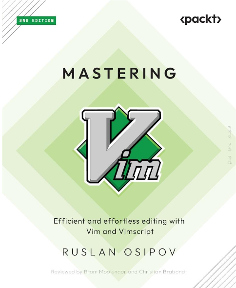
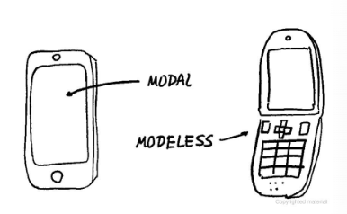
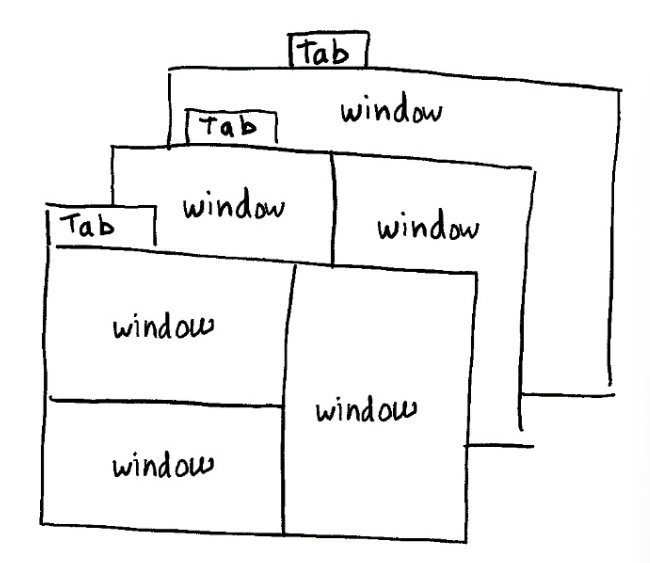

# Mastering Vim, Ruslan Osipov, 2ND Edition

# 1

## A brief history lesson

> Before personal computers and terminals, there were teleprinters. A teleprinter is a mechanical typewriter that can send and receive messages over a telecommunications channel.
>
> As technology progressed, teleprinters were replaced by terminals with screens, which enabled much more robust text editing. Vim’s direct predecessor, **vi**, started its life all the way back in 1976. Unlike its predecessors, **vi** (developed by Bill Joy, the author of ex) included many quality-of-life features and even allowed you to edit multiple lines of text at once – what a luxury!

---

> The first version of Vim was released in **1991** by **Bram Moolenaar**. Now, you’re all caught up!

## About Modal Interface

> Welcome to the modal interface, **where each trigger performs a different action based on context**. 
>
> The most common example of a modal interface that we encounter today is a smartphone. Each time we work in different applications or open different menus, a tap on the screen performs a different function.

- Vim is a modal editor
  - meaning that a single button press might result in different actions.

## A word about swap files

> By default, Vim keeps track of the changes you make to files in swap files. 

- The swap files are created as you edit the files, 
  - and are used to recover the contents of your files in case either Vim, your SSH session, or your machine crashes.

# 2

## Organizing the workspace

> Buffers are the way Vim internally represents files; they allow you to switch between multiple files quickly

- `:ls` : 현재 vim buffer에 존재하는 파일 정보 나열
  - buffer number, 

> Vim refers to buffers by a number and a name, and both are unique within a single session (until you exit Vim). 
>
> To switch to a different buffer, use the `:b` command, followed by the number of the buffer:			

- `:b1`: 1번 버퍼를 현재 에디터에서 연다.
- `:b <string>`: 버퍼의 파일 중 문자열과 부분일치하는 파일명을 찾아서 연다. 일치하는 파일이 두 개 이상이면 오류 발생하고 실패
- `:bn[ext]`: 다음 버퍼로 이동
- `:bp[revious]`: 이전 버퍼로 이동
- `:bd`: 열린 버퍼를 지운다.

## Tabs

> Vim uses tabs to switch between collections of windows, allowing you to effectively have multiple workspaces. Tabs are often used to work on a slightly different problem or set of files within the same Vim sessiono

