# 이펙티브 디버깅: 디버깅 지옥에서 탈출하는 66가지 전략과 기법(Effective Debugging: 66 Spedific Ways to Debug Software and Systems)

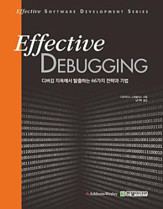

## Chapter1 고차원 전략

- Item 1: 이슈 추적 시스템issue-tracking system

- Item 3: 선행 조건과 후행 조건 만족 여부 확인하기

- Item 4: 문제 발생 지점부터 버그를 추적하거나 프로그램 시작 지점부터 버그를 찾아내기

- Item 7: 빌드 및 실행 환경을 다양하게 구성하기

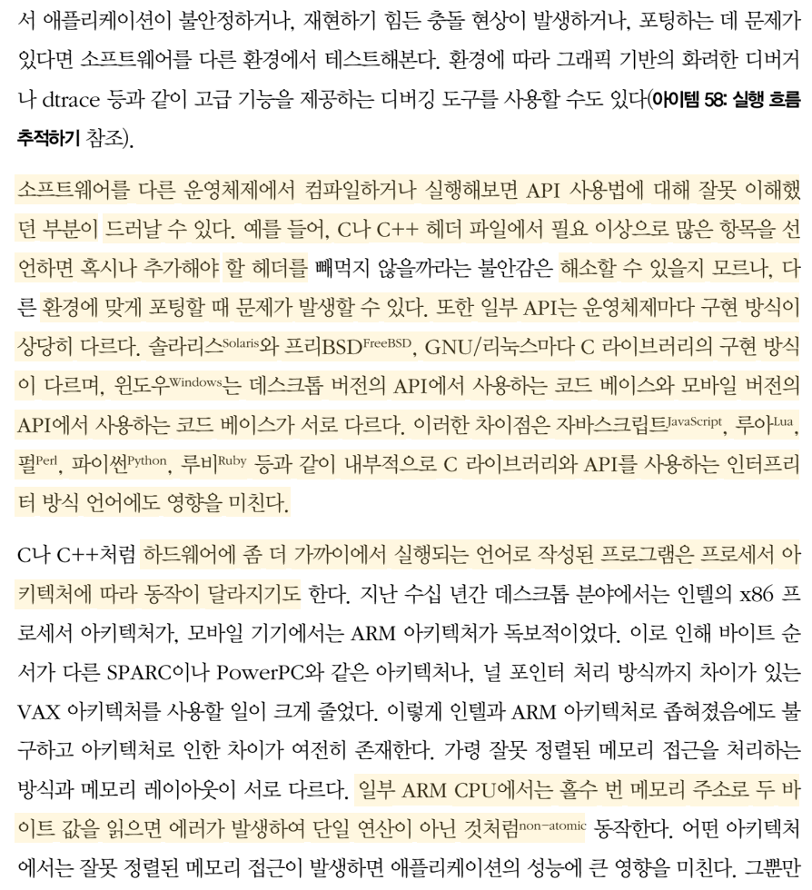

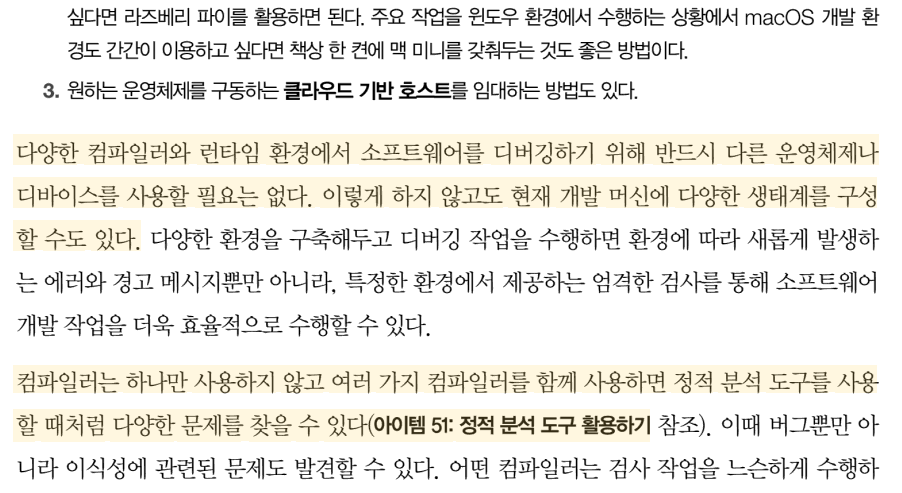

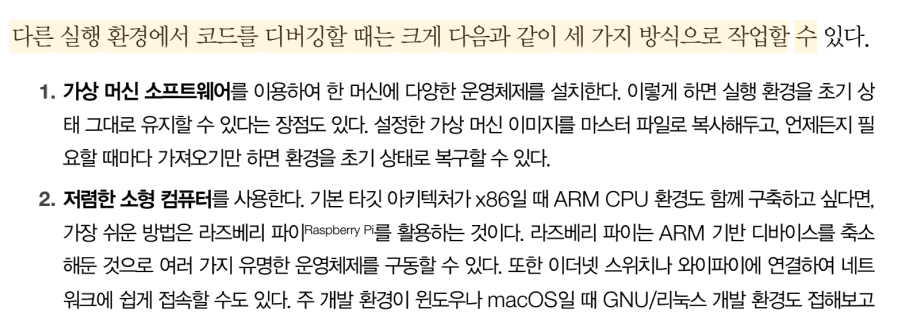

- Item 8 : 가장 중요한 문제에 집중하기

높은 우선순위 사례

낮은 우선순위 사례

## Chapter2 범용적인 디버깅 기법

- Item 9: 성공적인 디버깅을 위한 마음가짐

잠을 자는 것도 방법이다.

- Item 10: 효율적으로 문제 상황 재현하기

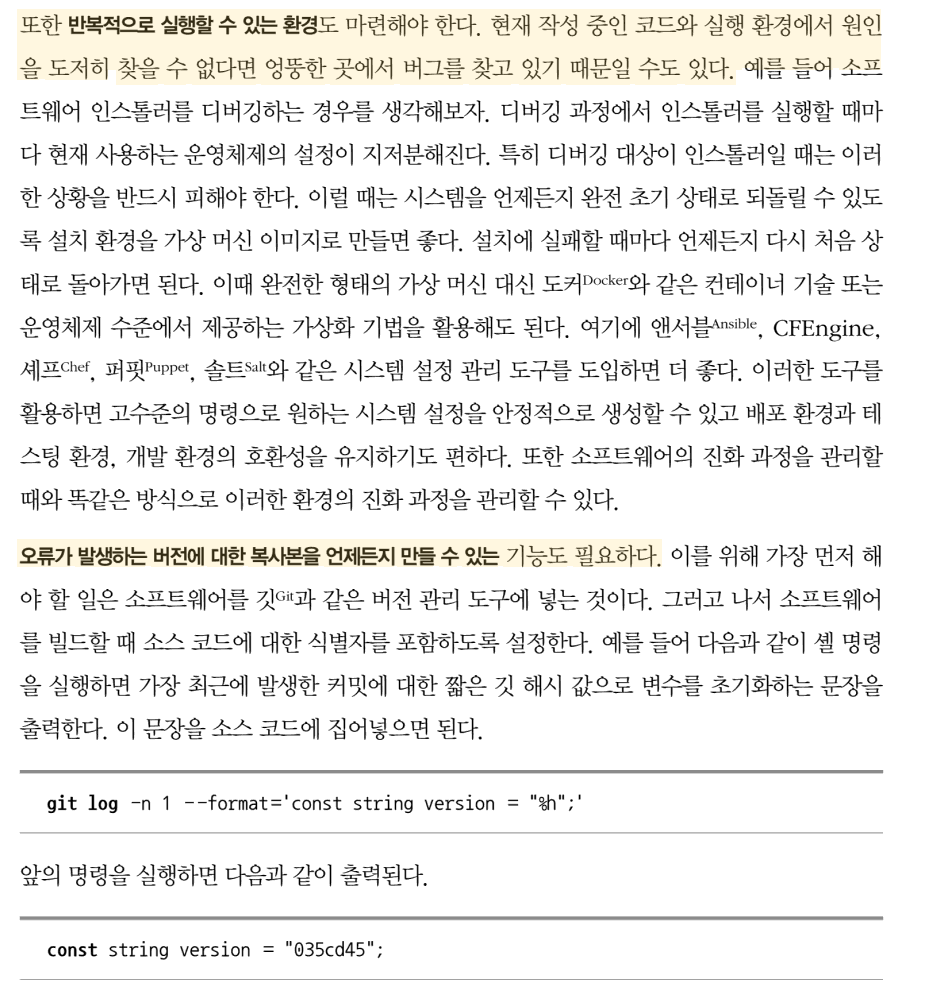

- Item 11: 코드 수정 후 결과 확인까지의 시간 최소화하기

- Item 12: 복잡한 테스트 시나리오 자동화하기
- Item 13: 디버깅 관련 데이터를 한눈에 볼 수 있는 환경 구축하기
- Item 14: 소프트웨어 업데이트 고려하기

- Item 15: 서드파티 소스 코드 분석을 통해 문제 해결하기
- Item 16: 전문 모니터링 및 테스트 장비 활용하기
- Item 17: 오류의 효과 극대화하기

- Item 18: 원격 디버깅 환경 구축하기

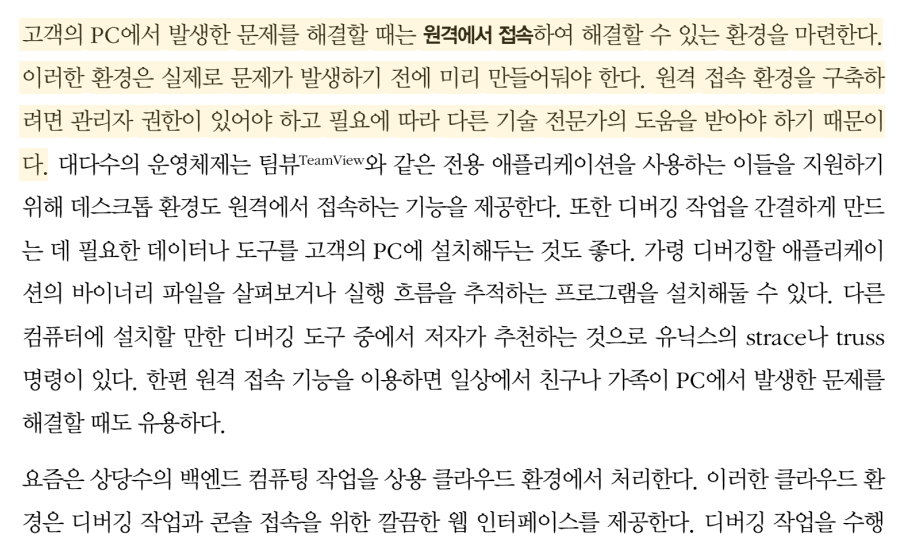

- Item 19: 디버깅 작업 자동화하기
- Item 20: 디버깅 전과 후에 정리하기
- Item 21: 비슷한 문제 모두 고치기

## Chapter3 범용 도구를 활용한 기법

[GitHub - jlevythe-art-of-command-line Master the command line, in one page](https://github.com/jlevy/the-art-of-command-line)

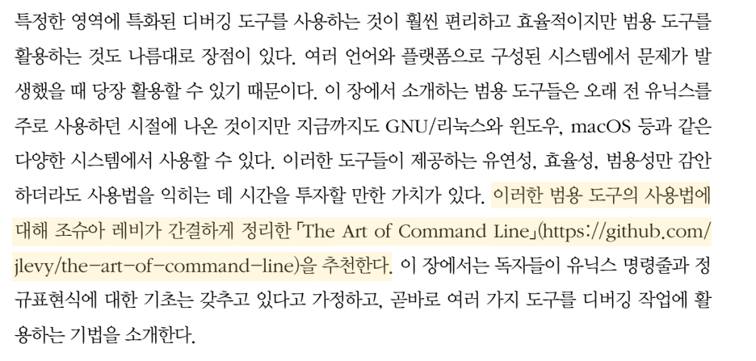

- Item 22: 유닉스 명령줄 도구로 디버깅 데이터 분석하기

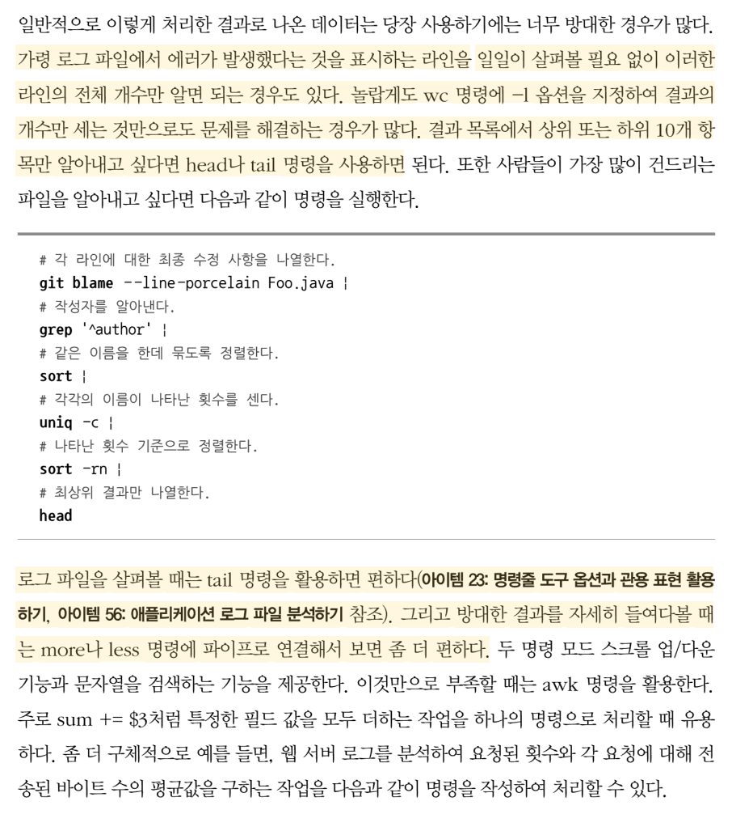

- Item 23: 명령줄 도구 옵션과 관용 표현 활용하기

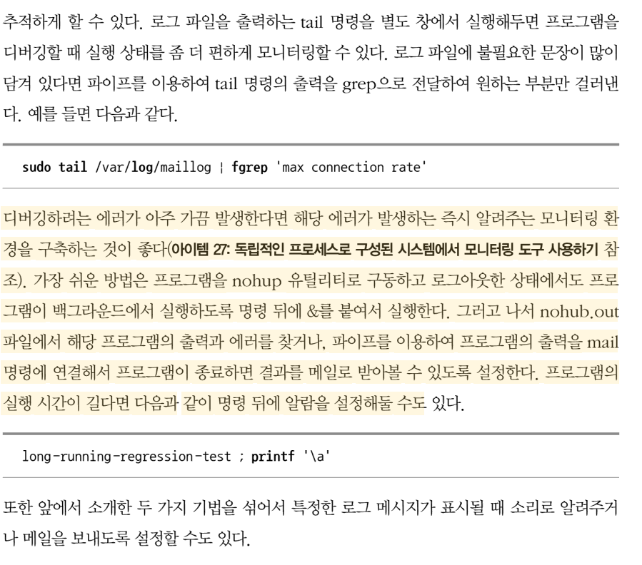

- Item 25: 작업 환경 최적화하기
- Item 26: 버전 관리 시스템으로 버그 원인과 히스토리 추적하기
- Item 27: 독립적인 프로세스로 구성된 시스템에서 모니터링 도구 사용하기

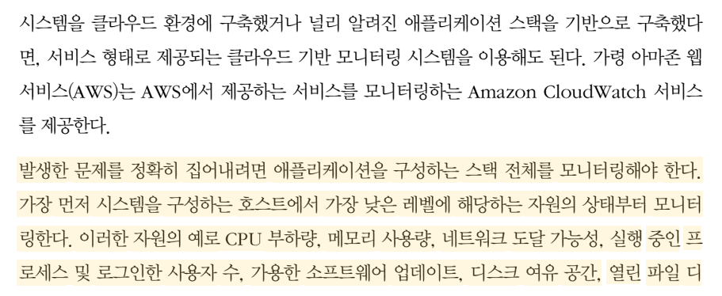

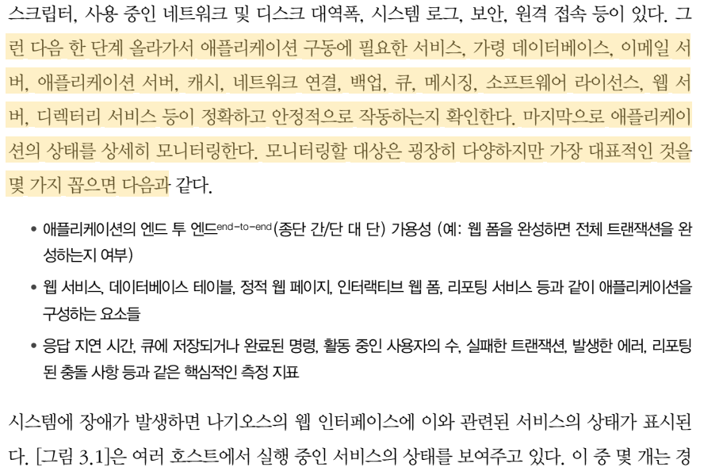

## Chapter 4 : 디버거 활용법

- Item 28: 디버깅 버전으로 컴파일하기
- Item 29: 한 단계씩 코드 실행하기
- Item 30: 코드와 데이터 중단점 확인하기
- Item 31: 리버스 디버깅

[Visual Studio의 IntelliTrace](chrome-extension://hajanaajapkhaabfcofdjgjnlgkdkknm/_generated_background_page.html)

- Item 32: 루틴 사이의 호출 흐름 추적하기
- Item 33: 변수화 표현식의 값을 분석하여 에러 찾기
- Item 34: 실행 중인 프로세스에 디버거 연결하기
- Item 35: 코어 덤프 다루기
  - 애플리케이션이 충돌하여 멈춘 뒤에도 디버깅할 수 있다. 이렇게 충돌이 발생한 후에 수행하는 디버깅 작업을 사후 디버깅(postmortem debugging)이라 부른다. 유닉스 시스템에서는 네이티브 프로그램이 충돌하면 코어 덤프(core dump)를 생성한다.
- Item 36: 디버깅 도구 조율하기
- Item 37: 어셈블리 코드와 메모리 값 확인하기

## Chapter 5 : 프로그래밍 기법

- Item 38: 의심스런 코드를 검토하고 손으로 실행해보기
- Item 39: 동료 검토하기

- Item 40: 디버깅 기능 추가하기

- Item 41 : 로그 남기기

- Item 42 : 단위 테스트 사용하기
- Item 43 : 어서션 사용하기

- Item 44 : 코드를 바꿔보면서 검증하기
- Item 45 : 정상적인 코드와 문제가 발생한 코드의 차이점 줄이기
- Item 46 : 의심스런 코드 간소화하기

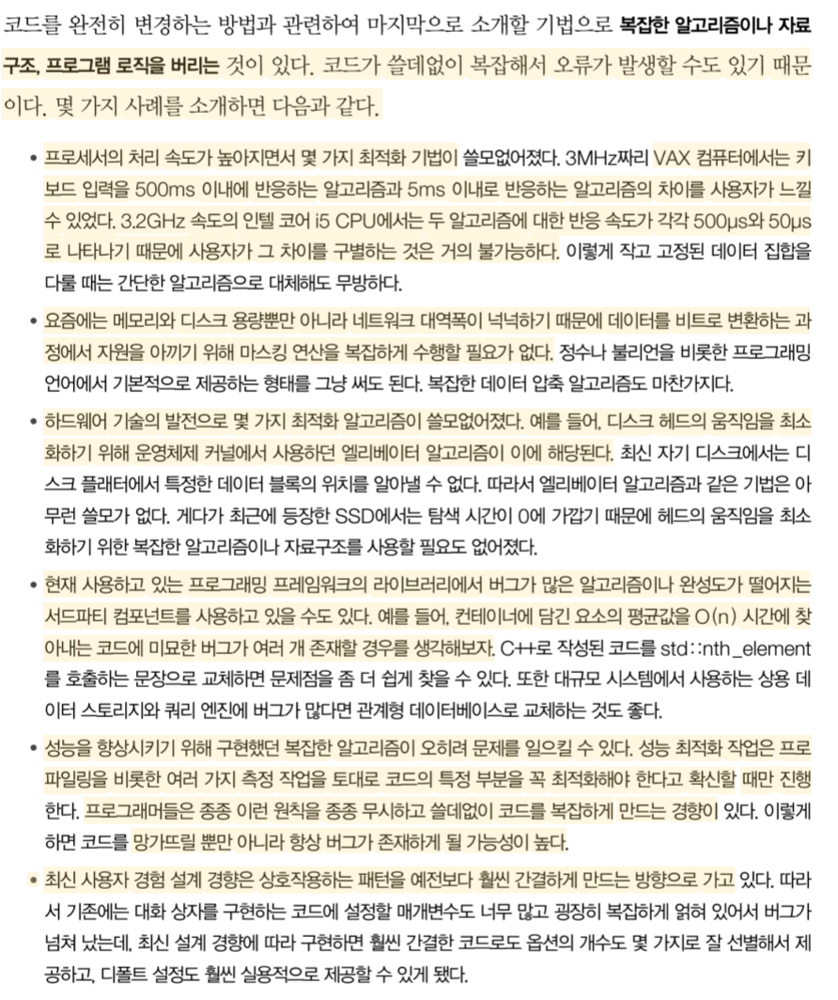

- Item 47 : 의심스런 코드를 다른 언어로 작성해보기
- Item 48 : 의심스런 코드의 가독성과 구조 향상시키기
- Item 49 : 버그의 증상이 아닌 원인 고치기

## Chapter 6 : 컴파일 시간 기법

- Item 50 : 생성된 코드 확인하기
- Item 51 : 정적 분석 도구 활용하기
- Item 52 : 빌드 결과와 실행 동작이 항상 일정하도록 설정하기

메모리를 공략한 해킹 공격을 막기 위해, os는 프로세스 메모리가 올라갈 base 주소를 난수로 결정하는데

이린 점으로 예상치 못한 상황에 문제가 발생하기도 한다. 항상 동일한 메모리에서 프로세스가 실행된다는 보장이 없기 때문에

그렇기에 책 기준으로 비주얼 스튜디오 `/DYNAMICBASE:NO` 옵션으로 프로그램이 항상 일정한 위치에서 실행하도록 보장할 수 있다.

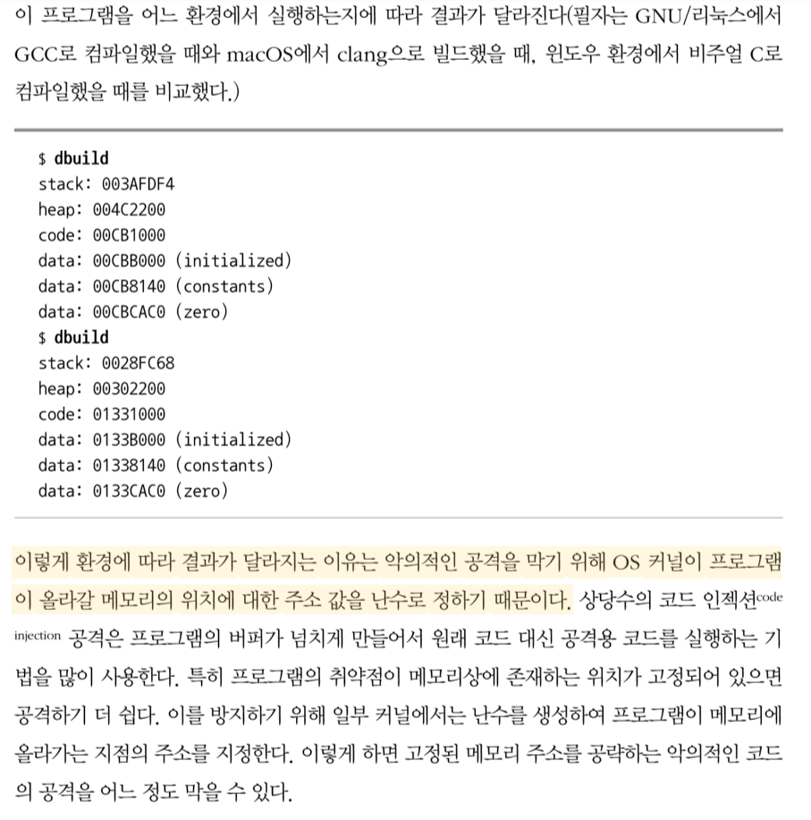

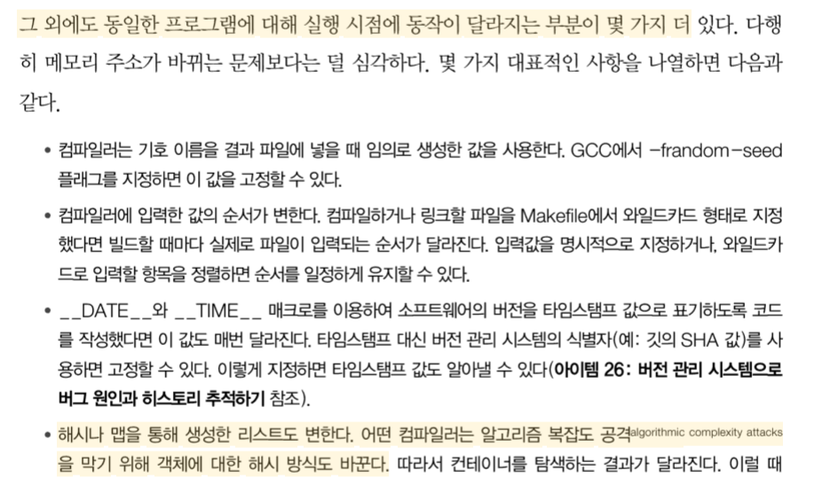

- Item 53 : 라이브러리에서 제공하는 디버깅 및 검사 기능 설정하기

## Chapter 7 : 실행 시간 기법

- Item 54 : 테스트 케이스를 작성하여 오류 찾기
- Item 55 : 오류가 발생한 즉시 프로그램 중단하기

- Item 56 : 애플리케이션 로그 파일 분석하기

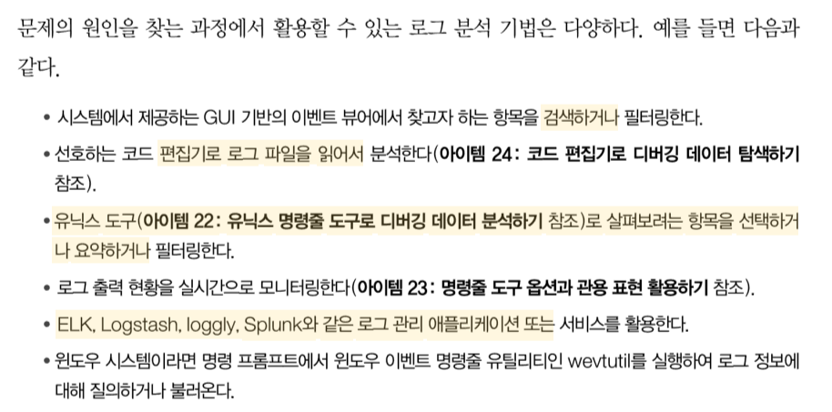

- Item 57 : 시스템 및 프로세스 연산에 대한 프로파일 분석하기

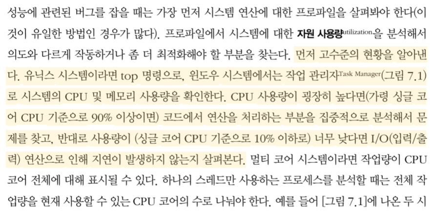

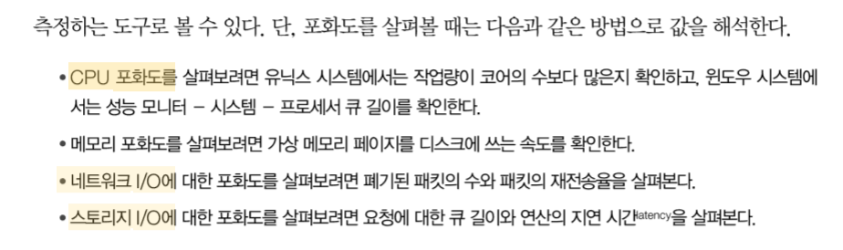

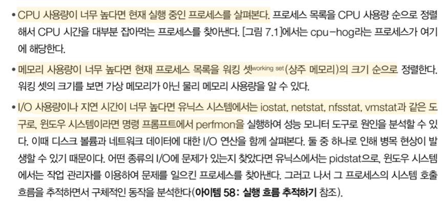

- Item 58 : 실행 흐름 추적하기

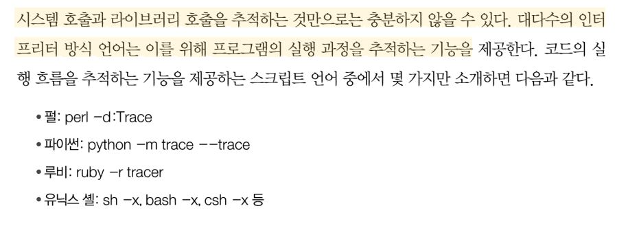

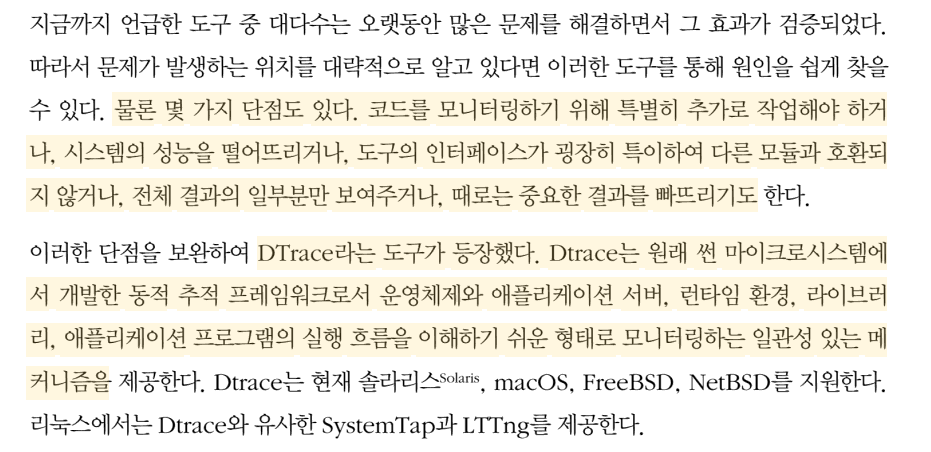

- Item 59 : 동적 프로그램 분석 도구 활용하기

## Chapter 8 : 멀티스레드 코드 디버깅하기

- Item 60 : 사후 디버깅으로 교착 상태 분석하기

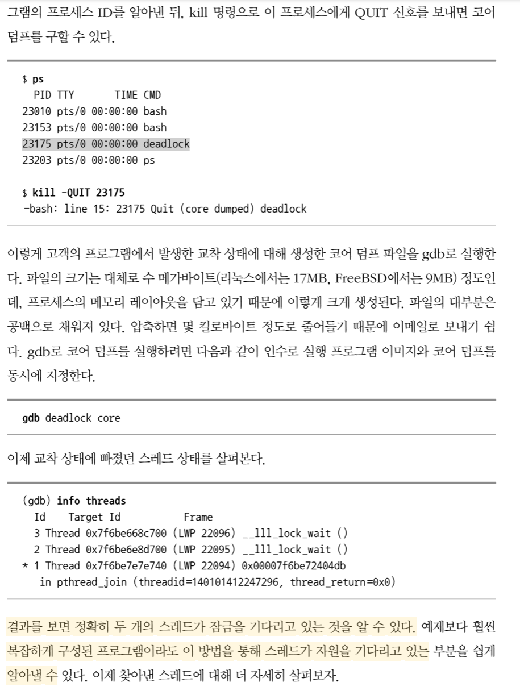

일반적으로 개발자들이 교착 상태deadlock를 두려워하는 것과는 다르게 

교착상태에 대한 원인 파악은 수월하다고 함

교착 상태에 빠지면 스레드가 멈추기 때문에,

덤프를 확보할 수 있다면 정지된 스레드를 추적해서 오류가 발생한 지점을 크게 좁힐 수 있다.

- Item 61 : 프로그램의 실행 흐름을 기록한 뒤 재생하기
- Item 62 : 전문 도구로 교착 상태와 경쟁 상태 찾기
- Item 63 : 예측할 수 없는 부분을 분리하거나 제거하기
- Item 64 : 자원 경쟁으로 인해 발생한 성능 확장성 문제 분석하기

lock contention 으로 인해 scale up 효율이 생각보다 떨어지는 경우에 대한 접근 방법 (프로젝트에서 실제로 겪은 사례)

- Item 65 : 성능 카운터를 이용하여 거짓 공유 발생 지점 찾기

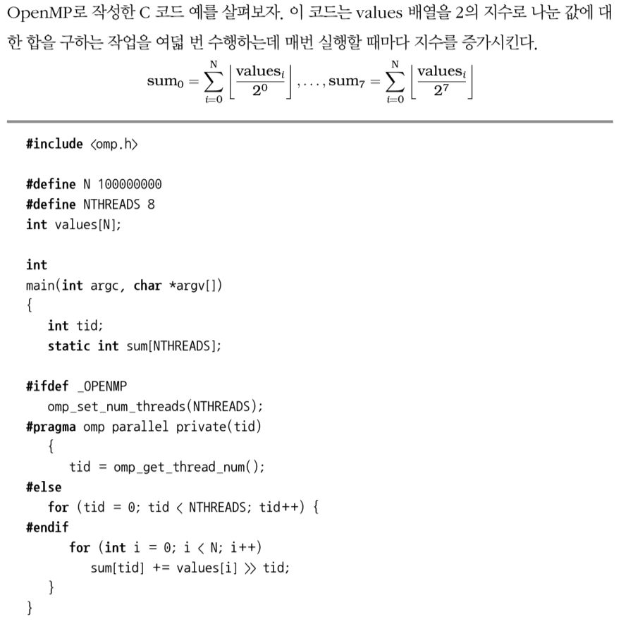

싱글 스레드 버전에 비해 멀티 스레드 버전 실행 성능이 별로 향상되지 않음

성능 카운터 도구로 캐시 미스 횟수를 측정함으로써 false sharing 원인 파악

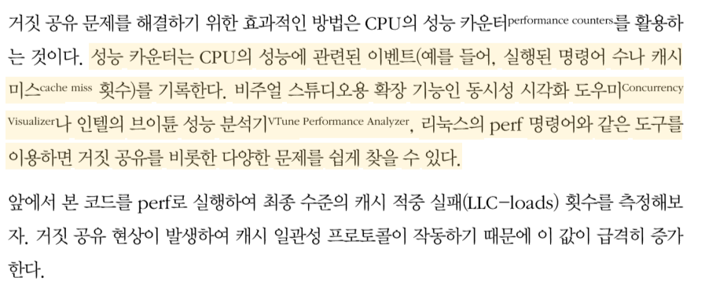

- Item 66 : 고수준 추상화를 사용하도록 코드 다시 작성하기

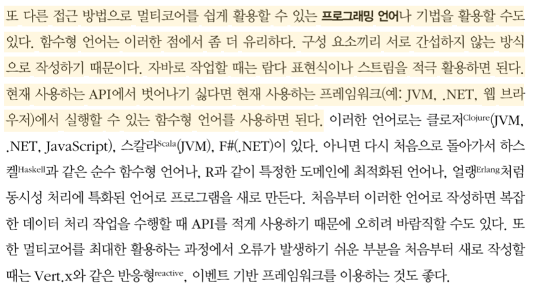