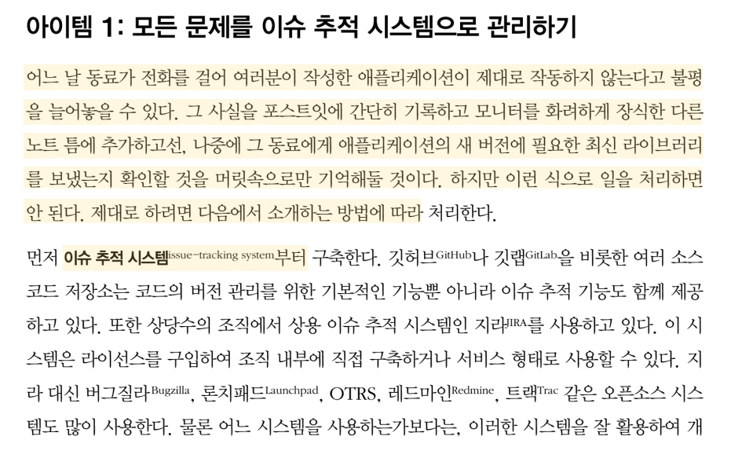

# 이펙티브 디버깅: 디버깅 지옥에서 탈출하는 66가지 전략과 기법(Effective Debugging: 66 Spedific Ways to Debug Software and Systems)

## Chapter1 고차원 전략

- Item 1: 이슈 추적 시스템issue-tracking system

- Item 3: 선행 조건과 후행 조건 만족 여부 확인하기

- Item 4: 문제 발생 지점부터 버그를 추적하거나 프로그램 시작 지점부터 버그를 찾아내기

- Item 7: 빌드 및 실행 환경을 다양하게 구성하기

- Item 8 : 가장 중요한 문제에 집중하기

높은 우선순위 사례

낮은 우선순위 사례

