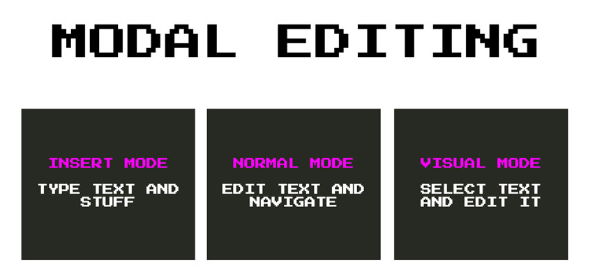
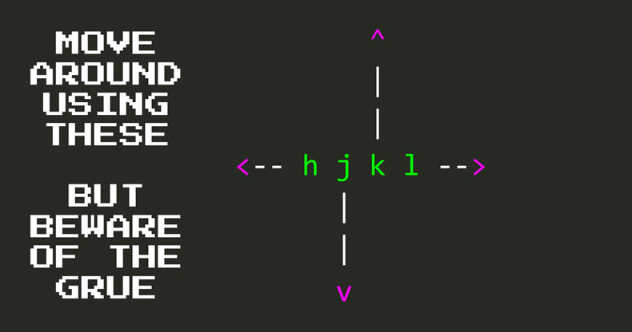
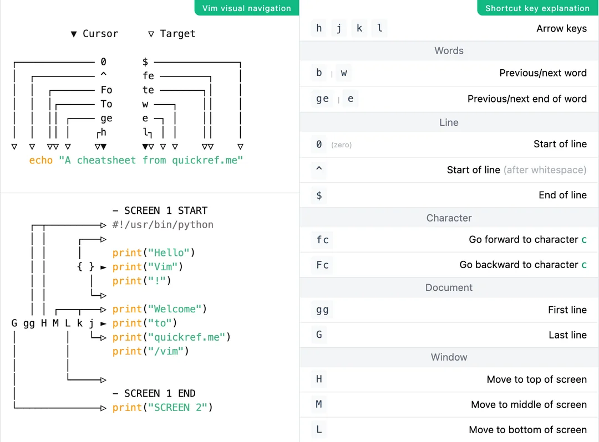
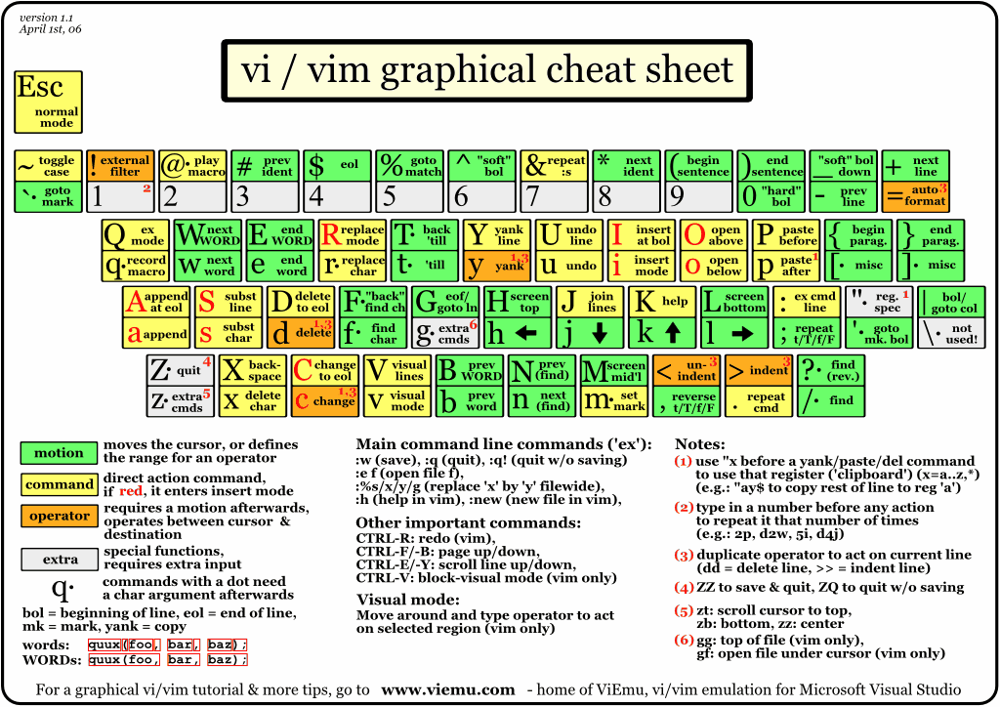

# Learn Vim

**Modes in Vim**





**Word(W)**

- w (word) : jump to the beginning of the next word
- b (back) : jump to the beginning of a word backwards
- e (end) : jump to the end of a word
- ge : jump to the end of a word backwards

**Insert 모드에서 사용할 수 있는 주요 동작**

1. **문자 삭제**
   - **백스페이스**: `Backspace` 키를 사용하여 커서 앞의 문자를 삭제합니다.
   - **Ctrl + w**: 커서 앞의 단어를 삭제합니다.
   - **Ctrl + u**: 커서 앞의 전체 라인을 삭제합니다.

2. **텍스트 입력과 관련된 기능**
   - **Esc**: Insert 모드를 종료하고 Normal 모드로 돌아갑니다.
   - **Ctrl + o**: Insert 모드를 유지하면서 Normal 모드의 단일 명령을 실행할 수 있게 해줍니다. 예를 들어, `Ctrl + o`를 누른 후 `w`를 입력하면 다음 단어로 이동합니다. 명령이 끝나면 Insert 모드로 자동 복귀합니다.

3. **자동 완성**
   - **Ctrl + n**: 단어 자동 완성 기능을 사용하여 다음 후보를 제시합니다.
   - **Ctrl + p**: 단어 자동 완성 기능을 사용하여 이전 후보를 제시합니다.

4. **현재 라인 복사**
   - **Ctrl + y**: 현재 라인의 한 줄 위에 있는 텍스트를 현재 커서 위치에 복사합니다.

5. **삽입된 텍스트 취소**
   - **Ctrl + u**: 커서 위치에서 현재 라인의 앞쪽 텍스트를 모두 삭제합니다.

**현재 라인에서 키워드 교체**

현재 라인에서 특정 키워드를 다른 키워드로 교체하려면 다음 명령을 사용할 수 있습니다.

    :s/old_keyword/new_keyword/g

- `:s`: substitute 명령어.
- `old_keyword`: 변경할 키워드.
- `new_keyword`: 새로 바꿀 키워드.
- `g`: 해당 라인에서 일치하는 모든 키워드를 변경 (없으면 첫 번째 키워드만 변경).

**특정 범위에서 키워드 교체**

일정 범위의 라인에서 키워드를 교체하려면 다음과 같이 할 수 있습니다.

    :10,20s/old_keyword/new_keyword/g

- `10,20`: 10번 라인부터 20번 라인까지.

**파일 전체에서 키워드 교체**

파일 전체에서 키워드를 일괄 교체하려면 다음 명령어를 사용할 수 있습니다.

    :%s/old_keyword/new_keyword/g

- `%`: 파일 전체.

**파일 열면서 명령 실행**

파일을 열면서 set number 명령 실행

`vim +':set number' 파일이름`\
or
`vim +set\ number path/to/file`

**라인 번호로 이동하기**

- :숫자를 입력한 후 Enter를 누르면 해당 라인으로 이동합니다.
- 예: `:25`를 입력하면 25번째 라인으로 이동합니다.
- 숫자를 입력한 후 G를 사용
- 예: `25G`를 입력하면 25번째 라인으로 이동합니다.

**클립보드에 파일 복사**

- `"+y` : 클립보드에 복사
- `"+p` : 클립보드에서 붙여넣기
- `"+yy` : 클립보드에 라인 전체 복사
- `ggvG"+y` : 전체파일 클립보드에 복사

**정렬**

- `==`: 라인 정렬

## neovim

### Neovim 파일 경로 정보

#### 1. ShaDa 파일 경로
- **Windows**:  
  `C:\Users\<사용자 이름>\AppData\Local\nvim-data\shada\main.shada`
- **macOS**:  
  `~/.local/share/nvim/shada/main.shada`

#### 2. Neovim 설정 파일(`init.vim`) 경로
- **Windows**:  
  `C:\Users\<사용자 이름>\AppData\Local\nvim\init.vim`
- **macOS**:  
  `~/.config/nvim/init.vim`

#### 키맵핑 충돌 확인 방법 (key map collision check)

> 설정한 키맵핑이 다른 플러그인이나 기존 설정과 충돌하지 않는지 확인하려면 :verbose map 명령어를 사용하여 현재 사용 중인 모든 키맵핑을 확인할 수 있습니다.

- `:verbose map <A-j>`
- `:verbose map <A-k>`

**Cheat Sheet**






- [Vim Cheat Sheet](https://vim.rtorr.com/)

- Global

    **:h[elp] keyword - open help for keyword**
    :sav[eas] file - save file as
    :clo[se] - close current pane
    **:ter[minal] - open a terminal window**
    K - open man page for word under the cursor

- Cursor Movement

   h - move cursor left
   j - move cursor down
   k - move cursor up
   l - move cursor right
   gj - move cursor down (multi-line text)
   gk - move cursor up (multi-line text)
   H - move to top of screen
   M - move to middle of screen
   L - move to bottom of screen
   **w - jump forwards to the start of a word**
   W - jump forwards to the start of a word (words can contain punctuation)
   **e - jump forwards to the end of a word**
   E - jump forwards to the end of a word (words can contain punctuation)
   b - jump backwards to the start of a word
   B - jump backwards to the start of a word (words can contain punctuation)
   ge - jump backwards to the end of a word
   gE - jump backwards to the end of a word (words can contain punctuation)
   % - move cursor to matching character (default supported pairs: '()', '{}', '[]' - use :h matchpairs in vim for more info)
   **0 - jump to the start of the line**
   **^ - jump to the first non-blank character of the line**
   **$ - jump to the end of the line**
   g_ - jump to the last non-blank character of the line
   **gg - go to the first line of the document**
   **G - go to the last line of the document**
   5gg or 5G - go to line 5
   gd - move to local declaration
   gD - move to global declaration
   **fx - jump to next occurrence of character x**
   **tx - jump to before next occurrence of character x**
   Fx - jump to the previous occurrence of character x
   Tx - jump to after previous occurrence of character x
   **; - repeat previous f, t, F or T movement**
   , - repeat previous f, t, F or T movement, backwards
   } - jump to next paragraph (or function/block, when editing code)
   { - jump to previous paragraph (or function/block, when editing code)
   zz - center cursor on screen
   zt - position cursor on top of the screen
   zb - position cursor on bottom of the screen
   Ctrl + e - move screen down one line (without moving cursor)
   Ctrl + y - move screen up one line (without moving cursor)
   Ctrl + b - move screen up one page (cursor to last line)
   Ctrl + f - move screen down one page (cursor to first line)
   Ctrl + d - move cursor and screen down 1/2 page
   Ctrl + u - move cursor and screen up 1/2 page
   Tip Prefix a cursor movement command with a number to repeat it. For example, 4j moves down 4 lines.
   Insert mode - inserting/appending text
   **i - insert before the cursor**
   **I - insert at the beginning of the line**
   **a - insert (append) after the cursor**
   **A - insert (append) at the end of the line**
   **o - append (open) a new line below the current line**
   **O - append (open) a new line above the current line**
   ea - insert (append) at the end of the word
   Ctrl + h - delete the character before the cursor during insert mode
   Ctrl + w - delete word before the cursor during insert mode
   Ctrl + j - add a line break at the cursor poisition during insert mode
   Ctrl + t - indent (move right) line one shiftwidth during insert mode
   Ctrl + d - de-indent (move left) line one shiftwidth during insert mode
   Ctrl + n - insert (auto-complete) next match before the cursor during insert mode
   Ctrl + p - insert (auto-complete) previous match before the cursor during insert mode
   Ctrl + rx - insert the contents of register x
   Ctrl + ox - Temporarily enter normal mode to issue one normal-mode command x.
   Esc or Ctrl + c - exit insert mode

- Editing

    **r - replace a single character.**
    R - replace more than one character, until ESC is pressed.
    J - join line below to the current one with one space in between
    gJ - join line below to the current one without space in between
    gwip - reflow paragraph
    g~ - switch case up to motion
    gu - change to lowercase up to motion
    gU - change to uppercase up to motion
    cc - change (replace) entire line
    c$ or C - change (replace) to the end of the line
    ciw - change (replace) entire word
    cw or ce - change (replace) to the end of the word
    **s - delete character and substitute text (same as cl)**
    **S - delete line and substitute text (same as cc)**
    xp - transpose two letters (delete and paste)
    **u - undo**
    U - restore (undo) last changed line
    **Ctrl + r - redo**
    **. - repeat last command**
    Marking text (visual mode)
    v - start visual mode, mark lines, then do a command (like y-yank)
    V - start linewise visual mode
    o - move to other end of marked area
    Ctrl + v - start visual block mode
    O - move to other corner of block
    aw - mark a word
    ab - a block with ()
    aB - a block with {}
    at - a block with <> tags
    ib - inner block with ()
    iB - inner block with {}
    it - inner block with <> tags
    Esc or Ctrl + c - exit visual mode

- Visual Commands

	> - shift text right
	< - shift text left
	y - yank (copy) marked text
	d - delete marked text
	~ - switch case
	u - change marked text to lowercase
	U - change marked text to *uppercase*

- Cut and Paste

	**yy - yank (copy) a line**
	2yy - yank (copy) 2 lines
	yw - yank (copy) the characters of the word from the cursor position to the start of the next word
	yiw - yank (copy) word under the cursor
	yaw - yank (copy) word under the cursor and the space after or before it
	y$ or Y - yank (copy) to end of line
	**p - put (paste) the clipboard after cursor**
	P - put (paste) before cursor
	gp - put (paste) the clipboard after cursor and leave cursor after the new text
	gP - put (paste) before cursor and leave cursor after the new text
	**dd - delete (cut) a line**
	2dd - delete (cut) 2 lines
	dw - delete (cut) the characters of the word from the cursor position to the start of the next word
	diw - delete (cut) word under the cursor
	daw - delete (cut) word under the cursor and the space after or before it
	**:3,5d - delete lines starting from 3 to 5**
	**:g/{pattern}/d - delete all lines containing pattern**
	**:g!/{pattern}/d - delete all lines not containing pattern**
	**d$ or D - delete (cut) to the end of the line**
	**x - delete (cut) character**

- Search And Replace

	**/pattern - search for pattern**
	**?pattern - search backward for pattern**
	\vpattern - 'very magic' pattern: non-alphanumeric characters are interpreted as special regex symbols (no escaping needed)
	**n - repeat search in same direction**
	N - repeat search in opposite direction
	**:%s/old/new/g - replace all old with new throughout file**
	**:%s/old/new/gc - replace all old with new throughout file with confirmations**
	:noh[lsearch] - remove highlighting of search matches

**Neovim config (Init.lua)**

```lua

-- init.lua

-- Basic settings
vim.o.number = true -- Enable line numbers
vim.o.relativenumber = true -- Enable relative line numbers
vim.o.tabstop = 4 -- Number of spaces a tab represents
vim.o.shiftwidth = 4 -- Number of spaces for each indentation
vim.o.expandtab = true -- Convert tabs to spaces
vim.o.smartindent = true -- Automatically indent new lines
vim.o.wrap = false -- Disable line wrapping
vim.o.cursorline = true -- Highlight the current line
vim.o.termguicolors = true -- Enable 24-bit RGB colors
vim.o.ignorecase = true
vim.o.smartcase = true -- 패턴에 대문자가 포함되어 있다면 대소문자 구분

-- Syntax highlighting and filetype plugins
vim.cmd("syntax enable")
vim.cmd("filetype plugin indent on")

-- Leader key
vim.g.mapleader = " " -- Space as the leader key

-- Ctrl + A: Select All
vim.api.nvim_set_keymap('n', '<C-a>', 'ggVG', {noremap = true, silent = true})
vim.api.nvim_set_keymap('v', '<C-a>', '<ESC>ggVG', {noremap = true, silent = true})

-- Insert 모드에서 Ctrl + (h|j|k|l)가 노멀 모드에서 화살표 키와 동일하게 동작하도록 설정
vim.api.nvim_set_keymap('i', '<C-h>', '<Left>', {noremap = true, silent = true})
vim.api.nvim_set_keymap('i', '<C-j>', '<Down>', {noremap = true, silent = true})
vim.api.nvim_set_keymap('i', '<C-k>', '<Up>', {noremap = true, silent = true})
vim.api.nvim_set_keymap('i', '<C-l>', '<Right>', {noremap = true, silent = true})

-- Insert/Normal/Visual 모드에서 Alt + j/k를 사용하여 라인을 아래/위로 이동시키기
vim.api.nvim_set_keymap('i', '<A-j>', '<Esc>:m .+1<CR>gi', { noremap = true, silent = true })
vim.api.nvim_set_keymap('i', '<A-k>', '<Esc>:m .-2<CR>gi', { noremap = true, silent = true })
vim.api.nvim_set_keymap('n', '<A-j>', ':m .+1<CR>', { noremap = true, silent = true })
vim.api.nvim_set_keymap('n', '<A-k>', ':m .-2<CR>', { noremap = true, silent = true })
vim.api.nvim_set_keymap('v', '<A-j>', ":m '>+1<CR>gv=gv", { noremap = true, silent = true })
vim.api.nvim_set_keymap('v', '<A-k>', ":m '<-2<CR>gv=gv", { noremap = true, silent = true })

-- Insert/Normal/Visual 모드에서 Leader + y/p 로 시스템 클립보드에 복사/붙여넣기
-- vim.api.nvim_set_keymap('i', '<A-c>', '<Esc>V"+ygi', { noremap = true, silent = true }) -- 라인 전체 복사
vim.api.nvim_set_keymap('i', '<C-v>', '<Esc>"+pgi', { noremap = true, silent = true })
vim.api.nvim_set_keymap('n', '<leader>y', '"+y', { noremap = true, silent = true })
vim.api.nvim_set_keymap('n', '<leader>p', '"+p', { noremap = true, silent = true })
vim.api.nvim_set_keymap('v', '<leader>y', '"+y', { noremap = true, silent = true })
vim.api.nvim_set_keymap('v', '<leader>p', '"+p', { noremap = true, silent = true })

-- 탭 관련
vim.api.nvim_set_keymap('n', '<leader>tn', ':tabnew<CR>', { noremap = true, silent = true }) -- 탭 생성
vim.api.nvim_set_keymap('n', '<leader>tw', ':tabclose<CR>', { noremap = true, silent = true }) -- 현재 탭 닫기
vim.api.nvim_set_keymap('n', '<leader>tl', ':tabnext<CR>', { noremap = true, silent = true }) -- 다음 탭으로 이동
vim.api.nvim_set_keymap('n', '<leader>th', ':tabprevious<CR>', { noremap = true, silent = true }) -- 이전 탭으로 이동
vim.api.nvim_set_keymap('n', '<leader>t1', ':tabfirst<CR>', { noremap = true, silent = true }) -- 첫 번째 탭으로 이동
vim.api.nvim_set_keymap('n', '<leader>t$', ':tablast<CR>', { noremap = true, silent = true }) -- 마지막 탭으로 이동

-- 창 관련 (pane)
vim.api.nvim_set_keymap('n', '<leader>ts', ':vsplit<CR>', { noremap = true, silent = true }) -- 창 수직 분할
vim.api.nvim_set_keymap('n', '<A-h>', '<C-w>h', { noremap = true, silent = true }) -- 창 탐색 (왼쪽)
vim.api.nvim_set_keymap('n', '<A-l>', '<C-w>l', { noremap = true, silent = true }) -- 창 탐색 (오른쪽)


-- 'lazy.nvim' 설치 및 경로 설정
local lazypath = vim.fn.stdpath("data") .. "/lazy/lazy.nvim"
if not vim.loop.fs_stat(lazypath) then
    vim.fn.system({
        "git",
        "clone",
        "--filter=blob:none",
        "https://github.com/folke/lazy.nvim.git",
        "--branch=stable", -- latest stable release
        lazypath,
    })
end
vim.opt.rtp:prepend(lazypath)

-- 플러그인 설정
require("lazy").setup({
    -- Treesitter
    {
        "nvim-treesitter/nvim-treesitter",
        run = ":TSUpdate",
    },
    -- Telescope
    {
        "nvim-telescope/telescope.nvim",
        requires = { { "nvim-lua/plenary.nvim" } },
    },
    {
        "nvim-telescope/telescope-file-browser.nvim",
        dependencies = { "nvim-telescope/telescope.nvim", "nvim-lua/plenary.nvim" }
    },
    {
        -- [ms-jpq/coq_nvim: Fast as FUCK nvim completion. SQLite, concurrent scheduler, hundreds of hours of optimization.](https://github.com/ms-jpq/coq_nvim?tab=readme-ov-file)
        "neovim/nvim-lspconfig", -- REQUIRED: for native Neovim LSP integration
        lazy = false, -- REQUIRED: tell lazy.nvim to start this plugin at startup
        dependencies = {
            -- main one
            { "ms-jpq/coq_nvim", branch = "coq" },

            -- 9000+ Snippets
            { "ms-jpq/coq.artifacts", branch = "artifacts" },

            -- lua & third party sources -- See https://github.com/ms-jpq/coq.thirdparty
            -- Need to **configure separately**
            { 'ms-jpq/coq.thirdparty', branch = "3p" }
            -- - shell repl
            -- - nvim lua api
            -- - scientific calculator
            -- - comment banner
            -- - etc
        },
        init = function()
            vim.g.coq_settings = {
                auto_start = true, -- if you want to start COQ at startup
                -- Your COQ settings here
            }
        end,
        config = function()
            -- Your LSP settings here
        end,
    },
    -- 코드 분석 플러그인
    {
        "jose-elias-alvarez/null-ls.nvim",
        requires = { "nvim-lua/plenary.nvim" },
        config = function()
            local null_ls = require("null-ls")
            null_ls.setup({
                sources = {
                    null_ls.builtins.diagnostics.eslint,
                    null_ls.builtins.diagnostics.stylelint,
                    null_ls.builtins.formatting.prettier,
                },
            })
        end,
    },
    { "catppuccin/nvim", name = "catppuccin", priority = 1000 },
    { "folke/which-key.nvim", requires = {{"which-key"}}, },
    { "akinsho/toggleterm.nvim", },
    { "img-paste-devs/img-paste.vim" }, -- paste image in clipboard
})

-- 기본 설정 및 확장 기능 로드
require('telescope').setup{
    defaults = {
        -- telescope 기본 설정 옵션들
        vimgrep_arguments = {
            'rg',
            '--color=never',
            '--no-heading',
            '--with-filename',
            '--line-number',
            '--column',
            '--smart-case'
        },
        prompt_prefix = "🔍 ",
        selection_caret = " ",
        path_display = { "smart" },
        file_ignore_patterns = {"node_modules", ".git/"},
    },
    pickers = {
        -- 기본 픽커 설정
        find_files = {
            theme = "dropdown",
        },
        live_grep = {
            theme = "ivy",
        },
    },
    extensions = {
        -- 추가 확장기능 설정
        file_browser = {
            theme = "ivy",
            -- disables netrw and use telescope-file-browser in its place
            hijack_netrw = true,
            mappings = {
                ["i"] = {
                    -- your custom insert mode mappings
                },
                ["n"] = {
                    -- your custom normal mode mappings
                },
            },
        },
    }
}

-- To get telescope-file-browser loaded and working with telescope,
-- you need to call load_extension, somewhere after setup function:
require("telescope").load_extension "file_browser"

-- 키맵핑 설정
local builtin = require('telescope.builtin')
local opts = { noremap = true, silent = true }

-- telescope
vim.api.nvim_set_keymap('n', '<C-p>', ':Telescope file_browser<CR>', opts) -- 파일 찾기 (Ctrl+p)
vim.api.nvim_set_keymap('n', '<C-f>', ':Telescope current_buffer_fuzzy_find<CR>', opts) -- 현재 파일 텍스트 검색 (Ctrl+f)
vim.api.nvim_set_keymap('n', '<leader><C-f>', '<cmd>lua require("telescope.builtin").live_grep()<CR>', opts) -- 전체 텍스트 검색 (Ctrl+f)
vim.api.nvim_set_keymap('n', '<C-b>', '<cmd>lua require("telescope.builtin").buffers()<CR>', opts) -- 버퍼 목록 보기 (Ctrl+b)
vim.api.nvim_set_keymap('n', '<leader>q', ':Telescope commands<CR>', opts) -- 명령어 탐색 키맵핑
vim.api.nvim_set_keymap('n', '<leader>ft', ':Telescope tags<CR>', opts) -- <leader>ft: 태그 찾기

require("catppuccin").setup({
    flavour = "auto", -- latte, frappe, macchiato, mocha
    background = { -- :h background
        light = "latte",
        dark = "mocha",
    },
    transparent_background = false, -- disables setting the background color.
    show_end_of_buffer = false, -- shows the '~' characters after the end of buffers
    term_colors = false, -- sets terminal colors (e.g. `g:terminal_color_0`)
    dim_inactive = {
        enabled = false, -- dims the background color of inactive window
        shade = "dark",
        percentage = 0.15, -- percentage of the shade to apply to the inactive window
    },
    no_italic = false, -- Force no italic
    no_bold = false, -- Force no bold
    no_underline = false, -- Force no underline
    styles = { -- Handles the styles of general hi groups (see `:h highlight-args`):
        comments = { "italic" }, -- Change the style of comments
        conditionals = { "italic" },
        loops = {},
        functions = {},
        keywords = {},
        strings = {},
        variables = {},
        numbers = {},
        booleans = {},
        properties = {},
        types = {},
        operators = {},
        -- miscs = {}, -- Uncomment to turn off hard-coded styles
    },
    color_overrides = {},
    custom_highlights = {},
    default_integrations = true,
    integrations = {
        cmp = true,
        gitsigns = true,
        nvimtree = true,
        treesitter = true,
        notify = false,
        mini = {
            enabled = true,
            indentscope_color = "",
        },
        -- For more plugins integrations please scroll down (https://github.com/catppuccin/nvim#integrations)
    },
})

require("toggleterm").setup{
    size = 20,
    open_mapping = [[<c-\>]],
    shade_filetypes = {},
    shade_terminals = true,
    shading_factor = '1', 
    start_in_insert = true,
    persist_size = true,
    direction = 'float', -- 'vertical' | 'horizontal' | 'tab' | 'float'
    close_on_exit = true,
    shell = vim.o.shell, 
}

-- Set the image directory and image name (if you want to change the defaults)
vim.g.mdip_imgdir = 'img'
vim.g.mdip_imgname = 'image'

-- Define the :mdip command to call the MarkdownClipboardImage function
vim.api.nvim_create_user_command('Mdip', function()
    vim.cmd('call mdip#MarkdownClipboardImage()')
end, {})

-- setup must be called before loading
vim.cmd.colorscheme("catppuccin")
vim.o.background = "light"
```

**운영체제 환경별로 init.lua 구분하기**

```
User: nvim 자동 완성 플러그인 windows 에서 쓸많한 것

Assistant:
Windows에서 사용할 수 있는 Neovim 자동 완성 플러그인에는 여러 가지가 있습니다. 주로 많이 사용되는 플러그인은 다음과 같습니다:

 1 nvim-cmp: 큐레이션 된 자동 완성 플러그인으로, 사용하기 쉽고 설정이 간편합니다. 다양한 소스(예: LSP, buffer, path)와 통합됩니다.


    -- nvim-cmp 설정 예시
    require'cmp'.setup {
      snippet = {
        expand = function(args)
          require'luasnip'.lsp_expand(args.body)
        end
      },
      mapping = {
        ['<C-n>'] = require'cmp'.mapping.select_next_item({ behavior = require'cmp'.SelectBehavior.Insert }),
        ['<C-p>'] = require'cmp'.mapping.select_prev_item({ behavior = require'cmp'.SelectBehavior.Insert }),
        ['<C-b>'] = require'cmp'.mapping.scroll_docs(-4),
        ['<C-f>'] = require'cmp'.mapping.scroll_docs(4),
        ['<C-Space>'] = require'cmp'.mapping.complete(),
        ['<C-e>'] = require'cmp'.mapping.close(),
        ['<CR>'] = require'cmp'.mapping.confirm({ select = true }),
      },
      sources = require'cmp'.config.sources({
        { name = 'nvim_lsp' },
        { name = 'luasnip' },
        { name = 'buffer' },
        { name = 'path' }
      })
    }


 2 deoplete: Python으로 작성된 자동 완성 플러그인으로 다양한 소스와 확장성을 갖추고 있음.


    " deoplete 설정 예시
    let g:deoplete#enable_at_startup = 1


 3 coc.nvim: VSCode의 자동 완성과 매우 유사한 기능을 제공하며, 설정이 비교적 간편함. 하지만 설정 파일이 JSON 형식으로 복잡할 수 있음.


    " coc.nvim 설정 예시
    Plug 'neoclide/coc.nvim', {'branch': 'release'}


 4 YouCompleteMe: 설치와 설정이 다른 플러그인에 비해 좀 더 복잡하지만, 강력한 자동 완성 기능을 제공합니다.


    " YouCompleteMe 설정 예시
    Plug 'Valloric/YouCompleteMe'


위의 플러그인들은 각각 장단점이 있으며, 사용자의 필요에 맞게 선택하여 사용할 수 있습니다. 가장 많이 사용되고 권장되는 플러그인은 nvim-cmp입니다. 다양한
소스와의 호환성 및 설정의 유연성 때문에 많은 사용자들이 즐겨 사용합니다.


User: nvim init.lua 를 windows 환경, mac 환경에 따라서 구분하려고 해. 괜찮은 방법 있으면 추천해줘

Assistant:
Windows와 macOS 환경에 따라 Neovim 설정을 구분하려면, vim.loop.os_uname().sysname 함수를 이용해 운영체제를 감지할 수 있습니다. 이를 통해 각각의 환경에
맞는 설정을 적용할 수 있습니다.

아래는 init.lua에서 해당 방법을 사용하는 예제입니다:


 local is_windows = vim.loop.os_uname().sysname == "Windows_NT"
 local is_macos = vim.loop.os_uname().sysname == "Darwin"

 -- 공통 설정
 require('base-settings') -- 예시. 기본 설정이 들어 있는 파일

 -- Windows 특정 설정
 if is_windows then
     -- Windows 특화 설정을 여기에 추가하세요.
     -- 예: 플러그인 설정, 단축키 매핑 등
     require('windows-settings') -- 예시. Windows 전용 설정 파일
 end

 -- macOS 특정 설정
 if is_macos then
     -- macOS 특화 설정을 여기에 추가하세요.
     -- 예: 플러그인 설정, 단축키 매핑 등
     require('macos-settings') -- 예시. macOS 전용 설정 파일
 end


공통 설정은 별도의 파일에 두고, 운영체제별로 다른 설정은 다른 Lua 파일에 분리하면 관리가 쉬워집니다. 예제에서는 base-settings.lua, windows-settings.lua,
그리고 macos-settings.lua 파일을 사용한다고 가정하고 있습니다.

                                                                     예제 디렉토리 구조


 ~/.config/nvim/
 ├── init.lua
 ├── base-settings.lua
 ├── windows-settings.lua
 └── macos-settings.lua


각 설정 파일의 예제:

                                                                      base-settings.lua


 -- 공통 설정
 vim.o.number = true
 vim.o.relativenumber = true


                                                                    windows-settings.lua


 -- Windows 전용 설정
 vim.o.clipboard = 'unnamedplus'


                                                                     macos-settings.lua


 -- macOS 전용 설정
 vim.o.clipboard = 'unnamedplus'


이 구조를 통해 코드의 중복을 최소화하고 운영체제에 특화된 설정을 손쉽게 관리할 수 있습니다.


Assistant:
Windows와 macOS 환경에 따라 Neovim 설정을 구분하려면, vim.loop.os_uname().sysname 함수를 이용해 운영체제를 감지할 수 있습니다. 이를 통해 각각의 환경에
맞는 설정을 적용할 수 있습니다.

아래는 init.lua에서 해당 방법을 사용하는 예제입니다:


 local is_windows = vim.loop.os_uname().sysname == "Windows_NT"
 local is_macos = vim.loop.os_uname().sysname == "Darwin"

 -- 공통 설정
 require('base-settings') -- 예시. 기본 설정이 들어 있는 파일

 -- Windows 특정 설정
 if is_windows then
     -- Windows 특화 설정을 여기에 추가하세요.
     -- 예: 플러그인 설정, 단축키 매핑 등
     require('windows-settings') -- 예시. Windows 전용 설정 파일
 end

 -- macOS 특정 설정
 if is_macos then
     -- macOS 특화 설정을 여기에 추가하세요.
     -- 예: 플러그인 설정, 단축키 매핑 등
     require('macos-settings') -- 예시. macOS 전용 설정 파일
 end


공통 설정은 별도의 파일에 두고, 운영체제별로 다른 설정은 다른 Lua 파일에 분리하면 관리가 쉬워집니다. 예제에서는 base-settings.lua, windows-settings.lua,
그리고 macos-settings.lua 파일을 사용한다고 가정하고 있습니다.

                                                                     예제 디렉토리 구조


 ~/.config/nvim/
 ├── init.lua
 ├── base-settings.lua
 ├── windows-settings.lua
 └── macos-settings.lua


각 설정 파일의 예제:

                                                                      base-settings.lua


 -- 공통 설정
 vim.o.number = true
 vim.o.relativenumber = true


                                                                    windows-settings.lua


 -- Windows 전용 설정
 vim.o.clipboard = 'unnamedplus'


                                                                     macos-settings.lua


 -- macOS 전용 설정
 vim.o.clipboard = 'unnamedplus'


이 구조를 통해 코드의 중복을 최소화하고 운영체제에 특화된 설정을 손쉽게 관리할 수 있습니다.
```
