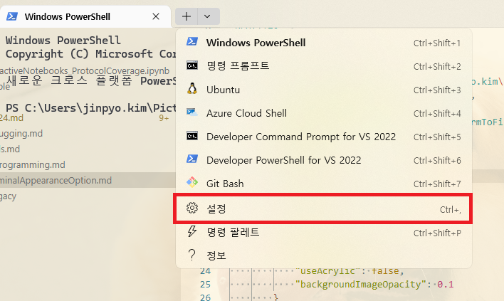
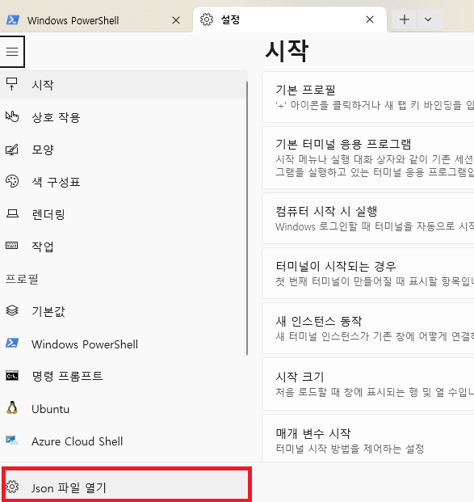

# Windows Terminal Appearance Options

## 가이드 링크

[MSDN window terminal Profile-Appearance](https://learn.microsoft.com/en-us/windows/terminal/customize-settings/profile-appearance)

## 설정 세팅 Json 파일 위치





## json 옵션 세팅 샘플

```json
"profiles": 
{
    "defaults": 
    {
        "backgroundImage": "C:\\Users\\jinpyo.kim\\Pictures\\florencia-potter-yxmNWxi3wCo-unsplash.jpg",
        "backgroundImageAlignment": "bottom",
        "backgroundImageOpacity": 0.35,
        "backgroundImageStretchMode": "uniformToFill",
        "colorScheme": "One Half Light",
        "opacity": 0,
        "font": {
            "face": "Cascadia Mono",
            "size": 12,
            "weight": "normal"
        },
        "padding": "16, 8, 8, 8",
        "useAcrylic": true,
        "unfocusedAppearance": {
            "useAcrylic": false,
            "backgroundImageOpacity": 0.1
        }
    },
}
```
