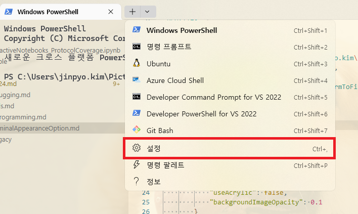
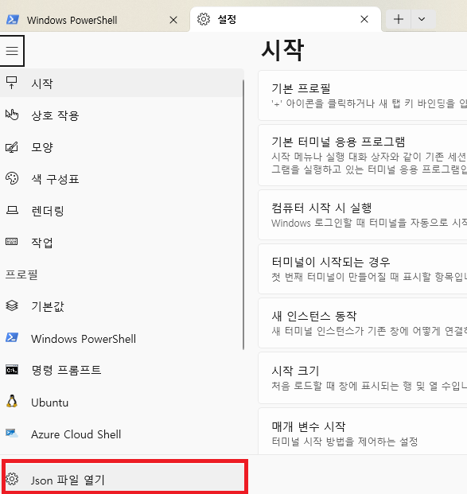

# Windows Terminal 관련 내용들

## 설정 세팅 Json 파일 위치





## Appearance Config

[MSDN window terminal Profile-Appearance](https://learn.microsoft.com/en-us/windows/terminal/customize-settings/profile-appearance)

**json 옵션 세팅 샘플**

```json
"profiles": 
{
    "defaults": 
    {
        "backgroundImage": "C:\\Users\\jinpyo.kim\\Pictures\\florencia-potter-yxmNWxi3wCo-unsplash.jpg",
        "backgroundImageAlignment": "bottom",
        "backgroundImageOpacity": 0.35,
        "backgroundImageStretchMode": "uniformToFill",
        "colorScheme": "One Half Light",
        "opacity": 0,
        "font": {
            "face": "Cascadia Mono",
            "size": 12,
            "weight": "normal"
        },
        "padding": "16, 8, 8, 8",
        "useAcrylic": true,
        "unfocusedAppearance": {
            "useAcrylic": false,
            "backgroundImageOpacity": 0.1
        }
    },
}
```

## Path AutoComplete

[windows 7 - How to autocomplete filename in your path on the command line when in a different directory in windows7 - Super User](https://superuser.com/questions/680731/how-to-autocomplete-filename-in-your-path-on-the-command-line-when-in-a-differen)

Please use this command

```
cmd /f
```

which activates autofill.

Then type in atleast one letter of the file (or) folder name,

Then use Ctrl+F to autofill , if there more than one file (or) folder name which starts with the same letter,Then use Ctrl+F to cycle through the list.

Another choice is to drag and drop the file to cmd window, to get the entire path of the field.

## Panes

[MSDN windows terminal Pane 옵션](https://learn.microsoft.com/en-us/windows/terminal/panes)

    Creating a new pane
    Switching between panes
    Swapping panes
    Moving panes
    Changing split orientation
    Swapping panes (Preview)
    Moving panes (Preview)
    Changing split orientation (Preview)
    Resizing a pane
    Closing a pane
    Zooming a pane
    Marking a pane as read-only
    Customizing panes using key bindings

**split pane**

```json
{ "command": { "action": "splitPane", "split": "vertical" }, "keys": "alt+shift+plus" },
{ "command": { "action": "splitPane", "split": "horizontal" }, "keys": "alt+shift+-" },
{ "command": { "action": "splitPane", "split": "auto" }, "keys": "alt+shift+d" }
```

**switching between pane**

```json
{ "command": { "action": "moveFocus", "direction": "down" }, "keys": "alt+down" },
{ "command": { "action": "moveFocus", "direction": "left" }, "keys": "alt+left" },
{ "command": { "action": "moveFocus", "direction": "right" }, "keys": "alt+right" },
{ "command": { "action": "moveFocus", "direction": "up" }, "keys": "alt+up" },
{ "command": { "action": "moveFocus", "direction": "previous" } },
{ "command": { "action": "moveFocus", "direction": "previousInOrder" } },
{ "command": { "action": "moveFocus", "direction": "nextInOrder" } },
{ "command": { "action": "moveFocus", "direction": "first" } },
{ "command": { "action": "moveFocus", "direction": "parent" } },
{ "command": { "action": "moveFocus", "direction": "child" } }
```

**swaping panes**

```json
{ "command": { "action": "swapPane", "direction": "down" } },
{ "command": { "action": "swapPane", "direction": "left" } },
{ "command": { "action": "swapPane", "direction": "right" } },
{ "command": { "action": "swapPane", "direction": "up" } },
{ "command": { "action": "swapPane", "direction": "previous" } },
{ "command": { "action": "swapPane", "direction": "previousInOrder" } },
{ "command": { "action": "swapPane", "direction": "nextInOrder" } },
{ "command": { "action": "swapPane", "direction": "first" } }
```

**resizing a pane**

```json
{ "command": { "action": "resizePane", "direction": "down" }, "keys": "alt+shift+down" },
{ "command": { "action": "resizePane", "direction": "left" }, "keys": "alt+shift+left" },
{ "command": { "action": "resizePane", "direction": "right" }, "keys": "alt+shift+right" },
{ "command": { "action": "resizePane", "direction": "up" }, "keys": "alt+shift+up" }
````

**Closing a pane**

```json
{ "command": "closePane", "keys": "ctrl+shift+w" }
```