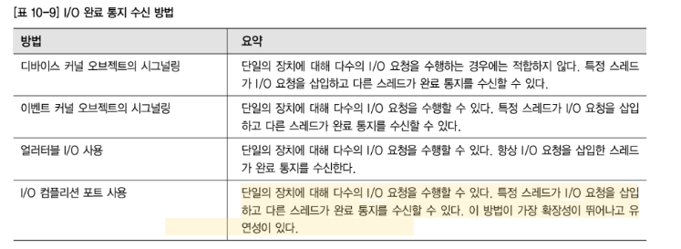
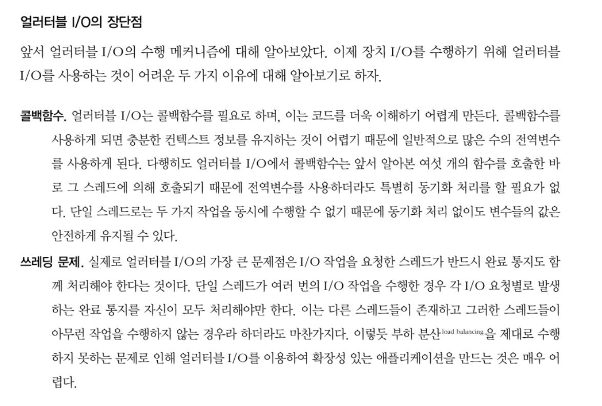
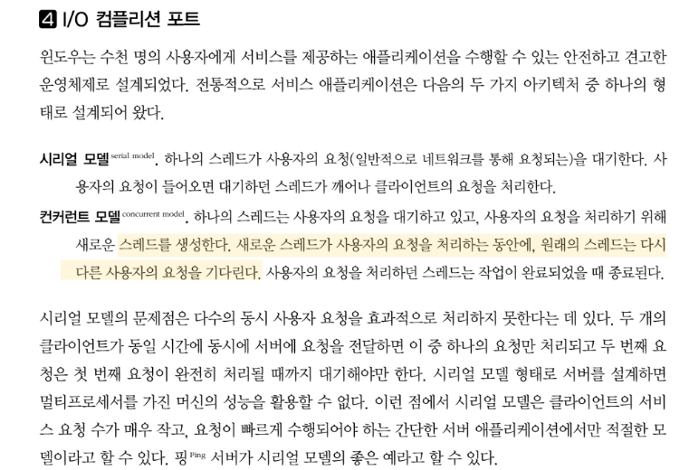
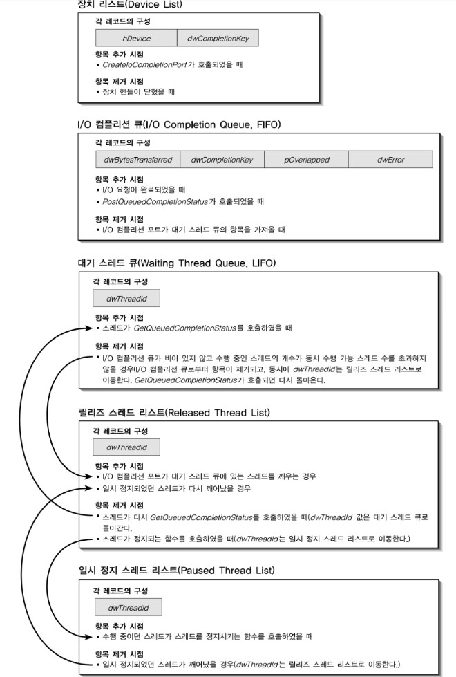

# 제프리 리처의 Windows Via C/C++

## Chapter10 : 동기 및 비동기 장치 I/O

- I/O 요청에 대한 완료 통신의 수신 관련 내용
  - 첫 번째는 동기적으로 I/O 응답이 오기 전까지 스레드를 블록 시키는 방법
    - (동기적 방법)
  - 폴링(polling) 을 활용하는 방법
  - 콜백을 활용하는 방법론 등

- I/O 컴플리션 포트 스레드 모델

- I/O 컴플리션 포트의 내부 동작 방식

