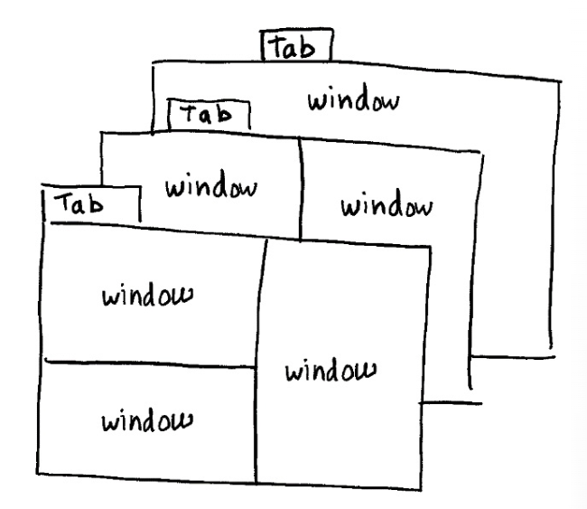

# Mastering Vim, Ruslan Osipov, 2ND Edition

# 1

## A brief history lesson

> Before personal computers and terminals, there were teleprinters. A teleprinter is a mechanical typewriter that can send and receive messages over a telecommunications channel.
>
> As technology progressed, teleprinters were replaced by terminals with screens, which enabled much more robust text editing. Vim’s direct predecessor, **vi**, started its life all the way back in 1976. Unlike its predecessors, **vi** (developed by Bill Joy, the author of ex) included many quality-of-life features and even allowed you to edit multiple lines of text at once – what a luxury!

---

> The first version of Vim was released in **1991** by **Bram Moolenaar**. Now, you’re all caught up!

## About Modal Interface

> Welcome to the modal interface, **where each trigger performs a different action based on context**. 
>
> The most common example of a modal interface that we encounter today is a smartphone. Each time we work in different applications or open different menus, a tap on the screen performs a different function.

- Vim is a modal editor
  - meaning that a single button press might result in different actions.

## A word about swap files

> By default, Vim keeps track of the changes you make to files in swap files. 

- The swap files are created as you edit the files, 
  - and are used to recover the contents of your files in case either Vim, your SSH session, or your machine crashes.

# 2

## Organizing the workspace

> Buffers are the way Vim internally represents files; they allow you to switch between multiple files quickly

- `:ls` : 현재 vim buffer에 존재하는 파일 정보 나열
  - buffer number, 

> Vim refers to buffers by a number and a name, and both are unique within a single session (until you exit Vim). 
>
> To switch to a different buffer, use the `:b` command, followed by the number of the buffer:			

- `:b1`: 1번 버퍼를 현재 에디터에서 연다.
- `:b <string>`: 버퍼의 파일 중 문자열과 부분일치하는 파일명을 찾아서 연다. 일치하는 파일이 두 개 이상이면 오류 발생하고 실패
- `:bn[ext]`: 다음 버퍼로 이동
- `:bp[revious]`: 이전 버퍼로 이동
- `:bd`: 열린 버퍼를 지운다.

## Tabs

> Vim uses tabs to switch between collections of windows, allowing you to effectively have multiple workspaces. Tabs are often used to work on a slightly different problem or set of files within the same Vim sessiono

## Folds

> Folds allow you to hide portions of the file, either based on some predefined rules or manual fold markers.

> All folding commands start with "z".  Hint: the "z" looks like a folded piece of paper, if you look at it from the side.

**CREATE AND DELETING FOLDS**

- `zf{motion}`, `{Visual}zf`: Operator to create a fold.
- `zF` : Create a fold for [count] lines.  Works like "zf".
- `:{range}fo[ld]` : Create a fold for the lines in {range}.  Works like "zf".
- `zd` : Delete one fold at the cursor. Nested folds are moved one level up.
- `zD` : Delete folds recursively at the cursor.
- `zE` : Eliminate all folds in the window.

**OPENING AND CLOSING FOLDS**

- `zo`: Open one fold under the cursor.
- `zO`: Open all folds under the cursor recursively.
- `zc` : Close one fold under the cursor.
- `zC`: Close all folds under the cursor recursively.
- `za` : Summary: Toggle the fold under the cursor.
- `zA`: When on a closed fold: open it recursively. When on an open fold: close it recursively and set `foldenable`.
- `zr`: recude folding.
- `zR`: Open all folds
- `zm`: fold more
- `zM`: Close all folds
- `:{range}foldo[pen][!]`: Open folds in {range}. When [!] is added all folds are opened.
- `:{range}foldc[lose][!]`: Close folds in {range}. When [!] is added all folds are closed.

**MOVING OVER FOLDS**

- `[z`: Move to the start of the current open fold.
- `]z`: Move to the end of the current open fold.
- `zj`: Move downwards to the start of the next fold.
- `zk`: Move upwards to the end of the previous fold.

## Netrw

> Netrw is a built-in file manager in Vim (if we want to get technical, it’s a plugin that ships with Vim). 
>
> It allows you to browse directories and functions, similar to any other file manager you’ve worked with in your favorite OS.

- `:Ex[plore]` : Open file navigation window.
- `:[N]Ex[plore][!]  [dir]`... Explore directory of current file      *:Explore*
- `:[N]Hex[plore][!] [dir]`... Horizontal Split & Explore             *:Hexplore*
- `:[N]Lex[plore][!] [dir]`... Left Explorer Toggle                   *:Lexplore*
- `:[N]Sex[plore][!] [dir]`... Split&Explore current file's directory *:Sexplore*
- `:[N]Vex[plore][!] [dir]`... Vertical   Split & Explore             *:Vexplore*
- `:Tex[plore]       [dir]`... Tab & Explore                          *:Texplore*
- `:Rex[plore]`            ... Return to/from Explorer                *:Rexplore*

## Navigating Text

Vim movement cheatsheet, original representation credited to Ted Naleid.

Insert mode cheatsheet

## Searching across files

- `:grep` uses system grep and is a great tool if you’re already familiar with how grep works				
- `:vimgrep` is a part of Vim and might be easier to use if you are not already familiar with grep

