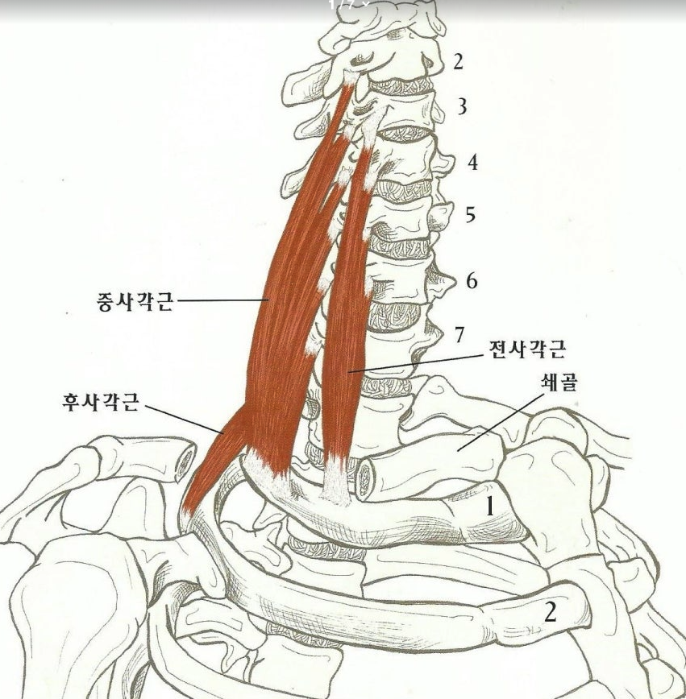
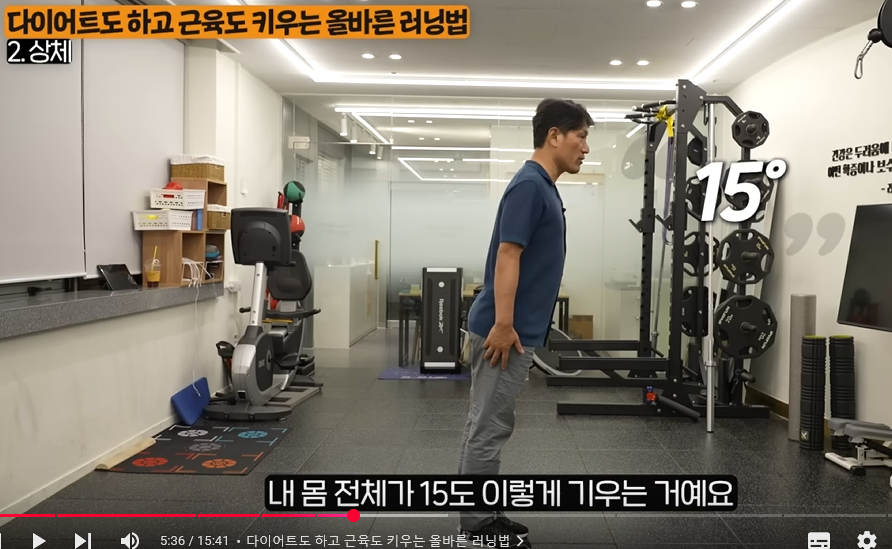

# Health

> 다른 문서들은 가급적 원본 텍스트 내용을 따오는데, 건강 관련 내용은 그러지 않기로 한다.
>
> 텍스트 보다 영상을 계속 반복해서 보는 게 중요함.

## 24.11.04

[(1) 중년 이후 뒤꿈치 들기를 안 하면 너무나도 억울한 '3가지' 이유 (김병곤 박사 2부)](https://www.youtube.com/watch?v=LtW9A1zhjPY&list=WL&index=3)

- 걷기 위해 제일 중요한 근육 : 종아리/ 허벅지 / 엉덩이
  - 종아리 근육 자극하기 위한 뒤꿈치 운동법이 소개됨

[(2) 유독 한국인이 많이 걸리는 최악의 암 '5가지' (김의신 박사 1부)](https://www.youtube.com/watch?v=nXOoiMG4JaQ&list=WL&index=2)

    한국인에게 흔하고 치료하기 힘든 암들이 주로 위장 계통 암.
    식도부터 위, 간, 췌장, 담도 그런데다가 폐암, 또 유방암 근데 유방암은 대부분이 다 호르몬 계통 암이에요

---

    그리고 위장 계통 암은 한국 사람은 특히 여자분들은 위장이 건강한 사람이 있을 수가 없어요.
    왜냐하면 근심 걱정을 너무 맣이 하면 어떤 변화가 있냐면
    몸에서 산을 많이 발생시켜요
    이 알칼리성으로 있을 때 건강한 거야.
    왜? 산이 나오면 병들게 돼 있어요.

    근데 특히 위에서 산을 많이 만들어내
    그 산이 물을 많이 먹어서 씻어서 싹 내려가야 하는데
    이 근심 걱정을 하면 위장이 움직이는 걸 연동운동이라고 해요
    그걸 조종하는 신경이 뇌에서 나오는 열 번째 신경이에요.

    - 미주신경 : 심장과 허파, 위장관계에 대한 부교감 신경과 연결된 감각 섬유를 운반하는 뇌신경 

    이게 마비가 돼서 연동운동이 안돼
    그러니까 먹어도 그냥 그대로 있어, 배에
    이게 그냥 염증이 생기는 거야
    **산이 위를 갈아버리는 거야**

    그리고 원래 산이 십이지장 거쳐서 소장으로 내려가는데 그 중간에 췌장하고 연결된 관이 있다고
    거꾸로 그게 역류가 되는 거야. 역류
    그래서 췌장암이 요새 젊은 한국 사람한테 너무 많이 생겨
    근데 옛날 어른들은 새벽에 일어나서 산에 올라가서 산에서 있는 물을 많이 마셨다고
    그게 건강에 굉장히 좋은 거야

    왜냐하면 그 산이 주로 밤에 왕창 나와
    그럼 아침에 냉수를 먹어서 씻어내면 좋지
    그리고 또 늙으면 위하고 식도하고 그 사이에 역류를 방지하게 괄약근이 있어
    근데 이게 늙어 가면서 힘이 없어져서 다 거꾸로 올라와

    입속까지 이게 부식을 시켜
    그러니까 노인들 보면 혓바닥이 하얗고 여기 다 말라버려
    이 산이 올라오면 좋은 균을 다 죽여버려 거꾸로 밑으로 내려가서도 장 안에 균이 한 200조가 있어
    근데 그중에 반절은 좋은 거고 반절은 나쁜 거야 근데 이 산이 많이 내려가면 장에 좋은 균을 다 죽여버려
    그래서 어떤 일이 벌어지는고 하니 좋은 균이 죽으니까 나쁜 균이 너무 많으니까
    거기서 못 살고 이게 빠져나와서 폐로 가
    그래서 병원에서 죽는 사람은 암 환자든 뭐든 다 폐렴으로 죽어

    이게 암 환자가 암으로 죽는 사람은 드물어요
    전부 다 폐렴으로 죽어
    그 균이 조사해 보면 다 장에서 올라온 거야
    이게 올라올 때 새로운 환경이니까 변형을 해버려
    항생제가 듣는게 없어
    그래서 죽는 거야

    그리고 또 아셔야 할 게 뇌에서도 제일 중요한 세르토닌, 도파민, 이런 것이 우리 기분, 즐거움, 인지능력에 중요한 호르몬인데
    이게 어디서 만들어지냐면 장에서 만들어요. 그러니까 장이 튼튼하지 못한 사람은 절대 건강할 수 없어
    특히나 뇌 건강에

    근데 술을 많이 마시면 뭐가 나쁘냐면 
    그 좋은 균이 다 죽어버려. 그러면 뇌에서 필요한 그런 것들을 훨씬 잘 안 만들어내지

---

    한국 환자의 특징은 우선
    의사 말을 잘 안들어
    층고를 아무리 잘 해도 결국 판단은 자기 판단으로 해
    그게 특징적이야.

    우리가 잘 먹고 마셔야 된다. '네' 하고는 안 해.
    그리고 항암 치료에 제일 중요한 것은 체중을 유지하기 위해서 단백질을 많이 섭취해야 돼
    생선을 위주로 해서 많이 섭취하고 또 달걀, 두부, 김 이런 게 다 단백질이거든
    근데 그렇게 하라고 해도 안 하고

    운동하라고, 특히 운동 운동이 제일 중요한데 
    한국 사람은 암 걸리면 세상 끝으로 생각해, 아무것도 안 하려고 그래
    근데 미국 사람들은 암을 감기처럼 생각해. 왜냐하면 못 고치는 만성병이야, 다
    그러니까 암이 걸리나 감기가 걸리나 똑같아
    그래서 내가 32년 동안에 암 환자나 그 가족이 우는 걸 본 적이 없어
    그리고 하도 안 울기에 내가 물어봤어
    왜 안 우냐 하니까
    반대로 왜 울어야 되냐 이거야

    근데 한국 환자들은 진단할 때부터
    치료가 조금만 안 되면, 옆에 누가 있든 없든 대성통곡을 해, 병원 안에서
    다른 나라 사람들은 안 그래. 유독 한국 사람만
    그리고 또 더 나쁜 것은 한국은 의사들이 항생제를 남용해요. 
    이게 세균성 염증이나 질환에는 항생제가 도움이 되는데
    바이러스, 바이러스에는 항생제, 전혀 도움이 안 돼요.
    근데 대부분 감기, 몸살 이게 다 바이러스야.
    거기다가 항생제를 쓴다는 것은 이건 완전히 잘못된 거거든.
    그런데도 일시적으로 그걸 쓰면 좀 좋아지는 느낌이 있다고
    그러니까 한국은 그게 큰 문제야
    항생제 남용으로 해서 몸이 다 망가져요

---

    암은 만성병 중에 하나야
    고혈압, 당뇨, 감기 뭐 여러 가지 다 못 고치는 병이야
    근데 고혈압, 당뇨 걸린 사람들이 그렇게 억울해하고 분통 터지고 이런 사람 거의 없다고
    근데 유독 암만 걸리면 마치 사형선고 받은 것처럼 땅이 꺼지게 근심 걱정

    그런데 그 생각을 고쳐야 돼 
    암은 다른 병, 특히 치매 이런 거에 비해서 보면 훨씬 좋은 병이에요
    그러니까 '아, 그럼 다행이구나, 치매 걸린 것보다는 낫다' 이런 작은 생각이지만 그렇게도 생각하고

    그 다음에 요새는 연구를 많이 해서 약도 많이 나와 있고
    여러 가지 방법이 있어요.

    단지 하루 이틀로 끝나는 게 아니고 죽을 때까지 해야 하니까
    **환자가 체력만 유지하면 계속 싸울 수가 있어요**

    그 암도 한 두번은 악질적으로 막 퍼지고 달려들고 하는데
    점점 힘이 빠지는 성격도 있어요
    그러니까 치료를 계속할 수 있도록 환자나 가족이 어떻게든지 잘 먹고 마시게 도와줘야 해
    먹고 마시는 것은 정신적으로 마음이 편안해야 먹고 마신다고
    근데 한국 사람들은 암 걸리면 아무도 안 만나려고 그래
    그러니까 혼자서 그렇지 않아도 입맛이 없는데 더 안 먹지
    그러니가 계속 환자한테 가족들은 긍정적인 마음을 심어주고
    같이 먹고 같이 운동하고
    그러면 하기 싫어도 억지로 따라서 한다고
    그리고 더 중요한 것은 항암제, 독한 약들이 뇌세포를 망가뜨려
    그러니까 암 환자는 정상적인 생각을 하기 힘들어요
    마치 늙어서 80 넘으면 대개 어린애처럼 성격이 변해요
    젊은 환자도 그렇게 되니까 그걸 가족이 이해해야 돼
    그래서 그냥 어린애 다루듯이 다뤄야지
    막 혼내가면서 짜증스럽게 먹어라 마셔라 하면 환자가 더 안 마셔요
    그러니까 그런 것을 환자들이 이해해야 돼
    성격이 아니라 뇌가 망가져서 어린애처럼 짜증내고 실증내고 이렇게 한다는 걸 이해해야 돼

[(2) 라면에 밥까지 말아 먹었을 때! 급격하게 오르는 혈당 낮추는 법](https://www.youtube.com/watch?v=c5kvoYuSeDc)

---

의자병 : 오래 앉아 있는 습관이 일으키는 다양한 질환들을 가리키는 용어

하루 3 ~ 4 시간 앉아 있으면 담배 1갑 반을 피운 것

## 25.02.01

[대부분의 상체운동은 하면 안된다는 의사.jpg - 실시간 베스트 갤러리](https://gall.dcinside.com/board/view/?id=dcbest&no=301720)

- [(227) 인간은 '상체 운동'은 안 해도 되게끔 설계됐다? - 달려라병원 7회 최재원 원장 #어깨통증 #어깨재활 #어깨운동 #어깨결림 #어깨재활운동](https://www.youtube.com/watch?v=HS4CPI-Gb94)

- 어깨는 다치기 쉬운 부위
- 하체 운동은 필요함. 하지만 상체 운동은 필수가 아님. 우리 몸은 상체 운동을 꼭 하지 않아도 괜찮도록 설계됨
- 우리 몸의 관절 중, 운동 가능한 방향이 가장 넓고, 운동 범위도 가장 큰 관절은 어깨임
  - 하지만 다재다능한 만큼 불안정한 부위인 것도 사실임.
  - 어깨는 쉽게 다칠 수 있음. 축구 선수가 무릎 부상을 당하는 소식보다 야구 선수가 어깨 부상을 당하는 일이 굉장히 많음
  - 회전 근개, 삼각근, 여러 인대들 굉장히 복잡한 구조로 불안한 어깨를 지탱하고 있음

이런 의견도 있군...

## 25.02.03

[“등푸른 생선 통풍엔 최악” 악마 통증 부르는 뜻밖 음식  중앙일보](https://www.joongang.co.kr/article/25311033)

Q. 통풍은 어떤 병이고 왜 생기는 건가?

    통풍은 요산이 몸 밖으로 빠져나가지 못하고 과도하게 축적돼 생기는 질병이다. 요산은 퓨린(purine)이라는 물질이 체내에서 대사되는 과정에서 나오는 부산물이다. 우리 몸에서 정확히 어떤 일을 하는지는 알려지지 않았다. 우리 몸에 꼭 필요한 물질일 것이라고 추정한다. 요산은 대부분은 소변으로 배출되지만, 농도가 일정 이상 높아지면 결정 형태로 체내에 쌓인다.

    소금이 물에 녹는 원리와 똑같다. 농도가 높아지면 소금이 더 녹지 않고 결정 덩어리로 남고, 물을 넣으면 농도가 낮아져서 결정이 녹아 나오지 않나. 통풍도 혈중 요산 수치가 높은 걸 약이나 다른 방법으로 낮추면 쌓여 있던 결정이 녹아 나와 다시 건강하게 지낼 수 있다.

Q. 통풍이 어떤 병인지 잘 모르는 사람도 통증이 엄청나다는 건 많이 알고 있다. 도대체 어느 정도인지?

    쉽게 표현하자면 의사들끼리는 세상에서 가장 아픈 5개 질환 통증 중 통풍이 들어간다고 말한다.
    (의사 개인마다 의견이 다르지만 산통(출산), 암성 통증, 요로결석 등이 포함된다.)
   
    통풍 발작이 발생하면 몇 시간 만에 꼼짝할 수 없을 만큼 아프게 되고, 무릎이나 발목이 아프면 구급차를 타야 병원에 올 수 있는 상태가 된다. 

Q. 통풍은 한 번 발생하면 평생 약을 먹어야 하나?

    그렇다. 통풍은 원인 자체를 해결해서 근본적으로 치료하는 약이 아직 없다.
    따라서 병이 없어지지 않기 때문에 평생 병원을 오셔야 한다.
    그래도 최근에는 요산 수치를 관리하는 좋은 약이 나와서 꾸준히 약만 잘 먹으면 평생 통풍 발작이나 불편함 없이 지낼 수 있다.

Q. 통풍의 전조 증상이 있나? 어떤 증상이 나타나면 통풍을 의심하고 병원에 가야 하나?

    통풍은 전조 증상이 없다.
    드물게 피부 밑에 요산이 쌓여 덩어리가 만져지고 보이는 분도 있지만, 대부분 어느 날 갑자기 깜짝 놀랄 정도로 통증을 겪게 된다.
    가족력이 있는 분은 “아버지가 겪은 통풍이 나에게도 생겼구나”하고 금방 병원에 방문한다. 
    그렇지 않은 분들은 병원, 특히 류마티스 내과를 찾아가는 데 시간이 걸리는 경우가 종종 있다. 관절 문제라 생각하고 정형외과로 향하기도 한다.

Q. 통풍을 내과에서 진료 받아야 하는 이유는 무엇인가?

    통풍은 단순한 관절 질환이 아니다. 온몸에 요산이 쌓이면서 신장과 혈관도 나빠지고 성인병이 생길 확률을 높인다.
    수술을 주로 하는 정형외과보다 약을 주로 쓰는 내과에서 합병증과 약 부작용을 관리하는 게 좋다.

    특히 요산을 떨어뜨리는 요산저하제를 쓸 땐 신장과 간 기능이 굉장히 중요하다.
    간이 나빠지는 경우가 있기 때문에 약 부작용 관리를 잘해야 한다. 또 신장 기능에 맞춰 약 용량을 정해준다. 내과 의사를 만나서 온몸을 관리한다고 생각해야 한다.

Q. 식습관의 변화와 환자 증가 추세를 언급했는데, 올바른 식습관으로 통풍을 예방할 수 있나?

    비만이 제일 큰 문제고, 두 번째가 음주다. 특히 맥주가 정말 통풍에 안 좋은 음식이다.
    요산저하제를 안 먹으면 어떤 종류의 술을 마시든 요산 수치는 올라간다.
    반대로 요산저하제를 꾸준히 먹어서 요산 수치가 안정적으로 유지되면 사실 고기나 술을 좀 먹어도 수치가 잘 올라가지 않는다.
    문제는 약을 먹는 분 중에 나머지 건강관리에 대한 동기부여가 되지 않아 오히려 식생활에 전혀 관심 없는 분들도 있다.
    그런데 성인병은 피할 수 없다. 시간이 지나 더 큰 문제가 오는, 더 안타까운 결과가 발생한다.

    그래서 통풍 발작을 ‘건강을 꾸준히 관리하라고 내 몸이 신호를 줬구나’라고 받아들이시면 좋겠다.

Q. 요산 수치를 올리는, 통풍에 특히 나쁜 음식을 꼽는다면?

    이 음식만은 피해라 딱 하나만 꼽으면 맥주다. 앞서 치맥을 언급했는데 치킨의 경우 튀긴 것이 문제지 닭고기가 문제는 아니다.
    또 맥주 안주로 치킨을 많이 선호하다 보니 치맥을 꼽은 것이다. 닭고기보다 소고기가 더 통풍에 안 좋다.

    의외인 음식을 꼽자면 등푸른 생선이다.
    고등어, 꽁치, 정어리 같은 생선들. 건강에 좋다고 챙겨 먹는 생선이지만 퓨린이 아주 많이 들어 있어서 통풍 환자에겐 등푸른 생선을 절대 권하지 않는다.
    참치와 멸치도 포함된다. 멸치 육수를 진하게 내려서 맛있게 국수를 말아 드시면 통풍 발작이 올 수 있다.

    안타깝게도 조개류도 통풍에 나쁘다. 또 고기보다 내장류가 더 나쁜 영향을 준다.
    염통, 순대, 간 등이다. 또 10대, 20대의 비만에 큰 영향을 주는 음식이 단맛이 나는 음료들이다.
    탄산음료가 대표적인데 그 안에 과당이라는 물질이 첨가물로 들어 있다. 과당이 요산 수치를 엄청나게 올린다.
    단맛이 나는 스낵이나 음료에는 대부분 과당이 들었다고 생각하면 된다. 과당을 피하면 다이어트에도 많은 도움이 된다.

## 25.02.20

[[헬스조선] 원인 모를 팔 저림 계속된다면… '사각근증후군' 의심 - 박형근원장 > 언론보도 | 국제나은병원](https://www.naeunhospital.com/bbs/board.php?bo_table=hgid46&wr_id=196&sst=wr_hit&sod=desc&sop=and&page=1#:~:text=%EA%B3%A0%EA%B0%9C%EB%A5%BC%20%EC%95%9E%EC%9C%BC%EB%A1%9C%20%EB%82%B4%EB%B0%80%EA%B3%A0%20%ED%84%B1,%ED%95%A0%20%EC%88%98%20%EC%9E%88%EC%96%B4%20%EC%A3%BC%EC%9D%98%ED%95%9C%EB%8B%A4.)

    목디스크의 주요 증상 중 하나가 팔 저림이다. 따라서 팔 저림이 지속되는 사람은 목디스크를 의심하기 쉬운데, 의외로 '사각근증후군' 때문일 수 있다.

    사각근증후군은 목 옆쪽에 있는 '사각근'이라는 근육이 경직되면서 신경을 눌러 팔, 손 저림 현상을 유발하는 것이다. 주요 증상이 팔에 피가 안 통하는 것처럼 저리고 쑤시는 것이다. 이로 인해 저절로 '만세' 자세로 잠을 청하게 되기도 한다. 유방암이나 협심증을 의심할 정도의 가슴 통증, 가슴 뻐근함이 생기기도 한다. 드물게는 혈관까지 눌려 손과 팔이 차고 약해지는 경우도 있다.

    안양국제나은병원 박형근 원장은 "사각근이 뭉쳐 신경이 지나는 통로가 좁아지는 것이 직접적인 원인"이라며 "컴퓨터나 스마트폰을 쓰면서 구부정한 자세를 유지하다 보면 목 앞쪽 근육이 뭉치고 어깨 근육이 약해져 이런 증상이 잦아질 수 있다"고 말했다. 이어 박 원장은 "목디스크와 다른 점은 목 통증은 심하지 않은 반면 팔 저림과 가슴 부위, 날개뼈 주위 통증이 심하다는 것"이라고 말했다.

    사각근증후군을 예방하려면 평소 바른 자세를 유지하는 게 중요하다. 고개를 앞으로 내밀고 턱은 드는, 흡사 '거북목' 자세가 가장 좋지 않다. 반대로 턱은 목 쪽으로 집어넣고 눈은 수평을 유지하면서 머리 전체는 세우는 자세를 취해야 한다. 밤에 잘 때 엎드리는 자세는 피하고 옆으로 자는 것도 목뼈를 휘게 할 수 있어 주의한다.

---

[사각근 통증, 잠 잘때 이렇게 자면 매우 안좋습니다 : 네이버 블로그](https://m.blog.naver.com/pbj93tkd/222176146768)

팔을 위로 올리고 자는 자세는 사각근을 짧아지게 한다.

## 25.02.27

[(335) 굳은 허리 시원하게 풀린다. 아침 눈뜨마자마 5분 스트레칭 방법 (김병곤 박사 1부) - YouTube](https://www.youtube.com/watch?v=2qvsFRiRLiA&list=WL&index=2)

- 눈 뜨자마자 누워서 하는 스트레칭이 중요한 이유

    사람이 잠에서 완전하게 깨는 데 걸리는 시간이 두 세 시간 걸린다 하는데
    아침 스트레칭을 하면 이 시간을 땡길 수 있다고 함

    자는 동안 누워 있는 상태에서는 혈액순환이 정체되게 되어 있다. 그래서 몸이 다소 붓기도 함
    스트레칭을 해두면 뇌에 혈액순환이 되면서 혈류 공급이 원활해지면서 좀 더 맑은 정신에서 하루를 시작할 수 있겠다.

    그 다음 자면서 뻣뻣해졌던 근육이나 관절들을 부드럽게 해줄 수 있기도 함.

- 쌓인 피로 마법처럼 없애주는 아침 10분 스트레칭
- 누워서 허리디스크 예방하는 초간단 스트레칭 방법
- 뻐근한 어깨 통증 싹 사라지게 만드는 기적의 스트레칭

- 다리에 통증이 있는 사람도 따라하는 하체 스트레칭
- 불면증 환자도 10만에 잠들게 하는 초간단 호흡법

---

[(335) 내장 지방 쥐어짠다. 1달 동안 '러닝'만 했더니 생긴 놀라운 일 (김병곤 박사 3부) - YouTube](https://www.youtube.com/watch?v=mLsTGSJOWCM&list=WL&index=7)o

    자기 최대 심박수의 70% 까지 올라가면 자기 심장하고 폐, 그리고 뇌까지 건강해짐

    걷기로는 심박수를 올리기 어려우니, 런닝이 우리 삶에 있어서 굉장히 중요하다고 볼 수 있음.

    심장/폐/뇌를 먹여살리는 것은 '뛰는 것' 빼고는 존재하지 않음.

**“이것만 확인하세요” 90%가 몸 망치는 잘못된 러닝자세**

- 뒷꿈치가 바닥에 닫는 것
  - 뒷꿈치는 브레이크 용이라고 생각해야 함. 런닝 도중에는 멈추는 동작이 없기도 하거니와,
  - 뒷꿈치가 먼저 닫으면 충격이 무릎으로 감.
  - 뒤꿈치로 달리는 사람을 보면 대체적으로 허벅지는 발달했지만, 종아리가 약하다. 왜냐하면 종아리를 쓰지 않기 때문

- 하나 알 수 있는 건 뛰고 난 후 발목 관절, 무릎 관절, 허리가 아프다?? 잘 못 뛴 것임
- 종아리가 뻐근하다?? 허벅지가 뻐근하다?? 엉덩이가 뻐근하다?? 잘 뛴 것임

운동을 하고 난 뒤 어디에 알이 뱄는지 보면 알 수 있다.

**다이어트도 하고 근육도 키우는 올바른 러닝법**

- 달리면서 발을 디딜 때, 발의 볼 가운데에서 착지해서 발가락으로 이동-> 그러면 이 종아리에 계속해서 힘이 들어옴
- 우리 하체 중에서 지구력이 가장 강한 관절이 종아리, 허벅지 힘만으로는 힘들다

- 몸을 숙이라는게 상체만 앞으로 숙이라는 말이 아님. 몸 전체가 앞으로 15도 기울어진다고 생각하면 된다.

- 건강을 위한 러닝은 주 3회 30분이면 충분하다. 걷는 시간을 섞어가면서 해도 좋다.

## 25.03.13

**간병파산**

[한 달에 수백만원…현실이 된 ‘간병 파산’ - 헬스경향](https://www.k-health.com/news/articleView.html?idxno=65598)

[월 450만원 간병비에 허리 휜다…'간병지옥' 해결, 재정이 관건  연합뉴스](https://www.yna.co.kr/view/AKR20231220067400530)

- 2024년 뉴스 기사 기준 간병인 비용 '일 15만원' 도 어려워. 월 450만 / 연 5,400만원

    (서울=연합뉴스) 김잔디 기자 = "어머니께서 노환으로 입원했는데 간병비가 엄청나네요. 하루 15만원 수당을 줘도 좋은 간병인을 구하기 힘듭니다. 월 450만원을 주고도 눈치를 봐야 하니 환자 가족은 정말 '봉'이라는 생각이 듭니다"

    이때 간병비는 '부르는 게 값'이라고 환자와 보호자들은 한숨을 쉰다.

    식대를 별도로 청구하는 건 기본이고, 환자의 덩치가 크다며 웃돈을 요구하는 경우도 많다. 하루 평균 일당은 13∼15만원으로, 한 달이면 400만원을 훌쩍 넘어 일반인들이 감당하기 힘든 수준이다.

    상황이 이렇다 보니 아예 직장을 그만두고 간병에만 매달리는 보호자도 있다. 한 달에 400만원이 넘는 돈을 간병비로 쓰느니 직접 병구완을 하겠다는 것이다.

    간병비를 아끼려고 가족들이 번갈아 가면서 간병과 일을 병행하다가 도리어 병을 얻었다는 보호자도 적지 않다.

[“어머니 간병인 쓰느라 파산 신청”…간병지옥 탈출, 문제는 돈이다 심윤희칼럼 - 매일경제](https://www.mk.co.kr/news/columnists/10939605)

    몇 해 전 영화 ‘아무르(Amour)’를 보다가 큰 충격을 받았다. 아무르는 프랑스어로 ‘사랑’이라는 뜻이지만 영화는 노년의 질병과 간병, 죽음에 대한 이야기였기 때문이다. 반신불수에 치매에 걸린 아내를 헌신적으로 돌보던 남편은 서서히 지쳐간다. 결국 아내를 베개로 눌러 질식시킨다. 선량한 사람들도 오랜 간병 끝에 살인에 이르게 된다는 비극적인 설정. 숙연해지는 사랑의 끝이다.

    간병 살인은 단지 영화 속에 등장하는 에피소드가 아니다. 이미 우리 사회에서 자주 벌어지고 있는 일이다. 특히 부모님이 고령인 5060세대에게 간병은 남의 얘기일 수 없다. 누군가 요양원과 요양병원의 차이가 의사의 상주, 간병비 부담 여부에 있다는 것을 알고 있다면 가족 중 중증 환자가 있을 가능성이 높다. 집안에 돌봐야 할 환자가 생기는 것은 ‘재난’이다. 허둥지둥하다가 깨닫게 되는 것은 가족끼리 알아서 하는 것 외엔 방도가 없다는 것. 누가 돌볼지, 간병비를 어떻게 분담할지를 놓고 형제들끼리 갈등을 겪는 게 다반사다. 간병비는 상상 초월이다. 하루 12만~15만원 수준으로 한 달에 400만원이 훌쩍 넘는다. 요양원은 장기요양보험 적용을 받아 간병비 100%를 국가가 지원하지만 건강보험 적용을 받는 요양병원은 전액 보호자가 부담해야 한다. 돈과의 전쟁이다. ‘간병 파산’에 이르는 이들이 적지 않은 이유다.

    윤석열 대통령이 대선 후보 시절부터 “간병 걱정 없는 나라를 만들겠다”고 공약한 것도 이런 현실을 반영한 것으로 볼 수 있다. 정부는 지난해 12월 ‘국민 간병 부담 경감 방안’을 발표했다. 간호사가 직접 돌보는 간호·간병 통합 서비스를 확대하고, 요양병원 간병비를 국가가 지원하는 방안도 포함됐다. 올해 7월부터 시범사업을 거쳐 2027년 본격 시행하겠다는 것이다.

    너도나도 다 늙고 병든다. 작가 필립 로스는 소설 ‘에브리맨’에서 “노년은 전투가 아니다. 대학살이다”라고 육체적 고통을 표현했다. 닥쳐 올 ‘간병 쓰나미’를 고려하면 정부와 정치권이 총선을 앞두고 ‘아니면 말고’ 식으로 던질 문제가 아니다. 재원 조달 대책뿐 아니라 경증 환자의 요양병원 입원 증가 등 도덕적 해이를 걸러낼 정교한 방안을 마련해야 한다. 서두르지 않으면 ‘간병 디스토피아’는 바로 현실이 된다.

[月 400만원 시대, 간병 파산 벗어나려면 보험 특장점 꼼꼼히 따져야 - 조선비즈](https://biz.chosun.com/stock/finance/2024/04/03/KKKAUU5X65F6JLWVY5EBNWRZRY/)

    3일 한국은행 보고서에 따르면, 지난해 월평균 간병비는 370만원으로 2016년보다 50% 증가했다. 간병인 고용 비용은 하루에 12만~15만원으로 알려졌다. 간병 서비스를 매일 이용하면 매달 400만원의 비용이 드는 셈이다. 간병 지옥과 간병 파산이라는 신조어까지 등장하자 윤석열 대통령은 지난해 12월 “관계부처와 함께 조속한 대책을 마련해달라”고 지시한 바 있다.

    다만 전문가들은 ‘간병인 지원일당’과 ‘간병인 사용일당’의 차이점을 이해한 뒤 상품에 가입해야 한다고 말한다. 지원일당은 보험사가 연계된 간병인을 고객에게 보내주는 상품이다. 48시간 이전에 보험사에 요청하면 보험사가 보내준 간병인으로부터 서비스를 받는 방식이다. 고객이 별도로 간병인을 고용하지 않아도 되지만, 외부 간병인을 사용할 수 없는 병원에 입원한 경우에는 서비스가 제한될 수 있다.

    반면 사용일당은 고객이 직접 간병인을 고용해 비용을 지불한 뒤 보험사에 보험금을 청구하는 상품이다. 간병인 고용과 보험금 청구 등 절차가 다소 번거롭다는 게 단점이다. 하지만 고객이 원하는 질 좋은 서비스를 제공하는 간병인을 고용할 수 있다.

    추가로 고려해야 할 것은 갱신형 여부다. 간병보험은 통상 3년마다 계약을 갱신해야 한다. 지원일당의 경우 갱신형 상품밖에 없다. 당장은 보험료가 저렴하지만, 시간이 지날수록 인건비가 오르기 때문에 갱신할 때마다 보험료도 같이 상승할 가능성이 크다. 반면 사용일당은 비갱신형도 선택할 수 있다. 보험료가 상대적으로 비싸지만, 물가상승률 등을 고려하면 시간이 지날수록 이득이 될 수 있다.

    간병비 보험 외 다른 선택지도 있다. 암·치매 등 종합보험에 가입할 때 간병비 관련 특약을 선택하는 방식이다. 가령 치매보험에 가입하면 치매 관련 진단비와 간병비 지원을 모두 보장받도록 설계하는 것이다. 만일 이 같은 보험에 이미 가입돼 있다면 간병보험에 추가로 가입할 것인지 고민해야 한다.

---

[두 눈에 주삿바늘 꽂는 공포…그날 난, 끔찍한 행동 했다  중앙일보](https://www.joongang.co.kr/article/25313172?div=C&emailReceiveId=fid_D_22758821622042311490166863_7022568240175757649&sendSeq=16971)

**황반변성**

    황반은 반지름 1.5㎜가량의 망막 중심부다. 안구 내 신경층에서 가장 중요한 역할을 수행한다. 황반에는 빛을 느낄 수 있는 광수용체가 밀집돼 있어서 시력의 대부분을 담당한다.

    황반변성은 황반이 변성되는 질환이다. 빛을 감지하는 기능을 잃게 된다는 의미다. 가장 많은 원인은 ‘고령’이다. 나이가 들수록 발생 확률이 증가하는데, 일반적으로 50세를 고령의 기준으로 본다.

    황반변성의 초기 증상은 사물이 구부러져 보이는 변형시를 들 수 있다. 시야의 중앙 부위가 상대적으로 어둡게 보이거나, 전혀 보이지 않는 ‘중심암점’ 증상도 있다. 이런 증상은 다른 눈을 가리고 한 눈씩 검사를 해야 발견할 수 있다. 한쪽 눈이 기능을 제대로 하지 않더라도 나머지 한쪽 눈이 대응하기 때문에, 양쪽 눈을 다 뜬 상태에서는 자각하지 못하기도 한다. 

    노화로 인한 초기 황반변성은 대부분 자각 증상이 없다. 그러나 말기 단계까지 진행하면 시력에 심각한 손상이 일어난다.

    황반변성은 습식(급성)과 건식(만성)으로 나뉜다. 대부분 환자는 혈관이 말라붙는 건식이다. 초기 건식 황반변성은 적어도 1년에 한 번 안과에서 안저 검사를 받으며 진행 상황을 확인해야 한다. 중기 이후엔 진행 시기를 늦추는 걸 목표로 치료한다.

    건식이 습식으로 악화하는 경우도 있다. 황반변성의 약 10%를 차지하는 습식은 망막 아래에 맥락막 신생혈관이 자라는 경우다. 신생혈관은 약하고 터지기 쉬워 황반부에 삼출물, 출혈 등을 일으켜 중심시력을 떨어뜨리고 실명을 초래한다.

    습식 황반변성이 시작되었다면 시력 보존을 위한 적극적인 치료가 필요하다. 최근 가장 각광받는 치료는 항혈관내피세포성장인자 항체를 눈 속으로 주사하는 치료다.

    황반변성이 완치가 어려운 안과 질환임은 분명하다. 하지만 다른 질병들과 마찬가지로 조기에 발견하면 조금이나마 위험인자를 줄일 수 있고, 발병 이후라도 잘 관리하면 시력 저하 속도를 최대한 늦출 수 있다.

    황반변성을 예방하려면 정기적인 안저 검사를 통해 황반부 이상을 초기에 발견하는 게 중요하다. 일단 시력이 떨어지는 경우 반드시 안과 진료 후 필요하다면 망막 검사를 받아보는 것이 좋다.

## 25.03.15

[(481) 아프지 않고 오래 살려면 딱 '이 3가지'만 기억하세요. (김주환 교수 3부)](https://www.youtube.com/watch?v=78mmuHwxwt0&t=24s)

1. 잠

- 우리가 살아있는 기본 상태(default 상태)는 '깨어있는 상태'가 아닌 '잠자는 상태'이다.
- 자다가 계속 자면 배고프니까, 깨어나서 사냥도 하고 밥도 먹고 하는 것이라고 생각해야 한다.
- 4시간만 자도 괜찮다는 말은 개소리다. 7~8시간은 자야 한다.
  - 4시간 자도 괜찮다던 사람들 다 치매 걸린다. 영국 대처 수상이나 미국 레이건 대통령 다 치매 걸림.
  - 수면부족은 면역력 저하로 이어짐. + 암 유발 + 사망원인 1위인 심혈관 질환 위험 증가
  - 미국의 경우 서머타임을 시행하면서 일과 시간을 1시간 씩 땡길 때, 심장마비 발병률이 24% 증가한다는 이야기가 있다. 잠은 1시간 못자는 것이 원인이라더라.
  - 반대로 서머타임을 해제하면서 일과 시간이 1시간 늦춰질 때 심장마비 발병률이 21% 줄어든다고 한다.
  - 잠을 설치면 지방 세포가 많이 쌓인다. 잠 충분히 자야 다이어트가 된다고 한다.
- 잠 자는 것 = 게으르다 <- 이 마인드를 바꿔야 합니다.
  - **성실하고 부지런하게 살아야 잠을 7~8 시간 충분히 잘 수 있다.**
  - 잠을 충분히 자고 싶으면 낮에 쓸데없는 짓 하지 말고, tv나 게임하면서 허송세월하지 말고 수면시간을 깎는 것은 손해다.

2. 먹는 것

- 그냥 일단 혈당 스파이크 조심해라.
- 자기 6시간 전, 최소 4시간 전에 식사를 마쳐라.
  - 마찬가지로 일어나서 1 ~ 2시간을 식사하지 않는게 좋다.
  - '아침은 꼭 먹어라' 이 말은 20세기 들어와서 공장노동자들이 9시에 출근해서 일 시키던 시절에 등장한 말이다. (공장 노동자, 사무직 노동자) 그 시절에 토스트가 생기고 잼이 생겼다.
- 하루에 17시간 공복 상태를 유지하는 게 건강한 것. 우리 몸이 12시간 이상 공복상태일 때 세포 자가 포식 현상 (autophagy) 이 발생함. 우리 몸이 에너지원을 확보하기 위해 내 몸 세포를 분해해서 에너지로 만드는 것. 이때 낡은 세포 노화된 세포를 먼저 잡아먹디 때문에 몸 청소를 하는 것과 같은 현상이 일어남.

3. 운동

- **미트콘드리아**(에너지를 만드는 세포내 소기관)의 역할이 중요함.

- 교수님이 '존투 트레이닝'을 소개하심.
  - 젖산 역치를 유지하는 운동(젖산은 통증을 완화시키려고 분비되는 물질)
  - 젖산은 내가 사용하는 산소량이, 들이마시는 산소량보다 많아질 때 즉 산소량이 부족할 때 분비된다.
  - 존투 트레이닝은 산소 공급량과 소비량을 적절히 맞추는 선에서 유지하는 것. 그렇지만 젖산 역치 측정은 전문적인 방법으로 해야 해서 아직 어려움. 심박수를 측정해서 대강이나마 맞춰볼 순 있음.
