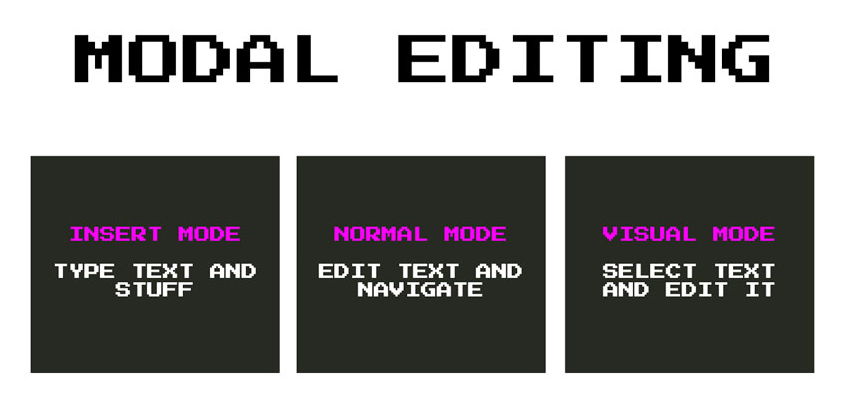
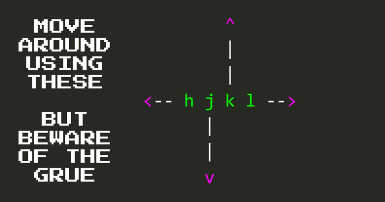

# Learn Vim

**Modes in Vim**





**Word(W)**

- w (word) : jump to the beginning of the next word
- b (back) : jump to the beginning of a word backwards
- e (end) : jump to the end of a word
- ge : jump to the end of a word backwards

**Insert 모드에서 사용할 수 있는 주요 동작**

1. **문자 삭제**
   - **백스페이스**: `Backspace` 키를 사용하여 커서 앞의 문자를 삭제합니다.
   - **Ctrl + w**: 커서 앞의 단어를 삭제합니다.
   - **Ctrl + u**: 커서 앞의 전체 라인을 삭제합니다.

2. **텍스트 입력과 관련된 기능**
   - **Esc**: Insert 모드를 종료하고 Normal 모드로 돌아갑니다.
   - **Ctrl + o**: Insert 모드를 유지하면서 Normal 모드의 단일 명령을 실행할 수 있게 해줍니다. 예를 들어, `Ctrl + o`를 누른 후 `w`를 입력하면 다음 단어로 이동합니다. 명령이 끝나면 Insert 모드로 자동 복귀합니다.

3. **자동 완성**
   - **Ctrl + n**: 단어 자동 완성 기능을 사용하여 다음 후보를 제시합니다.
   - **Ctrl + p**: 단어 자동 완성 기능을 사용하여 이전 후보를 제시합니다.

4. **현재 라인 복사**
   - **Ctrl + y**: 현재 라인의 한 줄 위에 있는 텍스트를 현재 커서 위치에 복사합니다.

5. **삽입된 텍스트 취소**
   - **Ctrl + u**: 커서 위치에서 현재 라인의 앞쪽 텍스트를 모두 삭제합니다.

6. **계산기**
  - **Ctrl-r 누른 뒤 =** : Insert 모드에서 계산기 사용

**현재 라인에서 키워드 교체**

현재 라인에서 특정 키워드를 다른 키워드로 교체하려면 다음 명령을 사용할 수 있습니다.

    :s/old_keyword/new_keyword/g

- `:s`: substitute 명령어.
- `old_keyword`: 변경할 키워드.
- `new_keyword`: 새로 바꿀 키워드.
- `g`: 해당 라인에서 일치하는 모든 키워드를 변경 (없으면 첫 번째 키워드만 변경).

**특정 범위에서 키워드 교체**

일정 범위의 라인에서 키워드를 교체하려면 다음과 같이 할 수 있습니다.

    :10,20s/old_keyword/new_keyword/g

- `10,20`: 10번 라인부터 20번 라인까지.

**파일 전체에서 키워드 교체**

파일 전체에서 키워드를 일괄 교체하려면 다음 명령어를 사용할 수 있습니다.

    :%s/old_keyword/new_keyword/g

- `%`: 파일 전체.

**특정 문자열을 포함한 라인 제거**

- `:g/특정문자열/d`
- `:g/^$/d`: 공백 라인만 찾아서 제거
- `:1,n g/특정문자열/d` : 특정 라인 범위에서 찾기

**임시버퍼 열기**

- `:enew`

**파일 열면서 명령 실행**

파일을 열면서 set number 명령 실행

`vim +':set number' 파일이름`\
or
`vim +set\ number path/to/file`

**라인 번호로 이동하기**

- :숫자를 입력한 후 Enter를 누르면 해당 라인으로 이동합니다.
- 예: `:25`를 입력하면 25번째 라인으로 이동합니다.
- 숫자를 입력한 후 G를 사용
- 예: `25G`를 입력하면 25번째 라인으로 이동합니다.

**클립보드에 파일 복사**

- `"+y` : 클립보드에 복사
- `"+p` : 클립보드에서 붙여넣기
- `"+yy` : 클립보드에 라인 전체 복사
- `ggvG"+y` : 전체파일 클립보드에 복사

**정렬**

- `==`: 라인 정렬

**Macro**

[Practical Vim 팁 요약 시리즈 - Macros !--- @n0lb00's Blog--](https://nolboo.kim/blog/2017/02/10/practical-vim/)

- `qa`: 매크로 기록 시작, 레지스터 a 에 저장된다. (참고: `:reg a`)
  - `qA` : `qa` 명령으로 매크로 기록 반복 시, 기존 레지스터에 덮어쓰지만 `qA` 의 경우 기존 애'
- `q` : 매크로 기록 종료
- `@{register}` : 특정 레지스터의 내용을 실행(`:h @`), 예를 들어 `@a` 으로 a 레지스터의 기록된 매크로 실행 가능
  - 반복 실행은 `10@a` 같은 명령어로 수행 가능

## neovim

### Neovim 파일 경로 정보

#### 1. ShaDa 파일 경로
- **Windows**:  
  `C:\Users\<사용자 이름>\AppData\Local\nvim-data\shada\main.shada`
- **macOS**:  
  `~/.local/share/nvim/shada/main.shada`

#### 2. Neovim 설정 파일(`init.vim`) 경로
- **Windows**:  
  `C:\Users\<사용자 이름>\AppData\Local\nvim\init.vim`
- **macOS**:  
  `~/.config/nvim/init.vim`

#### 키맵핑 충돌 확인 방법 (key map collision check)

> 설정한 키맵핑이 다른 플러그인이나 기존 설정과 충돌하지 않는지 확인하려면 :verbose map 명령어를 사용하여 현재 사용 중인 모든 키맵핑을 확인할 수 있습니다.
- `:verbose map <A-j>`

- `:verbose map <A-k>`

## Commands

| 명령어         | 의미 (Stands for)             | 설명                            | 예시                                        |
| -------------- | ----------------------------- | ------------------------------- | --------------------------------            |
| `:g`           | Global                        | 패턴에 매칭되는 라인 처리       | `:g/error/d` → 'error' 삭제                 |
| `:v`           | InVerse (반대의 Global)       | 패턴에 매칭되지 않는 라인 처리  | `:v/error/d` → 'error' 제외 삭제, `:v/error | \warn/d` -> 여러 키워드 지정 가능 |
| `:s`           | Substitute                    | 문자열 대체                     | `:%s/foo/bar/g`                             |
| `:d`           | Delete                        | 라인 삭제                       | `:3,5d` → 3~5라인 삭제                      |
| `:t` / `:co`   | Transfer / Copy               | 라인 복사                       | `:3t$` → 3번 라인 복사                      |
| `:m`           | Move                          | 라인 이동                       | `:3m$` → 3번 라인 이동                      |
| `:!`           | Shell Command                 | 외부 명령 실행                  | `:!ls`                                      |
| `:r`           | Read                          | 파일/명령 결과 읽어오기         | `:r other.txt`                              |
| `:normal`      | Normal Mode                   | 노멀 모드 명령 실행             | `:g/error/normal dd`                        |
| `:join`        | Join                          | 라인 합치기                     | `:3,5join`                                  |
| `:>` / `:<`    | Indent Right / Indent Left    | 들여쓰기 증가/감소              | `:%>`                                       |

- grep 명령어 응용 예시
  - `g/keyword1/ | v/keyword2/ normal echo`

---

| **표현식**          | **설명**                            | **예시**                              |
| ------------------- | ----------------------------------- | ------------------------------------- |
| `expand('%')`       | 현재 파일 이름 (상대 경로)          | `test.txt`                            |
| `expand('%:p')`     | 현재 파일의 절대 경로               | `/home/user/project/test.txt`         |
| `expand('%:t')`     | 파일 이름만 (경로 제외)             | `test.txt`                            |
| `expand('%:h')`     | 현재 파일의 디렉토리 경로           | `/home/user/project`                  |
| `expand('<cfile>')` | 커서 아래에 있는 파일 경로          | `./myfile.txt`                        |

---

| **명령어**                 | **설명**                                                | **예시**                                                      |
| -------------------------- | ------------------------------------------------------- | ----------------------------------------------------          |
| `line('w0')`               | 현재 커서의 위치를 라인 번호로 반환.                    | `line('.')` → 현재 커서가 위치한 라인 번호를 반환.            |
| `line('w0')`               | 윈도우의 첫 번째 행 번호를 반환.                        | `line('w0')` → 창의 첫 번째 행 번호 반환.                     |
| `line('$')`                | 파일의 마지막 라인 번호를 반환.                         | `line('$')` → 파일의 마지막 라인 번호 반환.                   |
| `line('w$')`               | 윈도우의 마지막 행 번호를 반환.                         | `line('w$')` → 창의 마지막 행 번호 반환.                      |
| `line('0')`                | 첫 번째 라인 번호를 반환.                               | `line('0')` → 1번 라인 번호 반환 (0은 첫 번째 줄을 의미).     |
| `line('v')`                | 비주얼 모드에서 선택된 영역의 시작 라인 번호를 반환.    | `line('v')` → 비주얼 영역의 시작 라인 번호 반환.              |
| `line('v$')`               | 비주얼 모드에서 선택된 영역의 끝 라인 번호를 반환.      | `line('v$')` → 비주얼 영역의 끝 라인 번호 반환.               |
| `line('w')`                | 현재 윈도우의 첫 번째 라인 번호를 반환.                 | `line('w')` → 현재 창에서 첫 번째 라인 번호 반환.             |
| `line('.')`                | 현재 커서 위치의 라인 번호를 반환.                      | `line('.')` → 현재 커서가 위치한 라인 번호 반환.              |
| `line('cursor')`           | 커서가 위치한 라인 번호 반환 (일반적으로 동일).         | `line('cursor')` → 커서가 있는 라인 번호 반환.                |
| `line('search')`           | 특정 텍스트 패턴을 찾은 라인 번호 반환.                 | `line('/pattern')` → 해당 패턴이 있는 첫 번째 라인 번호 반환. |
| `line('n')`                | `n`번 째 라인 번호를 반환.                              | `line(5)` → 5번째 라인 번호 반환.                             |

---

- **Neovim의 명령줄(Command-line)에서 사용할 수 있는 단축키**

| **단축키**  | **설명**                                                  |
| <C-b>       | 커서를 줄의 시작으로 이동.                                |
| <C-e>       | 커서를 줄의 끝으로 이동.                                  |
| <C-h>       | 백스페이스, 이전 문자 삭제.                               |
| <C-w>       | 이전 단어 삭제.                                           |
| <C-u>       | 커서 왼쪽의 모든 텍스트 삭제.                             |
| <C-a>       | 현재 명령줄의 내용을 커맨드 기록(history)에서 불러오기.   |
| <C-r>       | 레지스터 내용을 삽입. (예: <C-r>0는 0 레지스터 내용 삽입) |
| <C-d>       | 명령어 자동 완성 후보를 표시.                             | 
| <C-n>       | 다음 자동 완성 후보로 이동.                               |
| <C-p>       | 이전 자동 완성 후보로 이동.                               |
| <C-f>       | 명령줄 편집 모드를 창으로 열기 (cmdwin).                  |
| <Esc>       | 명령 입력 취소.                                           |
| <Tab>       | 명령어, 파일 이름 등 자동 완성.                           |
| <Shift-Tab> | 자동 완성에서 이전 후보로 이동.                           |

**Normal**

Neovim의 `normal` 명령어는 **Ex 모드(`:`)에서 일반 모드(Normal Mode)의 키 입력을 실행**하는 기능을 한다.

- `:normal {keys}`
- `{keys}` → 일반 모드에서 실행할 키 입력

| 명령어  | 설명                                       |
| normal  | 사용자 매핑이 적용된 상태에서 키 입력 실행 |
| normal! | 사용자 매핑을 무시하고 기본 동작을 실행    |

**Highlight**

# Neovim 하이라이트 명령어 정리

| 명령어               | 기능 설명                                                                                          |
| -------------------- | ------------------------------------------------------------------------------------------------   |
| `:syntax enable`     | 문법 강조 기능을 활성화합니다. 기본적인 컬러 스킴을 유지하면서 문법 강조를 활성화합니다.           |
| `:syntax on`         | 문법 강조를 강제 활성화합니다. 컬러 스킴을 무시하고 문법 강조를 적용합니다.                        |
| `:syntax off`        | 문법 강조를 비활성화합니다.                                                                        |
| `:syntax list`       | 현재 적용된 모든 문법 강조 그룹을 출력합니다.                                                      |
| `:syntax clear`      | 모든 문법 강조 설정을 제거합니다.                                                                  |
| `:syntax keyword`    | 특정 키워드를 하이라이트하는 문법 그룹을 정의합니다. 예: `:syntax keyword MyGroup TODO FIXME NOTE` |
| `:syntax match`      | 정규식을 사용하여 특정 패턴을 하이라이트합니다. 예: `:syntax match MyGroup /ERROR/`                |
| `:highlight`         | 문법 그룹에 스타일을 적용합니다. 예: `:highlight MyGroup ctermfg=red guifg=red ctermbg=yellow`     |

## 설명

- `:syntax enable`과 `:syntax on`은 문법 강조를 활성화하지만, `:syntax on`은 컬러 스킴을 무시하고 강제로 문법 강조를 적용합니다.
- `:syntax list`는 현재 활성화된 문법 그룹을 확인하는 데 유용하며, `:syntax clear`로 모든 강조 설정을 제거할 수 있습니다.
- `:syntax keyword`와 `:syntax match`는 특정 단어나 패턴을 하이라이트하는 데 사용되며, `:highlight` 명령어를 통해 하이라이트된 단어에 스타일을 적용할 수 있습니다.
- ctermfg, guifg : 글자 색상 변경 (터미널/GUI)
- ctermbg, guibg : 배경 색상 변경 (터미널/GUI)

**Search History**

| 기능                        | 단축키               |
| ------                      | ------               |
| 검색 히스토리 창 열기       | `q/`                 |
| 검색 히스토리 목록 확인     | `:history /`         |
| 검색 모드에서 히스토리 탐색 | `/` 입력 후 `Ctrl-f` |

네, Neovim에서 이전 커서 위치로 이동하는 방법들을 표로 정리해 드리겠습니다.

-----

**Neovim 이전 커서 위치 이동 방법**

| 카테고리        | 명령               | 설명                                                                                                                                                                                                                                                                             |
| :-------------  | :---------         | :----------------------------------------------------------------------------------------------------------------------------------------------------------------------------------------------------------------------------------------------------------------------          |
| **점프 리스트** | **`Ctrl-o`**       | 이전 점프 위치로 이동합니다. (점프: 특정 명령으로 이동하거나 파일을 열었을 때 기록되는 위치)                                                                                                                                                                                     |
|                 | **`Ctrl-i`**       | `Ctrl-o`로 뒤로 이동한 후 다시 앞으로 이동합니다.                                                                                                                                                                                                                                |
|                 | **`:jumps`**       | 현재 점프 리스트를 보여줍니다.                                                                                                                                                                                                                                                   |
| **편집 위치**   | **`g;`**           | 마지막으로 \*\*변경(편집)\*\*한 위치로 이동합니다.                                                                                                                                                                                                                               |
|                 | **`g,`**           | `g;`로 뒤로 이동한 후 다시 앞으로 이동합니다.                                                                                                                                                                                                                                    |
|                 | **`:changes`**     | 변경 리스트를 보여줍니다.                                                                                                                                                                                                                                                        |
| **마크(Marks)** | **`m{소문자}`**    | 현재 커서 위치를 `{소문자}`로 마크합니다. (예: `ma`) 파일 내에서만 유효합니다.                                                                                                                                                                                                   |
|                 | **`m{대문자}`**    | 현재 커서 위치를 `{대문자}`로 마크합니다. (예: `mA`) 파일을 닫고 다시 열어도 유지되는 **글로벌 마크**입니다.                                                                                                                                                                     |
|                 | **`` ` {마크} ``** | 해당 마크의 **정확한 위치** (줄 번호 및 열 번호)로 이동합니다. (예: `` `a` ``)                                                                                                                                                                                                   |
|                 | **`' {마크}`**     | 해당 마크의 **줄의 첫 번째 비어있지 않은 문자열**로 이동합니다. (예: `  'a ` `)`                                                                                                                                                                                                 |
|                 | **`:marks`**       | 설정된 모든 마크를 보여줍니다.                                                                                                                                                                                                                                                   |
| **파일 열 때**  | 설정 필요          | `.vimrc` 또는 `init.lua` 파일에 설정을 추가하여, 파일을 다시 열었을 때 마지막으로 편집했던 위치로 자동으로 이동하게 할 수 있습니다. \<br\> (`.vimrc` 예시 참조: `augroup remember_cursor ...`) \<br\> (`init.lua` 예시 참조: `vim.api.nvim_create_autocmd("BufReadPost", ...)`). |

-----

이 표가 Neovim에서 커서 이동 방법을 이해하시는 데 도움이 되기를 바랍니다\! 혹시 더 궁금한 점이 있으신가요?

**Neovim config (Init.lua)**

```lua
-- init.lua

-- Basic settings
vim.o.number = true -- Enable line numbers
vim.o.relativenumber = true -- Enable relative line numbers
vim.o.tabstop = 4 -- Number of spaces a tab represents
vim.o.shiftwidth = 4 -- Number of spaces for each indentation
vim.o.expandtab = true -- Convert tabs to spaces
vim.o.smartindent = true -- Automatically indent new lines
vim.o.wrap = false -- Disable line wrapping
vim.o.cursorline = true -- Highlight the current line
vim.o.termguicolors = true -- Enable 24-bit RGB colors
vim.o.ignorecase = true
vim.o.smartcase = true -- 패턴에 대문자가 포함되어 있다면 대소문자 구분
vim.opt.guicursor = "n-v-c-sm:block,i-ci:ver30-iCursor-blinkwait300-blinkon200-blinkoff150,r-cr-o:hor20" 

-- Syntax highlighting and filetype plugins
vim.cmd("syntax enable")
vim.cmd("filetype plugin indent on")

-- Leader key
vim.g.mapleader = " " -- Space as the leader key

-- Insert 모드에서 Ctrl + (h|j|k|l)가 노멀 모드에서 화살표 키와 동일하게 동작하도록 설정
vim.api.nvim_set_keymap('i', '<C-h>', '<Left>', {noremap = true, silent = true})
vim.api.nvim_set_keymap('i', '<C-j>', '<Down>', {noremap = true, silent = true})
vim.api.nvim_set_keymap('i', '<C-k>', '<Up>', {noremap = true, silent = true})
vim.api.nvim_set_keymap('i', '<C-l>', '<Right>', {noremap = true, silent = true})

-- insert 모드에서 Ctrl + w -> 단어 선택
vim.api.nvim_set_keymap('i', '<C-w>', '<ESC>viw', {noremap = true, silent = true})

-- Insert/Normal/Visual 모드에서 Alt + j/k를 사용하여 라인을 아래/위로 이동시키기
vim.api.nvim_set_keymap('i', '<A-j>', '<Esc>:m .+1<CR>gi', { noremap = true, silent = true })
vim.api.nvim_set_keymap('i', '<A-k>', '<Esc>:m .-2<CR>gi', { noremap = true, silent = true })
vim.api.nvim_set_keymap('n', '<A-j>', ':m .+1<CR>', { noremap = true, silent = true })
vim.api.nvim_set_keymap('n', '<A-k>', ':m .-2<CR>', { noremap = true, silent = true })
vim.api.nvim_set_keymap('v', '<A-j>', ":m '>+1<CR>gv=gv", { noremap = true, silent = true })
vim.api.nvim_set_keymap('v', '<A-k>', ":m '<-2<CR>gv=gv", { noremap = true, silent = true })

-- Insert/Normal/Visual 모드에서 Leader + y/p 로 시스템 클립보드에 복사/붙여넣기
-- vim.api.nvim_set_keymap('i', '<A-c>', '<Esc>V"+ygi', { noremap = true, silent = true }) -- 라인 전체 복사
vim.api.nvim_set_keymap('i', '<C-v>', '<Esc>"+pgi', { noremap = true, silent = true })
vim.api.nvim_set_keymap('n', '<leader>y', '"+y', { noremap = true, silent = true })
vim.api.nvim_set_keymap('n', '<leader>p', '"+p', { noremap = true, silent = true })
vim.api.nvim_set_keymap('v', '<leader>y', '"+y', { noremap = true, silent = true })
vim.api.nvim_set_keymap('v', '<leader>p', '"+p', { noremap = true, silent = true })

vim.api.nvim_set_keymap('n', '<A-Left>', '<C-w>h', { noremap = true, silent = true }) -- 창 탐색 (왼쪽)
vim.api.nvim_set_keymap('n', '<A-Right>', '<C-w>l', { noremap = true, silent = true }) -- 창 탐색 (오른쪽)
vim.api.nvim_set_keymap('n', '<A-Up>', '<C-w>k', { noremap = true, silent = true }) -- 창 탐색 (오른쪽)
vim.api.nvim_set_keymap('n', '<A-Down>', '<C-w>j', { noremap = true, silent = true }) -- 창 탐색 (오른쪽)

vim.api.nvim_set_keymap('n', '<C-Left>', ':vertical resize -3<CR>', { noremap = true, silent = true }) -- 창 탐색 (왼쪽)
vim.api.nvim_set_keymap('n', '<C-Right>', ':vertical resize +3<CR>', { noremap = true, silent = true }) -- 창 탐색 (오른쪽)
vim.api.nvim_set_keymap('n', '<C-Up>', ':horizontal resize +3<CR>', { noremap = true, silent = true }) -- 창 탐색 (오른쪽)
vim.api.nvim_set_keymap('n', '<C-Down>', ':horizontal resize -3<CR>', { noremap = true, silent = true }) -- 창 탐색 (오른쪽)

-- terminal
vim.api.nvim_set_keymap('t', '<ESC>', "<C-\\><C-n>", { noremap = true, silent = true }) 

-- text wrap toggle
function ToggleTextWrap() -- 텍스트 줄 바꿈 토글하는 함수 정의
    vim.o.wrap = not vim.o.wrap
    if vim.o.wrap then
        -- wrap이 켜졌을 때 'j', 'k'를 'gj', 'gk'로 매핑
        vim.api.nvim_set_keymap('n', 'j', 'gj', { noremap = true, silent = true })
        vim.api.nvim_set_keymap('n', 'k', 'gk', { noremap = true, silent = true })
        print("Text wrap enabled. Mapped 'j' to 'gj' and 'k' to 'gk'")
    else
        -- wrap이 꺼졌을 때 기본 'j', 'k'로 복원
        vim.api.nvim_set_keymap('n', 'j', 'j', { noremap = true, silent = true })
        vim.api.nvim_set_keymap('n', 'k', 'k', { noremap = true, silent = true })
        print("Text wrap disabled. Restored default 'j' and 'k'")
    end
end

vim.api.nvim_create_user_command( -- 명령어 등록
    'ToggleTextWrap',
    'lua ToggleTextWrap()',
    { nargs = 0 }
)

-- Markdown 파일에서만 적용되는 하이라이트 설정
vim.api.nvim_create_autocmd("FileType", {
  pattern = "markdown",
  callback = function()
    -- **로 감싸진 텍스트를 하이라이트
    vim.cmd [[
      syntax match markdownBold /\*\*.\{-}\*\*/
      highlight markdownBold cterm=bold gui=bold guifg=purple
    ]]
  end
})

-- 'lazy.nvim' 설치 및 경로 설정
local lazypath = vim.fn.stdpath("data") .. "/lazy/lazy.nvim"
if not vim.loop.fs_stat(lazypath) then
    vim.fn.system({
        "git",
        "clone",
        "--filter=blob:none",
        "https://github.com/folke/lazy.nvim.git",
        "--branch=stable", -- latest stable release
        lazypath,
    })
end
vim.opt.rtp:prepend(lazypath)

-- 플러그인 설정
require("lazy").setup({
    -- Treesitter
    {
        "nvim-treesitter/nvim-treesitter",
        run = ":TSUpdate",
    },
    -- Telescope
    {
        "nvim-telescope/telescope.nvim",
        requires = { { "nvim-lua/plenary.nvim" } },
    },
    {
        "nvim-telescope/telescope-file-browser.nvim",
        dependencies = { "nvim-telescope/telescope.nvim", "nvim-lua/plenary.nvim" }
    },
    { "catppuccin/nvim", name = "catppuccin", priority = 1000 },
    { "folke/which-key.nvim", requires = {{"which-key"}}, },
    { "akinsho/toggleterm.nvim", },
    { "img-paste-devs/img-paste.vim" }, -- paste image in clipboard

    -- 일부 폰트는 플러그인에서 활용하는 아이콘들을 지원하지 않아서 '?' 물음표 박스가 뜨는 경우가 있음. chatGPT 한테 물어보니까 NerdFont 쓰라고 해서 그거 쓰니까 해결되더라 
    { "preservim/nerdtree", }, -- [preservim/nerdtree: A tree explorer plugin for vim.](https://github.com/preservim/nerdtree)
    {"ryanoasis/vim-devicons", requires = "preservim/nerdtree"}, -- [ryanoasis/vim-devicons: Adds file type icons to Vim plugins such as: NERDTree, vim-airline, CtrlP, unite, Denite, lightline, vim-startify and many more](https://github.com/ryanoasis/vim-devicons) 
    { "neoclide/coc.nvim", branch= "release"},

    -- [williamboman/mason-lspconfig.nvim: Extension to mason.nvim that makes it easier to use lspconfig with mason.nvim.](https://github.com/williamboman/mason-lspconfig.nvim)
    {
        "williamboman/mason.nvim",
        "williamboman/mason-lspconfig.nvim",
        "neovim/nvim-lspconfig",
    },

    {
        "hrsh7th/nvim-cmp",
        dependencies = {
            "hrsh7th/cmp-nvim-lsp", -- LSP를 자동완성 소스로 사용
            "hrsh7th/cmp-buffer",   -- 현재 버퍼의 텍스트를 소스로 사용
            "hrsh7th/cmp-path",     -- 파일 경로를 소스로 사용
        },
        config = function()
            local cmp = require("cmp")
            cmp.setup({
                -- ... (스니펫, UI 설정 등) ...
                sources = cmp.config.sources({
                    { name = "nvim_lsp" }, -- LSP 소스 등록
                    { name = "buffer" },
                    { name = "path" },
                }),
            })
        end,
    },

    -- [junegunn/fzf: :cherry_blossom: A command-line fuzzy finder](https://github.com/junegunn/fzf)
    { "junegunn/fzf", },
    { "junegunn/fzf.vim", },

    -- [sindretsdiffview.nvim Single tabpage interface for easily cycling through diffs for all modified files for any git rev.](https://github.com/sindrets/diffview.nvim)
    { "sindrets/diffview.nvim" },

    -- [godlygeek/tabular: Vim script for text filtering and alignment](https://github.com/godlygeek/tabular)
    { "godlygeek/tabular" },

    -- [easymotion/vim-easymotion: Vim motions on speed!](https://github.com/easymotion/vim-easymotion)
    { "easymotion/vim-easymotion"},

    -- [atiladefreitaslazyclip The laziest clipboard manager for Neovim](https://github.com/atiladefreitas/lazyclip)
    { "atiladefreitas/lazyclip",
        config = function()
            require("lazyclip").setup({
                -- your custom config here (optional)
            })
        end,
        keys = {
            { "Cw", desc = "Open Clipboard Manager" },
        },
        -- Optional: Load plugin when yanking text
        event = { "TextYankPost" },
    },

    -- [rcarriganvim-notify A fancy, configurable, notification manager for NeoVim](https://github.com/rcarriga/nvim-notify)
    { 'rcarriga/nvim-notify'},

    -- [folkenoice.nvim 💥 Highly experimental plugin that completely replaces the UI for messages, cmdline and the popupmenu.](https://github.com/folke/noice.nvim)
    {
        "folke/noice.nvim",
        event = "VeryLazy",
        opts = {
            -- add any options here
        },
        dependencies = {
            -- if you lazy-load any plugin below, make sure to add proper `module="..."` entries
            "MunifTanjim/nui.nvim",
            -- OPTIONAL:
            --   `nvim-notify` is only needed, if you want to use the notification view.
            --   If not available, we use `mini` as the fallback
            "rcarriga/nvim-notify",
        },
    },

    -- [jesseleitenvim-macroni 🤌 Save your macros for future use](https://github.com/jesseleite/nvim-macroni)
    {
        'jesseleite/nvim-macroni',
        opts = {
            -- All of your `setup(opts)` and saved macros will go here
        },
    },

    -- [itchynylightline.vim A light and configurable statuslinetabline plugin for Vim](https://github.com/itchyny/lightline.vim)
    { 
        'itchyny/lightline.vim', 
        config = function()
            vim.g.lightline = {
                colorscheme = "PaperColor",
                active = {
                    left = {
                        {'mode', 'paste'},
                        {'readonly', 'filename', 'modified' }
                    },
                    right = {
                        { 'lineinfo' },
                        { 'percent' },
                        {'filetype', 'fileencoding'} 
                    }
                }
            }
        end
    },

    -- [GitHub - lukas-reinekeindent-blankline.nvim Indent guides for Neovim](https://github.com/lukas-reineke/indent-blankline.nvim)
    {
        "lukas-reineke/indent-blankline.nvim",
        main = "ibl",
        ---@module "ibl"
        ---@type ibl.config
        opts = {},
    },

    -- [GitHub - RRethyvim-illuminate illuminate.vim - (Neo)Vim plugin for automatically highlighting other uses of the word under the cursor using either LSP, Tree-sitter, or regex matching.](https://github.com/RRethy/vim-illuminate)
    {
        "RRethy/vim-illuminate",
        config = function()
            require("illuminate").configure({
                delay = 100, -- 하이라이트 적용 시간 (ms)
                under_cursor = true, -- 커서 아래 단어 강조
                filetypes_denylist = { "NvimTree", "TelescopePrompt" } -- 특정 파일 타입 제외
            })
        end
    },


    -- [snacks.nvim/docs/image.md at main · folke/snacks.nvim](https://github.com/folke/snacks.nvim/blob/main/docs/image.md)
    {
      "folke/snacks.nvim",
      ---@type snacks.Config
      opts = {
        image = {
          -- your image configuration comes here
          -- or leave it empty to use the default settings
          -- refer to the configuration section below
        }
      }
    },

})

-- 현재 init.lua의 디렉토리 위치를 가져오는 방법
local function get_current_directory()
  local str = debug.getinfo(1, "S").source:sub(2)
  
  -- 운영체제에 따른 경로 구분 처리
  if vim.loop.os_uname().sysname == "Windows_NT" then
    return str:match("(.*\\)")  -- Windows에서는 백슬래시(\) 사용
  else
    return str:match("(.*/)")   -- Unix 계열에서는 슬래시(/) 사용
  end
end

local current_directory = get_current_directory()
local is_windows = vim.loop.os_uname().sysname == "Windows_NT"
local is_macos = vim.fn.has("macunix") == 1

-- 결과 확인용 출력 (디버깅에 사용 가능)
-- print("init.lua Directory: " .. current_directory)

if is_windows then -- Windows 특정 설정
     dofile(current_directory .. "windows-settings.lua")
     print("windows Os Recognized...")
elseif is_macos then -- macOS 특정 설정
     dofile(current_directory .. "macos-settings.lua")
     print("mac OS Recognized...")
else
    print("any predefined os found...")
end

-- 기본 설정 및 확장 기능 로드
require('telescope').setup{
    defaults = {
        -- telescope 기본 설정 옵션들
        vimgrep_arguments = {
            'rg',
            '--color=never',
            '--no-heading',
            '--with-filename',
            '--line-number',
            '--column',
            '--smart-case'
        },
        prompt_prefix = "🔍 ",
        selection_caret = " ",
        path_display = { "smart" },
        file_ignore_patterns = {"node_modules", ".git/"},
    },
    pickers = {
        -- 기본 픽커 설정
        find_files = {
            theme = "dropdown",
        },
        live_grep = {
            theme = "ivy",
        },
    },
    extensions = {
        -- 추가 확장기능 설정
        file_browser = {
            theme = "ivy",
            -- disables netrw and use telescope-file-browser in its place
            hijack_netrw = true,
            mappings = {
                ["i"] = {
                    -- your custom insert mode mappings
                },
                ["n"] = {
                    -- your custom normal mode mappings
                },
            },
        },
    }
}

-- To get telescope-file-browser loaded and working with telescope,
-- you need to call load_extension, somewhere after setup function:
require("telescope").load_extension "file_browser"

-- 키맵핑 설정
local builtin = require('telescope.builtin')
local opts = { noremap = true, silent = true }

-- telescope
vim.api.nvim_set_keymap('n', '<C-p>', ':Telescope file_browser<CR>', opts) -- 파일 찾기 (Ctrl+p)
vim.api.nvim_set_keymap('n', '<C-f>', ':Telescope current_buffer_fuzzy_find<CR>', opts) -- 현재 파일 텍스트 검색 (Ctrl+f)
vim.api.nvim_set_keymap('n', '<leader>ff', ':Telescope live_grep<CR>', { noremap = true, silent = true }) -- live-grep
vim.api.nvim_set_keymap('n', '<leader><C-f>', '<cmd>lua require("telescope.builtin").live_grep()<CR>', opts) -- 전체 텍스트 검색 (Ctrl+f)
vim.api.nvim_set_keymap('n', '<leader><Tab>', ':Telescope oldfiles<CR>', opts) -- 최근 파일
vim.api.nvim_set_keymap('n', '<C-b>', '<cmd>lua require("telescope.builtin").buffers()<CR>', opts) -- 버퍼 목록 보기 (Ctrl+b)
vim.api.nvim_set_keymap('n', '<leader>q', ':Telescope commands<CR>', opts) -- 명령어 탐색 키맵핑

--mason
require("mason").setup()

local on_attach = function(client, bufnr)
  -- 아래 키맵들은 이 파일에 연결된 LSP 서버가 지원하는 경우에만 작동합니다.
  local opts = { buffer = bufnr, noremap = true, silent = true }

  -- 리팩토링 및 주요 기능 키맵
  vim.keymap.set('n', 'gd', vim.lsp.buf.definition, opts)
  vim.keymap.set('n', 'K', vim.lsp.buf.hover, opts)
  vim.keymap.set('n', 'gi', vim.lsp.buf.implementation, opts)
  vim.keymap.set('n', 'gr', vim.lsp.buf.references, opts)
  vim.keymap.set('n', 'rn', vim.lsp.buf.rename, opts)
  vim.keymap.set('n', '<leader>ca', vim.lsp.buf.code_action, opts)
  vim.keymap.set('n', '<leader>f', function() vim.lsp.buf.format { async = true } end, opts)

  -- 진단(오류) 관련 키맵
  vim.keymap.set('n', '[d', vim.diagnostic.goto_prev, opts)
  vim.keymap.set('n', ']d', vim.diagnostic.goto_next, opts)
end

-- 각 LSP 서버를 설정할 때 on_attach 함수를 연결해줍니다-- .
-- require('lspconfig').omnisharp.setup({
--   on_attach = on_attach,
--   -- ... other settings
-- })

require('lspconfig').pyright.setup({
  on_attach = on_attach,
  -- ... other settings
})

-- menu
-- Keyboard users
vim.keymap.set("n", "<C-t>", function()
  require("menu").open("default")
end, {})

-- mouse users + nvimtree users!
vim.keymap.set("n", "<RightMouse>", function()
  vim.cmd.exec '"normal! \\<RightMouse>"'

  local options = vim.bo.ft == "NvimTree" and "nvimtree" or "default"
  require("menu").open(options, { mouse = true })
end, {})

-- fzf: fuzzy finder
vim.api.nvim_set_keymap('n', '<leader>t', "<cmd>FZF<CR>", { noremap = true, silent = true })

-- easymotion
-- <Leader>f{char} to move to {char}
vim.api.nvim_set_keymap('n', '<Leader><Leader>f', '<Plug>(easymotion-bd-f)', {})
vim.api.nvim_set_keymap('n', '<Leader><Leader>f', '<Plug>(easymotion-overwin-f)', {})

-- s{char}{char} to move to {char}{char}
vim.api.nvim_set_keymap('n', 's', '<Plug>(easymotion-overwin-f2)', {})

-- Move to line
vim.api.nvim_set_keymap('n', '<Leader><Leader>l', '<Plug>(easymotion-bd-jk)', {})
vim.api.nvim_set_keymap('n', '<Leader><Leader>l', '<Plug>(easymotion-overwin-line)', {})

-- Move to word
vim.api.nvim_set_keymap('n', '<Leader><Leader>w', '<Plug>(easymotion-bd-w)', {})
vim.api.nvim_set_keymap('n', '<Leader><Leader>w', '<Plug>(easymotion-overwin-w)', {})

-- 자동 완성 트리거
vim.api.nvim_set_keymap('i', '<Tab>', 'pumvisible() ? "\\<C-n>" : "\\<Tab>"', { noremap = true, expr = true })
vim.api.nvim_set_keymap('i', '<S-Tab>', 'pumvisible() ? "\\<C-p>" : "\\<S-Tab>"', { noremap = true, expr = true })

-- [jesseleitenvim-macroni 🤌 Save your macros for future use](https://github.com/jesseleite/nvim-macroni)
vim.keymap.set({'n', 'v'}, '<Leader>m', function ()
  require('telescope').extensions.macroni.saved_macros()
end)


_G.gemini_prompt_preset_default = [[

** 전체적으로 표현 방식은**

* 표로 정리 가능하면 표 사용 (빠르게 살펴보기 위해)
* 적당한 이모지 많이 넣어줘
* 개조식 문장을 사용해줘. 읽기 쉽게 ]]

_G.gemini_prompt_preset_youtube = [[

내용 정리해줘.
** 전체적으로 표현 방식은**

* 표로 정리 가능하면 표 사용 (빠르게 살펴보기 위해)
* 적당한 이모지 많이 넣어줘
* 개조식 문장을 사용해줘. 읽기 쉽게

**아래 순서로 대답해줘**

1. 제작자의 의도와 주요 부분을 쭉 나열해주고,
2. 내용을 뒷받침하는 사례가 있다면 중요하지 않아도 괜찮으니 가급적 나열
3. 주요 구간의 실제 자막 텍스트 출력 - 맞춤법 틀려도 괜찮고 원문 그대로, 이때 한 구간마다 최소 4~5 문장 분량으로 

---

위 과정을 영어로 진행해주고, 그 다음에 한글로 번역. 필요해보인다면 영어로 자료 조사진행할 것.]]

function append_text_to_clipboard_for_aiprompt(text)

  local prevClipboard = vim.fn.getreg('+')
  local newText = prevClipboard .. text
  vim.fn.setreg('+', newText)
  
  vim.notify("✅ 클립보드가 수정되었습니다.".."\n"..newText)
end


require('macroni').setup {
    macros = {
      make_todo_list_item = {
        macro = '^i-<Space>[<Space>]<Space>',
        mode = { 'n', 'v' }, -- By default, macros will be mapped to both normal & visual modes
        desc = '^i-<Space>[<Space>]<Space>',
      },

      tabularize_markdown_table = {
        macro = ":'<,'>Tabularize /|<CR>",
        mode = {'v'},
        desc = ":'<,'>Tabularize /|<CR>",
      },

      checkhealth = {
        macro = ":checkhealth<CR>",
        mode = { 'n'},
        desc = ":checkhealth<CR>",
      },

      reset_markdown_numbered_list_rank = {
        macro = ":\'<,\'>s/^1/\\=line(\'.\') + 1 - line(\"\'<\")/g<CR>",
        mode = {'n', 'v'},
        desc = ":\'<,\'>s/^1/\\=line(\'.\') + 1 - line(\"\'<\")/g<CR>",
      },

      copy_current_file_path_to_clipboard = {
        macro = ":let @+ = expand(\'%\')<CR>",
        mode = {'n', 'v'},
        desc = ":let @+ = expand(\'%\')<CR>",
      },

      write_date_with_markdown_caption = {
        macro = ":execute \"normal i\" . strftime(\"## %y.%m.%d\")<CR>",
        mode = {'n'},
        desc = ":execute \"normal i\" . strftime(\"## %y.%m.%d\")<CR>",
      },

      vertical_resize_plus_50p = {
          macro = ":vertical resize +50<CR>",
          mode = {'n'},
          desc = ":vertical resize +50<CR>",
      },

      copy_multiline_with_any_keyword = {
          macro = ":g/keyword1\|keyword2/normal Vj"Ay<CR>",
          mode = {'n'},
          desc = ":g/keyword1\|keyword2/normal Vj"Ay<CR>",
      },

      flush_register_at_abcde = {
          macro = ":let @a='' | let @b = '' | let @c = ''| let @d = ''| let @e = ''<CR>",
          mode = {'n'},
          desc = ":let @a='' | let @b = '' | let @c = ''| let @d = ''| let @e = ''<CR>",
      },

      gemini_prompt_preset_00 = {
          macro = ":lua append_text_to_clipboard_for_aiprompt(_G.gemini_prompt_preset_default)<CR>",
          mode = {'n'},
          desc = "표로 정리할 수 있으면 표 사용해줘, 적당한 이모지 많이 넣어줘. 표현은 개조식 문장으로. ",
      },

      gemini_prompt_preset_00_youtube = {
          macro = ":lua append_text_to_clipboard_for_aiprompt(_G.gemini_prompt_preset_youtube)<CR>",
          mode = {'n'},
          desc = "표로 정리할 수 있으면 표 사용해줘, 적당한 이모지 많이 넣어줘, 표현은 개조식 문장으로, \\n 대답할 때에는 1. 제작자의 의도와 주요 부분을 쭉 나열, 2. 내용을 뒷받침하는 사례 예시가 있다면 중요도에 관계없이 나열. 3. 주요 구간의 실제 자막 텍스트 출력- 맞춤법 틀려도 괜찮으니 원문 그대로.",
      },

      vim_messages = {
          macro = ":messages",
          mode = {'n'},
          desc = ":messages"
      },

      -- 무명레지스터에 등록 후 붙여넣는 방식
      add_line_summarized_by_gemini = {
          macro = ":let @@ = '**Summarized By Gemini**'<CR>p",
          mode = {'n'},
          desc = ":let @@ = '**Summarized By Gemini**'<CR>p"
      },
    },
  }

require("catppuccin").setup({
    flavour = "auto", -- latte, frappe, macchiato, mocha
    background = { -- :h background
        light = "latte",
        dark = "mocha",
    },
    transparent_background = false, -- disables setting the background color.
    show_end_of_buffer = true, -- shows the '~' characters after the end of buffers
    term_colors = false, -- sets terminal colors (e.g. `g:terminal_color_0`)
    dim_inactive = {
        enabled = true, -- dims the background color of inactive window
        shade = "dark",
        percentage = 0.15, -- percentage of the shade to apply to the inactive window
    },
    no_italic = false, -- Force no italic
    no_bold = false, -- Force no bold
    no_underline = false, -- Force no underline
    styles = { -- Handles the styles of general hi groups (see `:h highlight-args`):
        comments = { "italic" }, -- Change the style of comments
        conditionals = { "italic" },
        loops = {},
        functions = {"italic"},
        keywords = {"bold"},
        strings = {"italic"},
        variables = {},
        numbers = {"italic"},
        booleans = {"italic"},
        properties = {"bold"},
        types = {"bold"},
        operators = {"bold"},
        -- miscs = {}, -- Uncomment to turn off hard-coded styles
    },
    color_overrides = {
        latte = {
          -- 기본 배경색(base)을 더 밝은 흰색 계열로 변경
          -- (기본값: #eff1f5)
          base = "#F8F9FA",

          -- 텍스트 색상(text)을 더 진하게 변경하여 가독성 향상
          -- (기본값: #4c4f69)
          text = "#43465A",

          -- Overlay 색상들을 골드 계열로 변경
          -- (기본값: #acb0be, #9ca0b0, #8c8fa1)
          overlay2 = "#DAB475", -- 가장 바깥쪽 UI (골드)
          overlay1 = "#E0C085", -- 중간 UI (라이트 골드)
          overlay0 = "#EBD09B", -- 가장 안쪽 UI (소프트 골드)

          -- 선택 영역의 배경색을 더 밝고 부드러운 하늘색 계열로 변경
          -- (기본값: #acb0be - 회색빛이 도는 overlay0 색상)
          selection = "#C9DEF2",
        },
    },
    custom_highlights = {},
    default_integrations = true,
    integrations = {
        cmp = true,
        gitsigns = true,
        nvimtree = true,
        treesitter = true,
        notify = false,
        mini = {
            enabled = true,
            indentscope_color = "",
        },
        -- For more plugins integrations please scroll down (https://github.com/catppuccin/nvim#integrations)
    },
})

-- Set the image directory and image name (if you want to change the defaults)
vim.g.mdip_imgdir = 'img'
vim.g.mdip_imgname = 'image'

-- Define the :mdip command to call the MarkdownClipboardImage function
vim.api.nvim_create_user_command('Mdip', function()
    vim.cmd('call mdip#MarkdownClipboardImage()')
end, {})

-- setup must be called before loading
vim.cmd.colorscheme("catppuccin")
vim.o.background = "light"

local highlight = {
    "RainbowRed",
    "RainbowYellow",
    "RainbowBlue",
    "RainbowOrange",
    "RainbowGreen",
    "RainbowViolet",
    "RainbowCyan",
}

local hooks = require "ibl.hooks"
-- create the highlight groups in the highlight setup hook, so they are reset
-- every time the colorscheme changes
hooks.register(hooks.type.HIGHLIGHT_SETUP, function()
    vim.api.nvim_set_hl(0, "RainbowRed", { fg = "#E06C75" })
    vim.api.nvim_set_hl(0, "RainbowYellow", { fg = "#E5C07B" })
    vim.api.nvim_set_hl(0, "RainbowBlue", { fg = "#61AFEF" })
    vim.api.nvim_set_hl(0, "RainbowOrange", { fg = "#D19A66" })
    vim.api.nvim_set_hl(0, "RainbowGreen", { fg = "#98C379" })
    vim.api.nvim_set_hl(0, "RainbowViolet", { fg = "#C678DD" })
    vim.api.nvim_set_hl(0, "RainbowCyan", { fg = "#56B6C2" })
end)

require("ibl").setup { 
    indent = { highlight = highlight },
    scope = { enabled = false },
}
```

```lua
-- macos-settings.lua

require("lazy").setup({
    {
        -- [ms-jpq/coq_nvim: Fast as FUCK nvim completion. SQLite, concurrent scheduler, hundreds of hours of optimization.](https://github.com/ms-jpq/coq_nvim?tab=readme-ov-file)
        "neovim/nvim-lspconfig", -- REQUIRED: for native Neovim LSP integration
        lazy = false, -- REQUIRED: tell lazy.nvim to start this plugin at startup
        dependencies = {
            -- main one
            { "ms-jpq/coq_nvim", branch = "coq" },

            -- 9000+ Snippets
            { "ms-jpq/coq.artifacts", branch = "artifacts" },

            -- lua & third party sources -- See https://github.com/ms-jpq/coq.thirdparty
            -- Need to **configure separately**
            { 'ms-jpq/coq.thirdparty', branch = "3p" }
            -- - shell repl
            -- - nvim lua api
            -- - scientific calculator
            -- - comment banner
            -- - etc
        },
        init = function()
            vim.g.coq_settings = {
                auto_start = true, -- if you want to start COQ at startup
                -- Your COQ settings here
            }
        end,
        config = function()
            -- Your LSP settings here
        end,
    },
     {"OmniSharp/omnisharp-vim"},
})

require("toggleterm").setup{
    size = 20,
    open_mapping = [[<c-\>]],
    shade_filetypes = {},
    shade_terminals = true,
    shading_factor = '1',
    start_in_insert = true,
    persist_size = true,
    direction = 'float', -- 'vertical' | 'horizontal' | 'tab' | 'float'
    close_on_exit = true,
    shell = vim.o.shell,
}
```
```lua
-- windows-settings.lua

```

**운영체제 환경별로 init.lua 구분하기**

```
User: nvim 자동 완성 플러그인 windows 에서 쓸많한 것

Assistant:
Windows에서 사용할 수 있는 Neovim 자동 완성 플러그인에는 여러 가지가 있습니다. 주로 많이 사용되는 플러그인은 다음과 같습니다:

 1 nvim-cmp: 큐레이션 된 자동 완성 플러그인으로, 사용하기 쉽고 설정이 간편합니다. 다양한 소스(예: LSP, buffer, path)와 통합됩니다.


    -- nvim-cmp 설정 예시
    require'cmp'.setup {
      snippet = {
        expand = function(args)
          require'luasnip'.lsp_expand(args.body)
        end
      },
      mapping = {
        ['<C-n>'] = require'cmp'.mapping.select_next_item({ behavior = require'cmp'.SelectBehavior.Insert }),
        ['<C-p>'] = require'cmp'.mapping.select_prev_item({ behavior = require'cmp'.SelectBehavior.Insert }),
        ['<C-b>'] = require'cmp'.mapping.scroll_docs(-4),
        ['<C-f>'] = require'cmp'.mapping.scroll_docs(4),
        ['<C-Space>'] = require'cmp'.mapping.complete(),
        ['<C-e>'] = require'cmp'.mapping.close(),
        ['<CR>'] = require'cmp'.mapping.confirm({ select = true }),
      },
      sources = require'cmp'.config.sources({
        { name = 'nvim_lsp' },
        { name = 'luasnip' },
        { name = 'buffer' },
        { name = 'path' }
      })
    }


 2 deoplete: Python으로 작성된 자동 완성 플러그인으로 다양한 소스와 확장성을 갖추고 있음.


    " deoplete 설정 예시
    let g:deoplete#enable_at_startup = 1


 3 YouCompleteMe: 설치와 설정이 다른 플러그인에 비해 좀 더 복잡하지만, 강력한 자동 완성 기능을 제공합니다.


    " YouCompleteMe 설정 예시
    Plug 'Valloric/YouCompleteMe'


위의 플러그인들은 각각 장단점이 있으며, 사용자의 필요에 맞게 선택하여 사용할 수 있습니다. 가장 많이 사용되고 권장되는 플러그인은 nvim-cmp입니다. 다양한
소스와의 호환성 및 설정의 유연성 때문에 많은 사용자들이 즐겨 사용합니다.


User: nvim init.lua 를 windows 환경, mac 환경에 따라서 구분하려고 해. 괜찮은 방법 있으면 추천해줘

Assistant:
Windows와 macOS 환경에 따라 Neovim 설정을 구분하려면, vim.loop.os_uname().sysname 함수를 이용해 운영체제를 감지할 수 있습니다. 이를 통해 각각의 환경에
맞는 설정을 적용할 수 있습니다.

아래는 init.lua에서 해당 방법을 사용하는 예제입니다:


 local is_windows = vim.loop.os_uname().sysname == "Windows_NT"
 local is_macos = vim.loop.os_uname().sysname == "Darwin"

 -- 공통 설정
 require('base-settings') -- 예시. 기본 설정이 들어 있는 파일

 -- Windows 특정 설정
 if is_windows then
     -- Windows 특화 설정을 여기에 추가하세요.
     -- 예: 플러그인 설정, 단축키 매핑 등
     require('windows-settings') -- 예시. Windows 전용 설정 파일
 end

 -- macOS 특정 설정
 if is_macos then
     -- macOS 특화 설정을 여기에 추가하세요.
     -- 예: 플러그인 설정, 단축키 매핑 등
     require('macos-settings') -- 예시. macOS 전용 설정 파일
 end


공통 설정은 별도의 파일에 두고, 운영체제별로 다른 설정은 다른 Lua 파일에 분리하면 관리가 쉬워집니다. 예제에서는 base-settings.lua, windows-settings.lua,
그리고 macos-settings.lua 파일을 사용한다고 가정하고 있습니다.

                                                                     예제 디렉토리 구조


 ~/.config/nvim/
 ├── init.lua
 ├── base-settings.lua
 ├── windows-settings.lua
 └── macos-settings.lua


각 설정 파일의 예제:

                                                                      base-settings.lua


 -- 공통 설정
 vim.o.number = true
 vim.o.relativenumber = true


                                                                    windows-settings.lua


 -- Windows 전용 설정
 vim.o.clipboard = 'unnamedplus'


                                                                     macos-settings.lua


 -- macOS 전용 설정
 vim.o.clipboard = 'unnamedplus'


이 구조를 통해 코드의 중복을 최소화하고 운영체제에 특화된 설정을 손쉽게 관리할 수 있습니다.

```
