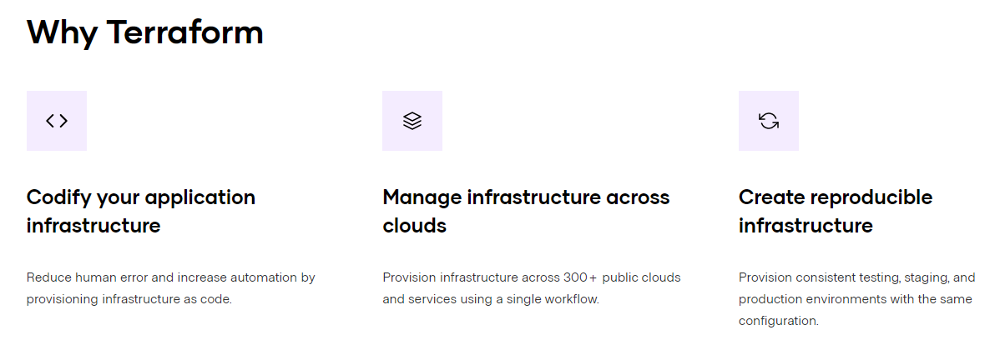

# Terraform

### 세팅 관련

첫 Terraform 세팅을 진행하면서 거친 절차 정리

접기/펼치기

1. [Chocolatey 설치](https://chocolatey.org/install)
2. [Chocolatey For VS Code 설치](https://community.chocolatey.org/packages/vscode.install/1.40.0)

- 여기서 1번과 2번의 설치 과정은 별개이고, 1 번의 경우 PowerShell에서 수행

3. [Chocolatey를 활용해서 Terraform 설치](https://www.oreilly.com/library/view/learning-devops/9781838642730/8f002fe3-7627-4b08-8991-43566494bc7f.xhtml)
4. [HashiCorp테라폼 VSCode Extension 설치](https://marketplace.visualstudio.com/items?itemName=HashiCorp.terraform)

- 마찬가지로 여기서 VSCode 확장 프로그램과 Chocolatey로 설치하는 파일은 별개다.

5. [AWS Tool VSCode Extension 설치](https://marketplace.visualstudio.com/items?itemName=AmazonWebServices.aws-toolkit-vscode)
6. AWS Tool Kit 에서 Configure 설정(터미널에 aws configure 입력 후, AccessId Key 작성)

### 참고할 만한 글

- [HashcorpLearn](https://learn.hashicorp.com/)
- [blog/what-is-terraform-and-why-is-it-important](https://www.fairwinds.com/blog/what-is-terraform-and-why-is-it-important)
- [gentledev10 블로그](https://velog.io/@gentledev10/terraform-workspace)

### 테라폼이란

- Running infrastructure at any scale almost always guarantees a dizzying array of components and configurations. To further complicate things, different teams within an organization may have the need for similar infrastructures with slight variations. That infrastructure may be spread over multiple topographies, from on-premise to one or more cloud vendors.

- At Fairwinds, we build Kubernetes infrastructure for clients that is scalable, secure, and reliable. Along with running applications with Kubernetes, our work includes configuring networking, compute resources, storage, as well as supporting components like monitoring. To ensure that best practices for building infrastructure are maintained for all our clients, we use common patterns for our clients that provide both consistency and customization where needed.

- Terraform is our tool of choice to manage the entire lifecycle of infrastructure using infrastructure as code. That means declaring infrastructure components in configuration files that are then used by Terraform to provision, adjust and tear down infrastructure in various cloud providers.

- 인프라는 수많은 요소와 설정 정보들 그리고 더 복잡한 요소들로 구성됩니다. 만약 어느정도 규모가 있는 조직에서 인프라를 다룬다고 할 때, 그리고 조직의 각 팀에서 조금씩 다른 바리에이션의 인프라를 요구할 수 있습니다.
- 클라이언트에게 scalable, secure, reliable 특징의 `쿠버네트Kubernetes` 인프라를 제공합니다. 네트워크, 자원 처리, 저장소, 모니터링과 같은 요소들을 구성하는 기능을 포함하며, 사용자에게 베스트 프랙티스를 제공하기 위해 일관적이고 커스터마이징 가능한 공통패턴을 사용합니다.
- 테라폼은 Infrastructure as code. 즉 코드를 통해 인프라를 관리할 수 있게 합니다. 이것은 인프라 요소들을 특정 configuration file 에 선언해두면 해당 문서가 테라폼에 의해 다양한 클라우드 환경에(aws와 같은) 제공되고, 조정되고, 해체될 수 있다는 것입니다.

#### Terraform Core Element

- The first resource that will need to be defined in any project using Terraform is the provider, as this is what gives you access to the API you will be interacting with to create resources. Once the provider has been configured and authenticated, a vast amount of resources are now available to be created. Each cloud provider has their own set of resources; a few examples are an aws_vpc, a google_dns_record_set, and an azuread_application. Resources, according to Terraform, are “the most important element in the Terraform language”. This is where you describe the piece of infrastructure to be created; and this can range from a compute instance to defining specific permissions and much more.

- Provider : 사용자가 인프라 자원을 생성하기 위한 API 를 제공한다.
- 각각의 Provider 들은 Resource 셋을 가지고 있다. (aws_vpc, google_dns_record_set 등등)
- Resource 는 테라폼에서 가장 중요한 요소이며 생성될 인프라 요소를 명시한다.
- Data source 는 Terraform 을 사용하지 않고 만든 infrastructure resource 또는 다른 곳에서 사용중인 Terraform code 를 통해 만들어진 resource 의 Data 를 가져오는데 사용된다.
각각의 provider 들은 resource 와 함께 data source 도 제공하고 있다.
